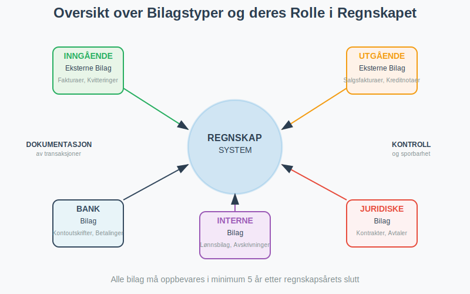

**Bilag** er grunnleggende støttedokumenter som dokumenterer alle forretningshendelser i regnskapet. De fungerer som bevis for at en transaksjon har funnet sted og gir nødvendig informasjon for korrekt [bokføring](/blogs/regnskap/hva-er-bokføring "Hva er Bokføring? En Komplett Guide til Norsk Bokføringspraksis"). Uten bilag ville regnskapet mangle troverdighet og kunne ikke oppfylle lovkravene til dokumentasjon. Bilag er derfor selve fundamentet for pålitelig [regnskapsføring](/blogs/regnskap/hva-er-regnskap "Hva er Regnskap? En Komplett Guide til Norsk Regnskapsføring") og er essensielle for [internkontroll](/blogs/regnskap/hva-er-attestering "Hva er Attestering? En Komplett Guide til Bilagsbehandling og Godkjenning") i alle bedrifter.

For en komplett guide til bilag i regnskap, se [Bilag i Regnskap](/blogs/regnskap/bilag "Bilag i Regnskap “ Guide til Dokumentasjon og Behandling").

## Hva er et Bilag?

Et bilag er ethvert dokument som dokumenterer en forretningshendelse og gir grunnlag for en regnskapspostering. Bilag kan være både **inngående** (mottatt fra eksterne parter) og **utgående** (sendt til eksterne parter), samt **interne** (opprettet internt i bedriften). Alle bilag må inneholde tilstrekkelig informasjon til at transaksjonen kan rekonstrueres og kontrolleres på et senere tidspunkt.

### Lovkrav til Bilag

I henhold til **[bokføringsloven](/blogs/regnskap/hva-er-bokføringsloven "Hva er Bokføringsloven? Krav, Regler og Praktisk Veiledning")** og **[bokføringsforskriften](/blogs/regnskap/hva-er-bokføringsforskriften "Hva er Bokføringsforskriften? Komplett Guide til Norske Bokføringskrav og Regler")** må alle regnskapspostringer være dokumentert med bilag. Bilagene må oppbevares i minst **5 år** etter regnskapsårets slutt, og de må være tilgjengelige for kontroll av skattemyndighetene og revisor.

For en omfattende guide til korrekt **[oppbevaring av regnskapsmateriale](/blogs/regnskap/oppbevaring-av-regnskapsmateriale "Oppbevaring av Regnskapsmateriale - Krav, Frister og Beste Praksis i Norge")**, inkludert lovkrav, oppbevaringsfrister, digitale løsninger og sikkerhetsprinsipper, se vår detaljerte artikkel.

Disse kravene er en del av det omfattende regelverket som styrer norsk regnskapsføring. For en detaljert gjennomgang av alle [bokføringsregler](/blogs/regnskap/hva-er-bokføringsregler "Hva er Bokføringsregler? Komplett Guide til Norske Bokføringsstandarder") og standarder, anbefaler vi vår komplette guide.

## Typer Bilag i Regnskapet

Bilag kan kategoriseres på flere måter avhengig av deres opprinnelse, innhold og funksjon. Her er en oversikt over de viktigste typene:

### Eksterne Bilag

Eksterne bilag er dokumenter som utveksles med parter utenfor bedriften:

#### Inngående Eksterne Bilag

* **[Fakturaer](/blogs/regnskap/hva-er-en-faktura "Hva er en Faktura? En Guide til Norske Fakturakrav")** - Krav om betaling fra leverandører
* **[Pakkesedler](/blogs/regnskap/hva-er-pakkeseddel "Hva er Pakkeseddel? Komplett Guide til Leveringsdokumentasjon og Regnskap")** - Leveringsdokumenter som følger med vareleveranser
* **Sluttseddel** - Dokumentasjon av sluttavregning for leveranser og tjenester, se [Sluttseddel](/blogs/regnskap/sluttseddel "Sluttseddel i regnskap")
* **Kvitteringer** - Bevis for kontantbetaling
* **Kontoutskrifter** - Oversikt over banktransaksjoner
* **Tolldeklarasjoner** - Dokumentasjon av import/eksport
* **Forsikringspoliser** - Avtaler om forsikringsdekning
* **[Leasing](/blogs/regnskap/leasing "Leasing i regnskap - Komplett guide til leasing i norsk regnskap")** - Avtaler om leasing av [anleggsmidler](/blogs/regnskap/hva-er-anleggsmidler "Hva er Anleggsmidler? Komplett Guide til Varige Driftsmidler")

#### Utgående Eksterne Bilag

* **Salgsfakturaer** - Krav om betaling til kunder
* **[Pakkesedler](/blogs/regnskap/hva-er-pakkeseddel "Hva er Pakkeseddel? Komplett Guide til Leveringsdokumentasjon og Regnskap")** - Leveringsdokumenter sendt med egne vareleveranser
* **Kreditnotaer** - Korrigeringer av tidligere fakturaer
* **Betalingsbilag** - Dokumentasjon av utbetalinger
* **[Betalingsoppfordringer](/blogs/regnskap/hva-er-betalingsoppfordring "Betalingsoppfordring - Komplett Guide til Purring og Inkasso i Norge")** - Purringer til kunder

### Interne Bilag

Interne bilag opprettes av bedriften selv for å dokumentere interne hendelser:

* **Lønnsbilag** - Dokumentasjon av lønnsutbetalinger og [arbeidsgiveravgift](/blogs/regnskap/hva-er-arbeidsgiveravgift "Hva er Arbeidsgiveravgift? Satser, Beregning og Regnskapsføring")
* **[Avskrivningsbilag](/blogs/regnskap/hva-er-avskrivning "Hva er Avskrivning? Metoder, Beregning og Regnskapsføring")** - Dokumentasjon av verdifall på anleggsmidler
* **Periodiseringsbilag** - Fordeling av kostnader og inntekter over flere perioder
* **Korrigeringsbilag** - Rettelser av tidligere posteringer
* **Varetellingslister** - Dokumentasjon av lageropptelling
* **Reiseregninger** - Dokumentasjon av ansattes utlegg og [godtgjørelser](/blogs/regnskap/hva-er-godtgjorelse "Hva er Godtgjørelse (Regnskap)? Komplett Guide til Refusjon og Utlegg")

## Oversikt over Bilagstyper og Oppbevaringskrav

| **Bilagstype** | **Beskrivelse** | **Oppbevaringstid** |
|---|---|---|
| [Inngående faktura](/blogs/regnskap/hva-er-en-faktura "Hva er en Faktura? En Guide til Norske Fakturakrav") | Dokumentasjon av kjøp fra leverandører | Minst 5 år |
| [Utgående faktura](/blogs/regnskap/hva-er-en-faktura "Hva er en Faktura? En Guide til Norske Fakturakrav") | Dokumentasjon av salg til kunder | Minst 5 år |
| **Kvittering** | Dokumentasjon av kontantbetaling | Minst 5 år |
| [Kontoutskrift](/blogs/regnskap/hva-er-banktransaksjoner "Hva er Banktransaksjoner? Komplett Guide til Bankoperasjoner") | Dokumentasjon av banktransaksjoner | Minst 5 år |
| **Lønnsbilag** | Dokumentasjon av lønnsutbetalinger | Minst 5 år |
| [Internt bilag](/blogs/regnskap/hva-er-bilag "Hva er Bilag? En Komplett Guide til Regnskapsbilag") | Intern dokumentasjon av forretningshendelser | Minst 5 år |

## Krav til Bilagsinnhold

For at et bilag skal være gyldig for regnskapsføring, må det inneholde visse **obligatoriske opplysninger**:

| **Opplysning** | **Beskrivelse** | **Eksempel** |
|---|---|---|
| **Dato** | Når transaksjonen fant sted | 15.03.2024 |
| **Beløp** | Transaksjonens verdi inkl. MVA | 12.500,00 kr |
| **Parter** | Hvem som er involvert | Leverandør AS og Kjøper AS |
| **Beskrivelse** | Hva transaksjonen gjelder | Kjøp av kontormøbler |
| **MVA-behandling** | Merverdiavgift spesifisert | 2.500,00 kr (25% MVA) |
| **[Kontering](/blogs/regnskap/hva-er-kontering "Hva er Kontering? En Komplett Guide til Kontokoding i Regnskap")** | Hvilke kontoer som berøres | Konto 1200 og 2700 |

### Spesielle Krav for Ulike Bilagstyper

Enkelte bilagstyper har **tilleggskrav** utover de grunnleggende opplysningene:

* **Fakturaer**: Må inneholde [fakturanummer](/blogs/regnskap/hva-er-fakturanummer "Hva er Fakturanummer? Komplett Guide til Nummerering og Lovkrav"), [organisasjonsnummer og betalingsfrist](/blogs/regnskap/hva-er-en-faktura "Hva er en Faktura? En Guide til Norske Fakturakrav")
* **Kvitteringer**: Må være maskinelt utskrevet eller digitalt generert
* **Reiseregninger**: Må dokumentere forretningsformål og være godkjent av overordnet
* **Kontantbilag**: Må ha kvittering eller annen form for betalingsbevis

## Digitale Bilag og Elektronisk Arkivering

Moderne bedrifter beveger seg stadig mer mot **digitale bilagsløsninger**. Dette gir betydelige fordeler i form av effektivitet, søkbarhet og plassbesparelse, men krever også at visse tekniske og juridiske krav oppfylles.

### Fordeler med Digitale Bilag

* **Økt effektivitet** - Raskere behandling og godkjenning
* **Bedre søkbarhet** - Enkel gjenfinning av historiske bilag
* **Reduserte kostnader** - Mindre behov for fysisk lagring
* **Forbedret internkontroll** - Automatiske kontroller og sporbarhet
* **Miljøvennlig** - Redusert papirforbruk

### Juridiske Krav til Digitale Bilag

For at digitale bilag skal være juridisk gyldige, må de oppfylle følgende krav:

* **Autentisitet** - Bilagets opprinnelse må kunne verifiseres
* **Integritet** - Innholdet må ikke kunne endres uten at det oppdages
* **Lesbarhet** - Bilag må være lesbare gjennom hele oppbevaringsperioden
* **Tilgjengelighet** - Må være tilgjengelige for kontroll av myndigheter

### Tekniske Løsninger for Digital Bilagsbehandling

Moderne regnskapssystemer tilbyr omfattende funksjoner for digital bilagsbehandling:

* **OCR-teknologi** - Automatisk gjenkjenning av tekst i bilag
* **[Automatisk kontering](/blogs/regnskap/hva-er-kontering "Hva er Kontering? En Komplett Guide til Kontokoding i Regnskap")** - Forslag til kontoføring basert på bilagsinnhold
* **Workflow-styring** - Automatiserte godkjenningsprosesser
* **Integrasjoner** - Kobling til bank og andre systemer
* **Backup og sikkerhet** - Sikker lagring med redundans

## Bilagsbehandling og Internkontroll

Effektiv bilagsbehandling er en kritisk del av bedriftens internkontroll. En systematisk tilnærming sikrer at alle transaksjoner blir korrekt dokumentert og godkjent før de bokføres.

### Bilagsbehandlingsprosessen

En typisk bilagsbehandlingsprosess består av følgende trinn:

1. **Mottak og registrering** - Bilag mottas og registreres i systemet
2. **Saklig kontroll** - Verifisering av at varen/tjenesten er levert
3. **Regnskapsmessig kontroll** - Kontroll av kontering og MVA-behandling
4. **[Attestering](/blogs/regnskap/hva-er-attestering "Hva er Attestering? En Komplett Guide til Bilagsbehandling og Godkjenning")** - Godkjenning av autorisert person
5. **Bokføring** - Registrering i regnskapet
6. **Betaling** - Utbetaling til leverandør
7. **Arkivering** - Lagring for fremtidig referanse

### Ansvarsfordeling i Bilagsbehandling

For å sikre god internkontroll bør ulike personer ha ansvar for forskjellige deler av prosessen:

| **Rolle** | **Ansvar** | **Kontrollpunkt** |
|---|---|---|
| **Bestiller** | Bestilling av varer/tjenester | Forretningsformål |
| **Mottaker** | Mottak og kvalitetskontroll | Levering i henhold til bestilling |
| **Regnskapsfører** | Kontering og MVA-behandling | Korrekt regnskapsføring |
| **Attestant** | Godkjenning av betaling | Fullmakt og budsjett |
| **Kasserer** | Utbetaling | Godkjent bilag |

### Kontrollrutiner for Bilag

Bedrifter bør etablere faste rutiner for bilagskontroll:

* **Nummerserier** - Alle bilag skal ha unike, fortløpende numre
* **Kompletthetssjekk** - Kontroll av at alle obligatoriske opplysninger er til stede
* **Beløpskontroll** - Verifisering av beregninger og summer
* **Autorisasjonskontroll** - Sikring av at kun autoriserte personer kan godkjenne
* **Periodisk gjennomgang** - Regelmessig kontroll av bilagsbehandlingen
* **Daglig kontroll** - Integrert del av [dagsoppgjør](/blogs/regnskap/hva-er-dagsoppgjør "Hva er Dagsoppgjør i Regnskap? Prosess, Rutiner og Beste Praksis") rutiner

## Oppbevaring og Arkivering av Bilag

Korrekt oppbevaring av bilag er ikke bare et lovkrav, men også en praktisk nødvendighet for bedriftens drift og kontroll. Bilag utgjør en sentral del av den totale [dokumentasjonen i regnskap og bokføring](/blogs/regnskap/hva-er-dokumentasjon-regnskap-bokforing "Hva er Dokumentasjon i Regnskap og Bokføring? Komplett Guide til Regnskapsdokumentasjon"), som omfatter alle aspekter av regnskapsdokumentasjon fra lovkrav til moderne digitale løsninger.

### Oppbevaringsfrister

Norsk lovgivning stiller klare krav til hvor lenge ulike typer bilag må oppbevares:

* **Regnskapsbilag**: Minimum **5 år** etter regnskapsårets slutt
* **Lønnsbilag**: Minimum **5 år** etter utbetaling
* **MVA-bilag**: Minimum **5 år** etter innlevering av MVA-melding
* **Årsregnskap**: **10 år** etter regnskapsårets slutt
* **Styreprotokoller**: **10 år** etter møtedato

### Fysisk vs. Digital Oppbevaring

Bedrifter kan velge mellom fysisk og digital oppbevaring, eller en kombinasjon:

#### Fysisk Oppbevaring

**Fordeler:**
* Enkel å implementere
* Ingen tekniske krav
* Akseptert av alle myndigheter

**Ulemper:**
* Krever fysisk lagringsplass
* Vanskelig å søke i
* Risiko for skade eller tap
* Høye kostnader ved store volumer

#### Digital Oppbevaring

**Fordeler:**
* Plassbesparende
* Enkel søking og gjenfinning
* Bedre sikkerhet med backup
* Lavere kostnader på lang sikt

**Ulemper:**
* Krever teknisk kompetanse
* Avhengig av teknologi
* Må oppfylle juridiske krav til integritet

### Arkiveringssystemer

Uavhengig av om bilag oppbevares fysisk eller digitalt, må de organiseres systematisk:

* **Kronologisk arkivering** - Sortert etter dato
* **Numerisk arkivering** - Sortert etter bilagsnummer
* **Tematisk arkivering** - Gruppert etter type eller leverandør
* **Kombinert system** - Blanding av flere metoder

## Vanlige Feil og Utfordringer

Mange bedrifter opplever utfordringer med bilagsbehandling. Her er de mest vanlige problemene og hvordan de kan løses:

### Manglende eller Ufullstendige Bilag

**Problem:** Bilag som mangler obligatoriske opplysninger eller som ikke kan dokumentere transaksjonen tilstrekkelig.

**Løsning:**
* Etabler klare rutiner for hva som kreves av bilag
* Opplær ansatte i bilagskrav
* Implementer kontroller som fanger opp mangler før bokføring

### Forsinket Bilagsbehandling

**Problem:** Bilag som ikke behandles i tide, noe som kan føre til forsinkede betalinger og dårlige leverandørforhold.

**Løsning:**
* Digitaliser bilagsbehandlingen for økt hastighet
* Etabler klare frister for behandling
* Implementer automatiske påminnelser

### Tap av Bilag

**Problem:** Fysiske bilag som forsvinner eller blir skadet.

**Løsning:**
* Digitaliser bilag umiddelbart ved mottak
* Etabler backup-rutiner
* Bruk sikre oppbevaringssystemer

### Feil Kontering

**Problem:** Bilag som konteres på feil kontoer, noe som gir feil regnskapsinformasjon.

**Løsning:**
* Opplær regnskapsførere i korrekt kontering
* Bruk automatisk konteringsforslag
* Implementer kontroller og gjennomgang

## Beste Praksis for Bilagsbehandling

For å sikre effektiv og korrekt bilagsbehandling anbefaler vi følgende beste praksis:

### Organisatoriske Tiltak

* **Etabler klare rutiner** - Dokumenter alle prosesser for bilagsbehandling
* **Definer roller og ansvar** - Sørg for at alle vet sitt ansvar
* **Opplær ansatte** - Gi regelmessig opplæring i bilagskrav og -rutiner
* **Gjennomfør regelmessige kontroller** - Kontroller kvaliteten på bilagsbehandlingen

### Teknologiske Løsninger

* **Invester i moderne regnskapssystem** - Velg system med god bilagshåndtering
* **Implementer OCR-teknologi** - Automatiser dataregistrering
* **Bruk workflow-styring** - Automatiser godkjenningsprosesser
* **Etabler integrasjoner** - Koble sammen ulike systemer

### Sikkerhet og Kontroll

* **Implementer tilgangskontroll** - Begrens hvem som kan behandle bilag
* **Etabler sporbarhet** - Logg alle endringer og handlinger
* **Sikre backup** - Beskytt mot tap av data
* **Gjennomfør regelmessige revisjoner** - Kontroller at rutinene følges

## Fremtiden for Bilagsbehandling

Bilagsbehandling er i kontinuerlig utvikling, drevet av teknologiske fremskritt og endrede forventninger:

### Kunstig Intelligens og Maskinlæring

* **Automatisk kategorisering** - AI kan automatisk klassifisere bilag
* **Intelligent kontering** - Maskinlæring kan foreslå korrekt kontering
* **Anomalideteksjon** - AI kan oppdage uvanlige mønstre og potensielle feil
* **Prediktiv analyse** - Forutsi fremtidige utgifter basert på historiske data

### Blockchain og Distribuerte Systemer

* **Uforanderlige poster** - Blockchain kan sikre at bilag ikke kan endres
* **Desentralisert lagring** - Redusert avhengighet av sentrale systemer
* **Smart kontrakter** - Automatisk utførelse av avtaler basert på bilag

### Økt Automatisering

* **Robotprosessautomatisering (RPA)** - Automatisering av repetitive oppgaver
* **Integrerte økosystemer** - Sømløs dataflyt mellom systemer
* **Sanntidsbehandling** - Øyeblikkelig behandling av bilag ved mottak

Bilagsbehandling vil fortsette å utvikle seg, men grunnprinsippene om dokumentasjon, kontroll og sporbarhet vil forbli sentrale for pålitelig regnskapsføring. Bedrifter som investerer i moderne løsninger og etablerer gode rutiner vil være best posisjonert for fremtiden.

## Konklusjon

Bilag er fundamentet for pålitelig regnskapsføring og god internkontroll. Ved å forstå de ulike typene bilag, lovkravene som gjelder, og beste praksis for behandling og oppbevaring, kan bedrifter sikre korrekt dokumentasjon av alle forretningshendelser.

Moderne teknologi tilbyr betydelige muligheter for å effektivisere bilagsbehandlingen, men det er viktig å huske at teknologien må støtte, ikke erstatte, grunnleggende prinsipper for god regnskapsskikk. Uavhengig av hvilke verktøy som brukes, må bilag fortsatt inneholde nødvendig informasjon, behandles av kompetente personer, og oppbevares i henhold til lovkravene.

For bedrifter som ønsker å forbedre sin bilagsbehandling, anbefaler vi å starte med en gjennomgang av eksisterende rutiner, identifisere forbedringsområder, og deretter implementere løsninger som passer bedriftens størrelse og behov. Med riktig tilnærming kan effektiv bilagsbehandling bli en konkurransefordel som bidrar til bedre økonomistyring og økt lønnsomhet.

