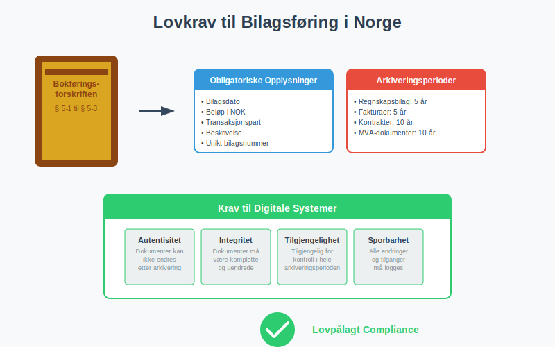
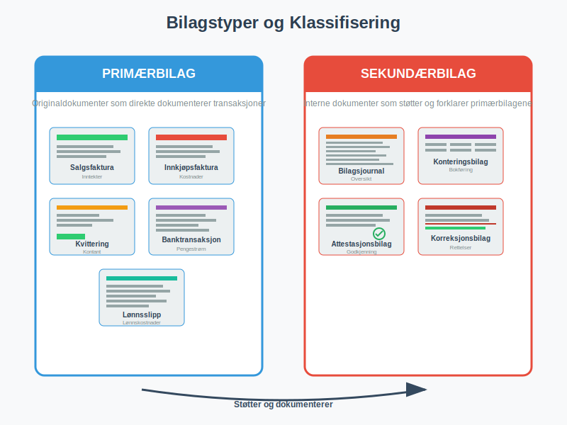
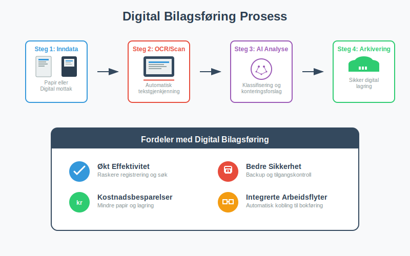
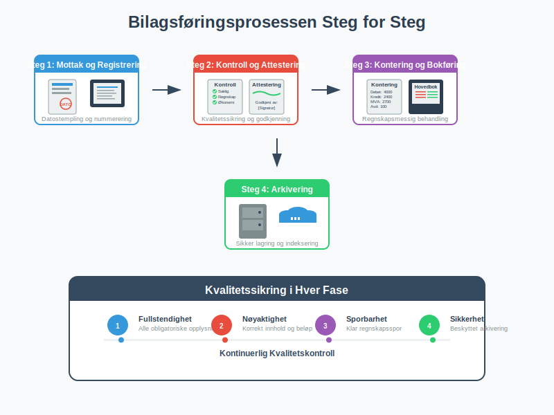
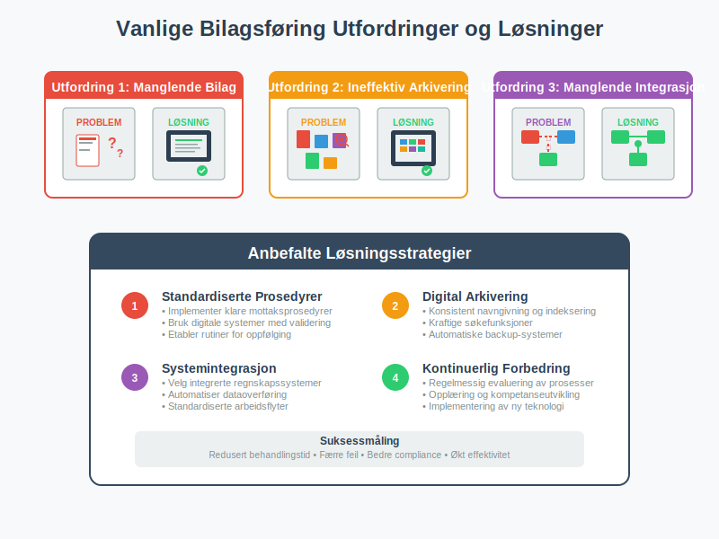

---
title: "Hva er Bilagsføring?"
seoTitle: "Hva er Bilagsføring?"
description: '**Bilagsføring** er den systematiske prosessen med å registrere, organisere og arkivere alle regnskapsdokumenter som danner grunnlaget for [bokføring](/blogs...'
---

**Bilagsføring** er den systematiske prosessen med å registrere, organisere og arkivere alle regnskapsdokumenter som danner grunnlaget for [bokføring](/blogs/regnskap/hva-er-bokforing "Hva er Bokføring? En Komplett Guide til Norsk Bokføringspraksis"). Dette omfatter alt fra [fakturaer](/blogs/regnskap/hva-er-en-faktura "Hva er en Faktura? En Guide til Norske Fakturakrav") og [kvitteringer](/blogs/regnskap/kvittering "Hva er Kvittering? En Guide til Kvitteringskrav i Norsk Regnskap") til [arbeidskontrakter](/blogs/regnskap/arbeidskontrakten "Arbeidskontrakten") og banktransaksjoner. Korrekt bilagsføring er ikke bare et lovkrav, men også fundamentet for pålitelig regnskapsføring og effektiv [attestering](/blogs/regnskap/hva-er-attestering "Hva er Attestering? En Komplett Guide til Bilagsbehandling og Godkjenning") av forretningsdokumenter.

(For en generell oversikt over **bilag** i regnskap, se [Bilag](/blogs/regnskap/bilag "Bilag i Regnskap “ Guide til Dokumentasjon og Behandling").)

Som en sentral del av den totale [dokumentasjonen i regnskap og bokføring](/blogs/regnskap/hva-er-dokumentasjon-regnskap-bokforing "Hva er Dokumentasjon i Regnskap og Bokføring? Komplett Guide til Regnskapsdokumentasjon"), sikrer bilagsføring sporbarhet og etterprøvbarhet av alle økonomiske transaksjoner.

I Norge reguleres bilagsføring av **[bokføringsforskriften](/blogs/regnskap/hva-er-bokføringsforskriften "Hva er Bokføringsforskriften? Komplett Guide til Norske Bokføringskrav og Regler")**, som stiller strenge krav til dokumentasjon og arkivering. Moderne bedrifter benytter i økende grad digitale løsninger for å effektivisere bilagsbehandlingen, men grunnprinsippene for korrekt dokumentasjon forblir de samme.

## Lovkrav til Bilagsføring i Norge

[Bokføringsforskriften](/blogs/regnskap/hva-er-bokføringsforskriften "Hva er Bokføringsforskriften? Komplett Guide til Norske Bokføringskrav og Regler") § 5-1 til § 5-3 definerer klare krav til hvordan bilag skal behandles og arkiveres. Disse kravene sikrer at regnskapet kan etterprøves og at bedriften kan dokumentere alle transaksjoner overfor skattemyndighetene.

### Grunnleggende Dokumentasjonskrav

Alle regnskapsbilag må inneholde følgende **obligatoriske opplysninger**:

* **Bilagsdato:** Når transaksjonen fant sted
* **Beløp:** Transaksjonens verdi i norske kroner
* **Transaksjonspart:** Hvem bedriften handlet med
* **Beskrivelse:** Hva transaksjonen gjaldt
* **Bilagsnummer:** Unikt identifikasjonsnummer for sporbarhet

### Arkiveringsperioder

Ulike typer bilag har forskjellige arkiveringsperioder som må overholdes:

| Bilagstype | Arkiveringsperiode | Lovgrunnlag |
|------------|-------------------|-------------|
| Regnskapsbilag | 5 år | Bokføringsforskriften § 13-2 |
| [Fakturaer](/blogs/regnskap/hva-er-en-faktura "Hva er en Faktura? En Guide til Norske Fakturakrav") og [kvitteringer](/blogs/regnskap/kvittering "Hva er Kvittering? En Guide til Kvitteringskrav i Norsk Regnskap") | 5 år | Bokføringsforskriften § 13-2 |
| Kontrakter og avtaler | 10 år | Bokføringsforskriften § 13-3 |
| Lønnsbilag | 5 år | Bokføringsforskriften § 13-2 |
| MVA-dokumenter | 10 år | Merverdiavgiftsloven § 21-3 |

## Bilagstyper og Klassifisering

Effektiv bilagsføring krever systematisk klassifisering av ulike dokumenttyper. Dette letter både daglig arbeid og fremtidig gjenfinning av dokumenter.

### Primærbilag

**Primærbilag** er originaldokumenter som direkte dokumenterer en forretningstransaksjon:

* **Salgsfakturaer:** Dokumenterer inntekter fra kunder
* **Innkjøpsfakturaer:** Dokumenterer kostnader fra leverandører  
* **Kvitteringer:** Bevis for kontantbetalinger
* **[Banktransaksjoner](/blogs/regnskap/hva-er-banktransaksjoner "Hva er Banktransaksjoner? Komplett Guide til Bankoppgjør og Regnskapsføring"):** Dokumenterer pengestrømmer
* **Lønnsslipp:** Dokumenterer lønnskostnader

### Sekundærbilag

**Sekundærbilag** er interne dokumenter som støtter og forklarer primærbilagene:

* **Bilagsjournal:** Oversikt over alle registrerte bilag
* **Konteringsbilag:** Spesifiserer hvordan transaksjoner skal bokføres
* **Attestasjonsbilag:** Dokumenterer godkjenning av transaksjoner
* **Korreksjonsbilag:** Retter feil i tidligere registreringer

## Digital Bilagsføring og Moderne Løsninger

Digitalisering har revolusjonert bilagsføring, og mange bedrifter har gått over til **papirløse løsninger**. Dette krever imidlertid at digitale systemer oppfyller samme kvalitetskrav som tradisjonell papirbasert arkivering.

### Krav til Digitale Systemer

For at digitale bilagssystemer skal være lovlige, må de oppfylle følgende krav:

* **Autentisitet:** Systemet må sikre at dokumenter ikke kan endres etter arkivering
* **Integritet:** Dokumenter må være komplette og uendrede
* **Tilgjengelighet:** Dokumenter må være tilgjengelige for kontroll i hele arkiveringsperioden
* **Sporbarhet:** Alle endringer og tilganger må logges

### Fordeler med Digital Bilagsføring

Digital bilagsføring gir betydelige fordeler sammenlignet med tradisjonelle papirbaserte systemer:

* **Økt effektivitet:** Raskere registrering og søk i dokumenter
* **Bedre sikkerhet:** Automatisk backup og tilgangskontroll
* **Kostnadsbesparelser:** Reduserte kostnader til papir, lagring og håndtering
* **Miljøvennlig:** Mindre papirforbruk og fysisk lagringsbehov
* **Integrerte arbeidsflyter:** Automatisk kobling til [attestering](/blogs/regnskap/hva-er-attestering "Hva er Attestering? En Komplett Guide til Bilagsbehandling og Godkjenning") og bokføring

## Bilagsføringsprosessen Steg for Steg

En systematisk tilnærming til bilagsføring sikrer at ingen dokumenter går tapt og at alle transaksjoner blir korrekt registrert.

### Steg 1: Mottak og Registrering

Når et bilag mottas, må det umiddelbart:

* **Datostempeles** med mottaksdato
* **Tildeles et unikt bilagsnummer** fra en sammenhengende nummerserie
* **Registreres i bilagsjournalen** med grunnleggende informasjon
* **Kontrolleres for fullstendighet** av obligatoriske opplysninger

### Steg 2: Kontroll og Attestering

Før et bilag kan bokføres, må det gjennom en grundig kontrollprosess:

* **Saklig kontroll:** Er varen/tjenesten faktisk mottatt?
* **Regnskapsmessig kontroll:** Er bilagets innhold korrekt og komplett?
* **Økonomisk kontroll:** Er kjøpet innenfor budsjett og [fullmakter](/blogs/regnskap/fullmakt "Fullmakt i Regnskap: Guide til Autorisasjon og Signatur i Norsk Regnskap")?
* **Formell godkjenning:** [Attestering](/blogs/regnskap/hva-er-attestering "Hva er Attestering? En Komplett Guide til Bilagsbehandling og Godkjenning") av autorisert person

### Steg 3: Kontering og Bokføring

Etter godkjenning må bilagets **regnskapsmessige behandling** bestemmes:

* **Kontokoding:** Hvilke kontoer skal belastes/krediteres?
* **MVA-behandling:** Korrekt merverdiavgiftshåndtering
* **Kostnadssted:** Fordeling på avdelinger eller prosjekter
* **Periodisering:** Riktig regnskapsperiode for transaksjonen

### Steg 4: Arkivering

Det siste steget er permanent arkivering av bilagets:

* **Fysisk eller digital lagring** i henhold til arkiveringsreglene
* **Indeksering** for enkel gjenfinning
* **Sikkerhetskopi** for å beskytte mot tap
* **Tilgangskontroll** for å sikre konfidensialitet

## Internkontroll og Kvalitetssikring

Effektiv bilagsføring krever robuste **internkontrollsystemer** som sikrer at alle prosedyrer følges konsekvent og at feil oppdages raskt.

### Segregering av Oppgaver

For å redusere risiko for feil og misligheter bør følgende oppgaver være adskilt:

* **Bilagsmottak** og **bilagsregistrering**
* **Attestering** og **bokføring**  
* **Betalingsutførelse** og **regnskapsføring**
* **Arkivering** og **tilgangskontroll**

### Regelmessige Kontroller

Systematiske kontroller bør utføres for å sikre kvaliteten på bilagsføringen:

* **Månedlige avstemminger** mellom bilagsjournal og hovedbok
* **Stikkprøvekontroller** av bilagskvalitet og fullstendighet
* **Årlige gjennomganger** av arkiveringsprosedyrer
* **Revisjonsklargjøring** med dokumentasjon av alle prosesser

## Vanlige Utfordringer og Løsninger

Mange bedrifter møter lignende utfordringer i bilagsføringen. Her er de mest vanlige problemene og anbefalte løsninger:

### Utfordring 1: Manglende eller Ufullstendige Bilag

**Problem:** Bilag som mangler obligatoriske opplysninger eller som ikke kan lokaliseres.

**Løsning:**
* Implementer **standardiserte mottaksprosedyrer**
* Bruk **digitale systemer** med automatisk validering
* Etabler **rutiner for oppfølging** av manglende dokumenter
* Tren personalet i **krav til bilagskvalitet**

### Utfordring 2: Ineffektiv Arkivering

**Problem:** Vanskelig å finne arkiverte bilag når de trengs.

**Løsning:**
* Innfør **konsistent navngivning** og indeksering
* Bruk **digitale søkefunksjoner** for rask gjenfinning
* Etabler **klare arkiveringsrutiner** som alle følger
* Implementer **backup-systemer** for sikkerhet

### Utfordring 3: Manglende Integrasjon

**Problem:** Bilagsføring er ikke integrert med andre regnskapsprosesser.

**Løsning:**
* Velg **integrerte regnskapssystemer** som kobler bilagsføring med bokføring
* Automatiser **dataoverføring** mellom systemer
* Etabler **standardiserte arbeidsflyter** som sikrer konsistens
* Tren personalet i **helhetlig regnskapstenkning**

## Teknologiske Trender og Fremtiden

Bilagsføring utvikler seg raskt med nye teknologier som **kunstig intelligens** og **maskinlæring**. Disse teknologiene lover å automatisere mange manuelle prosesser og redusere feilmarginer betydelig.

### Automatisk Tekstgjenkjenning (OCR)

Moderne OCR-teknologi kan automatisk lese og registrere informasjon fra bilag, noe som:

* **Reduserer manuelt arbeid** ved dataregistrering
* **Minimerer feil** fra manuell inntasting  
* **Øker hastigheten** på bilagsbehandling
* **Forbedrer sporbarhet** gjennom digital logging

### Kunstig Intelligens i Bilagsbehandling

AI-systemer kan lære å:

* **Klassifisere bilag** automatisk basert på innhold
* **Foreslå kontering** basert på historiske data
* **Oppdage avvik** og potensielle feil
* **Optimalisere arbeidsflyter** basert på bruksmønstre

## Beste Praksis for Effektiv Bilagsføring

Basert på erfaring fra ledende bedrifter, her er de viktigste anbefalingene for å etablere effektiv bilagsføring:

### 1. Etabler Klare Rutiner

* **Dokumenter alle prosesser** i skriftlige prosedyrer
* **Tren alle ansatte** i korrekte rutiner
* **Gjennomgå og oppdater** prosedyrer regelmessig
* **Sikre konsistent implementering** på tvers av organisasjonen

### 2. Invester i Riktige Verktøy

* **Velg systemer** som passer bedriftens størrelse og behov
* **Prioriter integrasjon** med eksisterende regnskapssystemer
* **Sikre skalerbarhet** for fremtidig vekst
* **Planlegg for backup** og katastrofegjenoppretting

### 3. Fokuser på Kvalitetskontroll

* **Implementer flere kontrollnivåer** for kritiske transaksjoner
* **Bruk teknologi** for automatisk validering
* **Etabler feedback-løkker** for kontinuerlig forbedring
* **Mål og følg opp** nøkkelindikatorer for kvalitet

### 4. Forbered for Fremtiden

* **Hold deg oppdatert** på teknologiske utviklinger
* **Invester i kompetanse** og opplæring
* **Vurder nye løsninger** regelmessig
* **Planlegg for endringer** i lovkrav og standarder

Korrekt bilagsføring er fundamentet for pålitelig regnskapsføring og effektiv bedriftsstyring. Ved å følge etablerte beste praksis og utnytte moderne teknologi kan bedrifter sikre både lovmessighet og operasjonell effektivitet i sin regnskapsføring.

