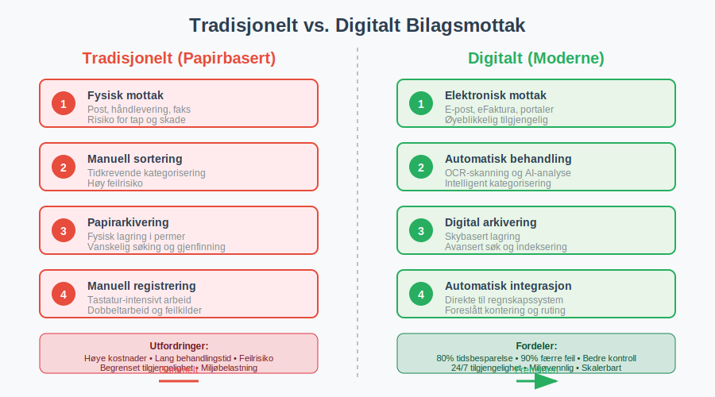

**Bilagsmottak** er den systematiske prosessen for mottak, registrering, kontroll og behandling av alle regnskapsdokumenter som kommer inn til en virksomhet. Dette omfatter primært [fakturaer](/blogs/regnskap/hva-er-en-faktura "Hva er en Faktura? En Guide til Norske Fakturakrav"), men også andre viktige bilag som [kvitteringer](/blogs/regnskap/kvittering "Hva er Kvittering? En Guide til Kvitteringskrav i Norsk Regnskap"), kontoutskrifter, lønnslipper og andre dokumenter som skal bokføres. En effektiv bilagsmottaksprosess er grunnleggende for korrekt regnskapsføring og god internkontroll.

(For en generell oversikt over **bilag** i regnskap, se [Bilag](/blogs/regnskap/bilag "Bilag i Regnskap “ Guide til Dokumentasjon og Behandling").)

Moderne bilagsmottak har utviklet seg fra tradisjonell papirbasert håndtering til digitale løsninger som automatiserer store deler av prosessen. Dette har revolusjonert hvordan bedrifter håndterer sine regnskapsdokumenter og har betydelig forbedret både effektivitet og nøyaktighet i regnskapsarbeidet.

## Tradisjonelt vs. Digitalt Bilagsmottak

Utviklingen fra papirbasert til digital dokumenthåndtering har transformert bilagsmottaksprosessen fundamentalt.

### Tradisjonelt Papirbasert Bilagsmottak

Det tradisjonelle bilagsmottaket var en manuell og tidkrevende prosess:

* **Fysisk mottak:** Dokumenter ankom per post eller ble levert fysisk
* **Manuell sortering:** Alle bilag måtte sorteres og kategoriseres for hånd
* **Papirarkivering:** Fysisk lagring i permer og arkivskap
* **Manuell registrering:** All informasjon måtte tastes inn manuelt i regnskapssystemet
* **Risiko for tap:** Fysiske dokumenter kunne mistes eller skades

### Moderne Digitalt Bilagsmottak

Dagens digitale løsninger har automatisert og effektivisert prosessen betydelig:

* **Elektronisk mottak:** [eFakturaer](/blogs/regnskap/hva-er-efaktura "Hva er eFaktura? Komplett Guide til Elektronisk Fakturering i Norge") og e-post med vedlegg
* **Automatisk skanning:** OCR-teknologi leser og tolker dokumentinnhold
* **Digital arkivering:** Sikker lagring i skyen med søkefunksjonalitet
* **Automatisk registrering:** Systemet foreslår kontering og behandling
* **Integrerte arbeidsflyter:** Sømløs overgang til [attestering](/blogs/regnskap/hva-er-attestering "Hva er Attestering? En Komplett Guide til Bilagsbehandling og Godkjenning") og betaling

## Bilagsmottaksprosessen Steg for Steg

En strukturert bilagsmottaksprosess sikrer at alle dokumenter behandles korrekt og effektivt.

### Steg 1: Mottak og Identifikasjon

Det første steget i bilagsmottaksprosessen er å motta og identifisere alle innkommende dokumenter:

* **Kanalidentifikasjon:** Bestem om dokumentet kom via post, e-post, leverandørportal eller annen kanal
* **Dokumenttype:** Klassifiser om det er en [faktura](/blogs/regnskap/hva-er-en-faktura "Hva er en Faktura? En Guide til Norske Fakturakrav"), [kvittering](/blogs/regnskap/kvittering "Hva er Kvittering? En Guide til Kvitteringskrav i Norsk Regnskap"), kontoutskrift eller annet bilag
* **Prioritering:** Vurder hastegraden basert på forfallsdato og viktighet
* **Kompletthetssjekk:** Kontroller at alle nødvendige opplysninger er tilstede

### Steg 2: Registrering og Digitalisering

Etter identifikasjon må dokumentene registreres i systemet:

* **Skanning:** Fysiske dokumenter skannes til digitalt format
* **OCR-behandling:** Automatisk utlesing av tekst og nøkkelinformasjon
* **Metadata-registrering:** Lagring av dato, leverandør, beløp og andre viktige data
* **Kvalitetskontroll:** Verifisering av at skanningen er leselig og komplett

### Steg 3: Kontroll og Validering

Før videre behandling må alle bilag kontrolleres grundig:

* **Formell kontroll:** Sjekk at alle lovpålagte opplysninger er tilstede
* **Saklig kontroll:** Verifiser at varen eller tjenesten faktisk er mottatt
* **Regnskapsmessig kontroll:** Kontroller kontering og MVA-behandling
* **Duplikatkontroll:** Sikre at samme faktura ikke behandles flere ganger

### Steg 4: Ruting og Behandling

Etter kontroll rutes dokumentene til riktig behandler:

* **Automatisk ruting:** Systemet sender bilag til riktig person basert på regler
* **Arbeidsflyt:** Dokumenter følger forhåndsdefinerte godkjenningsrutiner
* **Eskalering:** Automatisk oppfølging hvis behandling tar for lang tid
* **Statusoppdatering:** Kontinuerlig sporing av behandlingsstatus

## Typer Bilag i Bilagsmottaket

Bilagsmottaket håndterer mange forskjellige typer dokumenter, hver med sine spesifikke krav til behandling.

### Innkjøpsfakturaer

Dette er den vanligste typen bilag i de fleste virksomheter. For en detaljert gjennomgang av hvordan **[inngående fakturaer](/blogs/regnskap/innganende-faktura "Inngående Faktura - Komplett Guide til Mottak og Behandling av Leverandørfakturaer")** behandles fra mottak til betaling, se vår omfattende guide.

* **Leverandørfakturaer:** Krav om betaling for varer eller tjenester
* **Kreditnotaer:** Korrigeringer eller refusjoner fra leverandører
* **Proformafakturaer:** Foreløpige fakturaer som ikke skal bokføres som kostnad
* **Abonnementsfakturaer:** Regelmessige fakturaer for løpende tjenester

### Utgiftsbilag

Dokumentasjon for ulike typer utgifter:

* **Kvitteringer:** Bevis for kontantutlegg og småinnkjøp
* **Reiseregninger:** Dokumentasjon for reiseutgifter og utlegg som krever [godtgjørelse](/blogs/regnskap/hva-er-godtgjorelse "Hva er Godtgjørelse (Regnskap)? Komplett Guide til Refusjon og Utlegg")
* **Representasjonsbilag:** Kvitteringer for forretningsrelaterte utgifter
* **Drivstoffkvitteringer:** Spesielt viktige for fradragsberettigede kjøretøy

### Banktransaksjoner

Dokumenter relatert til [banktransaksjoner](/blogs/regnskap/hva-er-banktransaksjoner "Hva er Banktransaksjoner? Komplett Guide til Regnskapsføring"):

* **Kontoutskrifter:** Månedlige oversikter over banktransaksjoner
* **Betalingsbekreftelser:** Dokumentasjon for utførte betalinger
* **Renteavregninger:** Informasjon om påløpte renter og gebyrer
* **Valutakurser:** Dokumentasjon for valutaomregninger

## Digitale Verktøy og Teknologi

Moderne bilagsmottak er avhengig av avansert teknologi for å fungere effektivt.

### OCR-teknologi (Optical Character Recognition)

OCR-teknologi er ryggraden i moderne bilagsmottak:

* **Tekstgjenkjenning:** Automatisk utlesing av tekst fra skannede dokumenter
* **Strukturert dataekstraksjon:** Identifisering av spesifikke felt som beløp, dato og leverandør
* **Maskinlæring:** Kontinuerlig forbedring av nøyaktighet basert på behandlede dokumenter
* **Språkstøtte:** Håndtering av dokumenter på flere språk

### Arbeidsflyt-automatisering

Automatiserte arbeidsflyter effektiviserer behandlingsprosessen:

* **Regelbasert ruting:** Automatisk sending til riktig behandler basert på kriterier
* **Godkjenningsmatriser:** Forhåndsdefinerte godkjenningsnivåer basert på beløp og type
* **Eskaleringsregler:** Automatisk oppfølging ved forsinkelser
* **Integrasjoner:** Sømløs kobling til regnskapssystem og andre forretningsapplikasjoner

### Kunstig Intelligens og Maskinlæring

AI-teknologi tar bilagsmottak til neste nivå:

* **Intelligent konteringsforslag:** Systemet lærer av tidligere konteringer
* **Anomalideteksjon:** Automatisk identifisering av uvanlige transaksjoner
* **Prediktiv analyse:** Forutsigelse av kontantstrøm basert på innkommende fakturaer
* **Naturlig språkbehandling:** Forståelse av fritekstfelt og kommentarer

En spesialisert form for AI-teknologi i bilagsmottak er **[fakturatolk](/blogs/regnskap/hva-er-fakturatolk "Hva er Fakturatolk? Automatisk Fakturabehandling og OCR-teknologi")**, som kombinerer OCR og maskinlæring for å automatisk lese, tolke og behandle fakturaer. Denne teknologien kan redusere manuell behandlingstid med 80-90% og samtidig øke nøyaktigheten i dataregistreringen.

## Kontrollrutiner og Internkontroll

Effektive kontrollrutiner er essensielle for å sikre nøyaktighet og forhindre feil i bilagsmottaket.

### Segregering av Oppgaver

En grunnleggende internkontrollprinsipp er å skille ulike oppgaver:

| Oppgave | Ansvarlig | Kontrollpunkt |
|---------|-----------|---------------|
| **Mottak av bilag** | Administrasjon | Registrering i mottaksjournal |
| **Kontroll av innhold** | Fagansvarlig | Verifisering mot bestilling/kontrakt |
| **Kontering** | Regnskapsfører | Korrekt klassifisering og MVA-behandling |
| **Godkjenning** | Leder/Økonomiansvarlig | Budsjett- og [fullmaktskontroll](/blogs/regnskap/fullmakt "Fullmakt i Regnskap: Guide til Autorisasjon og Signatur i Norsk Regnskap") |
| **Betaling** | Økonomiavdeling | Siste kontroll før utbetaling |

### Firepunkts-kontroll

En systematisk tilnærming til fakturabehandling:

1. **Bestillingskontroll:** Sammenligning med godkjent bestilling eller kontrakt
2. **Mottakskontroll:** Verifisering at varer/tjenester faktisk er levert
3. **Priskontroll:** Kontroll av priser mot avtaler og markedspriser
4. **Regnskapskontroll:** Korrekt kontering og MVA-behandling

### Duplikatkontroll

Forhindring av dobbeltbehandling av samme dokument:

* **Automatisk duplikatsjekk:** Systemet sammenligner fakturanummer og leverandør
* **Beløpsmatching:** Identifisering av identiske beløp fra samme leverandør
* **Datoanalyse:** Flagging av fakturaer med samme dato og lignende innhold
* **Manuell verifisering:** Menneskeleg kontroll av potensielle duplikater

## Utfordringer og Løsninger

Bilagsmottak står overfor flere utfordringer som krever strategiske løsninger.

### Vanlige Utfordringer

| Utfordring | Beskrivelse | Konsekvenser |
|------------|-------------|--------------|
| **Manglende standardisering** | Leverandører sender bilag i ulike formater | Økt behandlingstid og feilrisiko |
| **Dårlig dokumentkvalitet** | Utydelige skanninger eller håndskrift | Forsinkelser og feilregistreringer |
| **Volumsvingninger** | Store variasjoner i antall bilag | Kapasitetsproblemer og køer |
| **Komplekse godkjenningsrutiner** | Mange godkjenningsnivåer og unntak | Lange behandlingstider |
| **Integrasjonsutfordringer** | Problemer med systemintegrasjoner | Manuelt dobbeltarbeid |

### Strategiske Løsninger

#### Leverandørsamarbeid

Aktivt samarbeid med leverandører kan betydelig forbedre bilagskvaliteten:

* **Standardiserte formater:** Avtaler om faste fakturaformater og datastrukturer
* **Elektronisk fakturering:** Overgang til strukturerte elektroniske fakturaer
* **Leverandørportaler:** Selvbetjeningsløsninger for leverandører
* **Opplæringsprogrammer:** Hjelpe leverandører med å forbedre fakturakvalitet

#### Prosessoptimalisering

Kontinuerlig forbedring av interne prosesser:

* **Lean-prinsipper:** Eliminering av unødvendige steg og ventetid
* **Automatisering:** Økt bruk av robotiserte prosesser (RPA)
* **Standardisering:** Ensartede rutiner på tvers av organisasjonen
* **Måling og oppfølging:** KPI-er for å overvåke prosesseffektivitet

## Juridiske Krav og Compliance

Bilagsmottak må overholde strenge juridiske krav for dokumenthåndtering og arkivering.

### Bokføringslovens Krav

Bokføringsloven stiller spesifikke krav til behandling av regnskapsbilag:

* **Oppbevaringsplikt:** Alle bilag må oppbevares i minimum 5 år
* **Sporbarhet:** Klar sammenheng mellom bilag og regnskapsføring
* **Tilgjengelighet:** Bilag må være tilgjengelige for kontroll og revisjon
* **Integritet:** Dokumenter må være uendrede og autentiske

### Digitale Arkivkrav

For digitale bilag gjelder særskilte krav:

* **Teknisk integritet:** Sikring mot endringer og korrupsjon
* **Metadata-bevaring:** Oppbevaring av informasjon om opprettelse og endringer
* **Migrasjonsstrategi:** Plan for overføring til nye tekniske plattformer
* **Backup og gjenoppretting:** Sikring mot datatap

### GDPR og Personvern

Behandling av bilag som inneholder personopplysninger må følge GDPR:

* **Databehandlingsavtaler:** Avtaler med leverandører av bilagsmottakssystemer
* **Tilgangskontroll:** Begrensning av hvem som kan se personopplysninger
* **Slettingsrutiner:** Automatisk sletting etter oppbevaringsperiodens utløp
* **Personvernkonsekvensanalyser:** Vurdering av risiko ved nye systemer

## Kostnader og Gevinster

Investering i moderne bilagsmottakssystemer medfører både kostnader og betydelige gevinster.

### Implementeringskostnader

| Kostnadskategori | Estimat (små bedrifter) | Estimat (mellomstore bedrifter) | Beskrivelse |
|------------------|-------------------------|--------------------------------|-------------|
| **Programvarelisenser** | 50,000 - 150,000 kr | 200,000 - 500,000 kr | Årlige lisenskostnader |
| **Implementering** | 100,000 - 300,000 kr | 500,000 - 1,500,000 kr | Oppsett og tilpasning |
| **Opplæring** | 25,000 - 75,000 kr | 100,000 - 300,000 kr | Brukeropplæring og endringsledelse |
| **Integrasjoner** | 50,000 - 200,000 kr | 300,000 - 800,000 kr | Kobling til eksisterende systemer |

### Driftsgevinster

De økonomiske gevinstene ved moderne bilagsmottak er betydelige:

* **Tidsbesparelse:** 60-80% reduksjon i manuell behandlingstid
* **Reduserte feil:** 90% færre feil i registrering og kontering
* **Raskere behandling:** 50% kortere behandlingstid fra mottak til betaling
* **Bedre kontantstrømstyring:** Tidligere oversikt over forfalte betalinger
* **Reduserte lagringskostnader:** Eliminering av fysisk arkivering

### Kvalitative Gevinster

Utover de økonomiske gevinstene gir moderne bilagsmottak:

* **Forbedret internkontroll:** Bedre sporbarhet og kontrollrutiner
* **Økt medarbeidertilfredshet:** Mindre rutinearbeid og mer verdiskapende oppgaver
* **Bedre leverandørrelasjoner:** Raskere behandling og færre tvister
* **Miljøgevinster:** Redusert papirforbruk og fysisk transport
* **Skalerbarhet:** Enklere håndtering av vekst i dokumentvolum

## Fremtidige Trender

Bilagsmottak fortsetter å utvikle seg med nye teknologier og endrede forretningsbehov.

### Blockchain og Distribuerte Systemer

Blockchain-teknologi kan revolusjonere dokumentautentisitet:

* **Uforanderlige poster:** Garantert integritet av dokumenter
* **Smart contracts:** Automatisk utførelse av betalinger ved oppfylte betingelser
* **Desentralisert verifisering:** Redusert avhengighet av sentrale myndigheter
* **Økt transparens:** Bedre sporbarhet i leverandørkjeden

### Avansert Kunstig Intelligens

AI vil bli enda mer sofistikert:

* **Kontekstuell forståelse:** Bedre tolkning av komplekse dokumenter
* **Prediktiv analyse:** Forutsigelse av fremtidige kontantstrømmer
* **Automatisk forhandling:** AI-drevne forhandlinger om betalingsbetingelser
* **Anomalideteksjon:** Identifisering av potensielt svindel eller feil

### Integrert Økosystem

Fremtidens bilagsmottak vil være del av et større økosystem:

* **API-først arkitektur:** Sømløs integrasjon med alle forretningssystemer
* **Sanntidsdata:** Øyeblikkelig oppdatering på tvers av systemer, ofte via standardiserte formater som [CSV-filer](/blogs/regnskap/hva-er-csv-fil "Hva er en CSV-fil? Komplett Guide til CSV i Regnskap og Bokføring")
* **Mobil-først:** Fullstendig funksjonalitet på mobile enheter
* **Cloud-native:** Bygget for skyen fra grunnen av

## Beste Praksis for Implementering

Vellykket implementering av moderne bilagsmottak krever en strukturert tilnærming.

### Planleggingsfasen

* **Behovsanalyse:** Grundig kartlegging av nåværende prosesser og utfordringer
* **Målsetting:** Klare, målbare mål for implementeringen
* **Ressursallokering:** Sikring av nødvendige ressurser og kompetanse
* **Risikovurdering:** Identifisering og mitigering av potensielle risikoer

### Implementeringsfasen

* **Pilotprosjekt:** Start med en begrenset del av organisasjonen
* **Trinnvis utrulling:** Gradvis utvidelse til hele organisasjonen
* **Kontinuerlig testing:** Løpende kvalitetssikring og feilretting
* **Brukerengasjement:** Aktiv involvering av sluttbrukere i prosessen

### Oppfølgingsfasen

* **Ytelsesmåling:** Regelmessig måling mot definerte KPI-er
* **Kontinuerlig forbedring:** Løpende optimalisering basert på erfaringer
* **Brukeroppfølging:** Kontinuerlig opplæring og støtte
* **Teknisk vedlikehold:** Regelmessige oppdateringer og sikkerhetstiltak

## Sammenheng med Andre Regnskapsprosesser

Bilagsmottak er tett integrert med andre kritiske regnskapsprosesser og påvirker hele den finansielle verdikjeden.

### Kobling til Attestering

Etter at bilag er mottatt og registrert, går de videre til [attestering](/blogs/regnskap/hva-er-attestering "Hva er Attestering? En Komplett Guide til Bilagsbehandling og Godkjenning"). En effektiv bilagsmottaksprosess forbereder dokumentene optimalt for attestering ved å:

* **Strukturere informasjon:** Alle nødvendige data er tilgjengelige for attestanten
* **Foreslå kontering:** Automatiske konteringsforslag basert på historikk og regler
* **Flagge unntak:** Identifisering av bilag som krever spesiell oppmerksomhet
* **Sikre komplethet:** Verifisering at alle nødvendige vedlegg er tilstede

### Påvirkning på Bankavstemming

Korrekt bilagsmottak er essensielt for effektiv [bankavstemming](/blogs/regnskap/hva-er-bankavstemming "Hva er Bankavstemming? Komplett Guide til Bankavstemmingsprosessen"):

* **Tidlig registrering:** Rask registrering av bilag sikrer at transaksjoner matches korrekt
* **Nøyaktig datering:** Korrekte datoer på bilag letter avstemmingsarbeidet
* **Referansekobling:** Tydelige referanser mellom bilag og banktransaksjoner
* **Automatisk matching:** Moderne systemer kan automatisk matche bilag mot banktransaksjoner

### Integrasjon med Leverandørreskontra

Bilagsmottaket påvirker direkte håndteringen av leverandørforhold:

* **Leverandørregistrering:** Nye leverandører identifiseres og registreres automatisk
* **Betalingsbetingelser:** Automatisk håndtering av ulike betalingsfrister
* **Leverandøranalyse:** Datagrunnlag for evaluering av leverandørytelse
* **Disputbehandling:** Strukturert håndtering av fakturatvister og kreditnotaer

Effektivt bilagsmottak er derfor ikke bare en isolert prosess, men en kritisk komponent som påvirker kvaliteten og effektiviteten i hele regnskapsarbeidet. Ved å investere i moderne bilagsmottakssystemer legger bedrifter grunnlaget for mer nøyaktig regnskapsføring, bedre internkontroll og økt operasjonell effektivitet.

