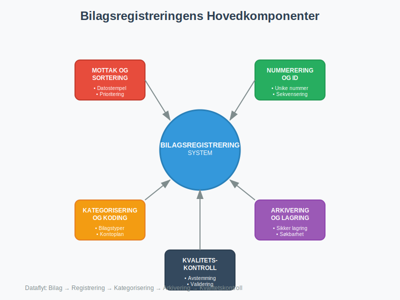
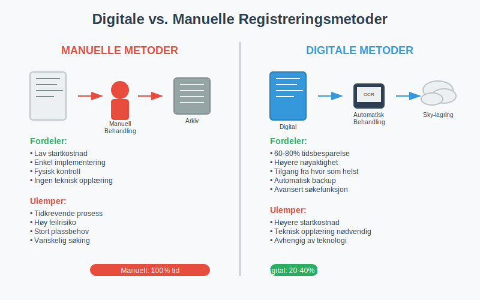
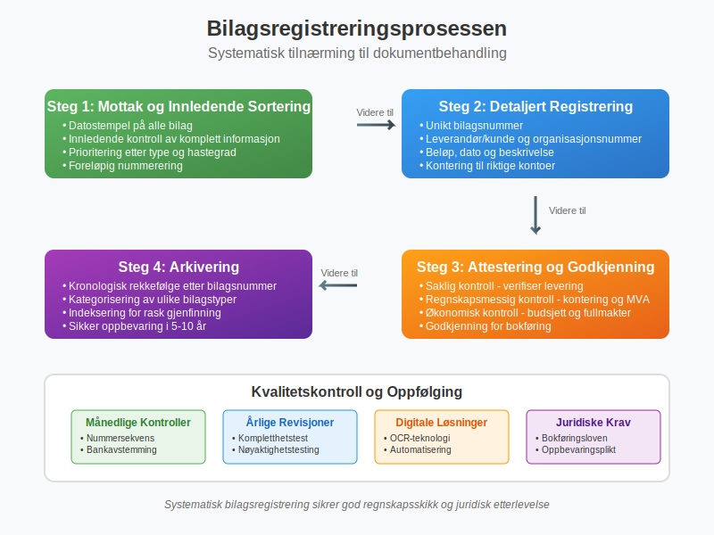

---
title: "Hva er Bilagsregistrere?"
meta_title: "Hva er Bilagsregistrere?"
meta_description: '**Bilagsregistrere** er den systematiske prosessen med å **registrere, organisere og arkivere** alle regnskapsbilag i en bedrift. Dette omfatter alt fra [faktu...'
slug: hva-er-bilagsregistrere
type: blog
layout: pages/single
---

**Bilagsregistrere** er den systematiske prosessen med å **registrere, organisere og arkivere** alle regnskapsbilag i en bedrift. Dette omfatter alt fra [fakturaer](/blogs/regnskap/hva-er-en-faktura "Hva er en Faktura? En Guide til Norske Fakturakrav") og [kvitteringer](/blogs/regnskap/kvittering "Hva er Kvittering? En Guide til Kvitteringskrav i Norsk Regnskap") til banktransaksjoner og lønnsbilag. Korrekt bilagsregistrering er grunnleggende for å opprettholde [god regnskapsskikk](/blogs/regnskap/hva-er-regnskap "Hva er Regnskap? En Komplett Guide til Regnskapsføring i Norge") og sikre at alle finansielle transaksjoner er dokumentert og sporbare.

(For en generell oversikt over **bilag** i regnskap, se [Bilag](/blogs/regnskap/bilag "Bilag i Regnskap – Guide til Dokumentasjon og Behandling").)

Bilagsregistrering er ikke bare en administrativ oppgave, men en **juridisk forpliktelse** som reguleres av bokføringsloven. Prosessen sikrer at bedriften kan dokumentere alle sine finansielle aktiviteter overfor [revisor](/blogs/regnskap/hva-er-arbeidspapirer-revisjon "Hva er Arbeidspapirer i Revisjon? Guide til Revisjonsdokumentasjon"), skattemyndigheter og andre interessenter.

## Seksjon 1: Bilagsregistreringens Komponenter

Effektiv bilagsregistrering består av flere kritiske komponenter som må fungere sammen for å sikre komplett dokumentasjon av bedriftens finansielle aktiviteter.

### 1.1 Bilagstyper som MÃ¥ Registreres

Alle bedrifter må registrere følgende hovedkategorier av bilag:

* **Salgsdokumenter:** [Fakturaer](/blogs/regnskap/hva-er-en-faktura "Hva er en Faktura? En Guide til Norske Fakturakrav"), kreditnotaer, [kvitteringer](/blogs/regnskap/kvittering "Hva er Kvittering? En Guide til Kvitteringskrav i Norsk Regnskap")
* **Kjøpsdokumenter:** Leverandørfakturaer, innkjøpsordrer, leveringsbekreftelser
* **Bankdokumenter:** [Banktransaksjoner](/blogs/regnskap/hva-er-banktransaksjoner "Hva er Banktransaksjoner? Komplett Guide til Bankoperasjoner"), [kontoutskrifter](/blogs/regnskap/hva-er-kontoutskrift "Hva er Kontoutskrift i Regnskap? En Guide til Kontoutskrifter"), [bankavstemming](/blogs/regnskap/hva-er-bankavstemming "Hva er Bankavstemming? Prosess, Metoder og Beste Praksis")
* **Lønnsbilag:** Lønnslipper, [A-meldinger](/blogs/regnskap/hva-er-a-melding "Hva er A-melding? Komplett Guide til Rapportering av Lønn og Avgifter"), [arbeidsgiveravgift](/blogs/regnskap/hva-er-arbeidsgiveravgift "Hva er Arbeidsgiveravgift? Satser, Beregning og Regnskapsføring")
* **MVA-dokumenter:** MVA-oppgaver, [avgiftsbilag](/blogs/regnskap/hva-er-avgiftsplikt-mva "Hva er Avgiftsplikt (MVA)? Komplett Guide til Merverdiavgift i Norge")

### 1.2 Registreringskrav og Nummerering

Hvert bilag må tildeles et **unikt bilagsnummer** som følger en logisk sekvens. Dette sikrer sporbarhet og gjør det enkelt å finne spesifikke transaksjoner senere.

| Bilagstype | Nummerserie | Eksempel | Beskrivelse |
|------------|-------------|----------|-------------|
| Salgsfakturaer | SF-001 til SF-999 | SF-245 | Utgående fakturaer til kunder |
| Kjøpsfakturaer | KF-001 til KF-999 | KF-156 | Innkommende fakturaer fra leverandører |
| Kassebilag | KB-001 til KB-999 | KB-089 | Kontantutbetalinger og -innbetalinger |
| Bankbilag | BB-001 til BB-999 | BB-234 | Banktransaksjoner og overføringer |
| Lønnsbilag | LB-001 til LB-999 | LB-012 | Lønnsutbetalinger og relaterte avgifter |

## Seksjon 2: Digitale vs. Manuelle Registreringsmetoder

Moderne bedrifter kan velge mellom tradisjonelle manuelle metoder og avanserte digitale løsninger for bilagsregistrering. Valget påvirker både effektivitet og nøyaktighet i regnskapsføringen.

### 2.1 Manuelle Registreringsmetoder

**Tradisjonell papirbasert registrering** innebærer fysisk håndtering og arkivering av alle bilag:

#### Fordeler med Manuell Registrering:
* **Lav startkostnad:** Krever kun grunnleggende kontormateriell
* **Enkel implementering:** Ingen teknisk opplæring nødvendig
* **Fysisk kontroll:** Direkte tilgang til originaldokumenter

#### Ulemper med Manuell Registrering:
* **Tidkrevende:** Manuell sortering og arkivering tar mye tid
* **Feilrisiko:** Høyere sannsynlighet for menneskelige feil
* **Plassbehov:** Krever betydelig fysisk lagringsplass
* **Søkeutfordringer:** Vanskelig å finne spesifikke bilag raskt

### 2.2 Digitale Registreringsløsninger

**Digitale bilagsregistreringssystemer** automatiserer store deler av prosessen og integrerer med regnskapssystemer:

#### Hovedfunksjoner i Digitale Systemer:
* **OCR-teknologi:** Automatisk lesing og registrering av bilagsdata
* **Automatisk kategorisering:** Intelligente algoritmer som klassifiserer bilagstyper
* **Integrasjon:** Direkte kobling til regnskapssystemer og [ERP-løsninger](/blogs/regnskap/hva-er-regnskap "Hva er Regnskap? En Komplett Guide til Regnskapsføring i Norge")
* **Søkefunksjonalitet:** Avanserte søkemuligheter basert på innhold og metadata

#### Fordeler med Digital Registrering:
* **Tidsbesparelse:** Automatisering reduserer manuelt arbeid med 60-80%
* **Høyere nøyaktighet:** Redusert risiko for menneskelige feil
* **Bedre tilgjengelighet:** Tilgang til bilag fra hvor som helst
* **Miljøvennlig:** Redusert papirforbruk og fysisk lagring

## Seksjon 3: Juridiske Krav og Oppbevaringsplikt

Bilagsregistrering er regulert av [**bokføringsloven**](/blogs/regnskap/hva-er-bokforingsloven "Hva er Bokføringsloven? Komplett Guide til Norsk Bokføringslovgivning") og tilhørende forskrifter. Bedrifter må følge strenge krav til dokumentasjon og oppbevaring.

### 3.1 Lovpålagte Oppbevaringskrav

| Dokumenttype | Oppbevaringstid | Spesielle krav |
|--------------|-----------------|----------------|
| [Regnskapsbilag](/blogs/regnskap/hva-er-bilag "Hva er Bilag? Komplett Guide til Regnskapsdokumentasjon") | 5 år | Må være tilgjengelige for kontroll |
| Årsregnskap | 10 år | Inkludert noter og revisjonsberetning |
| [Lønnsbilag](/blogs/regnskap/hva-er-a-melding "Hva er A-melding? Komplett Guide til Rapportering av Lønn og Avgifter") | 5 år | Inkludert A-meldinger og lønnsspecifikasjoner |
| MVA-dokumenter | 10 år | Alle MVA-oppgaver og støttedokumenter |
| Kontrakter | Kontraktens varighet + 3 år | Viktige avtaler og kontrakter |

### 3.2 Krav til Bilagskvalitet

For at et bilag skal være gyldig i regnskapssammenheng, må det oppfylle følgende krav:

* **Lesbarhet:** Tekst og tall må være klart lesbare
* **Komplett informasjon:** Alle nødvendige opplysninger må være tilstede
* **Autentisitet:** Bilag må kunne verifiseres som ekte
* **Sporbarhet:** Klar kobling mellom bilag og regnskapsføring

## Seksjon 4: Bilagsregistreringsprosessen Steg-for-Steg

En systematisk tilnærming til bilagsregistrering sikrer at ingen dokumenter går tapt og at alle transaksjoner blir korrekt behandlet.

### Steg 1: Mottak og Innledende Sortering

**Alle innkommende bilag** må umiddelbart registreres ved mottak:

1. **Datostempel:** Påfør mottaksdato på alle fysiske bilag
2. **Innledende kontroll:** Verifiser at bilag er komplette og lesbare
3. **Prioritering:** Sorter etter type og hastegrad
4. **Foreløpig nummerering:** Tildel midlertidig referansenummer

### Steg 2: Detaljert Registrering

For hvert bilag må følgende informasjon registreres:

* **Bilagsnummer:** Unikt identifikasjonsnummer
* **Dato:** BÃ¥de bilagsdato og registreringsdato
* **Leverandør/kunde:** Fullstendig navn og organisasjonsnummer
* **Beløp:** Totalbeløp og eventuell MVA
* **Beskrivelse:** Kort beskrivelse av transaksjonen
* **Kontering:** Hvilke kontoer som skal belastes/krediteres

### Steg 3: Attestering og Godkjenning

Alle bilag må gjennom en [attesteringsprosess](/blogs/regnskap/hva-er-attestering "Hva er Attestering? En Komplett Guide til Bilagsbehandling og Godkjenning") før de kan bokføres:

* **Saklig kontroll:** Verifiser at varen/tjenesten er levert
* **Regnskapsmessig kontroll:** Kontroller kontering og MVA-behandling
* **Økonomisk kontroll:** Sikre at kjøpet er innenfor budsjett og fullmakter

### Steg 4: Arkivering

Etter godkjenning må bilag arkiveres systematisk:

* **Kronologisk rekkefølge:** Sorter etter bilagsnummer eller dato
* **Kategorisering:** Separer ulike bilagstyper
* **Indeksering:** Opprett søkbare registre for rask gjenfinning
* **Sikker oppbevaring:** Beskytt mot skade, tyveri og tap

## Seksjon 5: Kvalitetskontroll og Avstemming

Regelmessig kvalitetskontroll sikrer at bilagsregistreringen opprettholder høy standard og at alle transaksjoner er korrekt dokumentert.

### 5.1 MÃ¥nedlige Kontrollrutiner

**Månedlig avstemming** bør inkludere følgende kontroller:

* **Nummersekvens:** Verifiser at alle bilagsnummer er i bruk uten hull
* **Bankavstemming:** Sammenlign registrerte [banktransaksjoner](/blogs/regnskap/hva-er-banktransaksjoner "Hva er Banktransaksjoner? Komplett Guide til Bankoperasjoner") med kontoutskrifter
* **Leverandøravstemming:** Kontroller utestående fakturaer mot leverandørenes oppgaver
* **MVA-avstemming:** Sikre at alle MVA-pliktige transaksjoner er korrekt registrert

### 5.2 Ã…rlige Revisjoner

En grundig **årlig gjennomgang** av bilagsregistreringen bør omfatte:

* **Kompletthetstest:** Verifiser at alle transaksjoner har tilhørende bilag
* **Nøyaktighetstesting:** Kontroller et utvalg bilag mot regnskapsføringen
* **Oppbevaringskontroll:** Sikre at alle bilag er tilgjengelige og i god stand
* **Systemvurdering:** Evaluere effektiviteten av registreringsprosessene

## Seksjon 6: Teknologiske Løsninger og Automatisering

Moderne teknologi har revolusjonert bilagsregistrering ved å automatisere mange manuelle prosesser og redusere feilmarginer betydelig.

### 6.1 OCR og Intelligent Dokumentgjenkjenning

**Optical Character Recognition (OCR)** teknologi kan automatisk lese og registrere informasjon fra bilag:

#### Hovedfunksjoner:
* **Automatisk dataekstraksjon:** Leser leverandørnavn, beløp, dato og andre nøkkeldata
* **Intelligent kategorisering:** Klassifiserer bilag basert på innhold og format
* **Validering:** Kontrollerer data mot forventede mønstre og regler
* **Integrasjon:** Sender data direkte til regnskapssystem

#### Nøyaktighetsrater:
* **Trykte dokumenter:** 95-99% nøyaktighet
* **Håndskrevne notater:** 70-85% nøyaktighet
* **Strukturerte fakturaer:** 98-99% nøyaktighet

### 6.2 Skybaserte Bilagsløsninger

**Cloud-baserte systemer** tilbyr fleksibilitet og skalerbarhet:

* **Tilgjengelighet:** Tilgang fra alle enheter med internettforbindelse
* **Automatisk backup:** Sikker lagring med redundans
* **Skalerbarhet:** Enkel utvidelse ved bedriftsvekst
* **Kostnadseffektivitet:** Reduserte IT-kostnader og vedlikehold

## Seksjon 7: Beste Praksis for Effektiv Bilagsregistrering

Implementering av beste praksis sikrer optimal effektivitet og minimerer risiko for feil i bilagsregistreringen.

### 7.1 Organisatoriske Rutiner

**Etabler klare rutiner** for alle aspekter av bilagsbehandling:

#### Daglige Rutiner:
* **Umiddelbar registrering:** Registrer alle bilag samme dag som de mottas
* **Prioritering:** Behandle hastebilag først (lønn, forfallende fakturaer)
* **Kvalitetskontroll:** Utfør grunnleggende kontroller ved registrering

#### Ukentlige Rutiner:
* **Kompletthetssjekk:** Sikre at alle bilag for uken er registrert
* **Oppfølging:** Kontakt leverandører ved manglende eller ufullstendige bilag
* **Arkivering:** Flytt godkjente bilag til permanent arkiv

### 7.2 Personell og Kompetanse

**Riktig kompetanse** er kritisk for effektiv bilagsregistrering:

#### Nødvendig Kompetanse:
* **Regnskapsforståelse:** Grunnleggende kunnskap om [regnskapsprinsipper](/blogs/regnskap/hva-er-regnskap "Hva er Regnskap? En Komplett Guide til Regnskapsføring i Norge")
* **Systemkunnskap:** Ferdigheter i relevante programvarer
* **Detaljorientering:** Evne til nøyaktig dataregistrering
* **Juridisk forståelse:** Kunnskap om oppbevaringskrav og forskrifter

#### Opplæringsprogram:
* **Introduksjonskurs:** Grunnleggende bilagsbehandling og systemer
* **Kontinuerlig utvikling:** Regelmessig oppdatering på nye krav og teknologi
* **Kvalitetssikring:** Periodisk evaluering av arbeidskvalitet

### 7.3 Risikohåndtering

**Identifiser og håndter** potensielle risikoer i bilagsregistreringen:

#### Vanlige Risikoer:
* **Tap av bilag:** Implementer backup-rutiner og duplikatlagring
* **Feilregistrering:** Etabler kontrollmekanismer og dobbeltkontroll
* **Forsinket behandling:** Sett opp automatiske påminnelser og frister
* **Sikkerhetsbrud:** Implementer tilgangskontroll og kryptering

## Seksjon 8: Fremtidige Trender og Utvikling

Bilagsregistrering utvikler seg kontinuerlig med nye teknologier og endrede forretningsbehov.

### 8.1 Kunstig Intelligens og Maskinlæring

**AI-teknologi** vil revolusjonere bilagsbehandling:

* **Prediktiv kategorisering:** Automatisk klassifisering basert på historiske data
* **Anomalideteksjon:** Identifisering av uvanlige transaksjoner eller feil
* **Intelligent validering:** Kryssreferanse mot multiple datakilder
* **Automatisk kontering:** Forslag til regnskapsføring basert på tidligere mønstre

### 8.2 Blockchain og Distribuert Lagring

**Blockchain-teknologi** kan forbedre sikkerhet og sporbarhet:

* **Uforanderlige poster:** Bilag kan ikke endres etter registrering
* **Desentralisert lagring:** Redusert risiko for datatap
* **Automatisk verifisering:** Smart contracts for automatisk validering
* **Forbedret tillit:** Transparent og sporbar dokumenthistorikk

### 8.3 Integrerte Økosystemer

**Helintegrerte løsninger** vil knytte sammen alle forretningsprosesser:

* **End-to-end automatisering:** Fra bestilling til betaling uten manuell inngripen
* **Sanntidsrapportering:** Øyeblikkelig oppdatering av finansielle rapporter
* **Prediktiv analyse:** Prognoser basert på historiske bilagsdata
* **Mobil tilgjengelighet:** Fullstendig funksjonalitet på mobile enheter

Effektiv bilagsregistrering er fundamentet for pålitelig regnskapsføring og finansiell rapportering. Ved å implementere systematiske prosesser, utnytte moderne teknologi og følge beste praksis, kan bedrifter sikre nøyaktig dokumentasjon av alle finansielle transaksjoner samtidig som de oppfyller juridiske krav og forbedrer operasjonell effektivitet.
