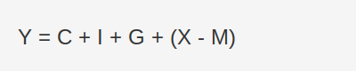
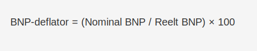

---
title: "Hva er BNP?"
seoTitle: "Hva er BNP?"
description: '**Bruttonasjonalprodukt (BNP)** er verdien av alle ferdigstilte varer og tjenester produsert innenlands i en gitt periode, vanligvis ett år. BNP er en **nøkke...'
---

**Bruttonasjonalprodukt (BNP)** er verdien av alle ferdigstilte varer og tjenester produsert innenlands i en gitt periode, vanligvis ett år. BNP er en **nøkkelindikator** for å måle økonomisk vekst, **konjunktursvingninger** og bedrifters inntektsmuligheter.

For en bredere forståelse av de makroøkonomiske prinsippene bak BNP, se vår artikkel om **[Makroøkonomi](/blogs/regnskap/makrookonomi "Makroøkonomi: Prinsipper og Betydning for Norsk Regnskap")**.

## Hva inngår i BNP?

BNP kan beregnes ved tre hovedmetoder:

| Metode                | Beskrivelse                                                  |
|-----------------------|--------------------------------------------------------------|
| **Produksjonsmetoden**| Summerer verdien av alle produksjonsaktiviteter i økonomien. |
| **Inntektsmetoden**   | Summerer alle inntekter (lønn, renter, profitt, skatt).      |
| **Utgiftsmetoden**    | Summerer alle utgifter (konsum, investering, offentlige kjøp).|

## Komponenter i utgiftsmetoden

Utgiftsmetoden zoomer inn på hvordan **BNP** er sammensatt av ulike typer utgifter:

| Symbol | Komponent                              |
|--------|----------------------------------------|
| **C**  | Privat **forbruk**                    |
| **I**  | Brutto**investeringer**                |
| **G**  | **Offentlige utgifter**                |
| **X**  | **Eksport**                            |
| **M**  | **Import**                            |

## Real vs Nominal BNP

- **Nominal BNP** måler verdien av varer og tjenester til løpende priser.
- **Reelt BNP** justeres for prisendringer (inflasjon), og gir et mer nøyaktig bilde av den faktiske volumveksten.

## BNP-deflatoren

> **BNP-deflatoren** måler det generelle prisnivået i økonomien ved å sammenligne *nominal BNP* med *reelt BNP*.

> **BNP-deflator (%) = (Nominal BNP / Reelt BNP) × 100**

> 

> BNP-deflatoren brukes til å justere for inflasjon og få en helhetlig prisindikator som dekker alle varer og tjenester i BNP.

Se også [Hva er Inflasjon?](/blogs/regnskap/hva-er-inflasjon "Hva er Inflasjon? Påvirkning på Regnskap og Økonomisk Planlegging").

## BNP per innbygger

BNP per innbygger gir en indikasjon på **levestandard**.

| År    | BNP (milliarder NOK) | BNP per innbygger (NOK) |
|-------|----------------------|--------------------------|
| 2018  | 3 500                | 660 000                  |
| 2019  | 3 600                | 675 000                  |
| 2020  | 3 550                | 670 000                  |
| 2021  | 3 700                | 695 000                  |

## Hvorfor er BNP viktig for regnskap?

- **Økonomisk styring:** BNP gir innsikt i konjunkturutsvinger, og påvirker [budsjettering](/blogs/regnskap/hva-er-budsjettering "Hva er Budsjettering? Komplett Guide til Budsjettplanlegging og Økonomisk Styring") og likviditetsplanlegging.
- **Sammenligning:** Muliggjør benchmarking av bedriftens vekst mot nasjonalt nivå.
- **Analyse:** Kombinert med nøkkeltall som [egenkapitalrentabilitet](/blogs/regnskap/hva-er-egenkapitalrentabilitet "Hva er Egenkapitalrentabilitet? Beregning og Analyse") og [likviditetsgrad](/blogs/regnskap/hva-er-likviditetsgrad "Hva er Likviditetsgrad? Analyse av Likviditet") gir BNP et helhetlig bilde av økonomisk helse.

## BNP og konjunktur

BNP er en av de viktigste **konjunkturindikatorene** som viser om økonomien er i ekspansjon eller resesjon. Les mer i [Hva er Konjunktur?](/blogs/regnskap/hva-er-konjunktur "Hva er Konjunktur? Forstå Økonomiske Sykluser og Regnskapsmessige Konsekvenser").

## Begrensninger ved BNP

> Selv om **BNP** er en sentral indikator, har måltallet flere begrensninger som er viktige å kjenne til:

* **Ikke-registrert økonomi** “ Svart økonomi og uformell virksomhet fanges ikke opp.
* **Fordelingsaspekter** “ BNP sier ikke noe om hvordan inntektene fordeles i befolkningen.
* **Miljø- og bærekraft** “ Ressursuttak og klimakostnader er ikke inkludert.
* **Ulike prisnivåer** “ Sammenligning på tvers av land krever justering for kjøpekraft (KKP).

