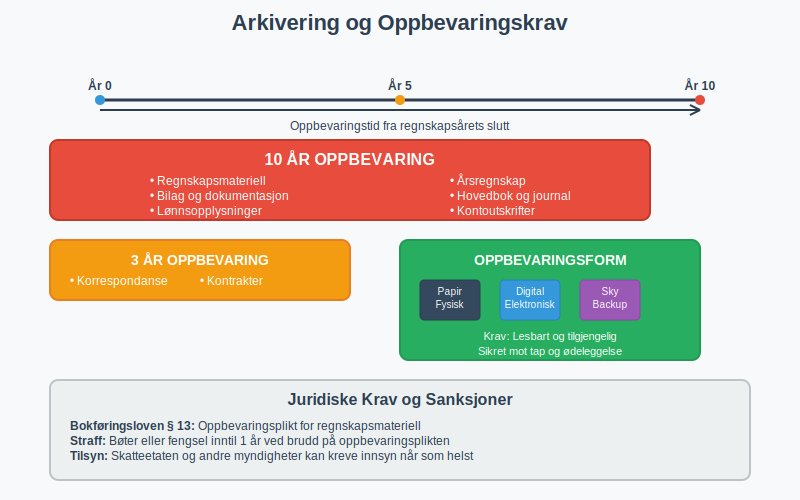

**Bokføring** er grunnstenen i enhver virksomhets økonomiske styring og den systematiske registreringen av alle finansielle transaksjoner. Som et lovpålagt krav i Norge reguleres bokføring av bokføringsloven og utgjør fundamentet for [regnskap](/blogs/regnskap/hva-er-regnskap "Hva er regnskap? En dybdeanalyse for Norge"), [skatterapportering](/blogs/regnskap/hva-er-skatt "Hva er Skatt? Komplett Guide til Bedriftsskatt, MVA og Skatteplanlegging") og økonomisk beslutningsgrunnlag.

## Hva er Bokføring?

Bokføring er den kronologiske og systematiske registreringen, klassifiseringen og sammenfatningen av økonomiske transaksjoner og hendelser i en virksomhet. Det er en kontinuerlig prosess som dokumenterer alle inn- og utbetalinger, kjøp og salg, samt andre økonomiske hendelser som påvirker virksomhetens finansielle stilling.

### Bokføringens Hovedformål

* **Lovmessig dokumentasjon:** Oppfylle krav i [bokføringsloven](/blogs/regnskap/hva-er-bokføringsloven "Hva er Bokføringsloven? Krav, Regler og Praktisk Veiledning") og [skattelovgivningen](/blogs/regnskap/hva-er-skatt "Hva er Skatt? Komplett Guide til Bedriftsskatt, MVA og Skatteplanlegging")
* **Økonomisk styring:** Gi grunnlag for budsjetter, prognoser og strategiske beslutninger  
* **Kontroll og oppfølging:** Overvåke virksomhetens økonomiske utvikling og likviditet
* **Rapportering:** Danne grunnlag for [årsregnskap](/blogs/regnskap/hva-er-regnskap "Hva er regnskap? En dybdeanalyse for Norge") og [skattemeldinger](/blogs/regnskap/hva-er-skatt "Hva er Skatt? Komplett Guide til Bedriftsskatt, MVA og Skatteplanlegging")
* **Revisjon:** Sikre sporbarhet og dokumentasjon for revisjonsformål

## Bokføringsloven - Det Juridiske Rammeverket

[Bokføringsloven](/blogs/regnskap/hva-er-bokføringsloven "Hva er Bokføringsloven? Krav, Regler og Praktisk Veiledning") av 2004 regulerer bokføringsplikten for norske virksomheter og setter krav til hvordan bokføringen skal gjennomføres.

### Hvem er Bokføringspliktige?

[**Bokføringsplikten**](/blogs/regnskap/hva-er-bokføringsplikt "Hva er Bokføringsplikt i Norge? Hvem, Når og Hvordan?") gjelder ulike virksomhetstyper basert på størrelse og organisasjonsform:

| Virksomhetstype | Bokføringsplikt | Særlige krav |
|---|---|---|
| Enkeltpersonforetak | Ja, hvis omsetning > 5 MNOK | Forenklet bokføring under grensen |
| Aksjeselskap (AS) | Ja, alltid | Fullstendig bokføring |
| Ansvarlig selskap (ANS) | Ja, hvis omsetning > 5 MNOK | [Ansvarlig selskap med delt ansvar](/blogs/regnskap/ansvarlig-selskap-delt-ansvar "Ansvarlig Selskap med Delt Ansvar - Juridisk Struktur og Regnskapsføring") |
| Kommandittselskap (KS) | Ja, hvis omsetning > 5 MNOK | Særlige regler for komplementarer |
| Stiftelser og foreninger | Ja, hvis omsetning > 5 MNOK | Avhengig av aktivitetsnivå |

### Grunnleggende Krav i Bokføringsloven

**Bokføringsprinsipper:**

* **Fullstendighet:** Alle transaksjoner skal registreres
* **Nøyaktighet:** Beløp og datoer skal være korrekte  
* **Klarhet:** Registreringer skal være forståelige
* **Kronologi:** Transaksjoner skal registreres i tidsmessig rekkefølge
* **Sporbarhet:** Alle poster skal kunne spores tilbake til [bilag](/blogs/regnskap/hva-er-bilag "Hva er Bilag i Regnskap? Komplett Guide til Regnskapsbilag")

For en dypere forståelse av det komplette regelverket som styrer bokføring, se vår omfattende guide til [bokføringsregler](/blogs/regnskap/hva-er-bokføringsregler "Hva er Bokføringsregler? Komplett Guide til Norske Bokføringsstandarder").

For å sikre høyeste kvalitet i regnskapsføringen og oppfylle alle krav til pålitelig finansiell rapportering, er det essensielt å følge [god regnskapsskikk](/blogs/regnskap/god-regnskapsskikk "God Regnskapsskikk - Prinsipper, Standarder og Beste Praksis i Norge"), som omfatter både tekniske standarder, etiske prinsipper og beste praksis for kvalitetsregnskap.

## Dobbelt Bokføring - Grunnleggende Metode

Norsk bokføring baserer seg på **[dobbelt bokføring](/blogs/regnskap/hva-er-dobbel-bokforing "Hva er Dobbel Bokføring? Komplett Guide til Dobbelt Bokføringssystem")**, hvor hver transaksjon registreres med minst to poster som balanserer hverandre. For en dyptgående forklaring av dette fundamentale systemet, se vår omfattende guide til [dobbel bokføring](/blogs/regnskap/hva-er-dobbel-bokforing "Hva er Dobbel Bokføring? Komplett Guide til Dobbelt Bokføringssystem").

### Debet og Kredit Systemet

* **[Debet](/blogs/regnskap/hva-er-debet "Hva er Debet i Regnskap? Komplett Guide til Debetposter og Bokføring") (Dr.):** Venstre side av kontoen - økning i eiendeler og kostnader
* **Kredit (Kr.):** Høyre side av kontoen - økning i gjeld, egenkapital og inntekter

For en dyptgående forklaring av debetbegrepet, debetregler for ulike kontotyper og praktiske eksempler, se vår omfattende guide [Hva er debet?](/blogs/regnskap/hva-er-debet "Hva er Debet i Regnskap? Komplett Guide til Debetposter og Bokføring").

### Kontoklasser i Norsk Standard Kontoplan

Alle transaksjoner fra bokføringen samles og organiseres i [**hovedboken**](/blogs/regnskap/hva-er-hovedbok "Hva er Hovedbok? En Komplett Guide til Hovedboken i Norsk Regnskap"), som er det sentrale registeret hvor hver konto viser alle bevegelser og saldoer. Hovedboken struktureres etter den norske standard [**kontoplan**](/blogs/regnskap/hva-er-kontoplan "Hva er en Kontoplan? Komplett Guide til Kontoplaner i Norsk Regnskap"), som baserer seg på et hierarkisk system av **[kontoklasser](/blogs/regnskap/hva-er-kontoklasser "Hva er Kontoklasser? Komplett Guide til Norsk Kontoklassesystem")**.

For at transaksjoner skal registreres korrekt i hovedboken, må hver transaksjon **konteres** - det vil si tildeles riktige kontonummer fra kontoplanen. [**Kontering**](/blogs/regnskap/hva-er-kontering "Hva er Kontering? En Komplett Guide til Kontokoding i Regnskap") er den systematiske prosessen med å klassifisere og kode alle finansielle transaksjoner. Dette klassifiseringssystemet gir systematisk oversikt over alle kontoer som brukes i regnskapet:

| Kontoklass | Beskrivelse | Eksempler |
|---|---|---|
| 1 | [Anleggsmidler](/blogs/regnskap/hva-er-anleggsmidler "Hva er Anleggsmidler? Komplett Guide til Varige Driftsmidler") | Bygninger, maskiner, goodwill |
| 2 | Omløpsmidler | Varelager, kundefordringer, bank |
| 3 | Egenkapital | Aksjekapital, opptjent egenkapital |
| 4 | Langsiktig gjeld | Banklån, obligasjoner |
| 5 | Kortsiktig gjeld | Leverandørgjeld, skyldige skatter |
| 6 | Kostnader | Lønn, husleie, avskrivninger |
| 7 | Salgsinntekter | Salg av varer og tjenester |
| 8 | Finansposter | Renteinntekter, rentekostnader |

## Praktisk Gjennomføring av Bokføring

### 1. Bilagsbehandling og Registrering

Alle økonomiske transaksjoner må dokumenteres med [bilag](/blogs/regnskap/bilag "Bilag - Komplett Guide til Regnskapsbilag, Behandling og Oppbevaring"). Systematisk [bilagsbehandling](/blogs/regnskap/bilag "Bilag - Komplett Guide til Regnskapsbilag, Behandling og Oppbevaring") er fundamentet for korrekt bokføring og overholdelse av norske lovkrav. Etter at bilagene er mottatt og kontrollert, må de [konteres](/blogs/regnskap/hva-er-kontering "Hva er Kontering? En Komplett Guide til Kontokoding i Regnskap") - det vil si tildeles riktige kontonummer før registrering i bokføringen:

**Innkommende bilag:**
* [Fakturaer](/blogs/regnskap/hva-er-en-faktura "Hva er en Faktura? En Guide til Norske Fakturakrav") fra leverandører
* Bankutskrifter og kontoutskrifter
* Lønnslipper og personalrelaterte dokumenter
* Kvitteringer og reiseregninger
* [Utlegg](/blogs/regnskap/hva-er-utlegg "Hva er Utlegg? Komplett Guide til Utleggsregnskap og Refusjon") fra ansatte

**Utgående bilag:**
* Salgsfakturaer til kunder
* Kreditnotaer
* Lønnsutbetalinger
* Skatteinnbetalinger

I moderne detaljhandel genereres mange av disse bilagene automatisk gjennom [datakasse (kassasystem)](/blogs/regnskap/hva-er-datakasse "Hva er Datakasse? Komplett Guide til Kassasystem, Krav og Regnskapsføring"), som sikrer korrekt dokumentasjon og direkte integrasjon med bokføringssystemet.

### 2. Periodisk Bokføring og Avstemming

**Månedlige rutiner:**
* Registrering av alle transaksjoner
* [Bankavstemming](/blogs/regnskap/hva-er-bankavstemming "Hva er Bankavstemming? Komplett Guide til Bankavstemminger") for alle bankkontoer
* [Avstemming](/blogs/regnskap/hva-er-avstemming "Hva er Avstemming i Regnskap? Komplett Guide til Regnskapsavstemming") av kundefordringer og leverandørgjeld
* Kontroll av varelager og [arbeidskapital](/blogs/regnskap/hva-er-arbeidskapital "Hva er Arbeidskapital? En Komplett Guide til Working Capital")
* Utarbeidelse av [saldobalanse](/blogs/regnskap/hva-er-saldobalanse "Hva er Saldobalanse i Regnskap? Komplett Guide til Utarbeidelse og Analyse") for kontroll av regnskapsføringen

**Kvartalsvise oppgaver:**
* [MVA-oppgjør](/blogs/regnskap/momsregnskap "Momsregnskap - Komplett Guide til MVA-regnskapsføring") og innlevering i henhold til [mva-loven](/blogs/regnskap/mva-loven "Mva-loven: Komplett Guide til Merverdiavgiftsloven og Regnskapsføring")
* Foreløpige resultatanalyser
* Oppdatering av budsjetter og prognoser

### 3. Årsavslutning og Regnskapsavleggelse

**Avslutningsrutiner:**
* Inventering og verdivurdering av [aktiva](/blogs/regnskap/hva-er-aktiva "Hva er Aktiva? En Komplett Guide til Eiendeler i Regnskap")
* [Avskrivninger](/blogs/regnskap/hva-er-avskrivning "Hva er Avskrivning? Komplett Guide til Avskrivningsmetoder") på anleggsmidler
* Periodisering av inntekter og kostnader
* Utarbeidelse av [avslutningsbalanse](/blogs/regnskap/hva-er-avslutningsbalanse "Hva er Avslutningsbalanse? Komplett Guide til Årsavslutning")

## Digitale Bokføringsløsninger

### Moderne Bokføringssystemer

**Fordeler med digitale løsninger:**
* Automatisk [banktransaksjoner](/blogs/regnskap/hva-er-banktransaksjoner "Hva er Banktransaksjoner? Komplett Guide til Bankoperasjoner") import
* Integrert fakturering og [betalingsmidler](/blogs/regnskap/hva-er-betalingsmidler "Hva er Betalingsmidler? Komplett Guide til Betalingsformer") håndtering
* Automatisk MVA-beregning og rapportering
* Sanntids rapportering og analyse
* Sikker skylagring og backup

### Integrasjon med Offentlige Systemer

**Altinn og offentlig rapportering:**
* Direkte innsending av MVA-meldinger
* [A-melding](/blogs/regnskap/hva-er-a-melding "Hva er A-melding? Komplett Guide til Arbeidsgiver- og Arbeidstakerregisteret") rapportering
* [Næringsoppgave](/blogs/regnskap/hva-er-naeringsoppgave "Hva er Næringsoppgave? Komplett Guide til Næringsoppgaven i Norge") (skattemelding for næringsdrivende)
* Årsregnskap til Brønnøysundregistrene

## Spesielle Bokføringsområder

### Lønn og Personaladministrasjon

**Lønnsrelatert bokføring:**
* [Bruttolønn](/blogs/regnskap/hva-er-brutto "Hva er Brutto i Regnskap? Definisjon, Beregning og Praktisk Anvendelse") og feriepenger
* [Arbeidsgiveravgift](/blogs/regnskap/hva-er-arbeidsgiveravgift "Hva er Arbeidsgiveravgift? Komplett Guide til AGA-beregning") beregning og bokføring
* [Sykepenger](/blogs/regnskap/hva-er-sykepenger "Hva er Sykepenger? Komplett Guide til Arbeidsgiverperiode og NAV-refusjon") og refusjonshåndtering
* Skattetrekk og andre trekk
* Pensjonspremier og forsikringer
* [Gradert uføretrygd](/blogs/regnskap/skatt-pa-uforetrygd "Skatt på Uføretrygd - Komplett Guide til Beregning og Regnskapsføring") kombinert med delvis arbeid

### MVA-bokføring

**Merverdiavgift håndtering:**
* Inngående MVA på kjøp
* Utgående MVA på salg  
* Periodisk MVA-oppgjør
* Spesielle MVA-regler for ulike bransjer

### Varelager og Produksjon

**Lagerbokføring:**
* Innkjøp og lagertilgang
* Produksjonskostnader
* Varekostnad ved salg
* Lagerverdi og svinn

## Kvalitetssikring og Kontroll

### Interne Kontroller

**Kontrollrutiner:**
* [Dagsoppgjør](/blogs/regnskap/hva-er-dagsoppgjør "Hva er Dagsoppgjør i Regnskap? Prosess, Rutiner og Beste Praksis") for daglig kvalitetskontroll
* Månedlig [avstemming](/blogs/regnskap/hva-er-avstemming "Hva er Avstemming i Regnskap? Komplett Guide til Regnskapsavstemming") av alle hovedkontoer
* [Avvikshåndtering](/blogs/regnskap/hva-er-avvikshåndtering "Hva er Avvikshåndtering i Regnskap? Prosess, Metoder og Beste Praksis") ved uoverensstemmelser
* Autorisasjon og godkjenning av transaksjoner
* Segregering av oppgaver og ansvar
* [Forretningsførerens](/blogs/regnskap/hva-er-forretningsforer "Hva er en Forretningsfører? Komplett Guide til Roller, Ansvar og Krav") overordnede ansvar for internkontroll og regeloverholdelse

### Revisjon og Ekstern Kontroll

**Revisjonsforhold:**
* Dokumentasjon og [arbeidspapirer](/blogs/regnskap/hva-er-arbeidspapirer-revisjon "Hva er Arbeidspapirer i Revisjon? Komplett Guide til Revisjonsdokumentasjon")
* Sporbarhet fra bilag til regnskap
* Oppbevaring av regnskapsmateriell
* Samarbeid med revisor

## Oppbevaring og Arkivering

Systematisk oppbevaring og arkivering av regnskapsmateriell er en kritisk del av bokføringen. For en omfattende guide til alle aspekter av regnskapsdokumentasjon, inkludert moderne digitale løsninger og beste praksis, se vår detaljerte artikkel om [dokumentasjon i regnskap og bokføring](/blogs/regnskap/hva-er-dokumentasjon-regnskap-bokforing "Hva er Dokumentasjon i Regnskap og Bokføring? Komplett Guide til Regnskapsdokumentasjon").

### Lovkrav til Oppbevaring

**Oppbevaringstid:**
* Regnskapsmateriell: **10 år**
* Bilag og dokumentasjon: **10 år**  
* Lønnsopplysninger: **10 år**
* Korrespondanse: **3 år**

**Oppbevaringsform:**
* Papirbasert eller elektronisk
* Krav til lesbarhet og tilgjengelighet
* Sikkerhet mot tap og ødeleggelse

## Vanlige Utfordringer og Løsninger

### Typiske Bokføringsfeil

| Problem | Årsak | Løsning |
|---|---|---|
| Ubalanse i bokføring | Feil i debet/kredit | Systematisk gjennomgang av poster |
| Manglende bilag | Dårlige rutiner | Implementere bilagskontroll |
| Feil kontoføring | Mangel på kunnskap | Opplæring og kontoplaner |
| Periodiseringsfeil | Timing av transaksjoner | Månedlige avstemminger |

### Beste Praksis

**Anbefalinger for god bokføring:**

* **Daglig registrering:** Ikke la transaksjoner hope seg opp
* **Systematisk arkivering:** Organiser bilag kronologisk og tematisk
* **Regelmessig avstemming:** Månedlige kontroller av alle hovedkontoer
* **Kompetanseutvikling:** Hold deg oppdatert på regelverksendringer
* **Backup og sikkerhet:** Sikre regnskapsdata mot tap

### Utkontraktering som Løsning

For mange mindre [foretak](/blogs/regnskap/hva-er-foretak "Hva er et Foretak? Komplett Guide til Foretaksformer i Norge") kan bokføring være en utfordrende og tidkrevende oppgave som krever spesialisert kompetanse. **[Utkontraktering](/blogs/regnskap/hva-er-utkontraktering "Hva er Utkontraktering? Komplett Guide til Outsourcing i Regnskap og Forretning")** av bokføringsoppgaver til eksterne leverandører kan være en kostnadseffektiv løsning som gir:

* **Tilgang til fagkompetanse** - Profesjonelle regnskapsførere med oppdatert kunnskap
* **Kostnadsbesparelser** - Eliminerer behov for egen regnskapsavdeling
* **Fokus på kjernevirksomhet** - Frigjør tid til strategiske aktiviteter
* **Kvalitetssikring** - Redusert risiko for feil og regelverksbrudd
* **Skalerbarhet** - Tilpasning etter virksomhetens behov og vekst

Utkontraktering kan omfatte alt fra løpende [bilagsføring](/blogs/regnskap/hva-er-bilagsforing "Hva er Bilagsføring? Komplett Guide til Bilagsregistrering") og [MVA-rapportering](/blogs/regnskap/hva-er-mva-melding "Hva er MVA-melding? Komplett Guide til Merverdiavgiftsrapportering") til fullstendig regnskapsføring og økonomisk rådgivning.

## Fremtiden for Bokføring

### Teknologiske Trender

**Automatisering og AI:**
Moderne **[fintech](/blogs/regnskap/hva-er-fintech "Hva er Fintech? Komplett Guide til Finansteknologi og Påvirkning på Regnskap")**-løsninger transformerer bokføringen med avanserte teknologier:
* Automatisk kategorisering av transaksjoner
* Intelligent bilagsgjenkjenning (OCR)
* Prediktiv analyse og varsling
* Maskinlæring for feildeteksjon

**Sanntidsrapportering:**
* Kontinuerlig oppdatering av finansielle data
* Integrerte dashboards og KPI-er
* Automatisk compliance-sjekk
* Skybaserte løsninger med API-integrasjoner

## Konklusjon

Bokføring er langt mer enn bare lovpålagt dokumentasjon - det er et strategisk verktøy for virksomhetsstyring og beslutningsgrunnlag. Med riktig implementering av systemer, rutiner og kontroller blir bokføringen en verdifull ressurs som støtter virksomhetens vekst og utvikling.

**Nøkkelpunkter for suksessfull bokføring:**

* Følg bokføringslovens krav og prinsipper
* Implementer robuste kontrollrutiner
* Bruk moderne digitale verktøy effektivt  
* Sikre kompetanse og kontinuerlig oppdatering
* Fokuser på kvalitet fremfor hastighet

Ved å mestre bokføringens grunnleggende prinsipper og beste praksis, legger virksomheter grunnlaget for solid økonomisk styring og langsiktig suksess i det norske forretningslandskapet.

