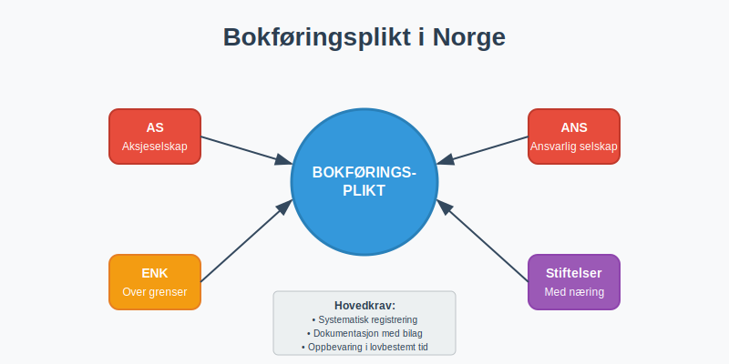
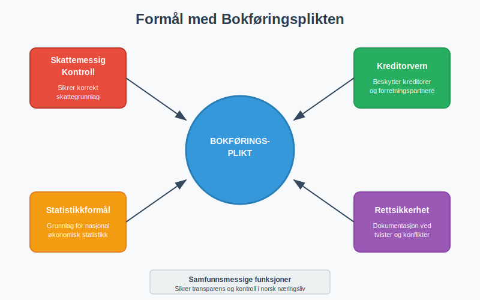
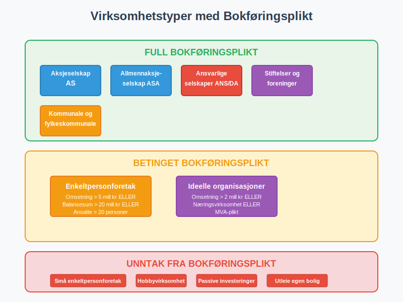
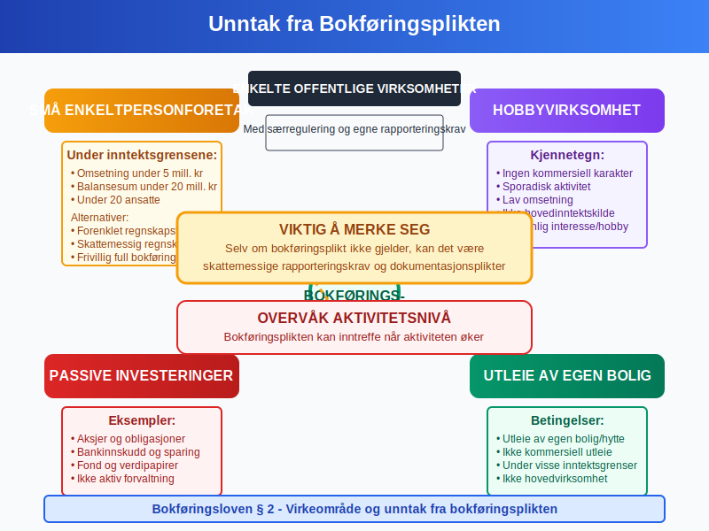
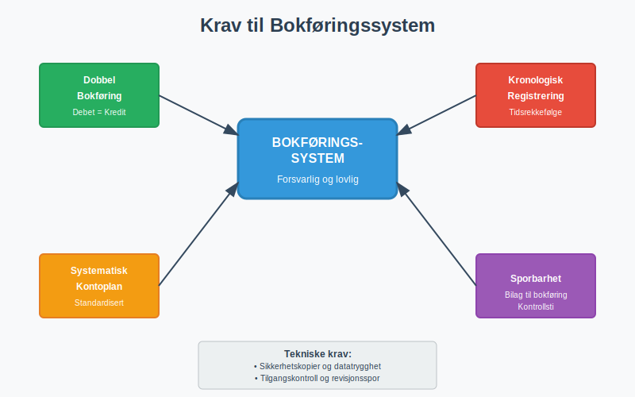
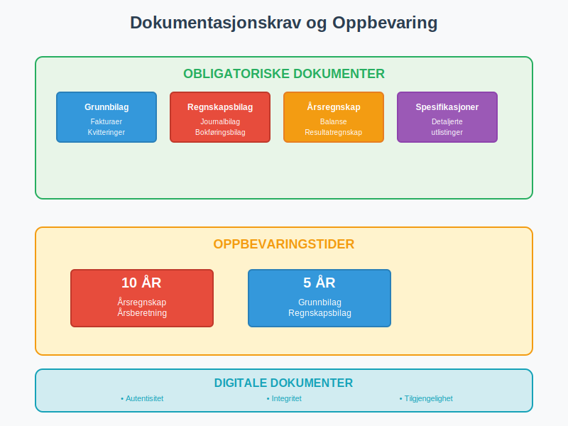
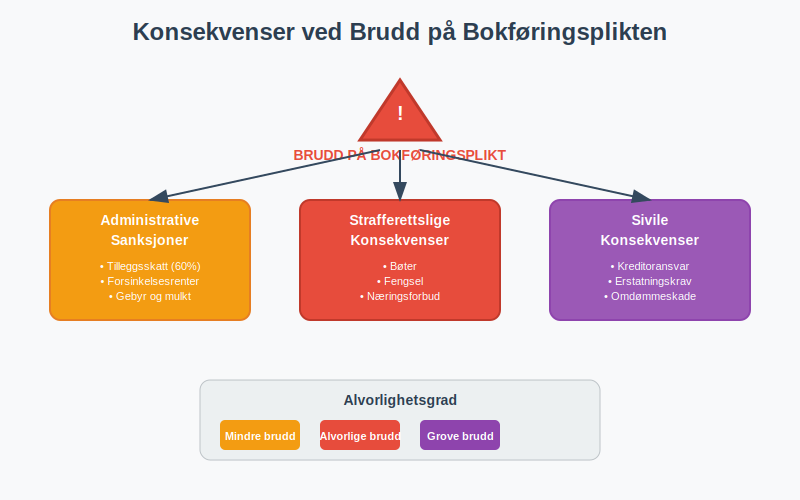
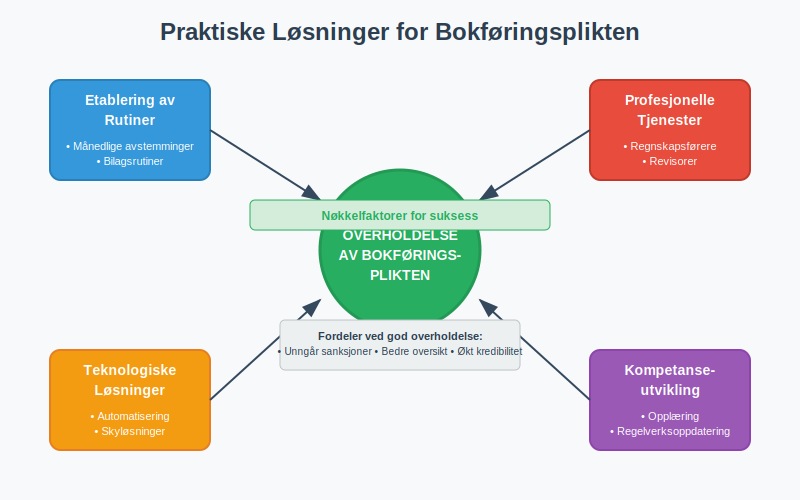

---
title: "Hva er Bokføringsplikt i Norge?"
meta_title: "Hva er Bokføringsplikt i Norge?"
meta_description: '**Bokføringsplikt** er den lovpålagte forpliktelsen for virksomheter i Norge til å føre [regnskap](/blogs/regnskap/hva-er-regnskap "Hva er Regnskap? En komp...'
slug: hva-er-bokforingsplikt
type: blog
layout: pages/single
---

**Bokføringsplikt** er den lovpålagte forpliktelsen for virksomheter i Norge til å føre [regnskap](/blogs/regnskap/hva-er-regnskap "Hva er Regnskap? En komplett guide") i henhold til [bokføringsloven](/blogs/regnskap/hva-er-bokføringsloven "Bokføringsloven - Krav, Regler og Praktisk Veiledning for Norske Bedrifter"). Denne plikten sikrer **transparens**, **kontroll** og **etterprøvbarhet** i norsk næringsliv.

## Hva er Bokføringsplikt?

Bokføringsplikt innebærer at **næringsdrivende** må systematisk registrere, dokumentere og oppbevare alle økonomiske transaksjoner i virksomheten. Plikten er forankret i [**bokføringsloven**](/blogs/regnskap/hva-er-bokforingsloven "Hva er Bokføringsloven? Komplett Guide til Norsk Bokføringslovgivning") og omfatter:

* **Systematisk registrering** av alle forretningshendelser
* **Dokumentasjon** av transaksjoner med [bilag](/blogs/regnskap/hva-er-bilag "Hva er Bilag? Komplett Guide til Regnskapsbilag og Dokumentasjon")
* **Oppbevaring** av regnskapsmateriale i lovbestemt tid
* **Rapportering** til offentlige myndigheter

### Formål med Bokføringsplikten

Bokføringsplikten har flere viktige samfunnsmessige funksjoner:

* **Skattemessig kontroll:** Sikrer korrekt skattegrunnlag
* **Kreditorvern:** Beskytter kreditorer og forretningspartnere
* **Statistikkformål:** Grunnlag for nasjonal økonomisk statistikk
* **Rettsikkerhet:** Dokumentasjon ved tvister og konflikter

## Hvem har Bokføringsplikt?

Bokføringsplikten gjelder **alle næringsdrivende** i Norge, men med noen viktige unntak og særregler.

### Hovedregel: Alle Næringsdrivende

Følgende virksomheter har **full bokføringsplikt**:

* **Aksjeselskaper** ([AS](/blogs/regnskap/hva-er-et-aksjeselskap "Hva er et Aksjeselskap? Komplett Guide til AS i Norge"))
* **Allmennaksjeselskaper** (ASA)
* **Ansvarlige selskaper** (ANS og DA)
* **Stiftelser** og **foreninger** med **[næringsvirksomhet](/blogs/regnskap/naeringsvirksomhet "Hva er næringsvirksomhet? Definisjon og Regnskapsmessig Behandling")**
* **[Enkeltpersonforetak](/blogs/regnskap/hva-er-enkeltpersonforetak "Hva er et Enkeltpersonforetak? Komplett Guide til Selskapsformen")** over visse inntektsgrenser
* **Kommunale og fylkeskommunale foretak**

### Inntektsgrenser for [Enkeltpersonforetak](/blogs/regnskap/hva-er-enkeltpersonforetak "Hva er et Enkeltpersonforetak? Komplett Guide til Selskapsformen")

[Enkeltpersonforetak](/blogs/regnskap/hva-er-enkeltpersonforetak "Hva er et Enkeltpersonforetak? Komplett Guide til Selskapsformen") har bokføringsplikt når **én** av følgende betingelser er oppfylt:

| Kriterium | Grenseverdi | Periode |
|-----------|-------------|---------|
| **Omsetning** | Over 5 millioner kr | Siste regnskapsår |
| **Balansesum** | Over 20 millioner kr | Ved regnskapsårets slutt |
| **Gjennomsnittlig antall ansatte** | Over 20 personer | I løpet av regnskapsåret |

### Særlige Bestemmelser

#### [Primærnæringer](/blogs/regnskap/primarnaring "Hva er primærnæring? Komplett Guide til Primærnæring i Regnskap")
**Jordbruk, skogbruk og fiske** har spesielle regler:

* **Forenklede krav** for små primærnæringer
* **Særskilte rapporteringskrav** til Landbruksdirektoratet
* **Mulighet for forenklet regnskapsføring** under visse betingelser

#### Ideelle Organisasjoner
**Ideelle organisasjoner** og [foreninger](/blogs/regnskap/hva-er-forening "Hva er Forening i Regnskap? Regnskapsføring for Foreninger og Organisasjoner") har bokføringsplikt når:

* Ã…rlig omsetning overstiger **2 millioner kr**
* Organisasjonen driver **[næringsvirksomhet](/blogs/regnskap/naeringsvirksomhet "Hva er næringsvirksomhet? Definisjon og Regnskapsmessig Behandling")**
* Det foreligger **mva-plikt**

For en omfattende guide til regnskapsføring for foreninger og ideelle organisasjoner, inkludert særlige regler for medlemskontingent, tilskudd og skattefritak, se vår detaljerte artikkel om [foreninger i regnskap](/blogs/regnskap/hva-er-forening "Hva er Forening i Regnskap? Regnskapsføring for Foreninger og Organisasjoner").

## Unntak fra Bokføringsplikten

Enkelte virksomheter er **unntatt** fra bokføringsplikten:

### Små [Enkeltpersonforetak](/blogs/regnskap/hva-er-enkeltpersonforetak "Hva er et Enkeltpersonforetak? Komplett Guide til Selskapsformen")
[Enkeltpersonforetak](/blogs/regnskap/hva-er-enkeltpersonforetak "Hva er et Enkeltpersonforetak? Komplett Guide til Selskapsformen") **under** inntektsgrensene kan velge:

* **Forenklet regnskapsføring** (kontantprinsippet)
* **Skattemessig regnskap** som minimum
* **Frivillig full bokføring** for bedre oversikt

### Andre Unntak

* **Hobbyvirksomhet** uten kommersiell karakter
* **Passive investeringer** i [aksjer](/blogs/regnskap/hva-er-en-aksje "Hva er en Aksje? Komplett Guide til Aksjer og Aksjeinvestering") og obligasjoner
* **Utleie av egen bolig** (under visse betingelser)
* **Enkelte offentlige virksomheter** med særregulering

## Når Inntrer Bokføringsplikten?

Bokføringsplikten inntrer på **ulike tidspunkter** avhengig av virksomhetstype:

### For Selskaper
* **Aksjeselskaper:** Fra registrering i Foretaksregisteret
* **Ansvarlige selskaper:** Fra oppstart av næringsvirksomhet
* **Stiftelser:** Fra registrering eller oppstart av næringsvirksomhet

### For [Enkeltpersonforetak](/blogs/regnskap/hva-er-enkeltpersonforetak "Hva er et Enkeltpersonforetak? Komplett Guide til Selskapsformen")
Plikten inntrer når **inntektsgrensene** overskrides:

1. **Prospektivt:** NÃ¥r det er sannsynlig at grensene overskrides
2. **Retrospektivt:** Senest når grensene faktisk overskrides
3. **Kontinuerlig vurdering:** Ã…rlig vurdering av om plikten fortsatt gjelder

### Tidspunkt for Implementering

| Situasjon | Frist for implementering |
|-----------|-------------------------|
| **Nyetablert virksomhet** | Fra oppstart |
| **Overskridelse av grenser** | Innen 3 måneder |
| **Endring av selskapsform** | Fra endringsdato |
| **Oppkjøp/fusjon** | Fra transaksjonstidspunkt |

## Krav til Bokføringssystem

Virksomheter med bokføringsplikt må etablere et **forsvarlig bokføringssystem** som oppfyller lovens krav.

### Grunnleggende Systemkrav

* **Dobbel bokføring:** Alle transaksjoner må bokføres med debet og kredit
* **Kronologisk registrering:** Transaksjoner registreres i tidsrekkefølge
* **Systematisk kontoplan:** Bruk av standardisert [kontoplan](/blogs/regnskap/hva-er-regnskap "Hva er Regnskap? En komplett guide")
* **Sporbarhet:** Klar sammenheng mellom bilag og bokføring

### Tekniske Krav

#### Digitale Systemer
Moderne bokføringssystemer må ha:

* **Sikkerhetskopier** og **datatrygghet**
* **Tilgangskontroll** og **brukerrettigheter**
* **Revisjonsspor** for alle endringer
* **Eksportmuligheter** (SAF-T format)

#### Papirbaserte Systemer
For virksomheter som fortsatt bruker papir:

* **Nummererte bilag** og **journaler**
* **Sikker oppbevaring** mot brann og vannskade
* **Systematisk arkivering** for enkel gjenfinning

### Integrasjon med Andre Systemer

Bokføringssystemet bør integreres med:

* **Fakturasystemer** for automatisk [fakturering](/blogs/regnskap/hva-er-en-faktura "Hva er en Faktura? En Guide til Norske Fakturakrav")
* **Lønnssystemer** for [arbeidsgiveravgift](/blogs/regnskap/hva-er-arbeidsgiveravgift "Hva er Arbeidsgiveravgift? Komplett Guide til Beregning og Betaling") og lønnskostnader
* **Banksystemer** for automatisk [bankavstemming](/blogs/regnskap/hva-er-bankavstemming "Hva er Bankavstemming? Prosess, Metoder og Beste Praksis")
* **Mva-systemer** for rapportering til Skatteetaten

## Dokumentasjonskrav

Bokføringsplikten innebærer **strenge dokumentasjonskrav** som sikrer etterprøvbarhet.

### Obligatoriske Dokumenter

Alle virksomheter med bokføringsplikt må oppbevare:

* **Grunnbilag:** [Fakturaer](/blogs/regnskap/hva-er-en-faktura "Hva er en Faktura? En Guide til Norske Fakturakrav"), kvitteringer, kontrakter
* **Regnskapsbilag:** Journalbilag og bokføringsbilag
* **Ã…rsregnskap:** [Balanse](/blogs/regnskap/hva-er-balanse "Hva er Balanse? Komplett Guide til Balansen i Regnskapet") og resultatregnskap
* **Spesifikasjoner:** Detaljerte utlistinger av poster

### Oppbevaringskrav

| Dokumenttype | Oppbevaringstid | Krav til format |
|--------------|-----------------|-----------------|
| **Årsregnskap** | 10 år | Original eller kopi |
| **Grunnbilag** | 5 år | Original eller digital kopi |
| **Regnskapsbilag** | 5 år | Kronologisk ordnet |
| **Korrespondanse** | 5 år | Relevant for regnskapet |

### Digitale Dokumenter

For **digitale dokumenter** gjelder særlige krav:

* **Autentisitet:** Dokumentet må være ekte og uendret
* **Integritet:** Beskyttelse mot endringer
* **Tilgjengelighet:** Mulighet for utskrift og visning
* **Lesbarhet:** Dokumentet må være lesbart gjennom hele oppbevaringsperioden

## Frister og Rapportering

Bokføringsplikten medfører **spesifikke frister** for registrering og rapportering.

### Løpende Bokføring

* **Månedlig registrering:** Alle transaksjoner skal registreres innen månedsskiftet
* **Bilagsregistrering:** Bilag skal registreres fortløpende
* **Avstemminger:** MÃ¥nedlige avstemminger av balanseposter

### Årsoppgjør

| Aktivitet | Frist | Merknad |
|-----------|-------|---------|
| **Årsregnskap** | 5 måneder etter regnskapsårets slutt | For de fleste virksomheter |
| **Selvangivelse** | 31. mai | For [enkeltpersonforetak](/blogs/regnskap/hva-er-enkeltpersonforetak "Hva er et Enkeltpersonforetak? Komplett Guide til Selskapsformen") |
| **Næringsoppgave** | 31. mai | For alle næringsdrivende |
| **Årsberetning** | Sammen med årsregnskapet | For større virksomheter |

### Mva-rapportering

Virksomheter med [mva-plikt](/blogs/regnskap/hva-er-avgiftsplikt-mva "Hva er Avgiftsplikt MVA? Komplett Guide til Merverdiavgift") må rapportere:

* **MÃ¥nedlig:** For store virksomheter (omsetning > 50 mill. kr)
* **To-månedlig:** For mellomstore virksomheter (omsetning 1-50 mill. kr)
* **Årlig:** For små virksomheter (omsetning < 1 mill. kr)

## Konsekvenser ved Brudd på Bokføringsplikten

Brudd på bokføringsplikten kan få **alvorlige konsekvenser** både juridisk og økonomisk.

### Administrative Sanksjoner

**Skatteetaten** kan ilegge:

* **Tilleggsskatt:** Inntil 60% av undradd skatt
* **Forsinkelsesrenter:** PÃ¥ forfalte skatter og avgifter
* **Gebyr:** For manglende eller forsinket rapportering
* **Tvangsmulkt:** Ved gjentatte brudd

### Strafferettslige Konsekvenser

Alvorlige brudd kan medføre:

* **Bøter:** Betydelige økonomiske sanksjoner
* **Fengsel:** I grove tilfeller av skatteunndragelse
* **Næringsforbud:** Forbud mot å drive næringsvirksomhet
* **Erstatningsansvar:** Overfor kreditorer og forretningspartnere

### Sivile Konsekvenser

* **Kreditoransvar:** Personlig ansvar for selskapets gjeld
* **Erstatningskrav:** Fra skadelidte parter
* **Konkursmessige konsekvenser:** Vanskeligere rekonstruksjon
* **Omdømmeskade:** Tap av tillit i markedet

## Praktiske RÃ¥d for Overholdelse

For å sikre **god overholdelse** av bokføringsplikten, anbefales følgende tiltak:

### Etablering av Rutiner

* **MÃ¥nedlige avstemminger:** Systematisk kontroll av alle balanseposter
* **Bilagsrutiner:** Klar prosess for mottak og registrering av bilag
* **Backup-rutiner:** Regelmessig sikkerhetskopi av regnskapsdata
* **Kompetanseutvikling:** Oppdatering på regelverksendringer

### Bruk av Profesjonelle Tjenester

Mange virksomheter drar nytte av:

* **Regnskapsførere:** Profesjonell håndtering av løpende bokføring
* **Revisorer:** Kontroll og kvalitetssikring av regnskapet
* **Rådgivere:** Veiledning om komplekse regnskapsspørsmål
* **IT-leverandører:** Teknisk støtte for regnskapssystemer

### Teknologiske Løsninger

Moderne teknologi kan forenkle bokføringsplikten:

* **Automatisering:** Reduserer manuelt arbeid og feilrisiko
* **Integrasjon:** Kobler sammen ulike forretningssystemer
* **Skyløsninger:** Sikker tilgang fra flere lokasjoner
* **Kunstig intelligens:** Automatisk kategorisering og kontroll

## Fremtidige Utviklingstrekk

Bokføringsplikten er i **kontinuerlig utvikling** påvirket av teknologiske og regulatoriske endringer.

### Digitalisering

* **Elektroniske bilag:** Økt bruk av digitale dokumenter
* **Automatisk rapportering:** Direkte overføring til offentlige registre
* **Sanntidsrapportering:** Kontinuerlig oppdatering av skattemyndigheter
* **Blockchain-teknologi:** Økt sikkerhet og sporbarhet

### Regulatoriske Endringer

* **Internasjonale standarder:** Tilpasning til IFRS og EU-direktiver
* **Miljørapportering:** Krav til bærekraftsrapportering
* **Transparensdirektivet:** Økt åpenhet om eierskap og kontroll
* **Anti-hvitvaskingsregler:** Skjerpede krav til kundetiltak

### Forenklinger

Myndighetene arbeider med:

* **Reduserte rapporteringskrav:** For små virksomheter
* **Standardiserte løsninger:** Enklere implementering
* **Bedre veiledning:** Klarere retningslinjer og eksempler
* **Digitale tjenester:** Mer brukervennlige offentlige systemer

## Konklusjon

**Bokføringsplikten** er en fundamental del av norsk næringsliv som sikrer transparens, kontroll og etterprøvbarhet. Selv om plikten kan virke kompleks, finnes det gode verktøy og tjenester som gjør overholdelse håndterbar.

### Viktige Takeaways

* **Alle næringsdrivende** har i utgangspunktet bokføringsplikt
* **Inntektsgrenser** bestemmer plikten for [enkeltpersonforetak](/blogs/regnskap/hva-er-enkeltpersonforetak "Hva er et Enkeltpersonforetak? Komplett Guide til Selskapsformen")
* **Systematisk tilnærming** er nøkkelen til god overholdelse
* **Profesjonell hjelp** kan være en god investering
* **Teknologi** forenkler mange aspekter ved bokføringsplikten

Ved å etablere **gode rutiner** og bruke **riktige verktøy** kan virksomheter ikke bare oppfylle lovkravene, men også dra nytte av regnskapet som et verdifullt styringsverktøy.

For mer informasjon om relaterte temaer, se våre artikler om [bokføring](/blogs/regnskap/hva-er-bokføring "Hva er Bokføring? En Komplett Guide til Norsk Bokføringspraksis"), [bokføringsloven](/blogs/regnskap/hva-er-bokføringsloven "Bokføringsloven - Krav, Regler og Praktisk Veiledning for Norske Bedrifter") og [regnskap](/blogs/regnskap/hva-er-regnskap "Hva er Regnskap? En komplett guide") generelt.
