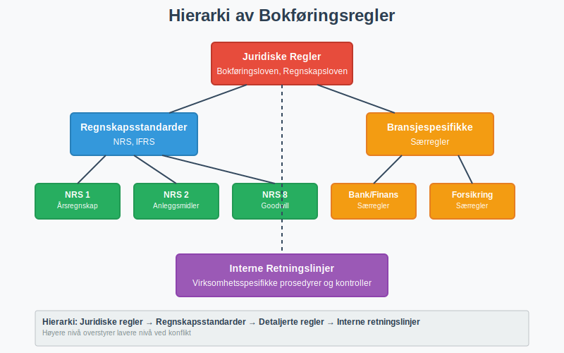
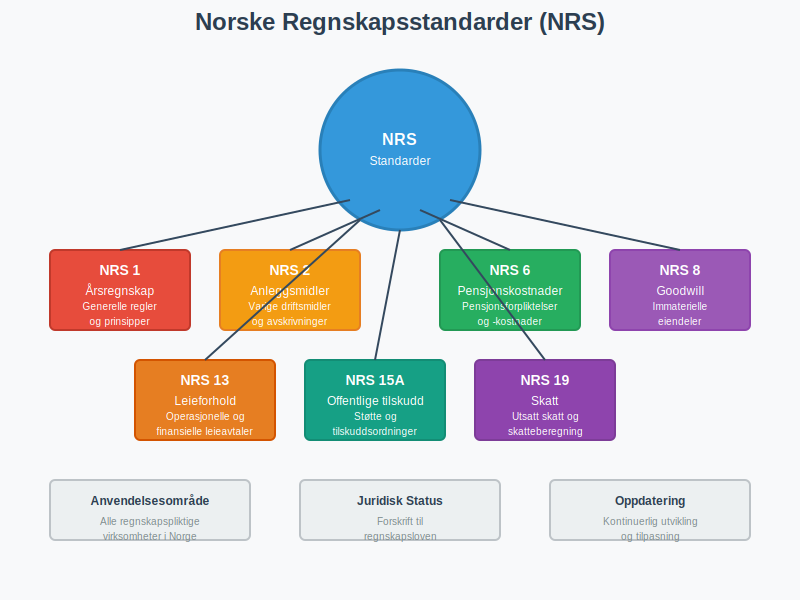
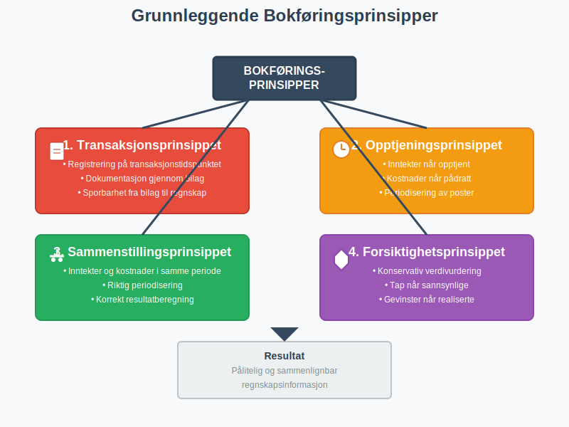
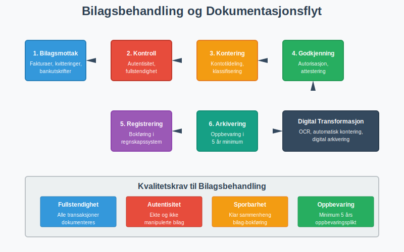
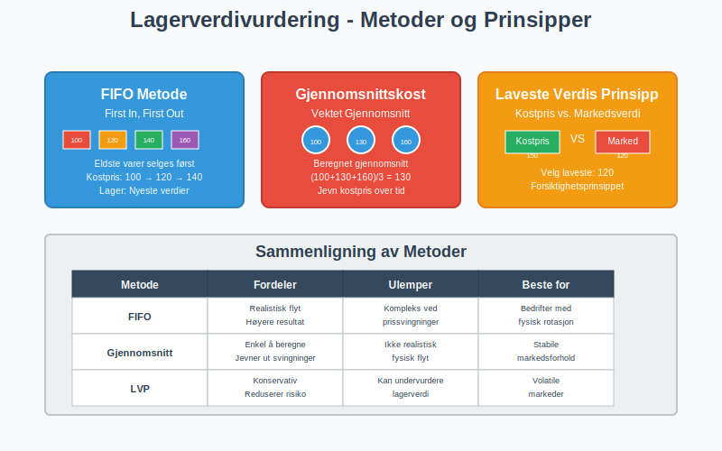
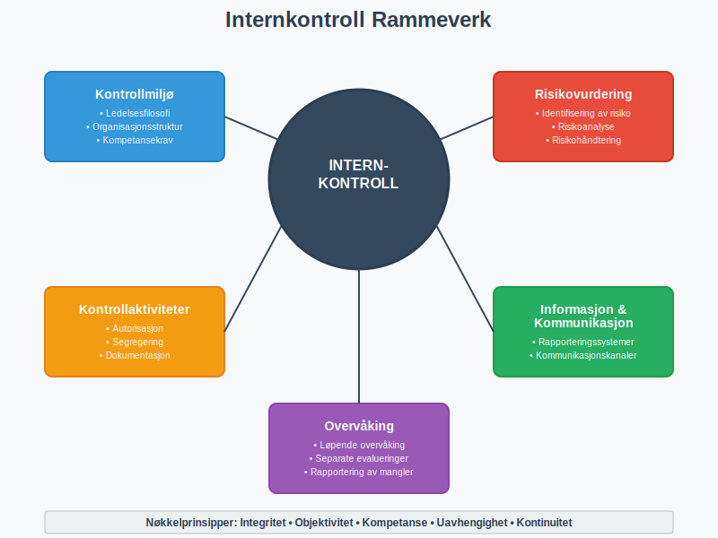
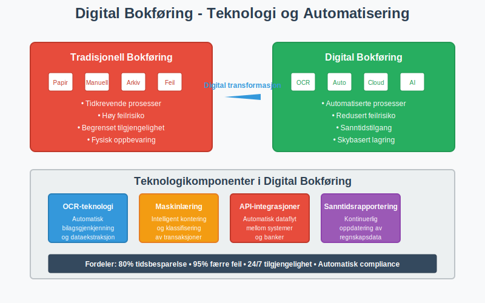
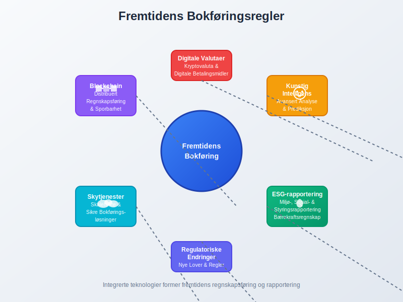

---
title: "Hva er Bokføringsregler? Komplett Guide til Norske Bokføringsstandarder"
meta_title: "Hva er Bokføringsregler? Komplett Guide til Norske Bokføringsstandarder"
meta_description: '**Bokføringsregler** utgjør det juridiske og praktiske rammeverket som regulerer hvordan norske virksomheter skal registrere, klassifisere og rapportere sine ...'
slug: hva-er-bokforingsregler
type: blog
layout: pages/single
---

**Bokføringsregler** utgjør det juridiske og praktiske rammeverket som regulerer hvordan norske virksomheter skal registrere, klassifisere og rapportere sine økonomiske transaksjoner. Disse reglene sikrer konsistens, sammenlignbarhet og pålitelighet i finansiell rapportering, og danner grunnlaget for [bokføring](/blogs/regnskap/hva-er-bokforing "Hva er Bokføring? En Komplett Guide til Norsk Bokføringspraksis") og [regnskap](/blogs/regnskap/hva-er-regnskap "Hva er regnskap? En dybdeanalyse for Norge") i Norge.

## Hva er Bokføringsregler?

Bokføringsregler er et sett med **standardiserte prinsipper, metoder og prosedyrer** som definerer hvordan økonomiske hendelser skal dokumenteres, måles og presenteres i regnskapet. Disse reglene sikrer at alle virksomheter følger samme grunnleggende standarder for finansiell rapportering.

### Hovedkategorier av Bokføringsregler

* **Juridiske regler:** Lovpålagte krav fra [bokføringsloven](/blogs/regnskap/hva-er-bokføringsloven "Hva er Bokføringsloven? Komplett Guide til Norsk Bokføringslovgivning") og regnskapslovgivningen
* **Regnskapsstandarder:** [Norske regnskapsstandarder (NRS)](/blogs/regnskap/norsk-regnskapsstandard-nrs "Norsk regnskapsstandard (NRS) - Komplett Guide til Norske Regnskapsstandarder") og internasjonale standarder (IFRS)
* **[Bransjespesifikke regler](/blogs/regnskap/naringsspesifikasjon "Hva er Næringsspesifikasjon? Komplett Guide til Næringsklassifisering og Rapportering"):** Særlige krav for spesifikke næringer og virksomhetstyper
* **Interne retningslinjer:** Virksomhetens egne prosedyrer og kontrollsystemer

## Det Norske Regelverket for Bokføring

### Lovgivningsmessige Grunnlag

Det norske bokføringsregelverket bygger på flere juridiske kilder som sammen danner et helhetlig system:

| Regelverk | Anvendelsesområde | Hovedinnhold |
|---|---|---|
| Bokføringsloven | [bokføringspliktige](/blogs/regnskap/hva-er-bokforingsplikt "Hva er Bokføringsplikt i Norge?") | Grunnleggende bokføringskrav og -prinsipper |
| Regnskapsloven | Regnskapspliktige virksomheter | Ã…rsregnskapsregler og rapporteringskrav |
| [Bokføringsforskriften](/blogs/regnskap/hva-er-bokforingsforskriften "Hva er Bokføringsforskriften? Detaljerte Regler for Norsk Bokføring") | [bokføringspliktige](/blogs/regnskap/hva-er-bokforingsplikt "Hva er Bokføringsplikt i Norge?") | Detaljerte gjennomføringsbestemmelser |
| Regnskapsforskriften | Regnskapspliktige virksomheter | Spesifikke regnskapsregler og standarder |
| Skatteloven | Alle skattepliktige | Skattemessige bokførings- og rapporteringskrav |

### [Norske Regnskapsstandarder (NRS)](/blogs/regnskap/norsk-regnskapsstandard-nrs "Norsk regnskapsstandard (NRS) - Komplett Guide til Norske Regnskapsstandarder")

**NRS** utgjør det tekniske rammeverket for regnskapsføring i Norge og dekker spesifikke områder som:

* **NRS 1:** Ã…rsregnskap - generelle regler
* **NRS 2:** Anleggsmidler
* **NRS 6:** Pensjonskostnader
* **NRS 8:** Goodwill og andre immaterielle eiendeler
* **NRS 13:** Leieforhold
* **NRS 15A:** Offentlige tilskudd

## Grunnleggende Bokføringsprinsipper

### De Fire Fundamentale Prinsippene

**1. [Transaksjonsprinsippet](/blogs/regnskap/transaksjon "Transaksjon")**
* Alle [transaksjoner](/blogs/regnskap/transaksjon "Transaksjon") skal registreres på transaksjonstidspunktet
* Dokumentasjon gjennom [bilag](/blogs/regnskap/hva-er-bilag "Hva er Bilag i Regnskap? Komplett Guide til Regnskapsbilag") er obligatorisk
* Sporbarhet fra bilag til regnskap må sikres

**2. Opptjeningsprinsippet**
* Inntekter registreres når de er **opptjent**, ikke når de mottas
* Kostnader registreres når de er **pådratt**, ikke når de betales
* Periodisering sikrer korrekt resultatmåling

**3. Sammenstillingsprinsippet**
* Inntekter og tilhørende kostnader skal **sammenstilles** i samme periode
* Sikrer riktig [periodisering](/blogs/regnskap/hva-er-periodisering "Hva er Periodisering i Regnskap? Komplett Guide til Periodiseringsprinsippet") av resultatposter
* Grunnlag for korrekt resultatberegning

**4. Forsiktighetsprinsippet**
* **Konservativ** tilnærming til verdivurdering
* Tap skal regnskapsføres når de er sannsynlige
* Gevinster regnskapsføres først når de er realiserte

### Kvalitative Egenskaper ved Regnskapsinformasjon

| Egenskap | Beskrivelse | Praktisk Betydning |
|---|---|---|
| **Relevans** | Informasjonen påvirker økonomiske beslutninger | Fokus på vesentlig informasjon |
| **Pålitelighet** | Informasjonen er fri for vesentlige feil | Korrekt måling og presentasjon |
| **Sammenlignbarhet** | Konsistente metoder over tid og mellom virksomheter | Standardiserte regnskapsmetoder |
| **Forståelighet** | Informasjonen er tilgjengelig for brukerne | Klar presentasjon og noteopplysninger |

## Praktisk Anvendelse av Bokføringsregler

### Registrering og Klassifisering

**Kontoplansystem:**
Norske virksomheter følger et standardisert kontoplansystem som sikrer konsistent klassifisering:

* **Klasse 1:** [Anleggsmidler](/blogs/regnskap/hva-er-anleggsmidler "Hva er Anleggsmidler? Komplett Guide til Varige Driftsmidler")
* **Klasse 2:** Omløpsmidler og kortsiktige fordringer, se [Konto 1400 - Råvarer og innkjøpte halvfabrikater](/blogs/kontoplan/1400-raavarer-og-innkjopte-halvfabrikater "Konto 1400 - Råvarer og innkjøpte halvfabrikater") for varelageret.
* **Klasse 3:** Egenkapital og [aksjekapital](/blogs/regnskap/hva-er-aksjekapital "Hva er Aksjekapital? Komplett Guide til Egenkapital i AS")
* **Klasse 4:** Langsiktig gjeld og [avsetninger](/blogs/regnskap/avsetning "Avsetning i Regnskap - Komplett Guide til Avsetninger og Estimater")
* **Klasse 5:** Kortsiktig gjeld
* **Klasse 6:** Driftskostnader
* **Klasse 7:** Driftsinntekter
* **Klasse 8:** Finansposter

### Bilagsbehandling og Dokumentasjon

**Krav til bilagsføring:**

* **Fullstendighet:** Alle transaksjoner må dokumenteres
* **Autentisitet:** [Bilag](/blogs/regnskap/hva-er-bilag "Hva er Bilag i Regnskap? Komplett Guide til Regnskapsbilag") må være ekte og ikke manipulerte
* **Sporbarhet:** Klar sammenheng mellom bilag og bokføring
* **Oppbevaring:** Minimum 5 års oppbevaringsplikt

### Periodisering og Avstemming

**Månedlige bokføringsrutiner:**

1. **Registrering av løpende transaksjoner**
   * [Fakturaer](/blogs/regnskap/hva-er-en-faktura "Hva er en Faktura? En Guide til Norske Fakturakrav") og innbetalinger
   * Lønnsutbetalinger og personalrelaterte kostnader
   * Driftskostnader og investeringer

2. **Periodisering av poster**
   * Påløpte, ikke betalte kostnader
   * Forskuddsbetalte kostnader
   * Opptjente, ikke fakturerte inntekter

3. **[Avstemming](/blogs/regnskap/hva-er-avstemming "Hva er Avstemming i Regnskap? Komplett Guide til Regnskapsavstemming") av balanseposter**
   * [Bankavstemming](/blogs/regnskap/hva-er-bankavstemming "Hva er Bankavstemming? Komplett Guide til Bankavstemminger")
   * Kundefordringer og leverandørgjeld
   * Varelager og [arbeidskapital](/blogs/regnskap/hva-er-arbeidskapital "Hva er Arbeidskapital? En Komplett Guide til Working Capital")

## Spesielle Bokføringsregler

### Anleggsmidler og Avskrivninger

**Avskrivningsregler:**

| Anleggsmiddeltype | Avskrivningsmetode | Typisk avskrivningstid |
|---|---|---|
| Bygninger | Lineær | 20-50 år |
| Maskiner og utstyr | Lineær/degressiv | 3-10 år |
| Transportmidler | Lineær/degressiv | 5-8 år |
| Datautstyr | Lineær/degressiv | 3-5 år |
| Immaterielle eiendeler | Lineær | 3-20 år |

**[Avskrivning](/blogs/regnskap/hva-er-avskrivning "Hva er Avskrivning? Komplett Guide til Avskrivningsmetoder")** skal reflektere den faktiske verdireduksjonen over eiendelens levetid.

### Varelager og Verdivurdering

**Lagerprinsipp:**
* **FIFO (First In, First Out):** Eldste varer selges først
* **Gjennomsnittskost:** Vektet gjennomsnitt av innkjøpskost
* **Laveste verdis prinsipp:** Kostpris eller markedsverdi, det laveste

### Valutaomregning

**Regler for utenlandske transaksjoner:**

* **Transaksjonstidspunkt:** Omregning til dagskurs
* **Balansetidspunkt:** Omregning av utestående poster til balansedagskurs
* **Valutagevinster/-tap:** Resultatføring av realiserte og urealiserte poster

## Internkontroll og Compliance

### Krav til Internkontroll

**Kontrollmiljø:**
* Klare ansvarsforhold og myndighetslinjer
* Kompetansekrav for regnskapspersonell
* Etiske retningslinjer og atferdskoder

**Kontrollaktiviteter:**
* **Autorisasjon:** Godkjenning av transaksjoner
* **Segregering:** Arbeidsdeling mellom registrering og kontroll
* **Dokumentasjon:** Sporbarhet og arkivering
* **Fysisk sikring:** Beskyttelse av eiendeler og dokumenter

### Revisjonsplikt og Eksterne Krav

**Revisjonsplikt gjelder for:**

| Virksomhetstype | Revisjonsplikt | Grunnlag |
|---|---|---|
| Allmennaksjeselskap (ASA) | Ja, alltid | Allmennaksjeloven |
| Aksjeselskap (AS) | Ja, med unntak | Aksjeloven § 7-1 |
| Stiftelser | Avhengig av størrelse | Stiftelsesloven |
| Foreninger | Avhengig av aktivitet | Særlovgivning |

**Unntaksregler for små AS:**
* Salgsinntekter < 70 MNOK
* Balansesum < 35 MNOK
* Gjennomsnittlig antall ansatte < 50

## Digitalisering og Moderne Bokføringsregler

### Elektronisk Bokføring

**Krav til digitale systemer:**
* **Sporbarhet:** Digital revisjonsspor må opprettholdes
* **Sikkerhet:** Beskyttelse mot uautoriserte endringer
* **Tilgjengelighet:** Mulighet for kontroll og revisjon
* **Oppbevaring:** Sikker lagring i minimum 5 år

### Automatisering og AI

**Moderne teknologiløsninger:**
* **OCR-teknologi:** Automatisk bilagsgjenkjenning
* **Maskinlæring:** Intelligent kontering og klassifisering
* **API-integrasjoner:** Automatisk dataflyt mellom systemer
* **Sanntidsrapportering:** Kontinuerlig oppdatering av regnskapsdata

## Sanksjoner og Konsekvenser

### Brudd på Bokføringsregler

**Administrative sanksjoner:**
* **Tvangsmulkt:** Daglige mulkter ved manglende etterlevelse
* **Overtredelsesgebyr:** Faste gebyrer for regelbrudd
* **PÃ¥legg:** Krav om retting av forhold

**Strafferettslige konsekvenser:**
* **Bøter:** Økonomiske straffer for grove brudd
* **Fengsel:** I alvorlige tilfeller av regnskapsmanipulasjon
* **Erstatningsansvar:** Ansvar overfor kreditorer og investorer

### Forebygging av Regelbrudd

**Beste praksis:**
* **Kompetanseutvikling:** Kontinuerlig opplæring av regnskapspersonell
* **Systemoppdateringer:** Holde bokføringssystemer oppdaterte
* **Regelmessig kontroll:** Periodiske gjennomganger av rutiner
* **Ekstern rådgivning:** Bruk av autoriserte regnskapsførere

## Fremtidige Utviklingstrekk

### Regulatoriske Endringer

**Kommende regelverksendringer:**
* **ESG-rapportering:** Miljø-, sosial- og styringsrapportering
* **Bærekraftsregnskap:** Integrering av [bærekraftsmålinger](/blogs/regnskap/baerekraft "Bærekraft i Regnskap: En Komplett Guide til Bærekraft og Bærekraftsrapportering")
* **Digitale valutaer:** Regler for kryptovaluta og digitale betalingsmidler

### Teknologisk Utvikling

**Nye teknologier:**
* **Blockchain:** Distribuert regnskapsføring og sporbarhet
* **Kunstig intelligens:** Avansert analyse og prediksjon
* **Skytjenester:** Skalerbare og sikre bokføringsløsninger

## Praktiske RÃ¥d for Implementering

### For Små og Mellomstore Bedrifter

**Implementeringsstrategi:**

1. **Kartlegging av behov**
   * Vurder virksomhetens størrelse og kompleksitet
   * Identifiser kritiske regnskapsområder
   * Evaluer eksisterende systemer og rutiner

2. **Systemvalg og implementering**
   * Velg bokføringssystem tilpasset virksomhetens behov
   * Sikre integrasjon med andre forretningssystemer
   * Etabler backup- og sikkerhetsprosedyrer

3. **Kompetanseutvikling**
   * Opplæring av internt personell
   * Etablering av samarbeid med autorisert regnskapsfører
   * Kontinuerlig oppdatering på regelverksendringer

### Kvalitetssikring og Kontroll

**Kontrollrutiner:**
* **MÃ¥nedlig avstemming** av alle balanseposter
* **Kvartalsvis gjennomgang** av resultatregnskap
* **Ã…rlig evaluering** av regnskapsprinsipper og -metoder

**Dokumentasjon:**
* **Regnskapsinstrukser:** Skriftlige prosedyrer for alle regnskapsområder
* **Kontrollspor:** Dokumentasjon av alle kontrollaktiviteter
* **Arkivering:** Systematisk oppbevaring av bilag og dokumenter

## Konklusjon

Bokføringsregler utgjør det fundamentale rammeverket for finansiell rapportering i Norge og sikrer **transparens, sammenlignbarhet og pålitelighet** i regnskapsføringen. Forståelse og korrekt anvendelse av disse reglene er essensielt for alle virksomheter, uavhengig av størrelse eller bransje.

**Nøkkelpunkter for suksess:**
* **Systematisk tilnærming** til implementering og oppfølging
* **Kontinuerlig kompetanseutvikling** og oppdatering på regelverksendringer  
* **Robust internkontroll** og kvalitetssikringsprosesser
* **Proaktiv tilpasning** til teknologiske og regulatoriske endringer

Ved å følge etablerte bokføringsregler og beste praksis sikrer virksomheter ikke bare lovmessig compliance, men skaper også grunnlag for **bedre økonomisk styring, informerte beslutninger og bærekraftig vekst**.

Effektiv implementering av bokføringsregler krever både teknisk kompetanse og strategisk forståelse av virksomhetens behov. Med riktig tilnærming blir bokføringsregler ikke bare et lovkrav, men et verdifullt verktøy for **økonomisk styring og verdiskaping**.

