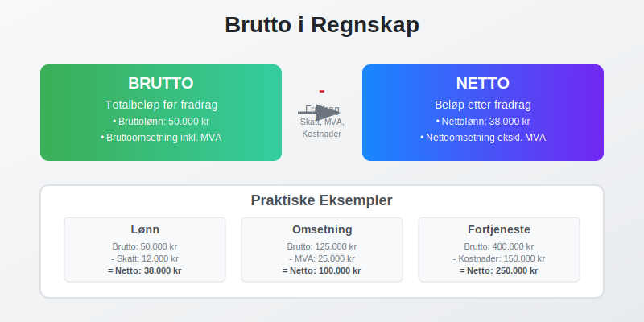
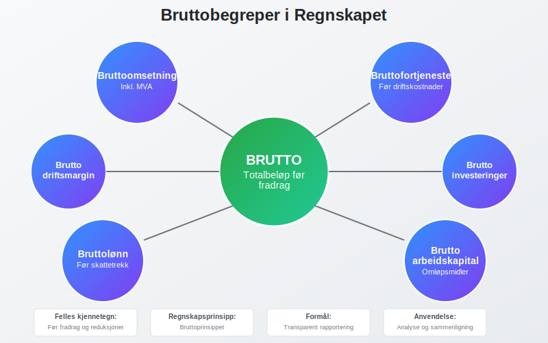
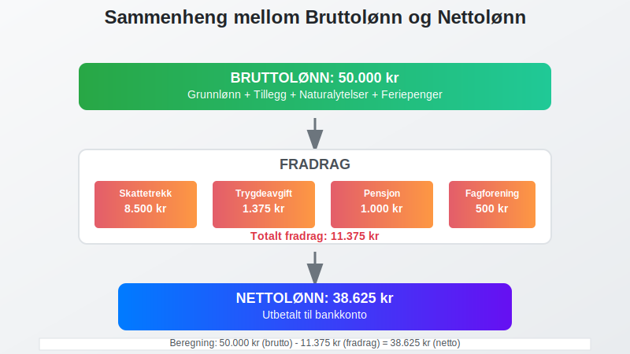
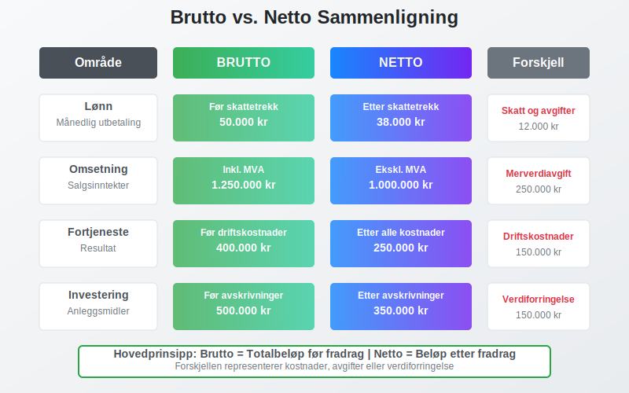
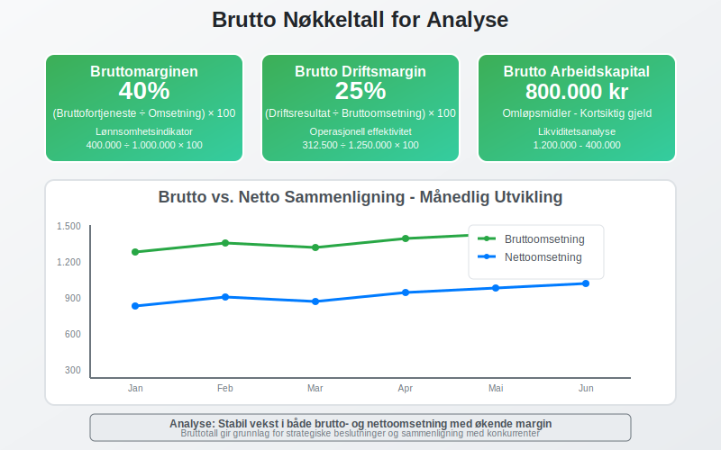
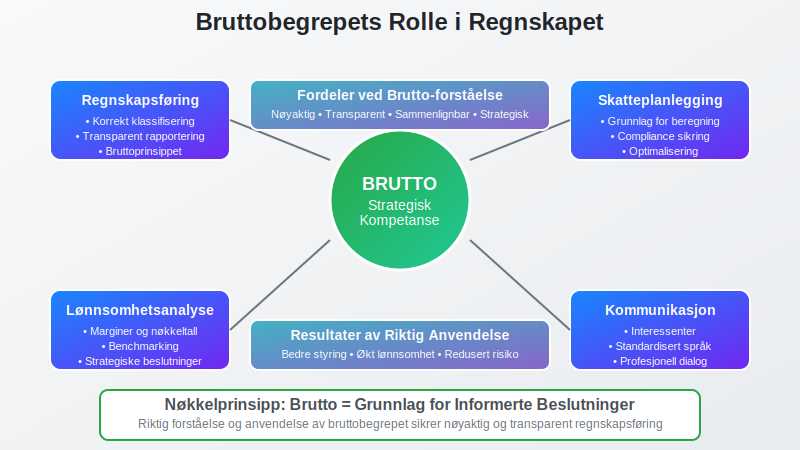

---
title: "Hva er Brutto i Regnskap?"
meta_title: "Hva er Brutto i Regnskap?"
meta_description: '**Brutto** er et grunnleggende begrep i [regnskapet](/blogs/regnskap/hva-er-regnskap "Hva er Regnskap? En komplett guide") som refererer til **totalbeløpet fø...'
slug: hva-er-brutto
type: blog
layout: pages/single
---

**Brutto** er et grunnleggende begrep i [regnskapet](/blogs/regnskap/hva-er-regnskap "Hva er Regnskap? En komplett guide") som refererer til **totalbeløpet før fradrag** av skatter, avgifter, kostnader eller andre reduksjoner. Begrepet brukes i mange sammenhenger og er essensielt for å forstå forskjellen mellom brutto- og nettoverdier i regnskapsføringen.



## Hva er Brutto?

Brutto representerer den **opprinnelige eller totale verdien** av et beløp før det gjøres fradrag. Dette står i motsetning til **[netto](/blogs/regnskap/hva-er-netto "Hva er Netto i Regnskap? Definisjon og Praktisk Anvendelse")**, som er beløpet etter at alle relevante fradrag er gjort. Forståelsen av brutto-netto-forholdet er fundamental for:

* **Korrekt regnskapsføring** av inntekter og kostnader
* **Skatteberegninger** og avgiftsbehandling
* **Lønnsadministrasjon** og personalregnskap
* **Analyse av lønnsomhet** og økonomisk ytelse
* **Sammenligning** av økonomiske nøkkeltall

### Grunnleggende Prinsipper

Bruttobegrepet bygger på flere regnskapsprinsipper:

- **Bruttoprinsippet:** Inntekter og kostnader skal vises i sin helhet
- **Sammenstillingsprinsippet:** Kostnader skal matches mot tilhørende inntekter
- **Forsiktighetsprinsippet:** Usikre poster skal behandles konservativt
- **Klarhetsprinsippet:** Regnskapet skal gi et klart bilde av virksomheten

## Bruttobegreper i Regnskapet



### Bruttoomsetning

**Bruttoomsetning** er den totale salgsinntekten før fradrag av [merverdiavgift](/blogs/regnskap/hva-er-avgiftsplikt-mva "Avgiftsplikt MVA - Regler, Unntak og Praktisk Veiledning"), rabatter og returvarer.

#### Beregning av Bruttoomsetning:
```
Bruttoomsetning = Salgsinntekter + MVA + Rabatter + Returvarer
```

#### Eksempel: Bruttoomsetning
Et selskap selger varer for **800.000 kr** ekskl. MVA (25%), gir **50.000 kr** i rabatter og mottar **20.000 kr** i returvarer.

**Beregning:**
- Salgsinntekter ekskl. MVA: 800.000 kr
- MVA (25%): 200.000 kr
- Rabatter: 50.000 kr
- Returvarer: 20.000 kr
- **Bruttoomsetning: 1.070.000 kr**

### Bruttofortjeneste

**Bruttofortjeneste** er differansen mellom salgsinntekter og [varekostnader](/blogs/regnskap/hva-er-anskaffelseskost "Hva er Anskaffelseskost? Komplett Guide til Beregning og Regnskapsføring") før andre driftskostnader.

#### Formel for Bruttofortjeneste:
```
Bruttofortjeneste = Salgsinntekter - Varekostnad
Bruttomargin (%) = (Bruttofortjeneste ÷ Salgsinntekter) × 100
```

#### Eksempel: Bruttofortjeneste
| Post | Beløp (kr) |
|------|------------|
| Salgsinntekter | 1.000.000 |
| Varekostnad | 600.000 |
| **Bruttofortjeneste** | **400.000** |
| **Bruttomargin** | **40%** |

### Bruttolønn

**Bruttolønn** er den totale lønnen før fradrag av skatt, [arbeidsgiveravgift](/blogs/regnskap/hva-er-arbeidsgiveravgift "Hva er Arbeidsgiveravgift? Satser, Beregning og Regnskapsføring") og andre trekk.



#### Komponenter i Bruttolønn:
* **[Grunnlønn](/blogs/regnskap/hva-er-grunnlonn "Hva er Grunnlønn i Regnskap?"):** Fast månedlig eller timelønn
* **Overtidstillegg:** Tillegg for arbeid utover normal arbeidstid
* **Bonus og provisjon:** Variable lønnskomponenter
* **Naturalytelser:** Verdien av goder som bil, telefon, etc.
* **Feriepenger:** Opptjente feriepenger (12% av bruttolønn)

### Brutto vs. Netto Sammenligning



| Område | Brutto | Netto | Forskjell |
|--------|--------|-------|-----------|
| **Lønn** | Før skattetrekk | Etter skattetrekk | Skatt og avgifter |
| **Omsetning** | Inkl. MVA | Ekskl. MVA | Merverdiavgift |
| **Fortjeneste** | Før driftskostnader | Etter alle kostnader | Driftskostnader |
| **Investering** | Før avskrivninger | Etter [avskrivninger](/blogs/regnskap/hva-er-avskrivning "Hva er Avskrivning? Metoder, Beregning og Regnskapsføring") | Verdiforringelse |

## Regnskapsføring av Bruttoposter

### Bruttoomsetning i Regnskapet

Bruttoomsetning regnskapsføres når salget finner sted, uavhengig av betalingstidspunkt:

**Regnskapsføring ved salg:**
```
Debet: Kundefordringer / Kasse    1.250.000 kr
Kredit: Salgsinntekter                1.000.000 kr
Kredit: Utgående MVA                    250.000 kr
```

> **For mer informasjon om bruttolønn**, se [Hva er Bruttolønn?](/blogs/regnskap/hva-er-bruttolonn "Hva er Bruttolønn? Definisjon, Beregning og Praktisk Anvendelse").

### Bruttolønn i Lønnsregnskapet

Bruttolønn danner grunnlaget for alle lønnsberegninger og [A-meldingen](/blogs/regnskap/hva-er-a-melding "Hva er A-melding? Komplett Guide til Innlevering og Frister"):

**Regnskapsføring av bruttolønn:**
```
Debet: Lønnskostnad               500.000 kr
Kredit: Skyldig lønn                400.000 kr
Kredit: Skyldig skattetrekk         100.000 kr
```

## Praktiske Anvendelser

### Budsjett og Prognoser

Bruttotall brukes som utgangspunkt for:

* **Omsetningsprognoser:** Planlegging av fremtidig salg
* **Lønnsbudsjett:** Beregning av totale lønnskostnader
* **Investeringsanalyser:** Vurdering av [avkastning](/blogs/regnskap/hva-er-avkastning "Hva er Avkastning? Beregning, Typer og Analyse i Regnskap") før kostnader
* **Skatteplanlegging:** Grunnlag for skatteberegninger

### Nøkkeltallsanalyse



Viktige brutto-baserte nøkkeltall:

| Nøkkeltall | Formel | Formål |
|------------|--------|---------|
| **Bruttomarginen** | (Bruttofortjeneste ÷ Omsetning) × 100 | Lønnsomhetsanalyse |
| **Brutto driftsmargin** | (Driftsresultat ÷ Bruttoomsetning) × 100 | Operasjonell effektivitet |
| **Brutto [arbeidskapital](/blogs/regnskap/hva-er-arbeidskapital "Hva er Arbeidskapital? Beregning, Analyse og Optimalisering")** | Omløpsmidler - Kortsiktig gjeld | Likviditetsanalyse |

### Skattemessige Konsekvenser

Bruttobegrepet har viktige skattemessige implikasjoner:

* **Skattepliktig inntekt:** Beregnes ofte fra bruttoinntekt
* **Fradragsrett:** Kostnader trekkes fra bruttoinntekt
* **[Minstefradrag](/blogs/regnskap/hva-er-minstefradrag "Hva er Minstefradrag? Komplett Guide til Minstefradrag i Norge 2024"):** Standardisert fradrag på 46% av bruttolønn (maks kr 104 850) som automatisk reduserer skattepliktig inntekt
* **MVA-behandling:** Bruttoomsetning danner grunnlag for MVA-beregning
* **Arbeidsgiveravgift:** Beregnes av bruttolønn over visse grenser

## Vanlige Feil og Misforståelser

### Typiske Feilkilder

* **Blanding av brutto og [netto](/blogs/regnskap/hva-er-netto "Hva er Netto i Regnskap? Definisjon og Praktisk Anvendelse"):** Inkonsistent bruk av begrepene
* **MVA-behandling:** Feil håndtering av merverdiavgift i bruttotall
* **Periodisering:** Feil tidspunkt for regnskapsføring av bruttoposter
* **Valutaomregning:** Komplisert ved utenlandske transaksjoner

### Beste Praksis

For å unngå feil bør man:

1. **Etablere klare rutiner** for brutto/netto-klassifisering
2. **Dokumentere beregningsmetoder** grundig
3. **Gjennomføre regelmessige avstemminger** mot eksterne kilder
4. **Oppdatere seg på regelverksendringer** som påvirker bruttobegrepet

## Internasjonale Perspektiver

### IFRS og Bruttoprinsipper

Under **International Financial Reporting Standards (IFRS)** er bruttoprinsippet sentralt:

* **IAS 1:** Presentasjon av [finansregnskap](/blogs/regnskap/hva-er-finansregnskap "Hva er Finansregnskap? En Komplett Guide til Ekstern Finansiell Rapportering")
* **IFRS 15:** Inntektsføring fra kontrakter med kunder
* **IAS 19:** Ytelser til ansatte (bruttolønn)

### Forskjeller Mellom Land

Bruttobegrepet kan variere mellom land:

| Land | Særtrekk | Eksempel |
|------|----------|----------|
| **Norge** | MVA inkludert i brutto | Bruttoomsetning inkl. 25% MVA |
| **USA** | Sales tax separat | Gross revenue før sales tax |
| **Tyskland** | Umsatzsteuer integrert | Bruttoumsatz inkl. 19% USt |

## Digitalisering og Automatisering

### Moderne Regnskapssystemer

Dagens regnskapssystemer håndterer brutto/netto automatisk:

* **Automatisk MVA-beregning** fra bruttoomsetning
* **Integrert lønnsmodul** for brutto/netto-beregninger
* **Sanntidsrapportering** av brutto nøkkeltall
* **API-integrasjoner** med [banksystemer](/blogs/regnskap/hva-er-bankavstemming "Hva er Bankavstemming? Prosess, Metoder og Beste Praksis")

### Fremtidige Utviklingstrekk

* **AI-basert kategorisering** av brutto/netto-poster
* **Blockchain-teknologi** for transparent bruttosporing
* **Sanntidsanalyse** av bruttomarginer og lønnsomhet

## Konklusjon

Bruttobegrepet er **fundamentalt** i regnskapsføringen og påvirker alle aspekter av økonomisk rapportering. En solid forståelse av forskjellen mellom brutto og [netto](/blogs/regnskap/hva-er-netto "Hva er Netto i Regnskap? Definisjon og Praktisk Anvendelse") er essensielt for:

* **Korrekt regnskapsføring** og finansiell rapportering
* **Effektiv skatteplanlegging** og compliance
* **Presis lønnsomhetsanalyse** og strategisk planlegging
* **Profesjonell kommunikasjon** med interessenter

Ved å mestre bruttobegrepet legger man grunnlaget for mer avanserte regnskapskonsepter og sikrer **nøyaktig** og **transparent** finansiell rapportering som oppfyller både norske og internasjonale standarder.



Riktig forståelse og anvendelse av bruttobegrepet er derfor ikke bare en teknisk ferdighet, men en **strategisk kompetanse** som bidrar til bedre økonomisk styring og beslutningsgrunnlag for virksomheten.


