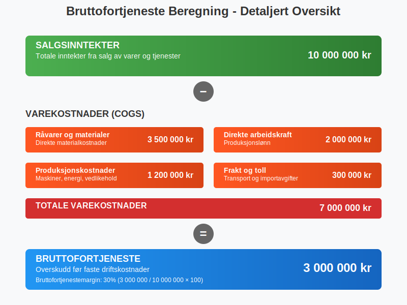
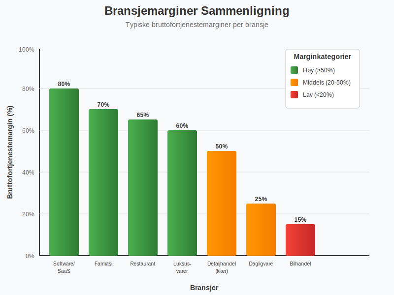

**Bruttofortjeneste** er et av de mest fundamentale nøkkeltallene i [regnskap](/blogs/regnskap/hva-er-regnskap "Hva er Regnskap? En Komplett Guide til Regnskapsføring") og finansiell analyse. Som en del av [bruttobegrepet](/blogs/regnskap/hva-er-brutto "Hva er Brutto i Regnskap? Definisjon, Beregning og Praktisk Anvendelse") i regnskapet, representerer den forskjellen mellom bedriftens [driftsinntekter](/blogs/regnskap/hva-er-driftsinntekter "Hva er Driftsinntekter? Komplett Guide til Driftsinntekter i Regnskap") og de direkte kostnadene knyttet til produksjon eller innkjøp av varene som selges. Bruttofortjeneste viser bedriftens evne til å generere [profitt](/blogs/regnskap/hva-er-profitt "Hva er Profitt? Komplett Guide til Profitt og Lønnsomhet") på kjernevirksomheten før faste kostnader som lønn, husleie og andre driftskostnader trekkes fra.


## Definisjon og Grunnleggende Forståelse

Bruttofortjeneste, også kalt **bruttomargin** eller **varesalgsresultat**, beregnes ved å trekke **varekostnader** (cost of goods sold - COGS) fra **salgsinntektene**. Dette gir et mål på hvor mye bedriften tjener på hver krone solgt før andre kostnader tas i betraktning.

### Formelen for Bruttofortjeneste

```
Bruttofortjeneste = Salgsinntekter - Varekostnader
```

Varekostnadene inkluderer alle direkte kostnader knyttet til produksjon eller innkjøp av varene som selges:

* **RÃ¥varer og materialer**
* **Direkte arbeidskraft** (produksjonslønn)
* **Produksjonskostnader** (maskiner, energi til produksjon)
* **Innkjøpspris** for handelsvarer
* **Frakt og toll** på innkjøpte varer



## Bruttofortjeneste vs. Nettoresultat

Det er viktig å skille mellom bruttofortjeneste og [nettoresultat](/blogs/regnskap/hva-er-balanse "Hva er Balanse? Forståelse av Balanseregnskap og Finansiell Posisjon"). Mens bruttofortjeneste kun ser på direkte kostnader, inkluderer nettoresultatet alle bedriftens kostnader og inntekter. For en omfattende forståelse av alle typer [profitt](/blogs/regnskap/hva-er-profitt "Hva er Profitt? Komplett Guide til Profitt og Lønnsomhet") og hvordan de henger sammen, anbefaler vi å lese vår detaljerte guide om profitt.

### Sammenligning av Resultatnivåer

| Resultatnivå | Beregning | Hva det viser |
|--------------|-----------|---------------|
| **[Salgsinntekter](/blogs/regnskap/hva-er-inntekter "Hva er Inntekter? Komplett Guide til Inntektstyper og Regnskapsføring")** | Totale inntekter fra salg | Bedriftens omsetning |
| **Bruttofortjeneste** | Salgsinntekter - Varekostnader | [Profitt](/blogs/regnskap/hva-er-profitt "Hva er Profitt? Komplett Guide til Profitt og Lønnsomhet") på kjernevirksomhet |
| **[Driftsresultat](/blogs/regnskap/hva-er-driftsresultat "Hva er Driftsresultat? Komplett Guide til Beregning og Analyse")** | Bruttofortjeneste - Driftskostnader | [Profitt](/blogs/regnskap/hva-er-profitt "Hva er Profitt? Komplett Guide til Profitt og Lønnsomhet") av ordinær drift |
| **Nettoresultat** | Driftsresultat - Finanskostnader - Skatt | Endelig overskudd til eiere |

## Bruttofortjenestemargin - Prosentvis Analyse

**Bruttofortjenestemargin** uttrykker bruttofortjeneste som en prosentandel av salgsinntektene og er et kraftig verktøy for sammenligning og analyse.

### Beregning av Bruttofortjenestemargin

```
Bruttofortjenestemargin (%) = (Bruttofortjeneste / Salgsinntekter) × 100
```


### Tolkning av Bruttofortjenestemargin

* **Høy margin (>50%):** Indikerer sterk prisingsmakt og effektiv kostnadskontroll
* **Middels margin (20-50%):** Typisk for mange bransjer med moderat konkurranse
* **Lav margin (<20%):** Vanlig i høyvolum/lavmargin-bransjer som dagligvare

## Bransjespesifikke Bruttofortjenestemarginer

Bruttofortjenestemarginer varierer betydelig mellom bransjer basert på forretningsmodell, konkurranse og kostnadsstruktur.

### Typiske Marginer per Bransje

| Bransje | Typisk Bruttofortjenestemargin | Karakteristikk |
|---------|-------------------------------|----------------|
| **Software/SaaS** | 70-90% | Høy margin, lave variable kostnader |
| **Farmasi** | 60-80% | Høy F&U-kostnad, patentbeskyttelse |
| **Luksusvarer** | 50-70% | Sterk merkevare, premium-prising |
| **Detaljhandel (klær)** | 40-60% | Moderat margin, sesongvariasjoner |
| **Restauranter** | 60-70% | Høy margin på mat, men høye driftskostnader |
| **Dagligvare** | 20-30% | Lav margin, høy omsetningshastighet |
| **Bilhandel** | 10-20% | Svært lav margin, volum-basert |



## Faktorer som PÃ¥virker Bruttofortjeneste

Flere faktorer kan påvirke bedriftens bruttofortjeneste, både positivt og negativt:

### Positive Faktorer

* **Prisøkninger:** Høyere salgspriser uten tilsvarende kostnadsøkning
* **Kostnadskutt:** Reduserte innkjøpspriser eller produksjonskostnader
* **Produktmiks:** Økt salg av høymargin-produkter
* **Effektivisering:** Bedre produksjonsprosesser og mindre svinn
* **Stordriftsfordeler:** Lavere enhetskostnader ved høyere volum

### Negative Faktorer

* **Prispress:** Konkurranse som tvinger ned salgspriser
* **Kostnadsøkninger:** Høyere råvarepriser eller lønnskostnader
* **Valutasvingninger:** PÃ¥virker importkostnader
* **Sesongvariasjoner:** Naturlige svingninger i etterspørsel og priser
* **Kvalitetsproblemer:** Økt svinn og returvarer

## Praktisk Eksempel: Beregning av Bruttofortjeneste

La oss se på et konkret eksempel fra en norsk produksjonsbedrift:

### Eksempel: Møbelprodusent AS

**Salgsinntekter for 2023:** 10 000 000 kr

**Varekostnader:**
* RÃ¥varer (tre, metall, tekstiler): 3 500 000 kr
* Direkte arbeidskraft (produksjonslønn): 2 000 000 kr
* Produksjonskostnader (maskiner, energi): 1 500 000 kr
* **Totale varekostnader:** 7 000 000 kr

**Beregning:**
* Bruttofortjeneste = 10 000 000 - 7 000 000 = **3 000 000 kr**
* Bruttofortjenestemargin = (3 000 000 / 10 000 000) × 100 = **30%**


## Bruttofortjeneste i Resultatregnskapet

I det norske [resultatregnskapet](/blogs/regnskap/hva-er-balanse "Hva er Balanse? Forståelse av Balanseregnskap og Finansiell Posisjon") presenteres bruttofortjeneste som en del av den standardiserte oppstillingen:

### Forenklet Resultatregnskap

```
RESULTATREGNSKAP
Salgsinntekter                     10 000 000
- Varekostnader                     7 000 000
= BRUTTOFORTJENESTE                 3 000 000

- Lønnskostnader                    1 500 000
- Andre driftskostnader               800 000
= DRIFTSRESULTAT                      700 000

- Finanskostnader                     100 000
= RESULTAT FØR SKATT                  600 000
- Skattekostnad                       150 000
= Ã…RSRESULTAT                         450 000
```

## Analyse og Benchmarking

### Intern Analyse

For å få maksimal verdi av bruttofortjenesteanalyse bør bedrifter:

* **Følge utvikling over tid:** Sammenlign marginer mellom perioder
* **Analysere produktlinjer:** Identifiser mest og minst lønnsomme produkter gjennom [nullpunkt-analyse](/blogs/regnskap/hva-er-nullpunkt "Hva er Nullpunkt (Break-Even) i Regnskap? Lønnsomhetsanalyse og Dekningsbidrag") og [dekningspunkt-analyse](/blogs/regnskap/hva-er-dekningspunkt "Hva er Dekningspunkt? Komplett Guide til Break-Even Analyse")
* **Dekningsbidragsanalyse:** Kombiner bruttofortjeneste med [dekningsbidrag](/blogs/regnskap/hva-er-dekningsbidrag "Hva er Dekningsbidrag? Beregning, Analyse og Praktiske Eksempler") for dypere lønnsomhetsinnsikt
* **Overvåke sesongvariasjoner:** Forstå naturlige svingninger
* **Benchmarke mot konkurrenter:** Sammenlign med bransjestandarder

### Nøkkeltall for Oppfølging

Bruttofortjeneste er grunnlaget for flere viktige [nøkkeltall](/blogs/regnskap/hva-er-nokkeltall "Hva er Nøkkeltall? Komplett Guide til Finansielle Nøkkeltall i Regnskap") som brukes til å analysere bedriftens lønnsomhet og effektivitet:

| Nøkkeltall | Beregning | Formål |
|------------|-----------|---------|
| **Bruttofortjeneste per ansatt** | Bruttofortjeneste / Antall ansatte | Produktivitetsmåling |
| **Bruttofortjeneste per m²** | Bruttofortjeneste / Butikkareal | Effektivitet i detaljhandel |
| **Bruttofortjeneste per kunde** | Bruttofortjeneste / Antall kunder | Kundelønnsomhet |


## Forbedring av Bruttofortjeneste

### Strategier for Økt Bruttofortjeneste

**1. Prisoptimalisering**
* Analyser priselastisitet for ulike produkter
* Implementer dynamisk prising basert på etterspørsel
* Vurder premium-posisjonering for unike produkter

**2. Kostnadsstyring**
* Forhandle bedre innkjøpsavtaler med leverandører
* Implementer [anskaffelsesprosesser](/blogs/regnskap/hva-er-anskaffelser "Hva er Anskaffelser? En Komplett Guide til Offentlige og Private Innkjøp") for bedre kostnadskontroll
* Reduser svinn og ineffektivitet i produksjon

**3. Produktmiks-optimalisering**
* Fokuser på høymargin-produkter i markedsføring
* Faset ut lavlønnsomme produktlinjer
* Utvikle nye produkter med høyere marginer

**4. Operasjonell Effektivitet**
* Automatiser produksjonsprosesser hvor mulig
* Implementer lean-prinsipper for å redusere sløsing
* Optimaliser lagerstyring for å redusere lagerkostnader

## Bruttofortjeneste og Kontantstrøm

Selv om bruttofortjeneste er viktig for lønnsomhet, må den sees i sammenheng med [betalingsevne](/blogs/regnskap/hva-er-betalingsevne "Hva er Betalingsevne? Analyse av Likviditet og Finansiell Stabilitet") og kontantstrøm. En høy bruttofortjeneste hjelper ikke hvis:

* Kundene betaler for sent eller ikke i det hele tatt
* For mye kapital er bundet opp i [varelager](/blogs/regnskap/hva-er-aktiva "Hva er Aktiva? Forståelse av Eiendeler i Balansen")
* Betalingsbetingelser til leverandører er ugunstige

### Sammenheng med Arbeidskapital

Bruttofortjeneste påvirker [arbeidskapital](/blogs/regnskap/hva-er-arbeidskapital "Hva er Arbeidskapital? Beregning og Betydning for Bedriftens Likviditet") gjennom:

* **Kundefordringer:** Høyere salg gir høyere fordringer
* **Varelager:** Økt salg krever ofte høyere lagernivåer
* **Leverandørgjeld:** Høyere innkjøp gir høyere leverandørgjeld

## Rapportering og Oppfølging

### MÃ¥nedlig Bruttofortjenesteanalyse

For effektiv styring bør bedrifter etablere månedlige rutiner for bruttofortjenesteanalyse:

**1. Datainnsamling**
* Samle salgstall fra alle kanaler
* Registrer alle varekostnader korrekt
* Sikre korrekt [bilagsføring](/blogs/regnskap/hva-er-bilagsføring "Hva er Bilagsføring? En Komplett Guide til Korrekt Regnskapsføring") av kostnader

**2. Analyse og Rapportering**
* Beregn bruttofortjeneste og margin
* Sammenlign med budsjett og foregående perioder
* Identifiser avvik og årsaker

**3. Handlingsplaner**
* Utvikle tiltak for å forbedre marginer
* Implementer korrigerende handlinger
* Følg opp resultater


## Bruttofortjeneste i Ulike Forretningsmodeller

### Handelsbedrifter

For rene handelsbedrifter som kjøper og selger varer uten bearbeiding:

* **Varekostnader** = Innkjøpspris + Frakt + Toll + Lagerkostnader
* **Fokus** på innkjøpsoptimalisering og lagerstyring
* **Utfordringer** med priskonkurranse og marginspress

[Detaljhandel](/blogs/regnskap/hva-er-detaljhandel "Hva er Detaljhandel? Komplett Guide til Regnskap og Økonomistyring for Butikker") og [engroshandel](/blogs/regnskap/hva-er-engroshandel "Hva er Engroshandel? Regnskap og Økonomistyring for Grossister") er spesielle typer handelsbedrifter med unike utfordringer. Detaljhandel har høyt transaksjonsvolum og spesialiserte kassasystemer, mens engroshandel fokuserer på store transaksjoner, omfattende lagerstyring og komplekse leverandørforhold som påvirker bruttofortjenesteberegningen.

### Produksjonsbedrifter

For bedrifter som produserer varer:

* **Varekostnader** = Råvarer + Direkte lønn + Produksjonskostnader
* **Fokus** på produksjonseffektivitet og kvalitetskontroll
* **Muligheter** for verdiøkning gjennom bearbeiding

### Tjenestebedrifter

For rene tjenestebedrifter kan bruttofortjeneste-konseptet tilpasses:

* **"Varekostnader"** = Direkte kostnader knyttet til tjenesteleveranse
* **Eksempler:** Konsulentlønn, reisekostnader, underleverandører
* **Høye marginer** er vanlig da fysiske varer ikke er involvert

## Skattemessige Implikasjoner

Bruttofortjeneste påvirker også bedriftens skatteposisjon:

### Lagerverdsettelse

Valg av lagerverdsettelsesmetode påvirker varekostnader og dermed bruttofortjeneste:

* **FIFO (First In, First Out):** Eldste varer kostnadsføres først
* **Gjennomsnittskost:** Jevner ut prissvingninger
* **LIFO (Last In, First Out):** Ikke tillatt i Norge

### Timing av Kostnadsføring

Korrekt timing av når kostnader skal [bokføres](/blogs/regnskap/hva-er-bokføring "Hva er Bokføring? En Komplett Guide til Grunnleggende Regnskapsprinsipper") påvirker bruttofortjeneste:

* **Periodiseringsprinsippet:** Kostnader skal matches mot tilhørende inntekter
* **Forskuddsbetalinger:** MÃ¥ periodiseres over leveringsperioden
* **Bonuser og rabatter:** MÃ¥ hensyntas i riktig periode

## Digitale Verktøy for Bruttofortjenesteanalyse

### Regnskapssystemer

Moderne regnskapssystemer tilbyr avanserte funksjoner for bruttofortjenesteanalyse:

* **Automatisk beregning** av marginer per produkt/kunde
* **Sanntidsrapportering** av bruttofortjeneste
* **Budsjett vs. faktisk** sammenligning
* **Trendanalyse** over tid

### Business Intelligence

Avanserte BI-verktøy kan gi dypere innsikt:

* **Multidimensjonal analyse** (produkt, kunde, region, tid)
* **Prediktiv analyse** for fremtidig utvikling
* **Automatiske varsler** ved avvik fra mål
* **Integrering** med andre forretningssystemer


## Konklusjon

Bruttofortjeneste er et fundamentalt nøkkeltall som gir kritisk innsikt i bedriftens lønnsomhet og operasjonelle effektivitet. Ved å forstå og aktivt styre bruttofortjeneste kan bedrifter:

* **Optimalisere prising** og produktmiks
* **Kontrollere kostnader** mer effektivt  
* **Benchmarke** mot konkurrenter og bransjestandarder
* **Ta informerte beslutninger** om forretningsutvikling

Regelmessig analyse og oppfølging av bruttofortjeneste, kombinert med andre finansielle nøkkeltall som [arbeidskapital](/blogs/regnskap/hva-er-arbeidskapital "Hva er Arbeidskapital? Beregning og Betydning for Bedriftens Likviditet") og [betalingsevne](/blogs/regnskap/hva-er-betalingsevne "Hva er Betalingsevne? Analyse av Likviditet og Finansiell Stabilitet"), gir et solid grunnlag for finansiell styring og langsiktig suksess.

For bedrifter som ønsker å forbedre sin bruttofortjeneste, er det viktig å ha en helhetlig tilnærming som inkluderer både strategiske og operasjonelle tiltak, støttet av robuste systemer for måling og oppfølging.
