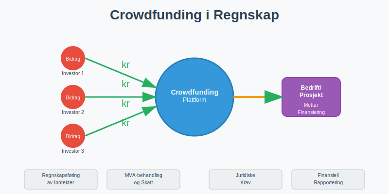
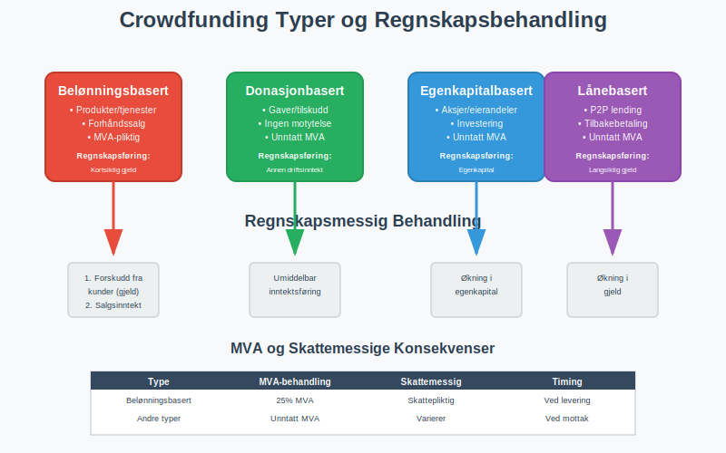
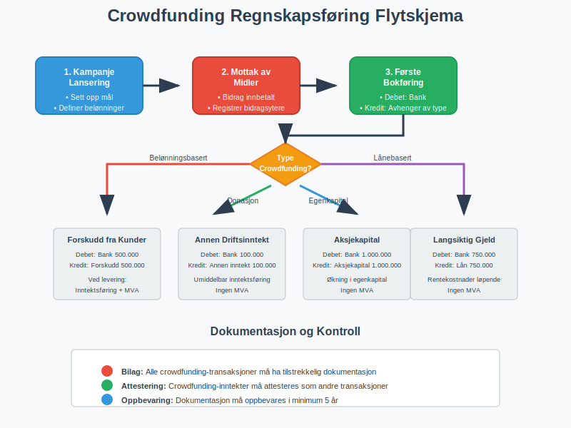
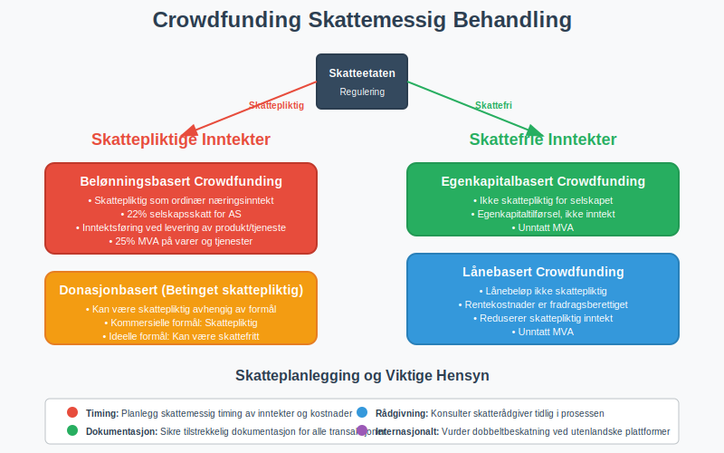
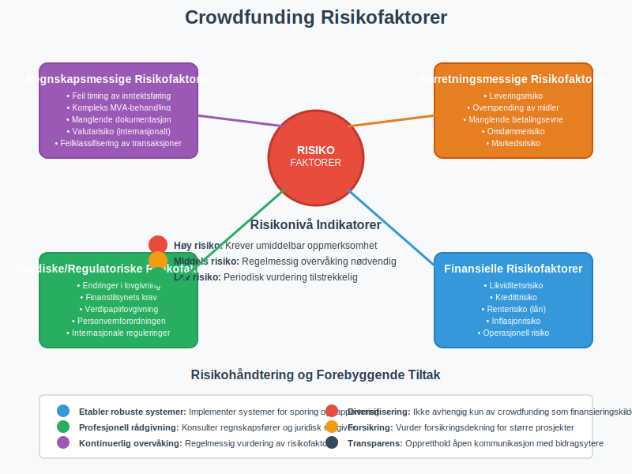
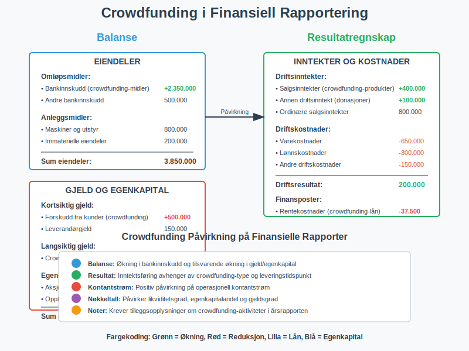

---
title: "Hva er Crowdfunding i Regnskap?"
meta_title: "Hva er Crowdfunding i Regnskap?"
meta_description: '**Crowdfunding** er en moderne [finansieringsmetode](/blogs/regnskap/hva-er-finansiering "Hva er Finansiering? Komplett Guide til Bedriftsfinansiering og Finans...'
slug: hva-er-crowdfunding
type: blog
layout: pages/single
---

**Crowdfunding** er en moderne [finansieringsmetode](/blogs/regnskap/hva-er-finansiering "Hva er Finansiering? Komplett Guide til Bedriftsfinansiering og Finansieringsformer") hvor mange personer bidrar med små beløp for å finansiere et prosjekt, produkt eller bedrift. Som en del av det bredere konseptet [crowdsourcing](/blogs/regnskap/hva-er-crowdsourcing "Hva er Crowdsourcing i Regnskap? Fordeler, Utfordringer og Praktisk Anvendelse"), representerer crowdfunding en spesifikk form for folkefinansiering. Fra et regnskapsperspektiv bringer crowdfunding unike utfordringer knyttet til [regnskapsføring](/blogs/regnskap/hva-er-regnskap "Hva er Regnskap? En Komplett Guide til Norsk Regnskapsføring"), skattemessig behandling og juridiske krav. For norske bedrifter som benytter crowdfunding, er det essensielt å forstå hvordan disse midlene skal behandles i henhold til [bokføringsloven](/blogs/regnskap/hva-er-bokføringsloven "Hva er Bokføringsloven? Komplett Guide til Norske Bokføringsregler") og gjeldende regnskapsregler.



## Typer Crowdfunding og Regnskapsmessig Behandling

Crowdfunding kan deles inn i fire hovedkategorier, hver med sine egne regnskapsmessige implikasjoner og krav til dokumentasjon.



### 1. Belønningsbasert Crowdfunding (Reward-based)

Dette er den mest vanlige formen for crowdfunding, hvor bidragsytere mottar produkter eller tjenester som takk for sitt bidrag. Fra et regnskapsperspektiv behandles dette som **forhåndssalg** eller **[forskuddsbetaling](/blogs/regnskap/hva-er-avanse "Hva er Avanse? Forskuddsbetaling, Regnskapsføring og Praktiske Råd")**.

**Regnskapsføring:**
* Innbetalte midler bokføres som kortsiktig gjeld (forskudd fra kunder)
* Inntektsføring skjer først når produktet/tjenesten leveres
* [MVA-behandling](/blogs/regnskap/hva-er-avgiftsplikt-mva "Hva er Avgiftsplikt (MVA)? Komplett Guide til Merverdiavgift i Norge") følger vanlige regler for salg av varer/tjenester

### 2. Donasjonbasert Crowdfunding (Donation-based)

Her gir bidragsytere penger uten å forvente noe tilbake. Dette behandles som **gave** eller **tilskudd** i regnskapet.

**Regnskapsføring:**
* Inntektsføres umiddelbart ved mottak
* Vanligvis ikke MVA-pliktig (gaver er [unntatt MVA](/blogs/regnskap/unntatt-mva "Unntatt MVA"))
* Kan være skattepliktig inntekt for mottaker

### 3. Egenkapitalbasert Crowdfunding (Equity-based)

Investorer kjøper aksjer eller eierandeler i bedriften. Dette behandles som **[aksjekapital](/blogs/regnskap/hva-er-aksjekapital "Hva er Aksjekapital? Komplett Guide til Aksjekapital i Norske AS")** eller **egenkapitaltilførsel** og er en form for **[egenfinansiering](/blogs/regnskap/hva-er-egenfinansiering "Hva er Egenfinansiering? Komplett Guide til Egenkapitalfinansiering")**.

**Regnskapsføring:**
* Økning i egenkapital
* Må følge [aksjeloven](/blogs/regnskap/hva-er-aksjeloven "Hva er Aksjeloven? Komplett Guide til Norsk Aksjelovgivning") og krav til [aksjeregistrering](/blogs/regnskap/hva-er-aksjonaerregisteret "Hva er Aksjonærregisteret? Komplett Guide til Registrering og Vedlikehold")
* Ikke MVA-pliktig

### 4. LÃ¥nebasert Crowdfunding (Debt-based/P2P Lending)

Bidragsytere låner penger til bedriften med forventning om tilbakebetaling med renter. Dette behandles som **langsiktig gjeld**. Denne formen for crowdfunding er også kjent som **[crowdlending](/blogs/regnskap/hva-er-crowdlending "Hva er Crowdlending i Regnskap? P2P Utlån, Regnskapsføring og Skattemessige Konsekvenser")** eller peer-to-peer utlån.

**Regnskapsføring:**
* Bokføres som gjeld i [balansen](/blogs/regnskap/hva-er-balanse "Hva er Balanse? Komplett Guide til Balanseregnskap og Finansiell Stilling")
* Rentekostnader kostnadsføres løpende
* Ikke MVA-pliktig

## Regnskapsføring av Crowdfunding-transaksjoner

Korrekt regnskapsføring av crowdfunding-aktiviteter krever forståelse av når og hvordan ulike transaksjoner skal behandles. Tabellen nedenfor viser de vanligste scenarioene:

| Crowdfunding Type | Bokføring ved Mottak | Bokføring ved Levering | MVA-behandling |
|-------------------|---------------------|------------------------|----------------|
| **Belønningsbasert** | Kortsiktig gjeld (Forskudd fra kunder) | Salgsinntekt + MVA | 25% MVA på varer/tjenester |
| **Donasjonbasert** | Annen driftsinntekt | - | [Unntatt MVA](/blogs/regnskap/unntatt-mva "Unntatt MVA") |
| **Egenkapitalbasert** | Egenkapital (Aksjekapital) | - | [Unntatt MVA](/blogs/regnskap/unntatt-mva "Unntatt MVA") |
| **Lånebasert** | Langsiktig gjeld | Rentekostnad (løpende) | [Unntatt MVA](/blogs/regnskap/unntatt-mva "Unntatt MVA") |



### Praktisk Eksempel: Belønningsbasert Crowdfunding

La oss se på et konkret eksempel hvor en bedrift samler inn 500.000 kr gjennom belønningsbasert crowdfunding for å produsere et nytt produkt:

**Fase 1 - Mottak av midler:**
```
Debet: Bank                     500.000
Kredit: Forskudd fra kunder     500.000
```

**Fase 2 - Levering av produkter (inkl. 25% MVA):**
```
Debet: Forskudd fra kunder      500.000
Kredit: Salgsinntekt           400.000
Kredit: Utgående MVA           100.000
```

## Skattemessige Konsekvenser

Skattemessig behandling av crowdfunding-inntekter avhenger av type crowdfunding og bedriftens organisasjonsform. For [aksjeselskaper](/blogs/regnskap/hva-er-et-aksjeselskap "Hva er et Aksjeselskap (AS)? Komplett Guide til Norske Aksjeselskaper") gjelder følgende hovedregler:

### Skattepliktige Inntekter

* **Belønningsbasert crowdfunding:** Skattepliktig som ordinær næringsinntekt
* **Donasjonbasert crowdfunding:** Kan være skattepliktig, avhenger av formål og struktur
* **Lånebasert crowdfunding:** Lånebeløpet er ikke skattepliktig, men rentekostnader er fradragsberettiget (se [crowdlending](/blogs/regnskap/hva-er-crowdlending "Hva er Crowdlending i Regnskap?") for detaljert informasjon)

### Skattefrie Inntekter

* **Egenkapitalbasert crowdfunding:** Ikke skattepliktig for selskapet (egenkapitaltilførsel)
* **Offentlige tilskudd:** Ofte skattefrie hvis de oppfyller spesifikke kriterier



## Juridiske Krav og Regulering

Crowdfunding i Norge er regulert av flere lover og forskrifter, avhengig av type crowdfunding:

### Finanstilsynets Regulering

* **Egenkapitalbasert crowdfunding:** Krever tillatelse fra Finanstilsynet for profesjonelle aktører
* **LÃ¥nebasert crowdfunding:** Omfattes av kredittilsynsloven
* **Verdipapirlovgivning:** Gjelder for egenkapitalbasert crowdfunding over visse terskelverdier

### Bokføringsplikt og Dokumentasjon

Alle crowdfunding-transaksjoner må dokumenteres i henhold til [bokføringsforskriften](/blogs/regnskap/hva-er-bokføringsforskriften "Hva er Bokføringsforskriften? Detaljert Guide til Norske Bokføringsregler"):

* **[Bilag](/blogs/regnskap/hva-er-bilag "Hva er Bilag? Komplett Guide til Regnskapsbilag og Dokumentasjon"):** Alle transaksjoner må ha tilstrekkelig dokumentasjon
* **[Attestering](/blogs/regnskap/hva-er-attestering "Hva er Attestering? En Komplett Guide til Bilagsbehandling og Godkjenning"):** Crowdfunding-inntekter må attesteres som andre forretningstransaksjoner
* **Oppbevaring:** Dokumentasjon må oppbevares i minimum 5 år

## Utfordringer og Risikofaktorer

Crowdfunding bringer flere regnskapsmessige og forretningsmessige utfordringer som bedrifter må være oppmerksomme på:

### Regnskapsmessige Utfordringer

* **Timing av inntektsføring:** Når skal crowdfunding-midler inntektsføres?
* **Valutarisiko:** Internasjonale crowdfunding-kampanjer kan medføre valutaeksponering
* **Kompleks MVA-behandling:** Ulike crowdfunding-typer har forskjellige MVA-implikasjoner

### Forretningsmessige Risikofaktorer

* **Leveringsrisiko:** Manglende evne til å levere lovede produkter/tjenester
* **[Betalingsevne](/blogs/regnskap/hva-er-betalingsevne "Hva er Betalingsevne? Analyse av Likviditet og Finansiell Stabilitet"):** Crowdfunding-midler må forvaltes forsvarlig
* **Regulatorisk risiko:** Endringer i lovgivning kan påvirke crowdfunding-aktiviteter



## Beste Praksis for Crowdfunding-regnskap

For å sikre korrekt regnskapsføring og overholdelse av juridiske krav, anbefales følgende beste praksis:

### 1. Etabler Klare Rutiner

* **Separat bankkonto:** Bruk egen konto for crowdfunding-midler
* **Detaljert dokumentasjon:** Registrer alle bidragsytere og deres bidrag
* **Regelmessig [avstemming](/blogs/regnskap/hva-er-avstemming "Hva er Avstemming? Komplett Guide til Regnskapsmessig Avstemming"):** Avstem crowdfunding-kontoer månedlig

### 2. Implementer Internkontroll

* **Godkjenningsprosesser:** Etabler klare prosedyrer for bruk av crowdfunding-midler
* **Rapportering:** Lag regelmessige rapporter til interessenter
* **Revisjon:** Vurder ekstern revisjon for større crowdfunding-prosjekter

### 3. Skatteplanlegging

* **Tidlig rådgivning:** Konsulter regnskapsfører eller skatterådgiver tidlig i prosessen
* **Dokumentasjon:** Sikre tilstrekkelig dokumentasjon for skattemessige formål
* **Periodisering:** Planlegg skattemessig timing av inntekter og kostnader

## Crowdfunding og Finansiell Rapportering

Crowdfunding-aktiviteter må reflekteres korrekt i bedriftens finansielle rapporter. Dette inkluderer:

### Balanse

* **Eiendeler:** Crowdfunding-midler øker [bankinnskudd](/blogs/regnskap/hva-er-bankinnskudd "Hva er Bankinnskudd? Komplett Guide til Bankinnskudd i Regnskap")
* **Gjeld:** Forskudd fra kunder (belønningsbasert) eller lån (lånebasert)
* **Egenkapital:** Økning ved egenkapitalbasert crowdfunding

### Resultatregnskap

* **Inntekter:** Crowdfunding-inntekter klassifiseres etter type
* **Kostnader:** Kostnader knyttet til crowdfunding-kampanjer
* **Finanskostnader:** Rentekostnader på crowdfunding-lån



## Internasjonale Aspekter

For norske bedrifter som benytter internasjonale crowdfunding-plattformer, oppstår ytterligere kompleksiteter:

### Valutahåndtering

* **Valutaomregning:** Crowdfunding-midler i utenlandsk valuta må omregnes til NOK
* **Valutarisiko:** Svingninger i valutakurser kan påvirke verdien av midlene
* **Sikring:** Vurder valutasikring for større beløp

### Skattemessige Implikasjoner

* **Dobbeltbeskatning:** Risiko for beskatning i både Norge og utlandet
* **Kildeskatt:** Enkelte land kan kreve kildeskatt på crowdfunding-inntekter
* **Rapporteringsplikt:** Internasjonale transaksjoner kan utløse særskilte rapporteringskrav

## Fremtidige Utviklingstrekk

Crowdfunding-markedet utvikler seg raskt, og nye reguleringer og teknologier påvirker regnskapsmessig behandling:

### Regulatoriske Endringer

* **EU-regulering:** Nye EU-regler for crowdfunding kan påvirke norske aktører
* **Digitale valutaer:** Crowdfunding med kryptovalutaer skaper nye regnskapsmessige utfordringer
* **Automatisering:** Økt bruk av automatiserte regnskapsløsninger for crowdfunding

### Teknologiske Innovasjoner

* **Blockchain:** Kan forbedre transparens og sporbarhet i crowdfunding
* **AI og maskinlæring:** Automatisering av regnskapsføring og risikohåndtering
* **Integrerte plattformer:** Bedre integrasjon mellom crowdfunding-plattformer og regnskapssystemer

## Konklusjon

Crowdfunding representerer en viktig finansieringsmetode for moderne bedrifter, men krever grundig forståelse av regnskapsmessige og juridiske implikasjoner. Korrekt behandling av crowdfunding-transaksjoner er essensielt for å opprettholde [regnskapsmessig integritet](/blogs/regnskap/hva-er-bokføring "Hva er Bokføring? Komplett Guide til Norsk Bokføring") og overholde gjeldende lovgivning.

For oppstartsselskaper kan det også være aktuelt å vurdere [inkubatorer](/blogs/regnskap/hva-er-inkubator "Hva er en Inkubator? Komplett Guide til Bedriftsinkubatorer i Norge") som en alternativ eller komplementær finansieringsmetode, spesielt i tidlige utviklingsfaser hvor crowdfunding kan kombineres med mentorskap og nettverkstilgang.

Bedrifter som vurderer crowdfunding bør:

* **Planlegge grundig:** Forstå regnskapsmessige konsekvenser før kampanjestart
* **Søke profesjonell rådgivning:** Konsulter regnskapsfører og juridisk rådgiver
* **Etablere robuste systemer:** Implementer systemer for sporing og rapportering
* **Opprettholde transparens:** Kommuniser åpent med bidragsytere og interessenter

Med riktig planlegging og implementering kan crowdfunding være en verdifull finansieringskilde som styrker bedriftens [arbeidskapital](/blogs/regnskap/hva-er-arbeidskapital "Hva er Arbeidskapital? Komplett Guide til Likviditetsstyring") og vekstmuligheter. Bedrifter bør også vurdere andre finansieringsalternativer som [egenfinansiering](/blogs/regnskap/hva-er-egenfinansiering "Hva er Egenfinansiering? Komplett Guide til Egenkapitalfinansiering") for å finne den optimale kapitalstrukturen, samtidig som alle regnskapsmessige og juridiske krav oppfylles.
