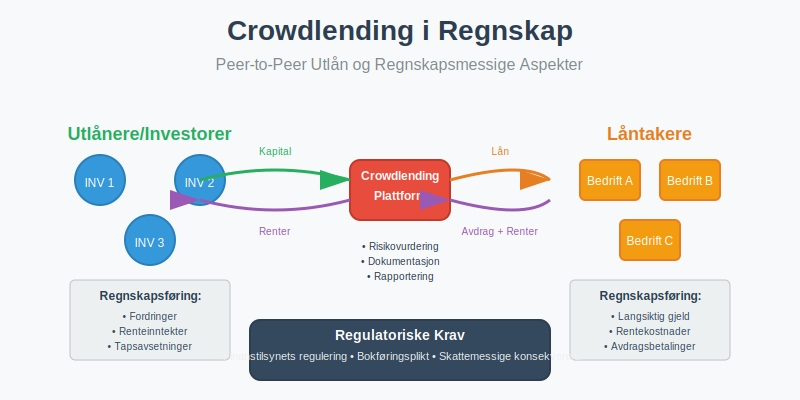
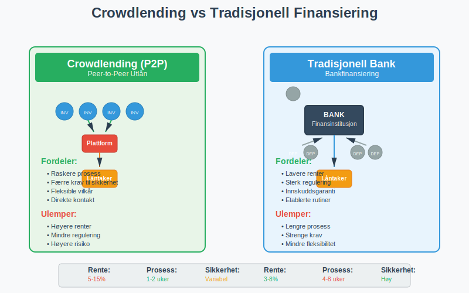
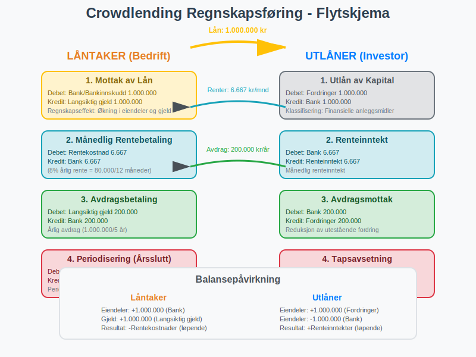
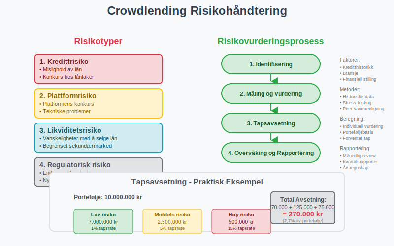
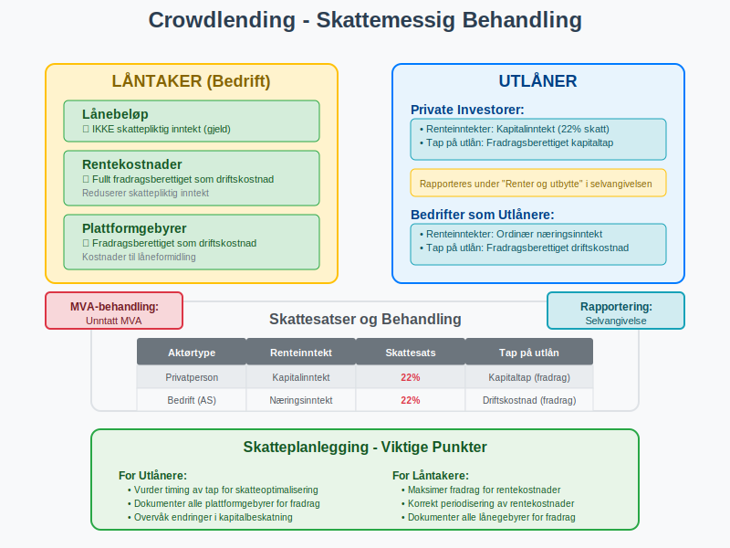
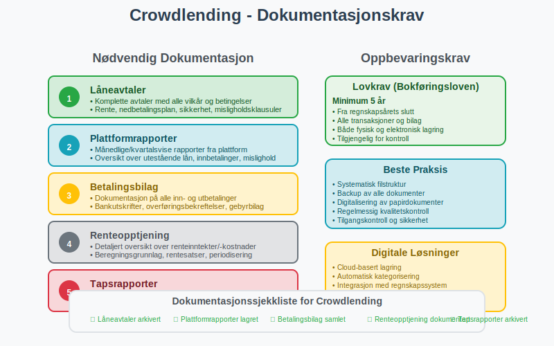
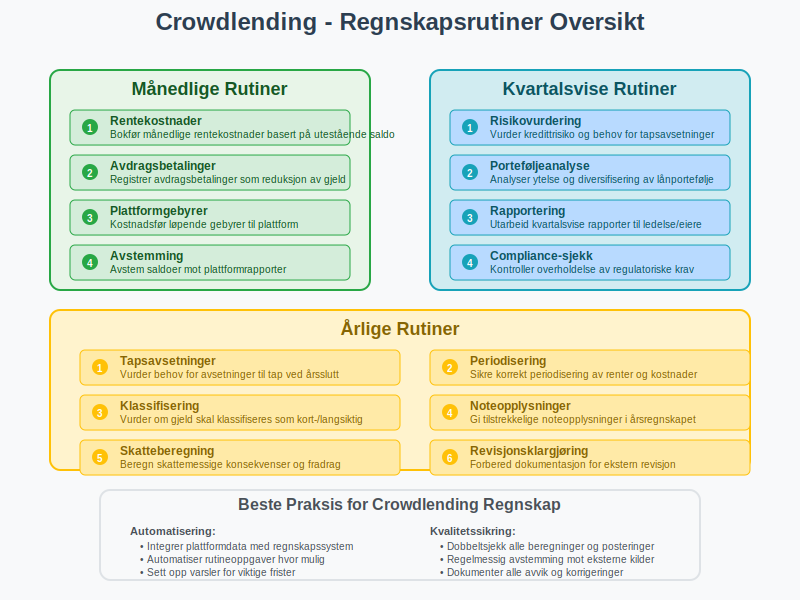

---
title: "Hva er Crowdlending i Regnskap?"
seoTitle: "Hva er Crowdlending i Regnskap?"
meta_description: '**Crowdlending** er en form for peer-to-peer (P2P) utlån hvor private personer eller investorer låner penger direkte til bedrifter eller enkeltpersoner gjenno...'
slug: hva-er-crowdlending
type: blog
layout: pages/single
---

**Crowdlending** er en form for peer-to-peer (P2P) utlån hvor private personer eller investorer låner penger direkte til bedrifter eller enkeltpersoner gjennom digitale plattformer, uten å gå gjennom tradisjonelle finansinstitusjoner som banker. Fra et regnskapsperspektiv medfører crowdlending spesifikke krav til [regnskapsføring](/blogs/regnskap/hva-er-regnskap "Hva er Regnskap? En Komplett Guide til Norsk Regnskapsføring"), dokumentasjon og skattemessig behandling som norske bedrifter må forholde seg til i henhold til [bokføringsloven](/blogs/regnskap/hva-er-bokføringsloven "Hva er Bokføringsloven? Komplett Guide til Norske Bokføringsregler").



## Hva er Crowdlending?

Crowdlending, også kjent som **peer-to-peer lending** eller **P2P-utlån**, er en finansieringsform hvor mange små investorer samlet låner ut penger til låntakere gjennom en digital plattform. Dette skiller seg fra tradisjonell [crowdfunding](/blogs/regnskap/hva-er-crowdfunding "Hva er Crowdfunding i Regnskap?") ved at det alltid innebærer en **forpliktelse til tilbakebetaling** med renter.

### Hovedkarakteristika ved Crowdlending

* **Direkte utlån:** Investorer låner direkte til låntakere uten bankens mellomrolle
* **Rentebasert avkastning:** Investorer mottar renter som kompensasjon for risiko
* **Plattformbasert:** Transaksjoner foregår gjennom spesialiserte digitale plattformer
* **Diversifisering:** Investorer kan spre risiko ved å låne til mange låntakere
* **Kortere prosess:** Raskere behandling enn tradisjonelle banklån



## Crowdlending fra Låntakers Perspektiv

For bedrifter som mottar finansiering gjennom crowdlending, behandles dette som **langsiktig gjeld** i regnskapet. Dette skiller seg fra egenkapitalbasert crowdfunding hvor midlene behandles som [aksjekapital](/blogs/regnskap/hva-er-aksjekapital "Hva er Aksjekapital? Komplett Guide til Aksjekapital i Norske AS").

### Regnskapsføring for Låntaker

| Transaksjonstype | Debet | Kredit | Regnskapsperiode |
|------------------|-------|--------|------------------|
| **Mottak av lån** | Bank/Bankinnskudd | Langsiktig gjeld | Ved utbetaling |
| **Rentebetaling** | Rentekostnad | Bank | Løpende (månedlig/kvartalsvis) |
| **Avdragsbetaling** | Langsiktig gjeld | Bank | I henhold til nedbetalingsplan |
| **Periodisering av renter** | Rentekostnad | Påløpte kostnader | Ved regnskapsavslutning |

### Praktisk Eksempel: Crowdlending for Bedrift

En bedrift mottar 1.000.000 kr gjennom crowdlending med 8% årlig rente og 5 års nedbetalingstid:

**Ved mottak av lånet:**
```
Debet: Bank                     1.000.000
Kredit: Langsiktig gjeld        1.000.000
```

**Månedlig rentebetaling (8% årlig = ca. 6.667 kr/måned):**
```
Debet: Rentekostnad                6.667
Kredit: Bank                       6.667
```

**Årlig avdragsbetaling (200.000 kr):**
```
Debet: Langsiktig gjeld          200.000
Kredit: Bank                     200.000
```



## Crowdlending fra Utlåners Perspektiv

For private investorer eller bedrifter som låner ut penger gjennom crowdlending-plattformer, behandles dette som **finansielle anleggsmidler** eller **kortsiktige fordringer** avhengig av løpetid.

### Regnskapsføring for Utlåner

**For private investorer:**
* Renteinntekter er **skattepliktige** som kapitalinntekt
* Tap på utlån kan være **fradragsberettiget** som kapitaltap
* Må rapporteres i selvangivelsen under "Renter og utbytte"

**For bedrifter som utlåner:**
* Utlån bokføres som fordringer i [balansen](/blogs/regnskap/hva-er-balanse "Hva er Balanse? Komplett Guide til Balanseregnskap og Finansiell Stilling")
* Renteinntekter inntektsføres løpende
* Tapsavsetninger må vurderes ved regnskapsavslutning

| Utlånertype | Regnskapsbehandling | Skattemessig behandling | MVA-behandling |
|-------------|---------------------|-------------------------|----------------|
| **Privatperson** | Ikke regnskapsplikt | Kapitalinntekt (skattepliktig) | [Unntatt MVA](/blogs/regnskap/unntatt-mva "Unntatt MVA") |
| **Enkeltpersonforetak** | Fordring/Renteinntekt | Næringsinntekt | [Unntatt MVA](/blogs/regnskap/unntatt-mva "Unntatt MVA") |
| **Aksjeselskap** | Finansielle anleggsmidler | Næringsinntekt | [Unntatt MVA](/blogs/regnskap/unntatt-mva "Unntatt MVA") |

## Risikohåndtering og Tapsavsetninger

Crowdlending innebærer **kredittrisiko**, og både utlånere og plattformer må ha systemer for å håndtere denne risikoen regnskapsmessig.

### Tapsavsetninger for Utlånere

I henhold til regnskapsstandardene må utlånere vurdere **forventede kredittap** og foreta avsetninger:

* **Individuelle avsetninger:** For lån med identifisert misligholdsrisiko
* **Gruppebaserte avsetninger:** For porteføljer av lån basert på historiske tapserfaringer
* **Periodisk vurdering:** Minimum ved hvert regnskapsavslutning



### Praktisk Eksempel: Tapsavsetning

En bedrift har lånt ut 500.000 kr gjennom crowdlending og vurderer at 5% av porteføljen kan bli misligholdt:

```
Debet: Tap på fordringer           25.000
Kredit: Avsetning for tap          25.000
```

## Skattemessige Konsekvenser

Skattemessig behandling av crowdlending avhenger av om du er utlåner eller låntaker, og din organisasjonsform.

### For Låntakere (Bedrifter)

* **Rentekostnader:** Fullt fradragsberettiget som driftskostnad
* **Lånebeløpet:** Ikke skattepliktig inntekt (gjeld)
* **Gebyrer:** Kostnader til plattform er fradragsberettiget

### For Utlånere

**Private investorer:**
* **Renteinntekter:** Beskattes som kapitalinntekt (22% skattesats)
* **Tap på utlån:** Fradragsberettiget som kapitaltap
* **Plattformgebyrer:** Kan trekkes fra renteinntektene

**Bedrifter som utlånere:**
* **Renteinntekter:** Beskattes som ordinær næringsinntekt
* **Tap på utlån:** Fradragsberettiget som driftskostnad
* **Avsetninger:** Skattemessig fradrag når tap realiseres



## Juridiske Krav og Regulering

Crowdlending i Norge er regulert av flere lover og tilsynsmyndigheter for å beskytte både utlånere og låntakere.

### Finanstilsynets Regulering

* **Plattformlisens:** Crowdlending-plattformer må ha tillatelse fra Finanstilsynet
* **Kapitalkrav:** Plattformer må oppfylle spesifikke kapitalkrav
* **Rapportering:** Regelmessig rapportering til tilsynsmyndigheter
* **Investorbeskyttelse:** Krav til informasjon og risikoopplysning

### Forbrukerbeskyttelse

* **Informasjonsplikt:** Plattformer må gi tydelig informasjon om risiko
* **Angrerett:** Begrenset angrerett for private investorer
* **Maksimalgrenser:** Begrensninger på hvor mye private kan investere
* **Risikoklassifisering:** Lån må klassifiseres etter risikonivå

## Bokføringsplikt og Dokumentasjon

Alle crowdlending-transaksjoner må dokumenteres i henhold til [bokføringsforskriften](/blogs/regnskap/hva-er-bokføringsforskriften "Hva er Bokføringsforskriften? Detaljert Guide til Norske Bokføringsregler"):

### Nødvendig Dokumentasjon

* **Låneavtaler:** Komplette avtaler med alle vilkår
* **Plattformrapporter:** Månedlige/kvartalsvise rapporter fra plattform
* **Betalingsbilag:** Dokumentasjon på alle inn- og utbetalinger
* **Renteopptjening:** Detaljert oversikt over renteinntekter/-kostnader
* **Tapsrapporter:** Dokumentasjon på misligholdte lån

### Oppbevaringskrav

I henhold til [bokføringsloven](/blogs/regnskap/hva-er-bokføringsloven "Hva er Bokføringsloven? Komplett Guide til Norske Bokføringsregler") må all dokumentasjon oppbevares i **minimum 5 år** fra regnskapsårets slutt.



## Crowdlending vs Andre Finansieringsformer

For å forstå crowdlendings plass i finansieringslandskapet, er det nyttig å sammenligne med andre alternativer:

| Finansieringsform | Egenkapital/Gjeld | Tilbakebetalingsplikt | Regnskapsbehandling | Typisk kostnad |
|-------------------|-------------------|----------------------|---------------------|----------------|
| **Crowdlending** | Gjeld | Ja, med renter | Langsiktig gjeld | 5-15% årlig rente |
| **Banklån** | Gjeld | Ja, med renter | Langsiktig gjeld | 3-8% årlig rente |
| **[Crowdfunding](/blogs/regnskap/hva-er-crowdfunding "Hva er Crowdfunding i Regnskap?")** | Varierer | Avhenger av type | Varierer | 5-10% plattformgebyr |
| **Egenkapital** | Egenkapital | Nei | Aksjekapital | Eierandel |
| **Factoring** | Gjeld | Ja | Kortsiktig gjeld | 1-3% av fakturabeløp |

## Regnskapsføring i Praksis

### Månedlige Rutiner

For bedrifter som benytter crowdlending bør følgende rutiner etableres:

1. **Rentekostnader:** Bokfør månedlige rentekostnader basert på utestående saldo
2. **Avdrag:** Registrer avdragsbetalinger som reduksjon av gjeld
3. **Plattformgebyrer:** Kostnadsfør løpende gebyrer til plattform
4. **Avstemming:** Avstem saldoer mot plattformrapporter

### Årlige Rutiner

* **Tapsavsetninger:** Vurder behov for avsetninger til tap
* **Periodisering:** Sikre korrekt periodisering av renter
* **Klassifisering:** Vurder om gjeld skal klassifiseres som kort- eller langsiktig
* **Noteopplysninger:** Gi tilstrekkelige noteopplysninger i årsregnskapet



## Fremtidige Utviklingstrekk

Crowdlending-markedet i Norge er i rask utvikling, og flere faktorer vil påvirke den regnskapsmessige behandlingen:

### Teknologiske Utviklinger

* **Automatisering:** Økt automatisering av regnskapsføring gjennom API-integrasjoner
* **Blockchain:** Potensial for blockchain-baserte låneplattformer
* **AI og risikovurdering:** Bedre risikomodeller for tapsavsetninger

### Regulatoriske Endringer

* **EU-regulering:** Harmonisering av crowdlending-regulering i EU
* **Skattemessige endringer:** Potensielle endringer i beskatning av crowdlending
* **Regnskapsstandarder:** Oppdateringer i regnskapsstandarder for finansielle instrumenter

## Konklusjon

Crowdlending representerer en viktig finansieringsform som krever grundig forståelse av regnskapsmessige og skattemessige konsekvenser. For **låntakere** innebærer det behandling som langsiktig gjeld med løpende rentekostnader, mens **utlånere** må håndtere fordringer, renteinntekter og kredittrisiko.

Nøkkelpunkter for vellykket crowdlending-regnskap:

* **Korrekt klassifisering:** Sikre riktig behandling som gjeld/fordring
* **Løpende oppfølging:** Etablere rutiner for månedlig regnskapsføring
* **Risikohåndtering:** Vurdere og avsette for potensielle tap
* **Dokumentasjon:** Opprettholde fullstendig dokumentasjon i henhold til lovkrav
* **Skatteoptimalisering:** Utnytte fradragsmuligheter og forstå skattekonsekvenser

Ved å følge etablerte regnskapsprinsipper og holde seg oppdatert på regulatoriske endringer, kan både bedrifter og investorer dra nytte av crowdlending som en effektiv finansieringsform samtidig som de oppfyller alle regnskapsmessige og juridiske krav.

For bedrifter som vurderer crowdlending som finansieringsalternativ, anbefales det å konsultere med regnskapsfører eller revisor for å sikre korrekt implementering av regnskapsrutiner og overholdelse av alle relevante bestemmelser.


