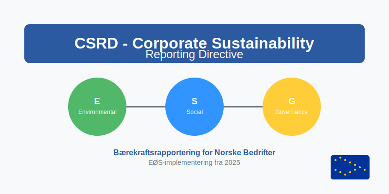
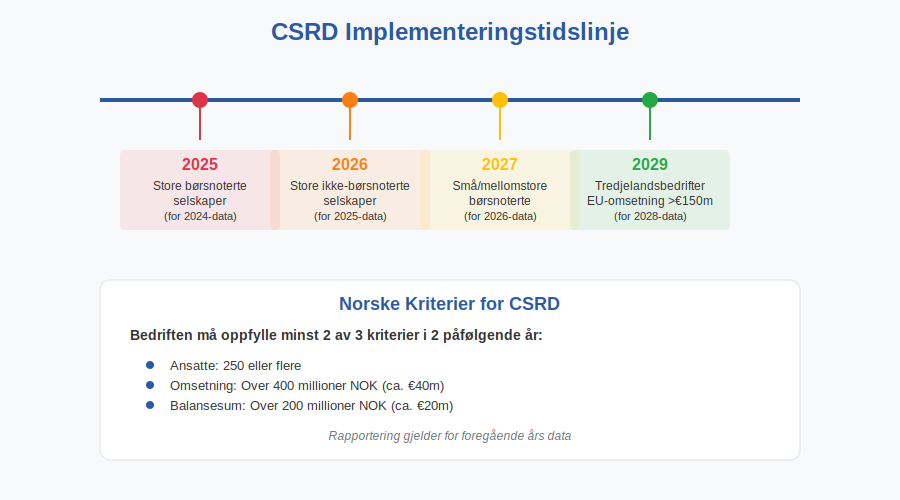
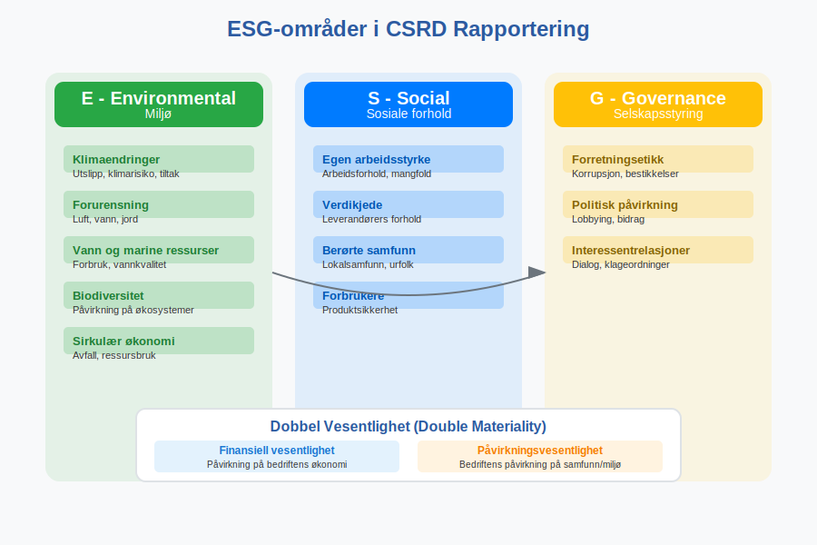
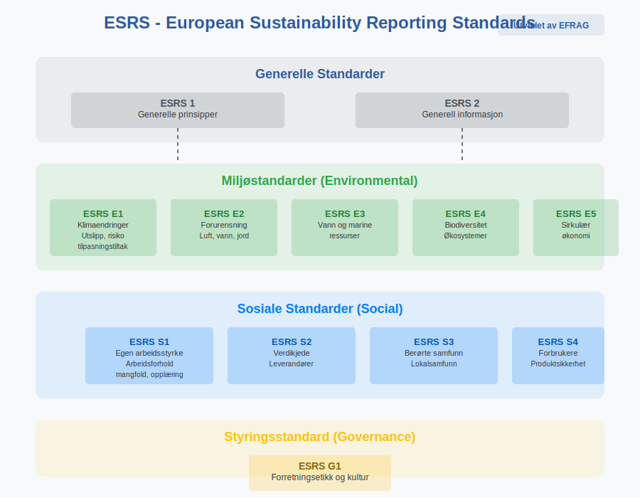
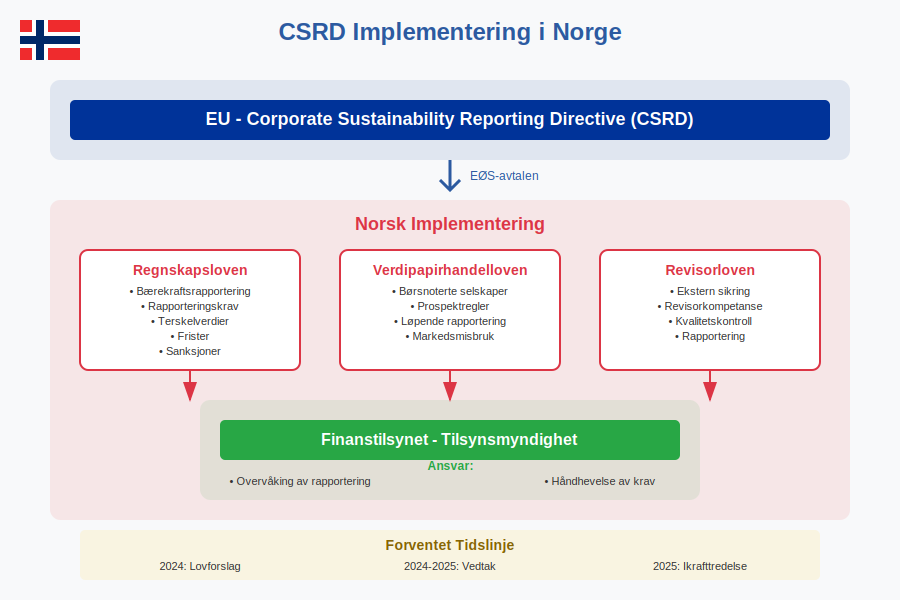
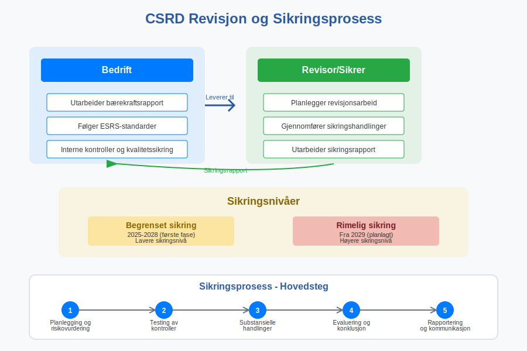
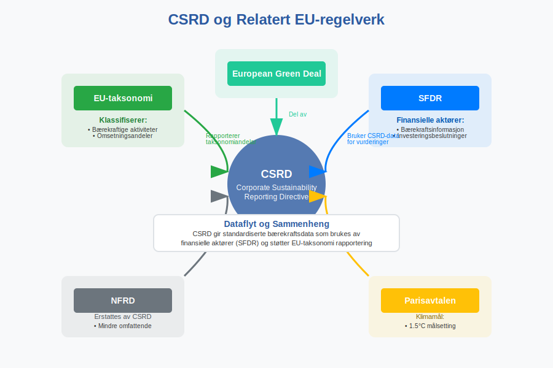
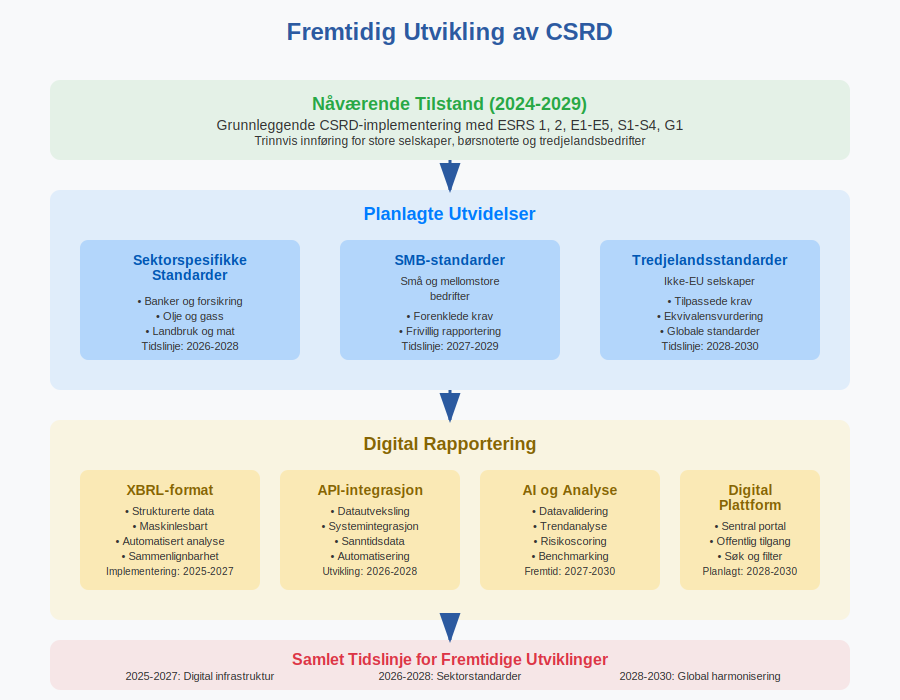

---
title: "Hva er CSRD? Corporate Sustainability Reporting Directive"
seoTitle: "Hva er CSRD? Corporate Sustainability Reporting Directive"
description: '**CSRD** (Corporate Sustainability Reporting Directive) er EUs nye direktiv for [**bærekraftsrapportering**](/blogs/regnskap/baerekraftsrapportering "Bærekraf...'
---

**CSRD** (Corporate Sustainability Reporting Directive) er EUs nye direktiv for [**bærekraftsrapportering**](/blogs/regnskap/baerekraftsrapportering "Bærekraftsrapportering: En komplett guide til bærekraftsrapportering") som påvirker norske bedrifter gjennom EØS-avtalen. Direktivet krever omfattende rapportering om **miljø, sosiale forhold og selskapsstyring** ([ESG](/blogs/regnskap/hva-er-esg "Hva er ESG? En Komplett Guide til Miljø, Sosial og Styring i Regnskap")) og representerer den mest omfattende endringen i bærekraftsrapportering i Europa.

## Hva er CSRD?

**Corporate Sustainability Reporting Directive** (CSRD) er EUs direktiv som erstatter det tidligere **Non-Financial Reporting Directive** (NFRD). Direktivet trådte i kraft 5. januar 2023 og må implementeres i norsk lov gjennom EØS-avtalen.

### Hovedformål med CSRD

CSRD har flere sentrale mål:

* **Standardisere bærekraftsrapportering** på tvers av EU/EØS
* **Øke transparens** om bedrifters bærekraftsprestasjon
* **Støtte grønn omstilling** og bærekraftige investeringer
* **Redusere greenwashing** gjennom strengere krav
* **Harmonisere rapportering** med internasjonale standarder

## Hvem Omfattes av CSRD?

CSRD gjelder for **norske bedrifter** som oppfyller visse kriterier, med en trinnvis innføring over flere år.

### Bedrifter som Omfattes

| Kategori | Kriterier | Rapporteringsstart |
|----------|-----------|-------------------|
| **Store børsnoterte selskaper** | Allerede omfattet av NFRD | 2025 (for 2024-data) |
| **Store ikke-børsnoterte selskaper** | ‰¥250 ansatte OG (omsetning >‚¬40m ELLER balanse >‚¬20m) | 2026 (for 2025-data) |
| **Små og mellomstore børsnoterte** | Børsnotert, ikke mikrobedrift | 2027 (for 2026-data) |
| **Tredjelandsbedrifter** | EU-omsetning >‚¬150m | 2029 (for 2028-data) |

### Norske Kriterier

For norske bedrifter gjelder følgende **terskelverdier**:

* **Ansatte:** 250 eller flere
* **Omsetning:** Over 400 millioner NOK (ca. ‚¬40m)
* **Balansesum:** Over 200 millioner NOK (ca. ‚¬20m)

Bedriften må oppfylle **minst to** av disse kriteriene i **to påfølgende år**.

## CSRD Rapporteringskrav

CSRD krever rapportering innenfor **tre hovedområder** kjent som **[ESG](/blogs/regnskap/hva-er-esg "Hva er ESG? En Komplett Guide til Miljø, Sosial og Styring i Regnskap")** (Environmental, Social, Governance).

### Miljø (Environmental)

**Miljørapportering** omfatter:

* **Klimaendringer:** [Utslipp etter GHG-protokollen](/blogs/regnskap/hva-er-ghg-protokollen "Hva er GHG-protokollen? Komplett Guide til Klimarapportering og Regnskap"), klimarisiko, tilpasningstiltak
* **Forurensning:** Luft, vann, jord
* **Vann og marine ressurser:** Forbruk, påvirkning på vannkvalitet
* **Biodiversitet:** Påvirkning på økosystemer
* **Sirkulær økonomi:** Avfallshåndtering, ressursbruk

### Sosiale forhold (Social)

**Sosial rapportering** inkluderer:

* **Egen arbeidsstyrke:** Arbeidsforhold, mangfold, opplæring
* **Verdikjede:** Leverandørers arbeidsforhold
* **Berørte samfunn:** Lokalsamfunn, urfolk
* **Forbrukere:** Produktsikkerhet, tilgjengelighet

### Selskapsstyring (Governance)

**Styringsrapportering** omfatter:

* **Forretningsetikk:** Korrupsjon, bestikkelser
* **Politisk påvirkning:** Lobbying, politiske bidrag
* **Relasjoner til interessenter:** Dialog, klageordninger

## European Sustainability Reporting Standards (ESRS)

CSRD-rapportering skal følge **European Sustainability Reporting Standards** (ESRS) utviklet av EFRAG.

### ESRS Standarder

| Standard | Område | Beskrivelse |
|----------|--------|-------------|
| **ESRS 1** | Generelle prinsipper | Grunnleggende rapporteringsprinsipper |
| **ESRS 2** | Generell informasjon | Strategi, styring, risikovurdering |
| **ESRS E1-E5** | Miljø | Klima, forurensning, vann, biodiversitet, sirkulær økonomi |
| **ESRS S1-S4** | Sosiale forhold | Arbeidsstyrke, verdikjede, samfunn, forbrukere |
| **ESRS G1** | Selskapsstyring | Forretningsetikk og kultur |

### Dobbel Vesentlighet

CSRD introduserer konseptet **dobbel vesentlighet** (double materiality):

1. **Finansiell vesentlighet:** Hvordan bærekraftsfaktorer påvirker bedriftens finansielle resultater
2. **Påvirkningsvesentlighet:** Hvordan bedriften påvirker mennesker og miljø

CSRD-rapportering er nært knyttet til [EU-taksonomien](/blogs/regnskap/hva-er-eu-taksonomien "EU-taksonomien - Klassifiseringssystem for Bærekraftige Aktiviteter"), som definerer hvilke økonomiske aktiviteter som regnes som miljømessig bærekraftige.

## Implementering i Norge

Norge må implementere CSRD gjennom **EØS-avtalen** og tilpasse norsk lovgivning.

### Lovgivningsprosess

* **Regnskapsloven:** Må endres for å inkludere CSRD-krav
* **Verdipapirhandelloven:** Tilpasninger for børsnoterte selskaper
* **Revisorloven:** Krav til ekstern sikring av bærekraftsrapporter

### Tilsynsmyndigheter

**Finanstilsynet** vil sannsynligvis få ansvar for:

* **Overvåking** av CSRD-rapportering
* **Håndhevelse** av rapporteringskrav
* **Veiledning** til norske bedrifter

## Praktisk Gjennomføring

### Forberedelser for Bedrifter

Norske bedrifter bør starte forberedelsene tidlig:

1. **Kartlegg om bedriften omfattes** av CSRD-kravene
2. **Gjennomfør vesentlighetsanalyse** for å identifisere relevante temaer
3. **Etabler datainnsamlingssystemer** for ESG-data
4. **Utvikle rapporteringsrutiner** og interne kontroller
5. **Sikre kompetanse** innen bærekraftsrapportering
6. **Planlegg ekstern sikring** av rapporter

### Datainnsamling og Systemer

Effektiv CSRD-rapportering krever:

* **Integrerte systemer** som kobler [regnskapsdata](/blogs/regnskap/hva-er-regnskap "Hva er Regnskap? En komplett guide") med ESG-data
* **Automatiserte prosesser** for datainnsamling
* **Kvalitetssikring** av data og beregninger
* **Dokumentasjon** av metoder og forutsetninger

## Revisjon og Sikring

CSRD krever **ekstern sikring** av bærekraftsrapporter, tilsvarende [revisjon](/blogs/regnskap/hva-er-arbeidspapirer-revisjon "Hva er Arbeidspapirer i Revisjon? Komplett Guide til Revisjonsdokumentasjon") av [årsregnskapet](/blogs/regnskap/hva-er-balanseregnskap "Hva er Balanseregnskap? Oppbygging, Komponenter og Praktisk Anvendelse").

### Sikringsnivåer

* **Begrenset sikring:** Første fase (2025-2028)
* **Rimelig sikring:** Planlagt fra 2029

### Revisorens Rolle

Revisorer må:

* **Utvikle kompetanse** innen bærekraftsrapportering
* **Etablere revisjonsmetodikk** for ESG-data
* **Sikre kvalitet** i bærekraftsrapporter
* **Rapportere avvik** og forbedringsområder

## Konsekvenser for Norske Bedrifter

### Kostnader og Ressurser

CSRD-implementering medfører betydelige kostnader:

* **Systemutvikling:** 500.000 - 2.000.000 NOK
* **Kompetanseutvikling:** 200.000 - 500.000 NOK årlig
* **Ekstern sikring:** 100.000 - 500.000 NOK årlig
* **Løpende drift:** 1-3 [årsverk](/blogs/regnskap/arsverk "Årsverk") for store bedrifter

### Forretningsmuligheter

CSRD kan også skape muligheter:

* **Bedre tilgang til kapital** gjennom bærekraftige investeringer
* **Konkurransefortrinn** gjennom transparens
* **Forbedret risikostyring** og operasjonell effektivitet
* **Sterkere merkevare** og omdømme

## Sammenheng med Andre Regelverk

CSRD må sees i sammenheng med annet regelverk:

### EU-taksonomi

[**EU-taksonomien**](/blogs/regnskap/hva-er-eu-taksonomien "EU-taksonomien - Klassifiseringssystem for Bærekraftige Aktiviteter") klassifiserer bærekraftige økonomiske aktiviteter og krever rapportering om:

* **Andel omsetning** fra taksonomikvalifiserte aktiviteter
* **Andel investeringer** (CapEx) i bærekraftige aktiviteter
* **Andel driftskostnader** (OpEx) knyttet til bærekraft

### SFDR (Sustainable Finance Disclosure Regulation)

**SFDR** påvirker finansielle aktører og deres rapportering om bærekraftsfaktorer i investeringsbeslutninger.

## Forberedelser og Anbefalinger

### Handlingsplan for Bedrifter

1. **Kartlegging (2024):**
   - Vurder om bedriften omfattes
   - Identifiser rapporteringsfrister
   - Gjennomfør gap-analyse

2. **Planlegging (2024-2025):**
   - Utvikle bærekraftsstrategi
   - Etabler styringsstruktur
   - Planlegg systemløsninger

3. **Implementering (2025-2026):**
   - Implementer datainnsamlingssystemer
   - Utvikle rapporteringsrutiner
   - Sikre kompetanse og ressurser

4. **Rapportering (fra 2025):**
   - Gjennomfør første rapportering
   - Sikre ekstern revisjon
   - Kontinuerlig forbedring

### Kritiske Suksessfaktorer

* **Ledelsesforankring** og tydelig ansvar
* **Tverrfaglig samarbeid** mellom [regnskap](/blogs/regnskap/hva-er-bokføring "Hva er Bokføring? Komplett Guide til Grunnleggende Regnskapsprinsipper"), bærekraft og IT
* **Kvalitetssikring** av data og prosesser
* **Kontinuerlig kompetanseutvikling**
* **Proaktiv tilnærming** til regelverksutvikling

## Fremtidige Utviklinger

### Utvidelser av CSRD

EU planlegger flere utvidelser:

* **Sektorspesifikke standarder** for banker, forsikring og olje/gass
* **Standarder for SMB** (små og mellomstore bedrifter)
* **Tredjelandsstandarder** for ikke-EU selskaper

### Digitalisering

**Digital rapportering** blir sentralt:

* **XBRL-format** for strukturert rapportering
* **Maskinlesbare data** for automatisert analyse
* **API-er** for datautveksling

## Konklusjon

**CSRD** representerer en fundamental endring i hvordan norske bedrifter må rapportere om bærekraft. Direktivet krever omfattende forberedelser og betydelige investeringer, men kan også skape verdifulle forretningsmuligheter.

### Nøkkelpunkter

* **Trinnvis innføring** fra 2025 til 2029
* **Omfattende rapporteringskrav** innen ESG
* **Ekstern sikring** av bærekraftsrapporter
* **Betydelige kostnader** men også muligheter
* **Tidlig forberedelse** er kritisk for suksess

Norske bedrifter som omfattes av CSRD bør starte forberedelsene umiddelbart for å sikre regelverksetterlevelse og maksimere forretningsmulighetene som følger av økt transparens og bærekraftsfokus.

For bedrifter som ikke direkte omfattes av CSRD, kan det likevel være lurt å følge utviklingen, da krav fra kunder, investorer og andre interessenter kan gjøre bærekraftsrapportering relevant også for mindre bedrifter.

