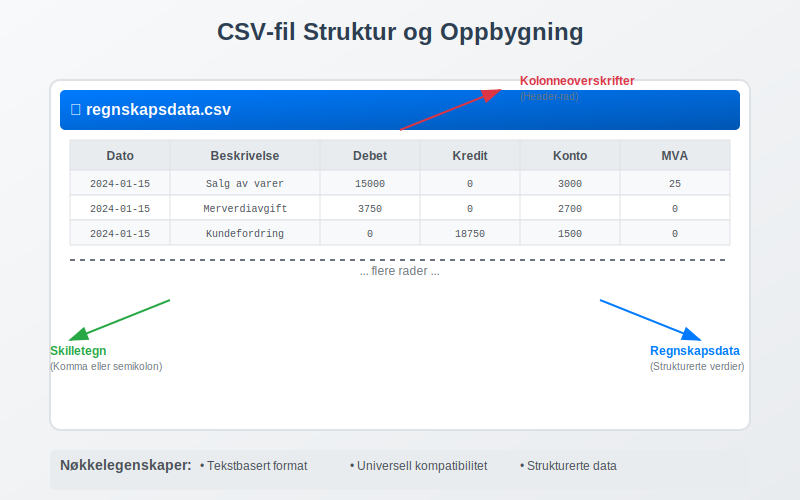

En **CSV-fil** (Comma-Separated Values) er et enkelt tekstfilformat som brukes til å lagre og utveksle strukturerte data mellom ulike systemer. I regnskapssammenheng er CSV-filer et kritisk verktøy for [datautveksling](/blogs/regnskap/hva-er-bilagsmottak "Bilagsmottak - Komplett Guide til Dokumentmottak og Fakturabehandling") mellom regnskapssystemer, banker og andre finansielle tjenester. CSV-formatet gjør det mulig å importere og eksportere store mengder regnskapsdata på en effektiv og standardisert måte.

## Seksjon 1: Hva er en CSV-fil?

CSV står for "Comma-Separated Values" og er et filformat hvor data organiseres i rader og kolonner, adskilt av komma eller andre skilletegn. Hver linje i filen representerer en datarad, mens kolonnene er adskilt med komma, semikolon eller andre definerte skilletegn.



### Grunnleggende Struktur

En typisk CSV-fil for regnskapsdata kan se slik ut:

```
Dato,Beskrivelse,Debet,Kredit,Konto
2024-01-15,Salg av varer,15000,0,3000
2024-01-15,Merverdiavgift,3750,0,2700
2024-01-15,Kundefordring,0,18750,1500
```

### Tekniske Egenskaper

* **Tekstbasert format:** Kan åpnes i alle teksteditorer og regneark
* **Universell kompatibilitet:** Støttes av praktisk talt alle regnskapssystemer
* **Kompakt størrelse:** Mindre filstørrelse enn Excel eller andre binære formater
* **Strukturert data:** Organisert i rader og kolonner for enkel behandling

## Seksjon 2: CSV-filer i Regnskapssammenheng

I moderne regnskap er CSV-filer uunnværlige for effektiv [bokføring](/blogs/regnskap/hva-er-bokføring "Hva er Bokføring? En Komplett Guide til Grunnleggende Regnskapsprinsipper") og databehandling. De brukes primært for å automatisere manuelle prosesser og sikre nøyaktig overføring av finansielle data.


### 2.1 Import av Banktransaksjoner

Den vanligste bruken av CSV-filer i regnskap er import av [banktransaksjoner](/blogs/regnskap/hva-er-banktransaksjoner "Hva er Banktransaksjoner? Komplett Guide til Bankoppgjør og Regnskapsføring"). Norske banker tilbyr nedlasting av kontoutskrifter i CSV-format, som kan importeres direkte i regnskapssystemet.

**Typiske kolonner i banktransaksjon CSV:**

| Kolonne | Beskrivelse | Eksempel |
|---------|-------------|----------|
| Dato | Transaksjonsdato | 2024-01-15 |
| Beskrivelse | Transaksjonsbeskrivelse | Faktura 2024-001 |
| Beløp | Transaksjonsbeløp | -15000.00 |
| Saldo | Kontosaldo etter transaksjon | 125000.00 |
| Referanse | Bankens referansenummer | 240115001234 |

### 2.2 Eksport av Regnskapsrapporter

CSV-filer brukes også for å eksportere regnskapsrapporter for videre analyse eller arkivering. Dette inkluderer:

* **Hovedbok:** Alle [bilag](/blogs/regnskap/hva-er-bilag "Hva er Bilag? Komplett Guide til Regnskapsbilag og Dokumentasjon") og transaksjoner
* **Kundefordringer:** Oversikt over utestående [fakturaer](/blogs/regnskap/hva-er-en-faktura "Hva er en Faktura? En Guide til Norske Fakturakrav")
* **Leverandørgjeld:** Oversikt over ubetalte leverandørfakturaer
* **Balanserapporter:** [Balanse](/blogs/regnskap/hva-er-balanse "Hva er Balanse? Komplett Guide til Balanserapport og Finansiell Stilling") og resultatregnskap

## Seksjon 3: Fordeler og Ulemper med CSV-filer

### Fordeler

* **Universell kompatibilitet:** Fungerer med alle regnskapssystemer og regnearkprogrammer
* **Enkel struktur:** Lett å forstå og manipulere
* **Rask behandling:** Effektiv for store datamengder
* **Kostnadseffektivt:** Ingen lisenskostnader for å bruke formatet
* **Automatisering:** Muliggjør automatisk import/eksport av data

### Ulemper og Utfordringer

* **Begrenset formatering:** Ingen støtte for formler, farger eller avansert formatering
* **Skilletegnproblemer:** Konflikter når data inneholder komma eller andre skilletegn
* **Tegnkoding:** Problemer med æ, ø, å og andre spesialtegn
* **Ingen validering:** Mangler innebygd datakontroll
* **Sikkerhet:** Ingen kryptering eller passordbeskyttelse


## Seksjon 4: Beste Praksis for CSV-håndtering

### 4.1 Datavalidering og Kontroll

Før import av CSV-data i regnskapssystemet er det kritisk å utføre grundig validering:

* **Kontroller datoformater:** Sikre konsistent datoformat (DD.MM.YYYY eller YYYY-MM-DD)
* **Valider beløp:** Kontroller at beløp er korrekt formatert med riktig desimalseparator
* **Sjekk kontonummer:** Verifiser at alle kontonummer eksisterer i [kontoplanen](/blogs/regnskap/hva-er-bokføringsregler "Hva er Bokføringsregler? Komplett Guide til Norske Regnskapsstandarder")
* **Kontroller balanse:** Sikre at debet = kredit for alle transaksjoner

### 4.2 Sikkerhetshensyn

CSV-filer inneholder ofte sensitive regnskapsdata og må håndteres med forsiktighet:

* **Kryptering:** Bruk krypterte mapper eller sikre overføringsmetoder
* **Tilgangskontroll:** Begrens hvem som kan lese og redigere CSV-filer
* **Arkivering:** Sikker lagring i henhold til [bokføringsloven](/blogs/regnskap/hva-er-bokføringsloven "Hva er Bokføringsloven? Komplett Guide til Norske Bokføringsregler")
* **Sletting:** Sikker sletting av midlertidige filer etter import

### 4.3 Tekniske Anbefalinger

For optimal bruk av CSV-filer i regnskapssammenheng:

* **Bruk UTF-8 tegnkoding** for å støtte norske tegn (æ, ø, å)
* **Konsistent skilletegn** - bruk semikolon (;) for norske systemer
* **Inkluder header-rad** med kolonnenavn for klarhet
* **Unngå tomme celler** - bruk 0 eller "N/A" hvor relevant
* **Dokumenter format** - opprett dokumentasjon for CSV-strukturen

## Seksjon 5: CSV-import i Populære Regnskapssystemer

### 5.1 Forberedelse av Data

Før import må CSV-filen tilpasses det spesifikke regnskapssystemets krav:

* **Kolonnestruktur:** Tilpass kolonner til systemets importmal
* **Kontoplan:** Sikre at alle kontonummer matcher systemets [kontoplan](/blogs/regnskap/hva-er-bokføringsregler "Hva er Bokføringsregler? Komplett Guide til Norske Regnskapsstandarder")
* **Bilagsnummer:** Generer unike bilagsnummer hvis ikke inkludert
* **MVA-koder:** Inkluder korrekte MVA-koder for automatisk [avgiftsbehandling](/blogs/regnskap/hva-er-avgiftsplikt-mva "Hva er Avgiftsplikt (MVA)? Komplett Guide til Merverdiavgift i Norge")

### 5.2 Kvalitetskontroll etter Import

Etter vellykket CSV-import er det viktig å utføre kvalitetskontroll:

* **Kontroller saldoer:** Sammenlign importerte saldoer med originale data
* **Verifiser [avstemming](/blogs/regnskap/hva-er-avstemming "Hva er Avstemming? Komplett Guide til Regnskapsavstemming"):** Utfør bankavstemming for importerte banktransaksjoner
* **Gjennomgå bilag:** Kontroller at alle [bilag](/blogs/regnskap/hva-er-bilag "Hva er Bilag? Komplett Guide til Regnskapsbilag og Dokumentasjon") er korrekt importert
* **Test rapporter:** Generer testrapporter for å verifisere datakvalitet

## Seksjon 6: Automatisering og Integrasjon

### 6.1 Automatisk CSV-behandling

Moderne regnskapssystemer tilbyr automatiserte løsninger for CSV-behandling:

* **Planlagte importer:** Automatisk nedlasting og import av bankfiler
* **API-integrasjoner:** Direkte kobling mellom banker og regnskapssystem
* **Regelbasert behandling:** Automatisk kontering basert på forhåndsdefinerte regler
* **Feilhåndtering:** Automatisk varsling ved importfeil eller avvik

### 6.2 Integrasjon med Andre Systemer

CSV-filer fungerer som bro mellom ulike forretningssystemer:

* **CRM-systemer:** Export av kundedata for regnskapsføring
* **Lønnssystemer:** Import av lønnsdata for [bokføring](/blogs/regnskap/hva-er-bokføring "Hva er Bokføring? En Komplett Guide til Grunnleggende Regnskapsprinsipper")
* **Lagersystemer:** Overføring av lagerdata for kostnadskontroll
* **Faktureringssystemer:** Import av salgsdata og [fakturaer](/blogs/regnskap/hva-er-en-faktura "Hva er en Faktura? En Guide til Norske Fakturakrav")


## Seksjon 7: Feilsøking og Vanlige Problemer

### 7.1 Vanlige Importfeil

* **Tegnkodingsproblemer:** Æ, ø, å vises som rare tegn
* **Datoformat:** Feil datoformat forårsaker importfeil
* **Desimalseparator:** Konflikt mellom komma og punktum som desimalseparator
* **Manglende kolonner:** CSV-fil mangler påkrevde datafelter

### 7.2 Løsningsstrategier

* **Konverter tegnkoding** til UTF-8 før import
* **Standardiser datoformat** til ISO 8601 (YYYY-MM-DD)
* **Bruk konsistent desimalseparator** (komma for norske systemer)
* **Valider CSV-struktur** mot importmal før behandling

## Seksjon 8: Fremtiden for CSV i Regnskap

Selv om CSV-formatet er over 50 år gammelt, forblir det relevant i moderne regnskapsføring. Utviklingen går mot:

* **Forbedret automatisering:** AI-drevet kategorisering og kontering
* **Sanntidsintegrasjon:** Direktekobling mellom systemer uten filoverføring
* **Forbedret sikkerhet:** Krypterte CSV-filer med digital signatur
* **Standardisering:** Bransjestandarder for regnskaps-CSV-formater

CSV-filer vil fortsette å spille en viktig rolle i [regnskapsføring](/blogs/regnskap/hva-er-regnskap "Hva er Regnskap? En Komplett Innføring i Regnskapets Grunnleggende Prinsipper") og [bokføring](/blogs/regnskap/hva-er-bokføring "Hva er Bokføring? En Komplett Guide til Grunnleggende Regnskapsprinsipper"), spesielt for datautveksling mellom ulike systemer og automatisering av rutineoppgaver. Forståelse av CSV-håndtering er derfor essensielt for moderne regnskapsførere og økonomipersonell.


