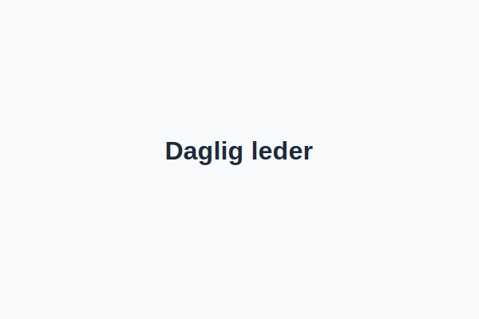
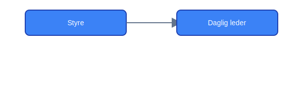

---
title: "hva-er-daglig-leder"
meta_title: "hva-er-daglig-leder"
meta_description: 'En **daglig leder** er den personen som har det overordnede ansvaret for den daglige driften av et **aksjeselskap (AS)** i Norge. Rollen er fastsatt i [Aksjelov...'
slug: hva-er-daglig-leder
type: blog
layout: pages/single
---

En **daglig leder** er den personen som har det overordnede ansvaret for den daglige driften av et **aksjeselskap (AS)** i Norge. Rollen er fastsatt i [Aksjeloven](/blogs/regnskap/hva-er-aksjeloven "Hva er Aksjeloven? Regler for Aksjeselskaper i Norge") og krever at daglig leder rapporterer til [Styre](/blogs/regnskap/hva-er-styre "Hva er et Styre?").

## Sentrale ansvarsområder

| Ansvarsområde               | Beskrivelse                                                                                  |
|-----------------------------|----------------------------------------------------------------------------------------------|
| **Daglig drift**            | Sørge for selskapers daglige operasjonelle aktiviteter og opprettholde forretningsprosesser. |
| **Personalansvar**          | Ansette, lede og motivere medarbeidere, samt håndtere personalspørsmål og arbeidsmiljø.       |
| **Økonomisk rapportering**  | Utarbeide og presentere periodiske rapporter til styret og sikre korrekt bokføring.           |
| **Risikostyring**           | Identifisere og håndtere selskapsrisiko knyttet til drift og økonomi.                        |
| **Rapportering til styret** | Gi styret nødvendige beslutningsgrunnlag og følge opp styrets vedtak.                        |

## Juridiske krav og rammeverk

I henhold til **Aksjeloven** har daglig leder flere formelle plikter:

* *Utøve forsvarlig ledelse* i samsvar med selskapets [vedtekter](/blogs/regnskap/vedtekter "Vedtekter: Definisjon, Krav og Betydning i Norsk Regnskap") og lovpålagte krav.
* *Informere styret* om selskapets økonomiske stilling og vesentlige forhold.
* *Sikre etterlevelse* av lover og regler som gjelder for selskapets virksomhet.

Se også andre viktige roller som [Generalforsamling](/blogs/regnskap/hva-er-generalforsamling "Hva er Generalforsamling? Roller og Ansvar"), [Leder](/blogs/regnskap/leder "Leder: Roller og Ansvar i Norske Selskaper") og [Styrets oppgaver](/blogs/regnskap/hva-er-styre "Hva er et Styre?").

## Regnskapsmessige forpliktelser

Daglig leder har ansvaret for at regnskapsførselen skjer i tråd med **god regnskapsskikk** og relevante rapporteringskrav:

* Utarbeidelse av årsregnskap og årsberetning.
* Undertegning og innsending av årsoppgjøret.
* Innsending av [skattemelding](/blogs/regnskap/skattemelding "Skattemelding").

## Oppsummering

Daglig leder er en nøkkelrolle i norske aksjeselskaper, med ansvar for daglig drift, personalledelse, rapportering og etterlevelse av regelverk. En tydelig rollefordeling mellom generalforsamling, styre og daglig leder er avgjørende for god selskapsstyring.

