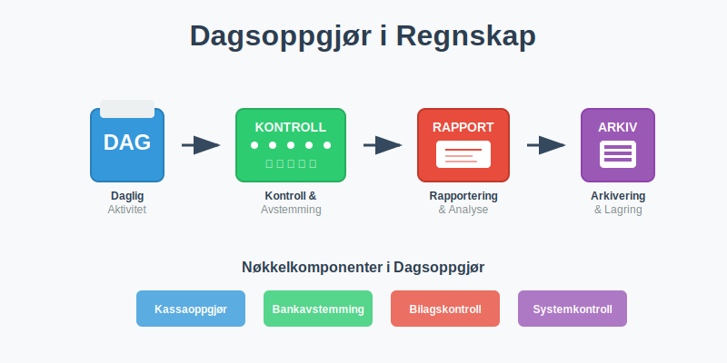
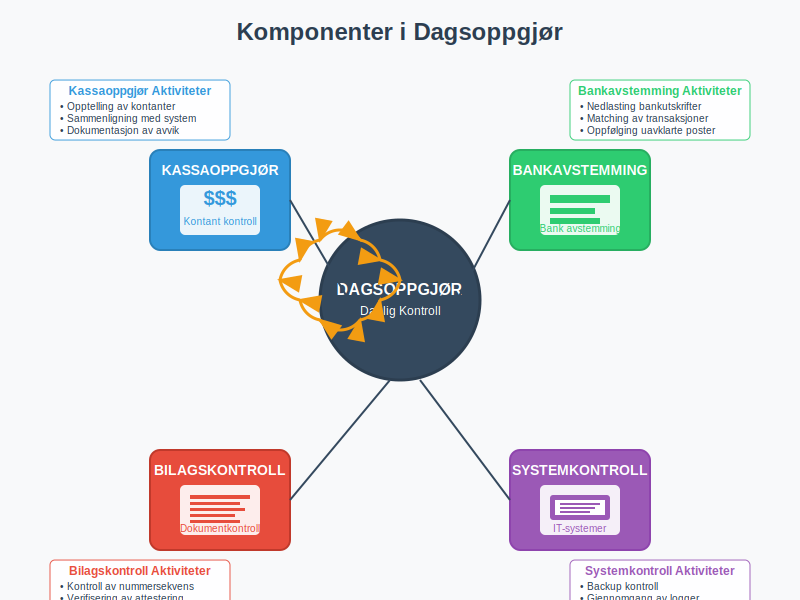
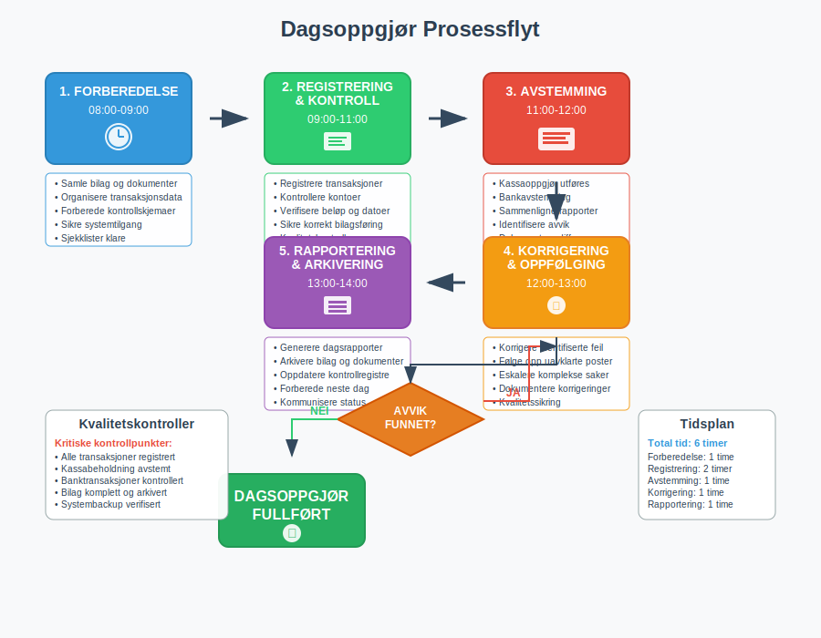
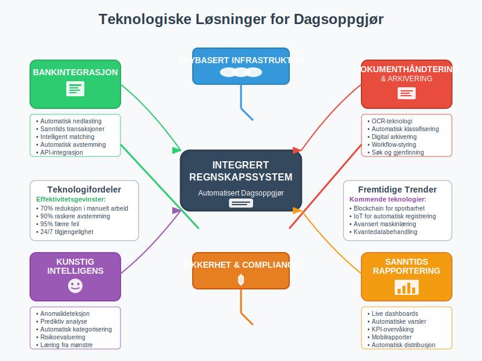

**Dagsoppgjør** er en **daglig regnskapsprosess** som sikrer at alle [transaksjoner](/blogs/regnskap/hva-er-banktransaksjoner "Hva er Banktransaksjoner? Guide til Registrering og Oppfølging") er korrekt registrert, avstemt og kontrollert ved slutten av hver arbeidsdag. Dette er en **kritisk kontrollrutine** som danner grunnlaget for pålitelig [regnskapsføring](/blogs/regnskap/hva-er-bokføring "Hva er Bokføring? Komplett Guide til Regnskapsføring") og finansiell rapportering.

## Hva er Dagsoppgjør?

Dagsoppgjør er en **systematisk gjennomgang** av alle regnskapsmessige aktiviteter som har funnet sted i løpet av en arbeidsdag. Prosessen sikrer at:

* **Alle transaksjoner** er korrekt registrert i regnskapssystemet
* **Kassabeholdning** stemmer overens med registrerte bevegelser
* **Banktransaksjoner** er avstemt og kontrollert
* **Bilag og dokumentasjon** er komplett og arkivert
* **Avvik og feil** identifiseres og korrigeres umiddelbart
* **Regnskapsmessig integritet** opprettholdes daglig

### Formål med Dagsoppgjør

Dagsoppgjør tjener flere **kritiske formål** i regnskapsarbeidet:

- **Kvalitetssikring:** Sikrer nøyaktighet i alle regnskapsposter
- **Risikostyring:** Identifiserer og håndterer avvik før de akkumuleres
- **Compliance:** Oppfyller krav i [bokføringsloven](/blogs/regnskap/hva-er-bokføringsloven "Bokføringsloven - Krav, Regler og Praktisk Anvendelse") og [bokføringsforskriften](/blogs/regnskap/hva-er-bokføringsforskriften "Bokføringsforskriften - Detaljerte Regler for Regnskapsføring")
- **Kontroll:** Opprettholder intern kontroll og [attestering](/blogs/regnskap/hva-er-attestering "Hva er Attestering? Kontrollrutiner og Godkjenningsprosesser")
- **Effektivitet:** Forhindrer oppsamling av feil og mangler

## Komponenter i Dagsoppgjør

Et komplett dagsoppgjør består av flere **integrerte komponenter** som må gjennomføres systematisk.

### 1. Kassaoppgjør

**Kassaoppgjør** er kontroll av alle kontante transaksjoner og kassabeholdning. Dette er en kritisk del av dagsoppgjøret som krever systematisk tilnærming og grundig dokumentasjon. For en detaljert gjennomgang av hele kasseoppgjørsprosessen, se vår omfattende guide til **[kasseoppgjør](/blogs/regnskap/hva-er-kasseoppgjor "Hva er Kasseoppgjør? Komplett Guide til Kasseavstemming og Kontantoppgjør")**.

#### Daglig Kassekontroll
- **Opptelling** av fysisk kontantbeholdning
- **Sammenligning** med kassarapporter fra systemet
- **Registrering** av alle inn- og utbetalinger
- **Dokumentasjon** av kassadifferanser

#### Kassaoppgjørsskjema
| Element | Beskrivelse | Kontrollpunkt |
|---------|-------------|---------------|
| **Startsaldo** | Kassabeholdning ved dagens start | Avstemming mot forrige dag |
| **Innbetalinger** | Alle kontante innbetalinger | Bilag og kvitteringer |
| **Utbetalinger** | Alle kontante utbetalinger | Godkjente utbetalingsbilag |
| **Sluttsaldo** | Beregnet kassabeholdning | Fysisk opptelling |
| **Differanse** | Avvik mellom beregnet og faktisk | Årsaksanalyse |

### 2. Bankavstemming

[Bankavstemming](/blogs/regnskap/hva-er-bankavstemming "Hva er Bankavstemming? Prosess, Metoder og Beste Praksis") er en **kritisk del** av dagsoppgjøret:

#### Daglig Bankavstemmingsprosess
* **Nedlasting** av bankutskrifter og transaksjonsdata
* **Sammenligning** med registrerte banktransaksjoner
* **Identifikasjon** av ikke-registrerte transaksjoner
* **Oppfølging** av uavklarte poster
* **Registrering** av bankgebyrer og renter

### 3. Bilagskontroll

**Systematisk gjennomgang** av alle [bilag](/blogs/regnskap/hva-er-bilag "Hva er Bilag? Typer, Krav og Arkivering i Regnskap") og dokumentasjon:

#### Bilagskontrollrutiner
- **Nummersekvens:** Kontroll av at alle bilagsnumre er registrert
- **Fullstendighet:** Sikre at alle bilag har nødvendig informasjon
- **Godkjenning:** Verifisere at bilag er korrekt [attestert](/blogs/regnskap/hva-er-attestering "Hva er Attestering? Kontrollrutiner og Godkjenningsprosesser")
- **Arkivering:** Sikre korrekt lagring og tilgjengelighet

### 4. Systemkontroller

**Tekniske kontroller** av regnskapssystemet og dataintegriteten:

* **Backup-kontroll:** Sikre at daglige sikkerhetskopier er tatt
* **Systemlogger:** Gjennomgang av feilmeldinger og advarsler
* **Brukeraktivitet:** Kontroll av hvem som har gjort endringer
* **Datavalidering:** Verifisering av automatiske beregninger

## Dagsoppgjørsprosessen

En **strukturert tilnærming** til dagsoppgjør sikrer at ingen kritiske elementer overses.

### Trinn-for-Trinn Prosess

#### 1. Forberedelse (08:00-09:00)
- **Samle** alle bilag og dokumenter fra dagen
- **Organisere** transaksjonsdata kronologisk
- **Forberede** kontrollskjemaer og sjekklister
- **Sikre** tilgang til alle nødvendige systemer

#### 2. Registrering og Kontroll (09:00-11:00)
- **Registrere** alle utestående transaksjoner
- **Kontrollere** at alle poster har korrekte kontoer
- **Verifisere** beløp og datoer
- **Sikre** korrekt [bilagsføring](/blogs/regnskap/hva-er-bilagsføring "Hva er Bilagsføring? Prosess, Regler og Beste Praksis")

#### 3. Avstemming (11:00-12:00)
- **Utføre** kassaoppgjør og bankavstemming
- **Sammenligne** systemrapporter med fysiske beholdninger
- **Identifisere** og analysere avvik
- **Dokumentere** alle differanser

#### 4. Korrigering og Oppfølging (12:00-13:00)
- **Korrigere** identifiserte feil umiddelbart
- **Følge opp** uavklarte poster
- **Eskalere** komplekse problemer til ledelse
- **Dokumentere** alle korrigeringer

#### 5. Rapportering og Arkivering (13:00-14:00)
- **Generere** dagsrapporter og sammendrag
- **Arkivere** alle bilag og dokumenter
- **Oppdatere** kontrollregistre og logger
- **Forberede** informasjon for neste dag

## Kontrollpunkter og Sjekklister

**Systematiske kontrollpunkter** sikrer at dagsoppgjøret er komplett og nøyaktig.

### Daglig Sjekkliste for Dagsoppgjør

#### Finansielle Kontroller
- [ ] **Kassaoppgjør** utført og avstemt
- [ ] **Bankavstemming** gjennomført for alle kontoer
- [ ] **Kundefordringer** oppdatert og kontrollert
- [ ] **Leverandørgjeld** registrert og avstemt
- [ ] **Mva-beregninger** kontrollert og verifisert

#### Dokumentasjonskontroller
- [ ] **Alle bilag** nummerert og arkivert
- [ ] **Attestering** komplett på alle transaksjoner
- [ ] **Elektronisk arkivering** gjennomført
- [ ] **Backup** av regnskapsdata tatt
- [ ] **Sikkerhetskopier** verifisert og lagret

#### Systemkontroller
- [ ] **Regnskapssystem** avstemt og balansert
- [ ] **Automatiske beregninger** kontrollert
- [ ] **Brukerlogger** gjennomgått
- [ ] **Feilmeldinger** håndtert og løst
- [ ] **Systemytelse** overvåket og dokumentert

## Utfordringer og Løsninger

**Vanlige utfordringer** i dagsoppgjørsarbeid og hvordan de kan håndteres effektivt.

### Typiske Utfordringer

#### 1. Tidspress og Ressursmangel
**Problem:** Ikke nok tid til grundig dagsoppgjør
**Løsning:**
- **Automatisere** rutineoppgaver der mulig
- **Prioritere** kritiske kontrollpunkter
- **Delegere** oppgaver til kvalifisert personell
- **Implementere** effektive arbeidsflyter

#### 2. Komplekse Transaksjoner
**Problem:** Vanskelige eller uvanlige transaksjoner
**Løsning:**
- **Etablere** klare retningslinjer og prosedyrer
- **Opprette** eskaleringsrutiner for komplekse saker
- **Sikre** tilgang til ekspertise og veiledning
- **Dokumentere** løsninger for fremtidig referanse

#### 3. Systemintegrasjon
**Problem:** Manglende integrasjon mellom systemer
**Løsning:**
- **Investere** i integrerte regnskapsløsninger
- **Utvikle** automatiske dataoverføringer
- **Implementere** standardiserte formater
- **Etablere** robuste kontrollrutiner

### Beste Praksis for Dagsoppgjør

#### Organisatoriske Tiltak
* **Klare roller** og ansvarsområder
* **Dokumenterte prosedyrer** og arbeidsflyter
* **Regelmessig opplæring** av personell
* **Kontinuerlig forbedring** av prosesser

#### Teknologiske Løsninger
* **Automatiserte kontroller** og avstemminger
* **Integrerte regnskapssystemer** og dataflyt
* **Elektronisk arkivering** og dokumenthåndtering
* **Sanntids rapportering** og overvåking

## Juridiske og Regulatoriske Krav

Dagsoppgjør må oppfylle **strenge juridiske krav** i henhold til norsk regnskapslovgivning.

### Bokføringsloven og Dagsoppgjør

[Bokføringsloven](/blogs/regnskap/hva-er-bokføringsloven "Bokføringsloven - Krav, Regler og Praktisk Anvendelse") stiller **spesifikke krav** til daglig regnskapsføring:

#### Lovpålagte Krav
- **§ 4:** Krav til løpende registrering av transaksjoner
- **§ 5:** Dokumentasjon og bilagskrav
- **§ 6:** Oppbevaring og arkivering
- **§ 13:** Internkontroll og kvalitetssikring

### Revisjons- og Kontrollhensyn

**Revisorer** forventer dokumenterte dagsoppgjørsrutiner som del av internkontrollen:

#### Revisjonsrelevante Elementer
* **Dokumenterte prosedyrer** for dagsoppgjør
* **Sporbarhet** i alle transaksjoner og kontroller
* **Segregering** av oppgaver og ansvar
* **Regelmessig overvåking** og rapportering

## Teknologi og Automatisering

**Moderne teknologi** kan betydelig forbedre effektiviteten og nøyaktigheten av dagsoppgjør.

### Automatiseringsmuligheter

#### Bankintegrasjon
- **Automatisk nedlasting** av banktransaksjoner
- **Intelligent matching** av transaksjoner
- **Sanntids bankavstemming**
- **Automatisk registrering** av standardtransaksjoner

#### Regnskapssystemintegrasjon
- **Automatiske journalposter** fra andre systemer
- **Sanntids oppdatering** av kundefordringer
- **Automatisk mva-beregning** og rapportering
- **Integrert bilagshåndtering** og arkivering

### Fremtidens Dagsoppgjør

**Utviklingstrender** som vil påvirke dagsoppgjørsarbeid:

* **Kunstig intelligens** for anomalideteksjon
* **Maskinlæring** for forbedret matching
* **Blockchain** for økt sporbarhet
* **Sanntids regnskapsføring** og rapportering

## Måling og KPI-er

**Nøkkelindikatorer** for å måle effektiviteten av dagsoppgjørsrutiner.

### Viktige Måltall

| KPI | Beskrivelse | Målsetting |
|-----|-------------|------------|
| **Fullføringstid** | Tid brukt på dagsoppgjør | < 4 timer |
| **Avviksrate** | Andel dager med avvik | < 5% |
| **Korrigeringstid** | Tid til å løse avvik | < 24 timer |
| **Automatiseringsgrad** | Andel automatiserte kontroller | > 70% |
| **Feilrate** | Antall feil per 1000 transaksjoner | < 0.1% |

### Kontinuerlig Forbedring

**Systematisk tilnærming** til forbedring av dagsoppgjørsprosesser:

#### Månedlig Evaluering
- **Analyse** av KPI-er og trender
- **Identifikasjon** av forbedringsområder
- **Implementering** av korrigerende tiltak
- **Oppdatering** av prosedyrer og retningslinjer

## Opplæring og Kompetanse

**Kvalifisert personell** er avgjørende for effektive dagsoppgjørsrutiner.

### Nødvendig Kompetanse

#### Tekniske Ferdigheter
* **Regnskapskunnskap** og forståelse av [bokføringsregler](/blogs/regnskap/hva-er-bokføringsregler "Hva er Bokføringsregler? Grunnleggende Prinsipper og Praktisk Anvendelse")
* **Systemkompetanse** i relevante regnskapssystemer
* **Analytiske ferdigheter** for avviksanalyse
* **Detaljorientering** og nøyaktighet

#### Prosessferdigheter
* **Tidsplanlegging** og prioritering
* **Problemløsning** og beslutningsevne
* **Kommunikasjon** og rapportering
* **Kontinuerlig læring** og tilpasning

### Opplæringsprogram

**Strukturert opplæring** sikrer konsistent kvalitet i dagsoppgjørsarbeid:

#### Grunnleggende Opplæring
- **Regnskapsprinsipper** og lovkrav
- **Systemopplæring** og praktisk bruk
- **Prosedyrer** og arbeidsflyter
- **Kvalitetskontroll** og feilhåndtering

#### Kontinuerlig Utvikling
- **Regelmessige kurs** og oppdateringer
- **Erfaringsdeling** og beste praksis
- **Teknologioppdateringer** og nye verktøy
- **Sertifisering** og kompetansebevis

## Konklusjon

**Dagsoppgjør** er en **fundamental regnskapsprosess** som sikrer kvalitet, nøyaktighet og compliance i den daglige regnskapsføringen. Gjennom **systematiske rutiner**, **effektive kontroller** og **moderne teknologi** kan organisasjoner opprettholde høy standard i sitt regnskapsarbeid.

Suksessfulle dagsoppgjørsrutiner krever:

* **Klare prosedyrer** og ansvarsfordeling
* **Kvalifisert personell** med riktig kompetanse
* **Effektive systemer** og teknologiske løsninger
* **Kontinuerlig forbedring** og tilpasning
* **Sterkt fokus** på kvalitet og compliance

Ved å implementere **robuste dagsoppgjørsrutiner** legger organisasjoner grunnlaget for pålitelig finansiell rapportering, effektiv [internkontroll](/blogs/regnskap/hva-er-attestering "Hva er Attestering? Kontrollrutiner og Godkjenningsprosesser") og trygg [regnskapsføring](/blogs/regnskap/hva-er-regnskap "Hva er Regnskap? En komplett guide") som oppfyller alle juridiske og profesjonelle standarder.
