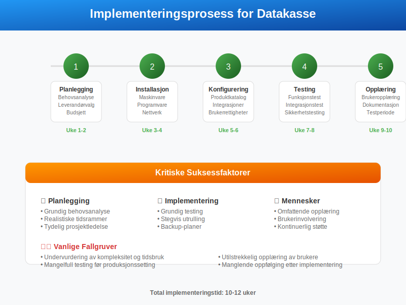
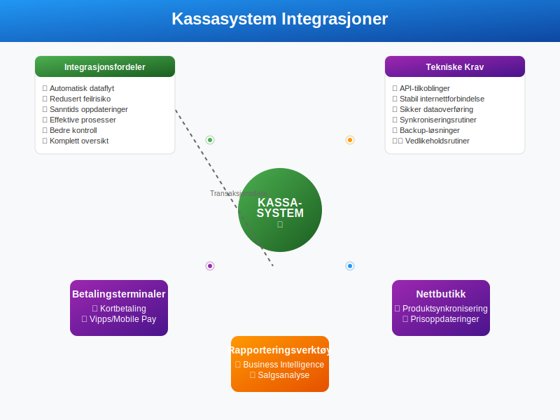
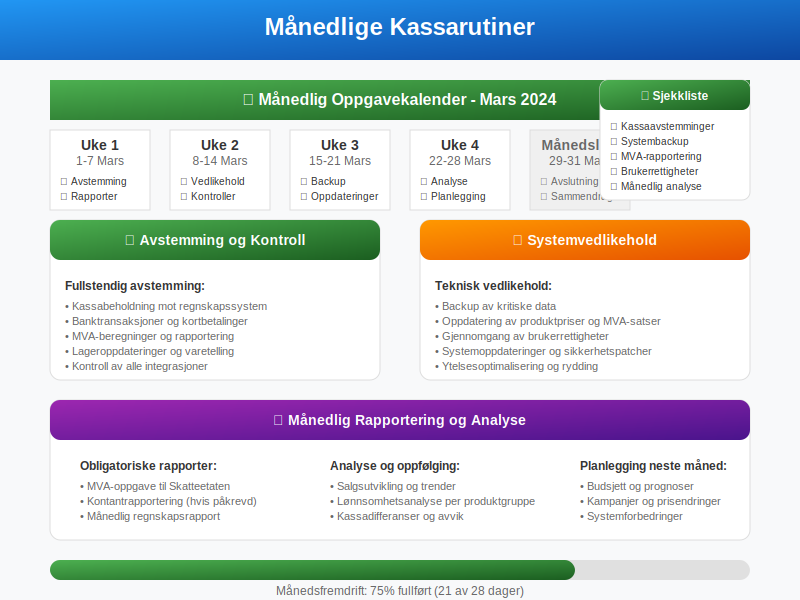
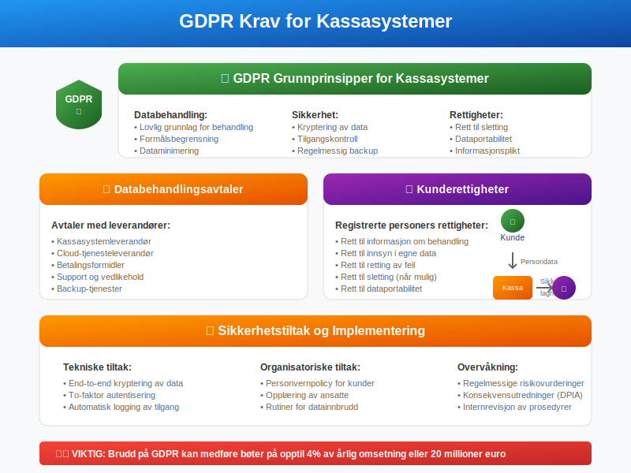
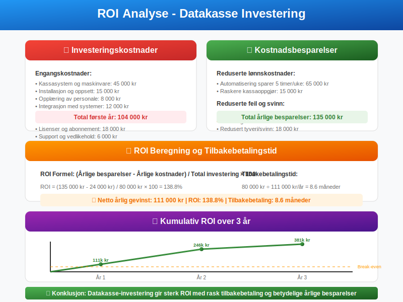
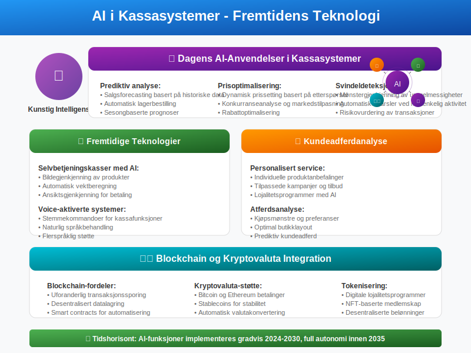
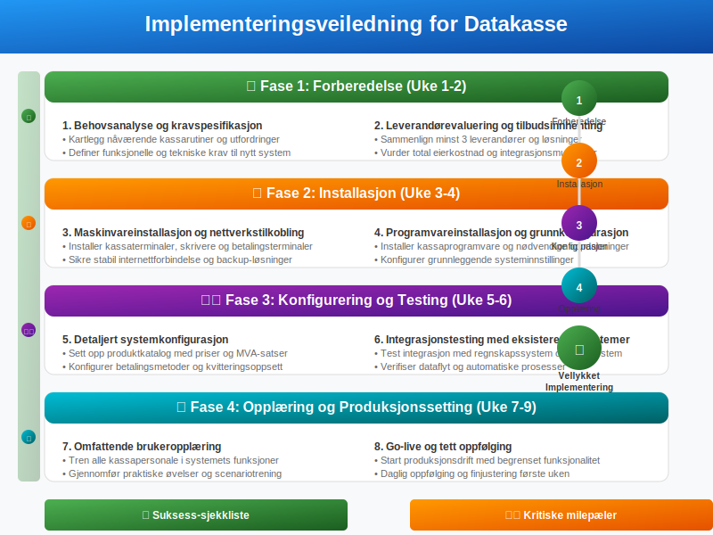

---
title: "Hva er Datakasse (Kassasystem)?"
seoTitle: "Hva er datakasse? | Kassasystem, krav og regnskapsføring"
description: "Datakasse er et elektronisk kassasystem for registrering av kontantsalg. Se lovkrav, funksjoner og integrasjon mot regnskap for korrekt dokumentasjon."
summary: "Forklaring av datakasse/kassasystem, lovkrav, funksjoner og integrasjon med regnskap."
---

**Datakasse** er et elektronisk kassasystem som registrerer og dokumenterer alle kontantsalg i en bedrift. Dette systemet er essensielt for [regnskapsføring](/blogs/regnskap/hva-er-regnskap "Hva er Regnskap? En komplett guide") og sikrer at alle transaksjoner blir korrekt registrert i henhold til [bokføringsloven](/blogs/regnskap/hva-er-bokføringsloven "Bokføringsloven - Krav, Regler og Praktisk Anvendelse") og [bokføringsreglene](/blogs/regnskap/hva-er-bokføringsregler "Bokføringsregler - Grunnleggende Prinsipper og Praktisk Anvendelse").


## Hva er en Datakasse?

En **datakasse** er et integrert system som kombinerer kassefunksjonalitet med regnskapsmessig dokumentasjon. Systemet sikrer at alle kontanttransaksjoner blir:

* **Automatisk registrert** med tidsstempel og transaksjonsnummer
* **Dokumentert** med kvitteringer og [bilag](/blogs/regnskap/hva-er-bilag "Hva er Bilag? Komplett Guide til Regnskapsbilag og Dokumentasjon")
* **Integrert** med bedriftens regnskapssystem
* **Rapportert** til skattemyndighetene ved behov
* **Kontrollert** gjennom automatiske avstemminger

### Forskjell fra Tradisjonell Kasse


| Aspekt | Tradisjonell Kasse | Datakasse |
|--------|-------------------|-----------|
| **Registrering** | Manuell | Automatisk |
| **Dokumentasjon** | Begrenset | Komplett |
| **Integrasjon** | Ingen | Regnskapssystem |
| **Kontroll** | Manuell | Automatisk |
| **Rapportering** | Tidkrevende | Automatisk |
| **Feilrisiko** | Høy | Lav |

## Lovkrav og Forskrifter

### Bokføringsloven og Datakasse

I henhold til **bokføringsloven § 5** må alle forretningshendelser dokumenteres forsvarlig. For kontantsalg innebærer dette:

* **Umiddelbar registrering** av alle transaksjoner
* **Sikker oppbevaring** av transaksonsdata
* **Sporbarhet** tilbake til original transaksjon
* **Integritet** i dataene som ikke kan endres i ettertid

### Kontantrapportering

Bedrifter med betydelig kontantomsetning må følge spesielle krav:


#### Rapporteringsplikt

* **Månedlig rapportering** til Skatteetaten for bedrifter over visse terskler
* **Detaljert dokumentasjon** av alle kontanttransaksjoner
* **Elektronisk innsending** gjennom [Altinn](/blogs/regnskap/hva-er-altinn "Hva er Altinn? Digital Forvaltning og Regnskapsrapportering")
* **Oppbevaring** av data i minimum 5 år

## Typer Kassasystemer

### Tradisjonelle POS-systemer

**Point of Sale (POS)** systemer er den vanligste formen for datakasse:

* **Integrert maskinvare** med skjerm, tastatur og kvitteringsskriver
* **Programvare** for salgsregistrering og lagerføring med støtte for [GTIN/EAN-koder](/blogs/regnskap/hva-er-gtin-ean "Hva er GTIN/EAN? Komplett Guide til Globale Produktkoder i Regnskap")
* **Betalingsintegrasjon** for kort og kontant
* **Rapporteringsfunksjoner** for salg og lager

### Cloud-baserte Løsninger


Moderne kassasystemer er ofte **cloud-baserte** og tilbyr:

* **Tilgang fra flere enheter** (tablet, mobil, PC)
* **Automatisk backup** og datasikkerhet
* **Sanntidsrapportering** og analyse
* **Automatiske oppdateringer** og vedlikehold
* **Integrasjon** med regnskapssystemer og nettbutikker

### Mobile Kassaløsninger

**Mobile kassasystemer** blir stadig mer populære:

* **Tablet-baserte** løsninger med enkelt grensesnitt
* **Mobilbetaling** gjennom Vipps, kort og kontant
* **Portabilitet** for markeder og events
* **Lavere kostnader** enn tradisjonelle systemer

## Regnskapsføring med Datakasse

### Automatisk Bilagsføring

Datakassen genererer automatisk [regnskapsbilag](/blogs/regnskap/hva-er-bilagsføring "Bilagsføring - Prosess, Krav og Beste Praksis") for hver transaksjon:

```
Bilag nr: 2024-001234
Dato: 15.03.2024 14:32:15
Kunde: Kontantsalg
Beløp: 1.250,00 kr
MVA: 250,00 kr (25%)
Netto: 1.000,00 kr
```

### Integrasjon med Regnskapssystem


Moderne datakasser integreres direkte med regnskapssystemer:

* **Automatisk overføring** av transaksjonsdata
* **Korrekt kontering** baspå produktkategorier
* **MVA-håndtering** i henhold til gjeldende satser
* **Avstemming** mot [banktransaksjoner](/blogs/regnskap/hva-er-banktransaksjoner "Banktransaksjoner - Registrering, Avstemming og Regnskapsføring")

### Daglig Kassarapport

En typisk kassarapport inneholder:

| Element | Beskrivelse | Beløp |
|---------|-------------|-------|
| **Åpningsbalanse** | Kontanter ved start | 2.000,00 |
| **Kontantsalg** | Dagens kontantinntekter | 15.750,00 |
| **Utbetalinger** | Vekslepenger og uttak | -1.200,00 |
| **Teoretisk slutt** | Beregnet kassabeholdning | 16.550,00 |
| **Faktisk telling** | Opptalt kontantbeholdning | 16.550,00 |
| **Differanse** | Avvik som må undersøkes | 0,00 |

Den daglige kassarapporten danner grunnlaget for **[kasseoppgjør](/blogs/regnskap/hva-er-kasseoppgjor "Hva er Kasseoppgjør? Komplett Guide til Kasseavstemming og Kontantoppgjør")**, som er den systematiske prosessen med å avstemme fysisk kassebeholdning mot registrerte transaksjoner. For løpende overvåking i løpet av dagen kan bedriften også benytte **[X-rapport](/blogs/regnskap/hva-er-x-rapport "Hva er X-rapport? Komplett Guide til Kassesystemets Salgsdokumentasjon")**, som er en mellomrapport som viser status på salg og kontanter uten å avslutte kassedagen. Dette sikrer nøyaktig regnskapsføring og god internkontroll av kontanthåndtering.

## Implementering av Datakasse

### Planleggingsfase



Før implementering må bedriften vurdere:

* **Behov og krav** basert på virksomhetens art
* **Budsjett** for innkjøp og drift
* **Integrasjonsmuligheter** med eksisterende systemer
* **Opplæringsbehov** for ansatte
* **Teknisk infrastruktur** og internettforbindelse

### Valg av System

#### Vurderingskriterier

* **Funksjonalitet:** Dekker systemet alle nødvendige behov?
* **Brukervennlighet:** Er systemet intuitivt for ansatte?
* **Integrasjon:** Kan det kobles til regnskapssystem?
* **Support:** Tilbys god teknisk støtte?
* **Kostnad:** Er total eierkostnad akseptabel?
* **Skalerbarhet:** Kan systemet vokse med bedriften?

#### Populære Leverandører i Norge

| Leverandør | Målgruppe | Styrker |
|------------|-----------|---------|
| **Visma** | SMB og enterprise | Sterk regnskapsintegrasjon |
| **24SevenOffice** | Små bedrifter | Enkel implementering |
| **Tripletex** | Regnskapsførere | Komplett økonomisystem |
| **iZettle/PayPal** | Små butikker | Mobilfokus og enkelt oppsett |
| **Shopify POS** | Detaljhandel | E-handel integrasjon |

### Oppsett og Konfigurering

#### Grunnleggende Konfigurasjon

* **Produktkatalog** med priser og MVA-satser
* **Betalingsmetoder** (kontant, kort, Vipps)
* **Kvitteringsoppsett** med bedriftsinformasjon
* **Brukerrettigheter** og tilgangskontroll
* **Regnskapskontering** for automatisk [bilagsregistrering](/blogs/regnskap/hva-er-bilagsregistrere "Bilagsregistrering - Digitale Løsninger og Beste Praksis")

#### Integrasjonsoppsett



* **Regnskapssystem:** Automatisk overføring av transaksjoner
* **Lagersystem:** Sanntids lageroppdatering
* **Nettbutikk:** Synkronisering av produkter og priser
* **Betalingsterminaler:** Sømløs kortbetaling
* **Rapporteringsverktøy:** Business intelligence og analyse

## Drift og Vedlikehold

### Daglige Rutiner

#### Åpning av Kasse

* **Kontroll** av kassabeholdning mot forrige dags rapport
* **Registrering** av åpningsbalanse
* **Systemsjekk** av alle funksjoner
* **Kvitteringspapir** og forbruksmateriell

#### Stenging av Kasse

* **Kassaoppgjør** med telling av kontanter
* **Utskrift** av daglig kassarapport
* **Avstemming** mot systemets beregninger
* **Sikker oppbevaring** av kontanter og rapporter

### Månedlige Oppgaver



* **Fullstendig avstemming** mot regnskapssystem
* **Kontroll** av alle integrasjoner
* **Backup** av kritiske data
* **Oppdatering** av produktpriser og MVA-satser
* **Gjennomgang** av brukerrettigheter

### Feilsøking og Support

#### Vanlige Problemer

| Problem | Årsak | Løsning |
|---------|-------|---------|
| **Systemtreg** | Lav internettforbindelse | Sjekk nettverksstatus |
| **Kvittering printer ikke** | Tomt papir/teknisk feil | Bytt papir/restart printer |
| **Integrasjon fungerer ikke** | API-problemer | Kontakt leverandør |
| **Kassadifferanse** | Menneskelig feil | Gjennomgå transaksjoner |
| **Systemkrasj** | Programvarefeil | Restart og kontakt support |

## Sikkerhet og Datavern

### Datasikkerhet

**Datakasser** håndterer sensitive finansielle data og krever robust sikkerhet:

* **Kryptering** av alle data i transit og hvile
* **Tilgangskontroll** med sterke passord og to-faktor autentisering
* **Regelmessig backup** til sikre lokasjoner
* **Oppdateringer** av sikkerhetsprogramvare
* **Logging** av alle systemaktiviteter

### GDPR-compliance



Kassasystemer må følge **GDPR-krav**:

* **Databehandlingsavtaler** med leverandører
* **Personvernpolicy** for kundedata
* **Rett til sletting** av personopplysninger
* **Dataportabilitet** ved systemskifte
* **Sikkerhetstiltak** mot datainnbrudd

### Fysisk Sikkerhet

* **Sikker plassering** av kassaterminaler
* **Låsbare skuffer** for kontantoppbevaring
* **Overvåkning** med kameraer
* **Begrenset tilgang** til kassaområdet
* **Rutiner** for kontanthåndtering

## Økonomiske Fordeler

### Kostnadsbesparelser



Implementering av datakasse gir flere økonomiske fordeler:

* **Redusert tidsbruk** på manuelle registreringer
* **Færre feil** i regnskapsføring
* **Automatiserte prosesser** reduserer lønnskostnader
* **Bedre kontroll** reduserer svinn og tyveri
* **Raskere rapportering** til skattemyndighetene

### Forbedret Kontroll

#### Sanntidsrapportering

* **Øyeblikkelig** innsikt i salgsutvikling
* **Automatiske varsler** ved uregelmessigheter
* **Detaljert analyse** av salgsdata
* **Sammenligning** med historiske data
* **Prognoser** basert på trender

#### Lageroptimalisering

* **Automatisk lageroppdatering** ved salg
* **Lavlager-varsler** for kritiske produkter
* **Analyse** av produktpopularitet
* **Optimalisering** av innkjøp
* **Reduksjon** av lagerkostnader

## Fremtidige Utviklingstrender

### Kunstig Intelligens



**AI-teknologi** vil revolusjonere kassasystemer:

* **Prediktiv analyse** for salgsforecasting
* **Automatisk prisoptimalisering** basert på etterspørsel
* **Kundeadferdanalyse** for personalisert service
* **Svindeldeteksjon** gjennom mønstergjenkjenning
* **Automatisert lagerbestilling** basert på AI-algoritmer

### Kontaktløse Løsninger

* **Selvbetjeningskasser** med AI-gjenkjenning
* **Mobile betalinger** uten fysisk interaksjon
* **QR-kode baserte** bestillings- og betalingssystemer
* **Biometrisk autentisering** for sikkerhet
* **Voice-aktiverte** kassafunksjoner

### Blockchain og Kryptovaluta

* **Blockchain-basert** transaksjonssporing
* **Kryptovaluta-støtte** for alternative betalinger
* **Smart contracts** for automatiserte prosesser
* **Desentralisert** datalagring for økt sikkerhet
* **Tokenisering** av lojalitetsprogrammer

## Implementeringsveiledning

### Steg-for-Steg Prosess



#### Fase 1: Forberedelse (Uke 1-2)

1. **Behovsanalyse** og kravspesifikasjon
2. **Leverandørevaluering** og tilbudsinnhenting
3. **Budsjettgodkjenning** og kontraktsinngåelse
4. **Prosjektplan** med tidslinjer og milepæler

#### Fase 2: Installasjon (Uke 3-4)

1. **Maskinvareinstallasjon** og nettverkstilkobling
2. **Programvareinstallasjon** og grunnkonfigurasjon
3. **Integrasjonstesting** med eksisterende systemer
4. **Datamigrering** fra gamle systemer

#### Fase 3: Testing (Uke 5-6)

1. **Funksjonstesting** av alle kassafunksjoner
2. **Integrasjonstesting** med regnskapssystem
3. **Ytelsestesting** under normal belastning
4. **Sikkerhetstesting** av alle tilgangspunkter

#### Fase 4: Opplæring (Uke 7-8)

1. **Administratoropplæring** for systemansvarlige
2. **Brukeropplæring** for kassapersonale
3. **Dokumentasjon** av prosedyrer og rutiner
4. **Testperiode** med begrenset bruk

#### Fase 5: Produksjonssetting (Uke 9)

1. **Go-live** med full funksjonalitet
2. **Tett oppfølging** første dagene
3. **Finjustering** basert på brukererfaring
4. **Evaluering** av implementeringen

### Suksessfaktorer

#### Kritiske Elementer

* **Ledelsesforankring** og tydelig kommunikasjon
* **Grundig planlegging** og realistiske tidsrammer
* **Kompetent prosjektledelse** med erfaring
* **Aktiv brukerinvolvering** gjennom hele prosessen
* **Tilstrekkelig opplæring** og dokumentasjon

#### Vanlige Fallgruver

* **Undervurdering** av kompleksitet og tidsbruk
* **Mangelfull testing** før produksjonssetting
* **Utilstrekkelig opplæring** av brukere
* **Dårlig kommunikasjon** med interessenter
* **Manglende oppfølging** etter implementering

## Konklusjon

**Datakasse** er et essensielt verktøy for moderne bedrifter som håndterer kontantsalg. Systemet sikrer ikke bare overholdelse av lovkrav, men gir også betydelige operasjonelle fordeler gjennom automatisering og bedre kontroll.

### Viktigste Fordeler

* **Automatisk regnskapsføring** reduserer feil og tidsbruk
* **Lovpålagt dokumentasjon** sikres automatisk
* **Bedre kontroll** over kontantstrømmer og lager
* **Integrerte løsninger** forenkler daglige rutiner
* **Sanntidsrapportering** gir bedre beslutningsgrunnlag

### Anbefalinger

For bedrifter som vurderer implementering av datakasse:

1. **Start** med grundig behovsanalyse
2. **Evaluer** flere leverandører og løsninger
3. **Planlegg** implementeringen nøye
4. **Invester** i god opplæring av personalet
5. **Følg opp** systemet jevnlig for optimal ytelse

Med riktig valg og implementering vil en datakasse være en verdifull investering som styrker bedriftens [regnskapsrutiner](/blogs/regnskap/hva-er-bokføring "Bokføring - Grunnleggende Prinsipper og Praktisk Gjennomføring") og gir bedre kontroll over den finansielle driften.


