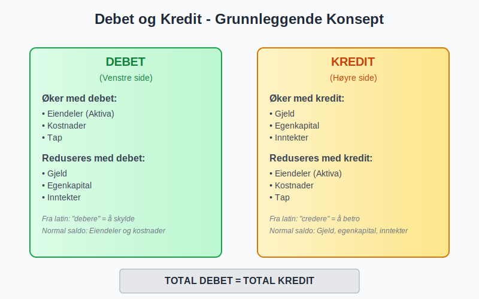
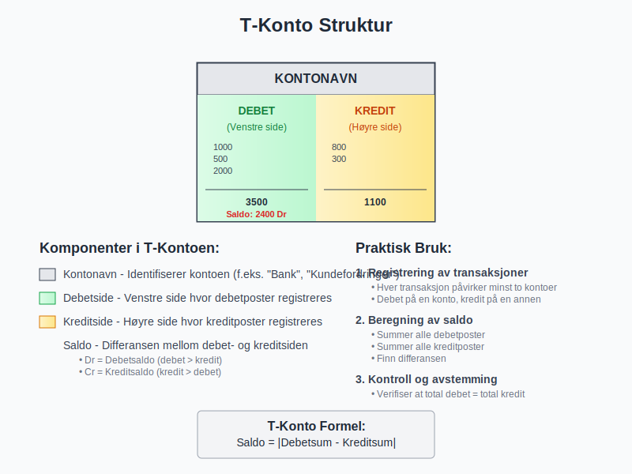
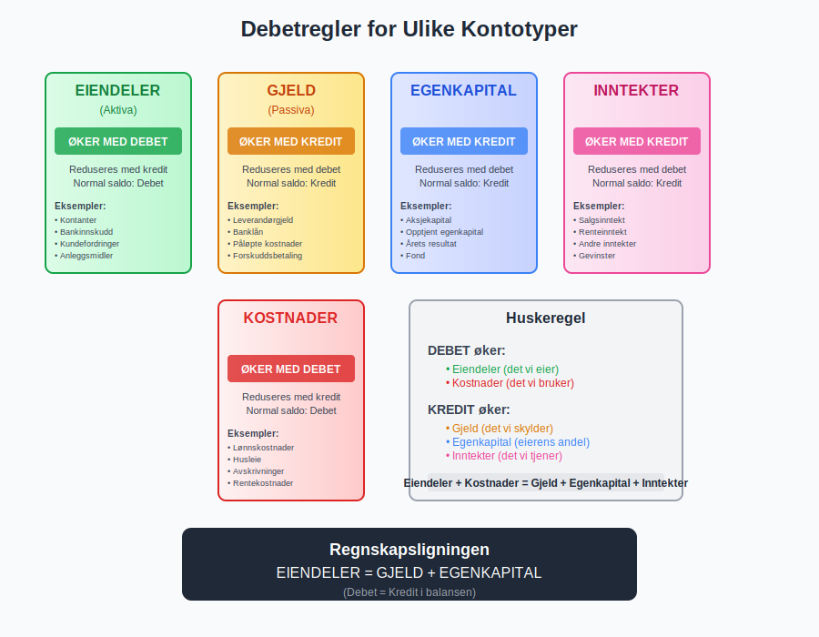
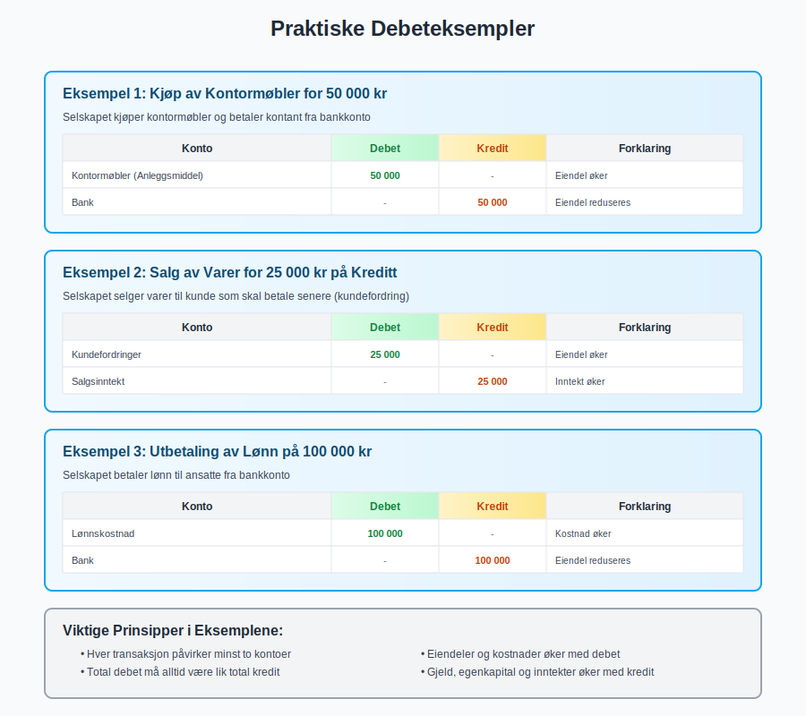
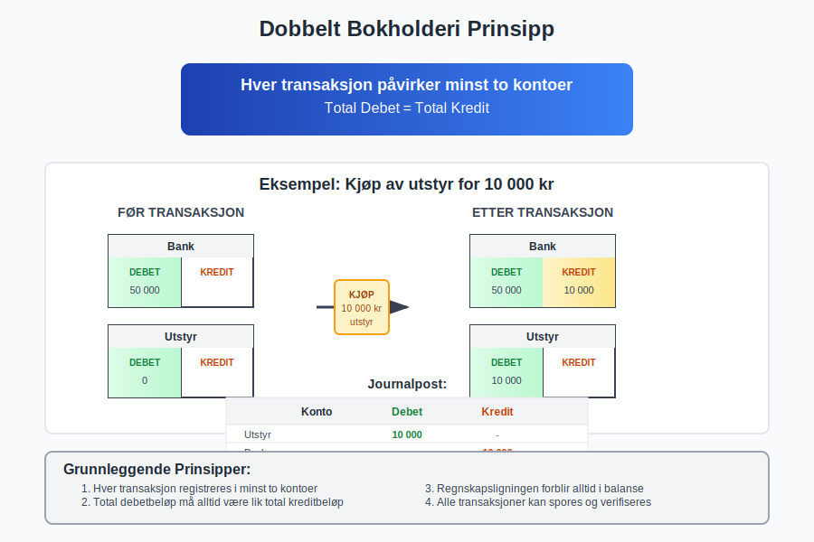
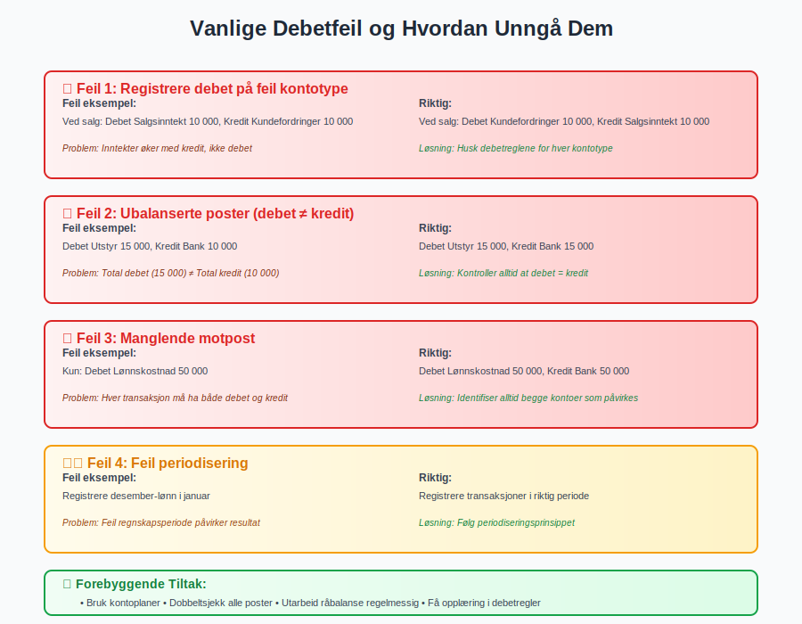
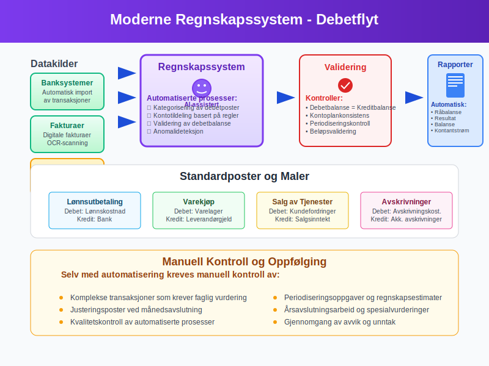
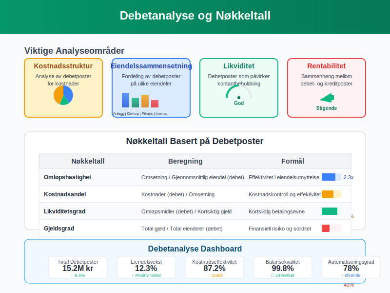

---
title: "Hva er debet?"
meta_title: "Hva er debet?"
meta_description: '**Debet** er et av de mest fundamentale begrepene i regnskap og [bokføring](/blogs/regnskap/hva-er-bokføring "Hva er Bokføring? En Komplett Guide til Norsk B...'
slug: hva-er-debet
type: blog
layout: pages/single
---

**Debet** er et av de mest fundamentale begrepene i regnskap og [bokføring](/blogs/regnskap/hva-er-bokføring "Hva er Bokføring? En Komplett Guide til Norsk Bokføringspraksis"). Ordet kommer fra det latinske "debere" som betyr "å skylde", og representerer venstre side av en regnskapskonto. Forståelse av debet er essensielt for alle som arbeider med regnskap, da det danner grunnlaget for [dobbelt bokføring](/blogs/regnskap/hva-er-dobbel-bokforing "Hva er Dobbel Bokføring? Komplett Guide til Dobbelt Bokføringssystem") som brukes i moderne regnskapsføring.

For en praktisk gjennomgang av hvordan du **debitere** kontoer, se [Debitere](/blogs/regnskap/debitere "Debitere i Regnskap? En Komplett Guide til Debitering av Kontoer").

## Hva er Debet?

Debet er en regnskapspost som registreres på venstre side av en konto i [dobbelt bokføring](/blogs/regnskap/hva-er-dobbel-bokforing "Hva er Dobbel Bokføring? Komplett Guide til Dobbelt Bokføringssystem"). Sammen med **[kredit](/blogs/regnskap/hva-er-kreditere "Hva er Kreditere? En Komplett Guide til Kreditering i Regnskap og Kontering")** (høyre side) utgjør debet grunnlaget for all systematisk [bokføring](/blogs/regnskap/hva-er-bokføring "Hva er Bokføring? En Komplett Guide til Norsk Bokføringspraksis"). Hver transaksjon i regnskapet må ha minst én debetpost og én [kreditpost](/blogs/regnskap/hva-er-kreditere "Hva er Kreditere? En Komplett Guide til Kreditering i Regnskap og Kontering"), og summen av alle debetposter må alltid være lik summen av alle kreditposter.

### Etymologi og Historisk Bakgrunn

Begrepet debet stammer fra det latinske ordet "debere", som betyr "å skylde" eller "å være skyldig". Dette reflekterer den historiske bruken av begrepet i handelsbøker, hvor debetposter opprinnelig representerte det som var skyldt til virksomheten. Over tid har betydningen utviklet seg til å bli en mer teknisk regnskapsterm som beskriver en bestemt side av regnskapskontoer.

## T-Kontoer og Debetposter

**T-kontoen** er et visuelt hjelpemiddel som illustrerer hvordan debetposter fungerer. Kontoen er formet som bokstaven "T", hvor venstre side representerer debet og høyre side representerer kredit.

### Struktur av T-Kontoen

| Komponent | Plassering | Funksjon |
|-----------|------------|----------|
| Kontonavn | Øverst | Identifiserer kontoen |
| Debetside | Venstre | Registrerer debetposter |
| Kreditside | Høyre | Registrerer kreditposter |
| Saldo | Nederst | Viser netto balanse |

## Debetregler for Ulike Kontotyper

Hvordan debet påvirker ulike kontotyper avhenger av kontoens natur. Dette er fundamentalt for å forstå [regnskapets](/blogs/regnskap/hva-er-regnskap "Hva er Regnskap? En Dybdeanalyse for Norge") logikk:

### Eiendelskontoer (Aktiva)

For [aktiva](/blogs/regnskap/hva-er-aktiva "Hva er Aktiva? En Komplett Guide til Eiendeler i Regnskap") gjelder følgende debetregler:

* **Økning**: Registreres som debet
* **Reduksjon**: Registreres som kredit
* **Normal saldo**: Debetsaldo

**Eksempler på eiendelskontoer:**

* Kontanter og bankinnskudd
* Kundefordringer
* Varelager
* [Anleggsmidler](/blogs/regnskap/hva-er-anleggsmidler "Hva er Anleggsmidler? Komplett Guide til Varige Driftsmidler")
* Immaterielle eiendeler

### Gjeldskontoer (Passiva)

For gjeldskontoer gjelder motsatte regler:

* **Økning**: Registreres som kredit
* **Reduksjon**: Registreres som debet
* **Normal saldo**: Kreditsaldo

**Eksempler på gjeldskontoer:**

* Leverandørgjeld
* Banklån
* Påløpte kostnader
* Forskuddsbetaling fra kunder

### Egenkapitalkontoer

Egenkapitalkontoer følger samme mønster som gjeldskontoer:

* **Økning**: Registreres som kredit
* **Reduksjon**: Registreres som debet
* **Normal saldo**: Kreditsaldo

### Inntektskontoer

Inntektskontoer øker egenkapitalen og følger derfor samme regler:

* **Økning**: Registreres som kredit
* **Reduksjon**: Registreres som debet
* **Normal saldo**: Kreditsaldo

### Kostnadskontoer

Kostnadskontoer reduserer egenkapitalen og følger derfor motsatte regler:

* **Økning**: Registreres som debet
* **Reduksjon**: Registreres som kredit
* **Normal saldo**: Debetsaldo

## Praktiske Eksempler på Debetposter

La oss se på konkrete eksempler for å illustrere hvordan debetposter fungerer i praksis:

### Eksempel 1: Kjøp av Kontormøbler

Når et selskap kjøper kontormøbler for 50 000 kr:

| Konto | Debet | Kredit |
|-------|-------|--------|
| Kontormøbler (Anleggsmiddel) | 50 000 | |
| Bank | | 50 000 |

**Forklaring**: Kontormøbler (eiendel) øker med debet, mens bank (eiendel) reduseres med [kredit](/blogs/regnskap/hva-er-kreditere "Hva er Kreditere? En Komplett Guide til Kreditering i Regnskap og Kontering").

### Eksempel 2: Salg av Varer

Ved salg av varer for 25 000 kr:

| Konto | Debet | Kredit |
|-------|-------|--------|
| Kundefordringer | 25 000 | |
| Salgsinntekt | | 25 000 |

**Forklaring**: Kundefordringer (eiendel) øker med debet, mens salgsinntekt øker med [kredit](/blogs/regnskap/hva-er-kreditere "Hva er Kreditere? En Komplett Guide til Kreditering i Regnskap og Kontering").

### Eksempel 3: Betaling av Lønn

Ved utbetaling av lønn på 100 000 kr:

| Konto | Debet | Kredit |
|-------|-------|--------|
| Lønnskostnad | 100 000 | |
| Bank | | 100 000 |

**Forklaring**: Lønnskostnad øker med debet, mens bank (eiendel) reduseres med kredit.

## Dobbelt Bokholderi og Debetbalanse

Det dobbelte bokholderisystemet krever at hver transaksjon registreres med både debet- og kreditposter. Dette sikrer at regnskapet alltid er i **balanse**.

### Grunnleggende Prinsipper

* **Hver transaksjon** må ha minst én debetpost og én kreditpost
* **Total debet** må alltid være lik total kredit
* **Regnskapsligningen** må alltid være i balanse: Eiendeler = Gjeld + Egenkapital

### Kontroll av Debetbalanse

For å sikre korrekt bokføring, utarbeides regelmessig en **råbalanse** som viser:

| Kontotype | Normal saldo | Kontrollpunkt |
|-----------|--------------|---------------|
| Eiendeler | Debet | Skal ha debetsaldo |
| Gjeld | Kredit | Skal ha kreditsaldo |
| Egenkapital | Kredit | Skal ha kreditsaldo |
| Inntekter | Kredit | Skal ha kreditsaldo |
| Kostnader | Debet | Skal ha debetsaldo |

## Debetposter i Norsk Regnskapspraksis

I Norge følger regnskapsføringen spesifikke standarder og krav som påvirker hvordan debetposter håndteres:

### Bokføringsloven og Debetposter

[Bokføringsloven](/blogs/regnskap/hva-er-bokføringsloven "Hva er Bokføringsloven? Komplett Guide til Norske Bokføringsregler") stiller krav til:

* **Systematisk registrering** av alle debetposter
* **Kronologisk rekkefølge** i journalføringen
* **Sporbarhet** fra [bilag](/blogs/regnskap/hva-er-bilag "Hva er Bilag i Regnskap? Komplett Guide til Regnskapsbilag og Dokumentasjon") til debetpost
* **Oppbevaring** av dokumentasjon

### Norsk Regnskapsstandard og Debetklassifisering

Norsk regnskapsstandard (NRS) gir retningslinjer for:

* **Klassifisering** av debetposter
* **Periodisering** av transaksjoner
* **MÃ¥ling** og **vurdering** av poster

## Vanlige Feil ved Debetregistrering

### Typiske Feilkilder

* **Feil kontotype**: Registrere debet på kreditkonto eller omvendt
* **Feil beløp**: Uriktig beløpsføring
* **Manglende motpost**: Glemme tilhørende kreditpost
* **Feil periodisering**: Registrere i feil regnskapsperiode

### Forebygging av Feil

* **Systematisk kontroll** av alle poster
* **Regelmessig avstemming** mot eksterne kilder
* **Bruk av kontoplaner** for konsistent klassifisering
* **Opplæring** i debetregler og -prinsipper

## Debetposter og Moderne Regnskapssystemer

Moderne regnskapssystemer automatiserer mye av debetregistreringen, men forståelse av prinsippene er fortsatt essensielt:

### Automatiserte Debetposter

* **Standardposter**: Forhåndsdefinerte debetmaler
* **Integrasjoner**: Automatisk import fra banksystemer
* **Validering**: Systemkontroll av debetbalanse
* **Rapportering**: Automatisk generering av debetrapporter

### Manuell Kontroll

Selv med automatisering kreves manuell kontroll av:

* **Komplekse transaksjoner**
* **Periodiseringsoppgaver**
* **Justeringsposter**
* **Ã…rsavslutningsarbeid**

## Debetposter i Spesielle Situasjoner

### Valutaomregning

Ved transaksjoner i utenlandsk valuta må debetposter justeres for:

* **Kursendringer** på balansetidspunktet
* **Realiserte** og **urealiserte** kursgevinster/-tap
* **Sikringstransaksjoner**

### Konsernregnskap

I konsernsammenheng krever debetposter spesiell behandling for:

* **Elimineringer** av interne transaksjoner
* **Konsolideringsjusteringer**
* **Minoritetsinteresser**

## Sammenheng med Andre Regnskapsbegreper

Debet er tett knyttet til flere andre viktige regnskapsbegreper:

### Kredit

**Kredit** er debets motpart og representerer høyre side av regnskapskontoer. Sammen utgjør debet og kredit grunnlaget for det dobbelte bokholderisystemet.

### Balanse

[Balansen](/blogs/regnskap/hva-er-balanse "Hva er Balanse i Regnskap? Komplett Guide til Balansens Oppbygging og Funksjon") viser hvordan debetposter påvirker selskapets finansielle stilling på et bestemt tidspunkt.

### Resultatregnskap

Debetposter for kostnader påvirker direkte resultatregnskapet og selskapets lønnsomhet.

### Kontantstrøm

Debetposter som påvirker kontanter og bankinnskudd reflekteres i kontantstrømoppstillingen.

## Debetanalyse og Nøkkeltall

Analyse av debetposter kan gi verdifull innsikt i virksomhetens drift:

### Viktige Analyseområder

* **Kostnadsstruktur**: Analyse av debetposter for kostnader
* **Eiendelssammensetning**: Fordeling av debetposter på ulike eiendeler
* **Likviditet**: Debetposter som påvirker kontantbeholdning
* **Rentabilitet**: Sammenheng mellom debet- og kreditposter

### Nøkkeltall Basert på Debetposter

| Nøkkeltall | Beregning | Formål |
|------------|-----------|---------|
| Omløpshastighet | Omsetning / Gjennomsnittlig eiendel | Effektivitet i eiendelsutnyttelse |
| Kostnadsandel | Kostnader (debet) / Omsetning | Kostnadskontroll |
| Likviditetsgrad | Omløpsmidler / Kortsiktig gjeld | Betalingsevne |

## Digitalisering og Fremtiden for Debetregistrering

Teknologisk utvikling påvirker hvordan debetposter håndteres:

### Kunstig Intelligens

* **Automatisk kategorisering** av debetposter
* **Anomalideteksjon** for å identifisere feil
* **Prediktiv analyse** basert på debetmønstre

### Blockchain-teknologi

* **Uforanderlig registrering** av debetposter
* **Økt transparens** i regnskapsføringen
* **Redusert behov** for manuell kontroll

### Sanntidsregnskap

* **Kontinuerlig oppdatering** av debetposter
* **Øyeblikkelig balansekontroll**
* **Automatisk rapportering**

## Oppsummering

**Debet** er et fundamentalt konsept i regnskap som representerer venstre side av regnskapskontoer. Forståelse av debetregler for ulike kontotyper er essensielt for korrekt [bokføring](/blogs/regnskap/hva-er-bokføring "Hva er Bokføring? En Komplett Guide til Norsk Bokføringspraksis") og regnskapsføring.

### Viktige Punkter å Huske

* **Eiendeler** øker med debet, reduseres med kredit
* **Gjeld og egenkapital** øker med kredit, reduseres med debet
* **Kostnader** øker med debet, **inntekter** øker med kredit
* **Total debet** må alltid være lik **total kredit**
* **Systematisk kontroll** er nødvendig for å unngå feil

### Praktisk Anvendelse

For å mestre debetregistrering i praksis anbefales det å:

* **Øve** på praktiske eksempler
* **Bruke** T-kontoer for visualisering
* **Kontrollere** regelmessig at debet = kredit
* **Holde seg oppdatert** på regnskapsregler og -standarder

Debet er ikke bare et teknisk regnskapsbegrep, men et verktøy som gir innsikt i virksomhetens økonomiske aktiviteter og finansielle helse. Med solid forståelse av debetprinsipper kan man bedre analysere og forstå regnskapsinformasjon, noe som er verdifullt både for regnskapsførere, ledere og andre interessenter.

