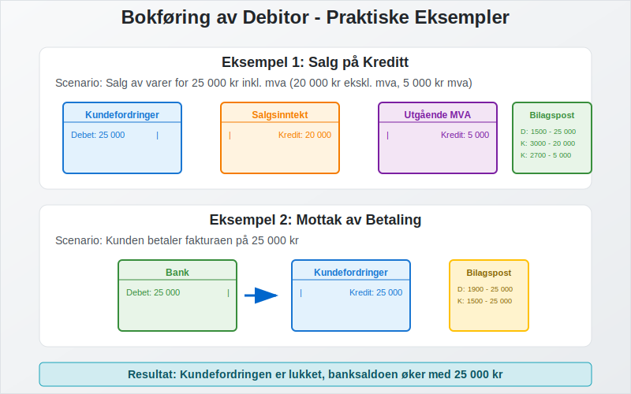
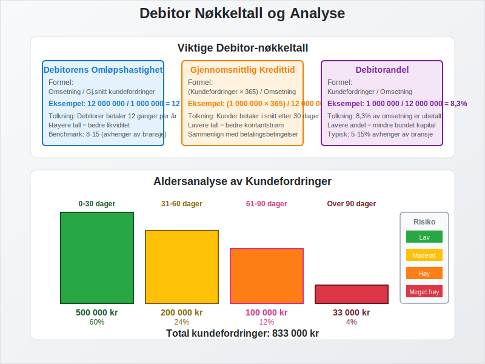

**Debitor** er et sentralt begrep i [regnskap](/blogs/regnskap/hva-er-regnskap "Hva er Regnskap? En Dybdeanalyse for Norge") og [bokføring](/blogs/regnskap/hva-er-bokføring "Hva er Bokføring? En Komplett Guide til Norsk Bokføringspraksis") som refererer til [kunder](/blogs/regnskap/hva-er-kunde "Hva er en Kunde? Komplett Guide til Kundehåndtering i Regnskap") som skylder penger til virksomheten for leverte varer eller tjenester. Debitor representerer [kundefordringer](/blogs/regnskap/hva-er-kundefordring "Hva er Kundefordring? En Komplett Guide til Kundefordringer i Regnskap") og er en viktig del av selskapets [aktiva](/blogs/regnskap/hva-er-aktiva "Hva er Aktiva? En Komplett Guide til Eiendeler i Regnskap"). Effektiv debitorhåndtering er avgjørende for å opprettholde god likviditet og [arbeidskapital](/blogs/regnskap/hva-er-arbeidskapital "Hva er Arbeidskapital? Guide til Likviditetsstyring").

## Hva er Debitor?

Debitor er en person eller virksomhet som skylder penger til din bedrift for varer eller tjenester som er levert, men ikke betalt. I regnskapssammenheng registreres debitorer som **[kundefordringer](/blogs/regnskap/hva-er-kundefordring "Hva er Kundefordring? En Komplett Guide til Kundefordringer i Regnskap")** på [balansen](/blogs/regnskap/hva-er-balanse "Hva er Balanse? Komplett Guide til Balanseregnskap") under omløpsmidler. Debitorposten oppstår når du selger på kreditt, det vil si at kunden får varene eller tjenestene før betaling skjer.

### Forskjellen mellom Debitor og Kreditor

Det er viktig å skille mellom debitor og kreditor:

| Begrep | Definisjon | Regnskapspost | Balanseplassering |
|--------|------------|---------------|-------------------|
| **Debitor** | Kunder som skylder deg penger | Kundefordringer | Aktiva (omløpsmidler) |
| **[Kreditor](/blogs/regnskap/hva-er-kreditor "Hva er Kreditor? Komplett Guide til Leverandørgjeld og Kreditorhåndtering")** | Leverandører du skylder penger | [Leverandørgjeld](/blogs/regnskap/hva-er-leverandorgjeld "Hva er Leverandørgjeld i Regnskap? Komplett Guide til Kreditorhåndtering og Regnskapsføring") | Passiva (kortsiktig gjeld) |

Når leverandører gir kredittid til sine kunder, oppstår **[leverandørkreditt](/blogs/regnskap/hva-er-leverandorkreditt "Hva er Leverandørkreditt? Komplett Guide til Leverandørfinansiering")** - en av de mest utbredte formene for kortsiktig finansiering i næringslivet. Dette skaper en kreditor-debitor-relasjon hvor leverandøren blir kreditor og kunden blir debitor.

## Debitorprosessen

Debitorprosessen starter når du leverer varer eller tjenester på kreditt og ender når betalingen er mottatt:

### Trinn i Debitorprosessen

1. **Salg på kreditt**: Levering av varer/tjenester uten umiddelbar betaling gjennom **[fakturasalg](/blogs/regnskap/hva-er-fakturasalg "Hva er Fakturasalg? Komplett Guide til Kredittgivning og Debitorhåndtering")**
2. **[Fakturering](/blogs/regnskap/hva-er-en-faktura "Hva er en Faktura? En Guide til Norske Fakturakrav")**: Utsendelse av faktura til kunde
3. **Registrering**: [Bokføring](/blogs/regnskap/hva-er-bokføring "Hva er Bokføring? En Komplett Guide til Norsk Bokføringspraksis") av kundefordring
4. **Oppfølging**: Overvåking av betalingsfrister
5. **Innbetaling**: Mottak av betaling fra kunde
6. **Avstemming**: Matching av betaling mot faktura

## Kredittid og Betalingsbetingelser

**Kredittid** er tiden kunden har til å betale fakturaen. Vanlige betalingsbetingelser i Norge inkluderer:

### Standard Betalingsbetingelser

| Betingelse | Beskrivelse | Kredittid |
|------------|-------------|-----------|
| **Netto 8 dager** | Betaling innen 8 dager | 8 dager |
| **Netto 14 dager** | Betaling innen 14 dager | 14 dager |
| **Netto 30 dager** | Betaling innen 30 dager | 30 dager |
| **Kontant** | Betaling ved levering | 0 dager |
| **Forskudd** | Betaling før levering | Negativ kredittid |

### Faktorer som PÃ¥virker Kredittid

* **Bransjenormer**: Ulike bransjer har forskjellige standarder
* **Kundeforhold**: Etablerte kunder kan få lengre kredittid
* **Risikoevaluering**: Kredittverdige kunder får bedre betingelser
* **Konkurransesituasjon**: Markedsforhold påvirker betingelsene
* **Kontantstrømbehov**: Selskapets likviditetssituasjon

## Debitoroppfølging og Inkasso

Systematisk oppfølging av debitorer er essensielt for å minimere tap og opprettholde god [likviditet](/blogs/regnskap/hva-er-betalingsevne "Hva er Betalingsevne? Guide til Likviditetsanalyse"). For en omfattende forståelse av **[inkassovirksomhet](/blogs/regnskap/hva-er-inkasso "Hva er Inkasso? Komplett Guide til Inkassovirksomhet og Fordringshåndtering")**, inkludert juridiske rammer, prosedyrer, kostnader og rettigheter, anbefaler vi vår detaljerte guide til inkasso.

### Oppfølgingstrinn

1. **Purring 1**: 7-14 dager etter forfall
2. **Purring 2**: 14-21 dager etter første purring
3. **Betalingsoppfordring**: Formell oppfordring med advokat
4. **Inkasso**: Enten [egeninkasso](/blogs/regnskap/hva-er-egeninkasso "Hva er Egeninkasso? Komplett Guide til Selvinkasso og Fordringshåndtering") eller overdragelse til inkassoselskap
5. **Rettslige skritt**: Søksmål og utlegg

Bedrifter kan velge mellom [egeninkasso](/blogs/regnskap/hva-er-egeninkasso "Hva er Egeninkasso? Komplett Guide til Selvinkasso og Fordringshåndtering") hvor de selv driver inkassovirksomhet, eller å overlate oppgaven til profesjonelle inkassoselskaper. Valget avhenger av bedriftens ressurser, juridiske kompetanse og ønsket kontrollnivå.

### Inkassokostnader

Ved forsinket betaling påløper flere typer kostnader som debitorer må dekke:

| Type kostnad | Beløp | Hjemmel |
|--------------|-------|---------|
| **[Morarente](/blogs/regnskap/hva-er-morarente "Hva er Morarente? Komplett Guide til Lovpålagt Forsinkelsesrente i Norge")** | Referanserente + 8% | Forsinkelsesrenteloven |
| **Purregebyr** | Inntil 75 kr | Inkassoloven § 10a |
| **Inkassogebyr** | 10% av hovedstol (min 200 kr, maks 2000 kr) | Inkassoloven § 10a |
| **Advokatkostnader** | Etter regning | Inkassoloven § 9 |

**Viktig:** [Morarente](/blogs/regnskap/hva-er-morarente "Hva er Morarente? Komplett Guide til Lovpålagt Forsinkelsesrente i Norge") påløper automatisk fra forfallsdato uten krav om påminnelse, mens andre kostnader krever aktiv oppfølging fra kreditor.

## Bokføring av Debitorer

Debitorposter [bokføres](/blogs/regnskap/hva-er-bokføring "Hva er Bokføring? En Komplett Guide til Norsk Bokføringspraksis") som [debet](/blogs/regnskap/hva-er-debet "Hva er Debet i Regnskap? Komplett Guide til Debetposter og Bokføring") på kundefordringskontoen:

### Eksempel: Salg på Kreditt

Ved salg av varer for 25 000 kr inkl. mva (20 000 kr ekskl. mva):

| Konto | Debet | Kredit |
|-------|-------|--------|
| Kundefordringer | 25 000 | |
| Salgsinntekt | | 20 000 |
| Utgående mva | | 5 000 |

### Eksempel: Mottak av Betaling

NÃ¥r kunden betaler fakturaen:

| Konto | Debet | Kredit |
|-------|-------|--------|
| Bank | 25 000 | |
| Kundefordringer | | 25 000 |

## Debitoranalyse og Nøkkeltall

Regelmessig analyse av debitorportføljen gir viktig innsikt i virksomhetens kredittstyring. En systematisk [kundeliste](/blogs/regnskap/hva-er-kundeliste "Hva er en Kundeliste? Komplett Guide til Kundeadministrasjon og Risikostyring") er grunnlaget for effektiv debitoranalyse:

### Viktige Debitor-nøkkeltall

| Nøkkeltall | Formel | Hva det måler |
|------------|--------|---------------|
| **Debitorens omløpshastighet** | Omsetning / Gjennomsnittlig kundefordringer | Hvor raskt debitorer betaler |
| **Gjennomsnittlig kredittid** | (Kundefordringer × 365) / Omsetning | Antall dager til betaling |
| **Debitorandel** | Kundefordringer / Omsetning | Andel av omsetning som er ubetalt |

### Aldersanalyse av Debitorer

En aldersanalyse viser fordelingen av kundefordringer etter hvor lenge de har vært utestående:

| Aldersgruppe | Beløp | Andel | Risiko |
|--------------|-------|-------|-------|
| **0-30 dager** | 500 000 | 60% | Lav |
| **31-60 dager** | 200 000 | 24% | Moderat |
| **61-90 dager** | 100 000 | 12% | Høy |
| **Over 90 dager** | 33 000 | 4% | Meget høy |

## Tap på Kundefordringer

Ikke alle debitorer betaler sine forpliktelser. Virksomheter må derfor ta høyde for **tap på kundefordringer**:

### Typer Tap

* **Spesifiserte tap**: Konkrete, identifiserte tap
* **Generelle tap**: Forventede tap basert på historisk erfaring
* **Endelige tap**: Tap som er konstatert som uinnkrevelige

### Bokføring av Tap

Ved konstatering av tap på 10 000 kr:

| Konto | Debet | Kredit |
|-------|-------|--------|
| Tap på kundefordringer | 10 000 | |
| Kundefordringer | | 10 000 |

## Debitors Påvirkning på Likviditet

Debitorer har direkte påvirkning på selskapets likviditet og [arbeidskapital](/blogs/regnskap/hva-er-arbeidskapital "Hva er Arbeidskapital? Guide til Likviditetsstyring"):

### Likviditetseffekter

* **Positiv effekt**: Økt salg gjennom kredittilbud
* **Negativ effekt**: Bundet kapital i kundefordringer
* **Risiko**: Potensielle tap ved manglende betaling

### Arbeidskapitalberegning

Arbeidskapital = Omløpsmidler - Kortsiktig gjeld

Hvor kundefordringer (debitorer) utgjør en vesentlig del av omløpsmidlene.

## Kredittvurdering og Risikostyring

Før du gir kreditt til nye kunder, bør du gjennomføre en **kredittvurdering**:

### Kredittvurderingskriterier

* **Finansiell stilling**: Analyse av kundens [regnskap](/blogs/regnskap/hva-er-regnskap "Hva er Regnskap? En Dybdeanalyse for Norge")
* **Betalingshistorikk**: Tidligere betalingsadferd
* **Bransjerisiko**: Risiko knyttet til kundens bransje
* **Referanser**: Innhenting av kredittopplysninger

### Risikobegrensende Tiltak

| Tiltak | Beskrivelse | Effekt |
|--------|-------------|--------|
| **Kredittgrense** | Maksimalt utestående beløp per kunde | Begrenser eksponering |
| **Kreditforsikring** | Forsikring mot kundetap | Reduserer tapsrisiko |
| **Forskuddsbetaling** | Betaling før levering | Eliminerer kredittrisiko |
| **[Bankgaranti](/blogs/regnskap/bankgaranti "Hva er Bankgaranti? En komplett guide til bankgarantier i Norge")** | Garanti fra kundens bank | Sikrer betaling |

## Digitale Løsninger for Debitorhåndtering

Moderne virksomheter bruker digitale verktøy for effektiv debitorhåndtering:

### Funksjoner i Debitormoduler

* **[Kundereskontro](/blogs/regnskap/hva-er-kundereskontro "Hva er Kundereskontro? Komplett Guide til Kundeledger og Fordringsstyring")**: Detaljert sporing av alle kundetransaksjoner
* **[Kundekartotek](/blogs/regnskap/hva-er-kundekartotek "Hva er Kundekartotek? Komplett Guide til Kundedatabase og Kunderegistrering")**: Systematisk lagring og administrasjon av kundeinformasjon
* **[Kundelister](/blogs/regnskap/hva-er-kundeliste "Hva er en Kundeliste? Komplett Guide til Kundeadministrasjon og Risikostyring")**: Oversikt over alle kunder med betalingshistorikk og risikostyring
* **Automatisk fakturering**: Reduserer manuelle feil
* **Purreautomatikk**: Systematisk oppfølging
* **Betalingspåminnelser**: SMS og e-post varsler
* **Rapportering**: Aldersanalyse og nøkkeltall
* **Integrasjon**: Kobling til [regnskapssystem](/blogs/regnskap/hva-er-regnskap "Hva er Regnskap? En Dybdeanalyse for Norge")

## Juridiske Aspekter

Debitorhåndtering er regulert av flere lover og forskrifter:

### Relevant Lovgivning

* **Inkassoloven**: Regulerer inkassoprosessen
* **Forbrukerkjøpsloven**: Beskytter forbrukere
* **Kjøpsloven**: Regulerer kommersielle kjøp
* **Forsinkelsesrenteloven**: Regulerer renter ved forsinket betaling

### Foreldelsesfrister

| Type fordring | Foreldelsestid | Lovhjemmel |
|---------------|----------------|------------|
| **Vanlige fordringer** | 3 år | Foreldelsesloven § 2 |
| **Løpende leveranser** | 3 år fra siste levering | Foreldelsesloven § 2 |
| **Håndverkstjenester** | 3 år | Foreldelsesloven § 2 |

## Best Practices for Debitorhåndtering

For å optimalisere debitorhåndteringen bør virksomheter følge disse anbefalingene:

### Forebyggende Tiltak

* **Tydelige betalingsbetingelser**: Klare avtaler om kredittid
* **Kredittvurdering**: Systematisk vurdering av nye kunder
* **Løpende overvåking**: Regelmessig oppfølging av utestående
* **Rask fakturering**: Umiddelbar fakturering etter levering

### Oppfølgingsrutiner

* **Systematisk purring**: Konsekvent oppfølging av forfallne fakturaer
* **Personlig kontakt**: Direkte kommunikasjon med kunder
* **Fleksible betalingsløsninger**: Tilbud om avbetalingsordninger
* **Profesjonell inkasso**: Bruk av kvalifiserte inkassoselskaper

## Debitor i Ulike Bransjer

Debitorhåndtering varierer mellom bransjer basert på karakteristika og risikoprofil:

### Detaljhandel

* **Kort kredittid**: Ofte kontantbetaling eller kort kreditt
* **Høy volum**: Mange små transaksjoner
* **Lav risiko**: Begrenset eksponering per kunde

### B2B-virksomheter

* **Lengre kredittid**: 30-60 dager er vanlig
* **Større beløp**: Færre, men større transaksjoner
* **Høyere risiko**: Større potensielle tap

### Tjenesteyting

* **Variabel kredittid**: Avhenger av tjenestetype
* **Prosjektbasert**: Ofte delbetaling underveis
* **Kontraktstyrt**: Betalingsbetingelser i kontrakter

## Internasjonale Debitorer

Ved salg til utlandet kommer tilleggsutfordringer:

### Spesielle Hensyn

* **Valutarisiko**: Svingninger i valutakurser
* **Kulturelle forskjeller**: Ulike betalingstradisjoner
* **Juridiske utfordringer**: Forskjellige rettssystemer
* **Inkassovansker**: Komplisert grenseoverskridende inkasso

### Risikobegrensende Tiltak

* **Remburs**: Bankgarantert betaling
* **Eksportkredittforsikring**: Forsikring mot utenlandske kunder
* **Forskuddsbetaling**: Eliminerer kredittrisiko
* **Lokale partnere**: Bruk av lokale distributører

## Sammendrag

**Debitor** er et fundamentalt begrep i regnskap som refererer til kunder som skylder penger til virksomheten. Effektiv debitorhåndtering krever:

* **Systematisk kredittvurdering** av nye kunder
* **Tydelige betalingsbetingelser** og kredittider
* **Konsekvent oppfølging** av utestående fordringer
* **Profesjonell inkassohåndtering** ved betalingsproblemer
* **Regelmessig analyse** av debitorportføljen

God debitorhåndtering er avgjørende for å opprettholde sunn [likviditet](/blogs/regnskap/hva-er-betalingsevne "Hva er Betalingsevne? Guide til Likviditetsanalyse") og minimere tap på kundefordringer. Ved å følge best practices og bruke moderne digitale verktøy kan virksomheter optimalisere sin debitorprosess og styrke sin finansielle posisjon.

Debitorhåndtering er ikke bare et regnskapsteknisk spørsmål, men en strategisk aktivitet som påvirker både kundeforhold og lønnsomhet. Balansen mellom å tilby attraktive kredittbetingelser og å opprettholde god risikokontroll er nøkkelen til suksess.

