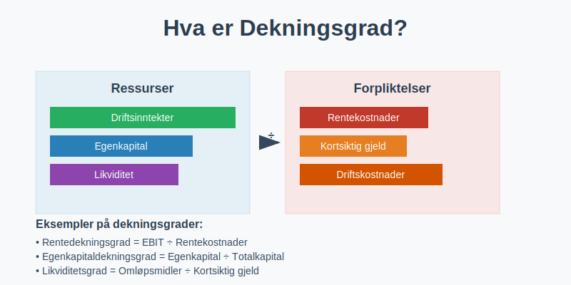
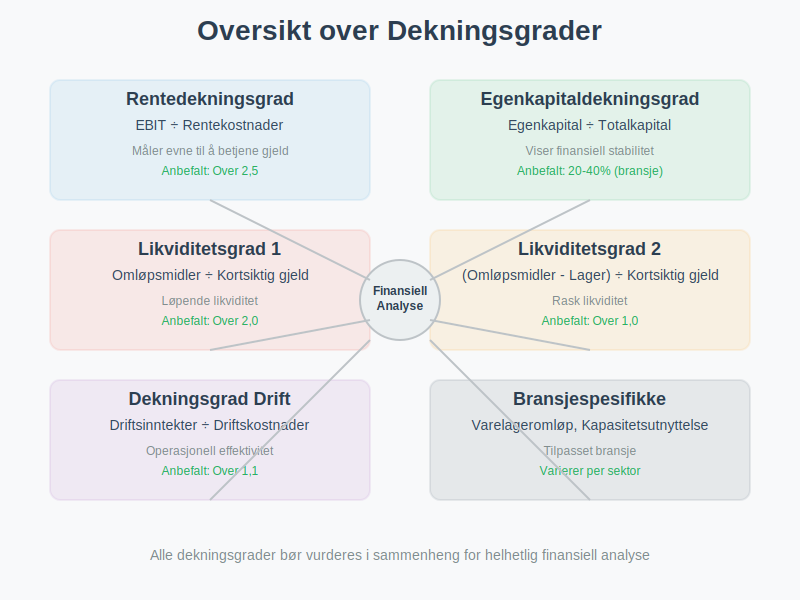
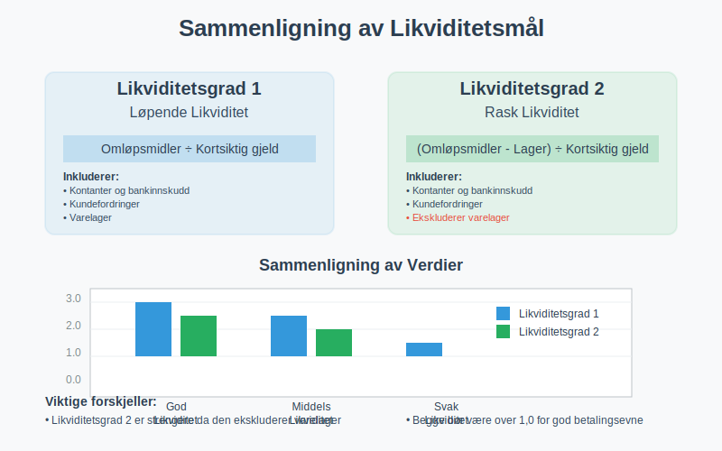
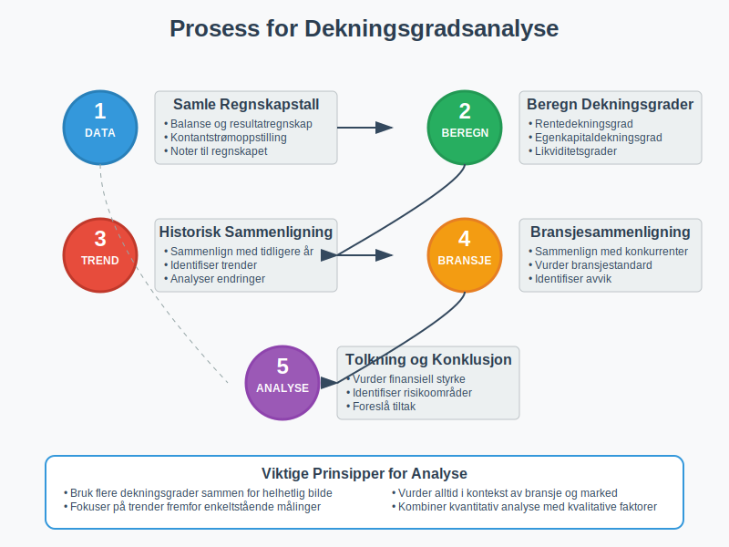
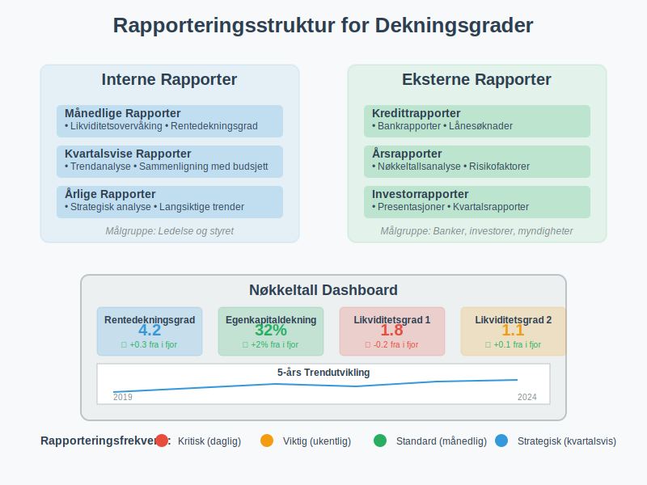
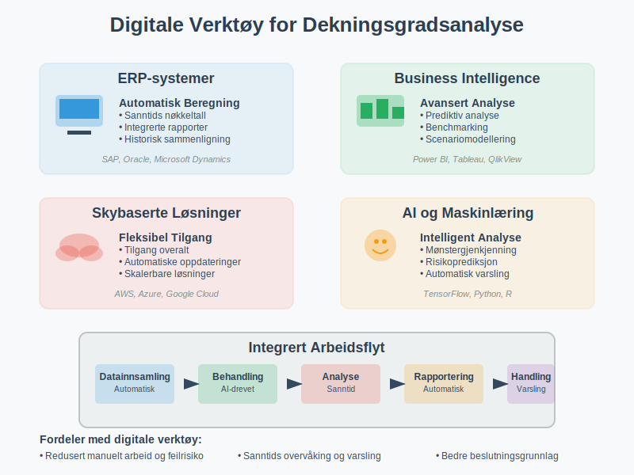

---
title: "Hva er dekningsgrad?"
seoTitle: "Hva er dekningsgrad?"
meta_description: '**Dekningsgrad** er et viktig finansielt nøkkeltall som måler en bedrifts evne til å dekke sine forpliktelser og kostnader. Dette begrepet omfatter flere uli...'
slug: hva-er-dekningsgrad
type: blog
layout: pages/single
---

**Dekningsgrad** er et viktig finansielt nøkkeltall som måler en bedrifts evne til å dekke sine forpliktelser og kostnader. Dette begrepet omfatter flere ulike typer dekningsgrader som hver gir innsikt i forskjellige aspekter av bedriftens [finansielle styrke](/blogs/regnskap/hva-er-betalingsevne "Hva er Betalingsevne? Guide til Likviditet og Finansiell Stabilitet") og [soliditet](/blogs/regnskap/hva-er-balanse "Hva er Balanse? Komplett Guide til Balanseregnskap").



## Hva er Dekningsgrad?

**Dekningsgrad** er en samlebetegnelse for finansielle nøkkeltall som måler hvor godt en bedrift kan dekke sine forpliktelser med tilgjengelige ressurser. Disse nøkkeltallene er essensielle for:

* **Kredittvurdering** og låneopptak
* **Investeringsbeslutninger** og risikovurdering
* **Finansiell planlegging** og [budsjettering](/blogs/regnskap/hva-er-budsjettering "Hva er Budsjettering? Komplett Guide til Budsjettplanlegging")
* **Sammenligning** med konkurrenter og bransjestandard
* **Overvåking** av finansiell utvikling over tid

### Grunnleggende Prinsipper

Dekningsgrader bygger på **forholdet mellom ressurser og forpliktelser**:

- **Høy dekningsgrad** indikerer god finansiell styrke
- **Lav dekningsgrad** kan signalisere finansiell risiko
- **Trendanalyse** er viktigere enn enkeltstående målinger
- **Bransjesammenligning** gir kontekst for tolkning

## Typer Dekningsgrader

Det finnes flere viktige typer dekningsgrader, hver med sitt spesifikke formål og beregningsmetode.



### Rentedekningsgrad

**Rentedekningsgrad** måler bedriftens evne til å betale rentekostnader med driftsresultatet.

#### Formel for Rentedekningsgrad:
```
Rentedekningsgrad = Driftsresultat før renter og skatt (EBIT) ÷ Rentekostnader
```

#### Tolkning av Rentedekningsgrad:

| Rentedekningsgrad | Vurdering | Betydning |
|-------------------|-----------|-----------|
| **Over 5,0** | Meget god | Svært lav finansiell risiko |
| **2,5 - 5,0** | God | Akseptabel finansiell risiko |
| **1,5 - 2,5** | Middels | Moderat finansiell risiko |
| **1,0 - 1,5** | Svak | Høy finansiell risiko |
| **Under 1,0** | Kritisk | Kan ikke dekke rentekostnader |

#### Eksempel: Rentedekningsgrad
En bedrift har følgende tall fra [resultatregnskapet](/blogs/regnskap/hva-er-regnskap "Hva er Regnskap? En komplett guide"):

- **Driftsresultat (EBIT):** 2.500.000 kr
- **Rentekostnader:** 500.000 kr

**Beregning:**
Rentedekningsgrad = 2.500.000 ÷ 500.000 = **5,0**

Dette indikerer at bedriften har god evne til å dekke sine rentekostnader.

### Egenkapitaldekningsgrad

**Egenkapitaldekningsgrad** måler hvor stor andel av [totalkapitalen](/blogs/regnskap/totalkapital "Totalkapital “ Sum av egenkapital og gjeld i regnskapet") som er finansiert med [egenkapital](/blogs/regnskap/hva-er-aksjekapital "Hva er Aksjekapital? Guide til Grunnkapital i Aksjeselskap").

#### Formel for Egenkapitaldekningsgrad:
```
Egenkapitaldekningsgrad = Egenkapital ÷ Totalkapital × 100%
```

#### Bransjestandarder for Egenkapitaldekningsgrad:

| Bransje | Anbefalt minimum | Kommentar |
|---------|------------------|-----------|
| **Handel** | 20-30% | Lavere kapitalkrav |
| **Industri** | 30-40% | Moderate kapitalkrav |
| **Eiendom** | 25-35% | Avhenger av finansieringsstruktur |
| **Teknologi** | 40-60% | Høyere risiko krever mer egenkapital |
| **Bank/Finans** | 8-12% | Regulerte krav |

### Likviditetsdekning

**Likviditetsdekning** måler bedriftens evne til å dekke kortsiktige forpliktelser.



#### Likviditetsgrad 1 (Løpende likviditet):
```
Likviditetsgrad 1 = Omløpsmidler ÷ Kortsiktig gjeld
```

#### Likviditetsgrad 2 (Rask likviditet):
```
Likviditetsgrad 2 = (Omløpsmidler - Varelager) ÷ Kortsiktig gjeld
```

#### Tolkning av Likviditetsgrader:

| Nøkkeltall | Anbefalt verdi | Betydning |
|------------|----------------|-----------|
| **Likviditetsgrad 1** | Over 2,0 | God betalingsevne |
| **Likviditetsgrad 2** | Over 1,0 | God likviditet uten varelager |

### Dekningsgrad for Driftskostnader

**Dekningsgrad for driftskostnader** måler hvor godt inntektene dekker de løpende kostnadene.

#### Formel:
```
Dekningsgrad driftskostnader = Driftsinntekter ÷ Driftskostnader
```

#### Eksempel: Dekningsgrad Driftskostnader
En bedrift har:
- **Driftsinntekter:** 10.000.000 kr
- **Driftskostnader:** 8.500.000 kr

**Beregning:**
Dekningsgrad = 10.000.000 ÷ 8.500.000 = **1,18**

Dette betyr at inntektene dekker driftskostnadene med 18% margin.

## Beregning og Analyse

### Datakilder for Beregning

Dekningsgrader beregnes basert på tall fra:

* **[Balansen](/blogs/regnskap/hva-er-balanseregnskap "Hva er Balanseregnskap? Guide til Oppstilling og Analyse")** - for kapitalstruktur og eiendeler
* **[Resultatregnskapet](/blogs/regnskap/hva-er-regnskap "Hva er Regnskap? En komplett guide")** - for inntekter og kostnader
* **Kontantstrømoppstilling** - for likviditetsanalyse
* **Noter til regnskapet** - for detaljert informasjon

### Praktisk Fremgangsmåte

1. **Samle relevante regnskapstall**
2. **Beregn aktuelle dekningsgrader**
3. **Sammenlign med tidligere perioder**
4. **Vurder mot bransjestandard**
5. **Analyser trender og utvikling**



### Faktorer som Påvirker Dekningsgrader

#### Positive Faktorer:
* **Økte inntekter** fra kjernevirksomhet
* **Kostnadsreduksjoner** og effektivisering
* **Forbedret [arbeidskapital](/blogs/regnskap/hva-er-arbeidskapital "Hva er Arbeidskapital? Guide til Beregning og Optimalisering")**
* **Redusert gjeldsbelastning**
* **Økt egenkapitalandel**

#### Negative Faktorer:
* **Fallende omsetning** eller marginer
* **Økte rentekostnader**
* **Høyere driftskostnader**
* **Økt gjeldsgrad**
* **Dårlig likviditetsstyring**

## Bransjespesifikke Dekningsgrader

### Detaljhandel

Detaljhandel har spesielle dekningsgrader:

* **Varelageromløp** = Varekostnad ÷ Gjennomsnittlig varelager
* **Bruttomargindekning** = Bruttofortjeneste ÷ Driftskostnader
* **Husleiedekning** = Driftsinntekter ÷ Husleiekostnader

### Industri

Industriselskaper fokuserer på:

* **Kapasitetsutnyttelse** = Faktisk produksjon ÷ Maksimal kapasitet
* **Dekningsgrad faste kostnader** = Dekningsbidrag ÷ Faste kostnader
* **Investeringsdekning** = Kontantstrøm fra drift ÷ Investeringer

### Eiendom

Eiendomsselskaper bruker:

* **Leieinntektsdekning** = Leieinntekter ÷ Finanskostnader
* **Belåningsgrad** = Gjeld ÷ Markedsverdi eiendommer
* **Driftsmargindekning** = Netto driftsinntekter ÷ Driftskostnader

## Regnskapsføring og Rapportering

### Regnskapsføring av Dekningsgrader

Dekningsgrader er **ikke regnskapsførte poster**, men **beregnede nøkkeltall** basert på regnskapsdata:

```
Ikke regnskapsført bilag - kun beregning og analyse
```

### Rapportering til Interessenter

#### Interne Rapporter:
* **Månedlige** dekningsgradsanalyser
* **Kvartalsvis** trendrapportering
* **Årlig** strategisk analyse

#### Eksterne Rapporter:
* **Årsrapport** med nøkkeltallsanalyse
* **Kredittrapporter** til banker
* **Investorpresentasjoner**



## Forbedring av Dekningsgrader

### Strategier for Bedre Rentedekningsgrad

1. **Øk driftsinntektene:**
   - Øk salgsvolum eller priser
   - Utvid til nye markeder
   - Forbedre produktmiks

2. **Reduser driftskostnadene:**
   - Effektiviser driften
   - Automatiser prosesser
   - Forhandle bedre leverandøravtaler

3. **Optimaliser finansieringsstrukturen:**
   - Refinansier dyr gjeld
   - Øk egenkapitalandelen
   - Bruk [avtalegiro](/blogs/regnskap/hva-er-avtalegiro "Hva er AvtaleGiro? Guide til Automatisk Betaling") for bedre kontantstrøm

### Forbedring av Likviditetsdekning

#### Kortsiktige Tiltak:
* **Raskere innkreving** av kundefordringer
* **Forhandling** om lengre betalingsfrister med leverandører
* **Reduksjon** av varelager
* **Etablering** av kredittlinjer

#### Langsiktige Tiltak:
* **Forbedret [budsjettplanlegging](/blogs/regnskap/hva-er-budsjettering "Hva er Budsjettering? Komplett Guide til Budsjettplanlegging")**
* **Diversifisering** av inntektskilder
* **Investering** i mer effektive systemer
* **Oppbygging** av finansielle reserver

## Dekningsgrader i Kredittvurdering

### Bankenes Vurderingskriterier

Banker vurderer dekningsgrader som del av **kredittvurderingen**:

| Dekningsgrad | Vekt i vurdering | Kritiske verdier |
|--------------|------------------|------------------|
| **Rentedekningsgrad** | Høy | Under 1,5 |
| **Egenkapitaldekningsgrad** | Høy | Under 20% |
| **Likviditetsgrad 1** | Middels | Under 1,2 |
| **Likviditetsgrad 2** | Middels | Under 0,8 |

### Påvirkning på Lånevilkår

#### Gode Dekningsgrader:
* **Lavere rente** på lån
* **Høyere låneramme**
* **Færre sikkerhetskrav**
* **Mer fleksible vilkår**

#### Svake Dekningsgrader:
* **Høyere rente** og gebyrer
* **Strengere sikkerhetskrav**
* **Lavere låneramme**
* **Hyppigere oppfølging**

## Internasjonale Standarder

### IFRS og Dekningsgrader

Under **IFRS** (International Financial Reporting Standards) er det spesielle krav til:

* **Konsistente beregningsmetoder**
* **Sammenlignbare presentasjoner**
* **Tilstrekkelig noteopplysninger**
* **Sensitivitetsanalyser**

### Sammenligning med Internasjonale Selskaper

Ved sammenligning med utenlandske selskaper må man vurdere:

* **Ulike regnskapsstandarder** (IFRS vs US GAAP vs lokale standarder)
* **Valutaeffekter** og omregning
* **Bransjeforskjeller** mellom land
* **Skattemessige forskjeller**

## Digitale Verktøy og Automatisering

### Regnskapssystemer med Nøkkeltallsberegning

Moderne [regnskapssystemer](/blogs/regnskap/hva-er-regnskap "Hva er Regnskap? En komplett guide") tilbyr automatisk beregning av dekningsgrader:

* **Sanntidsberegning** basert på løpende regnskapsdata
* **Trendanalyse** og historisk sammenligning
* **Varsling** ved kritiske verdier
* **Automatisk rapportering** til ledelse og eiere

### Business Intelligence og Analyse

#### Avanserte Analyseverktøy:
* **Dashboard** med sanntids nøkkeltall
* **Prediktiv analyse** for fremtidige dekningsgrader
* **Benchmarking** mot bransjen
* **Scenarioanalyse** for ulike utviklingsalternativer



## Vanlige Feil og Fallgruver

### Beregningsfeil

#### Typiske Feil:
* **Feil tidsperiode** - blanding av årstall eller perioder
* **Inkonsistente definisjoner** - ulike beregningsmetoder over tid
* **Manglende justeringer** - ekstraordinære poster ikke eliminert
* **Feil datakilder** - bruk av foreløpige vs endelige regnskapstall

### Tolkningsfeil

#### Vanlige Misforståelser:
* **Isolert vurdering** - ikke sammenligning med bransje eller historie
* **Overforenkling** - ikke hensyn til spesielle omstendigheter
* **Kortsiktig fokus** - ikke vurdering av langsiktige trender
* **Manglende kontekst** - ikke hensyn til konjunkturer eller markedsforhold

## Dekningsgrader og Risikostyring

### Finansiell Risikostyring

Dekningsgrader er sentrale i **finansiell risikostyring**:

#### Risikoidentifikasjon:
* **Likviditetsrisiko** - lav likviditetsdekning
* **Kredittrisiko** - svak rentedekningsgrad
* **Operasjonell risiko** - lav dekningsgrad for driftskostnader
* **Markedsrisiko** - volatilitet i dekningsgrader

#### Risikotiltak:
* **Etablering av finansielle buffere**
* **Diversifisering av finansieringskilder**
* **Implementering av [avstemmingsrutiner](/blogs/regnskap/hva-er-avstemming "Hva er Avstemming? Guide til Regnskapskontroll og Kvalitetssikring")**
* **Regelmessig overvåking og rapportering**

### Compliance og Regulatoriske Krav

#### Lovpålagte Krav:
* **[Aksjeloven](/blogs/regnskap/hva-er-aksjeloven "Hva er Aksjeloven? Guide til Norsk Selskapsrett")** - krav til soliditet
* **Regnskapsloven** - krav til noteopplysninger
* **Skatteloven** - dokumentasjon av finansiell stilling
* **Bransjespesifikke reguleringer**

## Fremtidige Trender

### Teknologisk Utvikling

#### Nye Muligheter:
* **Kunstig intelligens** for prediktiv analyse
* **Maskinlæring** for mønstergjenkjenning
* **Blockchain** for transparent rapportering
* **IoT-sensorer** for sanntidsdata

### Regulatoriske Endringer

#### Forventede Utviklinger:
* **Økt fokus på bærekraft** - ESG-relaterte dekningsgrader
* **Strengere rapporteringskrav** - mer detaljert analyse
* **Harmonisering** av internasjonale standarder
* **Digitalisering** av regulatorisk rapportering

## Konklusjon

**Dekningsgrader** er essensielle verktøy for å vurdere og overvåke en bedrifts finansielle helse. Ved å forstå og anvende ulike typer dekningsgrader kan bedriftsledere, investorer og kreditorer ta bedre informerte beslutninger.

### Viktige Takeaways:

* **Rentedekningsgrad** måler evnen til å betjene gjeld
* **Egenkapitaldekningsgrad** viser finansiell stabilitet
* **Likviditetsdekning** indikerer kortsiktig betalingsevne
* **Trendanalyse** er viktigere enn enkeltstående målinger
* **Bransjesammenligning** gir nødvendig kontekst
* **Regelmessig overvåking** er kritisk for finansiell styring

Gjennom systematisk bruk av dekningsgradsanalyse kan bedrifter identifisere risikoområder tidlig, optimalisere sin finansielle struktur og sikre langsiktig bærekraft i sin virksomhet.


