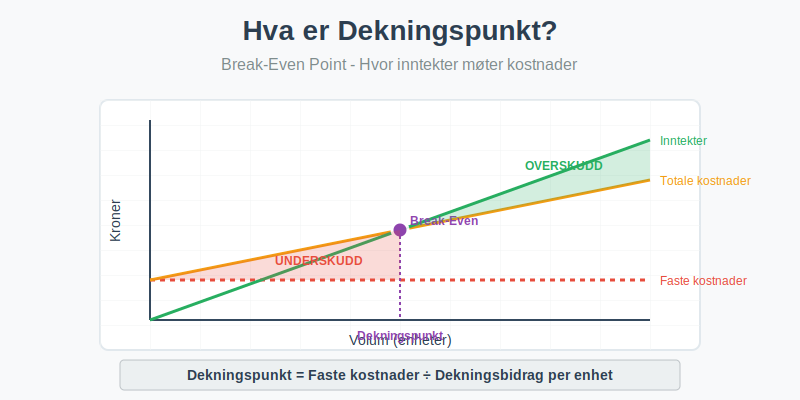
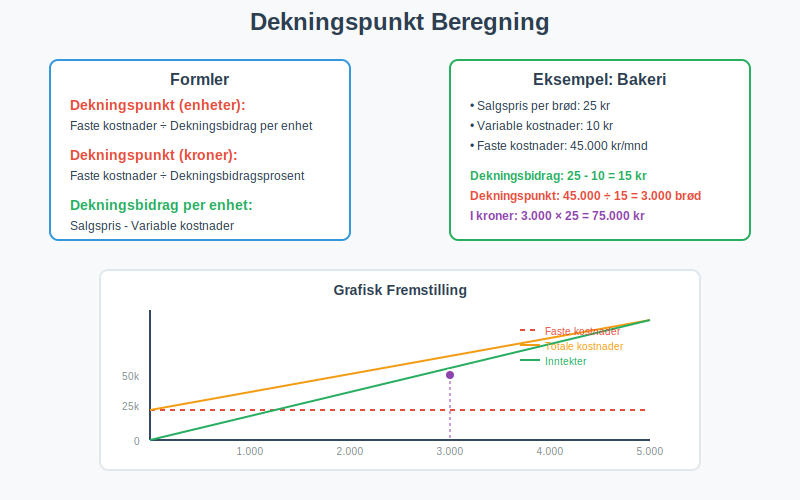
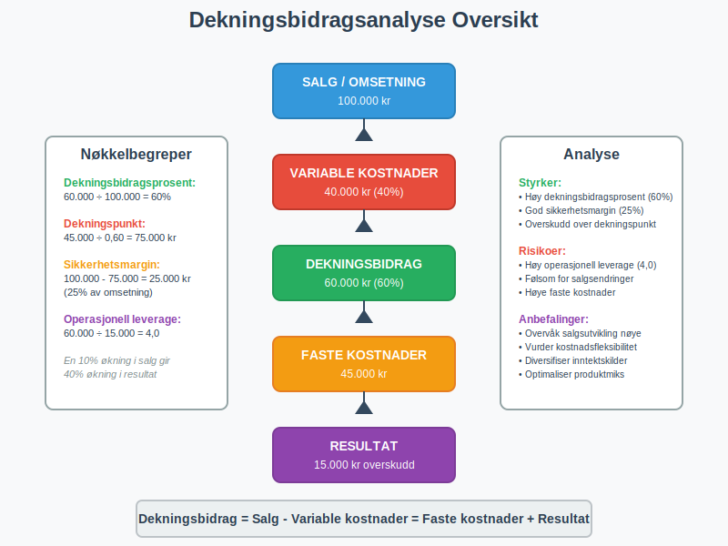

---
title: "Hva er dekningspunkt?"
meta_title: "Hva er dekningspunkt?"
meta_description: '**Dekningspunkt** (også kalt break-even point) er det punktet hvor en bedrifts totale inntekter er lik totale kostnader, og bedriften verken går med overskudd...'
slug: hva-er-dekningspunkt
type: blog
layout: pages/single
---

**Dekningspunkt** (også kalt break-even point) er det punktet hvor en bedrifts totale inntekter er lik totale kostnader, og bedriften verken går med overskudd eller underskudd. Dette er et kritisk verktøy for [budsjettering](/blogs/regnskap/hva-er-budsjettering "Hva er Budsjettering? Komplett Guide til Budsjettplanlegging") og **lønnsomhetsanalyse** som hjelper bedrifter å forstå hvor mye de må selge for å dekke alle kostnadene sine.



## Hva er Dekningspunkt?

Dekningspunkt representerer det **kritiske volumet** hvor en bedrift begynner å gå i balanse. På dette punktet er:

* **Totale inntekter** = **Totale kostnader**
* **Resultat** = 0 (verken overskudd eller tap)
* **Dekningsbidrag** = **Faste kostnader**

### Grunnleggende Komponenter

For å forstå dekningspunkt må vi først forstå de grunnleggende komponentene:

**Faste kostnader:**
- Kostnader som ikke endres med produksjonsvolum
- Eksempler: husleie, forsikring, faste lønn, [avskrivninger](/blogs/regnskap/hva-er-avskrivning "Hva er Avskrivning? Komplett Guide til Avskrivningsmetoder")

**Variable kostnader:**
- Kostnader som endres proporsjonalt med produksjonsvolum
- Eksempler: råvarer, provisjoner, frakt

**Dekningsbidrag:**
- Salgspris per enhet minus variable kostnader per enhet
- Bidrar til å dekke faste kostnader og generere overskudd

## Beregning av Dekningspunkt

Det finnes flere metoder for å beregne dekningspunkt, avhengig av om du ønsker resultatet i enheter eller kroner.



### Dekningspunkt i Enheter

**Formel:**
```
Dekningspunkt (enheter) = Faste kostnader ÷ Dekningsbidrag per enhet
```

**Hvor:**
- Dekningsbidrag per enhet = Salgspris per enhet - Variable kostnader per enhet

### Dekningspunkt i Kroner

**Formel:**
```
Dekningspunkt (kroner) = Faste kostnader ÷ Dekningsbidragsprosent
```

**Hvor:**
- Dekningsbidragsprosent = (Dekningsbidrag per enhet ÷ Salgspris per enhet) × 100

### Praktisk Eksempel: Bakeri

La oss se på et praktisk eksempel med et bakeri som selger brød:

**Gitte data:**
- Salgspris per brød: 25 kr
- Variable kostnader per brød: 10 kr (mel, gjær, strøm)
- Faste kostnader per måned: 45.000 kr (husleie, lønn, forsikring)

**Beregning:**

| Komponent | Beregning | Resultat |
|-----------|-----------|----------|
| Dekningsbidrag per enhet | 25 - 10 | 15 kr |
| Dekningsbidragsprosent | (15 ÷ 25) × 100 | 60% |
| Dekningspunkt (enheter) | 45.000 ÷ 15 | 3.000 brød |
| Dekningspunkt (kroner) | 45.000 ÷ 0,60 | 75.000 kr |

**Tolkning:**
Bakeriet må selge **3.000 brød** eller oppnå **75.000 kr** i omsetning hver måned for å gå i balanse.

For en mer omfattende analyse av [nullpunktsomsetning](/blogs/regnskap/hva-er-nullpunktsomsetning "Hva er Nullpunktsomsetning (Break-Even Omsetning)?"), se vår spesialiserte guide som dekker beregningsmetoder, optimalisering og strategier for å oppnå kritisk omsetningsnivå.

## Dekningsbidragsanalyse

**Dekningsbidragsanalyse** er en utvidet versjon av dekningspunkt-analysen som gir dypere innsikt i lønnsomhet.



### Dekningsbidrag i Prosent

Dekningsbidragsprosenten viser hvor mye av hver salgskrone som bidrar til å dekke faste kostnader:

```
Dekningsbidragsprosent = (Dekningsbidrag ÷ Omsetning) × 100
```

### Sikkerhetsmargin

**Sikkerhetsmargin** viser hvor mye salget kan falle før bedriften går med tap:

```
Sikkerhetsmargin = Faktisk salg - Dekningspunkt
Sikkerhetsmargin (%) = (Sikkerhetsmargin ÷ Faktisk salg) × 100
```

### Operasjonell Leverage

**Operasjonell leverage** måler hvor følsom bedriften er for endringer i salgsvolum:

```
Operasjonell leverage = Dekningsbidrag ÷ Resultat før renter og skatt
```

## Anvendelse av Dekningspunkt

Dekningspunkt-analyse har mange praktiske anvendelser i bedriftsstyring:

### 1. Prissetting

Dekningspunkt hjelper med å sette **riktige priser** ved å vise:
- Minimum pris for å dekke kostnader
- Effekt av prisendringer på lønnsomhet
- Konkurransedyktige prisnivåer

### 2. Kapasitetsplanlegging

Ved å analysere dekningspunkt kan bedrifter:
- Planlegge **produksjonskapasitet**
- Vurdere investeringer i nytt utstyr
- Optimalisere ressursbruk

### 3. Produktmiks-beslutninger

For bedrifter med flere produkter:
- Identifisere mest lønnsomme produkter
- Allokere ressurser effektivt
- Eliminere ulønnsomme produktlinjer

### 4. Budsjett og Prognoser

Dekningspunkt er essensielt for:
- [Budsjettering](/blogs/regnskap/hva-er-budsjettering "Hva er Budsjettering? Komplett Guide til Budsjettplanlegging") og finansiell planlegging
- Scenarioanalyser (best case, worst case)
- MÃ¥ling av finansiell ytelse

## Begrensninger ved Dekningspunkt-analyse

Selv om dekningspunkt-analyse er et kraftig verktøy, har det visse begrensninger:

### Forutsetninger

Analysen bygger på flere forutsetninger som ikke alltid holder i praksis:

* **Lineære kostnader:** Variable kostnader er konstante per enhet
* **Konstant produktmiks:** For bedrifter med flere produkter
* **Stabil markedssituasjon:** Priser og kostnader endres ikke
* **Perfekt salg:** Alt som produseres blir solgt

### Kortsiktig Perspektiv

Dekningspunkt-analyse er primært et **kortsiktig verktøy** og tar ikke hensyn til:
- Langsiktige strategiske endringer
- Markedsutvikling og konkurranse
- Teknologiske fremskritt
- Endringer i kostnadsstruktur

## Avanserte Dekningspunkt-konsepter

### Multippel Dekningspunkt

For bedrifter med **flere produkter** må dekningspunkt beregnes for hele produktporteføljen:

```
Vektet gjennomsnittlig dekningsbidragsprosent = 
Σ (Produktets andel av omsetning × Produktets dekningsbidragsprosent)
```

### Dekningspunkt med MÃ¥lresultat

For å beregne salgsvolum som kreves for et spesifikt overskudd:

```
Nødvendig salgsvolum = (Faste kostnader + Ønsket overskudd) ÷ Dekningsbidrag per enhet
```

### Sensitivitetsanalyse

**Sensitivitetsanalyse** viser hvordan endringer i nøkkelfaktorer påvirker dekningspunkt:

| Endring | Effekt på dekningspunkt |
|---------|------------------------|
| Økt salgspris | Lavere dekningspunkt |
| Økte variable kostnader | Høyere dekningspunkt |
| Økte faste kostnader | Høyere dekningspunkt |
| Økt salgsvolum | Ingen direkte effekt på dekningspunkt |

## Dekningspunkt i Ulike Bransjer

### Tjenestebedrifter

For **tjenestebedrifter** som konsulentfirmaer:
- Variable kostnader er ofte lave
- Høy dekningsbidragsprosent
- Fokus på kapasitetsutnyttelse

### Produksjonsbedrifter

For **produksjonsbedrifter**:

- Høyere variable kostnader (råvarer)
- Kompleks kostnadsstruktur
- Behov for detaljert kostnadsanalyse

### Handelsbedrifter

For **handelsbedrifter**:

- Variable kostnader = innkjøpspris
- Dekningsbidrag = bruttofortjeneste
- Fokus på omsetningshastighet

## Digitale Verktøy for Dekningspunkt-analyse

Moderne [regnskapssystemer](/blogs/regnskap/hva-er-regnskap "Hva er Regnskap? En komplett guide") tilbyr ofte innebygde verktøy for dekningspunkt-analyse:

### Regnskapsprogrammer

Mange regnskapsprogrammer inkluderer:
- Automatisk beregning av dekningspunkt
- Grafisk fremstilling av break-even analyse
- Scenariomodellering
- Rapportering og dashboards

### Excel-modeller

**Excel-baserte modeller** er populære for:
- Fleksibel modellering
- Sensitivitetsanalyse
- Grafisk presentasjon
- Integrasjon med andre systemer

## Rapportering og Oppfølging

### Månedlig Oppfølging

For effektiv bruk av dekningspunkt-analyse bør bedrifter:

* **Oppdatere beregninger** månedlig
* **Sammenligne faktisk** med budsjettert dekningspunkt
* **Analysere avvik** og identifisere årsaker
* **Justere prognoser** basert på nye data

### Nøkkeltall (KPI)

Viktige nøkkeltall relatert til dekningspunkt:

| Nøkkeltall | Formel | Betydning |
|------------|--------|-----------|
| Dekningsbidragsprosent | (Dekningsbidrag ÷ Omsetning) × 100 | Lønnsomhet per salgskrone |
| Sikkerhetsmargin | Faktisk salg - Dekningspunkt | Buffer mot tap |
| Kapasitetsutnyttelse | (Faktisk produksjon ÷ Maksimal kapasitet) × 100 | Effektivitet |

## Strategiske Implikasjoner

### Kostnadsstruktur-optimalisering

Dekningspunkt-analyse kan guide strategiske beslutninger om:

**Outsourcing vs. Internalisering:**
- Konvertere faste kostnader til variable
- Redusere finansiell risiko
- Øke fleksibilitet

**Automatisering:**
- Øke faste kostnader (investeringer)
- Redusere variable kostnader (arbeidskraft)
- PÃ¥virke dekningspunkt og risikoprofil

### Vekststrategier

Ved vekst må bedrifter vurdere:
- **Skalering av faste kostnader**
- **Endringer i kostnadsstruktur**
- **Nye dekningspunkt** for utvidede operasjoner

## Sammenheng med Andre Regnskapskonsepter

Dekningspunkt-analyse er tett knyttet til flere andre regnskapskonsepter:

### Kostnadsregnskap

- [Kostnadsfordeling](/blogs/regnskap/hva-er-kostnadsfordeling "Kostnadsfordeling - Metoder og Prinsipper") mellom faste og variable kostnader
- Aktivitetsbasert kostnadsberegning (ABC)
- Standardkostnader vs. faktiske kostnader

### Budsjett og Prognoser

- [Budsjettering](/blogs/regnskap/hva-er-budsjettering "Hva er Budsjettering? Komplett Guide til Budsjettplanlegging") basert på dekningspunkt-analyse
- Rullende prognoser
- Scenarioplanlegging

### Finansiell Analyse

- [Lønnsomhetsanalyse](/blogs/regnskap/hva-er-loennsomhetsanalyse "Lønnsomhetsanalyse - Nøkkeltall og Metoder")
- [Likviditetsanalyse](/blogs/regnskap/hva-er-likviditetsanalyse "Likviditetsanalyse - Betalingsevne og Finansiell Stabilitet")
- Investeringsanalyse

## Praktiske Tips for Implementering

### 1. Datainnsamling

For nøyaktig dekningspunkt-analyse:
- **Klassifiser kostnader** korrekt (faste vs. variable)
- **Samle historiske data** for trendanalyse
- **Oppdater regelmessig** for å reflektere endringer

### 2. Systemintegrasjon

- Integrer med [regnskapssystem](/blogs/regnskap/hva-er-regnskap "Hva er Regnskap? En komplett guide")
- Automatiser datainnsamling
- Lag standardiserte rapporter

### 3. Organisatorisk Forankring

- **Tren personalet** i dekningspunkt-konsepter
- **Etabler rutiner** for regelmessig analyse
- **Kommuniser resultater** til relevante beslutningstakere

## Konklusjon

**Dekningspunkt** er et fundamentalt verktøy for bedriftsstyring som gir kritisk innsikt i lønnsomhet og finansiell risiko. Ved å forstå og anvende dekningspunkt-analyse kan bedrifter:

* **Optimalisere prissetting** og produktmiks
* **Planlegge kapasitet** og investeringer
* **Redusere finansiell risiko** gjennom bedre forståelse av kostnadsstruktur
* **Forbedre beslutningsgrunnlag** for strategiske valg

For å få maksimal nytte av dekningspunkt-analyse er det viktig å:
- Holde data oppdatert og nøyaktig
- Forstå begrensningene ved analysen
- Kombinere med andre finansielle verktøy
- Tilpasse analysen til bedriftens spesifikke situasjon

Dekningspunkt-analyse bør være en integrert del av enhver bedrifts finansielle planlegging og oppfølging, sammen med andre viktige regnskapskonsepter som [budsjettering](/blogs/regnskap/hva-er-budsjettering "Hva er Budsjettering? Komplett Guide til Budsjettplanlegging"), [kostnadsanalyse](/blogs/regnskap/hva-er-kostnadsanalyse "Kostnadsanalyse - Metoder og Praktisk Anvendelse") og [lønnsomhetsmåling](/blogs/regnskap/hva-er-loennsomhetsanalyse "Lønnsomhetsanalyse - Nøkkeltall og Metoder").


