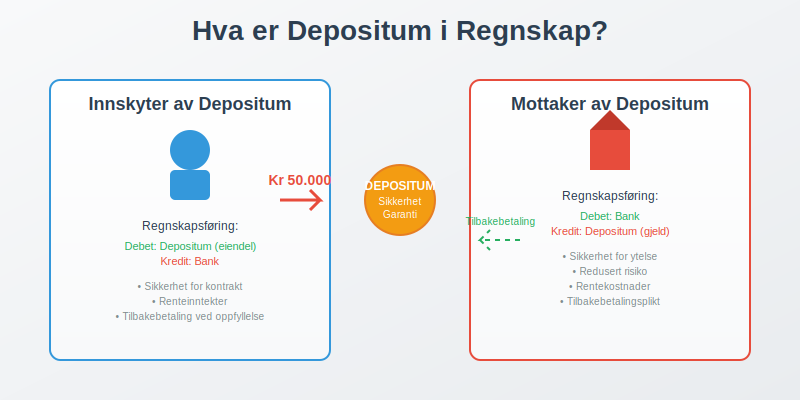
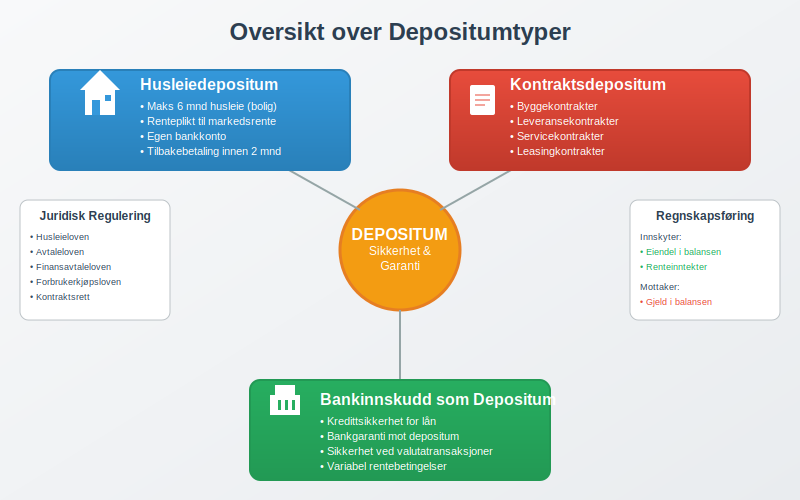
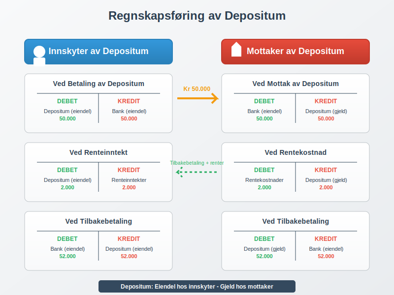

---
title: "Hva er Depositum i Regnskap?"
seoTitle: "Hva er Depositum i Regnskap?"
description: '**Depositum** er et pengebeløp som stilles som **sikkerhet** eller **garanti** for oppfyllelse av kontraktuelle forpliktelser. I [regnskapet](/blogs/regnskap/h...'
---

**Depositum** er et pengebeløp som stilles som **sikkerhet** eller **garanti** for oppfyllelse av kontraktuelle forpliktelser. I [regnskapet](/blogs/regnskap/hva-er-regnskap "Hva er Regnskap? En komplett guide") regnskapsføres depositum som [eiendel](/blogs/regnskap/hva-er-aktiva "Hva er Aktiva? Komplett Guide til Eiendeler i Balansen") hos den som betaler og som gjeld hos den som mottar beløpet.



## Hva er Depositum?

Depositum er en **økonomisk sikkerhet** som stilles for å garantere at kontraktuelle forpliktelser blir oppfylt. Beløpet skal i utgangspunktet **tilbakebetales** når kontrakten avsluttes og alle forpliktelser er oppfylt.

### Hovedformål med Depositum

* **Sikkerhet for utleier:** Dekker potensielle skader eller manglende betaling
* **Kontraktsgaranti:** Sikrer at avtalevilkår overholdes
* **Risikominimering:** Reduserer økonomisk risiko for den som mottar depositum
* **Tillitsbyggende:** Viser seriøsitet fra den som stiller depositum

### Juridiske Aspekter

Depositum reguleres av ulike lover avhengig av type:

- **Husleieloven:** Regulerer depositum ved utleie av bolig
- **Avtaleloven:** Generelle kontraktsregler
- **Finansavtaleloven:** For finansielle tjenester
- **Forbrukerkjøpsloven:** Ved forbrukerkjøp

## Typer Depositum

Det finnes flere typer depositum som brukes i ulike sammenhenger:



### Husleiedepositum

**Husleiedepositum** er den vanligste formen for depositum i Norge. Det stilles som sikkerhet ved leie av bolig eller næringslokaler.

#### Regler for Husleiedepositum:

| Aspekt | Bolig | Næringslokaler |
|--------|-------|----------------|
| **Maksimal størrelse** | 6 måneder husleie | Ingen begrensning |
| **Renteplikt** | Ja, til markedsrente | Avtales |
| **Oppbevaring** | Egen konto | Avtales |
| **Tilbakebetaling** | Innen 2 måneder | Avtales |

### Kontraktsdepositum

Stilles som sikkerhet for oppfyllelse av ulike typer kontrakter:

* **Byggekontrakter:** Sikkerhet for ferdigstillelse
* **Leveransekontrakter:** Garanti for levering
* **Servicekontrakter:** Sikkerhet for tjenesteutførelse
* **[Leasing](/blogs/regnskap/leasing "Leasing i regnskap - Komplett guide til leasing i norsk regnskap")**: Sikkerhet ved leasing av utstyr

### Bankinnskudd som Depositum

[Bankinnskudd](/blogs/regnskap/hva-er-bankinnskudd "Hva er Bankinnskudd? Typer, Renter og Regnskapsføring") kan fungere som depositum ved:

* **Kredittsikkerhet:** Sikkerhet for lån eller kreditt
* **Garantistillelse:** Bankgaranti mot depositum
* **Valutatransaksjoner:** Sikkerhet ved valutahandel

## Regnskapsføring av Depositum

Regnskapsføringen av depositum avhenger av om du **betaler** eller **mottar** depositum.



### For Den Som Betaler Depositum

Depositum regnskapsføres som **eiendel** i [balansen](/blogs/regnskap/hva-er-balanse "Hva er Balanse? Balansens Oppbygging og Betydning"):

#### Regnskapsføring ved Betaling:
```
Debet: Depositum (eiendel)          50.000
Kredit: Bank (eiendel)                     50.000
```

#### Klassifisering i Balansen:
- **Kortsiktige fordringer:** Hvis tilbakebetaling innen 1 år
- **Langsiktige fordringer:** Hvis tilbakebetaling over 1 år

### For Den Som Mottar Depositum

Depositum regnskapsføres som **gjeld** i balansen:

#### Regnskapsføring ved Mottak:
```
Debet: Bank (eiendel)               50.000
Kredit: Depositum (gjeld)                  50.000
```

#### Klassifisering i Balansen:
- **Kortsiktig gjeld:** Hvis tilbakebetaling innen 1 år
- **Langsiktig gjeld:** Hvis tilbakebetaling over 1 år

### Renter på Depositum

Når depositum forrentes, må renteinntekter/-kostnader regnskapsføres:

#### For Innskyter (Mottar Rente):
```
Debet: Depositum (eiendel)           2.000
Kredit: Renteinntekter (inntekt)            2.000
```

#### For Mottaker (Betaler Rente):
```
Debet: Rentekostnader (kostnad)      2.000
Kredit: Depositum (gjeld)                   2.000
```

## Praktiske Eksempler

### Eksempel 1: Husleiedepositum

**Situasjon:** Bedrift AS leier kontorlokaler med månedlig husleie på 25.000 kr. Utleier krever depositum på 3 måneder husleie.

**Beregning:**
- Depositum: 25.000 × 3 = 75.000 kr
- Årlig rente: 3%
- Månedlig rente: 75.000 × 3% ÷ 12 = 187,50 kr

**Regnskapsføring hos leietaker:**

| Måned | Beskrivelse | Debet | Kredit |
|-------|-------------|-------|--------|
| Jan | Betaling av depositum | Depositum 75.000 | Bank 75.000 |
| Jan | Husleie | Husleiekostnad 25.000 | Bank 25.000 |
| Feb | Renteinntekt | Depositum 188 | Renteinntekter 188 |

### Eksempel 2: Kontraktsdepositum

**Situasjon:** Byggefirma stiller depositum på 200.000 kr som sikkerhet for byggekontrakt.

**Regnskapsføring:**

#### Ved Stilling av Depositum:
```
Debet: Depositum - byggekontrakt    200.000
Kredit: Bank                               200.000
```

#### Ved Kontraktens Fullførelse:
```
Debet: Bank                         200.000
Kredit: Depositum - byggekontrakt          200.000
```

## Skattemessige Konsekvenser

### For Innskyter av Depositum

* **Ingen skattemessig fradrag** ved innbetaling av depositum
* **Renteinntekter** på depositum er **skattepliktige**
* **Tap på depositum** kan være **fradragsberettiget** hvis det er driftsmessig begrunnet

### For Mottaker av Depositum

* **Ikke skattepliktig inntekt** ved mottak av depositum
* **Rentekostnader** på depositum er **fradragsberettigede**
* **Beholdt depositum** kan være **skattepliktig** avhengig av årsak

### Mva-behandling

Depositum har normalt **ingen mva-konsekvenser** ved inn- og utbetaling, men:

* **Beholdt depositum** kan utløse mva-plikt
* **Depositum for varer/tjenester** kan ha mva-konsekvenser
* **Konsulter mva-reglene** for spesifikke situasjoner

## Depositum vs. Andre Sikkerheter

### Sammenligning med Andre Sikkerhetsinstrumenter

| Type | Likviditet | Risiko | Kostnad | Fleksibilitet |
|------|------------|--------|---------|---------------|
| **Depositum** | Lav | Lav | Lav | Middels |
| **[Bankgaranti](/blogs/regnskap/bankgaranti "Hva er Bankgaranti? En komplett guide til bankgarantier i Norge")** | Høy | Lav | Middels | Høy |
| **Kausjon** | Høy | Høy | Lav | Høy |
| **Pant** | Variabel | Middels | Lav | Lav |

### Fordeler med Depositum

* **Enkel administrasjon:** Lett å håndtere regnskapsmessig
* **Lav kostnad:** Ingen gebyrer utover rentekostnad
* **Sikker garanti:** Kontant sikkerhet
* **Fleksibel bruk:** Kan brukes i mange sammenhenger

### Ulemper med Depositum

* **Bundet kapital:** Reduserer likviditet
* **Rentekostnad:** Alternativkostnad ved binding av midler
* **Kredittrisiko:** Risiko for at mottaker ikke kan tilbakebetale
* **Inflasjonrisiko:** Verdifall over tid

## Internkontroll og Rutiner

### Rutiner for Depositum

Etabler gode rutiner for håndtering av depositum:

#### For Utbetalte Depositum:

* **Dokumentasjon:** Oppbevar alle avtaler og [kvitteringer](/blogs/regnskap/kvittering "Hva er Kvittering? En Guide til Kvitteringskrav i Norsk Regnskap")
* **Oppfølging:** Følg opp renteinntekter og tilbakebetalinger
* **Avstemming:** Avstem depositumkonti regelmessig
* **Forsikring:** Vurder forsikring av større depositum

#### For Mottatte Depositum:

* **Egen konto:** Hold depositum på egen bankkonto
* **Renteberegning:** Beregn og utbetal renter korrekt
* **Tilbakebetaling:** Etabler rutiner for rask tilbakebetaling
* **Dokumentasjon:** Dokumenter årsaker til eventuelt beholdt depositum

### Regnskapsrutiner

Implementer gode regnskapsrutiner:

* **Egen konto:** Bruk egne konti for depositum i [kontoplanen](/blogs/regnskap/hva-er-bokforing "Hva er Bokføring? Grunnleggende Prinsipper og Praktisk Gjennomføring")
* **Periodisering:** Periodiser renteinntekter/-kostnader korrekt
* **Noteopplysninger:** Gi tilstrekkelige noteopplysninger i [årsregnskapet](/blogs/regnskap/hva-er-regnskap "Hva er Regnskap? En komplett guide")
* **Avstemming:** Avstem depositumkonti mot bankkonti

## Juridiske Aspekter og Tvister

### Vanlige Tvistespørsmål

* **Tilbakebetaling:** Uenighet om tilbakebetalingsplikt
* **Renteberegning:** Feil renteberegning eller manglende rentebetaling
* **Skader:** Uenighet om skader som skal dekkes av depositum
* **Tidspunkt:** Forsinkelse i tilbakebetaling

### Forebyggende Tiltak

* **Klare avtaler:** Inngå detaljerte avtaler om depositum
* **Dokumentasjon:** Dokumenter tilstand ved overlevering
* **Kommunikasjon:** Oppretthold god kommunikasjon mellom partene
* **Juridisk bistand:** Søk juridisk bistand ved komplekse avtaler

## Digitalisering og Fremtiden

### Moderne Løsninger

* **Digitale plattformer:** Automatisert håndtering av depositum
* **Blockchain:** Sikker og transparent depositumhåndtering
* **Forsikringsløsninger:** Forsikring som alternativ til depositum
* **Automatisering:** Automatisk renteberegning og tilbakebetaling

### Regnskapsmessige Endringer

* **Automatisk [bilagsføring](/blogs/regnskap/hva-er-bilagsforing "Hva er Bilagsføring? Prosess, Regler og Beste Praksis"):** Digitale systemer for regnskapsføring
* **Sanntidsrapportering:** Løpende oppfølging av depositum
* **Integrerte løsninger:** Kobling mellom depositumhåndtering og regnskapssystem

## Konklusjon

Depositum er et viktig sikkerhetsinstrument som krever **korrekt regnskapsføring** og **god administrasjon**. Nøkkelpunktene er:

### Viktige Prinsipper:

* **Regnskapsføring:** Som eiendel hos innskyter, gjeld hos mottaker
* **Klassifisering:** Kort- eller langsiktig avhengig av tilbakebetalingstidspunkt
* **Renter:** Må regnskapsføres løpende
* **Skattemessig behandling:** Følg gjeldende skatteregler

### Beste Praksis:

* **Etabler gode rutiner** for håndtering av depositum
* **Dokumenter alle transaksjoner** grundig
* **Følg opp renteinntekter** og tilbakebetalinger
* **Vurder alternative sikkerhetsinstrumenter** når det er hensiktsmessig

Ved å følge disse prinsippene sikrer du **korrekt regnskapsføring** og **effektiv administrasjon** av depositum i din virksomhet.


