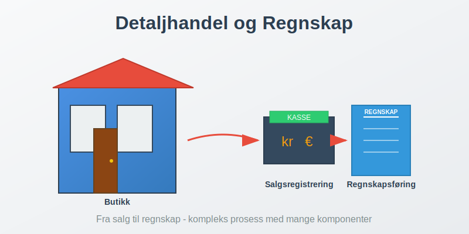
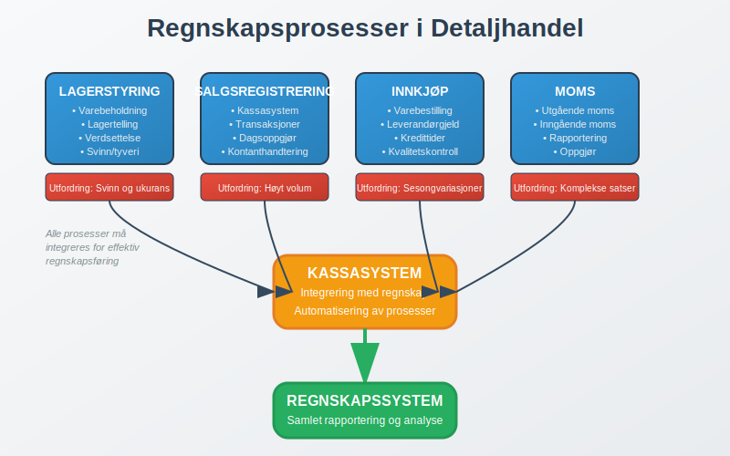
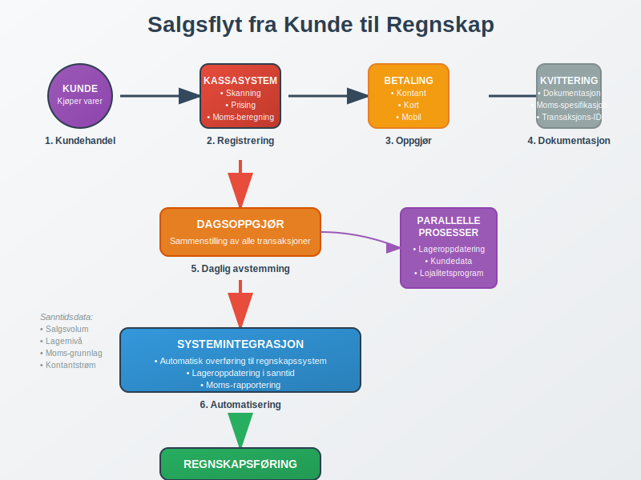
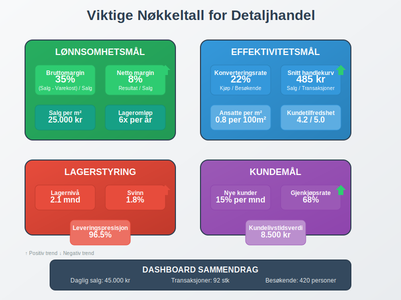

---
title: "Hva er Detaljhandel? Regnskap og Økonomistyring for Butikker"
meta_title: "Hva er Detaljhandel? Regnskap og Økonomistyring for Butikker"
meta_description: '**Detaljhandel** er salg av varer direkte til sluttforbrukere gjennom fysiske butikker eller digitale plattformer. Dette skiller seg fra [engroshandel](/blogs/r...'
slug: hva-er-detaljhandel
type: blog
layout: pages/single
---

**Detaljhandel** er salg av varer direkte til sluttforbrukere gjennom fysiske butikker eller digitale plattformer. Dette skiller seg fra [engroshandel](/blogs/regnskap/hva-er-engroshandel "Hva er Engroshandel? Regnskap og Økonomistyring for Grossister") som selger til andre virksomheter. Detaljhandel er en klassisk [B2C-virksomhet](/blogs/regnskap/hva-er-b2c "Hva er B2C? Business-to-Consumer i Regnskap") hvor bedrifter selger direkte til privatpersoner. Detaljhandel er en av de mest komplekse virksomhetstypene når det gjelder [regnskapsføring](/blogs/regnskap/hva-er-regnskap "Hva er Regnskap? En komplett guide") på grunn av høyt transaksjonsvolum, lagerstyring og spesialiserte systemer for salgsregistrering.

## Hva er Detaljhandel?

Detaljhandel omfatter alle former for **direkte salg til forbrukere** innen [B2C-handel](/blogs/regnskap/hva-er-b2c "Hva er B2C? Business-to-Consumer i Regnskap"), inkludert:

* **Fysiske butikker** - tradisjonelle butikklokaler
* **Netthandel** - e-handel og digitale plattformer  
* **Kombinerte løsninger** - omnikanalhandel
* **Markedsplasser** - salg på torv og markeder
* **Mobilhandel** - food trucks og mobile enheter

### Kjennetegn ved Detaljhandel

Detaljhandelsvirksomheter har flere unike karakteristikker som påvirker regnskapsføringen:

* **Høyt transaksjonsvolum** med mange små salg (typisk for [B2C-handel](/blogs/regnskap/hva-er-b2c "Hva er B2C? Business-to-Consumer i Regnskap"))
* **Kompleks lagerstyring** med mange varelinjer
* **Sesongvariasjoner** i salg og innkjøp
* **Kontant- og kortsalg** som krever [bankavstemming](/blogs/regnskap/hva-er-bankavstemming "Bankavstemming - Komplett Guide til Avstemming av Bankkonti")
* **Moms-håndtering** på alle salgstransaksjoner

## Regnskapsføring i Detaljhandel

### Grunnleggende Regnskapsprinsipper

Detaljhandel følger standard regnskapsprinsipper, men med spesiell fokus på:

#### Viktige Regnskapsområder:

| Område | Beskrivelse | Utfordringer |
|--------|-------------|--------------|
| **Lagerstyring** | Registrering av varebeholdning | Svinn, tyveri, [**Ukurans**](/blogs/regnskap/ukurans "Ukurans i regnskap - nedskrivning av ukurante varer") |
| **Salgsregistrering** | Daglige salgstransaksjoner | Høyt volum, kontanthandtering |
| **Innkjøp** | Vareinnkjøp og leverandørgjeld | Sesongvariasjoner, kredittider |
| **Moms** | Utgående og inngående moms | Komplekse moms-satser |
| **Kassasystem** | Integrering med [regnskap](/blogs/regnskap/hva-er-regnskap "Hva er Regnskap? En komplett guide") | Teknisk kompleksitet |

### Lagerstyring og Varebeholdning

**Lagerstyring** er kritisk i detaljhandel og påvirker både [balansen](/blogs/regnskap/hva-er-balanse "Hva er Balanse? Komplett Guide til Balansen i Regnskap") og resultatregnskapet.

#### Lagerverdsettelse

Detaljhandel bruker typisk følgende metoder:

* **FIFO** (First In, First Out) - mest vanlig
* **Gjennomsnittskost** - for homogene varer
* **Spesifikk identifikasjon** - for unike/dyre varer med [GTIN/EAN-koder](/blogs/regnskap/hva-er-gtin-ean "Hva er GTIN/EAN? Komplett Guide til Globale Produktkoder i Regnskap")

#### Lagertelling og Svinn

Regelmessig lagertelling er essensielt for:

* **Oppdage svinn** og tyveri
* **Justere bokført beholdning**
* **Beregne [bruttofortjeneste](/blogs/regnskap/hva-er-bruttofortjeneste "Hva er Bruttofortjeneste? Beregning, Analyse og Optimalisering")**
* **Planlegge innkjøp**

### Salgsregistrering og Kassasystemer

#### Moderne Kassasystemer

Dagens kassasystemer integreres direkte med regnskapet og håndterer:

* **Automatisk salgsregistrering** basert på [GTIN/EAN-koder](/blogs/regnskap/hva-er-gtin-ean "Hva er GTIN/EAN? Komplett Guide til Globale Produktkoder i Regnskap")
* **Lageroppdatering** i sanntid
* **Moms-beregning** og rapportering
* **Kundedata** og lojalitetsprogrammer
* **Rapportering** til regnskapssystem

#### Daglig Kassaoppgjør

Hver dag må butikken gjennomføre [dagsoppgjør](/blogs/regnskap/hva-er-dagsoppgjor "Hva er Dagsoppgjør? Komplett Guide til Daglig Kassaoppgjør") som inkluderer:

1. **Kontanttelling** mot kassasystem
2. **Kortbetalinger** avstemming
3. **Returvarer** registrering
4. **Rabatter** og kampanjer
5. **Overføring** til regnskapssystem

## Moms i Detaljhandel

### Utgående Moms

Detaljhandel må håndtere **utgående moms** på alle salg til privatpersoner, som er standardprosedyre i [B2C-handel](/blogs/regnskap/hva-er-b2c "Hva er B2C? Business-to-Consumer i Regnskap"):

| Vare/Tjeneste | Moms-sats | Eksempler |
|---------------|-----------|-----------|
| **Vanlige varer** | 25% | Klær, elektronikk, møbler |
| **Næringsmidler** | 15% | Mat, drikke (ikke alkohol) |
| **Transport** | 12% | Kollektivtransport |
| **Bøker/aviser** | 0% | Trykte publikasjoner |

### Inngående Moms

Butikker kan trekke fra **inngående moms** på:

* **Vareinnkjøp** til videresalg
* **Driftskostnader** som husleie, strøm
* **Investeringer** i utstyr og inventar
* **Tjenester** som regnskap og markedsføring

### Moms-rapportering

Detaljhandel må levere [moms-oppgave](/blogs/regnskap/hva-er-avgiftsplikt-mva "Avgiftsplikt MVA - Komplett Guide til Merverdiavgift") hver annen måned med:

* **Utgående moms** fra salg
* **Inngående moms** fra innkjøp
* **Netto moms** til betaling/tilbakebetaling

## Økonomistyring i Detaljhandel

### Nøkkeltall og KPI-er

Detaljhandel bruker spesialiserte nøkkeltall:

#### Lønnsomhetsmål:
* **Bruttomargin** = (Salg - Varekostnad) / Salg × 100%
* **Netto margin** = Resultat / Salg × 100%
* **Salg per kvadratmeter** = Ã…rlig salg / Butikkareal
* **Lageromløpshastighet** = Varekostnad / Gjennomsnittlig lager

#### Effektivitetsmål:
* **Konverteringsrate** = Antall kjøp / Antall besøkende
* **Gjennomsnittlig handlekurv** = Totalt salg / Antall transaksjoner
* **Kundetilfredshet** og lojalitet
* **Ansatte per kvadratmeter**

### Budsjettering og Prognoser

Detaljhandel krever detaljert [budsjettering](/blogs/regnskap/hva-er-budsjettering "Hva er Budsjettering? Komplett Guide til Budsjettplanlegging") på grunn av:

* **Sesongvariasjoner** - høytider og ferieperioder
* **Trendendringer** - mote og forbrukerpreferanser  
* **Konkurransesituasjon** - priser og kampanjer
* **Økonomiske forhold** - kjøpekraft og inflasjon

## Teknologi og Digitalisering

### Integrerte Systemer

Moderne detaljhandel bruker integrerte systemer som kobler sammen:

* **Kassasystem** (POS - Point of Sale)
* **Lagerstyringssystem** (WMS - Warehouse Management)
* **Regnskapssystem** (ERP - Enterprise Resource Planning)
* **E-handelplattform** for nettbutikk
* **CRM-system** for kundedata

### Automatisering av Regnskapsføring

Teknologi muliggjør automatisering av:

* **Salgsregistrering** fra kassasystem
* **Lageroppdateringer** ved salg og innkjøp
* **Moms-beregning** og rapportering
* **Leverandørfakturaer** med OCR-teknologi
* **Banktransaksjoner** og avstemming

## Utfordringer i Detaljhandel

### Operasjonelle Utfordringer

* **Svinn og tyveri** - påvirker lønnsomhet direkte
* **Sesongvariasjoner** - krever fleksibel bemanning
* **Tekniske problemer** - kassasystem og nettbutikk
* **Leverandørforhold** - kredittider og kvalitet

### Regnskapsmessige Utfordringer

* **Høyt transaksjonsvolum** - krever effektive systemer (typisk for [B2C-virksomheter](/blogs/regnskap/hva-er-b2c "Hva er B2C? Business-to-Consumer i Regnskap"))
* **Kompleks moms-håndtering** - ulike satser og regler
* **Lagerverdsettelse** - påvirker resultat betydelig
* **Kontanthandtering** - risiko for feil og svindel

### Compliance og Regulering

Detaljhandel må forholde seg til:

* **[Bokføringsloven](/blogs/regnskap/hva-er-bokforingsloven "Bokføringsloven - Komplett Guide til Norsk Bokføringslovgivning")** - krav til dokumentasjon
* **Kassasystemforskriften** - tekniske krav til kasser
* **Personvernforordningen** (GDPR) - kundedata
* **Forbrukerrettigheter** - retur og reklamasjon

## Beste Praksis for Detaljhandel

### Daglige Rutiner

* **Morgentelling** av kasse og lager
* **Kontinuerlig oppdatering** av priser og kampanjer
* **Regelmessig backup** av kassasystem
* **Daglig avstemming** mot regnskapssystem

### MÃ¥nedlige Oppgaver

* **Fullstendig lagertelling** eller syklisk telling
* **Leverandøravstemming** og fakturagjennomgang
* **Moms-oppgave** forberedelse og levering
* **Resultatanalyse** og nøkkeltall-oppfølging

### Ã…rlige Aktiviteter

* **Ã…rlig inventar** og lagerverdsettelse
* **Ã…rsregnskap** og revisjonsgjennomgang
* **Budsjett** for neste år
* **Systemoppdateringer** og vedlikehold

## Fremtiden for Detaljhandel

### Digitale Trender

* **Omnikanalhandel** - sømløs opplevelse på tvers av kanaler
* **Kunstig intelligens** - for prognoser og personalisering
* **Automatiserte butikker** - selvbetjening og sensorer
* **Bærekraftig handel** - miljøfokus og sirkulærøkonomi

### Regnskapsmessige Implikasjoner

* **Sanntidsrapportering** - kontinuerlig oppdatering
* **Prediktiv analyse** - for bedre beslutninger
* **Automatisert compliance** - regelverkshåndtering
* **Integrert økonomiledelse** - helhetlig styring

## Konklusjon

Detaljhandel representerer en kompleks virksomhetstype som krever spesialisert kunnskap innen regnskapsføring og økonomistyring. Suksess avhenger av:

* **Effektive systemer** for salgs- og lagerregistrering
* **Nøyaktig moms-håndtering** og compliance
* **Kontinuerlig oppfølging** av nøkkeltall og lønnsomhet
* **Teknologisk oppdatering** for å møte fremtidens krav

Ved å følge beste praksis og investere i riktige systemer kan detaljhandelsvirksomheter oppnå både operasjonell effektivitet og finansiell kontroll som grunnlag for bærekraftig vekst.
