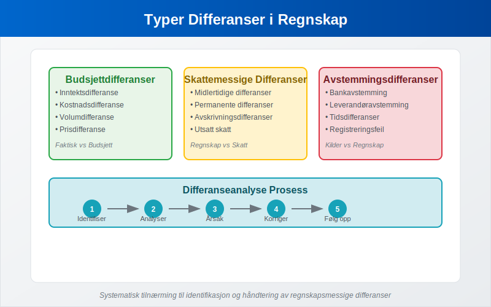
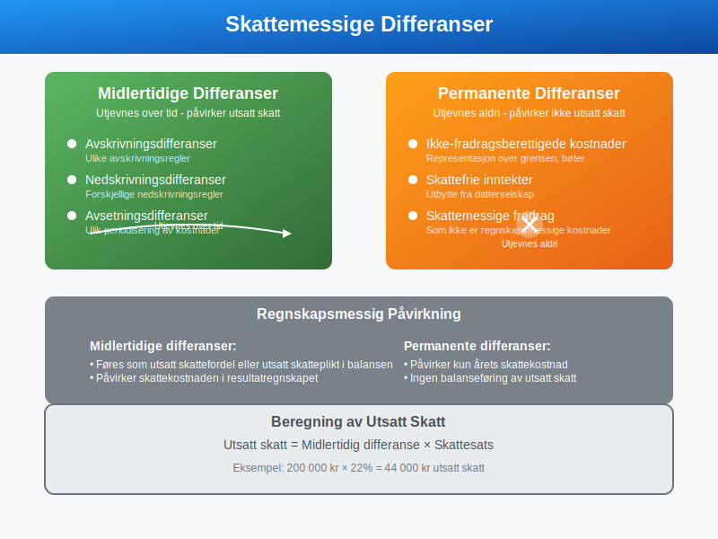
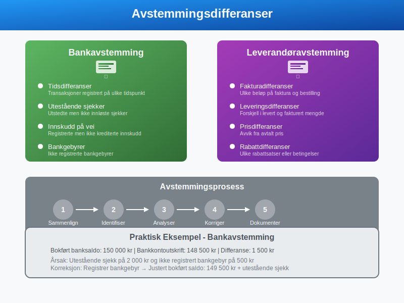
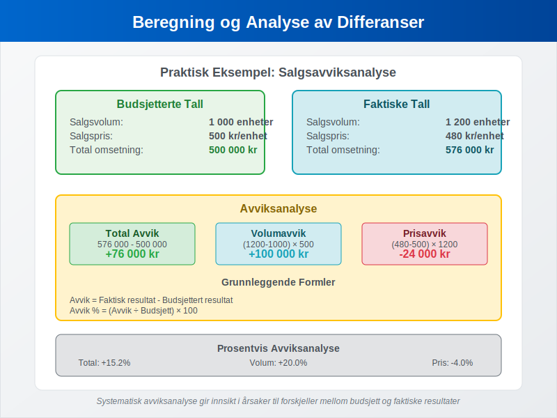
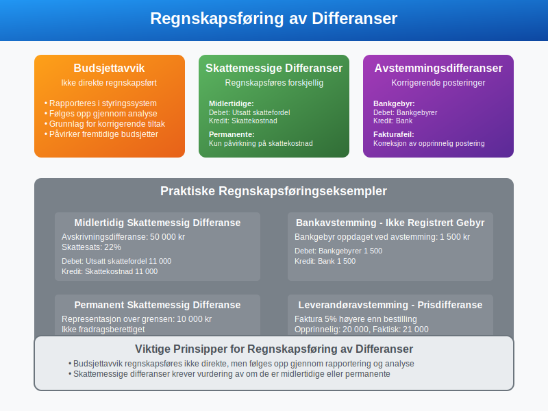
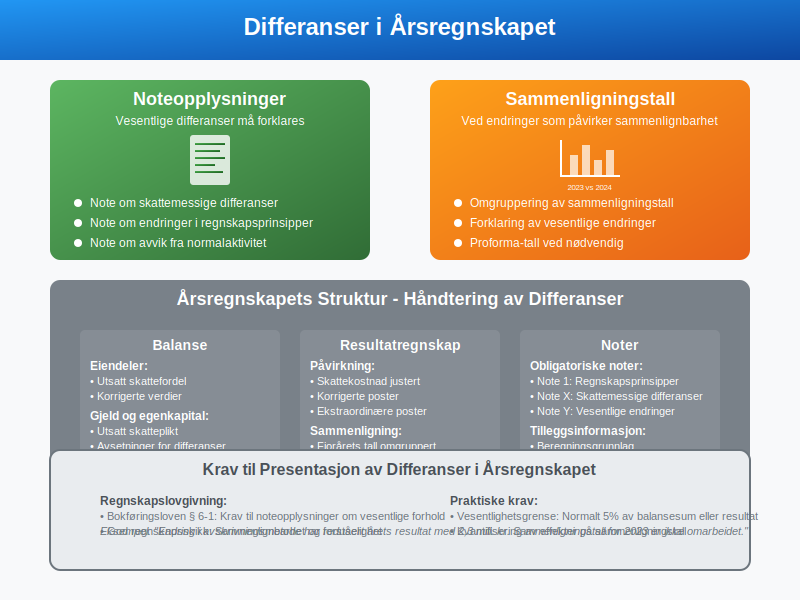
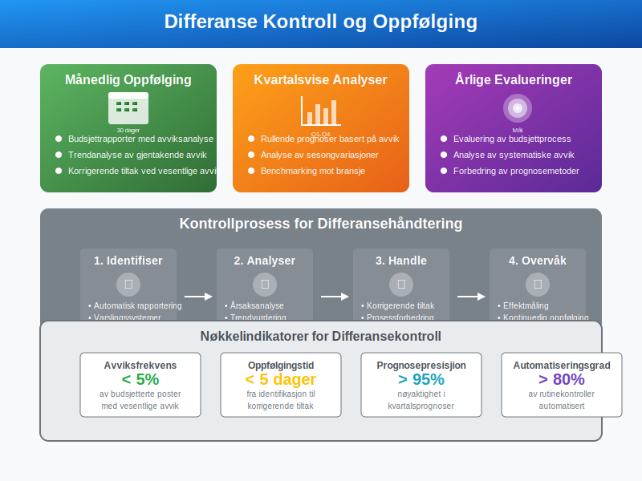
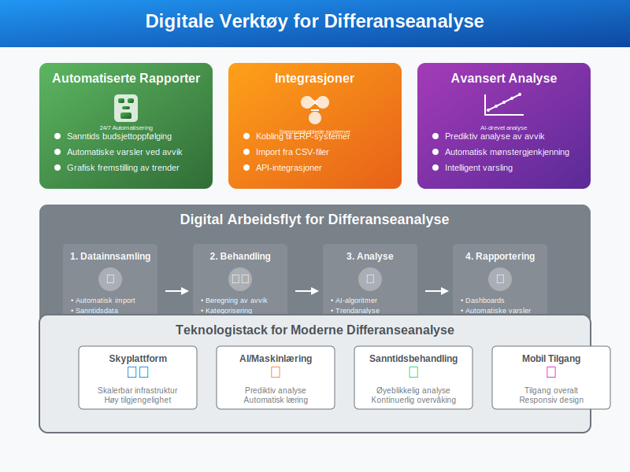
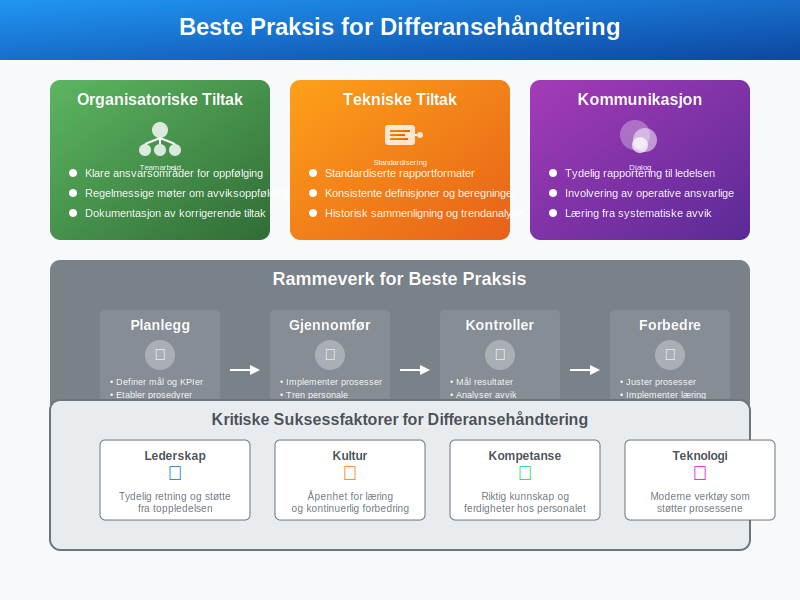
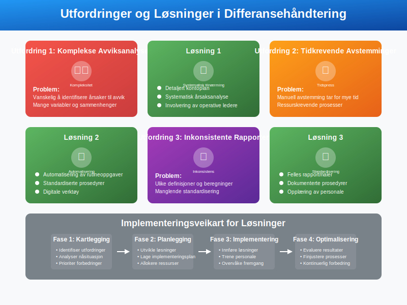

---
title: "Hva er differanse i regnskap?"
seoTitle: "Hva er differanse i regnskap?"
description: '**Differanse** i regnskap refererer til forskjeller mellom ulike regnskapsmessige størrelser, verdier eller beregninger. Dette begrepet omfatter flere viktige ...'
---

**Differanse** i regnskap refererer til forskjeller mellom ulike regnskapsmessige størrelser, verdier eller beregninger. Dette begrepet omfatter flere viktige områder innen regnskap og økonomi, fra [budsjettavvik](/blogs/regnskap/hva-er-budsjettering "Hva er Budsjettering? Komplett Guide til Budsjettplanlegging") til skattemessige forskjeller og [avstemminger](/blogs/regnskap/hva-er-avstemming "Hva er Avstemming i Regnskap? Guide til Kontroll og Balansering").

## Typer Differanser i Regnskap

Differanser i regnskap kan kategoriseres i flere hovedtyper, hver med sine spesifikke anvendelser og konsekvenser.



### 1. Budsjettdifferanser

**Budsjettdifferanser** oppstår når faktiske resultater avviker fra budsjetterte tall. Dette er et sentralt verktøy for [avvikshandtering](/blogs/regnskap/hva-er-avvikshandtering "Hva er Avvikshandtering? Metoder for Kontroll og Oppfølging") og økonomisk styring.

| Type Differanse | Beskrivelse | Eksempel |
|----------------|-------------|----------|
| **Inntektsdifferanse** | Forskjell mellom budsjetterte og faktiske inntekter | Budsjett: 1 000 000 kr, Faktisk: 1 150 000 kr = +150 000 kr |
| **Kostnadsdifferanse** | Forskjell mellom budsjetterte og faktiske kostnader | Budsjett: 800 000 kr, Faktisk: 850 000 kr = -50 000 kr |
| **Volumdifferanse** | Forskjell i solgte enheter | Budsjett: 1000 stk, Faktisk: 1200 stk = +200 stk |
| **Prisdifferanse** | Forskjell i pris per enhet | Budsjett: 100 kr/stk, Faktisk: 95 kr/stk = -5 kr/stk |

### 2. Skattemessige Differanser

Skattemessige differanser oppstår når regnskapsmessige og skattemessige verdier ikke stemmer overens.



#### Midlertidige Differanser

**Midlertidige differanser** utjevnes over tid og påvirker [utsatt skatt](/blogs/regnskap/hva-er-utsatt-skatt "Hva er Utsatt Skatt? Beregning og Regnskapsføring"):

* **Avskrivningsdifferanser:** Forskjell mellom regnskapsmessige og skattemessige [avskrivninger](/blogs/regnskap/hva-er-avskrivning "Hva er Avskrivning i Regnskap? Metoder, Beregning og Praktiske Eksempler")
* **Nedskrivningsdifferanser:** Ulike regler for nedskrivning av eiendeler
* **Avsetningsdifferanser:** Forskjeller i periodisering av kostnader

#### Permanente Differanser

**Permanente differanser** utjevnes aldri og påvirker ikke utsatt skatt:

* **Ikke-fradragsberettigede kostnader:** Representasjon over grensen, bøter
* **Skattefrie inntekter:** Utbytte fra datterselskap
* **Skattemessige fradrag:** Som ikke er regnskapsmessige kostnader

### 3. Avstemmingsdifferanser

Avstemmingsdifferanser oppstår ved sammenligning av ulike regnskapskilder.



#### Bankavstemming

Ved [bankavstemming](/blogs/regnskap/hva-er-bankavstemming "Hva er Bankavstemming? Prosess, Metoder og Beste Praksis") kan følgende differanser oppstå:

* **Tidsdifferanser:** Transaksjoner registrert på ulike tidspunkt
* **Utestående sjekker:** Utstedte men ikke innløste sjekker
* **Innskudd på vei:** Registrerte innskudd som ikke er kreditert banken
* **Bankgebyrer:** Ikke registrerte bankgebyrer

#### Leverandøravstemming

* **Fakturadifferanser:** Ulike beløp på faktura og bestilling
* **Leveringsdifferanser:** Forskjell i levert og fakturert mengde
* **Prisdifferanser:** Avvik fra avtalt pris

## Beregning og Analyse av Differanser

Korrekt beregning og analyse av differanser er essensielt for god økonomistyring.



### Budsjettavviksanalyse

**Formel for budsjettavvik:**
Avvik = Faktisk resultat - Budsjettert resultat

**Avviksanalyse i prosent:**
Avvik % = (Avvik ÷ Budsjett) × 100

### Praktisk Eksempel: Salgsavviksanalyse

**Budsjetterte tall:**
- Salgsvolum: 1000 enheter
- Salgspris: 500 kr per enhet
- Budsjettert omsetning: 500 000 kr

**Faktiske tall:**
- Salgsvolum: 1200 enheter  
- Salgspris: 480 kr per enhet
- Faktisk omsetning: 576 000 kr

**Avviksanalyse:**

| Type Avvik | Beregning | Resultat |
|------------|-----------|----------|
| **Total avvik** | 576 000 - 500 000 | +76 000 kr |
| **Volumavvik** | (1200-1000) × 500 | +100 000 kr |
| **Prisavvik** | (480-500) × 1200 | -24 000 kr |

## Regnskapsføring av Differanser

Hvordan differanser regnskapsføres avhenger av type og årsak.



### Budsjettavvik

Budsjettavvik regnskapsføres ikke direkte, men følges opp gjennom rapportering og analyse.

### Skattemessige Differanser

**Midlertidig differanse (utsatt skatt):**
```
Debet: Utsatt skattefordel     50 000
Kredit: Skattekostnad         50 000
```

**Permanent differanse:**
Påvirker kun årets skattekostnad, ingen [balanseføring](/blogs/regnskap/hva-er-balanse "Hva er Balanse? Komplett Guide til Balansen i Regnskap").

### Avstemmingsdifferanser

**Bankgebyr ikke registrert:**
```
Debet: Bankgebyrer            1 500
Kredit: Bank                  1 500
```

## Differanser i Årsregnskapet

Differanser må håndteres korrekt i [årsregnskapet](/blogs/regnskap/hva-er-aarsregnskap "Hva er Årsregnskap? Innhold, oppbygging og lovkrav i Norge") for å sikre korrekt fremstilling.



### Noteopplysninger

Vesentlige differanser må forklares i noter:

* **Note om skattemessige differanser**
* **Note om endringer i regnskapsprinsipper**
* **Note om avvik fra normalaktivitet**

### Sammenligningstall

Ved endringer som påvirker sammenlignbarhet:

* **Omgruppering av sammenligningstall**
* **Forklaring av vesentlige endringer**
* **Proforma-tall ved nødvendig**

## Kontroll og Oppfølging av Differanser

Systematisk oppfølging av differanser er viktig for god økonomistyring.



### Månedlig Oppfølging

* **Budsjettrapporter med avviksanalyse**
* **Trendanalyse av gjentakende avvik**
* **Korrigerende tiltak ved vesentlige avvik**

### Kvartalsvise Analyser

* **Rullende prognoser basert på avvik**
* **Analyse av sesongvariasjoner**
* **Benchmarking mot bransje**

### Årlige Evalueringer

* **Evaluering av budsjettprocess**
* **Analyse av systematiske avvik**
* **Forbedring av prognosemetoder**

## Digitale Verktøy for Differanseanalyse

Moderne regnskapssystemer tilbyr avanserte verktøy for differanseanalyse.



### Automatiserte Rapporter

* **Sanntids budsjettoppfølging**
* **Automatiske varsler ved avvik**
* **Grafisk fremstilling av trender**

### Integrasjoner

* **Kobling til [ERP-systemer](/blogs/regnskap/hva-er-erp "Hva er ERP? Enterprise Resource Planning i Praksis")**
* **Import fra [CSV-filer](/blogs/regnskap/hva-er-csv-fil "Hva er CSV-fil? Format, Bruk og Håndtering i Regnskap")**
* **API-integrasjoner med andre systemer**

## Beste Praksis for Differansehåndtering

For å maksimere verdien av differanseanalyse bør følgende prinsipper følges.



### Organisatoriske Tiltak

* **Klare ansvarsområder for oppfølging**
* **Regelmessige møter om avviksoppfølging**
* **Dokumentasjon av korrigerende tiltak**

### Tekniske Tiltak

* **Standardiserte rapportformater**
* **Konsistente definisjoner og beregninger**
* **Historisk sammenligning og trendanalyse**

### Kommunikasjon

* **Tydelig rapportering til ledelsen**
* **Involvering av operative ansvarlige**
* **Læring fra systematiske avvik**

## Juridiske og Regulatoriske Aspekter

Håndtering av differanser må følge gjeldende regelverk og standarder.

### Regnskapslovgivning

* **[Bokføringsloven](/blogs/regnskap/hva-er-bokforingsloven "Hva er Bokføringsloven? Regler og Krav til Regnskapsføring") og forskrifter**
* **God regnskapsskikk**
* **Internasjonale regnskapsstandarder (IFRS/NGRS)**

### Skattelovgivning

* **Skatteloven og forskrifter**
* **Ligningspraksis**
* **Dokumentasjonskrav**

## Vanlige Utfordringer og Løsninger

Bedrifter møter ofte utfordringer i differansehåndtering som kan løses med riktig tilnærming.



### Utfordring 1: Komplekse Avviksanalyser

**Problem:** Vanskelig å identifisere årsaker til avvik
**Løsning:** 
* Detaljert kontoplan
* Systematisk årsaksanalyse
* Involvering av operative ledere

### Utfordring 2: Tidkrevende Avstemminger

**Problem:** Manuell avstemming tar for mye tid
**Løsning:**
* Automatisering av rutineoppgaver
* Standardiserte prosedyrer
* Digitale verktøy

### Utfordring 3: Inkonsistente Rapporter

**Problem:** Ulike definisjoner og beregninger
**Løsning:**
* Felles rapportmaler
* Dokumenterte prosedyrer
* Opplæring av personale

## Fremtidige Trender

Differanseanalyse utvikler seg med ny teknologi og endrede krav.

### Kunstig Intelligens

* **Automatisk identifikasjon av mønstre**
* **Prediktiv analyse av avvik**
* **Intelligent varsling**

### Sanntidsrapportering

* **Kontinuerlig overvåking**
* **Øyeblikkelig avviksdeteksjon**
* **Proaktiv styring**

### Integrert Rapportering

* **Kombinasjon av finansielle og ikke-finansielle data**
* **[ESG-rapportering](/blogs/regnskap/hva-er-csrd "Hva er CSRD? Corporate Sustainability Reporting Directive")**
* **Helhetlig styringsinformasjon**

Differanser i regnskap er et omfattende og viktig område som krever systematisk tilnærming og kontinuerlig oppfølging. Ved å forstå ulike typer differanser og implementere gode rutiner for analyse og oppfølging, kan bedrifter oppnå bedre økonomisk styring og mer presise prognoser.


