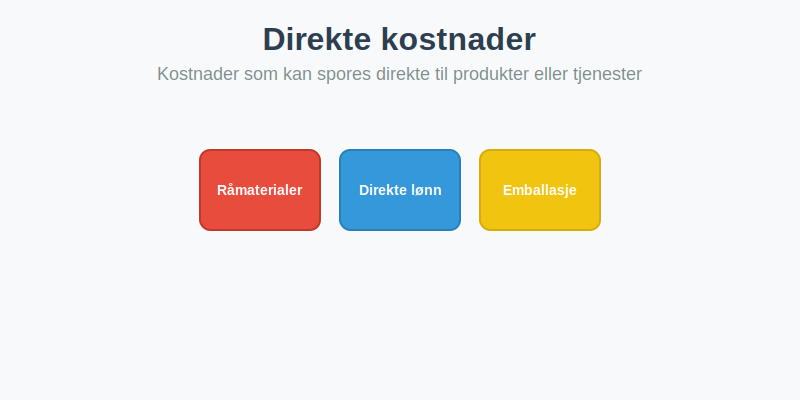

---
title: "Hva er Direkte kostnader?"
meta_title: "Hva er Direkte kostnader?"
meta_description: '**Direkte kostnader** er kostnader som kan spores direkte til et spesifikt produkt, tjeneste eller kostnadssted. Disse kostnadene ville ikke påløpt hvis produ...'
slug: hva-er-direkte-kostnader
type: blog
layout: pages/single
---

**Direkte kostnader** er kostnader som kan spores direkte til et spesifikt produkt, tjeneste eller kostnadssted. Disse kostnadene ville ikke påløpt hvis produktet eller tjenesten ikke ble produsert eller levert. Forståelse av direkte kostnader er grunnleggende for nøyaktig [kostnadsanalyse](/blogs/regnskap/hva-er-dekningsbidrag "Hva er Dekningsbidrag? Beregning og Analyse for Bedre Lønnsomhet"), [budsjettering](/blogs/regnskap/hva-er-budsjettering "Hva er Budsjettering? Komplett Guide til Budsjettplanlegging") og [prisstrategi](/blogs/regnskap/hva-er-avanse "Hva er Avanse? Beregning av Fortjenestemargin i Salg").

For en komplett oversikt over alle kostnadstyper og kostnadskonsepter i regnskap, se også [Hva er kostnader?](/blogs/regnskap/hva-er-kostnader "Hva er Kostnader i Regnskap? Komplett Guide til Kostnadstyper og Regnskapsføring").
Les også om [Faste kostnader](/blogs/regnskap/hva-er-faste-kostnader "Hva er Faste kostnader? Definisjon og Eksempler"), [Variable kostnader](/blogs/regnskap/variable-kostnader "Hva er Variable kostnader? Definisjon, Eksempler og Regnskapsføring") og [Indirekte kostnader](/blogs/regnskap/hva-er-indirekte-kostnader "Hva er Indirekte kostnader? Definisjon, Eksempler og Regnskapsføring") for en helhetlig kostnadsforståelse.

Det er viktig Ã¥ forstÃ¥ forskjellen mellom kostnad og [utgift](/blogs/regnskap/utgift "Utgift “ Komplett Guide til Utgifter i Norsk Regnskap"); se vÃ¥r artikkel om utgift.

## Hva er Direkte kostnader?

_Direkte kostnader_ kan defineres som **kostnader som direkte kobles til produksjon eller levering av et spesifikt produkt eller en tjeneste**. De er variable i forhold til produksjonsvolum eller tjenesteomfang, og de forsvinner helt hvis aktiviteten ikke finner sted.

### Kjennetegn ved Direkte kostnader

* **Sporbarhet:** Kan identifiseres og måles direkte på produktet eller tjenesten.
* **Volumbasert:** Endres proporsjonalt med antall produserte enheter eller leverte tjenester.
* **Periodisering:** Kostnaden påløper i samme periode som den tilknyttede inntekten.
* **Bruttoresultatpåvirkning:** Direkte kostnader inngår i beregning av [bruttofortjeneste](/blogs/regnskap/hva-er-bruttofortjeneste "Hva er Bruttofortjeneste? Beregning og Analyse av Lønnsomhet").

## Eksempler på Direkte kostnader

| Kostnadskategori        | Eksempel                                 |
|-------------------------|------------------------------------------|
| **Råmaterialer**        | Stål, tre, plast brukt i produksjon      |
| **Produktlønn**         | Lønn til produksjonsmedarbeidere         |
| **Underleveranser**     | Komponenter kjøpt spesifikt for produkt  |
| **Spesifikk maskinleie**| Leie av maskin til et bestemt prosjekt   |
| **Emballasje**          | Boksing og forpakning per enhet          |

## Direkte kostnader i regnskapsføringen

I norsk regnskap skal direkte kostnader regnskapsføres i samsvar med [bokføringsloven](/blogs/regnskap/hva-er-bokforingsloven "Hva er Bokføringsloven? Krav og Plikter"), og de skal periodiseres slik at de korresponderer med tilhørende inntekt. Dette sikrer korrekt resultatrapportering.

## Bruk av Direkte kostnader i analyse

Direkte kostnader er sentrale i flere økonomistyringsmodeller:

* **Dekningsbidragsanalyse:** Direkte kostnader trekkes fra omsetning for å beregne [dekningsbidrag](/blogs/regnskap/hva-er-dekningsbidrag "Hva er Dekningsbidrag? Beregning og Analyse for Bedre Lønnsomhet").
* **Kostnadsstyring:** Fokus på reduksjon av direkte kostnader kan forbedre [bunnlinje](/blogs/regnskap/bunnlinje "Hva er Bunnlinje? Effektivisering av Resultatmåling") og lønnsomhet.
* **Prissetting:** Kunnskap om direkte kostnader er grunnlag for å beregne [avanse](/blogs/regnskap/hva-er-avanse "Hva er Avanse? Beregning av Fortjenestemargin i Salg") og sette konkurransedyktige priser.
* **Budsjettering:** Planlegging av direkte kostnader bidrar til realistiske budsjett for produksjon og tjenesteyting.

## Oppsummering

**Direkte kostnader** er kostnader som tydelig knytter seg til produksjon eller levering av varer og tjenester. Ved å forstå og kontrollere disse kostnadene kan virksomheter oppnå mer presise analyser, bedre prisstrategi og optimal ressursbruk.

