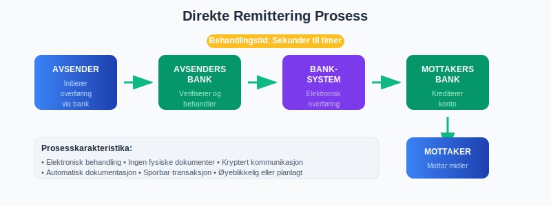

For en oversikt over **remittering** og dens ulike former, se [Remittering](/blogs/regnskap/remittering "Remittering: Konsepter, Typer og Prosess").

For en oversikt over **remittering** og dens ulike former, se [Remittering](/blogs/regnskap/remittering "Remittering: Konsepter, Typer og Prosess").

**Direkte remittering** er en betalingsmetode hvor penger overføres direkte fra en bankkonto til en annen uten mellomliggende instanser eller fysisk håndtering av kontanter. Dette er en elektronisk overføringsform som har blitt en grunnleggende del av moderne [betalingsmidler](/blogs/regnskap/hva-er-betalingsmidler "Hva er Betalingsmidler? Komplett Oversikt over Betalingsformer") og regnskapsføring i norsk næringsliv.

## Hva er Direkte Remittering?

Direkte remittering, også kjent som **direkte overføring** eller **elektronisk pengeoverføring**, er en prosess hvor midler flyttes elektronisk fra en bankkonto til en annen. I motsetning til tradisjonelle betalingsmetoder som sjekker eller kontanter, skjer hele transaksjonen digitalt gjennom banksystemet.



### Hovedkarakteristika:

* **Elektronisk behandling:** Ingen fysiske dokumenter eller kontanter involvert
* **Direkte overføring:** Midler går direkte mellom kontoer
* **Umiddelbar eller planlagt:** Kan utføres øyeblikkelig eller på forhåndsbestemt dato
* **Sporbar:** Alle transaksjoner dokumenteres elektronisk
* **Sikker:** Kryptert kommunikasjon mellom banker

## Typer Direkte Remittering

Det finnes flere former for direkte remittering, hver med sine spesifikke anvendelsesområder og karakteristika.


### 1. Innenlandske Overføringer

**Beskrivelse:** Overføringer mellom kontoer i samme land.

**Eksempler:**
* Lønnsutbetalinger til ansatte
* [A-konto betalinger](/blogs/regnskap/hva-er-a-konto-betaling "Hva er A-konto Betaling? En Enkel Forklaring") til leverandører
* Betaling av [fakturaer](/blogs/regnskap/hva-er-en-faktura "Hva er en Faktura? En Guide til Norske Fakturakrav")

### 2. Internasjonale Overføringer

**Beskrivelse:** Grenseoverskridende overføringer mellom ulike land.

**Metoder:**
* SWIFT-overføringer
* SEPA-overføringer (innen EU/EØS)
* Korrespondentbank-nettverk

### 3. Automatiserte Overføringer

**Beskrivelse:** Forhåndsprogrammerte, regelmessige overføringer.

**Eksempler:**
* [AvtaleGiro](/blogs/regnskap/hva-er-avtalegiro "Hva er AvtaleGiro? Komplett Guide til Automatisk Betaling") for regelmessige regninger
* Månedlige lønnsutbetalinger
* Automatiske leverandørbetalinger

## Sammenligning med Andre Betalingsmetoder

For å forstå direkte remittering bedre, er det nyttig å sammenligne med andre betalingsformer.


| Betalingsmetode | Behandlingstid | Kostnad | Sikkerhet | Sporbarhet |
|-----------------|----------------|---------|-----------|------------|
| **Direkte Remittering** | Øyeblikkelig - 1 dag | Lav-middels | Høy | Utmerket |
| **[BankGiro](/blogs/regnskap/hva-er-bankgiro "Hva er BankGiro? Guide til Norsk Betalingssystem")** | 1-2 dager | Lav | Høy | God |
| **Kontanter** | Øyeblikkelig | Ingen | Lav | Dårlig |
| **Sjekk** | 3-5 dager | Middels | Middels | God |
| **Kredittkort** | Øyeblikkelig | Høy | Middels | Utmerket |

## Prosessen for Direkte Remittering

Direkte remittering følger en strukturert prosess som sikrer trygg og effektiv overføring av midler.


### Trinn-for-trinn Prosess:

1. **Initiering**
   - Avsender gir oppdrag til sin bank
   - Nødvendig informasjon samles inn

2. **Autorisering**
   - Banken verifiserer avsenders identitet
   - Kontroll av tilgjengelige midler

3. **Behandling**
   - Transaksjonen behandles av banksystemet
   - Midler reserveres på avsenders konto

4. **Overføring**
   - Midler sendes til mottakers bank
   - Kommunikasjon mellom banker

5. **Mottak**
   - Mottakers bank krediterer kontoen
   - Bekreftelse sendes til begge parter

## Regnskapsføring av Direkte Remittering

Korrekt regnskapsføring av direkte remitteringer er avgjørende for nøyaktig [bankavstemming](/blogs/regnskap/hva-er-bankavstemming "Hva er Bankavstemming? Komplett Guide til Bankavstemmingsprosessen") og finansiell rapportering.


### For Avsender:

**Ved sending av betaling:**
```
Debet: Leverandørgjeld / Utgift    XXX
Kredit: Bank                       XXX
```

**Ved gebyr:**
```
Debet: Bankgebyrer                 XXX
Kredit: Bank                       XXX
```

### For Mottaker:

**Ved mottak av betaling:**
```
Debet: Bank                        XXX
Kredit: Kundefordring / Inntekt    XXX
```

### Dokumentasjon som Kreves:

* **Overføringsoppdrag:** Original instruks til bank
* **Bankbekreftelse:** Bevis på gjennomført transaksjon
* **Kontoutskrift:** Viser endring i banksaldo
* **Fakturaer/kontrakter:** Underliggende forretningsgrunn

## Fordeler med Direkte Remittering

Direkte remittering tilbyr betydelige fordeler for både bedrifter og privatpersoner.


### For Bedrifter:

* **Effektivitet**
  - Raskere behandling enn tradisjonelle metoder
  - Redusert administrativt arbeid
  - Automatisering av rutinebetalinger

* **Kostnadskontroll**
  - Lavere transaksjonskostnader
  - Reduserte porto- og håndteringskostnader
  - Bedre [likviditetsstyring](/blogs/regnskap/hva-er-arbeidskapital "Hva er Arbeidskapital? Beregning og Analyse av Driftskapital")

* **Sikkerhet**
  - Eliminerer risiko for tapte sjekker
  - Kryptert dataoverføring
  - Sporbare transaksjoner

* **Kontroll**
  - Bedre oversikt over [betalingsevne](/blogs/regnskap/hva-er-betalingsevne "Hva er Betalingsevne? Analyse, Beregning og Forbedring")
  - Planlegging av kontantstrøm
  - Automatisk dokumentasjon

### For Leverandører:

* **Raskere betaling:** Redusert tid fra faktura til betaling
* **Forutsigbarhet:** Kjente betalingsdatoer
* **Redusert risiko:** Mindre sjanse for tapte betalinger

## Praktiske Eksempler

La oss se på hvordan direkte remittering brukes i praksis gjennom konkrete eksempler.


### Eksempel 1: Månedlig Lønnsutbetaling

**Situasjon:** Et selskap med 50 ansatte skal utbetale lønn.

**Tradisjonell metode vs. Direkte remittering:**

| Aspekt | Tradisjonell | Direkte Remittering |
|--------|-------------|-------------------|
| **Tid brukt** | 4-6 timer | 30 minutter |
| **Kostnad per utbetaling** | 15-25 kr | 2-5 kr |
| **Risiko for feil** | Høy | Lav |
| **Dokumentasjon** | Manuell | Automatisk |

**Ã…rlig besparelse:** Ca. 50 000 - 80 000 kr

### Eksempel 2: Leverandørbetaling

**Situasjon:** Betaling av 20 fakturaer til ulike leverandører.

**Prosess:**
1. Fakturaer [attesteres](/blogs/regnskap/hva-er-attestering "Hva er Attestering? Komplett Guide til Regnskapskontroll") og godkjennes
2. Betalingsinformasjon registreres i banksystem
3. Samlet betalingsoppdrag sendes til bank
4. Bank utfører alle overføringer samtidig
5. Automatisk oppdatering av leverandørreskontro

**Resultat:**
- Alle betalinger gjennomført på én dag
- Automatisk avstemming mot [bilag](/blogs/regnskap/hva-er-bilag "Hva er Bilag? Komplett Guide til Regnskapsbilag")
- Redusert administrativt arbeid

### Eksempel 3: Internasjonal Handel

**Situasjon:** Import av varer fra Tyskland verdt €50 000.

**Direkte remittering prosess:**
1. Kontrakt spesifiserer betalingsbetingelser
2. Importør initierer SEPA-overføring
3. Midler overføres innen 1 virkedag
4. Eksportør bekrefter mottak
5. Varer sendes umiddelbart

**Fordeler:**
- Rask betaling sikrer rask levering
- Lave overføringskostnader innen EU
- Transparent valutakurs

## Risikostyring og Sikkerhet

Selv om direkte remittering er sikker, er det viktig å implementere riktige sikkerhetstiltak.


### Sikkerhetstiltak:

* **Autorisasjonsnivåer**
  - Ulike godkjennelsesnivåer basert på beløp
  - Dobbel signatur for store beløp
  - Tidsbegrensede autorisasjoner

* **Teknisk Sikkerhet**
  - To-faktor autentisering
  - Krypterte kommunikasjonskanaler
  - Regelmessige sikkerhetsoppdateringer

* **Prosedyrer**
  - Daglig avstemming av [banktransaksjoner](/blogs/regnskap/hva-er-banktransaksjoner "Hva er Banktransaksjoner? Guide til Bankoperasjoner")
  - Månedlig gjennomgang av alle overføringer
  - Ã…rlig revisjon av betalingsprosedyrer

### Vanlige Risikoer og Forebygging:

| Risiko | Sannsynlighet | Konsekvens | Forebygging |
|--------|---------------|------------|-------------|
| **Feil mottaker** | Middels | Høy | Dobbeltsjekk av kontonummer |
| **Feil beløp** | Lav | Middels | Automatisk validering |
| **Svindel** | Lav | Høy | Sterke autorisasjonsprosedyrer |
| **Systemfeil** | Lav | Middels | Backup-systemer |

## Regulatoriske Krav

Direkte remittering er underlagt strenge regulatoriske krav for å sikre trygg og effektiv betaling.


### Norske Reguleringer:

* **Finanstilsynet:** Overvåker betalingssystemer
* **[Betalingstjenestedirektivet](/blogs/regnskap/hva-er-betalingstjenestedirektivet "Hva er Betalingstjenestedirektivet? PSD2 og Betalingsregulering") (PSD2):** EU-regulering implementert i Norge
* **Hvitvaskingsloven:** Krav til kundeidentifikasjon
* **Personvernforordningen (GDPR):** Beskyttelse av persondata

### Compliance-krav:

* **KYC (Know Your Customer):** Identifikasjon av kunder
* **AML (Anti-Money Laundering):** Overvåking av mistenkelige transaksjoner
* **Rapportering:** Obligatorisk rapportering til myndigheter
* **Dokumentasjon:** Oppbevaring av transaksjonsdata

## Fremtidige Utviklingstrender

Direkte remittering utvikler seg raskt med ny teknologi og endrede forbrukerbehov.


### Teknologiske Innovasjoner:

* **Øyeblikkelige betalinger:** 24/7 sanntidsoverføringer
* **Blockchain-teknologi:** Desentraliserte betalingssystemer
* **Kunstig intelligens:** Automatisk svindeldeteksjon
* **API-integrasjon:** Sømløs integrasjon med regnskapssystemer

### Markedstrender:

* **Økt automatisering:** Flere prosesser blir automatiserte
* **Lavere kostnader:** Konkurranse driver ned priser
* **Bedre brukeropplevelse:** Enklere grensesnitt
* **Økt sikkerhet:** Avanserte sikkerhetstiltak

## Implementering i Bedriften

For å implementere direkte remittering effektivt, bør bedrifter følge en strukturert tilnærming.


### Implementeringstrinn:

1. **Behovsanalyse**
   - Kartlegg eksisterende betalingsprosesser
   - Identifiser forbedringsområder
   - Beregn potensielle besparelser

2. **Systemvalg**
   - Evaluer ulike banktjenester
   - Vurder integrasjon med eksisterende systemer
   - Sammenlign kostnader og funksjonalitet

3. **Oppsett og Testing**
   - Konfigurer banksystemer
   - Test med små beløp
   - Tren personale

4. **Utrulling**
   - Gradvis overgang fra gamle systemer
   - Overvåk ytelse og feil
   - Juster prosedyrer etter behov

5. **Optimalisering**
   - Analyser bruksmønstre
   - Automatiser flere prosesser
   - Kontinuerlig forbedring

## Beste Praksis

For å maksimere fordelene med direkte remittering, bør bedrifter følge etablerte beste praksis.


### Operasjonelle Retningslinjer:

* **Standardisering**
  - Bruk konsistente betalingsformater
  - Standardiser godkjennelsesprosedyrer
  - Implementer felles rapporteringsrutiner

* **Automatisering**
  - Automatiser rutinebetalinger
  - Bruk forhåndsdefinerte betalingsmaler
  - Implementer automatisk avstemming

* **Kontroll**
  - Daglig overvåking av transaksjoner
  - MÃ¥nedlig gjennomgang av prosedyrer
  - Årlig evaluering av leverandører

### Kvalitetssikring:

* **Dobbeltsjekk:** Alle kritiske opplysninger verifiseres
* **Segregering:** Adskillelse av autorisasjon og utførelse
* **Dokumentasjon:** Komplett sporingslogg for alle transaksjoner
* **Backup:** Alternative betalingsmetoder ved systemfeil

## Konklusjon

**Direkte remittering** har revolusjonert måten bedrifter håndterer betalinger på. Som en effektiv, sikker og kostnadseffektiv betalingsmetode, tilbyr den betydelige fordeler sammenlignet med tradisjonelle alternativer.

### Nøkkelfordeler:

* **Effektivitet:** Raskere behandling og redusert administrativt arbeid
* **Kostnadskontroll:** Lavere transaksjonskostnader og bedre likviditetsstyring
* **Sikkerhet:** Kryptert overføring og sporbare transaksjoner
* **Fleksibilitet:** Støtter både innenlandske og internasjonale overføringer

### Fremtidsperspektiv:

Med kontinuerlig teknologisk utvikling vil direkte remittering bli enda mer integrert i bedrifters daglige drift. Øyeblikkelige betalinger, forbedret sikkerhet og lavere kostnader vil gjøre denne betalingsmetoden til en enda mer attraktiv løsning.

For bedrifter som ønsker å modernisere sine betalingsprosesser, representerer direkte remittering en investering i både nåværende effektivitet og fremtidig konkurranseevne. Ved å implementere riktige prosedyrer og sikkerhetstiltak, kan organisasjoner dra full nytte av denne teknologiens potensial.

Kombinert med andre moderne [betalingsmidler](/blogs/regnskap/hva-er-betalingsmidler "Hva er Betalingsmidler? Komplett Oversikt over Betalingsformer") og integrert med avanserte regnskapssystemer, vil direkte remittering fortsette å være en hjørnestein i moderne finansiell forvaltning.


