---
title: "Hva er diskontering?"
meta_title: "Hva er diskontering?"
meta_description: '**Diskontering** er en fundamental finansiell teknikk som brukes til å beregne nåverdien av fremtidige kontantstrømmer. I regnskaps- og finanssammenheng er d...'
slug: hva-er-diskontering
type: blog
layout: pages/single
---

**Diskontering** er en fundamental finansiell teknikk som brukes til å beregne nåverdien av fremtidige kontantstrømmer. I regnskaps- og finanssammenheng er diskontering essensielt for å sammenligne verdien av penger på ulike tidspunkter, siden en krone i dag er verdt mer enn en krone i fremtiden på grunn av inflasjon og alternativkostnad.

For relaterte finansielle begreper, se [Hva er Disagio?](/blogs/regnskap/disagio "Hva er Disagio? Emisjonsrabatt på lån og obligasjoner").

## Hva er Diskontering?

Diskontering er prosessen med å redusere fremtidige kontantstrømmer til deres **nåverdi** ved å anvende en diskonteringsrente. Dette konseptet bygger på det grunnleggende prinsippet om at penger har en tidsverdi - **time value of money**.

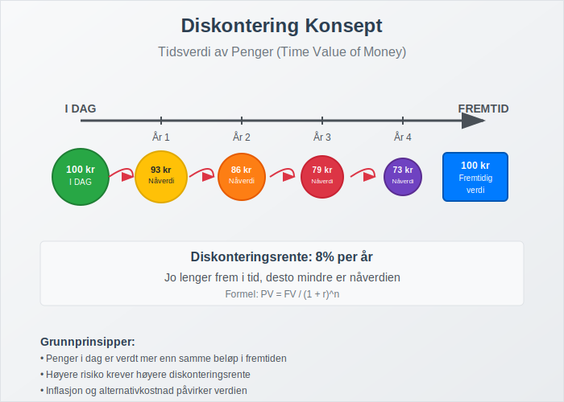

### Grunnleggende Prinsipper:

* **Tidsverdi av penger:** Penger i dag er verdt mer enn samme beløp i fremtiden
* **Alternativkostnad:** Avkastning man kunne fått ved alternative investeringer
* **Risiko:** Høyere risiko krever høyere diskonteringsrente
* **Inflasjon:** Reduserer kjøpekraften over tid

## Diskontering vs. Kapitalisering

Det er viktig å forstå forskjellen mellom diskontering og kapitalisering (compound interest).

For en dypere forstÃ¥else av **kapitalisering** (renters rente), se [Renters rente](/blogs/regnskap/renters-rente "Renters rente “ Rente pÃ¥ rente i regnskap").

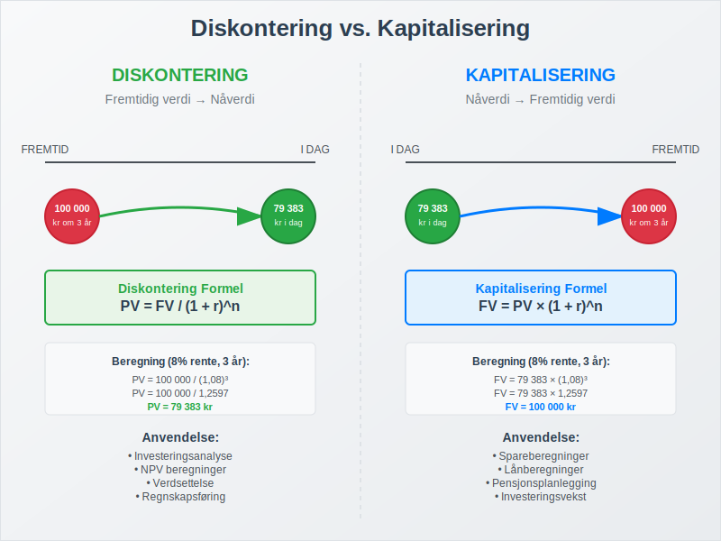

| Aspekt | Diskontering | Kapitalisering |
|--------|-------------|----------------|
| **Retning** | Fremtidig verdi → Nåverdi | Nåverdi → Fremtidig verdi |
| **Formel** | PV = FV / (1 + r)^n | FV = PV × (1 + r)^n |
| **Anvendelse** | Investeringsanalyse, [avkastning](/blogs/regnskap/hva-er-avkastning "Hva er Avkastning? Beregning, Typer og Analyse av Investeringsavkastning") | Sparing, lånberegninger |
| **Perspektiv** | "Hva er det verdt i dag?" | "Hva blir det verdt senere?" |

## Diskonteringsrente

**Diskonteringsrenten** er den renten som brukes til å diskontere fremtidige kontantstrømmer. Valg av riktig diskonteringsrente er kritisk for nøyaktige beregninger.

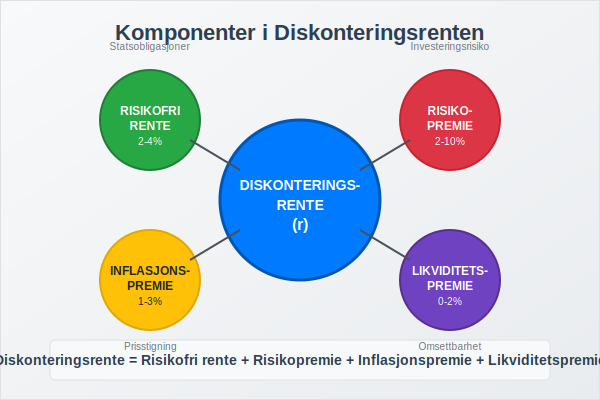

### Komponenter i Diskonteringsrenten:

* **Risikofri rente:** Typisk statsobligasjonsrente
* **Risikopremie:** Kompensasjon for investeringsrisiko
* **Inflasjonspremie:** Kompensasjon for forventet [inflasjon](/blogs/regnskap/hva-er-inflasjon "Hva er Inflasjon? Komplett Guide til Inflasjon i Regnskap og Økonomi")
* **Likviditetspremie:** Kompensasjon for manglende likviditet

Diskonteringsrenter hentes ofte fra markedsbaserte [yield](/blogs/regnskap/hva-er-yield "Hva er Yield? Komplett Guide til Yield-Analyse og Beregning i Regnskap") på sammenlignbare investeringer, som obligasjonsyields eller forventet aksjeavkastning.

### Vanlige Diskonteringsrenter:

| Type Investering | Typisk Diskonteringsrente |
|------------------|---------------------------|
| **Statsobligasjoner** | 2-4% |
| **Bedriftsobligasjoner** | 4-8% |
| **Eiendomsinvesteringer** | 6-10% |
| **Aksjer/Egenkapital** | 8-15% |
| **Høyrisiko prosjekter** | 15%+ |

## NÃ¥verdi (Present Value) Beregninger

Nåverdi er dagens verdi av fremtidige kontantstrømmer diskontert med en passende rente.

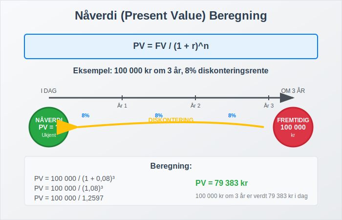

### Grunnleggende NÃ¥verdi Formel:

**PV = FV / (1 + r)^n**

Hvor:
- PV = NÃ¥verdi (Present Value)
- FV = Fremtidig verdi (Future Value)
- r = Diskonteringsrente
- n = Antall perioder

### Eksempel på Enkelt Nåverdi:

**Situasjon:** Du skal motta 100 000 kr om 3 år. Diskonteringsrenten er 8%.

**Beregning:**
```
PV = 100 000 / (1 + 0,08)^3
PV = 100 000 / 1,2597
PV = 79 383 kr
```

## Netto NÃ¥verdi (NPV)

**Netto nåverdi** (Net Present Value) er summen av alle diskonterte kontantstrømmer minus den opprinnelige investeringen.

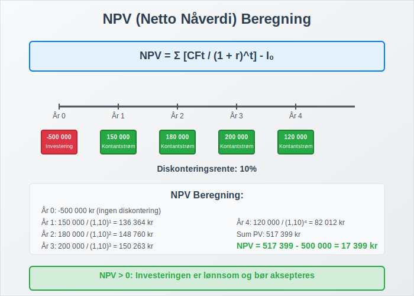

### NPV Formel:

**NPV = Σ [CFt / (1 + r)^t] - I0**

Hvor:
- CFt = Kontantstrøm i periode t
- r = Diskonteringsrente
- t = Tidsperiode
- I0 = Opprinnelig investering

### NPV Beslutningsregler:

* **NPV > 0:** Investeringen er lønnsom
* **NPV = 0:** Investeringen gir akkurat ønsket avkastning
* **NPV < 0:** Investeringen er ulønnsom

## Praktiske Eksempler på Diskontering

La oss se på hvordan diskontering brukes i praksis gjennom konkrete eksempler.

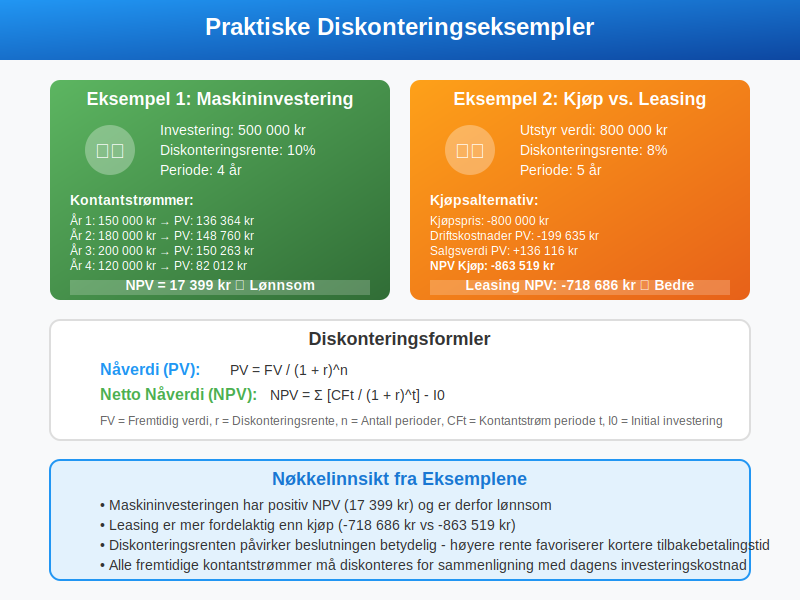

### Eksempel 1: Maskininvestering

**Situasjon:** Et selskap vurderer å kjøpe en maskin for 500 000 kr som vil generere følgende kontantstrømmer:

| År | Kontantstrøm |
|----|--------------|
| 1  | 150 000 kr   |
| 2  | 180 000 kr   |
| 3  | 200 000 kr   |
| 4  | 120 000 kr   |

**Diskonteringsrente:** 10%

**NPV Beregning:**
```
Ã…r 1: 150 000 / (1,10)^1 = 136 364 kr
Ã…r 2: 180 000 / (1,10)^2 = 148 760 kr
Ã…r 3: 200 000 / (1,10)^3 = 150 263 kr
Ã…r 4: 120 000 / (1,10)^4 = 82 012 kr

Total PV = 517 399 kr
NPV = 517 399 - 500 000 = 17 399 kr
```

**Konklusjon:** Investeringen er lønnsom (NPV > 0).

### Eksempel 2: Leasingavtale

**Situasjon:** Sammenligning av kjøp vs. leasing av utstyr.

**Kjøpsalternativ:**
- Kjøpspris: 800 000 kr
- Ã…rlige driftskostnader: 50 000 kr
- Salgsverdi etter 5 år: 200 000 kr

**Leasingalternativ:**
- Ã…rlig leasingkostnad: 180 000 kr (inkludert service)

**Diskonteringsrente:** 8%

**Kjøp NPV:**
```
Kjøpspris: -800 000 kr
Driftskostnader PV: -50 000 × 3,9927 = -199 635 kr
Salgsverdi PV: 200 000 / (1,08)^5 = 136 116 kr
NPV Kjøp = -863 519 kr
```

**Leasing NPV:**
```
Leasingkostnader PV: -180 000 × 3,9927 = -718 686 kr
NPV Leasing = -718 686 kr
```

**Konklusjon:** Leasing er mer fordelaktig (-718 686 kr vs. -863 519 kr).

## Diskontering i Regnskapsføring

Diskontering spiller en viktig rolle i flere regnskapsområder og standarder.

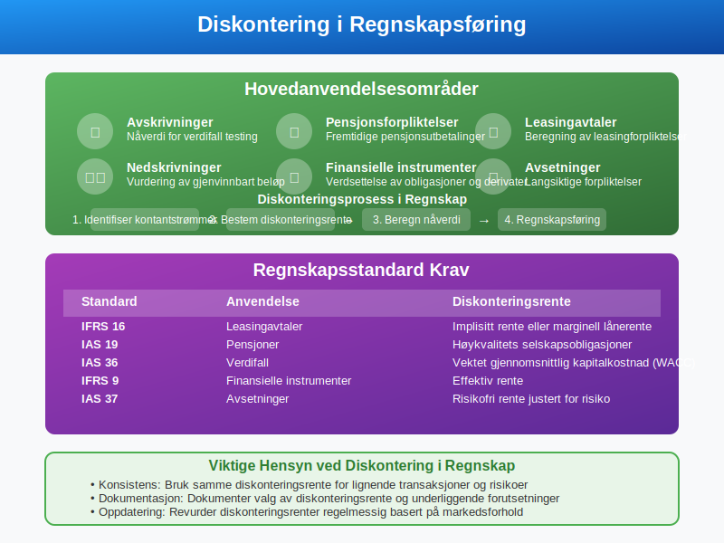

### Anvendelsesområder:

* **[Avskrivninger](/blogs/regnskap/hva-er-avskrivning "Hva er Avskrivning i Regnskap? Metoder, Beregning og Praktiske Eksempler"):** Beregning av nåverdi for verdifall testing
* **Pensjonsforpliktelser:** Diskontering av fremtidige pensjonsutbetalinger
* **[Leasingavtaler](/blogs/regnskap/leasing "Leasing i regnskap - Komplett guide til leasing i norsk regnskap")**: Beregning av leasingforpliktelser
* **Nedskrivninger:** Vurdering av gjenvinnbart beløp
* **Finansielle instrumenter:** Verdsettelse av obligasjoner og derivater

### Regnskapsstandard Krav:

| Standard | Anvendelse | Diskonteringsrente |
|----------|------------|-------------------|
| **IFRS 16** | Leasingavtaler | Implisitt rente eller marginell lånerente |
| **IAS 19** | Pensjoner | Høykvalitets selskapsobligasjoner |
| **IAS 36** | Verdifall | Vektet gjennomsnittlig kapitalkostnad (WACC) |
| **IFRS 9** | Finansielle instrumenter | Effektiv rente |

## Diskonteringsmetoder

Det finnes flere metoder for å utføre diskonteringsberegninger avhengig av kontantstrømmenes natur.

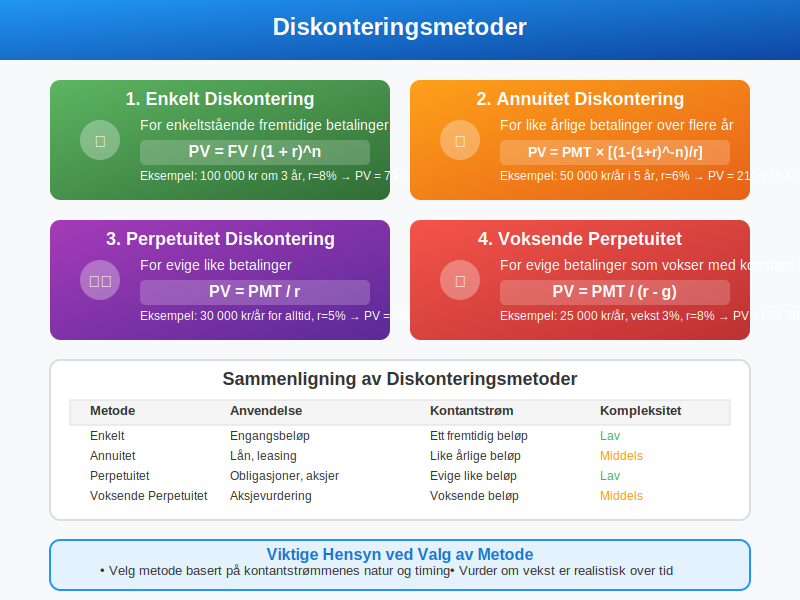

### 1. Enkelt Diskontering

For enkeltstående fremtidige betalinger:
**PV = FV / (1 + r)^n**

### 2. Annuitet Diskontering

For like årlige betalinger over flere år:
**PV = PMT × [(1 - (1 + r)^-n) / r]**

### 3. Perpetuitet Diskontering

For evige like betalinger:
**PV = PMT / r**

### 4. Voksende Perpetuitet

For evige betalinger som vokser med konstant rate:
**PV = PMT / (r - g)**

## Diskontering og Investeringsanalyse

Diskontering er grunnlaget for flere viktige investeringsanalyseverktøy.

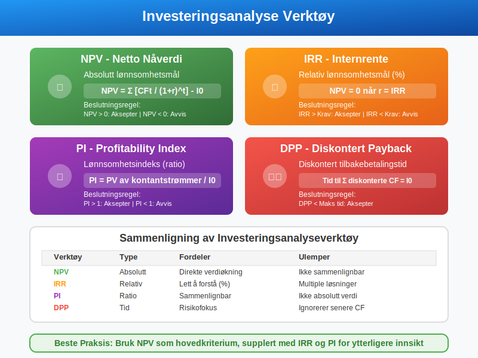

### Viktige Nøkkeltall:

* **NPV (Netto Nåverdi):** Absolutt lønnsomhetsmål
* **IRR (Internrente):** Relativ lønnsomhetsmål
* **PI (Profitability Index):** Lønnsomhetsindeks
* **DPP (Discounted Payback Period):** Diskontert tilbakebetalingstid

### IRR (Internal Rate of Return)

IRR er den diskonteringsrenten som gjør NPV = 0.

**Beslutningsregel:**
- IRR > Krav til avkastning: Aksepter prosjektet
- IRR < Krav til avkastning: Avvis prosjektet

## Faktorer som PÃ¥virker Diskonteringsrenten

Flere faktorer må vurderes når man setter diskonteringsrenten.

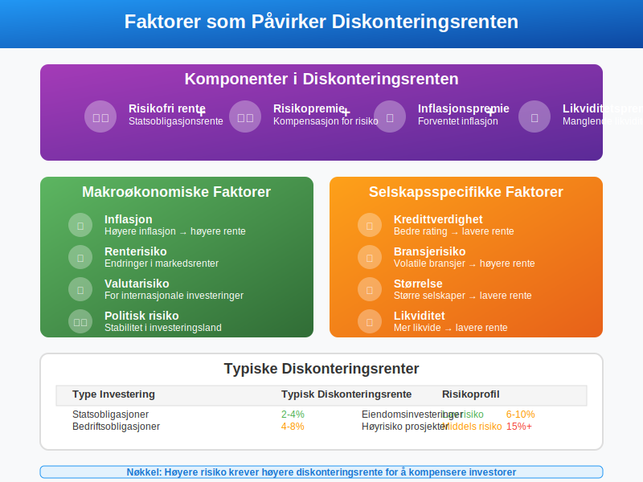

### Makroøkonomiske Faktorer:

* **Inflasjon:** Høyere inflasjon → høyere diskonteringsrente
* **Renterisiko:** Endringer i markedsrenter
* **Valutarisiko:** For internasjonale investeringer
* **Politisk risiko:** Stabilitet i investeringsland

### Selskapsspecifikke Faktorer:

* **Kredittverdighet:** Bedre rating → lavere rente
* **Bransjerisiko:** Volatile bransjer → høyere rente
* **Størrelse:** Større selskaper → lavere rente
* **Likviditet:** Mer likvide investeringer → lavere rente

## Vanlige Feil ved Diskontering

Det er flere vanlige feil som gjøres ved diskonteringsberegninger.

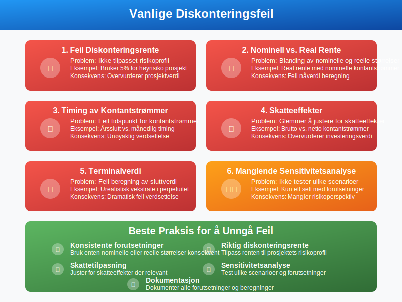

### Typiske Feil:

* **Feil diskonteringsrente:** Ikke tilpasset risikoprofil
* **Nominell vs. real rente:** Blanding av nominelle og reelle størrelser
* **Timing av kontantstrømmer:** Feil tidspunkt for kontantstrømmer
* **Skatt:** Glemmer å justere for skatteeffekter
* **Terminalverdi:** Feil beregning av sluttverdi

### Beste Praksis:

* Bruk konsistente forutsetninger (nominell/real)
* Juster for skatt der relevant
* Utfør sensitivitetsanalyse
* Dokumenter alle forutsetninger
* Bruk konservative estimater ved usikkerhet

## Diskontering i Ulike Bransjer

Anvendelsen av diskontering varierer mellom bransjer.

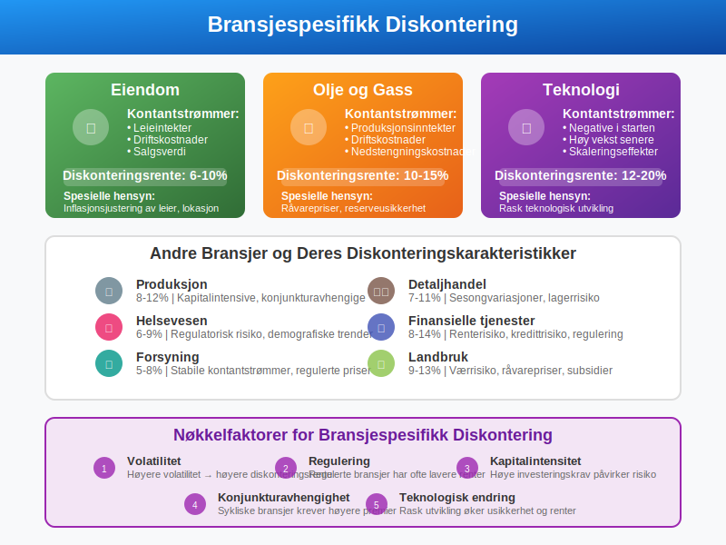

### Eiendom

* **Kontantstrømmer:** Leieintekter, driftskostnader, salgsverdi
* **Diskonteringsrente:** 6-10% avhengig av lokasjon og type
* **Spesielle hensyn:** Inflasjonsjustering av leier

### Olje og Gass

* **Kontantstrømmer:** Produksjonsinntekter minus driftskostnader
* **Diskonteringsrente:** 10-15% på grunn av høy risiko
* **Spesielle hensyn:** RÃ¥varepriser, reserveusikkerhet

### Teknologi

* **Kontantstrømmer:** Ofte negative i starten, høy vekst senere
* **Diskonteringsrente:** 12-20% på grunn av høy risiko
* **Spesielle hensyn:** Rask teknologisk utvikling

## Diskontering og [Budsjettering](/blogs/regnskap/hva-er-budsjettering "Hva er Budsjettering? Komplett Guide til Budsjettplanlegging og Økonomistyring")

Diskontering er viktig i langsiktig budsjettering og strategisk planlegging.

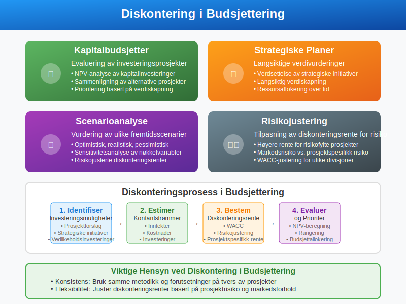

### Anvendelse i Budsjetter:

* **Kapitalbudsjetter:** Evaluering av investeringsprosjekter
* **Strategiske planer:** Langsiktige verdivurderinger
* **Scenarioanalyse:** Vurdering av ulike fremtidsscenarier
* **Risikojustering:** Tilpasning av diskonteringsrente for risiko

## Digitale Verktøy for Diskontering

Moderne regnskaps- og finansprogrammer har innebygde diskonteringsfunksjoner.

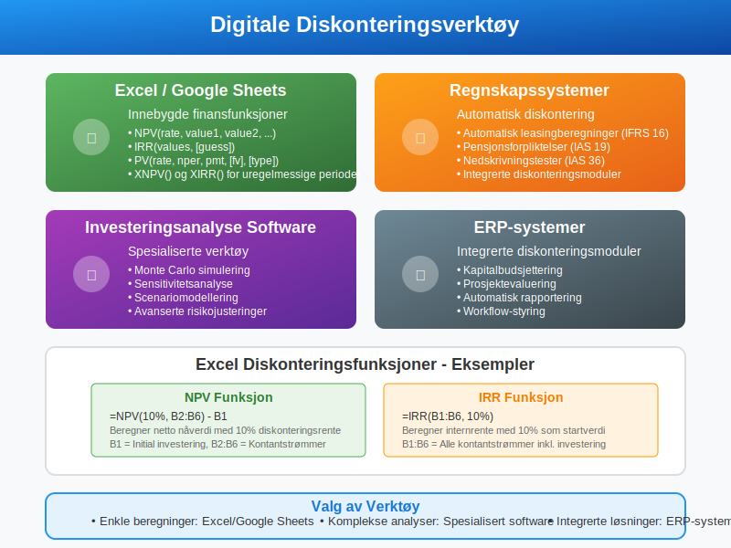

### Populære Verktøy:

* **Excel/Google Sheets:** NPV(), IRR(), PV() funksjoner
* **Regnskapssystemer:** Automatisk diskontering av leasingavtaler
* **Investeringsanalyse software:** Spesialiserte verktøy
* **ERP-systemer:** Integrerte diskonteringsmoduler

### Excel Funksjoner:

```
=NPV(rate, value1, value2, ...)
=IRR(values, [guess])
=PV(rate, nper, pmt, [fv], [type])
```

## Regulatoriske Krav til Diskontering

Ulike regnskapsregler krever spesifikke tilnærminger til diskontering.

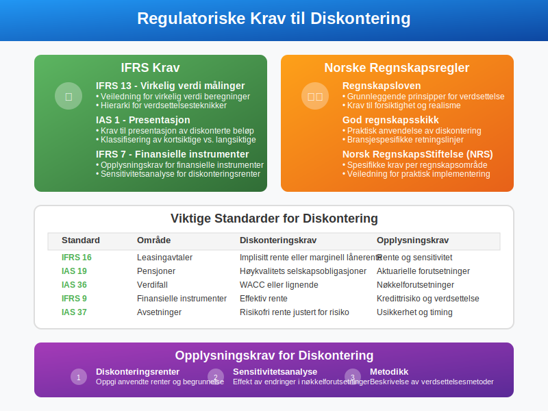

### IFRS Krav:

* **IFRS 13:** Veiledning for virkelig verdi målinger
* **IAS 1:** Krav til presentasjon av diskonterte beløp
* **IFRS 7:** Opplysningskrav for finansielle instrumenter

### Norske Regnskapsregler:

* **Regnskapsloven:** Grunnleggende prinsipper
* **God regnskapsskikk:** Praktisk anvendelse
* **Regnskapsstandard:** Spesifikke krav per område

## Fremtidige Trender innen Diskontering

Diskonteringsmetoder utvikler seg med nye teknologier og regnskapsregler.

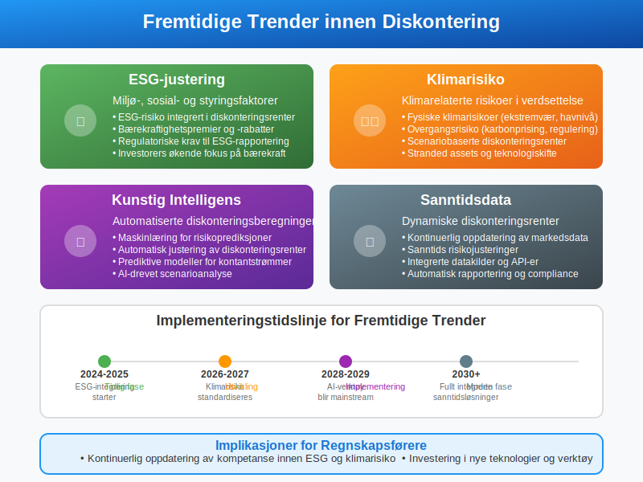

### Nye Utviklinger:

* **ESG-justering:** Miljø-, sosial- og styringsfaktorer i diskonteringsrente
* **Klimarisiko:** Justering for klimarelaterte risikoer
* **Kunstig intelligens:** Automatiserte diskonteringsberegninger
* **Sanntidsdata:** Dynamiske diskonteringsrenter

## Konklusjon

Diskontering er et fundamentalt konsept i regnskap og finans som gjør det mulig å sammenligne verdier på tvers av tid. Forståelse av **nåverdi**, **diskonteringsrenter** og **NPV-beregninger** er essensielt for:

* Investeringsbeslutninger
* Regnskapsføring av langsiktige forpliktelser
* Strategisk planlegging og [budsjettering](/blogs/regnskap/hva-er-budsjettering "Hva er Budsjettering? Komplett Guide til Budsjettplanlegging og Økonomistyring")
* Verdsettelse av eiendeler og selskaper

Ved å mestre diskonteringsteknikker kan bedrifter ta bedre finansielle beslutninger og overholde regnskapsstandarder. Det er viktig å velge riktig diskonteringsrente, forstå risikofaktorer, og anvende konsistente metoder for å oppnå pålitelige resultater.

Husk at diskontering er både en kunst og en vitenskap - tekniske ferdigheter må kombineres med god forretningsforståelse og sunt skjønn for å oppnå de beste resultatene.


