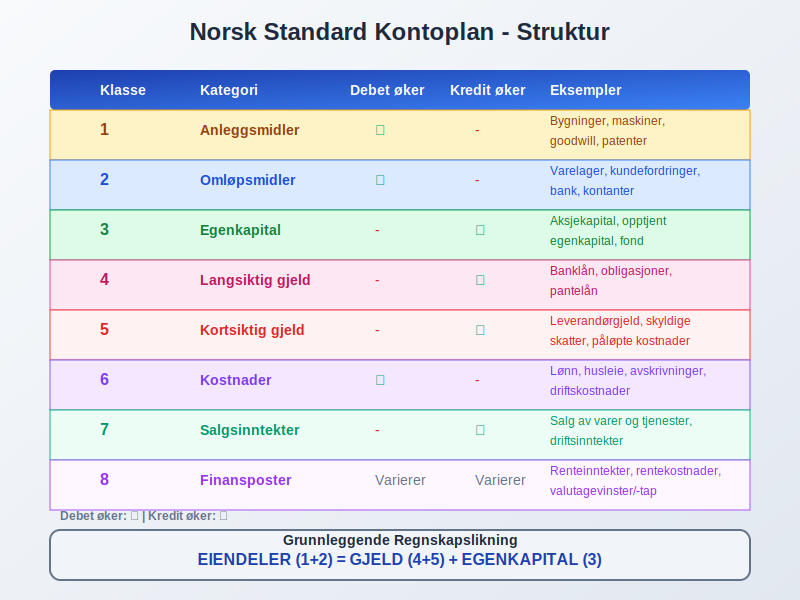

**Dobbel bokføring** er det fundamentale regnskapssystemet som danner grunnlaget for moderne [bokføring](/blogs/regnskap/hva-er-bokforing "Hva er Bokføring? En Komplett Guide til Norsk Bokføringspraksis") og [regnskap](/blogs/regnskap/hva-er-regnskap "Hva er regnskap? En dybdeanalyse for Norge") verden over. Dette systemet, som har sine røtter tilbake til 1400-tallet, sikrer at alle økonomiske transaksjoner registreres på en måte som opprettholder den grunnleggende regnskapsligningen og gir fullstendig sporbarhet.

## Hva er Dobbel Bokføring?

Dobbel bokføring, også kalt **dobbelt bokføringssystem**, er en regnskapsmetode hvor hver økonomisk transaksjon registreres med minst to poster som påvirker forskjellige kontoer. Det grunnleggende prinsippet er at for hver [debet](/blogs/regnskap/hva-er-debet "Hva er Debet i Regnskap? Komplett Guide til Debetposter og Bokføring")-post må det være en tilsvarende [kredit](/blogs/regnskap/hva-er-kreditere "Hva er Kreditere? En Komplett Guide til Kreditering i Regnskap og Kontering")-post, slik at den totale summen alltid balanserer.

### Grunnleggende Prinsipper

**De fire grunnpilarene i dobbel bokføring:**

* **Balansering:** Hver transaksjon må balansere - total debet = total kredit
* **Dualitet:** Hver transaksjon påvirker minst to kontoer
* **Sporbarhet:** Alle poster kan spores tilbake til originale [bilag](/blogs/regnskap/hva-er-bilag "Hva er Bilag i Regnskap? Komplett Guide til Regnskapsbilag")
* **Kontinuitet:** Systemet gir en komplett og kronologisk oversikt over alle transaksjoner

## Historisk Bakgrunn og Utvikling

### Fra Luca Pacioli til Moderne Systemer

Dobbel bokføring ble først systematisk beskrevet av den italienske munken **Luca Pacioli** i 1494 i hans verk "Summa de Arithmetica". Hans metode, kjent som den "venetianske metoden", la grunnlaget for moderne regnskapsprinsipper.

**Viktige milepæler:**

| År | Hendelse | Betydning |
|---|---|---|
| 1494 | Paciolis "Summa de Arithmetica" | Første systematiske beskrivelse |
| 1600-tallet | Spredning til Nord-Europa | Etablering i handelsnasjonene |
| 1800-tallet | Industrialiseringens krav | Utvikling av kostnadsregnskap |
| 1900-tallet | Standardisering | Nasjonale regnskapsstandarder |
| 2000-tallet | Digital revolusjon | Automatiserte bokføringssystemer |

## Debet og Kredit - Systemets Hjerte

### Forståelse av Debet og Kredit

I dobbel bokføring har **debet** og **kredit** spesifikke betydninger som avhenger av kontotypen:

**Debet (Dr.) øker:**
* [Anleggsmidler](/blogs/regnskap/hva-er-anleggsmidler "Hva er Anleggsmidler? Komplett Guide til Varige Driftsmidler")
* Omløpsmidler
* Kostnader og utgifter
* Tap

**[Kredit](/blogs/regnskap/hva-er-kreditere "Hva er Kreditere? En Komplett Guide til Kreditering i Regnskap og Kontering") (Kr.) øker:**
* Egenkapital
* Gjeld (både lang- og kortsiktig)
* Inntekter
* Gevinster

### Praktiske Eksempler på Dobbel Bokføring

**Eksempel 1: Kjøp av kontorutstyr for 50 000 kr**

| Konto | Debet | Kredit |
|---|---|---|
| Kontorutstyr (konto 1840) | 50 000 | |
| Bank (konto 1920) | | 50 000 |

**Eksempel 2: Salg av varer for 100 000 kr + 25% MVA**

| Konto | Debet | Kredit |
|---|---|---|
| Kundefordringer (konto 1500) | 125 000 | |
| Salgsinntekt (konto 3000) | | 100 000 |
| Utgående MVA (konto 2700) | | 25 000 |

**Eksempel 3: Betaling av lønn 200 000 kr**

| Konto | Debet | Kredit |
|---|---|---|
| Lønnskostnad (konto 5000) | 200 000 | |
| Bank (konto 1920) | | 200 000 |

## Regnskapsligningen og Balansering

### Den Grunnleggende Regnskapsligningen

Dobbel bokføring bygger på den fundamentale regnskapsligningen:

**EIENDELER = GJELD + EGENKAPITAL**

Denne ligningen må alltid være i balanse, og hver transaksjon må opprettholde denne balansen.

### Utvidet Regnskapsligningen

For å inkludere inntekter og kostnader:

**EIENDELER + KOSTNADER = GJELD + EGENKAPITAL + INNTEKTER**

### Balansekontroll og Prøvebalanse

En **prøvebalanse** er et verktøy som sikrer at alle debetposter er lik alle kreditposter:

| Kontotype | Debet | Kredit |
|---|---|---|
| Eiendeler | 2 500 000 | |
| Gjeld | | 800 000 |
| Egenkapital | | 1 200 000 |
| Inntekter | | 1 500 000 |
| Kostnader | 1 000 000 | |
| **TOTALT** | **3 500 000** | **3 500 000** |

## Kontoplaner og Kontoklassifisering

### Norsk Standard Kontoplan

I Norge følger de fleste virksomheter den standardiserte [**kontoplanen**](/blogs/regnskap/hva-er-kontoplan "Hva er en Kontoplan? Komplett Guide til Kontoplaner i Norsk Regnskap") som er tilpasset [bokføringsloven](/blogs/regnskap/hva-er-bokforingsloven "Hva er Bokføringsloven? Krav, Regler og Praktisk Veiledning"). En velorganisert kontoplan er fundamentet for effektiv dobbel bokføring:

**Detaljert kontoklasseoversikt:**

| Klasse | Kategori | Debet øker | Kredit øker | Eksempler |
|---|---|---|---|---|
| 1 | Anleggsmidler | œ“ | | Bygninger, maskiner, goodwill |
| 2 | Omløpsmidler | œ“ | | Varelager, kundefordringer, bank |
| 3 | Egenkapital | | œ“ | [Aksjekapital](/blogs/regnskap/hva-er-aksjekapital "Hva er Aksjekapital? Komplett Guide til Aksjekapital i AS"), opptjent egenkapital |
| 4 | Langsiktig gjeld | | œ“ | Banklån, obligasjoner |
| 5 | Kortsiktig gjeld | | œ“ | Leverandørgjeld, skyldige skatter |
| 6 | Kostnader | œ“ | | Lønn, husleie, [avskrivninger](/blogs/regnskap/hva-er-avskrivning "Hva er Avskrivning? Komplett Guide til Avskrivningsmetoder") |
| 7 | Salgsinntekter | | œ“ | Salg av varer og tjenester |
| 8 | Finansposter | Varierer | Varierer | Renteinntekter, rentekostnader |

## Praktisk Implementering av Dobbel Bokføring

### Bokføringsjournal og Hovedbok

**Bokføringsprosessen følger disse trinnene:**

1. **Journalføring:** Transaksjoner registreres kronologisk i journalen
2. **Postering:** Journalposter overføres til hovedboken
3. **Prøvebalanse:** Kontroll av at debet = kredit
4. **Justeringsposter:** Periodisering og korrigeringer
5. **Avslutningsposter:** Overføring til [balanse](/blogs/regnskap/hva-er-balanse "Hva er Balanse? Komplett Guide til Balanseregnskap") og resultatregnskap

### Periodisering og Justeringsposter

**Viktige justeringsposter i dobbel bokføring:**

* **Påløpte kostnader:** Kostnader som er pådratt men ikke betalt
* **Forskuddsbetalte kostnader:** Kostnader betalt på forhånd
* **Påløpte inntekter:** Inntekter opptjent men ikke mottatt
* **Utsatte inntekter:** Inntekter mottatt på forhånd

**Eksempel på periodisering - forskuddsbetalt forsikring:**

| Transaksjon | Konto | Debet | Kredit |
|---|---|---|---|
| Betaling av årsforsikring | Forskuddsbetalt forsikring | 12 000 | |
| | Bank | | 12 000 |
| Månedlig periodisering | Forsikringskostnad | 1 000 | |
| | Forskuddsbetalt forsikring | | 1 000 |

## Fordeler med Dobbel Bokføring

### Kontroll og Nøyaktighet

**Innebygde kontrollmekanismer:**

* **Automatisk balansekontroll:** Systemet avdekker feil umiddelbart
* **Fullstendig sporbarhet:** Alle transaksjoner kan følges fra start til slutt
* **Redusert feilrisiko:** Dobbel registrering reduserer sannsynligheten for feil
* **Systematisk oppbygning:** Strukturert tilnærming til regnskapsføring

### Informasjonsverdi og Rapportering

**Omfattende finansiell informasjon:**

* **Detaljert innsikt:** Fullstendig oversikt over virksomhetens økonomiske stilling
* **Sammenlignbarhet:** Standardisert format gjør sammenligning mulig
* **Beslutningsgrunnlag:** Solid fundament for økonomiske beslutninger
* **Lovmessig compliance:** Oppfyller krav i [bokføringsregler](/blogs/regnskap/hva-er-bokforingsregler "Hva er Bokføringsregler? Komplett Guide til Norske Bokføringsstandarder")

### Analyse og Nøkkeltall

Dobbel bokføring muliggjør beregning av viktige finansielle nøkkeltall:

| Nøkkeltall | Formel | Formål |
|---|---|---|
| [Arbeidskapital](/blogs/regnskap/hva-er-arbeidskapital "Hva er Arbeidskapital? En Komplett Guide til Working Capital") | Omløpsmidler - Kortsiktig gjeld | Likviditetsvurdering |
| Egenkapitalandel | Egenkapital / Total kapital × 100% | Soliditetsmåling |
| [Dekningsgrad](/blogs/regnskap/hva-er-dekningsgrad "Hva er Dekningsgrad? Komplett Guide til Likviditetsanalyse") | Omløpsmidler / Kortsiktig gjeld | Betalingsevne |
| Totalrentabilitet | Resultat / Total kapital × 100% | Lønnsomhetsmåling |

## Moderne Digitale Løsninger

### Automatisering og Integrasjon

**Dagens bokføringssystemer tilbyr:**

* **Automatisk bilagsgjenkjenning:** OCR-teknologi for [bilagsregistrering](/blogs/regnskap/hva-er-bilagsregistrere "Hva er Bilagsregistrering? Komplett Guide til Digital Bilagsbehandling")
* **Bankintegrasjon:** Automatisk import av banktransaksjoner
* **Fakturahåndtering:** Integrert [faktura](/blogs/regnskap/hva-er-en-faktura "Hva er en Faktura? En Guide til Norske Fakturakrav")-behandling
* **Sanntidsrapportering:** Øyeblikkelig tilgang til finansielle rapporter

### Kunstig Intelligens og Maskinlæring

**Fremtidens bokføring inkluderer:**

* **Intelligent kategorisering:** Automatisk kontotildeling basert på historiske data
* **Anomalideteksjon:** Identifisering av uvanlige transaksjoner
* **Prediktiv analyse:** Prognoser basert på historiske mønstre
* **Automatisk avstemming:** AI-drevet [bankavstemming](/blogs/regnskap/hva-er-bankavstemming "Hva er Bankavstemming? Komplett Guide til Bankavstemminger")

## Vanlige Feil og Hvordan Unngå Dem

### Typiske Feilkilder

**De mest vanlige feilene i dobbel bokføring:**

1. **Feil [kontering](/blogs/regnskap/hva-er-kontering "Hva er Kontering? En Komplett Guide til Kontokoding i Regnskap"):** Bruk av feil kontonummer
2. **Ubalanserte poster:** Debet ‰  kredit
3. **Manglende bilag:** Transaksjoner uten dokumentasjon
4. **Periodiseringsfeil:** Feil tidspunkt for registrering
5. **Avrundingsfeil:** Små differanser som akkumuleres

### Forebyggende Tiltak

**Beste praksis for feilfri bokføring:**

* **Systematisk kontroll:** Regelmessig prøvebalanse og avstemming
* **Dokumentasjon:** Sikre at alle transaksjoner har tilhørende bilag
* **Opplæring:** Kontinuerlig kompetanseutvikling
* **Kvalitetssikring:** Implementere kontrollrutiner og godkjenningsprosesser

## Dobbel Bokføring vs. Enkel Bokføring

### Sammenligning av Systemer

| Aspekt | Dobbel Bokføring | Enkel Bokføring |
|---|---|---|
| **Kompleksitet** | Høy, men mer nøyaktig | Enkel, men begrenset |
| **Kontroll** | Innebygd balansekontroll | Ingen automatisk kontroll |
| **Informasjonsverdi** | Omfattende finansiell innsikt | Begrenset oversikt |
| **Lovkrav** | Påkrevd for de fleste virksomheter | Kun for små enkeltpersonforetak |
| **Feildeteksjon** | Automatisk identifisering | Manuell kontroll nødvendig |
| **Rapportering** | Fullstendige finansielle rapporter | Grunnleggende inn/ut-oversikt |

### Når Velge Hvilket System?

**Dobbel bokføring anbefales for:**
* Alle [aksjeselskap](/blogs/regnskap/hva-er-et-aksjeselskap "Hva er et Aksjeselskap (AS)? Komplett Guide til Norske AS") (lovpålagt)
* Virksomheter med omsetning over 5 MNOK
* Bedrifter som ønsker detaljert økonomisk styring
* Virksomheter med komplekse transaksjoner

**Enkel bokføring kan brukes av:**
* Små enkeltpersonforetak under omsetningsgrensen
* Virksomheter med svært enkle økonomiske forhold

## Internasjonale Standarder og Harmonisering

### IFRS og Dobbel Bokføring

**International Financial Reporting Standards (IFRS)** bygger på prinsippene fra dobbel bokføring og sikrer global sammenlignbarhet:

* **Konsistente prinsipper:** Samme grunnleggende logikk verden over
* **Transparens:** Klar og sammenlignbar rapportering
* **Kvalitetssikring:** Høye standarder for finansiell rapportering

### Norske Tilpasninger

Norge har implementert IFRS med nasjonale tilpasninger som reflekterer:

* **Norsk lovgivning:** Tilpasning til [bokføringsloven](/blogs/regnskap/hva-er-bokforingsloven "Hva er Bokføringsloven? Krav, Regler og Praktisk Veiledning")
* **Skattemessige hensyn:** Integrasjon med norsk skatterett
* **Kulturelle faktorer:** Norske forretningstradisjoner og praksis

## Fremtiden for Dobbel Bokføring

### Teknologiske Trender

**Utviklingen går mot:**

* **Blockchain-teknologi:** Uforanderlig transaksjonshistorikk
* **Sanntidsbokføring:** Øyeblikkelig registrering og rapportering
* **Automatisering:** Minimal manuell inngripen
* **Integrerte økosystemer:** Sømløs kobling mellom alle forretningssystemer

### Utfordringer og Muligheter

**Viktige utviklingsområder:**

* **Cybersikkerhet:** Beskyttelse av sensitive finansielle data
* **Regulatorisk tilpasning:** Oppdatering av lover og regler
* **Kompetanseutvikling:** Opplæring i nye teknologier
* **Standardisering:** Harmonisering av digitale formater

## Konklusjon

Dobbel bokføring forblir det ubestridte fundamentet for moderne regnskapsføring og finansiell rapportering. Dette systemet, som har utviklet seg over mer enn 500 år, kombinerer matematisk presisjon med praktisk anvendelighet for å gi virksomheter den kontroll og innsikt de trenger for å lykkes.

**Nøkkelpunkter å huske:**

* **Balansering er alt:** Hver transaksjon må balansere mellom debet og kredit
* **Systematisk tilnærming:** Følg etablerte prosedyrer og kontrollrutiner
* **Kontinuerlig læring:** Hold deg oppdatert på nye teknologier og regelverk
* **Kvalitetsfokus:** Prioriter nøyaktighet og fullstendighet i alle registreringer

Ved å mestre prinsippene for dobbel bokføring legger du grunnlaget for solid økonomisk styring og overholdelse av norske [bokføringsregler](/blogs/regnskap/hva-er-bokforingsregler "Hva er Bokføringsregler? Komplett Guide til Norske Bokføringsstandarder"). Dette systemet vil fortsette å være relevant selv når teknologien utvikler seg, fordi de grunnleggende prinsippene for økonomisk balanse og sporbarhet forblir uforandret.

For virksomheter som ønsker å implementere eller forbedre sitt dobbelte bokføringssystem, anbefales det å arbeide med kvalifiserte regnskapsførere og investere i moderne, integrerte bokføringssystemer som automatiserer rutineoppgaver samtidig som de opprettholder de strenge kravene til nøyaktighet og kontroll som kjennetegner dobbel bokføring.

