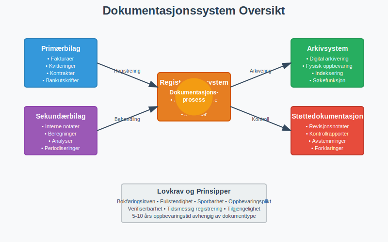
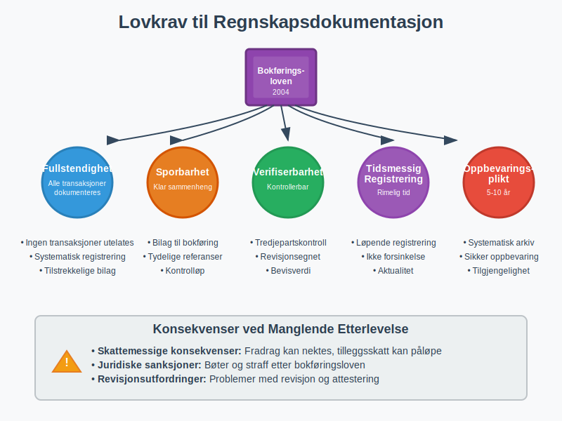
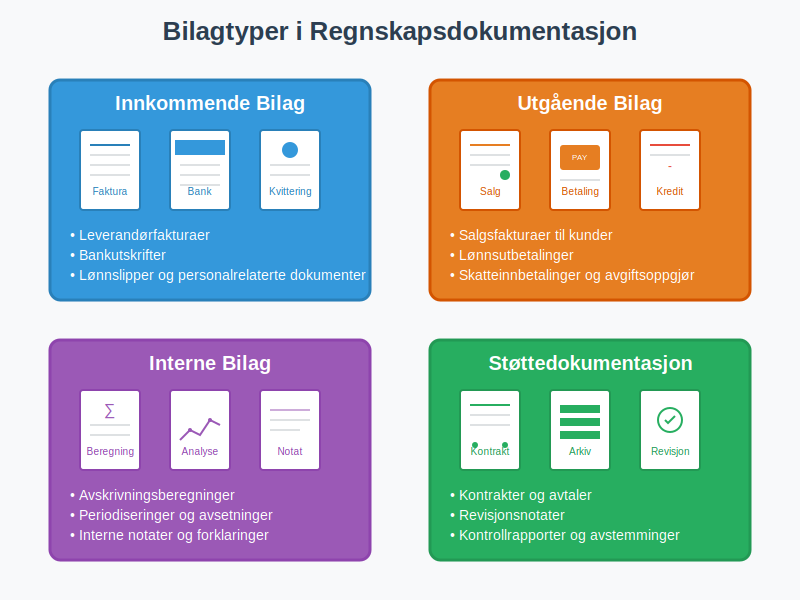
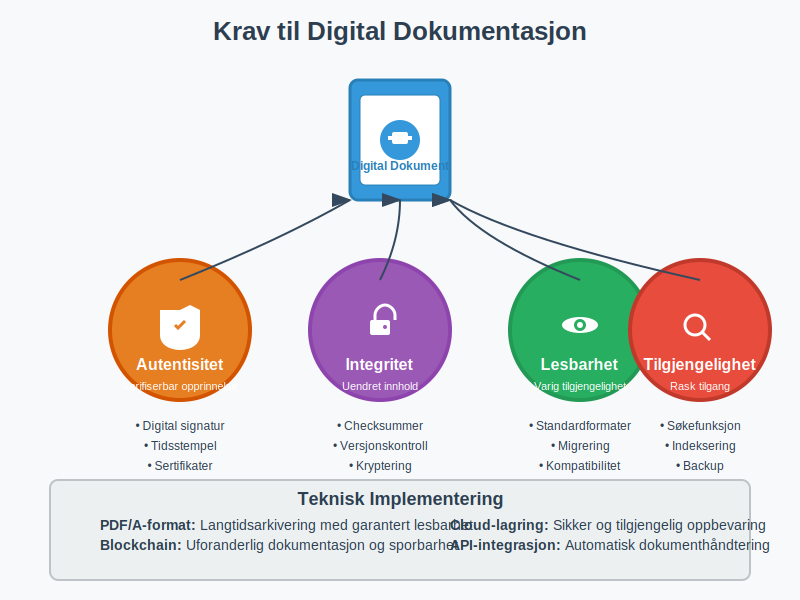
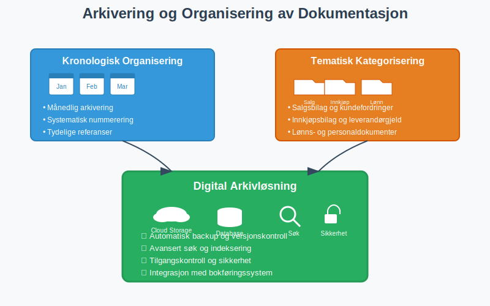
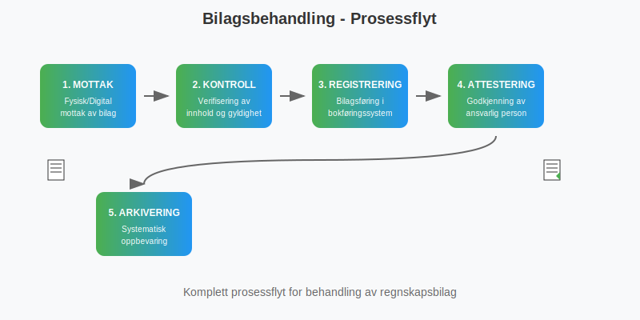
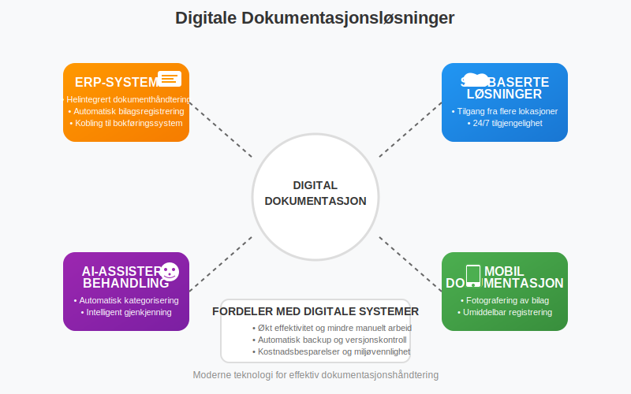
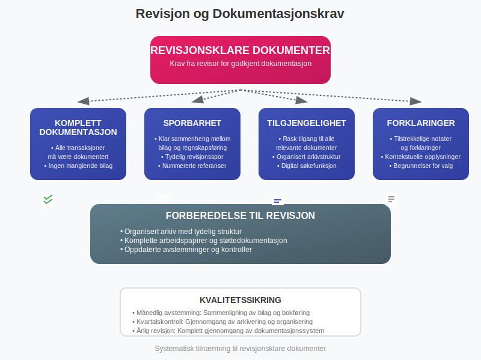
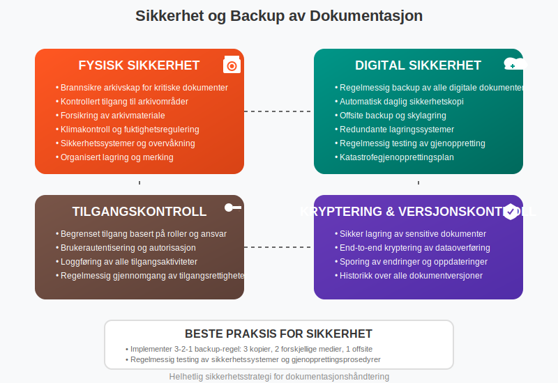

---
title: "Hva er Dokumentasjon i Regnskap og Bokføring? Komplett Guide til Regnskapsdokumentasjon"
seoTitle: "Dokumentasjon i regnskap | Krav, oppbevaring og bilag"
description: "Dokumentasjon i regnskap og bokføring sikrer sporbarhet og kontroll. Lær lovkrav, oppbevaringstid, bilagstyper og gode rutiner for dokumentasjon."
summary: "Komplett guide til regnskapsdokumentasjon: krav i bokføringsloven, oppbevaring, bilag og digital arkivering."
---

**Dokumentasjon i regnskap og bokføring** er det juridiske og praktiske fundamentet som sikrer sporbarhet, kontroll og etterlevelse av norske regnskapsregler. Som en kritisk del av [bokføring](/blogs/regnskap/hva-er-bokforing "Hva er Bokføring? En Komplett Guide til Norsk Bokføringspraksis") og [regnskapsføring](/blogs/regnskap/hva-er-regnskap "Hva er regnskap? En dybdeanalyse for Norge"), omfatter dokumentasjon alle bilag, registreringer og støttedokumenter som kreves for å bevise og forklare økonomiske transaksjoner.

## Hva er Dokumentasjon i Regnskap og Bokføring?

**Regnskapsdokumentasjon** er samlingen av alle dokumenter, bilag og registreringer som støtter og beviser de økonomiske transaksjonene som er ført i virksomhetens regnskap. Dette inkluderer både fysiske og digitale dokumenter som sammen danner et komplett sporingsløp fra den opprinnelige transaksjonen til den endelige regnskapsføringen.

### Hovedkomponenter i Regnskapsdokumentasjon

* **Primærbilag:** [Fakturaer](/blogs/regnskap/hva-er-en-faktura "Hva er en Faktura? En Guide til Norske Fakturakrav"), kvitteringer, kontrakter og andre originaldokumenter
* **Sekundærbilag:** Interne dokumenter som støtter regnskapsføringen
* **Registreringer:** [Bilagsføring](/blogs/regnskap/hva-er-bilagsforing "Hva er Bilagsføring? Komplett Guide til Regnskapsbilag og Dokumentasjon") og bokføringsregistre
* **Støttedokumentasjon:** Beregninger, analyser og forklarende notater
* **Arkivmateriale:** Organisert oppbevaring av all dokumentasjon

## Lovkrav til Regnskapsdokumentasjon

[Bokføringsloven](/blogs/regnskap/hva-er-bokforingsloven "Hva er Bokføringsloven? Krav, Regler og Praktisk Veiledning") og [bokføringsforskriften](/blogs/regnskap/hva-er-bokforingsforskriften "Hva er Bokføringsforskriften? Detaljerte Regler for Norsk Bokføring") setter strenge krav til dokumentasjon av regnskapsopplysninger.

### Grunnleggende Dokumentasjonskrav

**Lovpålagte prinsipper:**

* **Fullstendighet:** Alle transaksjoner må dokumenteres med tilstrekkelige [bilag](/blogs/regnskap/hva-er-bilag "Hva er Bilag i Regnskap? Komplett Guide til Regnskapsbilag")
* **Sporbarhet:** Klar sammenheng mellom bilag og regnskapsføring
* **Verifiserbarhet:** Dokumentasjonen må kunne kontrolleres av tredjeparter
* **Tidsmessig registrering:** Dokumentasjon må skje innen rimelig tid
* **Oppbevaringsplikt:** Systematisk arkivering i påkrevd periode

### Oppbevaringstid for Regnskapsdokumentasjon

| Dokumenttype | Oppbevaringstid | Særlige krav |
|---|---|---|
| Regnskapsbilag | 5 år | Fra regnskapsårets slutt |
| Årsregnskap | 10 år | Inkludert revisjonsberetning |
| Grunnlagsdokumenter | 5 år | Kontrakter, avtaler, fullmakter |
| Lønnsopplysninger | 5 år | Personalregistre og lønnsbilag |
| MVA-dokumentasjon | 10 år | Alle MVA-relaterte bilag |
| Skattemessige dokumenter | 10 år | Grunnlag for skatteberegning |

For en omfattende guide til **[oppbevaring av regnskapsmateriale](/blogs/regnskap/oppbevaring-av-regnskapsmateriale "Oppbevaring av Regnskapsmateriale - Krav, Frister og Beste Praksis i Norge")**, inkludert detaljerte oppbevaringsfrister, digitale løsninger, sikkerhetskrav og compliance-strategier, se vår spesialiserte artikkel.

## Typer Regnskapsdokumentasjon

### 1. Primære Regnskapsbilag

**Innkommende bilag:**
* Leverandørfakturaer og kreditnotaer
* Bankutskrifter og kontoutskrifter
* Lønnslipper og personalrelaterte dokumenter
* Offentlige avgifter og skattedokumenter
* Forsikringsdokumenter og premier

**Utgående bilag:**
* Salgsfakturaer til kunder
* Kreditnotaer og debetnotaer
* **Gjenpartsbrev:** En attestert kopi av et [bilag](/blogs/regnskap/hva-er-bilag "Hva er bilag? Dokumentasjon av transaksjoner") som bekrefter at kopien er identisk med originaldokumentet.
* Lønnsutbetalinger og personalutgifter
* Skatteinnbetalinger og avgiftsoppgjør

### 2. Støttedokumentasjon og Interne Bilag

**Interne beregninger:**
* [Avskrivningsberegninger](/blogs/regnskap/hva-er-avskrivning "Hva er Avskrivning? Komplett Guide til Avskrivningsmetoder og Regler") og -planer
* [Amortiseringsplaner](/blogs/regnskap/hva-er-amortisering "Hva er Amortisering? Komplett Guide til Amortisering av Immaterielle Eiendeler") for immaterielle eiendeler
* Varetellinger og lageroppgjør
* Periodiseringer og avsetninger

**Kontraktsgrunnlag:**
* Kjøps- og salgsavtaler
* Leieavtaler og serviceavtaler
* Forsikringspoliser
* Lånekontrakter og finansieringsavtaler

### 3. Digitale Dokumenter og Elektronisk Arkivering

**Digitale bilag:**
* E-fakturaer og elektroniske betalingsbilag
* Digitale bankutskrifter
* Elektroniske kvitteringer
* Skannede dokumenter

**Krav til digital dokumentasjon:**
* **Autentisitet:** Dokumentets opprinnelse må kunne verifiseres
* **Integritet:** Innholdet må være uendret siden opprettelsen
* **Lesbarhet:** Dokumentet må være lesbart gjennom hele oppbevaringsperioden
* **Tilgjengelighet:** Rask og enkel tilgang for kontroll og revisjon

## Organisering og Arkivering av Regnskapsdokumentasjon

### Systematisk Arkivering

**Kronologisk organisering:**
* Månedlig arkivering av løpende bilag
* Årlig samling av årsavslutningsdokumenter
* Systematisk nummerering og referanser

**Tematisk kategorisering:**
* Salgsbilag og kundefordringer
* Innkjøpsbilag og leverandørgjeld
* Lønns- og personaldokumenter
* Bank- og finansdokumenter
* Skatte- og avgiftsdokumenter
* Spesialdokumentasjon som [kjørebøker](/blogs/regnskap/hva-er-kjorebok "Hva er Kjørebok? Komplett Guide til Kjørebok for Bedrifter i Norge") for bilkostnadsfradrag

### Digital Arkivløsning

| Arkivkomponent | Funksjon | Beste praksis |
|---|---|---|
| Dokumenthåndtering | Mottak og registrering | Automatisk [bilagsmottak](/blogs/regnskap/hva-er-bilagsmottak "Hva er Bilagsmottak? Digitale Løsninger for Effektiv Bilagsbehandling") |
| Indeksering | Søk og gjenfinning | Konsistent navngiving og tagging |
| Sikkerhet | Tilgangskontroll | Backup og versjonskontroll |
| Integrasjon | Kobling til bokføringssystem | Automatisk [bilagsregistrering](/blogs/regnskap/hva-er-bilagsregistrere "Hva er Bilagsregistrering? Effektiv Håndtering av Regnskapsbilag") |

## Dokumentasjon i Praktisk Bokføring

### 1. Bilagsbehandling og Registrering

**Innkommende bilagsflyt:**
1. **Mottak:** Fysisk eller digital mottak av bilag
2. **Kontroll:** Verifisering av innhold og gyldighet
3. **Registrering:** [Bilagsføring](/blogs/regnskap/hva-er-bilagsforing "Hva er Bilagsføring? Komplett Guide til Regnskapsbilag og Dokumentasjon") i bokføringssystem
4. **[Attestering](/blogs/regnskap/hva-er-attestering "Hva er Attestering? Komplett Guide til Regnskapsattestering og Kontroll"):** Godkjenning av ansvarlig person
5. **Arkivering:** Systematisk oppbevaring

**Utgående bilagsflyt:**
1. **Opprettelse:** Generering av salgsfakturaer eller andre utgående bilag
2. **Utsendelse:** Levering til mottaker
3. **Oppfølging:** Kontroll av betaling og eventuelle reklamasjoner
4. **Arkivering:** Oppbevaring av kopier og betalingsbekreftelser

### 2. Kvalitetssikring av Dokumentasjon

**Kontrollrutiner:**
* **Månedlig [avstemming](/blogs/regnskap/hva-er-avstemming "Hva er Avstemming i Regnskap? Komplett Guide til Regnskapsavstemming"):** Sammenligning av bilag og bokføring
* **Kvartalskontroll:** Gjennomgang av arkivering og organisering
* **Årlig revisjon:** Komplett gjennomgang av dokumentasjonssystem

**Vanlige feil og hvordan unngå dem:**
* **Manglende bilag:** Implementer rutiner for komplett bilagssamling
* **Feil datering:** Bruk transaksjonsdato, ikke mottaksdato
* **Utilstrekkelig beskrivelse:** Legg til forklarende notater ved behov
* **Dårlig arkivering:** Etabler konsistente arkiveringsrutiner

## Digitale Løsninger for Dokumentasjon

### Moderne Dokumentasjonssystemer

**Integrerte løsninger:**
* **ERP-systemer:** Helintegrert dokumenthåndtering
* **Skybaserte løsninger:** Tilgang fra flere lokasjoner
* **AI-assistert behandling:** Automatisk kategorisering og registrering
* **Mobil dokumentasjon:** Fotografering og umiddelbar registrering

**Fordeler med digitale systemer:**
* **Effektivitet:** Raskere behandling og mindre manuelt arbeid
* **Sikkerhet:** Automatisk backup og versjonskontroll
* **Tilgjengelighet:** 24/7 tilgang fra flere enheter
* **Miljøvennlighet:** Redusert papirforbruk
* **Kostnadsbesparelser:** Mindre fysisk lagringsplass

### Implementering av Digital Dokumentasjon

**Faser i digitaliseringsprosessen:**

1. **Kartlegging:** Analyse av eksisterende dokumentasjonsrutiner
2. **Planlegging:** Utvikling av digital strategi og systemvalg
3. **Implementering:** Gradvis overgang til digitale løsninger
4. **Opplæring:** Kompetansebygging for ansatte
5. **Optimalisering:** Kontinuerlig forbedring av prosesser

## Dokumentasjon og Revisjon

### Revisjonsklare Dokumenter

**Krav fra revisor:**
* **Komplett dokumentasjon:** Alle transaksjoner må være dokumentert
* **Sporbarhet:** Klar sammenheng mellom bilag og regnskapsføring
* **Tilgjengelighet:** Rask tilgang til alle relevante dokumenter
* **Forklaringer:** Tilstrekkelige notater og forklaringer

**Forberedelse til revisjon:**
* Organisert arkiv med tydelig struktur
* Komplette [arbeidspapirer](/blogs/regnskap/hva-er-arbeidspapirer-revisjon "Hva er Arbeidspapirer i Revisjon? Komplett Guide til Revisjonsdokumentasjon") og støttedokumentasjon
* Oppdaterte avstemminger og kontroller
* Tilgjengelig personale for spørsmål og oppklaringer

## Beste Praksis for Regnskapsdokumentasjon

### Etablering av Dokumentasjonsrutiner

**Daglige rutiner:**
* Umiddelbar registrering av alle bilag
* Konsistent navngiving og arkivering
* Regelmessig backup av digitale dokumenter

**Månedlige rutiner:**
* Komplett gjennomgang av alle bilag
* [Bankavstemming](/blogs/regnskap/hva-er-bankavstemming "Hva er Bankavstemming? Komplett Guide til Bankavstemminger") og kontroll
* Oppdatering av arkivsystem

**Årlige rutiner:**
* Komplett arkivering av årets dokumenter
* Gjennomgang og opprydding i arkivsystem
* Evaluering og forbedring av dokumentasjonsrutiner

### Sikkerhet og Backup

**Fysisk sikkerhet:**
* Brannsikre arkivskap for kritiske dokumenter
* Kontrollert tilgang til arkivområder
* Forsikring av arkivmateriale

**Digital sikkerhet:**
* **Regelmessig backup:** Daglig sikkerhetskopi av alle digitale dokumenter
* **Tilgangskontroll:** Begrenset tilgang basert på roller og ansvar
* **Kryptering:** Sikker lagring av sensitive dokumenter
* **Versjonskontroll:** Sporing av endringer og oppdateringer

## Fremtiden for Regnskapsdokumentasjon

### Teknologiske Trender

**Kunstig intelligens:**
* Automatisk kategorisering og registrering av bilag
* Intelligent gjenkjenning av dokumenttyper
* Prediktiv analyse for kvalitetskontroll

**Blockchain-teknologi:**
* Uforanderlig dokumentasjon og sporbarhet
* Automatiske smarte kontrakter
* Desentralisert arkivering

**Skybaserte løsninger:**
* Ubegrenset lagringskapasitet
* Global tilgjengelighet
* Automatiske oppdateringer og vedlikehold

### Regulatoriske Endringer

**Kommende krav:**
* Strengere krav til digital dokumentasjon
* Økt fokus på cybersikkerhet
* Harmonisering med internasjonale standarder

**Forberedelser:**
* Kontinuerlig oppdatering av systemer
* Kompetansebygging innen nye teknologier
* Proaktiv tilpasning til nye regelverk

## Konklusjon

**Dokumentasjon i regnskap og bokføring** er fundamentet for pålitelig finansiell rapportering og lovmessig etterlevelse. Gjennom systematisk organisering, moderne digitale løsninger og beste praksis sikrer virksomheter både effektiv drift og juridisk trygghet.

Effektiv dokumentasjon krever:
* **Systematisk tilnærming:** Klare rutiner og prosedyrer
* **Teknologisk støtte:** Moderne digitale løsninger
* **Kontinuerlig forbedring:** Regelmessig evaluering og oppdatering
* **Kompetanse:** Opplæring og utvikling av personale

Ved å investere i solid dokumentasjonspraksis legger virksomheter grunnlaget for både daglig drift og langsiktig vekst, samtidig som de oppfyller alle lovmessige krav til regnskapsføring og arkivering.

