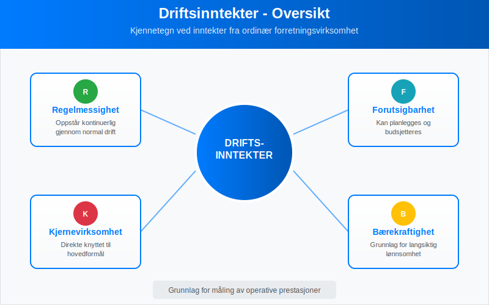
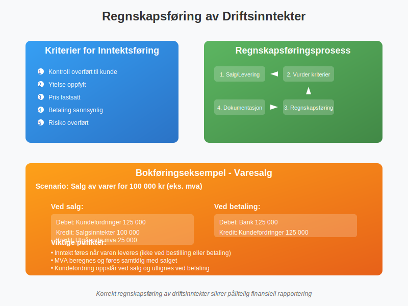
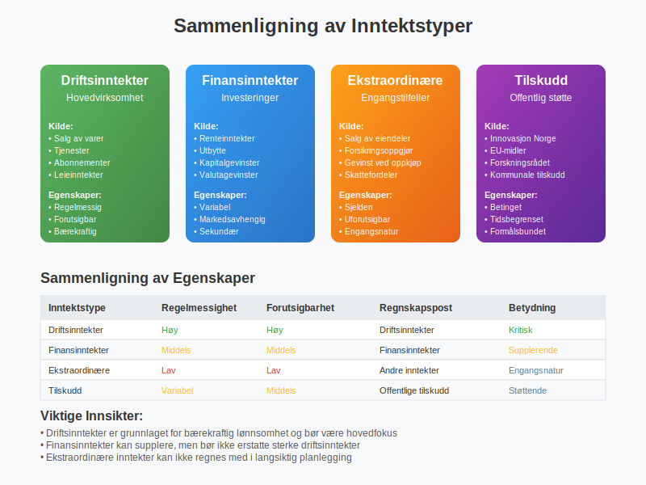
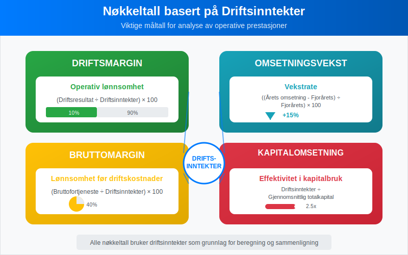
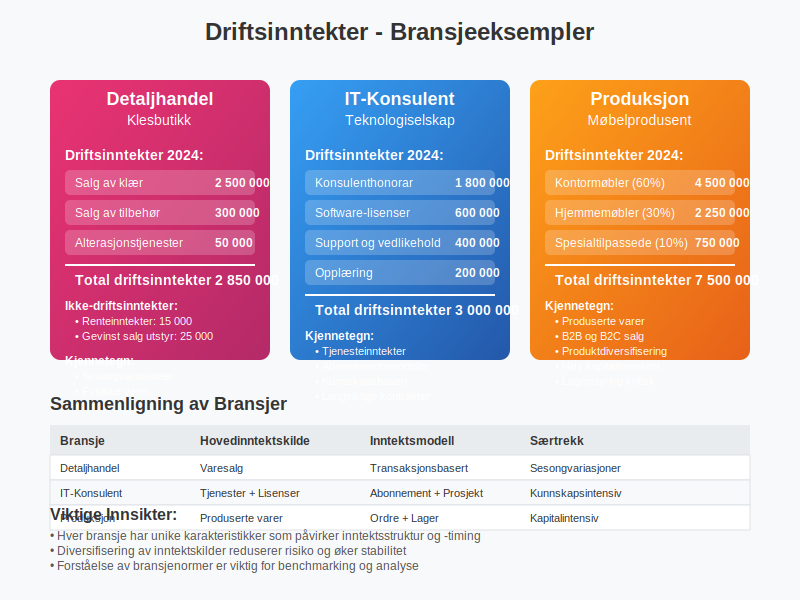
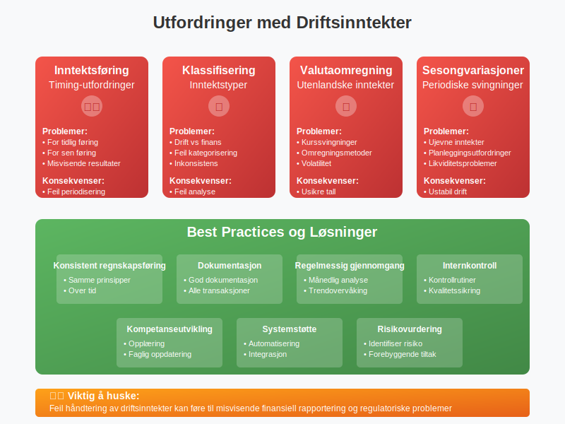
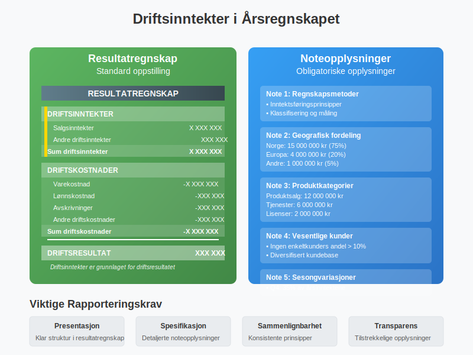
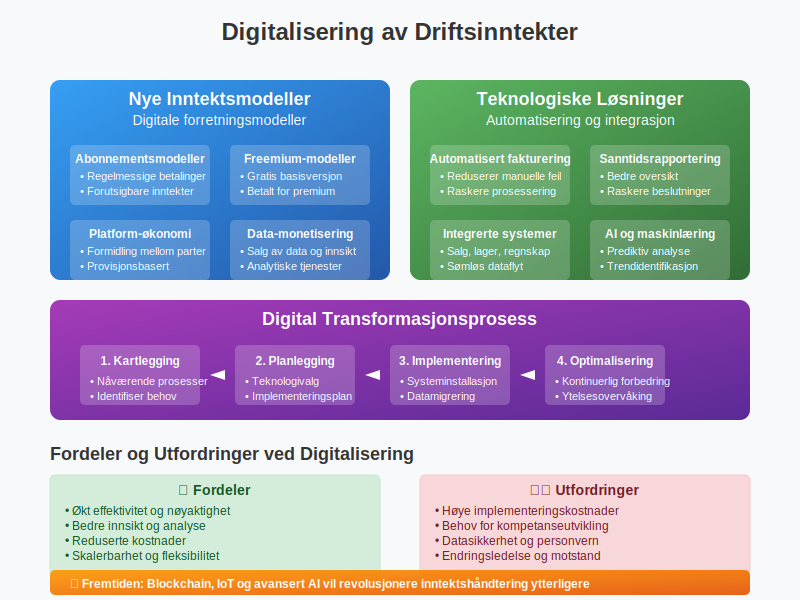

---
title: "Hva er driftsinntekter?"
seoTitle: "Hva er driftsinntekter?"
meta_description: '**Driftsinntekter** er inntekter som oppstår fra et selskaps ordinære forretningsvirksomhet og utgjør grunnlaget for å måle selskapets operative lønnsomhe...'
slug: hva-er-driftsinntekter
type: blog
layout: pages/single
---

**Driftsinntekter** er inntekter som oppstår fra et selskaps ordinære forretningsvirksomhet og utgjør grunnlaget for å måle selskapets operative lønnsomhet. Som en viktig del av selskapets totale [inntekter](/blogs/regnskap/hva-er-inntekter "Hva er Inntekter? Komplett Guide til Inntektstyper og Regnskapsføring"), skiller driftsinntekter seg fra [Finansinntekter](/blogs/regnskap/finansinntekt "Finansinntekt “ Komplett guide til renter, utbytte og kapitalgevinster i norsk regnskap") som kommer fra investeringer og finansielle aktiviteter, ved at de representerer verdien av varer og tjenester som selskapet leverer til sine kunder. Driftsinntekter utgjør hovedkomponenten i selskapets [omsetning](/blogs/regnskap/hva-er-omsetning "Hva er Omsetning? Komplett Guide til Omsetning i Regnskap og Skatt"), men måles eksklusive merverdiavgift.

## Definisjon og Betydning av Driftsinntekter

Driftsinntekter er alle inntekter som genereres gjennom selskapets **hovedvirksomhet** og normale forretningsdrift. Disse inntektene er avgjørende for å vurdere selskapets evne til å skape verdi gjennom sin kjernevirksomhet.



### Kjennetegn ved Driftsinntekter:

* **Regelmessighet:** Oppstår kontinuerlig gjennom normal drift
* **Forutsigbarhet:** Kan planlegges og budsjetteres
* **Kjernevirksomhet:** Direkte knyttet til selskapets hovedformål
* **Bærekraftighet:** Grunnlag for langsiktig lønnsomhet

## Kategorier av Driftsinntekter

Driftsinntekter kan deles inn i flere hovedkategorier avhengig av virksomhetens art og hvordan inntektene genereres.


### Hovedkategorier:

| Kategori | Beskrivelse | Eksempler |
|----------|-------------|-----------|
| **[Salgsinntekter](/blogs/kontoplan/3000-salgsinntekt-handelsvarer-avgiftspl-hoy-sats "Konto 3000 - Salgsinntekt handelsvarer avgiftspl. høy sats")** | Inntekter fra salg av varer | Produktsalg, varesalg, handelsvarer |
| **Tjenesteinntekter** | Inntekter fra leverte tjenester | [Konsulenthonorar](/blogs/regnskap/hva-er-honorar "Hva er Honorar i Regnskap? Komplett Guide til Honorarutbetalinger og Skattebehandling"), reparasjoner, vedlikehold |
| **Abonnementsinntekter** | Regelmessige inntekter fra abonnementer | Software-lisenser, [medlemskap](/blogs/regnskap/hva-er-kontingent "Hva er Kontingent? Komplett Guide til Medlemsavgifter og Regnskapsføring"), streaming |
| **[Leieinntekter](/blogs/kontoplan/3600-leieinntekt-fast-eiendom "Konto 3600 - Leieinntekt fast eiendom")** | Inntekter fra utleie av eiendeler | Lokaler, maskiner, utstyr |
| **Royalty-inntekter** | Inntekter fra lisensavtaler | Patenter, varemerker, opphavsrett |
| **[Annen driftsrelatert inntekt, avgiftspliktig](/blogs/kontoplan/3900-annen-driftsrelatert-inntekt-avgiftspliktig "Konto 3900 - Annen driftsrelatert inntekt, avgiftspliktig")** | Inntekter relatert til drift som ikke dekkes av andre kontoer og som er avgiftspliktige | Gebyrer, tilleggsavgifter, andre avgiftspliktige driftsinntekter |
| **[Annen driftsrelatert inntekt, avgiftsfritt](/blogs/kontoplan/3950-annen-driftsrelatert-inntekt-avgiftsfritt "Konto 3950 - Annen driftsrelatert inntekt, avgiftsfritt")** | Inntekter relatert til drift som ikke dekkes av andre kontoer og som er avgiftsfrie | Rabatter, gratisprøver og avgiftsfrie serviceavgifter |

### 1. Salgsinntekter

Salgsinntekter er den vanligste formen for driftsinntekter og omfatter alle inntekter fra salg av varer som er en del av selskapets ordinære virksomhet.

**Eksempler på salgsinntekter:**
* Detaljhandel: Salg av varer til sluttbrukere
* Produksjon: Salg av produserte varer til grossister eller kunder
* Import/eksport: Salg av importerte eller eksporterte varer

### 2. Tjenesteinntekter

Tjenesteinntekter oppstår når selskapet leverer tjenester som en del av sin hovedvirksomhet.

**Eksempler på tjenesteinntekter:**
* Konsulentselskaper: Rådgivning og ekspertise
* IT-selskaper: Systemutvikling og support
* Regnskapsselskaper: [Bokføring](/blogs/regnskap/hva-er-bokforing "Hva er Bokføring? Komplett Guide til Regnskapsføring") og regnskapsføring

## Regnskapsføring av Driftsinntekter

Driftsinntekter regnskapsføres i henhold til **inntektsføringsprinsippet** og må oppfylle spesifikke kriterier for å kunne føres i regnskapet.



### Kriterier for Inntektsføring:

1. **Kontroll overført:** Kunden har fått kontroll over varen/tjenesten
2. **Ytelse oppfylt:** Selskapet har oppfylt sine forpliktelser
3. **Pris fastsatt:** Transaksjonsbeløpet er bestemt
4. **Betaling sannsynlig:** Det er sannsynlig at betaling vil skje
5. **Risiko overført:** Risiko og fordeler er overført til kjøper

### Bokføringseksempel - Varesalg:

**Ved salg av varer for 100 000 kr (eks. mva):**
```
Debet: Kundefordringer    125 000  (inkl. 25% mva)
Kredit: Salgsinntekter    100 000
Kredit: Utgående mva       25 000
```

**Ved betaling fra kunde:**
```
Debet: Bank               125 000
Kredit: Kundefordringer   125 000
```

## Forskjellen mellom Driftsinntekter og Andre Inntektstyper

Det er viktig å skille mellom driftsinntekter og andre former for inntekter i regnskapet for å få et korrekt bilde av selskapets operative ytelse.



### Sammenligning av Inntektstyper:

| Inntektstype | Kilde | Regelmessighet | Regnskapspost |
|--------------|-------|----------------|---------------|
| **Driftsinntekter** | Hovedvirksomhet | Regelmessig | Driftsinntekter |
| **[Finansinntekter](/blogs/regnskap/finansinntekt "Finansinntekt “ Komplett guide til renter, utbytte og kapitalgevinster i norsk regnskap")** | Investeringer, renter | Variabel | Finansinntekter |
| **Ekstraordinære inntekter** | Engangstilfeller | Sjelden | Andre inntekter |
| **Tilskudd** | Offentlige støtteordninger | Variabel | Offentlige tilskudd |

### [Finansinntekter](/blogs/regnskap/finansinntekt "Finansinntekt “ Komplett guide til renter, utbytte og kapitalgevinster i norsk regnskap") vs Driftsinntekter:

**[Finansinntekter](/blogs/regnskap/finansinntekt "Finansinntekt “ Komplett guide til renter, utbytte og kapitalgevinster i norsk regnskap")** inkluderer:
* Renteinntekter fra bankinnskudd
* Utbytte fra investeringer
* Gevinst ved salg av finansielle instrumenter
* Valutagevinster

**Driftsinntekter** inkluderer:
* Alle inntekter fra kjernevirksomheten
* Salg av varer og tjenester
* [Leieinntekter](/blogs/kontoplan/3600-leieinntekt-fast-eiendom "Konto 3600 - Leieinntekt fast eiendom") fra driftsmidler
* Royalty fra forretningsaktiviteter

## Måling og Analyse av Driftsinntekter

Driftsinntekter er grunnlaget for flere viktige nøkkeltall som brukes til å vurdere selskapets prestasjoner og lønnsomhet.



### Viktige Nøkkeltall:

| Nøkkeltall | Formel | Betydning |
|------------|--------|-----------|
| **Driftsmargin** | (Driftsresultat ÷ Driftsinntekter) × 100 | Operativ lønnsomhet |
| **Omsetningsvekst** | ((Årets omsetning - Fjorårets) ÷ Fjorårets) × 100 | Vekstrate |
| **Bruttomargin** | ([Bruttofortjeneste](/blogs/regnskap/hva-er-bruttofortjeneste "Hva er Bruttofortjeneste? Beregning og Analyse av Bruttomargin") ÷ Driftsinntekter) × 100 | Lønnsomhet før driftskostnader |
| **Kapitalomsetning** | Driftsinntekter ÷ Gjennomsnittlig totalkapital | Effektivitet i kapitalbruk |

### Eksempel på Analyse:

**Selskap A - Resultatregnskap (forenklet):**
```
Driftsinntekter:           5 000 000 kr
Varekostnad:              -3 000 000 kr
Bruttofortjeneste:         2 000 000 kr
Driftskostnader:          -1 500 000 kr
Driftsresultat:              500 000 kr
```

**Nøkkeltall:**
* Bruttomargin: (2 000 000 ÷ 5 000 000) × 100 = 40%
* Driftsmargin: (500 000 ÷ 5 000 000) × 100 = 10%

## Praktiske Eksempler fra Ulike Bransjer

La oss se på hvordan driftsinntekter fungerer i praksis gjennom eksempler fra forskjellige bransjer.



### Eksempel 1: Detaljhandel

**Situasjon:** En klesbutikk med følgende aktiviteter i 2024:

**Driftsinntekter:**
* Salg av klær: 2 500 000 kr
* Salg av tilbehør: 300 000 kr
* Alterasjonstjenester: 50 000 kr
* **Totale driftsinntekter: 2 850 000 kr**

**Ikke-driftsinntekter:**
* Renteinntekter fra bankkonto: 15 000 kr
* Gevinst ved salg av gammelt utstyr: 25 000 kr

### Eksempel 2: IT-Konsulentselskap

**Situasjon:** Et IT-selskap med diversifiserte inntektsstrømmer:

**Driftsinntekter:**
* Konsulenthonorar: 1 800 000 kr
* Software-lisenser: 600 000 kr
* Support og vedlikehold: 400 000 kr
* Opplæring: 200 000 kr
* **Totale driftsinntekter: 3 000 000 kr**

### Eksempel 3: Produksjonsselskap

**Situasjon:** En møbelprodusent med følgende inntektsstruktur:

| Produktkategori | Driftsinntekter | Andel av total |
|-----------------|-----------------|----------------|
| Kontormøbler | 4 500 000 kr | 60% |
| Hjemmemøbler | 2 250 000 kr | 30% |
| Spesialtilpassede møbler | 750 000 kr | 10% |
| **Total** | **7 500 000 kr** | **100%** |

## Utfordringer og Fallgruver

Ved håndtering av driftsinntekter er det flere utfordringer og fallgruver som selskaper må være oppmerksomme på.



### Vanlige Utfordringer:

1. **Inntektsføring på riktig tidspunkt**
   - For tidlig inntektsføring kan gi misvisende resultater
   - For sen inntektsføring kan undervurdere prestasjoner

2. **Klassifisering av inntekter**
   - Skille mellom drifts- og finansinntekter
   - Korrekt kategorisering av ulike inntektstyper

3. **Valutaomregning**
   - Håndtering av utenlandske driftsinntekter
   - Valutakurssvingninger påvirker rapporterte tall

4. **Sesongvariasjoner**
   - Mange virksomheter har sesongmessige svingninger
   - Viktig å analysere trender over tid

### Best Practices:

* **Konsistent regnskapsføring:** Bruk samme prinsipper over tid
* **Dokumentasjon:** Hold god dokumentasjon på alle transaksjoner
* **Regelmessig gjennomgang:** Analyser inntektstrender månedlig
* **Internkontroll:** Etabler gode kontrollrutiner for inntektsføring

## Driftsinntekter i Årsregnskapet

Driftsinntekter presenteres på spesifikke måter i årsregnskapet i henhold til norske regnskapsstandarder.



### Presentasjon i Resultatregnskapet:

**Standard oppstilling:**
```
RESULTATREGNSKAP

DRIFTSINNTEKTER
Salgsinntekter                    X XXX XXX
Andre driftsinntekter               XXX XXX
Sum driftsinntekter               X XXX XXX

DRIFTSKOSTNADER
Varekostnad                      -X XXX XXX
Lønnskostnad                       -XXX XXX
Avskrivninger                      -XXX XXX
Andre driftskostnader              -XXX XXX
Sum driftskostnader              -X XXX XXX

DRIFTSRESULTAT                     XXX XXX
```

### Noteopplysninger:

Selskaper må gi tilleggsopplysninger om driftsinntekter i notene til årsregnskapet:

* **Geografisk fordeling** av inntekter
* **Produktkategorier** eller tjenestesegmenter
* **Vesentlige kundeforhold** (hvis relevant)
* **Sesongmessige variasjoner**
* **Regnskapsmetoder** for inntektsføring

## Skattemessige Aspekter

Driftsinntekter har også skattemessige konsekvenser som selskaper må være oppmerksomme på.

### Skatteplikt:

* **Alminnelig inntekt:** Driftsinntekter inngår i grunnlaget for selskapsskatt
* **Merverdiavgift:** De fleste driftsinntekter er mva-pliktige
* **Forskuddstrekk:** Gjelder for lønn og honorarer

### Timing:

* **Regnskapsføring vs skatteføring:** Kan være forskjeller i tidspunkt
* **Forskuddsbetalinger:** Håndtering av mottatte forskudd
* **Langsiktige kontrakter:** Spesielle regler for store prosjekter

## Digitalisering og Moderne Utfordringer

Digitaliseringen har skapt nye utfordringer og muligheter for håndtering av driftsinntekter.



### Nye Inntektsmodeller:

* **Abonnementsmodeller:** Regelmessige betalinger for tjenester
* **Freemium-modeller:** Gratis basisversjon, betalt for premium
* **Platform-økonomi:** Inntekter fra formidling mellom parter
* **Data-monetisering:** Inntekter fra salg av data og innsikt

### Teknologiske Løsninger:

* **Automatisert fakturering:** Reduserer manuelle feil
* **Sanntidsrapportering:** Bedre oversikt over inntektsstrømmer
* **Integrerte systemer:** Kobling mellom salg, lager og regnskap
* **AI og maskinlæring:** Prediktiv analyse av inntektstrender

## Konklusjon

**Driftsinntekter** er fundamentet i enhver virksomhets økonomi og representerer verdiskapingen fra kjernevirksomheten. Forståelse av hva som utgjør driftsinntekter, hvordan de regnskapsføres og analyseres, er avgjørende for:

* **Ledelse:** Å ta informerte beslutninger om drift og strategi
* **Investorer:** Å vurdere selskapets operative ytelse og potensial
* **Kreditorer:** Å vurdere selskapets evne til å betjene gjeld
* **Skattemyndigheter:** Å sikre korrekt skatteberegning

Ved å følge etablerte regnskapsprinsipper, implementere gode kontrollrutiner og holde seg oppdatert på nye utviklingstrender, kan selskaper sikre at deres driftsinntekter rapporteres korrekt og gir et rettvisende bilde av virksomhetens prestasjoner.

For mer informasjon om relaterte regnskapstemaer, se våre artikler om [bruttofortjeneste](/blogs/regnskap/hva-er-bruttofortjeneste "Hva er Bruttofortjeneste? Beregning og Analyse av Bruttomargin"), [avskrivninger](/blogs/regnskap/hva-er-avskrivning "Hva er Avskrivning i Regnskap? Metoder, Beregning og Praktiske Eksempler") og [bokføring](/blogs/regnskap/hva-er-bokforing "Hva er Bokføring? Komplett Guide til Regnskapsføring").


