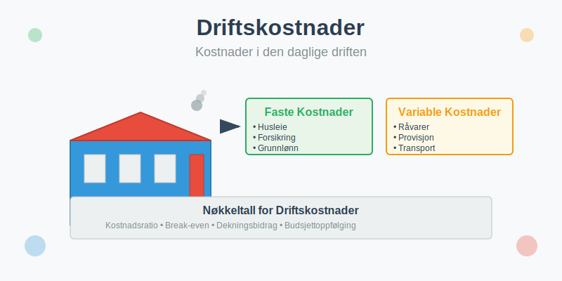
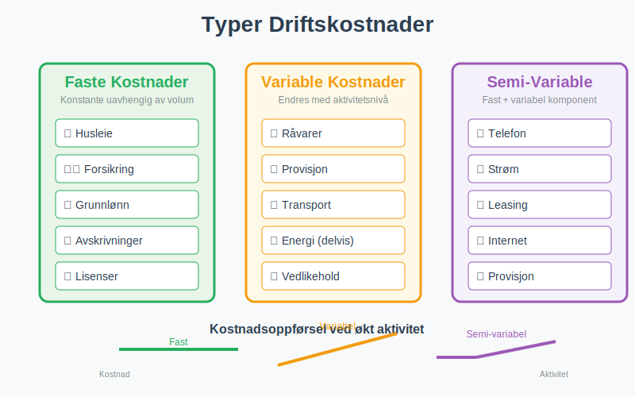
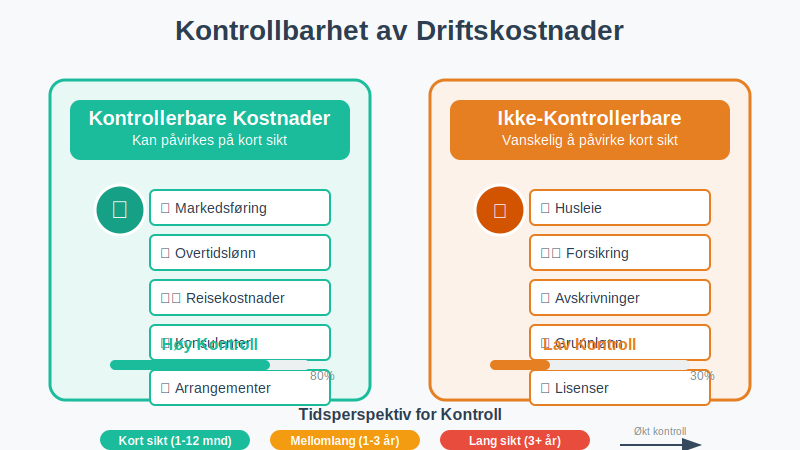
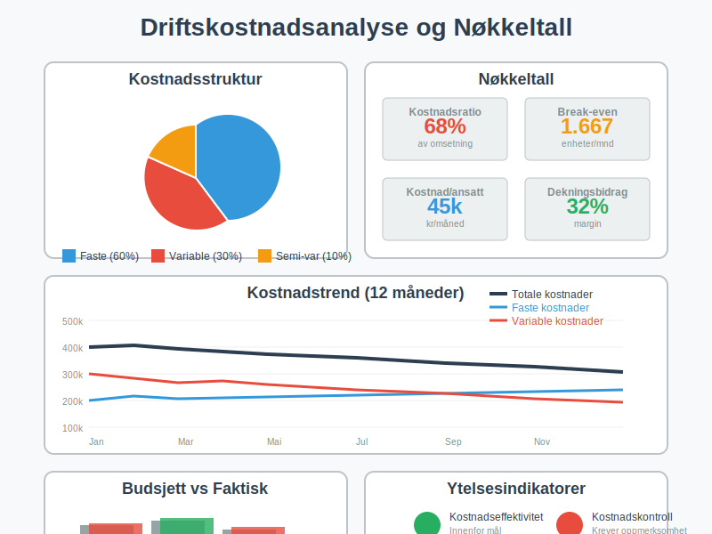
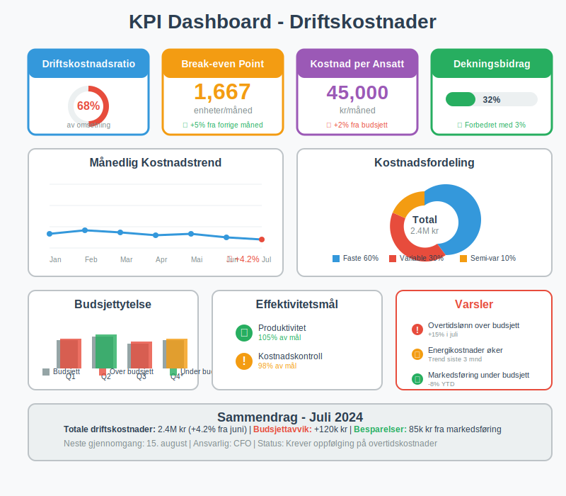

---
title: "Hva er Driftskostnader i Regnskap?"
meta_title: "Hva er Driftskostnader i Regnskap?"
meta_description: '**Driftskostnader** er alle [kostnader](/blogs/regnskap/hva-er-kostnader "Hva er Kostnader i Regnskap? Komplett Guide til Kostnadstyper og Regnskapsføring") so...'
slug: hva-er-driftskostnader
type: blog
layout: pages/single
---

**Driftskostnader** er alle [kostnader](/blogs/regnskap/hva-er-kostnader "Hva er Kostnader i Regnskap? Komplett Guide til Kostnadstyper og Regnskapsføring") som påløper i den daglige driften av en virksomhet. Dette omfatter både **[faste kostnader](/blogs/regnskap/faste-kostnader "Hva er Faste kostnader? Definisjon og Eksempler")** og **variable kostnader** som er nødvendige for å opprettholde forretningsaktiviteten og generere inntekter. Forståelse av driftskostnader er essensielt for [budsjettering](/blogs/regnskap/hva-er-budsjettering "Hva er Budsjettering? Komplett Guide til Budsjettplanlegging"), [kostnadsanalyse](/blogs/regnskap/hva-er-dekningsbidrag "Hva er Dekningsbidrag? Beregning og Analyse for Bedre Lønnsomhet") og effektiv [regnskapsføring](/blogs/regnskap/hva-er-bokforing "Hva er Bokføring? Komplett Guide til Regnskapsføring").

Driftskostnader utgjør en viktig del av det bredere kostnadsbegrepet [kostpris](/blogs/regnskap/hva-er-kostpris "Hva er Kostpris? Kostnadsberegning og Lønnsomhetsanalyse"), som omfatter alle kostnader knyttet til anskaffelse, produksjon og levering av varer og tjenester.



## Hva er Driftskostnader?

Driftskostnader representerer alle **løpende utgifter** som en virksomhet har for å drive sin ordinære forretningsaktivitet. Disse kostnadene er direkte knyttet til den daglige driften og skiller seg fra [investeringskostnader](/blogs/regnskap/hva-er-anleggsmidler "Hva er Anleggsmidler? Materielle, Immaterielle og Finansielle Eiendeler") og finanskostnader.

### Kjennetegn ved Driftskostnader

* **Løpende karakter:** Påløper regelmessig i driftsperioden
* **Nødvendige for drift:** Essensielle for å opprettholde forretningsaktiviteten
* **Resultatpåvirkning:** Reduserer [bruttofortjeneste](/blogs/regnskap/hva-er-bruttofortjeneste "Hva er Bruttofortjeneste? Beregning og Analyse av Lønnsomhet") og driftsresultat
* **Skattemessig fradrag:** Kan trekkes fra i skattegrunnlaget
* **Periodisering:** Skal føres i den perioden de påløper

## Typer Driftskostnader

Driftskostnader kan klassifiseres på flere måter avhengig av deres karakter og oppførsel i forhold til aktivitetsnivået.



### Faste Driftskostnader

**Faste kostnader** forblir konstante uavhengig av produksjons- eller aktivitetsnivået innenfor et relevant område.

For mer om faste kostnader generelt, se [Faste kostnader](/blogs/regnskap/faste-kostnader "Hva er Faste kostnader? Definisjon og Eksempler").

#### Eksempler på Faste Driftskostnader:

* **Husleie og lokalkostnader** (inkludert [hjemmekontorkostnader](/blogs/regnskap/hva-er-hjemmekontor "Hva er Hjemmekontor? Komplett Guide til Regnskapsføring og Skattefradrag"))
* **Forsikringspremier**
* **Grunnlønn til ansatte**
* **[Avskrivninger](/blogs/regnskap/hva-er-avskrivning "Hva er Avskrivning i Regnskap? Metoder, Beregning og Praktiske Eksempler")**
* **Lisenser og abonnementer**
* **Regnskaps- og revisjonshonorarer**

### Variable Driftskostnader

**Variable kostnader** endres proporsjonalt med aktivitets- eller produksjonsvolum.

#### Eksempler på Variable Driftskostnader:

* **RÃ¥varer og materialer**
* **Provisjonslønn**
* **Frakt- og transportkostnader** (dokumentert med [fraktbrev](/blogs/regnskap/hva-er-fraktbrev "Hva er Fraktbrev? Komplett Guide til Transportdokumenter og Regnskapsføring"))
* **Energikostnader (delvis):** se [Konto 6200 - Elektrisitet](/blogs/kontoplan/6200-elektrisitet "Konto 6200 - Elektrisitet")

* **Drivstoff:** se [Konto 7000 - Drivstoff](/blogs/kontoplan/7000-drivstoff "Konto 7000 - Drivstoff: Regnskapsføring av drivstoffkostnader")
* **Vedlikeholdskostnader** (inkludert [renhold](/blogs/kontoplan/6360-renhold "Konto 6360 - Renhold"))
* **Salgsprovisjon:** se [Konto 7200 - Provisjonskostnader, oppgavepliktig](/blogs/kontoplan/7200-provisjonskostnader-oppgavepliktig "Konto 7200 - Provisjonskostnader, oppgavepliktig")

### Semi-Variable Driftskostnader

**Semi-variable kostnader** har både en fast og en variabel komponent.

#### Eksempler på Semi-Variable Kostnader:

* **Telefonregninger:** Fast abonnement + variabel bruk
* **Strømregninger:** Fast nettleie + variabel forbruk. Se [Konto 6200 - Elektrisitet](/blogs/kontoplan/6200-elektrisitet "Konto 6200 - Elektrisitet")
* **Leasingavtaler:** Fast grunnleie + variabel kilometerbasert kostnad

## Klassifisering av Driftskostnader

### Etter Funksjon

Driftskostnader kan grupperes etter hvilken funksjon de støtter i virksomheten:

| Funksjon | Kostnadstyper | Eksempler |
|----------|---------------|-----------|
| **Produksjon** | Direkte og indirekte produksjonskostnader | Råvarer, produksjonslønn, maskindrift |
| **Salg** | Salgskostnader | Markedsføring, salgsprovisjon, messer |
| **Administrasjon** | Administrative kostnader | Kontorhold, ledelse, IT-systemer |
| **Distribusjon** | Distribusjonskostnader | Frakt, lager, emballasje |

### Etter Kontrollbarhet



#### Kontrollerbare Kostnader
Kostnader som ledelsen kan påvirke på kort sikt:
* Markedsføringskostnader
* Overtidslønn
* Reisekostnader
* Konsulenthonorar

#### Ikke-Kontrollerbare Kostnader
Kostnader som er vanskelige å påvirke på kort sikt:
* Husleie (ved langsiktige kontrakter)
* Forsikringspremier
* Avskrivninger
* Grunnlønn

## Regnskapsføring av Driftskostnader

### Grunnleggende Prinsipper

Driftskostnader skal regnskapsføres i henhold til **opptjeningsprinsippet** og **sammenstillingsprinsippet**:

* **Periodisering:** Kostnader føres når de påløper, ikke når de betales
* **Sammenstilling:** Kostnader matches mot tilhørende inntekter
* **Forsiktighet:** Usikre kostnader skal hensyntas

### Skattemessige Forhold

De fleste driftskostnader er **fradragsberettigede** i skatteregnskapet, men det er viktige regler og begrensninger å være oppmerksom på. For en omfattende gjennomgang av reglene for skattefradrag, se vår detaljerte guide om [fradrag i regnskap](/blogs/regnskap/hva-er-fradrag "Hva er fradrag i regnskap? Komplett Guide til Skattefradrag og Regnskapsføring").

### Typiske Kontoer for Driftskostnader

| Kontotype | Kontonummer | Beskrivelse |
|-----------|-------------|-------------|
| **Lønn og sosiale kostnader** | 5000-5999 | [Lønnskostnader](/blogs/regnskap/lonnskostnad "Hva er Lønnskostnad i Regnskap?"), [arbeidsgiveravgift](/blogs/regnskap/hva-er-arbeidsgiveravgift "Hva er Arbeidsgiveravgift? Satser, Beregning og Regnskapsføring"), [feriepenger](/blogs/regnskap/hva-er-feriepenger "Hva er Feriepenger i Regnskap? Beregning, Regnskapsføring og Praktiske Eksempler"), pensjon. Se også [Konto 5500 - Annen kostnadsgodtgjørelse](/blogs/kontoplan/5500-annen-kostnadsgodtgjorelse "Konto 5500 - Annen kostnadsgodtgjørelse") |
| **Andre driftskostnader** | 6000-6999 | Husleie, forsikring, vedlikehold |
| **Avskrivninger** | 7000-7999 | Ordinære avskrivninger |
| **Finanskostnader** | 8000-8999 | Rentekostnader, valutaforskjeller |


### Eksempel på Regnskapsføring

**Månedlig husleie på 50.000 kr:**
```
Debet: 6100 Husleie lokaler          50.000
Kredit: 2400 Leverandørgjeld                50.000
```

**Lønnsutbetaling på 200.000 kr:**
```
Debet: 5000 Lønn                    200.000
Kredit: 1900 Bankinnskudd                   200.000
```

## Driftskostnadsanalyse

### Kostnadsstrukturanalyse

Analyse av driftskostnader gir viktig innsikt i virksomhetens **kostnadsstruktur** og **lønnsomhet**.



#### Viktige Nøkkeltall:

* **Driftskostnader i % av omsetning**
* **Faste kostnader i % av totale driftskostnader**
* **Variable kostnader per enhet**
* **[Dekningsbidrag](/blogs/regnskap/hva-er-dekningsbidrag "Hva er Dekningsbidrag? Beregning og Analyse for Bedre Lønnsomhet") per produkt/tjeneste**

### Break-Even Analyse

**Break-even punktet** viser hvor mye virksomheten må selge for å dekke alle driftskostnader:

```
Break-even = Faste kostnader ÷ (Salgspris per enhet - Variable kostnader per enhet)
```

#### Eksempel: Break-Even Beregning

En virksomhet har:
* Faste driftskostnader: 500.000 kr/måned
* Variable kostnader: 200 kr per enhet
* Salgspris: 500 kr per enhet

**Beregning:**
* Dekningsbidrag per enhet: 500 - 200 = 300 kr
* Break-even: 500.000 ÷ 300 = 1.667 enheter per måned

## Budsjettering av Driftskostnader

### Budsjettplanlegging

Effektiv [budsjettering](/blogs/regnskap/hva-er-budsjettering "Hva er Budsjettering? Komplett Guide til Budsjettplanlegging") av driftskostnader krever:

* **Historisk analyse:** Gjennomgang av tidligere års kostnader
* **Trendanalyse:** Identifisering av kostnadstrender
* **Aktivitetsbasert budsjettering:** Kobling til forventet aktivitetsnivå
* **Scenarioplanlegging:** Budsjetter for ulike aktivitetsnivåer

### Budsjettoppfølging

| MÃ¥ned | Budsjett | Faktisk | Avvik | Avvik % |
|-------|----------|---------|-------|---------|
| Januar | 450.000 | 465.000 | 15.000 | 3,3% |
| Februar | 450.000 | 442.000 | -8.000 | -1,8% |
| Mars | 460.000 | 478.000 | 18.000 | 3,9% |
| **Q1 Total** | **1.360.000** | **1.385.000** | **25.000** | **1,8%** |

## Optimalisering av Driftskostnader

### Strategier for Kostnadsreduksjon

#### Kortsiktige Tiltak:
* **Forhandling med leverandører**
* **Energibesparende tiltak**
* **Reduksjon av ikke-essensielle kostnader**
* **Forbedret lagerstyring**

#### Langsiktige Tiltak:
* **Automatisering av prosesser**
* **Outsourcing av ikke-kjerneaktiviteter**
* **Investering i energieffektive løsninger**
* **Omorganisering av arbeidsflyt**

### Kostnads-Nytte Analyse

Ved vurdering av kostnadstiltak bør man analysere:

* **Besparelsespotensial**
* **Implementeringskostnader**
* **Risiko for kvalitetsreduksjon**
* **Påvirkning på kundetilfredshet**
* **Langsiktige konsekvenser**

## Driftskostnader vs. Andre Kostnadstyper

### Sammenligning av Kostnadstyper

| Kostnadstype | Karakter | Regnskapsføring | Eksempler |
|--------------|----------|-----------------|-----------|
| **Driftskostnader** | Løpende, ordinære | Resultatregnskap | Lønn, husleie, råvarer |
| **Investeringskostnader** | Engangskostnader | [Balanse](/blogs/regnskap/hva-er-balanse "Hva er Balanse? Komplett Guide til Balansen i Regnskap") (aktiveres) | Maskiner, bygninger |
| **Finanskostnader** | Finansieringsrelaterte | Resultatregnskap | Renter, valutaforskjeller |
| **Ekstraordinære kostnader** | Sjeldne, uvanlige | Resultatregnskap | Naturskader, omstrukturering |

## Skattemessige Aspekter

### Fradragsrett for Driftskostnader

**Generelle vilkår** for fradrag:
* Kostnaden må være **pådratt for å erverve inntekt**
* Kostnaden må være **faktisk påløpt**
* Kostnaden må være **rimelig og nødvendig**
* Kostnaden må være **dokumentert**

### Ikke-Fradragsberettigede Kostnader

Enkelte driftskostnader gir ikke skattemessig fradrag:
* **Representasjon** over visse grenser
* **Private kostnader** blandet med bedriftskostnader
* **Bøter og straffer**
* **Gaver** over fastsatte grenser

## Rapportering og Analyse

### MÃ¥nedlig Driftskostnadsrapport

En strukturert rapportering bør inneholde:

#### Kostnadsoversikt:
* **Totale driftskostnader**
* **Fordeling på kostnadskategorier**
* **Sammenligning med budsjett**
* **Sammenligning med foregående periode**

#### Nøkkelanalyser:
* **Kostnader per ansatt**
* **Kostnader i % av omsetning**
* **Utvikling i kostnadsnivå**
* **Identifisering av kostnadsdriver**

### KPI-er for Driftskostnader



#### Viktige Nøkkeltall:
* **Driftskostnadsratio:** Driftskostnader ÷ Omsetning
* **Kostnad per kunde:** Totale driftskostnader ÷ Antall kunder
* **Produktivitetsindeks:** Omsetning ÷ Antall ansatte
* **Kostnadseffektivitet:** Driftskostnader ÷ Produserte enheter

## Digitalisering og Driftskostnader

### Moderne Verktøy for Kostnadsstyring

* **ERP-systemer:** Integrert kostnadsstyring
* **Automatisert [bilagsføring](/blogs/regnskap/hva-er-bilagsforing "Hva er Bilagsføring? Komplett Guide til Digital Regnskapsføring"):** Reduserte administrative kostnader
* **Prediktiv analyse:** Forbedret budsjettplanlegging
* **Dashboards:** Sanntids kostnadsoversikt

### Fremtidige Trender

* **Kunstig intelligens** i kostnadsoptimalisering
* **Automatisering** av rutineoppgaver
* **Bærekraftige** driftskostnader
* **Aktivitetsbasert** kostnadsmodellering

## Konklusjon

Driftskostnader er en fundamental del av enhver virksomhets økonomi og krever kontinuerlig oppmerksomhet og styring. Effektiv håndtering av driftskostnader gjennom:

* **Systematisk klassifisering** og registrering
* **Regelmessig analyse** og oppfølging
* **Proaktiv budsjettering** og planlegging
* **Kontinuerlig optimalisering** av kostnadsnivå

Dette sikrer ikke bare god [regnskapsføring](/blogs/regnskap/hva-er-bokforing "Hva er Bokføring? Komplett Guide til Regnskapsføring"), men også grunnlag for **strategiske beslutninger** og **langsiktig lønnsomhet**. Ved å forstå sammenhengen mellom driftskostnader og [dekningsbidrag](/blogs/regnskap/hva-er-dekningsbidrag "Hva er Dekningsbidrag? Beregning og Analyse for Bedre Lønnsomhet"), kan virksomheter ta informerte beslutninger om prissetting, produktmiks og investeringer.

Moderne teknologi og digitale verktøy gjør det enklere enn noen gang å overvåke, analysere og optimalisere driftskostnader, noe som gir konkurransefortrinn til virksomheter som utnytter disse mulighetene effektivt.
