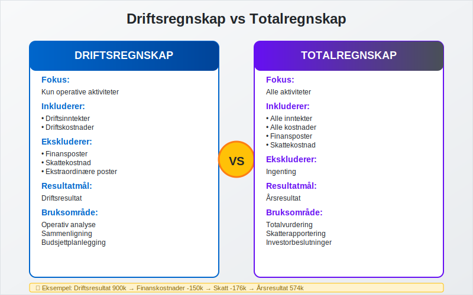
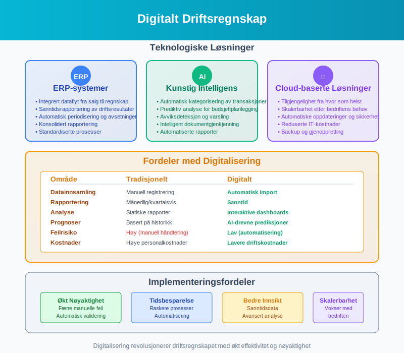

**Driftsregnskap** er den delen av [regnskapet](/blogs/regnskap/hva-er-regnskap "Hva er Regnskap? Komplett Guide til Regnskapsføring i Norge") som viser bedriftens **operative inntekter og kostnader** fra den daglige forretningsvirksomheten. Dette skiller seg fra totalregnskapet ved at det fokuserer utelukkende på kjernevirksomheten og ekskluderer finansielle poster og ekstraordinære hendelser.

Driftsregnskapet er et **kritisk verktøy** for ledelsen til å evaluere hvor [lønnsom](/blogs/regnskap/hva-er-profitt "Hva er Profitt? Komplett Guide til Profitt og Lønnsomhet") selve forretningsvirksomheten er, uavhengig av finansieringsstruktur og engangshendelser.

## Hva er Driftsregnskap?

Driftsregnskapet presenterer bedriftens **operative resultater** og gir et klart bilde av hvor godt kjernevirksomheten presterer. Det er en del av [resultatregnskapet](/blogs/regnskap/resultatregnskap "Hva er Resultatregnskap? Komplett Guide til Resultatregnskap") som fokuserer spesifikt på drift. Som en sentral komponent i [eksternregnskapet](/blogs/regnskap/hva-er-eksternregnskap "Hva er Eksternregnskap? Komplett Guide til Ekstern Finansiell Rapportering") gir driftsregnskapet eksterne interessenter viktig innsikt i bedriftens operative [lønnsomhet](/blogs/regnskap/hva-er-profitt "Hva er Profitt? Komplett Guide til Profitt og Lønnsomhet").


### Hovedkomponenter i Driftsregnskapet:

* **Driftsinntekter:** Alle inntekter fra normal forretningsvirksomhet
* **Driftskostnader:** Alle kostnader knyttet til den daglige driften
* **Driftsresultat:** Differansen mellom driftsinntekter og driftskostnader

## Struktur av Driftsregnskapet

Et typisk norsk driftsregnskap følger en standardisert struktur som gjør det enkelt å sammenligne bedrifter og analysere utvikling over tid.


### Detaljert Oppbygning:

| Post | Beskrivelse | Eksempel |
|------|-------------|----------|
| **Salgsinntekt** | Inntekter fra salg av varer/tjenester | 10 000 000 |
| **Andre driftsinntekter** | Leieinntekter, tilskudd, etc. | 500 000 |
| **Sum driftsinntekter** | Total operative inntekter | **10 500 000** |
| **Varekostnad** | Kostnad for solgte varer ([COGS](/blogs/regnskap/hva-er-bruttofortjeneste "Hva er Bruttofortjeneste? Beregning og Analyse")) | 6 000 000 |
| **Lønnskostnad** | Lønn og sosiale kostnader | 2 500 000 |
| **Avskrivninger** | [Avskrivninger](/blogs/regnskap/hva-er-avskrivning "Hva er Avskrivning i Regnskap? Metoder, Beregning og Praktiske Eksempler") på driftsmidler | 300 000 |
| **Andre driftskostnader** | Husleie, markedsføring, etc. | 800 000 |
| **Sum driftskostnader** | Total operative kostnader | **9 600 000** |
| **Driftsresultat** | Resultat fra kjernevirksomhet | **900 000** |

## Driftsinntekter - Detaljert Oversikt

Driftsinntekter omfatter alle inntekter som kommer fra bedriftens **normale forretningsvirksomhet**. Dette er fundamentet for å vurdere bedriftens operative styrke.


### Hovedkategorier av Driftsinntekter:

#### 1. Salgsinntekter
* **Varesalg:** Inntekter fra salg av fysiske produkter
* **Tjenestesalg:** Inntekter fra leverte tjenester
* **Abonnementsinntekter:** Gjentakende inntekter fra abonnementer

#### 2. Andre Driftsinntekter
* **Leieinntekter:** Fra utleie av lokaler eller utstyr
* **Royalties:** Fra lisensavtaler og immaterielle rettigheter
* **Offentlige tilskudd:** Støtte knyttet til drift
* **Gevinst ved salg av driftsmidler:** Når salgspris > [bokført verdi](/blogs/regnskap/hva-er-avskrivning "Hva er Avskrivning i Regnskap? Metoder, Beregning og Praktiske Eksempler")

### Regnskapsføring av Driftsinntekter:

**Ved salg av varer (100 000 kr):**
```
Debet: Kundefordringer    100 000
Kredit: Salgsinntekt      100 000
```

## Driftskostnader - Komplett Analyse

Driftskostnader er alle kostnader som påløper i forbindelse med den **daglige driften** av virksomheten. Effektiv kostnadsstyring er avgjørende for [lønnsomhet](/blogs/regnskap/hva-er-profitt "Hva er Profitt? Komplett Guide til Profitt og Lønnsomhet").


### Hovedkategorier av Driftskostnader:

#### 1. Varekostnad
Kostnaden for varer som er solgt i perioden, beregnet som:
**Varekostnad = Beholdning primo + Innkjøp - Beholdning ultimo**

#### 2. Lønnskostnader
* **Grunnlønn:** Fast lønn til ansatte
* **Overtidsbetaling:** Ekstra kompensasjon for overtid
* **[Arbeidsgiveravgift](/blogs/regnskap/hva-er-arbeidsgiveravgift "Hva er Arbeidsgiveravgift? Satser, Beregning og Praktiske Eksempler"):** Avgift på lønn
* **Pensjonskostnader:** Bidrag til pensjonsordninger
* **Andre personalrelaterte kostnader:** Kurs, reise, etc.

#### 3. Avskrivninger
Systematisk fordeling av [anskaffelseskost](/blogs/regnskap/hva-er-anskaffelseskost "Hva er Anskaffelseskost? Beregning, Komponenter og Regnskapsføring") for driftsmidler over deres levetid.

#### 4. Andre Driftskostnader
* **Husleie og lokalkostnader**
* **Markedsføring og reklame**
* **Telefon og kommunikasjon**
* **Forsikringer**
* **Vedlikehold og reparasjoner**
* **Kontorrekvisita**
* **Revisjon og regnskapsføring**

### Kostnadskategorisering:

| Kostnadskategori | Beskrivelse | Eksempler |
|------------------|-------------|-----------|
| **Variable kostnader** | Endres med aktivitetsnivå | Råvarer, provisjoner |
| **Faste kostnader** | Uavhengig av aktivitetsnivå | Husleie, forsikring |
| **Semi-variable kostnader** | Delvis fast, delvis variabel | Telefon, strøm |

## Driftsresultat - Analyse og Tolkning

**Driftsresultatet** er kanskje den viktigste enkeltposten i driftsregnskapet da det viser hvor [lønnsom](/blogs/regnskap/hva-er-profitt "Hva er Profitt? Komplett Guide til Profitt og Lønnsomhet") kjernevirksomheten er.


### Beregning av Driftsresultat:
**Driftsresultat = Driftsinntekter - Driftskostnader**

### Nøkkeltall for Driftsresultat:

#### 1. Driftsmargin
**Driftsmargin = (Driftsresultat ÷ Driftsinntekter) × 100**

| Bransje | Typisk Driftsmargin |
|---------|-------------------|
| **Detaljhandel** | 2-5% |
| **Teknologi** | 15-25% |
| **Produksjon** | 8-15% |
| **Tjenester** | 10-20% |

#### 2. Driftsresultat per Ansatt
**Driftsresultat per ansatt = Driftsresultat ÷ Antall ansatte**

### Tolkning av Driftsresultat:

* **Positivt driftsresultat:** Kjernevirksomheten er [lønnsom](/blogs/regnskap/hva-er-profitt "Hva er Profitt? Komplett Guide til Profitt og Lønnsomhet")
* **Negativt driftsresultat:** Driftskostnadene overstiger inntektene
* **Økende driftsresultat:** Forbedret operativ effektivitet
* **Synkende driftsresultat:** Kan indikere operative utfordringer

## Forskjellen mellom Driftsregnskap og Totalregnskap

Det er viktig å forstå hvordan driftsregnskapet skiller seg fra det komplette resultatregnskapet.



### Sammenligning:

| Aspekt | Driftsregnskap | Totalregnskap |
|--------|----------------|---------------|
| **Fokus** | Kun operative aktiviteter | Alle aktiviteter |
| **Inkluderer** | Driftsinntekter og -kostnader | Alle inntekter og kostnader |
| **Ekskluderer** | Finansposter, skatt, ekstraordinære poster | Ingenting |
| **Resultatmål** | Driftsresultat | Årsresultat |
| **Bruksområde** | Operativ analyse | Totalvurdering |

### Eksempel på Fullstendig Resultatregnskap:

```
DRIFTSREGNSKAP:
Driftsinntekter          10 500 000
Driftskostnader          -9 600 000
Driftsresultat              900 000

FINANSPOSTER:
Finansinntekter              50 000
Finanskostnader            -150 000
Resultat før skatt          800 000

SKATT:
Skattekostnad              -176 000
ÅRSRESULTAT                 624 000
```

## Praktiske Eksempler fra Norsk Næringsliv

La oss se på hvordan driftsregnskap fungerer i praksis gjennom konkrete eksempler fra ulike bransjer.


### Eksempel 1: Detaljhandel

**Situasjon:** En klesbutikk med følgende tall for 2023:

| Post | Beløp (NOK) |
|------|-------------|
| Salgsinntekt | 5 000 000 |
| Varekostnad | 3 000 000 |
| Lønnskostnad | 1 200 000 |
| Husleie | 400 000 |
| Andre driftskostnader | 300 000 |

**Beregning:**
- **Driftsinntekter:** 5 000 000
- **Driftskostnader:** 3 000 000 + 1 200 000 + 400 000 + 300 000 = 4 900 000
- **Driftsresultat:** 5 000 000 - 4 900 000 = **100 000**
- **Driftsmargin:** (100 000 ÷ 5 000 000) × 100 = **2%**

### Eksempel 2: IT-Konsulentselskap

**Situasjon:** Et IT-konsulentselskap med følgende driftsregnskap:

| Post | Beløp (NOK) |
|------|-------------|
| Konsulentinntekter | 8 000 000 |
| Lønnskostnad | 5 500 000 |
| Kontorleie | 600 000 |
| IT-utstyr (avskrivninger) | 200 000 |
| Andre driftskostnader | 400 000 |

**Analyse:**
- **Driftsresultat:** 8 000 000 - 6 700 000 = **1 300 000**
- **Driftsmargin:** 16,25% (meget bra for bransjen)
- **Lønnsandel:** 68,75% av omsetning (typisk for konsulentbransjen)

### Eksempel 3: Produksjonsbedrift

**Situasjon:** En møbelprodusent med kompleks kostnadsstruktur:

| Kostnadskategori | Detaljerte Poster | Beløp (NOK) |
|------------------|-------------------|-------------|
| **Driftsinntekter** | Møbelsalg | 15 000 000 |
| | Reparasjonstjenester | 500 000 |
| | **Sum driftsinntekter** | **15 500 000** |
| **Varekostnad** | Treverk og materialer | 6 000 000 |
| | Frakt av råvarer | 300 000 |
| **Lønnskostnader** | Produksjonslønn | 3 500 000 |
| | [Arbeidsgiveravgift](/blogs/regnskap/hva-er-arbeidsgiveravgift "Hva er Arbeidsgiveravgift? Satser, Beregning og Praktiske Eksempler") | 490 000 |
| **Avskrivninger** | Produksjonsmaskiner | 800 000 |
| | Bygninger | 200 000 |
| **Andre driftskostnader** | Strøm og oppvarming | 400 000 |
| | Vedlikehold maskiner | 300 000 |
| | Forsikringer | 150 000 |
| | **Sum driftskostnader** | **12 140 000** |
| **DRIFTSRESULTAT** | | **3 360 000** |

**Nøkkeltall:**
- **Driftsmargin:** 21,7%
- **Varekostnad i % av omsetning:** 40,6%
- **Lønnskostnad i % av omsetning:** 25,7%

## Analyse av Driftsregnskapet

Effektiv analyse av driftsregnskapet krever både **horisontale** og **vertikale** analyseteknikker.


### 1. Vertikal Analyse (Common Size)

Alle poster uttrykkes som prosent av driftsinntektene:

| Post | Beløp | % av Omsetning |
|------|-------|----------------|
| Driftsinntekter | 10 000 000 | 100,0% |
| Varekostnad | 6 000 000 | 60,0% |
| Lønnskostnad | 2 000 000 | 20,0% |
| Andre driftskostnader | 1 500 000 | 15,0% |
| **Driftsresultat** | **500 000** | **5,0%** |

### 2. Horisontal Analyse (Trendanalyse)

Sammenligning over flere år for å identifisere trender:

| Post | 2021 | 2022 | 2023 | Endring 22-23 |
|------|------|------|------|---------------|
| Driftsinntekter | 8 500 000 | 9 200 000 | 10 000 000 | +8,7% |
| Driftskostnader | 8 100 000 | 8 800 000 | 9 500 000 | +8,0% |
| **Driftsresultat** | **400 000** | **400 000** | **500 000** | **+25,0%** |
| **Driftsmargin** | **4,7%** | **4,3%** | **5,0%** | **+0,7pp** |

### 3. Nøkkeltall for Driftsanalyse

#### Lønnsomhetsnøkkeltall:
* **Bruttomargin = (Driftsinntekter - Varekostnad) ÷ Driftsinntekter**
* **EBITDA-margin = (Driftsresultat + Avskrivninger) ÷ Driftsinntekter**
* **Kostnadsgrad = Driftskostnader ÷ Driftsinntekter**

#### Effektivitetsnøkkeltall:
* **Omsetning per ansatt = Driftsinntekter ÷ Antall ansatte**
* **Lønnskostnad per ansatt = Lønnskostnader ÷ Antall ansatte**
* **Produktivitetsindeks = Omsetning per ansatt ÷ Lønnskostnad per ansatt**

## Budsjett og Prognoser for Driftsregnskap

[Budsjettering](/blogs/regnskap/hva-er-budsjettering "Hva er Budsjettering? Komplett Guide til Budsjettplanlegging") av driftsregnskapet er essensielt for planlegging og kontroll.


### Budsjetterings-prosess:

#### 1. Salgsbudsjett (Utgangspunkt)
* Markedsanalyse og prognoser
* Historiske data og trender
* Sesongvariasjoner
* Nye produkter/tjenester

#### 2. Produksjons-/Tjenestebudsjett
* Kapasitetsvurdering
* Ressursbehov
* Varekostnadsbudsjett

#### 3. Kostnadsbudsjett
* **Faste kostnader:** Husleie, forsikring, grunnbemanning
* **Variable kostnader:** Basert på aktivitetsnivå
* **Semi-variable kostnader:** Kombinasjon av fast og variabel del

### Eksempel på Driftsbudsjett:

| Måned | Jan | Feb | Mar | Q1 Total |
|-------|-----|-----|-----|----------|
| **Budsjetterte Inntekter** | | | | |
| Salgsinntekt | 800 000 | 850 000 | 900 000 | 2 550 000 |
| Andre driftsinntekter | 20 000 | 20 000 | 20 000 | 60 000 |
| **Sum inntekter** | **820 000** | **870 000** | **920 000** | **2 610 000** |
| **Budsjetterte Kostnader** | | | | |
| Varekostnad | 480 000 | 510 000 | 540 000 | 1 530 000 |
| Lønnskostnad | 200 000 | 200 000 | 200 000 | 600 000 |
| Andre driftskostnader | 80 000 | 85 000 | 90 000 | 255 000 |
| **Sum kostnader** | **760 000** | **795 000** | **830 000** | **2 385 000** |
| **Budsjettert driftsresultat** | **60 000** | **75 000** | **90 000** | **225 000** |

### Avviksanalyse:

Sammenligning av faktiske tall mot budsjett:

| Post | Budsjett | Faktisk | Avvik | Avvik % |
|------|----------|---------|-------|---------|
| Driftsinntekter | 2 610 000 | 2 580 000 | -30 000 | -1,1% |
| Driftskostnader | 2 385 000 | 2 420 000 | +35 000 | +1,5% |
| **Driftsresultat** | **225 000** | **160 000** | **-65 000** | **-28,9%** |

## Regnskapsføring og Dokumentasjon

Korrekt regnskapsføring av driftsposter er avgjørende for pålitelige finansielle rapporter.


### Viktige Regnskapsprinsipper:

#### 1. Opptjeningsprinsippet
Inntekter regnskapsføres når de er **opptjent**, ikke nødvendigvis når de er mottatt.

**Eksempel - Salg på kreditt:**
```
Debet: Kundefordringer    100 000
Kredit: Salgsinntekt      100 000
```

#### 2. Sammenstillingsprinsippet
Kostnader som er direkte knyttet til inntekter skal regnskapsføres i samme periode.

**Eksempel - Provisjon på salg:**
```
Debet: Provisjonskostnad   5 000
Kredit: Skyldig provisjon  5 000
```

### Periodisering av Driftsposter:

#### Forhåndsbetalte Kostnader (Forskudd):
**Ved betaling av årlig forsikring (120 000 kr):**
```
Debet: Forskudd forsikring  120 000
Kredit: Bank                120 000
```

**Månedlig periodisering:**
```
Debet: Forsikringskostnad   10 000
Kredit: Forskudd forsikring 10 000
```

#### Påløpte Kostnader:
**Påløpt lønn ved månedslutt:**
```
Debet: Lønnskostnad        250 000
Kredit: Påløpt lønn        250 000
```

## Digitalisering og Automatisering

Moderne teknologi har revolusjonert hvordan driftsregnskap håndteres og analyseres.



### Teknologiske Løsninger:

#### 1. ERP-systemer
* **Integrert dataflyt** fra salg til regnskap
* **Sanntidsrapportering** av driftsresultater
* **Automatisk periodisering** og avsetninger

#### 2. Kunstig Intelligens og Maskinlæring
* **Automatisk kategorisering** av transaksjoner
* **Prediktiv analyse** for budsjettplanlegging
* **Avviksdeteksjon** og varsling

#### 3. Cloud-baserte Løsninger
* **Tilgjengelighet** fra hvor som helst
* **Skalerbarhet** etter bedriftens behov
* **Automatiske oppdateringer** og sikkerhet

### Fordeler med Digitalisering:

| Område | Tradisjonelt | Digitalt |
|--------|-------------|----------|
| **Datainnsamling** | Manuell registrering | Automatisk import |
| **Rapportering** | Månedlig/kvartalsvis | Sanntid |
| **Analyse** | Statiske rapporter | Interaktive dashboards |
| **Prognoser** | Basert på historikk | AI-drevne prediksjoner |
| **Feilrisiko** | Høy (manuell håndtering) | Lav (automatisering) |

## Juridiske Krav og Regnskapsstandarder

Norske bedrifter må følge spesifikke krav til regnskapsføring og rapportering av driftsposter.


### Relevante Regelverk:

#### 1. Regnskapsloven
* **§ 6-1:** Krav til resultatregnskap
* **§ 7-1:** Regnskapsføring av inntekter
* **§ 7-2:** Regnskapsføring av kostnader

#### 2. Regnskapsforskriften
* Detaljerte krav til kontoplan
* Spesifikasjoner for regnskapsføring
* Krav til dokumentasjon og oppbevaring

#### 3. Norsk RegnskapsStandard (NRS)
* **NRS 2:** Anleggsmidler
* **NRS 9:** Varebeholdninger  
* **NRS 15A:** Regnskapsføring av inntekt

### Revisjons- og Kontrollkrav:

#### Internkontroll:
* **Autorisasjonsprosedyrer** for utgifter
* **Avstemmingsrutiner** for alle konti
* **Periodisk gjennomgang** av driftsresultater

#### Ekstern Revisjon:
* Gjennomgang av driftsposter
* Verifisering av inntektsføring
* Kontroll av kostnadsperiodisering

## Bransjespesifikke Særtrekk

Ulike bransjer har spesielle karakteristika i sine driftsregnskap som er viktige å forstå.


### Detaljhandel:
* **Høy varekostnad** (60-80% av omsetning)
* **Sesongvariasjoner** i salg
* **Lav driftsmargin** (2-8%)
* **Fokus på lageromløp** og [arbeidskapital](/blogs/regnskap/hva-er-arbeidskapital "Hva er Arbeidskapital? Beregning, Analyse og Optimalisering")

### Tjenesteyting:
* **Høy lønnsandel** (50-70% av omsetning)
* **Lav varekostnad** eller ingen
* **Høyere driftsmargin** (10-25%)
* **Fokus på produktivitet** per ansatt

### Produksjon:
* **Kompleks kostnadsstruktur**
* **Høye avskrivninger** på maskiner
* **Variable kostnader** knyttet til produksjonsvolum
* **Fokus på [dekningsbidrag](/blogs/regnskap/hva-er-dekningsbidrag "Hva er Dekningsbidrag? Beregning, Analyse og Praktiske Eksempler")**

### IT og Teknologi:
* **Høye utviklingskostnader**
* **Lave variable kostnader**
* **Skalerbare forretningsmodeller**
* **Fokus på vekst** og markedsandeler

## Vanlige Feil og Fallgruver

Mange bedrifter gjør typiske feil i håndteringen av driftsregnskapet som kan påvirke beslutningsgrunnlaget.


### Typiske Feil:

#### 1. Feil Periodisering
* **Problem:** Kostnader eller inntekter føres i feil periode
* **Konsekvens:** Misvisende driftsresultater
* **Løsning:** Systematiske avstemmingsrutiner

#### 2. Manglende Kategorisering
* **Problem:** Blanding av drifts- og finansposter
* **Konsekvens:** Uklar operativ prestasjon
* **Løsning:** Klar kontoplan og retningslinjer

#### 3. Inkonsistent Behandling
* **Problem:** Ulik behandling av like transaksjoner
* **Konsekvens:** Ikke-sammenlignbare tall
* **Løsning:** Standardiserte prosedyrer

### Best Practices:

* **Månedlig avstemming** av alle driftskonti
* **Klar dokumentasjon** av alle transaksjoner
* **Regelmessig analyse** av avvik og trender
* **Opplæring** av personale i regnskapsprinsipper

## Fremtidige Trender og Utvikling

Driftsregnskapet vil fortsette å utvikle seg med nye teknologier og forretningsmodeller.


### Kommende Utviklingstrekk:

#### 1. Sanntidsrapportering
* **Kontinuerlig oppdatering** av driftsresultater
* **Øyeblikkelig innsikt** i operative prestasjoner
* **Raskere beslutningsprosesser**

#### 2. Prediktiv Analyse
* **AI-drevne prognoser** for driftsinntekter
* **Automatisk varsling** ved avvik
* **Optimalisering** av kostnadsstruktur

#### 3. Bærekraftsrapportering
* **Integrering** av ESG-målinger
* **Miljøkostnader** i driftsregnskapet
* **Bærekraftige forretningsmodeller**

#### 4. Blockchain og Transparens
* **Uforanderlige transaksjonslogger**
* **Økt tillit** til finansiell rapportering
* **Automatiserte smart contracts**

## Konklusjon

Driftsregnskapet er et **fundamentalt verktøy** for å forstå og styre bedriftens operative prestasjoner. Ved å fokusere på kjernevirksomheten gir det ledelsen og interessenter et klart bilde av hvor lønnsom den daglige driften er.

### Viktige Takeaways:

* **Driftsregnskapet** skiller operative aktiviteter fra finansielle
* **Driftsresultatet** er nøkkelmålet for operativ lønnsomhet
* **Systematisk analyse** av driftsposter gir verdifull innsikt
* **Korrekt regnskapsføring** er essensielt for pålitelige rapporter
* **Digitalisering** forbedrer nøyaktighet og tilgjengelighet

Ved å mestre driftsregnskapet kan bedrifter ta bedre **strategiske beslutninger**, optimalisere **kostnadsstrukturen** og sikre **langsiktig lønnsomhet**. Det er ikke bare et regnskapsmessig verktøy, men en kritisk komponent i moderne bedriftsledelse.

For bedrifter som ønsker å forbedre sin finansielle styring, er en grundig forståelse av driftsregnskapet helt avgjørende for suksess i dagens konkurranseutsatte marked.


