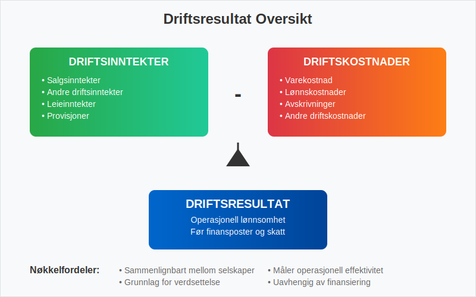
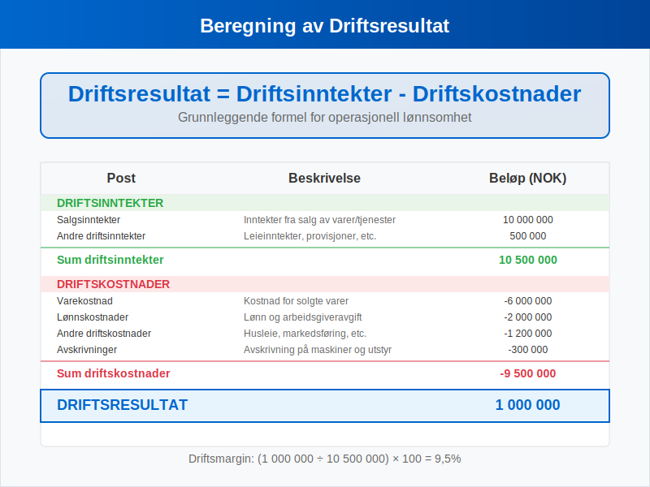
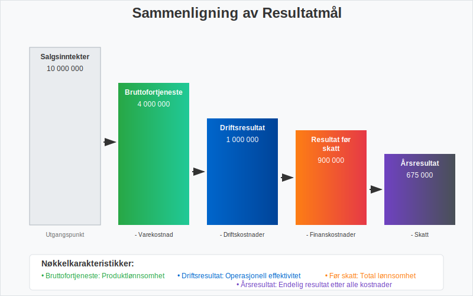
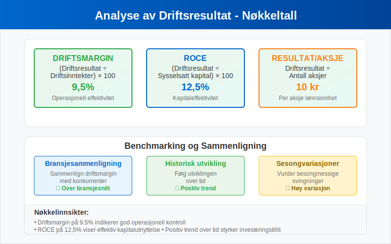
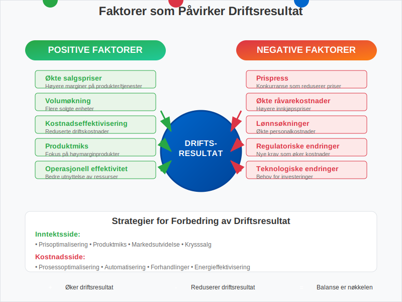
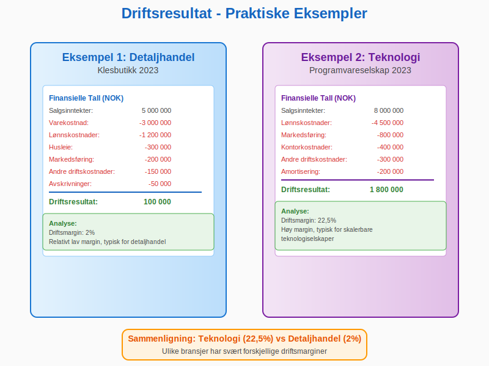
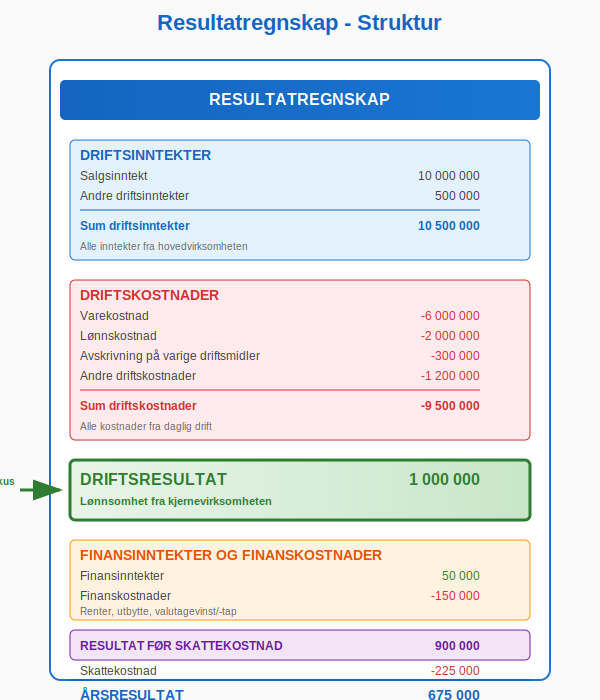
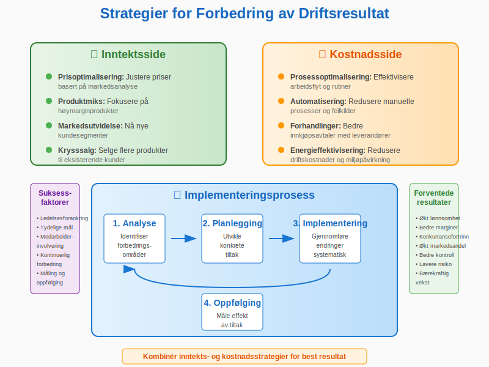
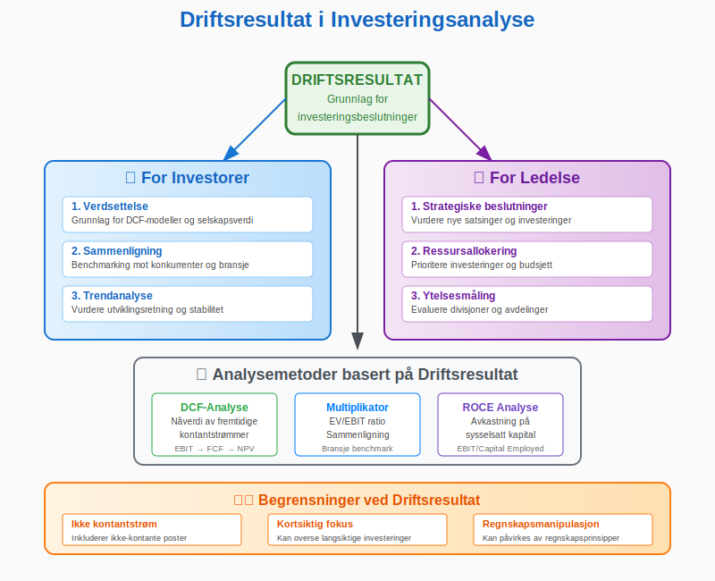
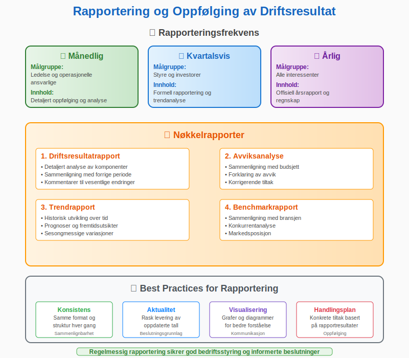

---
title: "Hva er driftsresultat?"
seoTitle: "Hva er driftsresultat?"
description: 'Driftsresultat viser lønnsomheten fra kjernevirksomheten og beregnes som driftsinntekter minus driftskostnader, før finansposter og skatt.'
summary: 'En enkel forklaring av driftsresultat (EBIT), hvordan det beregnes og brukes i analyse av operasjonell lønnsomhet.'
---

**Driftsresultat** er et av de viktigste nøkkeltallene i [regnskap](/blogs/regnskap/hva-er-regnskap "Hva er Regnskap? En Komplett Guide til Regnskapsføring") og viser bedriftens lønnsomhet fra kjernevirksomheten. Det representerer forskjellen mellom driftsinntekter og driftskostnader, og gir et klart bilde av hvor godt selskapet presterer operasjonelt før finansielle poster og skatt.

Driftsresultat danner grunnlaget for **bunnlinjen**, som viser det endelige nettoresultatet etter finansielle poster og skatt. Les mer om [Bunnlinje](/blogs/regnskap/bunnlinje "Bunnlinje i Norsk Regnskap: Definisjon, Beregning og Eksempler"). Samtidig tar driftsresultatet utgangspunkt i **topplinjen** (totale driftsinntekter), også kjent som [Topplinje](/blogs/regnskap/topplinje "Topplinje i Norsk Regnskap: Definisjon, Betydning og Eksempler").

For en fullstendig oversikt over begrepet **resultat**, se [Resultat](/blogs/regnskap/resultat "Resultat i Norsk Regnskap: Definisjon, Typer og Eksempler").

## Hva er Driftsresultat?

Driftsresultat, også kalt **operasjonelt resultat** eller **EBIT** (Earnings Before Interest and Taxes), måler bedriftens evne til å generere overskudd fra sin hovedvirksomhet. Dette resultatet viser hvor effektivt ledelsen driver selskapet og er uavhengig av finansieringsstruktur og skatteforhold.



### Hovedkomponenter i Driftsresultat:

* **[Driftsinntekter](/blogs/regnskap/hva-er-driftsinntekter "Hva er Driftsinntekter? Komplett Guide til Driftsinntekter i Regnskap"):** Alle inntekter fra selskapets hovedvirksomhet
* **Driftskostnader:** Alle kostnader knyttet til den daglige driften
* **[Avskrivninger](/blogs/regnskap/hva-er-avskrivning "Hva er Avskrivning i Regnskap? Metoder, Beregning og Praktiske Eksempler"):** Verdifall på [anleggsmidler](/blogs/regnskap/hva-er-anleggsmidler "Hva er Anleggsmidler? Komplett Guide til Faste Eiendeler i Regnskap")
* **Amortisering:** Nedskrivning av immaterielle eiendeler

## Beregning av Driftsresultat

Driftsresultat beregnes ved å trekke alle driftskostnader fra driftsinntektene. Her er den grunnleggende formelen:



### Formel for Driftsresultat:

**Driftsresultat = Driftsinntekter - Driftskostnader**

### Detaljert Beregning:

| Post | Beskrivelse | Eksempel (NOK) |
|------|-------------|----------------|
| **Salgsinntekter** | Inntekter fra salg av varer/tjenester | 10 000 000 |
| **Andre driftsinntekter** | Leieinntekter, provisjoner, etc. | 500 000 |
| **Sum driftsinntekter** | | **10 500 000** |
| **Varekostnad** | Kostnad for solgte varer | -6 000 000 |
| **Lønnskostnader** | Lønn og [arbeidsgiveravgift](/blogs/regnskap/hva-er-arbeidsgiveravgift "Hva er Arbeidsgiveravgift? Satser, Beregning og Praktiske Eksempler") | -2 000 000 |
| **Andre driftskostnader** | Husleie, markedsføring, etc. | -1 200 000 |
| **[Avskrivninger](/blogs/regnskap/hva-er-avskrivning "Hva er Avskrivning i Regnskap? Metoder, Beregning og Praktiske Eksempler")** | Avskrivning på maskiner og utstyr | -300 000 |
| **Sum driftskostnader** | | **-9 500 000** |
| **Driftsresultat** | | **1 000 000** |

## Driftsresultat vs Andre Resultatmål

Det er viktig å forstå forskjellen mellom driftsresultat og andre resultatmål for å få et helhetlig bilde av bedriftens økonomi. For en omfattende oversikt over alle typer [fortjeneste](/blogs/regnskap/hva-er-fortjeneste "Hva er Fortjeneste? Komplett Guide til Fortjeneste i Regnskap og Økonomi") og [overskudd](/blogs/regnskap/hva-er-overskudd "Hva er Overskudd? Komplett Guide til Overskudd i Regnskap og Økonomi") og hvordan de relaterer seg til hverandre, anbefaler vi våre detaljerte guider om disse konseptene.



### Sammenligning av Resultatmål:

| Resultatmål | Inkluderer | Ekskluderer | Formål |
|-------------|------------|-------------|---------|
| **[Bruttofortjeneste](/blogs/regnskap/hva-er-bruttofortjeneste "Hva er Bruttofortjeneste? Beregning og Analyse av Bruttomarginer")** | Salgsinntekter - Varekostnad | Alle andre kostnader | Måle produktlønnsomhet |
| **Driftsresultat** | Alle driftsposter | Finansposter og skatt | Måle operasjonell effektivitet |
| **Resultat før skatt** | Driftsposter + Finansposter | Skatt | Måle total lønnsomhet før skatt |
| **Årsresultat** | Alle poster | Ingenting | Måle endelig [nettoresultat](/blogs/regnskap/hva-er-netto "Hva er Netto i Regnskap? Definisjon og Praktisk Anvendelse") |

## Analyse av Driftsresultat

Driftsresultat er grunnlaget for mange viktige analyser og nøkkeltall som hjelper investorer og ledelse med å vurdere bedriftens prestasjoner.



### Viktige Nøkkeltall basert på Driftsresultat:

#### 1. Driftsmargin
**Formel:** (Driftsresultat ÷ Driftsinntekter) × 100

**Eksempel:** (1 000 000 ÷ 10 500 000) × 100 = 9,5%

#### 2. Avkastning på Sysselsatt Kapital (ROCE)
**Formel:** (Driftsresultat ÷ Sysselsatt kapital) × 100

#### 3. Driftsresultat per Aksje
**Formel:** Driftsresultat ÷ Antall aksjer

### Benchmarking og Sammenligning:

* **Bransjesammenligning:** Sammenlign driftsmargin med konkurrenter
* **Historisk utvikling:** Følg utviklingen over tid
* **Sesongvariasjoner:** Vurder sesongmessige svingninger

## Faktorer som Påvirker Driftsresultat

Mange faktorer kan påvirke driftsresultatet, både positive og negative. Forståelse av disse er viktig for god bedriftsstyring.



### Positive Faktorer:

* **Økte salgspriser:** Høyere marginer på produkter/tjenester
* **Volum økning:** Flere solgte enheter
* **Kostnadseffektivisering:** Reduserte driftskostnader
* **Produktmiks:** Fokus på høymarginprodukter
* **Operasjonell effektivitet:** Bedre utnyttelse av ressurser

### Negative Faktorer:

* **Prispress:** Konkurranse som reduserer priser
* **Økte råvarekostnader:** Høyere innkjøpspriser
* **Lønnsøkninger:** Økte personalkostnader
* **Regulatoriske endringer:** Nye krav som øker kostnader
* **Teknologiske endringer:** Behov for investeringer

## Praktiske Eksempler fra Norsk Næringsliv

La oss se på hvordan driftsresultat fungerer i praksis gjennom konkrete eksempler fra ulike bransjer.



### Eksempel 1: Detaljhandel

**Situasjon:** En klesbutikk med følgende tall for 2023:

| Post | Beløp (NOK) |
|------|-------------|
| Salgsinntekter | 5 000 000 |
| Varekostnad | -3 000 000 |
| Lønnskostnader | -1 200 000 |
| Husleie | -300 000 |
| Markedsføring | -200 000 |
| Andre driftskostnader | -150 000 |
| Avskrivninger | -50 000 |
| **Driftsresultat** | **100 000** |

**Analyse:**
- Driftsmargin: (100 000 ÷ 5 000 000) × 100 = 2%
- Relativt lav margin, typisk for detaljhandel

### Eksempel 2: Teknologiselskap

**Situasjon:** Et programvareselskap med følgende resultater:

| Post | Beløp (NOK) |
|------|-------------|
| Salgsinntekter | 8 000 000 |
| Lønnskostnader | -4 500 000 |
| Markedsføring | -800 000 |
| Kontorkostnader | -400 000 |
| Andre driftskostnader | -300 000 |
| [Amortisering](/blogs/regnskap/hva-er-amortisering "Hva er Amortisering? En Komplett Guide til Avskrivninger") | -200 000 |
| **Driftsresultat** | **1 800 000** |

**Analyse:**
- Driftsmargin: (1 800 000 ÷ 8 000 000) × 100 = 22,5%
- Høy margin, typisk for skalerbare teknologiselskaper

## Driftsresultat i Resultatregnskapet

Driftsresultatet er en sentral del av [resultatregnskapet](/blogs/regnskap/hva-er-regnskap "Hva er Regnskap? En Komplett Guide til Regnskapsføring") og følger en standardisert oppstilling i henhold til norske regnskapsstandarder.



### Standardoppstilling av Resultatregnskap:

```
RESULTATREGNSKAP

DRIFTSINNTEKTER
Salgsinntekt                           10 000 000
Andre driftsinntekter                     500 000
Sum driftsinntekter                    10 500 000

DRIFTSKOSTNADER
Varekostnad                            -6 000 000
Lønnskostnad                           -2 000 000
Avskrivning på varige driftsmidler       -300 000
Andre driftskostnader                  -1 200 000
Sum driftskostnader                    -9 500 000

DRIFTSRESULTAT                          1 000 000

FINANSINNTEKTER OG FINANSKOSTNADER
Finansinntekter                            50 000
Finanskostnader                          -150 000
Netto finansposter                       -100 000

RESULTAT FØR SKATTEKOSTNAD                900 000

Skattekostnad                            -225 000

ÅRSRESULTAT                              675 000
```

## Forbedring av Driftsresultat

Bedrifter kan implementere ulike strategier for å forbedre driftsresultatet og øke lønnsomheten.



### Strategier for Forbedring:

#### Inntektsside:
* **Prisoptimalisering:** Justere priser basert på markedsanalyse
* **Produktmiks:** Fokusere på høymarginprodukter
* **Markedsutvidelse:** Nå nye kundesegmenter
* **Krysssalg:** Selge flere produkter til eksisterende kunder

#### Kostnadsside:
* **Prosessoptimalisering:** Effektivisere arbeidsflyt
* **Automatisering:** Redusere manuelle prosesser
* **Forhandlinger:** Bedre innkjøpsavtaler
* **Energieffektivisering:** Redusere driftskostnader

### Implementering av Forbedringstiltak:

1. **Analyse:** Identifiser forbedringsområder
2. **Planlegging:** Utvikle konkrete tiltak
3. **Implementering:** Gjennomføre endringer
4. **Oppfølging:** Måle effekt av tiltak

## Driftsresultat og Investeringsbeslutninger

Driftsresultat er et viktig verktøy for investeringsbeslutninger og bedriftsvurdering.



### Bruk i Investeringsanalyse:

#### For Investorer:
* **Verdsettelse:** Grunnlag for DCF-modeller
* **Sammenligning:** Benchmarking mot konkurrenter
* **Trendanalyse:** Vurdere utviklingsretning

#### For Ledelse:
* **Strategiske beslutninger:** Vurdere nye satsinger
* **Ressursallokering:** Prioritere investeringer
* **Ytelsesmåling:** Evaluere divisjoner/avdelinger

### Begrensninger ved Driftsresultat:

* **Ikke kontantstrøm:** Inkluderer ikke-kontante poster
* **Kortsiktig fokus:** Kan overse langsiktige investeringer
* **Regnskapsmanipulasjon:** Kan påvirkes av regnskapsprinsipper

## Rapportering og Oppfølging

Regelmessig rapportering og oppfølging av driftsresultat er essensielt for god bedriftsstyring.



### Rapporteringsfrekvens:

* **Månedlig:** Detaljert oppfølging for ledelse
* **Kvartalsvis:** Rapportering til styre og investorer
* **Årlig:** Offisiell årsrapport og [regnskap](/blogs/regnskap/hva-er-regnskap "Hva er Regnskap? En Komplett Guide til Regnskapsføring")

### Nøkkelrapporter:

1. **Driftsresultatrapport:** Detaljert analyse av komponenter
2. **Avviksanalyse:** Sammenligning med budsjett
3. **Trendrapport:** Historisk utvikling og prognoser
4. **Benchmarkrapport:** Sammenligning med bransjen

## Regnskapsregler og Standarder

Driftsresultat må beregnes i henhold til gjeldende regnskapsstandarder og -regler.

### Relevante Regelverk:

* **[Regnskapsloven](/blogs/regnskap/hva-er-bokforingsloven "Hva er Bokføringsloven? Regler, Krav og Praktisk Veiledning"):** Grunnleggende krav til regnskapsføring
* **[Norske regnskapsstandarder (NRS)](/blogs/regnskap/norsk-regnskapsstandard-nrs "Norsk regnskapsstandard (NRS) - Komplett Guide til Norske Regnskapsstandarder"):** Detaljerte retningslinjer
* **IFRS:** For børsnoterte selskaper
* **God regnskapsskikk:** Etablert praksis

### Viktige Prinsipper:

* **Sammenlignbarhet:** Konsistent behandling over tid
* **Forsiktighet:** Konservativ tilnærming til inntektsføring
* **Periodisering:** Kostnader og inntekter i riktig periode
* **Vesentlighet:** Fokus på betydningsfulle poster

## Konklusjon

Driftsresultat er et fundamentalt mål på bedriftens operasjonelle lønnsomhet og effektivitet. Det gir verdifull innsikt i hvor godt selskapet presterer i sin kjernevirksomhet, uavhengig av finansieringsstruktur og skatteforhold.

### Hovedpunkter å Huske:

* **Driftsresultat** måler lønnsomhet fra hovedvirksomheten
* **Beregning** er enkelt: Driftsinntekter minus driftskostnader
* **Analyse** krever sammenligning med historiske tall og konkurrenter
* **Forbedring** kan oppnås gjennom inntektsøkning eller kostnadsreduksjon
* **Rapportering** må følge etablerte regnskapsstandarder

Ved å forstå og aktivt arbeide med driftsresultat kan bedrifter ta bedre beslutninger, forbedre lønnsomheten og skape mer verdi for alle interessenter.


