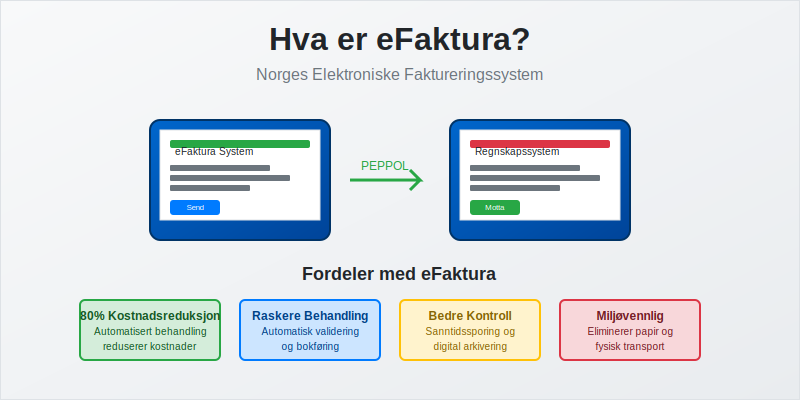
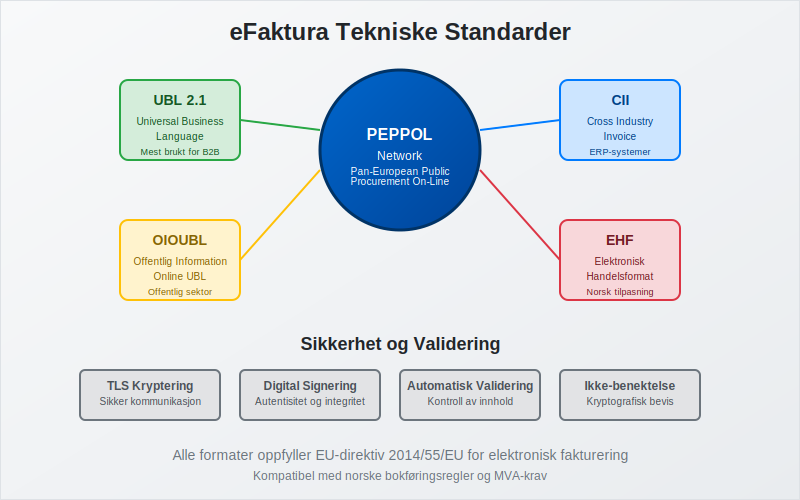
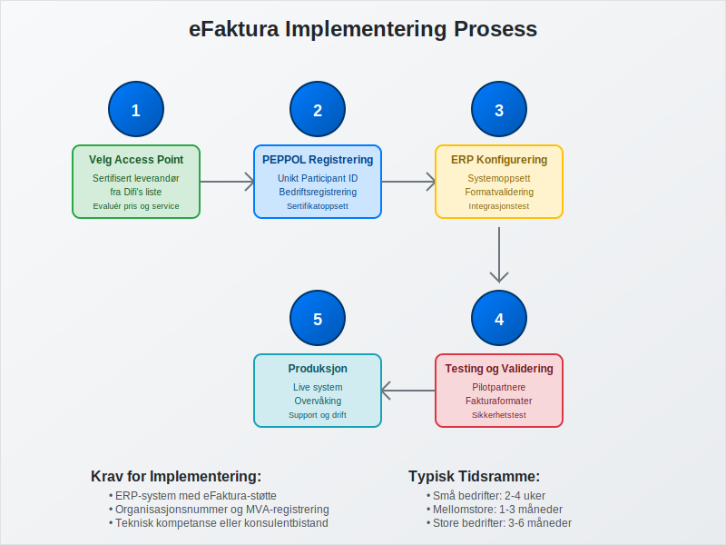
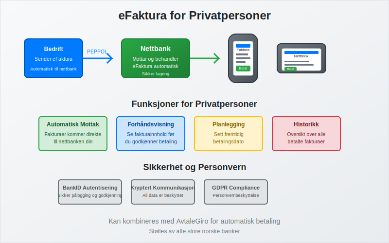
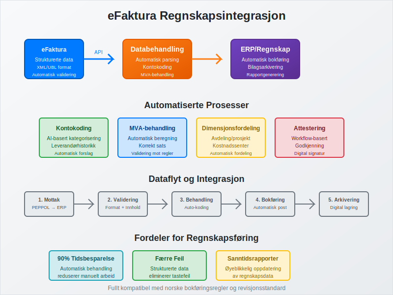

---
title: "Hva er eFaktura?"
seoTitle: "Hva er eFaktura?"
meta_description: '**eFaktura** er Norges elektroniske faktureringssystem som revolusjonerer måten bedrifter og privatpersoner håndterer [fakturaer](/blogs/regnskap/hva-er-en-fa...'
slug: hva-er-efaktura
type: blog
layout: pages/single
---

**eFaktura** er Norges elektroniske faktureringssystem som revolusjonerer måten bedrifter og privatpersoner håndterer [fakturaer](/blogs/regnskap/hva-er-en-faktura "Hva er en Faktura? En Guide til Norske Fakturakrav") på. Dette digitale systemet erstatter tradisjonelle papirfakturaer med strukturerte, elektroniske dokumenter som kan behandles automatisk gjennom hele fakturabehandlingsprosessen - fra utsendelse til [bokføring](/blogs/regnskap/hva-er-bokforing "Hva er Bokføring? Komplett Guide til Regnskapsføring og Bokføringsregler").

For å sikre at brukere autentiserer seg sikkert før de godkjenner eFakturaer, benyttes ofte [BankID](/blogs/regnskap/bankid "Hva er BankID? En komplett guide til BankID i norsk regnskap og elektronisk signering").

eFaktura er en sentral del av det bredere konseptet [elektronisk fakturering](/blogs/regnskap/hva-er-elektronisk-fakturering "Hva er Elektronisk Fakturering? Komplett Guide til Digitale Fakturaløsninger"), som omfatter alle former for digitale fakturaløsninger i Norge.

Systemet benytter **[ELMA](/blogs/regnskap/elma "Hva er ELMA? En Guide til Elektronisk Mottaker- og Avsenderregister")** for å slå opp mottakerens elektroniske adresse og sikre korrekt levering.

eFaktura representerer en fundamental endring i hvordan norske virksomheter håndterer fakturabehandling, og er en sentral del av digitaliseringen av [regnskapet](/blogs/regnskap/hva-er-regnskap "Hva er Regnskap? En Komplett Guide til Regnskapsføring og Rapportering"). Systemet bygger på internasjonale standarder og sikrer både juridisk gyldighet og teknisk interoperabilitet mellom ulike systemer.

## Seksjon 1: Tekniske Standarder og Formater

eFaktura i Norge baserer seg på **PEPPOL-nettverket** (Pan-European Public Procurement On-Line), som er EUs standard for elektronisk fakturabehandling. Dette sikrer at norske bedrifter kan utveksle fakturaer sømløst med partnere i hele Europa.

### 1.1 Støttede Dokumentformater

eFaktura-systemet støtter flere standardiserte formater:

| Format | Beskrivelse | Bruksområde |
|--------|-------------|-------------|
| **UBL 2.1** | Universal Business Language | Mest brukte format for B2B-fakturaer |
| **CII** | Cross Industry Invoice | Alternative til UBL, brukes av enkelte ERP-systemer |
| **OIOUBL** | Offentlig Information Online UBL | Spesielt for offentlig sektor |
| **[EHF](/blogs/regnskap/hva-er-ehf "Hva er EHF? Komplett Guide til Elektronisk Handelsformat i Norge")** | Elektronisk Handelsformat | Norsk tilpasning av UBL |

### 1.2 Juridiske Krav og Validering

For at en eFaktura skal være juridisk gyldig, må den oppfylle de samme kravene som tradisjonelle [fakturaer](/blogs/regnskap/hva-er-en-faktura "Hva er en Faktura? En Guide til Norske Fakturakrav"):

* **[Unikt fakturanummer](/blogs/regnskap/hva-er-fakturanummer "Hva er Fakturanummer? Komplett Guide til Nummerering og Lovkrav")** i sammenhengende serie
* **Fakturadato** og leveringsinformasjon
* **Selgers organisasjonsnummer** og MVA-registrering
* **Kjøpers identifikasjon** og leveringsadresse
* **Detaljert varebeskrivelse** med priser og MVA
* **Totalbeløp** og betalingsinformasjon

Alle eFakturaer valideres automatisk mot disse kravene før de sendes, noe som reduserer feil og sikrer [bokføringsforskriftens](/blogs/regnskap/hva-er-bokforingsforskriften "Hva er Bokføringsforskriften? Komplett Guide til Norske Bokføringsregler") krav oppfylles.

## Seksjon 2: Implementering og Teknisk Infrastruktur

Implementering av eFaktura krever tilgang til **PEPPOL Access Point** - en sertifisert tjenesteleverandør som håndterer den tekniske kommunikasjonen mellom systemer.

### 2.1 Krav til Systemintegrasjon

For å sende og motta eFakturaer må bedrifter ha:

* **[ERP-systemer](/blogs/regnskap/hva-er-erp-system "Hva er ERP-system? Komplett Guide til Enterprise Resource Planning")** eller regnskapssystem med eFaktura-støtte
* **PEPPOL-registrering** med unikt Participant ID
* **Sertifisert Access Point** for teknisk kommunikasjon
* **Validering og testing** av fakturaformater

### 2.2 Registrering og Sertifisering

Prosessen for å bli eFaktura-klar inkluderer:

1. **Velg Access Point-leverandør** fra Difi's godkjente liste
2. **Registrer bedriften** i PEPPOL-nettverket
3. **Konfigurer ERP-system** for eFaktura-støtte
4. **Test fakturaflyt** med pilotpartnere
5. **Gå live** med produksjonssystem

Mange norske [regnskapssystemer](/blogs/regnskap/hva-er-bokforing "Hva er Bokføring? Komplett Guide til Regnskapsføring og Bokføringsregler") har innebygd eFaktura-støtte, noe som forenkler implementeringen betydelig.

## Seksjon 3: Fordeler for Bedrifter

eFaktura gir omfattende fordeler som påvirker hele fakturabehandlingsprosessen, fra [bilagsmottak](/blogs/regnskap/hva-er-bilagsmottak "Bilagsmottak - Komplett Guide til Dokumentmottak og Fakturabehandling") til [attestering](/blogs/regnskap/hva-er-attestering "Hva er Attestering? En Komplett Guide til Bilagsbehandling og Godkjenning").

### 3.1 Økonomiske Besparelser

Studier viser at eFaktura kan redusere fakturabehandlingskostnader med opptil **80%** sammenlignet med papirfakturaer:

| Kostnadselement | Papirfaktura | eFaktura | Besparelse |
|-----------------|--------------|----------|------------|
| Utsendelse | 15-25 kr | 2-5 kr | 70-80% |
| Mottak og registrering | 50-100 kr | 5-15 kr | 85-90% |
| Arkivering | 10-20 kr | 1-3 kr | 85-90% |
| **Total per faktura** | **75-145 kr** | **8-23 kr** | **84-89%** |

#### Eliminering av Fakturagebyr

En viktig økonomisk fordel med eFaktura er at det eliminerer behovet for **[fakturagebyr](/blogs/regnskap/hva-er-fakturagebyr "Hva er Fakturagebyr? Komplett Guide til Faktureringsgebyrer i Norge")**. Mange leverandører krever tilleggsgebyrer på 25-50 kr for papirfakturaer, men må tilby elektroniske alternativer gratis. Ved å velge eFaktura kan bedrifter og privatpersoner derfor spare betydelige beløp over tid:

* **Papirfakturagebyr:** 25-50 kr per faktura
* **eFaktura:** Gratis for mottaker
* **Årlig besparelse:** For en bedrift med 100 fakturaer månedlig kan dette utgjøre 30 000-60 000 kr årlig

### 3.2 Prosesseffektivisering

eFaktura automatiserer store deler av fakturabehandlingen:

* **Automatisk mottak** eliminerer manuell registrering
* **Validering** reduserer feil og reklamasjoner
* **Direkteintegrasjon** med ERP-systemer
* **Automatisk [attestering](/blogs/regnskap/hva-er-attestering "Hva er Attestering? En Komplett Guide til Bilagsbehandling og Godkjenning")** basert på forhåndsdefinerte regler
* **Raskere betalingsflyt** gjennom automatiserte prosesser

### 3.3 Forbedret Kontroll og Sporbarhet

Elektronisk fakturabehandling gir bedre oversikt og kontroll:

* **Sanntidssporing** av fakturastatus
* **Automatisk arkivering** i henhold til [bokføringsloven](/blogs/regnskap/hva-er-bokforingsloven "Hva er Bokføringsloven? Komplett Guide til Norske Bokføringsregler")
* **Integrert rapportering** for økonomisk analyse
* **Redusert risiko** for tap eller feilbehandling av fakturaer

## Seksjon 4: eFaktura for Privatpersoner

For privatpersoner tilbys eFaktura som en tjeneste gjennom nettbanker, hvor fakturaer mottas elektronisk og kan behandles direkte i bankens systemer.

### 4.1 Funksjonalitet i Nettbank

Privatpersoners eFaktura-tjeneste inkluderer:

* **Automatisk mottak** av fakturaer fra registrerte avsendere
* **Forhåndsvisning** av fakturainnhold før betaling
* **Betalingsplanlegging** med mulighet for fremtidig betaling
* **Historikk** over alle mottatte og betalte fakturaer
* **Integration** med [AvtaleGiro](/blogs/regnskap/hva-er-avtalegiro "Hva er AvtaleGiro? Komplett Guide til Automatisk Betaling") for automatisk betaling
* **[KID-nummer](/blogs/regnskap/hva-er-kid-nummer "Hva er KID-nummer? Komplett Guide til Kunde-IDentifikasjon i Norge")** for automatisk identifikasjon og avstemming av betalinger

### 4.2 Sikkerhet og Personvern

eFaktura for privatpersoner er underlagt strenge sikkerhetskrav:

* **Kryptering** av all kommunikasjon
* **Autentisering** gjennom BankID
* **Tilgangskontroll** basert på kontorettigheter
* **Revisjonsspor** for alle transaksjoner
* **GDPR-compliance** for personvernbeskyttelse

## Seksjon 5: Offentlig Sektor og Pålagte Krav

Den norske stat har innført **obligatorisk eFaktura** for alle leverandører til offentlig sektor fra 2019. Dette påvirker tusenvis av bedrifter som leverer varer og tjenester til stat, fylke og kommuner.

### 5.1 Krav til Offentlige Anskaffelser

Alle [anskaffelser](/blogs/regnskap/hva-er-anskaffelser "Hva er Anskaffelser? En Komplett Guide til Offentlige og Private Innkjøp") over 100 000 kr til offentlig sektor må faktureres elektronisk:

* **EHF-format** er påkrevd for offentlig sektor
* **PEPPOL-registrering** er obligatorisk
* **Validering** mot offentlige krav må bestås
* **Leverandørregistrering** i offentlige systemer

### 5.2 Sanksjoner ved Manglende Etterlevelse

Leverandører som ikke sender eFaktura til offentlig sektor risikerer:

* **Forsinket betaling** på grunn av manuell behandling
* **Ekstra behandlingsgebyrer** fra offentlige innkjøpere
* **Utelukkelse** fra fremtidige anbudsrunder
* **Kontraktbrudd** i alvorlige tilfeller

## Seksjon 6: Integrasjon med Regnskapssystemer

eFaktura integreres sømløst med moderne regnskapssystemer og påvirker hele [bokføringsprosessen](/blogs/regnskap/hva-er-bokforing "Hva er Bokføring? Komplett Guide til Regnskapsføring og Bokføringsregler").

### 6.1 Automatisk Bokføring

Strukturerte eFakturaer muliggjør automatisk bokføring:

* **Kontokoding** basert på varebeskrivelser og leverandørhistorikk
* **MVA-behandling** automatiseres gjennom strukturerte data
* **Dimensjonsfordeling** for avdelings- og prosjektregnskap
* **Integrasjon** med [bilagsføring](/blogs/regnskap/hva-er-bilagsforing "Hva er Bilagsføring? Komplett Guide til Regnskapsbilag og Dokumentasjon")

### 6.2 Forbedret Rapportering

eFaktura gir bedre grunnlag for økonomisk rapportering:

* **Sanntidsdata** for [driftsregnskap](/blogs/regnskap/hva-er-driftsregnskap "Hva er Driftsregnskap? Komplett Guide til Driftsresultat og Lønnsomhetsanalyse")
* **Automatisk kategorisering** av [driftskostnader](/blogs/regnskap/hva-er-driftskostnader "Hva er Driftskostnader? Komplett Guide til Kostnadstyper og Regnskapsføring")
* **Forbedret [budsjettoppfølging](/blogs/regnskap/hva-er-budsjettering "Hva er Budsjettering? Komplett Guide til Budsjettplanlegging og Økonomistyring")**
* **Integrert analyse** av leverandørforhold og innkjøpsmønstre

## Seksjon 7: Sikkerhet og Compliance

eFaktura-systemet er bygget med omfattende sikkerhetstiltak for å beskytte sensitive forretningsdata og sikre juridisk gyldighet.

### 7.1 Teknisk Sikkerhet

PEPPOL-nettverket implementerer flere sikkerhetslag:

* **TLS-kryptering** for all kommunikasjon
* **Digital signering** av alle fakturaer
* **Sertifikatbasert autentisering** av alle parter
* **Ikke-benektelse** gjennom kryptografiske bevis
* **Integritetskontroll** av fakturainnhold

### 7.2 Juridisk Gyldighet

eFakturaer har samme juridiske status som papirfakturaer når de oppfyller:

* **[Bokføringslovens](/blogs/regnskap/hva-er-bokforingsloven "Hva er Bokføringsloven? Komplett Guide til Norske Bokføringsregler") krav** til dokumentasjon
* **Sporbarhet** gjennom hele prosessen
* **Arkivering** i henhold til lovpålagte oppbevaringsfrister
* **Tilgjengelighet** for revisjon og kontroll

## Seksjon 8: Fremtidige Utviklingstrender

eFaktura-teknologien utvikler seg kontinuerlig med nye funksjoner og forbedringer som vil påvirke fremtidens fakturabehandling.

### 8.1 Kunstig Intelligens og Automatisering

Nye AI-teknologier vil revolusjonere fakturabehandling:

* **Intelligent kontokoding** basert på maskinlæring
* **Automatisk [attestering](/blogs/regnskap/hva-er-attestering "Hva er Attestering? En Komplett Guide til Bilagsbehandling og Godkjenning")** gjennom AI-validering
* **Prediktiv analyse** for [betalingsevne](/blogs/regnskap/hva-er-betalingsevne "Hva er Betalingsevne? Analyse av Likviditet og Finansiell Stabilitet") og risiko
* **Automatisk matching** mot bestillinger og leveranser

### 8.2 Blockchain og Distribuerte Systemer

Fremtidige eFaktura-systemer kan inkludere:

* **Blockchain-basert** sporbarhet og ikke-benektelse
* **Smart contracts** for automatisk betaling ved leveranse
* **Distribuert arkivering** for økt sikkerhet
* **Kryptovaluta-integrasjon** for grenseoverskridende handel

### 8.3 Utvidet Funksjonalitet

Kommende funksjoner inkluderer:

* **Sanntids fakturavalidering** mot leveranser
* **Integrert kvalitetskontroll** og reklamasjonshåndtering
* **Automatisk [avstemming](/blogs/regnskap/hva-er-avstemming "Hva er Avstemming? Komplett Guide til Regnskapsavstemming og Kontroll")**
* **Forbedret rapportering** og analyse

For internasjonale transaksjoner kan også **[proformafakturaer](/blogs/regnskap/hva-er-proformafaktura "Hva er Proformafaktura? Komplett Guide til Foreløpige Fakturaer")** digitaliseres og integreres med eFaktura-systemet for å effektivisere tollbehandling og finansieringsløsninger før faktisk levering og fakturering.

## Seksjon 9: Implementeringsguide for Bedrifter

For bedrifter som ønsker å implementere eFaktura, er det viktig å følge en strukturert tilnærming som sikrer vellykket innføring.

### 9.1 Forberedelse og Planlegging

Før implementering bør bedriften:

* **Kartlegge nåværende fakturavolum** og leverandørbase
* **Evaluere ERP-systemets** eFaktura-kapasiteter
* **Identifisere nøkkelpartnere** for pilottesting
* **Budsjettere** implementerings- og driftskostnader
* **Planlegge opplæring** av personale

### 9.2 Leverandørvalg og Kontrakter

Valg av riktig Access Point-leverandør er kritisk:

| Vurderingskriterier | Viktighet | Beskrivelse |
|---------------------|-----------|-------------|
| **Teknisk kompetanse** | Høy | Erfaring med PEPPOL og ERP-integrasjon |
| **Support og service** | Høy | 24/7 support og norskspråklig hjelp |
| **Prising** | Medium | Konkurransedyktige priser for volum |
| **Skalerbarhet** | Medium | Mulighet for vekst og utvidelse |
| **Sertifiseringer** | Høy | Godkjent av Difi og relevante myndigheter |

### 9.3 Testing og Validering

Grundig testing er essensielt for vellykket implementering:

* **Teknisk testing** av fakturaformater og validering
* **Prosesstest** med utvalgte leverandører
* **Integrasjonstest** med regnskapssystem
* **Brukertest** av nye arbeidsflyter
* **Sikkerhetstest** av alle kommunikasjonskanaler

## Seksjon 10: Kostnader og Lønnsomhetsanalyse

Implementering av eFaktura krever initial investering, men gir betydelige besparelser over tid.

### 10.1 Implementeringskostnader

Typiske kostnader for eFaktura-implementering:

| Kostnadskategori | Små bedrifter | Mellomstore | Store bedrifter |
|------------------|---------------|-------------|-----------------|
| **ERP-oppgradering** | 50 000 - 150 000 kr | 200 000 - 500 000 kr | 500 000 - 2 000 000 kr |
| **Access Point-setup** | 10 000 - 25 000 kr | 25 000 - 50 000 kr | 50 000 - 100 000 kr |
| **Konsulentbistand** | 25 000 - 75 000 kr | 75 000 - 200 000 kr | 200 000 - 500 000 kr |
| **Opplæring** | 15 000 - 30 000 kr | 30 000 - 75 000 kr | 75 000 - 200 000 kr |
| **Testing og validering** | 10 000 - 20 000 kr | 20 000 - 50 000 kr | 50 000 - 150 000 kr |

### 10.2 Driftskostnader

Løpende kostnader for eFaktura-drift:

* **Access Point-avgifter:** 2-10 kr per sendt/mottatt faktura
* **Systemvedlikehold:** 10-20% av systemkostnad årlig
* **Support og drift:** 50 000 - 200 000 kr årlig avhengig av størrelse

### 10.3 Lønnsomhetsberegning

For en bedrift med 1000 fakturaer månedlig:

**Årlige besparelser:**
* Reduserte behandlingskostnader: 600 000 - 1 200 000 kr
* Mindre feil og reklamasjoner: 100 000 - 300 000 kr
* Raskere betalingsflyt: 200 000 - 500 000 kr
* **Total årlig besparelse:** 900 000 - 2 000 000 kr

**Tilbakebetalingstid:** Typisk 6-18 måneder avhengig av fakturavolum og kompleksitet.

## Konklusjon

eFaktura representerer fremtiden for fakturabehandling i Norge og er en kritisk komponent i digitaliseringen av norsk næringsliv. Systemet tilbyr betydelige fordeler gjennom kostnadsbesparelser, prosesseffektivisering og forbedret kontroll, samtidig som det sikrer juridisk gyldighet og compliance med norske regnskapskrav.

For bedrifter som ennå ikke har implementert eFaktura, blir det stadig viktigere å vurdere overgangen - ikke bare på grunn av krav fra offentlig sektor, men også for å opprettholde konkurranseevne i et stadig mer digitalisert marked. Med riktig planlegging og implementering kan eFaktura transformere fakturabehandlingen fra en administrativ byrde til en strategisk fordel.

Fremtidige utviklinger innen AI, blockchain og automatisering vil ytterligere styrke eFakturas rolle som ryggraden i moderne [regnskapsføring](/blogs/regnskap/hva-er-regnskap "Hva er Regnskap? En Komplett Guide til Regnskapsføring og Rapportering") og finansiell styring.

