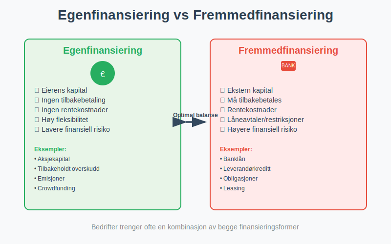
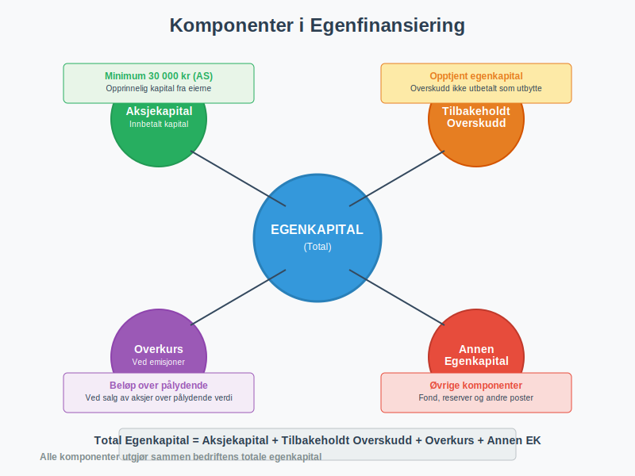
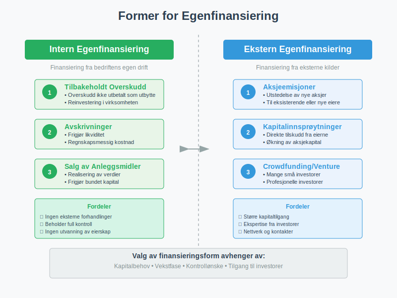

---
title: "Hva er Egenfinansiering?"
meta_title: "Hva er Egenfinansiering?"
meta_description: '**Egenfinansiering** er finansiering av en bedrift gjennom egenkapital fra eierne, i motsetning til fremmedfinansiering gjennom lån og kreditt. Som en viktig m...'
slug: hva-er-egenfinansiering
type: blog
layout: pages/single
---

**Egenfinansiering** er finansiering av en bedrift gjennom egenkapital fra eierne, i motsetning til fremmedfinansiering gjennom lån og kreditt. Som en viktig metode for å skaffe [finanskapital](/blogs/regnskap/hva-er-finanskapital "Hva er Finanskapital? Definisjon, Typer og Betydning i Regnskap"), er dette en grunnleggende [finansieringsform](/blogs/regnskap/hva-er-finansiering "Hva er Finansiering? Komplett Guide til Bedriftsfinansiering og Finansieringsformer") som gir bedriften kapital uten å skape gjeld eller renteforpliktelser.



### Hva er Egenfinansiering?

Egenfinansiering innebærer at bedriften finansieres gjennom **egenkapital** - penger og verdier som tilføres av eierne selv. Dette står i motsetning til fremmedfinansiering, hvor bedriften låner penger fra banker, leverandører eller andre eksterne kilder.

#### Hovedkomponenter i Egenfinansiering

Egenfinansiering består av flere elementer som sammen utgjør bedriftens egenkapital:

* **[Aksjekapital](/blogs/regnskap/hva-er-aksjekapital "Hva er Aksjekapital? Krav og Forklaring")** - Den opprinnelige kapitalen som eierne skyter inn
* **Tilbakeholdt overskudd** - Overskudd som ikke utbetales som utbytte, men beholdes i selskapet
* **Overkurs** - Beløp betalt utover pålydende verdi ved aksjeemisjoner
* **Annen egenkapital** - Andre former for eierkapital som ikke faller inn under de øvrige kategoriene



### Egenfinansiering vs. Fremmedfinansiering

For å forstå egenfinansiering fullt ut, er det viktig å se forskjellene mot fremmedfinansiering:

| Aspekt | Egenfinansiering | Fremmedfinansiering |
|--------|------------------|---------------------|
| **Eierskap** | Eierne beholder kontroll | Ingen endring i eierskap |
| **Tilbakebetaling** | Ingen forpliktelse til tilbakebetaling | Må tilbakebetales med renter |
| **Risiko** | Lavere finansiell risiko | Høyere finansiell risiko |
| **Kostnad** | Alternativkostnad (tapt avkastning) | Rentekostnader |
| **Fleksibilitet** | Høy fleksibilitet | Begrenset av låneavtaler |
| **Skatteeffekt** | Ingen skattefradrag | Rentekostnader er fradragsberettiget |

### Former for Egenfinansiering

#### Intern Egenfinansiering

**Intern egenfinansiering** skjer når bedriften finansierer seg selv gjennom tilbakeholdt overskudd:

* **Tilbakeholdt overskudd** - [Driftsresultat](/blogs/regnskap/hva-er-driftsresultat "Hva er Driftsresultat? Beregning og Betydning for Bedriften") som ikke utbetales som utbytte
* **[Avskrivninger](/blogs/regnskap/hva-er-avskrivning "Hva er Avskrivning? Komplett Guide til Regnskapsmessige Avskrivninger")** - Regnskapsmessige avskrivninger som frigjør likviditet
* **Salg av [anleggsmidler](/blogs/regnskap/hva-er-anleggsmidler "Hva er Anleggsmidler? Komplett Guide til Varige Driftsmidler")** - Realisering av verdier i bedriften

#### Ekstern Egenfinansiering

**Ekstern egenfinansiering** innebærer tilførsel av ny egenkapital fra eksterne kilder:

* **Aksjeemisjoner** - Utstedelse av nye [aksjer](/blogs/regnskap/hva-er-en-aksje "Hva er en Aksje? En Enkel Forklaring") til eksisterende eller nye eiere
* **Kapitalinnsprøytninger** - Direkte tilskudd fra eierne
* **[Crowdfunding](/blogs/regnskap/hva-er-crowdfunding "Hva er Crowdfunding i Regnskap? Regnskapsføring, Skatt og Juridiske Krav")** - Innsamling av kapital fra mange små investorer
* **Venturekapital** - Profesjonelle investorer som kjøper eierandeler



### Fordeler med Egenfinansiering

#### Finansiell Stabilitet

* **Ingen rentekostnader** - Egenkapital medfører ikke løpende renteutgifter
* **Ingen tilbakebetalingsforpliktelser** - Kapitalen trenger ikke tilbakebetales på bestemte tidspunkter
* **Bedre [betalingsevne](/blogs/regnskap/hva-er-betalingsevne "Hva er Betalingsevne? Analyse av Likviditet og Soliditet")** - Sterkere finansiell posisjon

#### Operasjonell Fleksibilitet

* **Færre restriksjoner** - Ingen låneavtaler som begrenser handlingsrommet
* **Fleksibel utbyttepolitikk** - Eierne kan selv bestemme når og hvor mye som utbetales
* **Lettere å tiltrekke fremmedkapital** - Høy egenkapitalandel gjør bedriften mer attraktiv for långivere

#### Strategiske Fordeler

* **Kontroll over virksomheten** - Eierne beholder full kontroll
* **Langsiktig perspektiv** - Mindre press om kortsiktig lønnsomhet
* **Fleksibilitet i investeringer** - Kan investere i langsiktige prosjekter

### Ulemper med Egenfinansiering

#### Kapitalkostnader

* **Høyere kapitalkostnad** - Egenkapital er normalt dyrere enn fremmedkapital
* **Alternativkostnad** - Eierne kunne investert pengene andre steder
* **Ingen skattefordel** - Utbytte er ikke fradragsberettiget som rentekostnader

#### Begrensninger

* **Begrenset tilgang** - Ikke alle bedrifter har tilgang til tilstrekkelig egenkapital
* **Utvanning av eierskap** - Nye aksjonærer reduserer eksisterende eieres andel
* **Høyere [avkastningskrav](/blogs/regnskap/hva-er-avkastning "Hva er Avkastning? Komplett Guide til Investeringsavkastning og Beregning")** - Investorer forventer høyere avkastning på egenkapital

### Egenkapitalandel og Soliditet

**Egenkapitalandelen** er et viktig nøkkeltall som viser hvor stor andel av bedriftens [aktiva](/blogs/regnskap/hva-er-aktiva "Hva er Aktiva? Komplett Guide til Eiendeler i Regnskapet") som er finansiert med egenkapital:

```
Egenkapitalandel = (Egenkapital / Sum aktiva) × 100%
```

#### Anbefalte Egenkapitalandeler

| Bransje | Anbefalt egenkapitalandel |
|---------|---------------------------|
| **Handel** | 20-30% |
| **Industri** | 30-40% |
| **Tjenester** | 25-35% |
| **Eiendom** | 15-25% |
| **Teknologi** | 40-60% |

En høy egenkapitalandel indikerer:
* **God soliditet** - Bedriften tåler økonomiske tilbakeslag
* **Lav finansiell risiko** - Mindre sårbar for renteendringer
* **Attraktiv for långivere** - Lettere å få lån på gunstige vilkår

### Egenfinansiering i Ulike Selskapsformer

#### Aksjeselskap (AS)

I et [aksjeselskap](/blogs/regnskap/hva-er-et-aksjeselskap "Hva er et Aksjeselskap? Komplett Guide til Selskapsformen") skjer egenfinansiering primært gjennom:

* **Innbetalt aksjekapital** - Minimum 30 000 kr ved oppstart
* **Emisjoner** - Utstedelse av nye aksjer
* **Tilbakeholdt overskudd** - Overskudd som ikke utbetales som utbytte
* **[Aksjonærlån til AS](/blogs/regnskap/hva-er-aksjonaerlan-til-as "Hva er Aksjonærlån til AS? Finansiering, Skatt og Praktiske Råd")** - Lån fra aksjonærer som kan konverteres til egenkapital

#### Enkeltpersonforetak

For enkeltpersonforetak består egenfinansieringen av:

* **Eierens private kapital** - Penger eieren skyter inn
* **Tilbakeholdt overskudd** - Overskudd som reinvesteres i virksomheten
* **Privatgarantier** - Eierens personlige garantier

### Regnskapsføring av Egenfinansiering

Egenfinansiering påvirker [balansen](/blogs/regnskap/hva-er-balanse "Hva er Balanse? Komplett Guide til Balanseregnskap") på følgende måte:

#### Ved Kapitalinnskudd

```
Debet: Bank/Kasse
Kredit: Aksjekapital/Egenkapital
```

#### Ved Tilbakeholdt Overskudd

```
Debet: Årsresultat
Kredit: Opptjent egenkapital
```

Korrekt [regnskapsføring](/blogs/regnskap/hva-er-bokforing "Hva er Bokføring? Komplett Guide til Regnskapsføring") av egenfinansiering er viktig for å gi et riktig bilde av bedriftens finansielle stilling.

### Strategier for Optimal Egenfinansiering

#### Planlegging av Kapitalstruktur

* **Analyser kapitalbehov** - Vurder langsiktige finansieringsbehov
* **Optimaliser kapitalstrukturen** - Finn riktig balanse mellom egen- og fremmedkapital
* **Vurder timing** - Velg riktig tidspunkt for kapitalinnhenting

#### Intern Kapitaloppbygging

* **Effektiv [budsjettering](/blogs/regnskap/hva-er-budsjettering "Hva er Budsjettering? Komplett Guide til Budsjettplanlegging")** - Planlegg for tilbakeholdt overskudd
* **Kostnadsoptimalisering** - Reduser unødvendige kostnader for å øke overskuddet
* **Investeringsdisiplin** - Prioriter investeringer som gir høy avkastning

#### Eksterne Finansieringskilder

* **Investor relations** - Bygg relasjoner med potensielle investorer
* **Profesjonell presentasjon** - Utvikl overbevisende forretningsplaner
* **Nettverk** - Bruk profesjonelle nettverk for å finne investorer

### Moderne Egenfinansieringsmetoder

#### Crowdfunding og Alternative Finansieringsformer

Moderne teknologi har åpnet for nye former for egenfinansiering:

* **[Crowdfunding](/blogs/regnskap/hva-er-crowdfunding "Hva er Crowdfunding i Regnskap? Regnskapsføring, Skatt og Juridiske Krav")** - Innsamling fra mange små investorer
* **Peer-to-peer investering** - Direkte investering mellom privatpersoner
* **Online investeringsplattformer** - Digitale markedsplasser for kapital

#### Skattemessige Hensyn

Ved egenfinansiering må man vurdere:

* **Utbytteskatt** - Skatt på utbetalt utbytte til eierne
* **Gevinst- og tapskonto** - Skattemessig behandling av kapitalgevinster
* **Fradragsrett** - Manglende fradragsrett for "renter" på egenkapital

### Måling og Oppfølging

#### Nøkkeltall for Egenfinansiering

* **Egenkapitalandel** - (Egenkapital / Sum aktiva) × 100%
* **Egenkapitalrentabilitet** - (Årsresultat / Gjennomsnittlig egenkapital) × 100%
* **Soliditetsgrad** - Egenkapital / (Egenkapital + Langsiktig gjeld)

#### Rapportering og Analyse

Regelmessig analyse av egenfinansieringen bør inkludere:

* **Utvikling i egenkapitalandel** - Følg utviklingen over tid
* **Sammenligning med bransjen** - Benchmark mot konkurrenter
* **Fremtidige kapitalbehov** - Planlegg for vekst og investeringer

### Juridiske og Regulatoriske Aspekter

#### Aksjeloven og Egenkapitalkrav

[Aksjeloven](/blogs/regnskap/hva-er-aksjeloven "Hva er Aksjeloven? Regler for Aksjeselskaper i Norge") stiller krav til:

* **Minimum aksjekapital** - 30 000 kr for AS, 1 million kr for ASA
* **Kapitalnedsettelse** - Prosedyrer for reduksjon av aksjekapital
* **Utbytteregler** - Begrensninger på utbetaling av utbytte

#### Regnskapslovens Krav

[Regnskapsloven](/blogs/regnskap/hva-er-regnskap "Hva er Regnskap? En komplett guide") krever:

* **Korrekt klassifisering** - Riktig presentasjon av egenkapitalkomponenter
* **Noteopplysninger** - Detaljert informasjon om egenkapitalendringer
* **Årsberetning** - Redegjørelse for kapitalforvaltningen

### Praktiske Råd for Bedriftsledere

#### Oppstart og Vekstfase

* **Sørg for tilstrekkelig startkapital** - Ikke undervurder kapitalbehovet
* **Planlegg for vekst** - Vurder fremtidige finansieringsbehov
* **Bygg kredibilitet** - Etabler gode relasjoner med potensielle investorer

#### Etablerte Bedrifter

* **Optimaliser kapitalstrukturen** - Finn riktig balanse mellom finansieringsformer
* **Vurder tilbakekjøp av aksjer** - Kan være aktuelt ved overskudd av kapital
* **Planlegg utbyttepolitikk** - Balancer mellom utbetaling og reinvestering

### Fremtidige Trender

#### Digitalisering av Kapitalmarkedene

* **Blockchain-baserte løsninger** - Nye teknologier for kapitaltransaksjoner
* **Automatiserte investeringsplattformer** - AI-drevne matchmaking mellom bedrifter og investorer
* **Tokenisering** - Digitale representasjoner av eierandeler

#### Bærekraftig Finansiering

* **ESG-investering** - Økende fokus på miljø, samfunn og styring
* **Impact investing** - Investering med målsetning om positiv samfunnspåvirkning
* **Grønn finansiering** - Spesialiserte finansieringsformer for bærekraftige prosjekter

### Relaterte Begreper og Konsepter

For å forstå egenfinansiering fullt ut, bør du også sette deg inn i:

* **[Aksjekapital](/blogs/regnskap/hva-er-aksjekapital "Hva er Aksjekapital? Krav og Forklaring")** - Grunnleggende egenkapital i aksjeselskaper
* **[Aksjer](/blogs/regnskap/hva-er-en-aksje "Hva er en Aksje? En Enkel Forklaring")** - Eierandeler som representerer egenkapital
* **[Aksjeselskap](/blogs/regnskap/hva-er-et-aksjeselskap "Hva er et Aksjeselskap? Komplett Guide til Selskapsformen")** - Selskapsform som benytter egenfinansiering
* **[Aktiva](/blogs/regnskap/hva-er-aktiva "Hva er Aktiva? Komplett Guide til Eiendeler i Regnskapet")** - Eiendeler som finansieres gjennom egenkapital
* **[Avkastning](/blogs/regnskap/hva-er-avkastning "Hva er Avkastning? Komplett Guide til Investeringsavkastning og Beregning")** - Forventet avkastning på egenkapital
* **[Balanse](/blogs/regnskap/hva-er-balanse "Hva er Balanse? Komplett Guide til Balanseregnskap")** - Hvor egenkapitalen presenteres
* **[Betalingsevne](/blogs/regnskap/hva-er-betalingsevne "Hva er Betalingsevne? Analyse av Likviditet og Soliditet")** - Påvirkes av egenkapitalandelen
* **[Crowdfunding](/blogs/regnskap/hva-er-crowdfunding "Hva er Crowdfunding i Regnskap? Regnskapsføring, Skatt og Juridiske Krav")** - Moderne form for egenfinansiering
* **[Driftsresultat](/blogs/regnskap/hva-er-driftsresultat "Hva er Driftsresultat? Beregning og Betydning for Bedriften")** - Grunnlag for intern egenfinansiering

Egenfinansiering er en fundamental del av bedriftens kapitalstruktur som krever grundig planlegging og forståelse av både fordeler og ulemper. Ved å velge riktig balanse mellom egenfinansiering og fremmedfinansiering kan bedrifter optimalisere sin finansielle posisjon og skape grunnlag for bærekraftig vekst.


