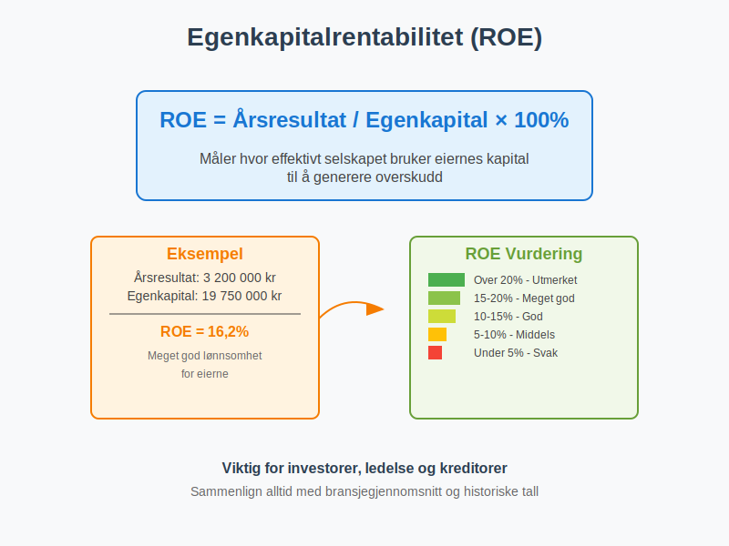
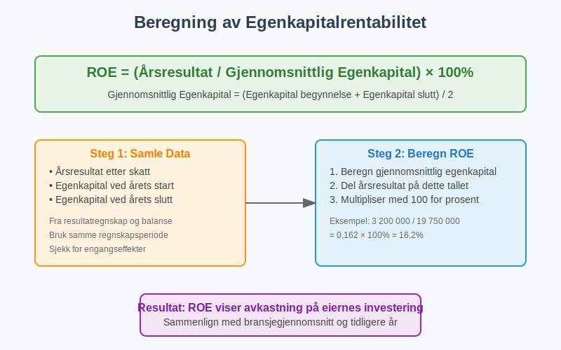
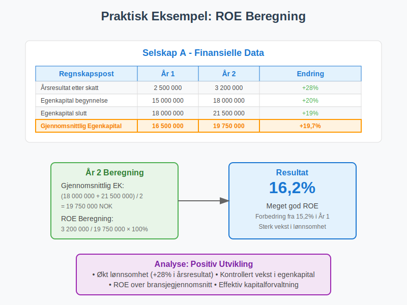
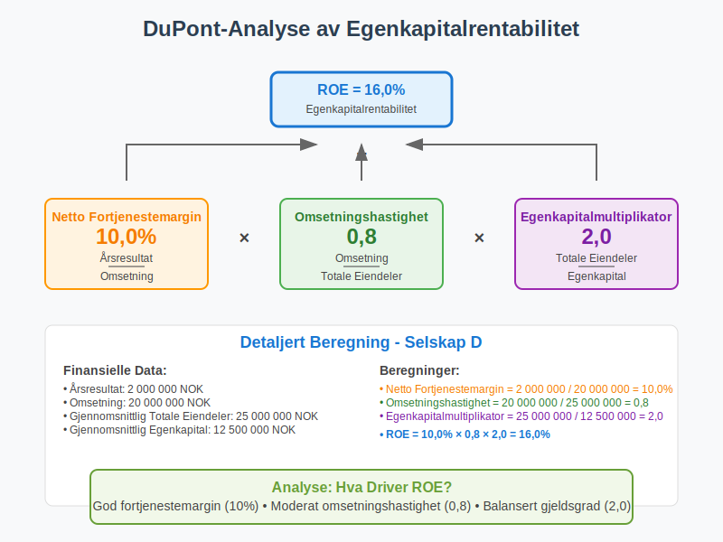
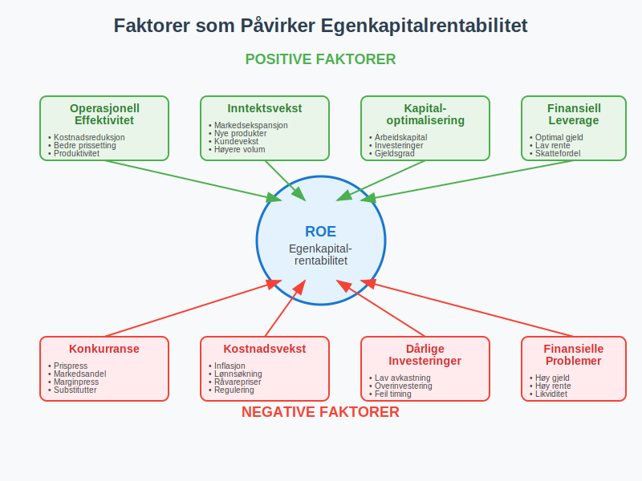
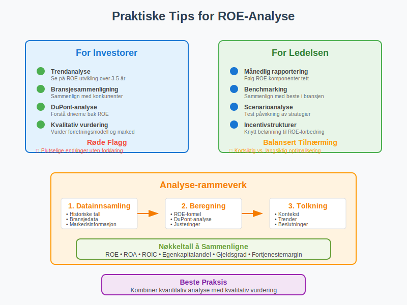

---
title: "Hva er Egenkapitalrentabilitet?"
seoTitle: "Hva er Egenkapitalrentabilitet?"
description: '**Egenkapitalrentabilitet** (ROE - Return on Equity) er et av de viktigste nøkkeltallene for å måle hvor effektivt et selskap bruker eiernes kapital til å g...'
---

**Egenkapitalrentabilitet** (ROE - Return on Equity) er et av de viktigste nøkkeltallene for å måle hvor effektivt et selskap bruker eiernes kapital til å generere overskudd. Dette finansielle måltallet viser hvor mye avkastning eierne får på sin investerte [egenkapital](/blogs/regnskap/hva-er-egenkapital "Hva er Egenkapital? Komplett Guide til Egenkapital i Regnskap") og er sentralt i [finansiell analyse](/blogs/regnskap/hva-er-regnskap "Hva er Regnskap? En komplett guide") og investeringsbeslutninger.

## Definisjon og Grunnleggende Forståelse

**Egenkapitalrentabilitet** defineres som forholdet mellom et selskaps årsresultat og gjennomsnittlig egenkapital over samme periode. Det uttrykkes vanligvis som en prosentandel og viser hvor mange kroner i overskudd selskapet genererer per krone investert egenkapital.

### Grunnleggende Formel

**Egenkapitalrentabilitet = (Årsresultat / Gjennomsnittlig Egenkapital) × 100%**

Hvor:
- **Årsresultat** = Nettoresultat etter skatt fra [resultatregnskapet](/blogs/regnskap/hva-er-driftsresultat "Hva er Driftsresultat? Komplett Guide til Driftsresultat")
- **Gjennomsnittlig Egenkapital** = (Egenkapital ved årets begynnelse + Egenkapital ved årets slutt) / 2

## Hvorfor er Egenkapitalrentabilitet Viktig?

Egenkapitalrentabilitet er viktig av flere grunner:

### For Investorer
- **Sammenligning** av lønnsomhet mellom ulike selskaper
- **Vurdering** av ledelsens effektivitet i kapitalforvaltning
- **Beslutningsgrunnlag** for investeringer og porteføljevalg
- **Benchmarking** mot bransjegjennomsnitt og konkurrenter
- **Grunnlag for verdsettelse** i [inntjeningsbaserte verdsettelsesmetoder](/blogs/regnskap/hva-er-inntjeningsbasert-verdivurdering "Inntjeningsbasert Verdivurdering - DCF, P/E og Verdsettelsesmetoder")

### For Ledelsen
- **Måling** av operasjonell effektivitet
- **Evaluering** av strategiske beslutninger
- **Incentivstruktur** for ledelse og ansatte
- **Kommunikasjon** med aksjonærer og interessenter

### For Kreditorer
- **Vurdering** av selskapets evne til å generere avkastning
- **Risikoanalyse** for utlån og kredittfasiliteter
- **Overvåking** av finansiell helse over tid

## Beregning av Egenkapitalrentabilitet

La oss se på praktiske eksempler på hvordan egenkapitalrentabilitet beregnes:

### Eksempel 1: Grunnleggende Beregning

**Selskap A - Finansielle Data:**

| **Regnskapspost** | **År 1** | **År 2** |
|-------------------|----------|----------|
| Årsresultat etter skatt | 2 500 000 | 3 200 000 |
| Egenkapital ved årets begynnelse | 15 000 000 | 18 000 000 |
| Egenkapital ved årets slutt | 18 000 000 | 21 500 000 |

**Beregning for År 2:**
- Gjennomsnittlig egenkapital = (18 000 000 + 21 500 000) / 2 = **19 750 000 NOK**
- Egenkapitalrentabilitet = (3 200 000 / 19 750 000) × 100% = **16,2%**

### Eksempel 2: Sammenligning av Selskaper

| **Selskap** | **Årsresultat** | **Gjennomsnittlig Egenkapital** | **ROE** |
|-------------|-----------------|--------------------------------|---------|
| Selskap A | 3 200 000 | 19 750 000 | **16,2%** |
| Selskap B | 1 800 000 | 12 000 000 | **15,0%** |
| Selskap C | 4 500 000 | 35 000 000 | **12,9%** |

Selv om Selskap C har høyest absolutt overskudd, har Selskap A best egenkapitalrentabilitet.

## DuPont-Analysen: Dypere Forståelse av ROE

**DuPont-analysen** bryter ned egenkapitalrentabilitet i tre komponenter for å gi dypere innsikt:

### DuPont-Formelen

**ROE = Netto Fortjenestemargin × Omsetningshastighet × Egenkapitalmultiplikator**

Hvor:
- **Netto Fortjenestemargin** = Årsresultat / Omsetning
- **Omsetningshastighet** = Omsetning / Gjennomsnittlig Totale Eiendeler
- **Egenkapitalmultiplikator** = Gjennomsnittlig Totale Eiendeler / Gjennomsnittlig Egenkapital

### Praktisk DuPont-Eksempel

**Selskap D - Detaljert Analyse:**

| **Komponent** | **Beregning** | **Resultat** |
|---------------|---------------|--------------|
| Årsresultat | | 2 000 000 |
| Omsetning | | 20 000 000 |
| Gjennomsnittlig Totale Eiendeler | | 25 000 000 |
| Gjennomsnittlig Egenkapital | | 12 500 000 |
| | | |
| **Netto Fortjenestemargin** | 2 000 000 / 20 000 000 | **10,0%** |
| **Omsetningshastighet** | 20 000 000 / 25 000 000 | **0,8** |
| **Egenkapitalmultiplikator** | 25 000 000 / 12 500 000 | **2,0** |
| | | |
| **ROE** | 10,0% × 0,8 × 2,0 | **16,0%** |

## Tolkning og Vurdering av Egenkapitalrentabilitet

### Generelle Retningslinjer

| **ROE-Nivå** | **Vurdering** | **Betydning** |
|--------------|---------------|---------------|
| Over 20% | Utmerket | Meget høy lønnsomhet og effektivitet |
| 15-20% | Meget god | Sterk finansiell prestasjon |
| 10-15% | God | Akseptabel avkastning for eierne |
| 5-10% | Middels | Moderat lønnsomhet, kan forbedres |
| Under 5% | Svak | Lav avkastning, bekymringsfullt |

### Bransjeforskjeller

Egenkapitalrentabilitet varierer betydelig mellom bransjer:

#### Høy ROE-Bransjer
- **Teknologi og programvare**: 15-25%
- **Finansielle tjenester**: 10-20%
- **Konsumvarer**: 12-18%
- **Helsevesen og farmasøytisk**: 15-25%

#### Moderat ROE-Bransjer
- **Detaljhandel**: 8-15%
- **Industri og produksjon**: 8-12%
- **Telekommunikasjon**: 6-12%

#### Lav ROE-Bransjer
- **Forsyningsselskaper**: 5-10%
- **Eiendom**: 4-8%
- **Råvarer og gruvedrift**: 5-12%

## Faktorer som Påvirker Egenkapitalrentabilitet

### Positive Faktorer

#### Operasjonelle Forbedringer
- **Økt fortjenestemargin** gjennom kostnadsreduksjoner
- **Høyere omsetningshastighet** gjennom effektiv ressursbruk
- **Bedre prissetting** og produktmiks
- **Operasjonell effektivitet** og produktivitetsforbedringer

#### Finansielle Strategier
- **Optimal kapitalstruktur** med balansert gjeldsgrad
- **Effektiv arbeidskapitalstyring**
- **Strategiske investeringer** med høy avkastning
- **Utbyttepolitikk** som balanserer vekst og utdelinger

### Negative Faktorer

#### Operasjonelle Utfordringer
- **Fallende fortjenestemarginer** på grunn av konkurranse
- **Lav kapitalomsetning** og ineffektiv ressursbruk
- **Høye driftskostnader** og operasjonelle ineffektiviteter
- **Markedssvikt** og redusert etterspørsel

#### Finansielle Problemer
- **Overkapitalisering** med for mye ledig kapital
- **Dårlige investeringsbeslutninger** med lav avkastning
- **Suboptimal kapitalstruktur**
- **Høye finanskostnader**

## Begrensninger ved Egenkapitalrentabilitet

### Regnskapsmessige Begrensninger

#### Historiske Kostnader
- **Bokført verdi** vs. markedsverdi av eiendeler
- **Avskrivningsmetoder** påvirker egenkapitalens størrelse
- **Inflasjonsjusteringer** ikke reflektert i regnskapet

#### Regnskapsprinsipper
- **Forskjeller** i regnskapsstandarder (NGAAP vs. IFRS)
- **Skjønnsmessige vurderinger** av eiendeler og gjeld
- **Timing** av inntektsføring og kostnadsføring

### Analytiske Begrensninger

#### Kortsiktig Fokus
- **Kvartalsvise svingninger** kan gi misvisende bilde
- **Engangseffekter** påvirker sammenlignbarheten
- **Sesongvariasjoner** i enkelte bransjer

#### Sammenlignbarhet
- **Bransjeforskjeller** gjør direkte sammenligning vanskelig
- **Selskapsstørrelse** påvirker ROE-nivåer
- **Geografiske forskjeller** i markeder og regulering

## Forbedring av Egenkapitalrentabilitet

### Strategiske Tiltak

#### Øke Lønnsomheten
- **Kostnadsoptimalisering** og effektivitetsforbedringer
- **Prissettingsstrategier** for å øke marginer
- **Produktutvikling** og innovasjon
- **Markedsekspansjon** til nye segmenter

#### Optimalisere Kapitalbruken
- **Arbeidskapitalstyring** for å frigjøre kapital
- **Investeringsevaluering** med fokus på avkastning
- **Porteføljeoptimalisering** ved salg av dårlige eiendeler
- **Kapitalallokering** til mest lønnsomme områder

### Finansielle Strategier

#### Kapitalstruktur
- **Optimal gjeldsgrad** for å utnytte finansiell leverage
- **Refinansiering** til lavere rentekostnader
- **Hybride finansieringsinstrumenter**
- **Timing** av kapitalinnhenting

#### Utbyttepolitikk
- **Balanse** mellom vekstinvesteringer og utbytter
- **Tilbakekjøp av aksjer** for å redusere egenkapitalbasen
- **Spesialutbytter** ved overskuddslikviditet

## Egenkapitalrentabilitet vs. Andre Nøkkeltall

Egenkapitalrentabilitet er ett av mange viktige [nøkkeltall](/blogs/regnskap/hva-er-nokkeltall "Hva er Nøkkeltall? Komplett Guide til Finansielle Nøkkeltall i Regnskap") som brukes til å analysere en bedrifts finansielle prestasjon. For en helhetlig forståelse av virksomhetens økonomiske helse bør ROE vurderes sammen med andre finansielle måleinstrumenter.

### Sammenligning med Relaterte Nøkkeltall

| **Nøkkeltall** | **Formel** | **Fokus** | **Bruksområde** |
|----------------|------------|-----------|-----------------|
| **ROE** | Årsresultat / Egenkapital | Eiernes avkastning | Investoranalyse |
| **ROA** | Årsresultat / Totale Eiendeler | Eiendelseffektivitet | Operasjonell analyse |
| **ROCE** | EBIT / [Sysselsatt Kapital](/blogs/regnskap/hva-er-sysselsatt-kapital "Hva er Sysselsatt Kapital? Komplett Guide til ROCE og Kapitaleffektivitet") | Total kapitaleffektivitet | Kapitalanalyse |
| **ROIC** | NOPAT / Investert Kapital | Kapitaleffektivitet | Strategisk analyse |
| **ROI** | Gevinst / Investering | Investeringsavkastning | Prosjektevaluering |

### Når Bruke Hvilket Nøkkeltall

#### ROE er Best for:
- **Aksjonærperspektiv** og investeringsbeslutninger
- **Sammenligning** av selskaper i samme bransje
- **Evaluering** av ledelsens effektivitet
- **Langsiktig** verdiskapingsvurdering

#### Andre Nøkkeltall er Bedre for:
- **ROA**: Sammenligning på tvers av bransjer med ulik kapitalstruktur
- **ROCE**: Måling av avkastning på total [sysselsatt kapital](/blogs/regnskap/hva-er-sysselsatt-kapital "Hva er Sysselsatt Kapital? Komplett Guide til ROCE og Kapitaleffektivitet") inkludert gjeld
- **ROIC**: Vurdering av operasjonell effektivitet uavhengig av finansiering
- **ROI**: Evaluering av spesifikke investeringsprosjekter

## Praktiske Tips for Analyse

### For Investorer

#### Grundig Analyse
- **Trendanalyse** over flere år for å identifisere mønstre
- **Bransjesammenligning** for å vurdere relativ prestasjon
- **DuPont-analyse** for å forstå driverne bak ROE
- **Kvalitativ vurdering** av forretningsmodell og konkurranseposisjon

#### Røde Flagg
- **Plutselige endringer** i ROE uten klar forklaring
- **Konsistent fallende trend** over flere år
- **ROE drevet kun av høy gjeldsgrad** (finansiell leverage)
- **Engangseffekter** som kunstig øker ROE

### For Ledelsen

#### Kontinuerlig Overvåking
- **Månedlig rapportering** av ROE-komponenter
- **Benchmarking** mot konkurrenter og bransjegjennomsnitt
- **[KPI-systemer](/blogs/regnskap/hva-er-kpi "Hva er KPI? Key Performance Indicators i Regnskap og Bedriftsstyring")** for systematisk prestasjonsmåling
- **Scenarioanalyse** for å forstå påvirkning av strategiske beslutninger
- **Incentivstrukturer** knyttet til ROE-forbedring

#### Balansert Tilnærming
- **Kortsiktig vs. langsiktig** ROE-optimalisering
- **Risikojustert** avkastningsvurdering
- **Bærekraftige** forbedringstiltak
- **Interessentbalanse** mellom aksjonærer og andre stakeholders

## Egenkapitalrentabilitet i Ulike Selskapsformer

### Aksjeselskaper (AS)

For [aksjeselskaper](/blogs/regnskap/hva-er-et-aksjeselskap "Hva er et Aksjeselskap? Komplett Guide til Selskapsformen") er ROE spesielt relevant siden:
- **Aksjonærer** fokuserer på avkastning på investert kapital
- **Børsnoterte selskaper** rapporterer ROE kvartalsvis
- **Sammenligning** mellom selskaper er enklere
- **Markedsverdier** påvirkes av ROE-forventninger og brukes i [inntjeningsbasert verdivurdering](/blogs/regnskap/hva-er-inntjeningsbasert-verdivurdering "Inntjeningsbasert Verdivurdering - DCF, P/E og Verdsettelsesmetoder")

### Allmennaksjeselskaper (ASA)

ASA-selskaper har ytterligere krav:
- **Offentlig rapportering** av ROE i årsrapporter
- **Analytikerfølging** og ROE-prognoser
- **Regulatoriske krav** til finansiell rapportering
- **Investor relations** fokuserer på ROE-utvikling

### Andre Selskapsformer

#### Ansvarlige Selskaper (ANS/DA)
- ROE mindre relevant siden **personlig ansvar**
- Fokus på **kontantstrøm** og **likviditet**
- **Skattemessige** hensyn viktigere

#### Enkeltpersonforetak (ENK)
- **Blanding** av privat og bedriftsøkonomi
- ROE-beregning **komplisert** av private uttak
- **Alternative** lønnsomhetsmål mer relevante

## Internasjonale Perspektiver

### Globale Standarder

#### IFRS vs. Lokale Standarder
- **Sammenlignbarhet** på tvers av land
- **Forskjeller** i regnskapsføring påvirker ROE
- **Valutaeffekter** ved internasjonale sammenligninger
- **Kulturelle forskjeller** i kapitalforvaltning

### Markedsforskjeller

#### Utviklede Markeder
- **Lavere ROE-forventninger** (8-12%)
- **Stabil** og forutsigbar avkastning
- **Høy** markedseffektivitet
- **Regulatorisk** stabilitet

#### Fremvoksende Markeder
- **Høyere ROE-forventninger** (15-25%)
- **Større volatilitet** i avkastning
- **Vekstmuligheter** og markedsutvikling
- **Regulatorisk** usikkerhet

## Fremtidige Trender og Utvikling

### Teknologisk Påvirkning

#### Digitalisering
- **Automatisering** av ROE-beregninger og analyse
- **Sanntidsrapportering** av finansielle nøkkeltall
- **Prediktive modeller** for ROE-prognoser
- **Kunstig intelligens** i finansiell analyse

#### Nye Forretningsmodeller
- **Plattformøkonomi** og nettverkseffekter
- **Abonnementsmodeller** og tilbakevendende inntekter
- **Digitale eiendeler** og immaterielle verdier
- **Bærekraftige** forretningsmodeller

### [ESG](/blogs/regnskap/hva-er-esg "Hva er ESG? En Komplett Guide til Miljø, Sosial og Styring i Regnskap") og Bærekraft

#### Integrert Rapportering
- **[ESG](/blogs/regnskap/hva-er-esg "Hva er ESG? En Komplett Guide til Miljø, Sosial og Styring i Regnskap")-faktorer** påvirker langsiktig ROE
- **Bærekraftsmål** og finansiell prestasjon
- **[Stakeholder-kapitalisme](/blogs/regnskap/kapitalisme "Hva er Kapitalisme? Komplett Guide til Kapitalisme i Økonomi og Regnskap")** vs. aksjonærverdi
- **Regulatoriske krav** til bærekraftsrapportering

## Konklusjon

**Egenkapitalrentabilitet** er et fundamentalt nøkkeltall som gir verdifull innsikt i et selskaps evne til å skape verdi for eierne. Ved å forstå hvordan ROE beregnes, tolkes og forbedres, kan både investorer og ledere ta bedre informerte beslutninger.

### Viktige Takeaways

- **ROE måler** hvor effektivt selskapet bruker egenkapital til å generere overskudd
- **DuPont-analyse** gir dypere forståelse av ROE-driverne
- **Bransjesammenligning** er essensielt for korrekt tolkning
- **Trendanalyse** over tid er viktigere enn enkeltstående målinger
- **Balansert tilnærming** mellom kortsiktig og langsiktig ROE-optimalisering

Egenkapitalrentabilitet bør alltid vurderes i sammenheng med andre finansielle nøkkeltall og kvalitative faktorer for å få et helhetlig bilde av selskapets finansielle helse og fremtidsutsikter. Som et av de mest brukte lønnsomhetsmålene i finansverdenen, er forståelse av ROE essensielt for alle som arbeider med [regnskap](/blogs/regnskap/hva-er-regnskap "Hva er Regnskap? En komplett guide"), finans og investeringer.

ROE er også en sentral komponent i [inntjeningsbasert verdivurdering](/blogs/regnskap/hva-er-inntjeningsbasert-verdivurdering "Inntjeningsbasert Verdivurdering - DCF, P/E og Verdsettelsesmetoder"), hvor det brukes i P/E-analyser og andre multiplikatormetoder for å vurdere selskapers markedsverdi.

