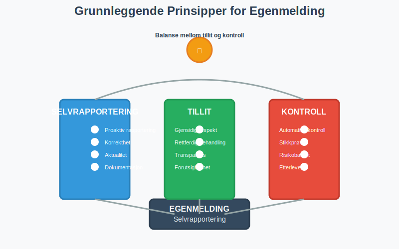
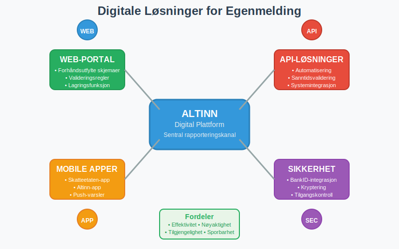
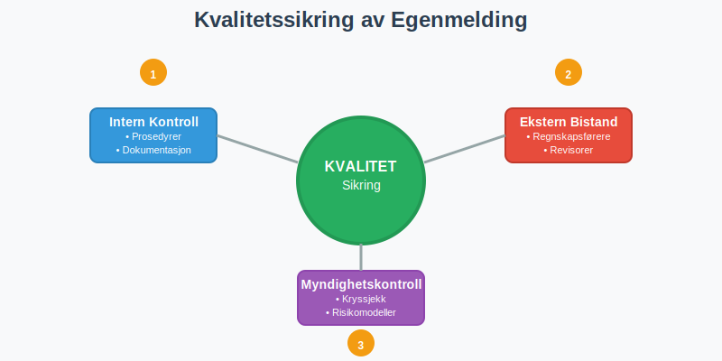
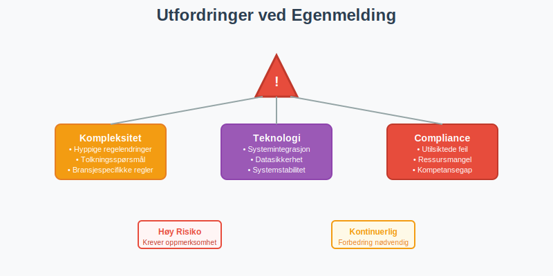
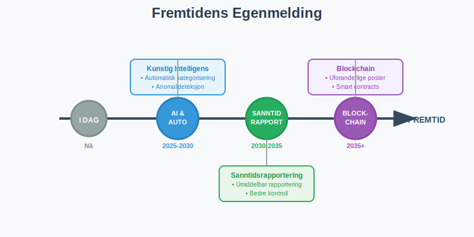
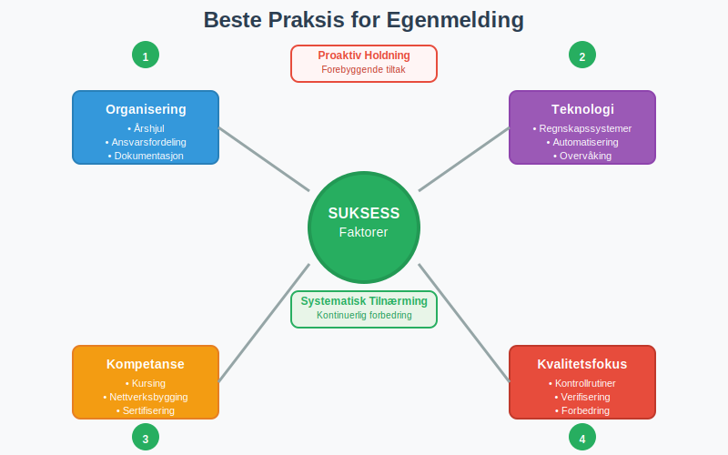

---
title: "Hva er Egenmelding?"
meta_title: "Hva er Egenmelding?"
meta_description: '**Egenmelding** er et grunnleggende prinsipp i norsk skatte- og regnskapsforvaltning som innebærer at skatteytere og virksomheter selv rapporterer sine økonom...'
slug: hva-er-egenmelding
type: blog
layout: pages/single
---

**Egenmelding** er et grunnleggende prinsipp i norsk skatte- og regnskapsforvaltning som innebærer at skatteytere og virksomheter selv rapporterer sine økonomiske forhold til myndighetene. Dette selvrapporteringssystemet bygger på tillit og er en hjørnestein i den norske forvaltningsmodellen, hvor borgere og bedrifter har ansvar for å gi korrekte og fullstendige opplysninger om sine inntekter, utgifter og økonomiske transaksjoner.

## Seksjon 1: Grunnleggende Prinsipper for Egenmelding

Egenmelding som konsept hviler på flere fundamentale prinsipper som preger hele det norske skattesystemet og regnskapsregimet.

### 1.1 Selvrapporteringsprinsippet

**Selvrapportering** innebærer at den rapporteringspliktige selv har ansvar for å innhente, bearbeide og rapportere relevante økonomiske opplysninger. Dette står i kontrast til systemer hvor myndighetene selv innhenter all nødvendig informasjon.

**Kjerneaspekter ved selvrapportering:**

* **Proaktiv rapportering:** Skatteytere må selv identifisere rapporteringsplikt
* **Korrekthet:** Opplysningene må være faktisk riktige og fullstendige  
* **Aktualitet:** Rapportering må skje innen fastsatte frister
* **Dokumentasjon:** Alle opplysninger må kunne dokumenteres ved kontroll

### 1.2 Tillitsbasert System

Det norske egenmelding-systemet bygger på **gjensidig tillit** mellom myndigheter og skatteytere. Dette tillitsforholdet er avgjørende for systemets effektivitet.

| Aktør | Ansvar | Forventning |
|-------|--------|-------------|
| **Skatteytere** | Korrekt rapportering | Rettferdig behandling |
| **Myndigheter** | Veiledning og kontroll | Etterlevelse av regler |
| **RÃ¥dgivere** | Profesjonell bistand | Kompetent veiledning |

### 1.3 Kontroll og Verifisering

Selv om systemet bygger på tillit, har myndighetene omfattende **kontrollmekanismer** for å verifisere rapporterte opplysninger.

**Kontrollformer:**

* **Automatisk kontroll:** Kryssjekk mot tredjepartsopplysninger
* **Stikkprøvekontroll:** Tilfeldig utvalg for nærmere granskning
* **Risikobasert kontroll:** Målrettet kontroll basert på risikoindikatorer
* **Etterlevelseskontroll:** Systematisk gjennomgang av compliance

## Seksjon 2: Egenmelding i Ulike Rapporteringsområder

Egenmelding praktiseres på tvers av flere rapporteringsområder i norsk økonomi, hver med sine spesifikke krav og prosedyrer.

### 2.1 Skattemelding og Selvangivelse

**[Skattemeldingen](/blogs/regnskap/hva-er-altinn "Hva er Altinn? Norges Digitale Portal for Næringsliv og Privatpersoner")** er det mest kjente eksemplet på egenmelding i Norge, hvor alle skattepliktige årlig rapporterer sine inntekter og fradrag.

**Hovedkomponenter i skattemelding:**

* **Inntektsrapportering:** Lønn, næringsinntekt, kapitalinntekt
* **Fradragsrapportering:** Standardfradrag og særskilte fradrag
* **Formuesrapportering:** Eiendeler og gjeld over visse beløpsgrenser
* **Spesielle forhold:** Utenlandske forhold, særskilte skatteregler

### 2.2 MVA-rapportering

**[Merverdiavgift (MVA)](/blogs/regnskap/hva-er-avgiftsplikt-mva "Hva er Avgiftsplikt (MVA)? Komplett Guide til Merverdiavgift i Norge")** rapporteres gjennom egenmelding hvor virksomheter selv beregner og rapporterer avgiftspliktig omsetning og inngående avgift.

**MVA-egenmelding omfatter:**

* **Utgående avgift:** Avgift på salg av varer og tjenester
* **Inngående avgift:** Avgift på innkjøp som kan trekkes fra
* **Nettooppgjør:** Differansen mellom utgående og inngående avgift
* **Spesielle bestemmelser:** Omvendt avgiftsplikt, import, eksport

### 2.3 A-melding og Lønnsrapportering

**[A-meldingen](/blogs/regnskap/hva-er-a-melding "Hva er A-meldingen? En Komplett Guide")** representerer en omfattende egenmelding hvor arbeidsgivere rapporterer lønn, ytelser og arbeidsforhold.

**A-melding inneholder:**

* **Lønnsopplysninger:** Bruttolønn, naturalytelser, feriepenger
* **Trekkopplysninger:** Forskuddstrekk, arbeidsgiveravgift
* **Arbeidsforhold:** Stillingsprosent, arbeidsperioder
* **Pensjonsopplysninger:** Pensjonsgivende inntekt, pensjonspremier

### 2.4 Regnskapsrapportering

**[Årsregnskapet](/blogs/regnskap/hva-er-regnskap "Hva er Regnskap? En Komplett Guide til Regnskapsføring i Norge")** er en form for egenmelding hvor virksomheter rapporterer sin økonomiske stilling og resultat.

**Regnskapsegenmelding omfatter:**

* **Resultatregnskap:** Inntekter, kostnader og årsresultat
* **Balanse:** Eiendeler, gjeld og egenkapital
* **Kontantstrømoppstilling:** Likviditetsstrømmer
* **Noter:** Tilleggsopplysninger og spesifikasjoner

## Seksjon 3: Digitale Løsninger for Egenmelding

Den digitale transformasjonen har revolusjonert hvordan egenmelding praktiseres i Norge, med **[Altinn](/blogs/regnskap/hva-er-altinn "Hva er Altinn? Norges Digitale Portal for Næringsliv og Privatpersoner")** som den sentrale plattformen.

### 3.1 Altinn som Egenmelding-plattform

Altinn har blitt den primære kanalen for digital egenmelding i Norge, og tilbyr integrerte løsninger for alle hovedrapporteringsområder.

**Altinns egenmelding-funksjoner:**

* **Forhåndsutfylte skjemaer:** Automatisk innhenting av tredjepartsopplysninger
* **Valideringsregler:** Automatisk kontroll av logiske sammenhenger
* **Lagringsfunksjonalitet:** Mulighet for å lagre uferdige meldinger
* **Kvitteringssystem:** Bekreftelse på mottatte meldinger

### 3.2 API-basert Rapportering

For virksomheter med store rapporteringsvolumer tilbyr myndighetene **API-løsninger** som muliggjør automatisert egenmelding direkte fra regnskapssystemer.

**Fordeler med API-rapportering:**

* **Automatisering:** Redusert manuelt arbeid og feilrisiko
* **Sanntidsvalidering:** Umiddelbar tilbakemelding på feil
* **Integrasjon:** Sømløs kobling med eksisterende systemer
* **Effektivitet:** Raskere behandling og oppfølging

### 3.3 Mobile Løsninger

Utviklingen av mobile applikasjoner har gjort egenmelding mer tilgjengelig, særlig for privatpersoner og mindre virksomheter.

**Mobile egenmelding-tjenester:**

* **Skatteetaten-appen:** Skattemelding og [skatteoppgjør](/blogs/regnskap/skatteoppgjor "Skatteoppgjør Guide: Prosess, Tidslinje og Viktige Frister")
* **Altinn-appen:** Tilgang til meldinger og enkle skjemaer
* **BankID-integrasjon:** Sikker innlogging og signering
* **Push-varsler:** PÃ¥minnelser om frister og nye meldinger

## Seksjon 4: Kvalitetssikring og Compliance

Kvalitetssikring av egenmelding er kritisk for å opprettholde systemets integritet og skatteyternes tillit til forvaltningen.

### 4.1 Interne Kontrollsystemer

Virksomheter må etablere **interne kontrollsystemer** for å sikre korrekt egenmelding.

**Komponenter i internkontroll:**

* **Prosedyrer:** Dokumenterte rutiner for datainnsamling og rapportering
* **Autorisasjon:** Klare ansvarslinjer og godkjenningsprosesser
* **Dokumentasjon:** Systematisk arkivering av underlagsdokumentasjon
* **Oppfølging:** Regelmessig gjennomgang og forbedring av prosesser

### 4.2 Ekstern Kvalitetssikring

Mange virksomheter benytter **ekstern bistand** for å sikre korrekt egenmelding.

| Tjenestetype | Leverandør | Omfang |
|--------------|------------|--------|
| **Regnskapsføring** | Autoriserte regnskapsførere | Løpende bokføring og rapportering |
| **Revisjonstjenester** | Statsautoriserte/registrerte revisorer | Kontroll av årsregnskap |
| **Skatterådgivning** | Advokater/rådgivere | Komplekse skatteforhold |
| **Systemstøtte** | IT-leverandører | Teknisk implementering |

### 4.3 Myndighetenes Kvalitetskontroll

Skattemyndighetene har utviklet sofistikerte systemer for å kvalitetssikre innkomne egenmeldinger.

**Kontrollmekanismer:**

* **Kryssjekk:** Sammenligning med tredjepartsopplysninger
* **Trendanalyse:** Identifikasjon av avvik fra historiske mønstre
* **Risikomodeller:** Algoritmer som identifiserer høyrisiko-meldinger
* **Manuell gjennomgang:** Detaljert kontroll av utvalgte saker

## Seksjon 5: Utfordringer og Risikofaktorer

Selv om egenmelding-systemet fungerer godt, finnes det flere utfordringer og risikofaktorer som må håndteres.

### 5.1 Kompleksitet i Regelverket

**Økende kompleksitet** i skatte- og regnskapsregelverket utgjør en betydelig utfordring for korrekt egenmelding.

**Kompleksitetsutfordringer:**

* **Hyppige regelendringer:** Kontinuerlige oppdateringer av lovverk
* **Tolkningsspørsmål:** Uklare bestemmelser som krever skjønn
* **Internasjonale forhold:** Komplekse regler for grenseoverskridende transaksjoner
* **Bransjespecifikke regler:** Særregler for ulike næringer

### 5.2 Teknologiske Utfordringer

Den digitale transformasjonen medfører også nye utfordringer for egenmelding-systemet.

**Tekniske risikofaktorer:**

* **Systemintegrasjon:** Utfordringer med å koble ulike IT-systemer
* **Datasikkerhet:** Beskyttelse av sensitive økonomiske opplysninger
* **Systemstabilitet:** Risiko for nedetid i kritiske rapporteringsperioder
* **Brukeropplevelse:** Balanse mellom funksjonalitet og brukervennlighet

### 5.3 Compliance-utfordringer

Å opprettholde høy **compliance-grad** krever kontinuerlig innsats fra alle aktører.

**Compliance-risiko:**

* **Utilsiktede feil:** Feil som oppstår på grunn av misforståelser
* **Ressursmangel:** Manglende kapasitet til å følge opp alle krav
* **Kompetansegap:** Utilstrekkelig kunnskap om regelverket
* **Systemsvikt:** Tekniske problemer som hindrer korrekt rapportering

## Seksjon 6: Fremtidige Utviklingstrender

Egenmelding-systemet er i kontinuerlig utvikling, drevet av teknologiske fremskritt og endrede brukerbehov.

### 6.1 Kunstig Intelligens og Automatisering

**AI-teknologi** vil spille en stadig viktigere rolle i fremtidens egenmelding-systemer.

**AI-applikasjoner:**

* **Automatisk kategorisering:** AI som klassifiserer transaksjoner
* **Anomalideteksjon:** Identifikasjon av uvanlige mønstre
* **Prediktiv analyse:** Forutsigelse av potensielle feil
* **Naturlig språkbehandling:** Forbedret brukerinteraksjon

### 6.2 Sanntidsrapportering

Utviklingen går mot **sanntidsrapportering** hvor transaksjoner rapporteres umiddelbart når de oppstår.

**Fordeler med sanntidsrapportering:**

* **Redusert administrativt arbeid:** Eliminering av periodisk rapportering
* **Bedre kontroll:** Umiddelbar oppdagelse av avvik
* **Forbedret likviditet:** Raskere behandling av refusjoner
* **Økt transparens:** Bedre oversikt for både myndigheter og skatteytere

### 6.3 Blockchain og Distribuerte Systemer

**Blockchain-teknologi** kan potensielt revolusjonere hvordan egenmelding håndteres og verifiseres.

**Blockchain-muligheter:**

* **Uforanderlige poster:** Transaksjoner som ikke kan manipuleres
* **Automatiske kontrakter:** Smart contracts for automatisk compliance
* **Desentralisert verifisering:** Redusert avhengighet av sentrale myndigheter
* **Økt tillit:** Transparent og sporbar rapportering

## Seksjon 7: Praktiske RÃ¥d for Effektiv Egenmelding

For å lykkes med egenmelding er det viktig å følge etablerte beste praksis og implementere effektive rutiner.

### 7.1 Organisering og Planlegging

**Systematisk tilnærming** til egenmelding reduserer risiko for feil og sikrer overholdelse av frister.

**Organisatoriske tiltak:**

* **Ã…rshjul:** Oversikt over alle rapporteringsfrister
* **Ansvarsfordeling:** Klare roller og ansvar for ulike rapporteringsområder
* **Dokumentasjonssystem:** Strukturert lagring av underlagsdokumentasjon
* **Kvalitetssikring:** Rutiner for gjennomgang før innsending

### 7.2 Teknologiutnyttelse

**Effektiv bruk av teknologi** kan betydelig forenkle egenmelding-prosessene.

**Teknologiske verktøy:**

* **Regnskapssystemer:** Integrerte løsninger med rapporteringsfunksjonalitet
* **Dokumenthåndtering:** Digitale arkivsystemer for bilag og dokumentasjon
* **Automatisering:** Robotisering av rutineoppgaver
* **Overvåking:** Systemer som varsler om frister og avvik

### 7.3 Kompetanseutvikling

**Kontinuerlig læring** er essensielt for å holde tritt med utviklingen i regelverket.

**Kompetansetiltak:**

* **Kursing:** Regelmessig oppdatering av kunnskap
* **Nettverksbygging:** Kontakt med andre fagpersoner
* **Faglig oppfølging:** Abonnement på fagpublikasjoner
* **Sertifisering:** Formell kompetanseheving gjennom kurs og eksamener

## Konklusjon

**Egenmelding** er en grunnpilar i det norske skatte- og regnskapssystemet som bygger på tillit, ansvar og gjensidig respekt mellom myndigheter og skatteytere. Systemet har vist seg å være både effektivt og robust, og har tilpasset seg den digitale transformasjonen på en måte som har gjort rapportering enklere og mer nøyaktig.

Fremtiden vil bringe ytterligere digitalisering og automatisering, men grunnprinsippene om selvrapportering og ansvarlig compliance vil fortsatt være sentrale. For virksomheter og privatpersoner er det viktig å holde seg oppdatert på utviklingen og investere i systemer og kompetanse som sikrer korrekt og effektiv egenmelding.

**Suksessfaktorer for god egenmelding:**

* **Systematisk tilnærming:** Planlegging og organisering av rapporteringsprosesser
* **Teknologiutnyttelse:** Bruk av moderne verktøy og systemer
* **Kompetanse:** Kontinuerlig oppdatering av kunnskap og ferdigheter
* **Kvalitetsfokus:** Rutiner for kontroll og verifisering
* **Proaktivitet:** Tidlig identifikasjon og håndtering av utfordringer

Ved å følge disse prinsippene kan alle aktører bidra til å opprettholde og videreutvikle det tillitsbaserte egenmelding-systemet som er så viktig for det norske samfunnet.

