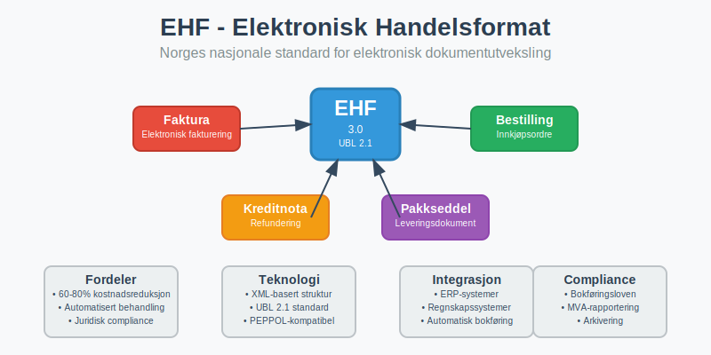
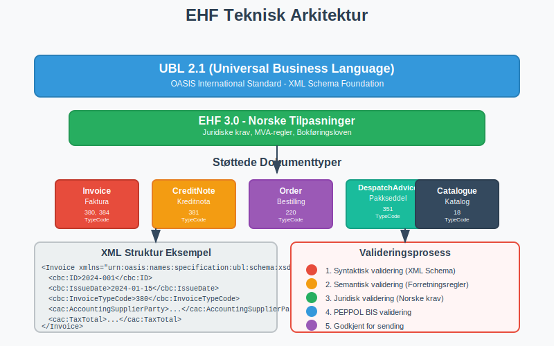
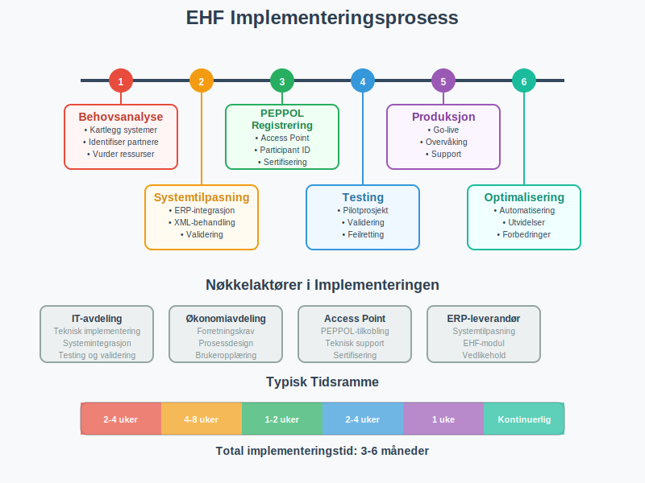
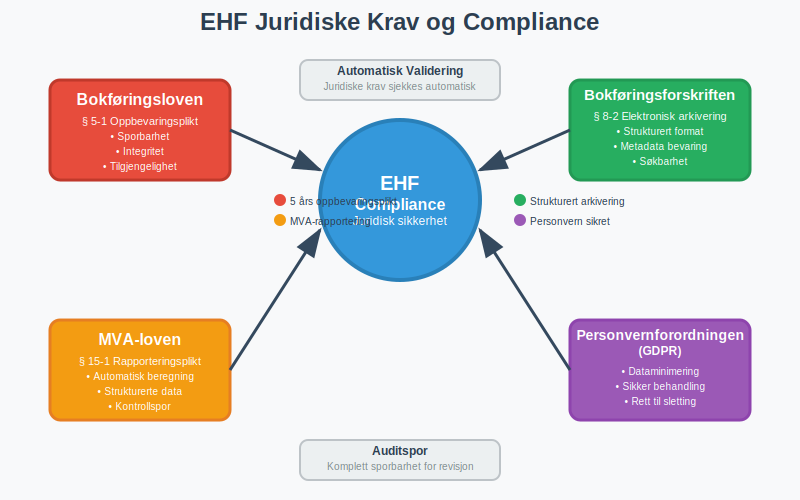
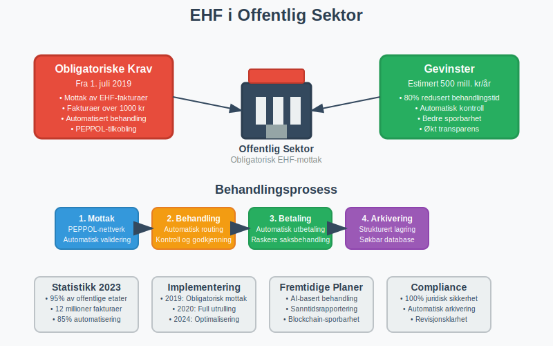

---
title: "Hva er EHF?"
meta_title: "Hva er EHF?"
meta_description: '**EHF** (Elektronisk Handelsformat) er Norges nasjonale standard for elektronisk utveksling av handelsdokumenter, spesielt [fakturaer](/blogs/regnskap/hva-er-en...'
slug: hva-er-ehf
type: blog
layout: pages/single
---

**EHF** (Elektronisk Handelsformat) er Norges nasjonale standard for elektronisk utveksling av handelsdokumenter, spesielt [fakturaer](/blogs/regnskap/hva-er-en-faktura "Hva er en Faktura? En Guide til Norske Fakturakrav") og andre forretningsdokumenter. Denne standarden, utviklet av Difi (nå Digitaliseringsdirektoratet), bygger på internasjonale UBL-standarder (Universal Business Language) og er tilpasset norske juridiske krav og forretningspraksis for [bokføring](/blogs/regnskap/hva-er-bokforing "Hva er Bokføring? Komplett Guide til Regnskapsføring og Bokføringsregler") og [regnskapsføring](/blogs/regnskap/hva-er-regnskap "Hva er Regnskap? En Komplett Guide til Regnskapsføring og Rapportering").



EHF representerer en fundamental digitalisering av handelsprosesser i Norge og er en sentral komponent i [eFaktura](/blogs/regnskap/hva-er-efaktura "Hva er eFaktura? Komplett Guide til Elektronisk Fakturering i Norge")-økosystemet. Standarden sikrer strukturert, maskinlesbar utveksling av forretningsinformasjon som kan integreres direkte i [ERP-systemer](/blogs/regnskap/hva-er-bokforing "Hva er Bokføring? Komplett Guide til Regnskapsføring og Bokføringsregler") og regnskapssystemer.

## Seksjon 1: Teknisk Arkitektur og Standarder

EHF baserer seg på **XML-teknologi** og følger internasjonale standarder for å sikre interoperabilitet og fremtidssikkerhet. Standarden er bygget på UBL 2.1-spesifikasjonen med norske tilpasninger.



### 1.1 Støttede Dokumenttyper

EHF-standarden dekker flere typer forretningsdokumenter:

| Dokumenttype | EHF-versjon | Beskrivelse | Bruksområde |
|--------------|-------------|-------------|-------------|
| **Faktura** | EHF 3.0 | Elektronisk faktura | B2B og B2G fakturabehandling |
| **Kreditnota** | EHF 3.0 | Kreditering og refundering | Korrigering av fakturaer |
| **Bestilling** | EHF 3.0 | Elektronisk innkjøpsordre | Automatisert bestillingsprosess |
| **Ordrebekreftelse** | EHF 3.0 | Bekreftelse av mottatt bestilling | Ordrebehandling |
| **Pakkseddel** | EHF 3.0 | Leveringsdokumentasjon | Logistikk og varemottak |
| **Katalog** | EHF 3.0 | Produktinformasjon | E-handel og produktdata |

### 1.2 XML-struktur og Validering

EHF-dokumenter følger en streng **XML-skjemavalidering** som sikrer datakvalitet og juridisk gyldighet:

```xml
<?xml version="1.0" encoding="UTF-8"?>
<Invoice xmlns="urn:oasis:names:specification:ubl:schema:xsd:Invoice-2">
  <cbc:ID>2024-001</cbc:ID>
  <cbc:IssueDate>2024-01-15</cbc:IssueDate>
  <cbc:InvoiceTypeCode>380</cbc:InvoiceTypeCode>
  <!-- Strukturert innhold følger UBL-standarden -->
</Invoice>
```

Alle EHF-dokumenter valideres mot:

* **Syntaktisk validering** - Korrekt XML-struktur
* **Semantisk validering** - Forretningsregler og logikk
* **Juridisk validering** - Overholdelse av [bokføringsloven](/blogs/regnskap/hva-er-bokforingsloven "Hva er Bokføringsloven? Komplett Guide til Norske Bokføringsregler")

## Seksjon 2: Implementering og Integrasjon

Implementering av EHF krever teknisk integrasjon med eksisterende forretningssystemer og overholdelse av norske regnskapsstandarder.



### 2.1 Systemkrav og Forutsetninger

For å implementere EHF må bedrifter ha:

* **ERP-system** eller regnskapssystem med EHF-støtte
* **XML-behandlingskapasitet** for dokumentparsing
* **PEPPOL-tilkobling** for elektronisk dokumentutveksling
* **Validering og testing** av EHF-implementasjon
* **Arkiveringssystem** som oppfyller [bokføringsforskriftens](/blogs/regnskap/hva-er-bokforingsforskriften "Hva er Bokføringsforskriften? Komplett Guide til Norske Bokføringsregler") krav

### 2.2 Integrasjonsprosess

Implementering av EHF følger en strukturert prosess:

1. **Behovsanalyse** - Kartlegging av eksisterende systemer
2. **Systemtilpasning** - Utvikling av EHF-støtte
3. **Testmiljø** - Validering av EHF-dokumenter
4. **Pilotprosjekt** - Testing med utvalgte partnere
5. **Produksjonssetting** - Full implementering
6. **Overvåking** - Kontinuerlig kvalitetssikring

### 2.3 Regnskapssystemintegrasjon

EHF integreres direkte med [bokføringssystemer](/blogs/regnskap/hva-er-bokforing "Hva er Bokføring? Komplett Guide til Regnskapsføring og Bokføringsregler") for automatisk behandling:

* **Automatisk [bilagsregistrering](/blogs/regnskap/hva-er-bilagsregistrere "Bilagsregistrering - Komplett Guide til Registrering av Regnskapsbilag")** fra EHF-fakturaer
* **Direkte [bokføring](/blogs/regnskap/hva-er-bokforing "Hva er Bokføring? Komplett Guide til Regnskapsføring og Bokføringsregler")** basert på strukturerte data
* **Automatisk [avstemming](/blogs/regnskap/hva-er-avstemming "Avstemming - Komplett Guide til Regnskapsavstemming og Kontroll")** mot leverandørreskontra
* **Integrert [attestering](/blogs/regnskap/hva-er-attestering "Hva er Attestering? En Komplett Guide til Bilagsbehandling og Godkjenning")** og godkjenningsflyt

## Seksjon 3: Fordeler og Gevinster

EHF gir omfattende fordeler som påvirker hele verdikjeden fra innkjøp til [regnskapsrapportering](/blogs/regnskap/hva-er-regnskap "Hva er Regnskap? En Komplett Guide til Regnskapsføring og Rapportering").

### 3.1 Operasjonelle Gevinster

EHF automatiserer og effektiviserer forretningsprosesser:

| Prosessområde | Tradisjonell behandling | EHF-behandling | Tidsbesparelse |
|---------------|------------------------|----------------|----------------|
| **Fakturabehandling** | 15-30 minutter | 2-5 minutter | 75-85% |
| **[Bilagsmottak](/blogs/regnskap/hva-er-bilagsmottak "Bilagsmottak - Komplett Guide til Dokumentmottak og Fakturabehandling")** | 10-20 minutter | 1-3 minutter | 80-90% |
| **Dataregistrering** | 5-15 minutter | Automatisk | 100% |
| **Arkivering** | 5-10 minutter | Automatisk | 100% |

### 3.2 Kvalitetsgevinster

Strukturerte EHF-data reduserer feil og forbedrer datakvalitet:

* **Eliminering av skrivefeil** gjennom automatisk dataoverføring
* **Konsistent dataformat** på tvers av leverandører
* **Automatisk validering** mot forretningsregler
* **Forbedret sporbarhet** i hele dokumentflyten
* **Redusert risiko** for tap eller feilbehandling

### 3.3 Økonomiske Besparelser

Studier viser at EHF kan gi betydelige kostnadsbesparelser:

* **Reduserte behandlingskostnader** - 60-80% lavere per dokument
* **Mindre manuelt arbeid** - Frigjør ressurser til verdiskapende aktiviteter
* **Raskere betalingsflyt** - Automatiserte prosesser reduserer behandlingstid
* **Lavere feilkostnader** - Færre reklamasjoner og korrigeringer

## Seksjon 4: Juridiske Aspekter og Compliance

EHF er utviklet for å oppfylle norske juridiske krav til [bokføring](/blogs/regnskap/hva-er-bokforing "Hva er Bokføring? Komplett Guide til Regnskapsføring og Bokføringsregler") og dokumentasjon.



### 4.1 Overholdelse av Bokføringsloven

EHF-dokumenter oppfyller alle krav i [bokføringsloven](/blogs/regnskap/hva-er-bokforingsloven "Hva er Bokføringsloven? Komplett Guide til Norske Bokføringsregler"):

* **Sporbarhet** - Komplett auditspor fra opprinnelig dokument
* **Integritet** - Dokumenter kan ikke endres etter arkivering
* **Tilgjengelighet** - Dokumenter kan gjenskapes i lesbar form
* **Oppbevaringstid** - Automatisk arkivering i påkrevd periode

### 4.2 MVA-rapportering og Kontroll

EHF støtter automatisert **MVA-rapportering** gjennom strukturerte data:

* **Automatisk MVA-beregning** basert på EHF-data
* **Direkte integrasjon** med [Altinn](/blogs/regnskap/hva-er-altinn "Hva er Altinn? Komplett Guide til Norges Digitale Offentlige Tjenester") for rapportering
* **Kontrollspor** for revisjonsformål
* **Sanntidsvalidering** av MVA-informasjon

### 4.3 Arkivering og Dokumentasjon

EHF sikrer korrekt arkivering i henhold til [bokføringsforskriften](/blogs/regnskap/hva-er-bokforingsforskriften "Hva er Bokføringsforskriften? Komplett Guide til Norske Bokføringsregler"):

* **Strukturert arkivering** med metadata
* **Langtidsoppbevaring** i standardiserte formater
* **Søkbarhet** og gjenfinning av dokumenter
* **Eksportmuligheter** for systemskifte

## Seksjon 5: EHF vs. Andre Standarder

EHF må sees i sammenheng med andre elektroniske handelsstandarder og systemer.

### 5.1 Sammenligning med Internasjonale Standarder

| Standard | Geografisk område | Basis | Tilpasning |
|----------|------------------|-------|------------|
| **EHF** | Norge | UBL 2.1 | Norske juridiske krav |
| **PEPPOL BIS** | Europa | UBL 2.1 | EU-direktiver |
| **ZUGFeRD** | Tyskland | UBL/CII | Tyske standarder |
| **Factur-X** | Frankrike | UBL/CII | Franske krav |
| **UBL** | Internasjonalt | OASIS | Generisk standard |

### 5.2 Integrasjon med PEPPOL

EHF er fullt kompatibel med **PEPPOL-nettverket** (Pan-European Public Procurement On-Line):

* **Sømløs utveksling** med europeiske partnere
* **Felles teknisk infrastruktur** for dokumenttransport
* **Standardiserte identifikatorer** for bedrifter og myndigheter
* **Kvalitetssikring** gjennom sertifiserte Access Points

## Seksjon 6: Implementering i Offentlig Sektor

Den norske offentlige sektoren har vært pådriver for EHF-implementering gjennom krav om elektronisk fakturabehandling.



### 6.1 Offentlige Krav og Direktiver

Offentlige virksomheter må følge spesifikke krav:

* **Obligatorisk mottak** av EHF-fakturaer over 1000 kr
* **Automatisert behandling** av strukturerte data
* **Integrert rapportering** til overordnede myndigheter
* **Standardiserte prosesser** på tvers av etater

### 6.2 Gevinster for Offentlig Sektor

EHF har gitt betydelige gevinster i offentlig sektor:

* **Reduserte behandlingskostnader** - Estimert 500 millioner kr årlig
* **Raskere saksbehandling** - Fra uker til dager
* **Bedre kontroll** - Automatisert compliance-sjekking
* **Økt transparens** - Sporbarhet i hele prosessen

## Seksjon 7: Fremtidige Utviklingstrender

EHF utvikles kontinuerlig for å møte nye teknologiske muligheter og forretningsbehov.

### 7.1 Teknologiske Innovasjoner

Fremtidige utviklinger inkluderer:

* **Kunstig intelligens** - Automatisk kategorisering og behandling
* **Blockchain-teknologi** - Økt sikkerhet og sporbarhet
* **IoT-integrasjon** - Automatisk dokumentgenerering fra sensorer
* **Sanntidsbehandling** - Øyeblikkelig fakturabehandling

### 7.2 Utvidede Bruksområder

EHF utvides til nye dokumenttyper og prosesser:

* **Lønnslipper** - Strukturert lønnsrapportering
* **Kontoutskrifter** - Automatisert [bankavstemming](/blogs/regnskap/hva-er-bankavstemming "Bankavstemming - Komplett Guide til Avstemming av Bankkonti")
* **Ã…rsrapporter** - Strukturert finansiell rapportering
* **Revisjonsrapporter** - Digitale revisjonsbevis

### 7.3 Internasjonal Harmonisering

EHF arbeider mot økt harmonisering med internasjonale standarder:

* **EU-direktiver** - Tilpasning til nye europeiske krav
* **Globale standarder** - Kompatibilitet med verdensomspennende systemer
* **Sektorspesifikke tilpasninger** - Bransjespesifikke utvidelser

## Seksjon 8: Implementeringsguide for Bedrifter

For bedrifter som ønsker å implementere EHF, er det viktig med en strukturert tilnærming.

### 8.1 Forberedelse og Planlegging

Før implementering bør bedrifter:

* **Kartlegge eksisterende systemer** og integrasjonsbehov
* **Identifisere handelspartnere** som støtter EHF
* **Vurdere ressursbehov** for implementering og drift
* **Etablere prosjektorganisasjon** med nødvendig kompetanse

### 8.2 Leverandørvalg og Sertifisering

Velg leverandører som tilbyr:

* **Sertifisert EHF-støtte** i henhold til norske standarder
* **PEPPOL Access Point**-tjenester
* **Integrasjonsstøtte** for eksisterende systemer
* **Opplæring og support** for brukere

### 8.3 Testing og Validering

Før produksjonssetting må bedrifter:

* **Teste EHF-dokumenter** mot offisielle valideringsverktøy
* **Gjennomføre pilotprosjekter** med utvalgte partnere
* **Validere integrasjoner** med regnskapssystemer
* **Sikre backup og gjenoppretting** av EHF-data

## Konklusjon

**EHF** (Elektronisk Handelsformat) representerer en fundamental digitalisering av norsk næringsliv og offentlig sektor. Som Norges nasjonale standard for elektronisk dokumentutveksling bygger EHF bro mellom tradisjonelle forretningsprosesser og moderne, automatiserte systemer.

Standarden gir omfattende gevinster gjennom reduserte kostnader, forbedret kvalitet og økt effektivitet i hele verdikjeden. For [regnskapsføring](/blogs/regnskap/hva-er-regnskap "Hva er Regnskap? En Komplett Guide til Regnskapsføring og Rapportering") og [bokføring](/blogs/regnskap/hva-er-bokforing "Hva er Bokføring? Komplett Guide til Regnskapsføring og Bokføringsregler") betyr EHF en revolusjon i hvordan forretningsdokumenter behandles, arkiveres og rapporteres.

Med kontinuerlig utvikling og tilpasning til nye teknologier vil EHF fortsette å være en sentral komponent i digitaliseringen av norsk næringsliv. Bedrifter som implementerer EHF posisjonerer seg for fremtidens digitale forretningsmodeller og sikrer compliance med norske juridiske krav.

EHF er ikke bare en teknisk standard - det er en strategisk investering i fremtidens digitale forretningsprosesser som gir varige konkurransefortrinn gjennom automatisering, kvalitetssikring og kostnadseffektivitet.
