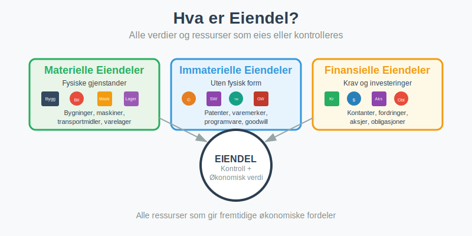
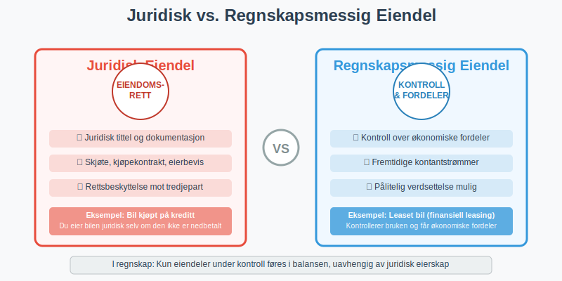
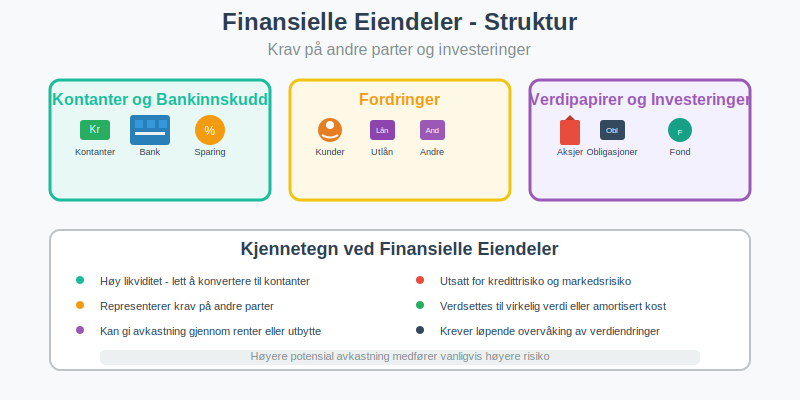
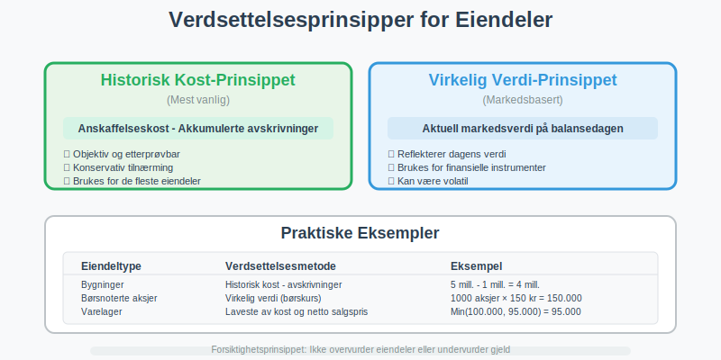
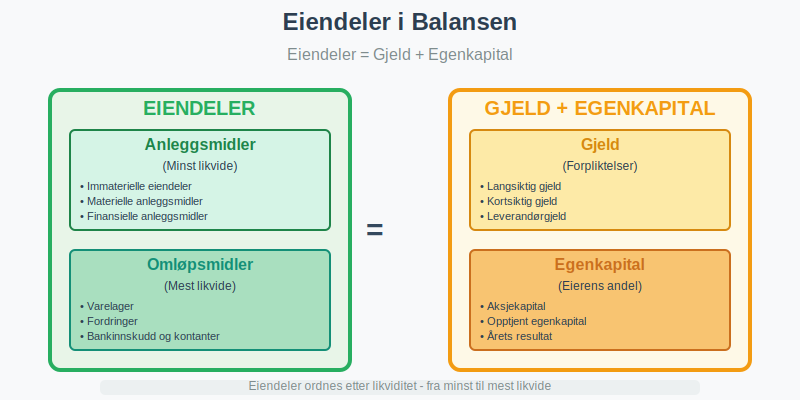
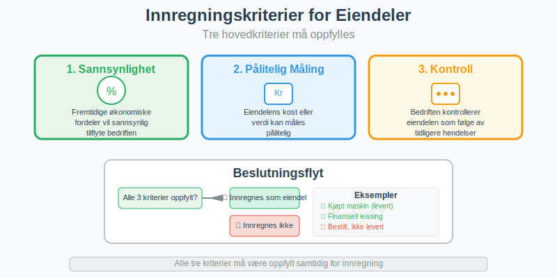
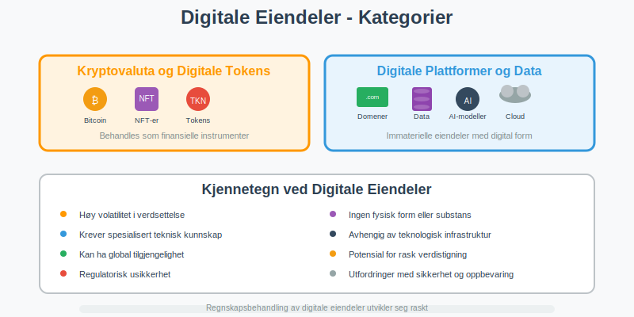
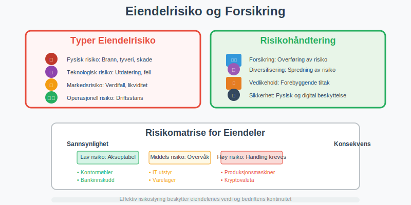
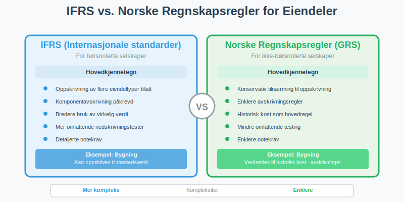

---
title: "Hva er eiendel?"
meta_title: "Hva er eiendel?"
meta_description: '**Eiendel** er et grunnleggende begrep i [regnskap](/blogs/regnskap/hva-er-regnskap "Hva er Regnskap? En Dybdeanalyse for Norge") som omfatter alle verdier og r...'
slug: hva-er-eiendel
type: blog
layout: pages/single
---

**Eiendel** er et grunnleggende begrep i [regnskap](/blogs/regnskap/hva-er-regnskap "Hva er Regnskap? En Dybdeanalyse for Norge") som omfatter alle verdier og ressurser som en person eller bedrift eier og kontrollerer. I regnskapssammenheng brukes ofte begrepet **[aktiva](/blogs/regnskap/hva-er-aktiva "Hva er Aktiva? En Komplett Guide til Eiendeler i Regnskap")** synonymt med eiendel, men eiendel er det bredere norske begrepet som dekker alt fra fast eiendom til immaterielle rettigheter. Korrekt identifisering og [bokføring](/blogs/regnskap/hva-er-bokføring "Hva er Bokføring? En Komplett Guide til Norsk Bokføringspraksis") av eiendeler er avgjørende for å gi et riktig bilde av en bedrifts økonomiske stilling.

## Seksjon 1: Definisjon og Juridisk Grunnlag

### 1.1 Hva er en Eiendel?

En **eiendel** er enhver ressurs eller verdi som:

* **Eies eller kontrolleres** av en person eller juridisk enhet
* **Har økonomisk verdi** som kan måles i kroner
* **Kan omsettes** eller brukes til å generere inntekter
* **Gir rettigheter** til fremtidige økonomiske fordeler

### 1.2 Juridisk vs. Regnskapsmessig Eiendel

Det er viktig å skille mellom juridisk eierskap og regnskapsmessig kontroll:

| Aspekt | Juridisk Eiendel | Regnskapsmessig Eiendel |
|:-------|:----------------|:------------------------|
| **Grunnlag** | Eiendomsrett og juridisk tittel | Kontroll og økonomiske fordeler |
| **Eksempel** | Bil kjøpt på kreditt (eier bilen) | Leaset bil (kontrollerer bruken) |
| **Dokumentasjon** | Skjøte, kjøpekontrakt | Leasingavtale, kontrollrettigheter |
| **Regnskapsføring** | Kun hvis også kontrollert | Føres som eiendel ved kontroll |

## Seksjon 2: Klassifisering av Eiendeler

### 2.1 Materielle Eiendeler

**Materielle eiendeler** er fysiske gjenstander med konkret form og substans:

#### Fast Eiendom
* **Tomter og grunn:** Byggeplasser, jordbruksareal, skogsområder
* **Bygninger:** Kontorer, fabrikker, lagerhaller, boliger
* **Infrastruktur:** Veier, broer, rørledninger på egen grunn

#### [Løsøre](/blogs/regnskap/hva-er-losore "Hva er Løsøre? En Guide til Løsøre i Norsk Regnskap") og utstyr
* **Maskiner og produksjonsutstyr:** Industrielle anlegg, verktøy
* **Transportmidler:** Biler, lastebiler, båter, fly
* **Inventar og møbler:** Kontormøbler, datautstyr, telefonsystemer
* **Varelager:** RÃ¥varer, halvfabrikata, ferdigvarer

For detaljert informasjon om hvordan [anleggsmidler](/blogs/regnskap/hva-er-anleggsmidler "Hva er Anleggsmidler? Komplett Guide til Faste Eiendeler i Regnskap") klassifiseres og behandles, se vår omfattende guide.

### 2.2 Immaterielle Eiendeler

**[Immaterielle eiendeler](/blogs/regnskap/hva-er-imaterielle-eiendeler "Hva er Imaterielle Eiendeler? Komplett Guide til Immaterielle Verdier i Regnskap")** mangler fysisk form men har likevel økonomisk verdi:

#### Intellektuelle Rettigheter
* **Patenter:** Beskyttelse av oppfinnelser og teknologi
* **Varemerker:** Registrerte merkenavn og logoer
* **Opphavsrett:** Rettigheter til kreative verk
* **Designrettigheter:** Beskyttelse av produktdesign

#### Forretningsrettigheter
* **[Goodwill](/blogs/regnskap/hva-er-goodwill "Hva er Goodwill? Komplett Guide til Goodwill og Immaterielle Eiendeler"):** Merverdi ved oppkjøp av virksomheter
* **Kundelister:** Verdifulle kundedatabaser
* **Franchiserettigheter:** Rett til å drive under etablert merkenavn
* **Programvare og lisenser:** Spesialiserte datasystemer

Immaterielle eiendeler behandles gjennom [amortisering](/blogs/regnskap/hva-er-amortisering "Hva er Amortisering? En Komplett Guide til Avskrivninger") i stedet for tradisjonelle avskrivninger.

### 2.3 Finansielle Eiendeler

**Finansielle eiendeler** representerer krav på andre parter eller investeringer:

#### Kontanter og Bankinnskudd
* **Kontanter:** Sedler og mynter i kasse
* **[Bankinnskudd](/blogs/regnskap/hva-er-bankinnskudd "Hva er Bankinnskudd i Regnskap? Typer, Regnskapsføring og Rentehåndtering"):** Penger på bedriftens bankkontoer
* **Kortsiktige innskudd:** Sparekonto, pengemarkedsfond

#### Fordringer
* **Kundefordringer:** Penger kunder skylder ([debitor](/blogs/regnskap/hva-er-debitor "Hva er Debitor i Regnskap? Komplett Guide til Kundefordringer og Debitorhåndtering"))
* **Lån til andre:** [Aksjonærlån fra AS](/blogs/regnskap/hva-er-aksjonaerlan-fra-as "Hva er Aksjonærlån fra AS? Skatt, Renter og Regnskapsføring")
* **Andre fordringer:** Forskuddsbetalte kostnader, [depositum](/blogs/regnskap/hva-er-depositum "Hva er Depositum i Regnskap? Typer, Regnskapsføring og Praktiske Eksempler")

#### Verdipapirer og Investeringer
* **Aksjer:** Eierandeler i andre selskaper
* **Obligasjoner:** Rentebærende verdipapirer
* **Fond:** Investeringer i verdipapirfond

## Seksjon 3: Verdsettelse og MÃ¥ling av Eiendeler

### 3.1 Verdsettelsesprinsipper

Eiendeler verdsettes etter etablerte regnskapsprinsipper for å sikre konsistens og sammenlignbarhet:

#### Historisk Kost-Prinsippet
De fleste eiendeler verdsettes til **[anskaffelseskost](/blogs/regnskap/hva-er-anskaffelseskost "Hva er Anskaffelseskost? Beregning, Komponenter og Regnskapsføring")** justert for:

* **Akkumulerte [avskrivninger](/blogs/regnskap/hva-er-avskrivning "Hva er Avskrivning i Regnskap? Metoder, Beregning og Praktiske Eksempler")**
* **Nedskrivninger** ved verdifall
* **Oppskrivninger** i spesielle tilfeller

#### Virkelig Verdi-Prinsippet
Enkelte eiendeler, særlig finansielle instrumenter, verdsettes til markedsverdi:

| Eiendeltype | Verdsettelsesmetode | Praktisk Eksempel |
|:------------|:-------------------|:------------------|
| **Fast eiendom** | Historisk kost - avskrivninger | Kontor kjøpt for 8 mill., avskrevet 2 mill. = 6 mill. |
| **Maskiner** | Historisk kost - avskrivninger | Maskin kjøpt for 500.000, avskrevet 200.000 = 300.000 |
| **Kundefordringer** | PÃ¥lydende - tapsavsetning | Fordring 150.000, tapsrisiko 3% = 145.500 |
| **Børsnoterte aksjer** | Virkelig verdi (markedspris) | 1000 aksjer à 250 kr = 250.000 |
| **Varelager** | Laveste av kost og netto salgspris | Varer kjøpt for 80.000, kan selges for 75.000 = 75.000 |

### 3.2 Spesielle Verdsettelsesutfordringer

#### Immaterielle Eiendeler
Verdsettelse av [immaterielle eiendeler](/blogs/regnskap/hva-er-imaterielle-eiendeler "Hva er Imaterielle Eiendeler? Komplett Guide til Immaterielle Verdier i Regnskap") kan være kompleks:

* **Internt utviklede eiendeler:** Kun direkte kostnader kan aktiveres
* **Kjøpte eiendeler:** Verdsettes til anskaffelseskost
* **Goodwill:** Testes årlig for verdifall

#### Finansielle Eiendeler
* **Kortsiktige investeringer:** Virkelig verdi med verdiendringer i resultat
* **Langsiktige investeringer:** Kan verdsettes til kost eller virkelig verdi
* **Valutaeksponering:** Omregnes til norske kroner på balansedagen

For dypere innsikt i verdivurderingsmetoder, se vår guide til [balansebasert verdivurdering](/blogs/regnskap/hva-er-balansebasert-verdivurdering "Balansebasert Verdivurdering - Metoder, Prinsipper og Praktisk Anvendelse").

## Seksjon 4: Eiendeler i Balansen

### 4.1 Presentasjon i Balansen

Eiendeler presenteres på venstre side av [balansen](/blogs/regnskap/hva-er-balanse "Hva er Balanse i Regnskap? Komplett Guide til Balanseoppstilling") og følger regnskapsligningen:

**Eiendeler = Gjeld + [Egenkapital](/blogs/regnskap/hva-er-egenkapital "Hva er Egenkapital? Beregning, Komponenter og Betydning i Regnskap")**

#### Balansens Oppbygning
Eiendeler ordnes etter **likviditet** (hvor lett de kan konverteres til kontanter):

1. **Anleggsmidler** (minst likvide)
   - Immaterielle eiendeler
   - Materielle anleggsmidler
   - Finansielle anleggsmidler

2. **Omløpsmidler** (mest likvide)
   - Varelager
   - Fordringer
   - Investeringer
   - Bankinnskudd og kontanter

### 4.2 Nøkkeltall og Analyse

Eiendeler brukes i viktige finansielle nøkkeltall:

| Nøkkeltall | Formel | Betydning |
|:-----------|:-------|:----------|
| **[Arbeidskapital](/blogs/regnskap/hva-er-arbeidskapital "Hva er Arbeidskapital? Beregning og Betydning for Bedriftens Likviditet")** | Omløpsmidler - Kortsiktig gjeld | Likviditet på kort sikt |
| **Eiendelomsetning** | Omsetning / Totale eiendeler | Effektivitet i eiendelbruk |
| **[Egenkapitalrentabilitet](/blogs/regnskap/hva-er-egenkapitalrentabilitet "Hva er Egenkapitalrentabilitet? Beregning og Analyse av ROE")** | Resultat / Egenkapital | Avkastning på egenkapital |
| **Gjeldsgrad** | Total gjeld / Totale eiendeler | Finansieringsstruktur |

## Seksjon 5: Regnskapsføring av Eiendeler

### 5.1 Innregning av Eiendeler

For at en eiendel skal innregnes i regnskapet, må den oppfylle spesifikke kriterier:

#### Innregningskriterier
* **Sannsynlighet:** Det er sannsynlig at fremtidige økonomiske fordeler vil tilflyte bedriften
* **Pålitelig måling:** Eiendelens kost eller verdi kan måles pålitelig
* **Kontroll:** Bedriften kontrollerer eiendelen som følge av tidligere hendelser

#### Praktiske Eksempler på Innregning

| Situasjon | Innregnes? | Begrunnelse |
|:----------|:-----------|:------------|
| Kjøpt maskin på kreditt | ✓ Ja | Kontroll overført ved levering |
| Bestilt maskin, ikke levert | ✗ Nei | Ingen kontroll før levering |
| Leaset bil (finansiell leasing) | ✓ Ja | Kontroll over økonomiske fordeler |
| Leaset bil (operasjonell leasing) | ✗ Nei | Begrenset kontroll og periode |
| Internt utviklet programvare | ✓ Delvis | Kun direkte utviklingskostnader |

### 5.2 Løpende Måling og Oppfølging

#### Avskrivninger og Amortisering
Eiendeler med begrenset levetid avskrives systematisk:

* **Lineær avskrivning:** Lik avskrivning hvert år
* **Degressiv avskrivning:** Høyere avskrivning i begynnelsen
* **Produksjonsbasert avskrivning:** Basert på faktisk bruk

#### Nedskrivninger
Når eiendelens verdi faller permanent under bokført verdi:

* **Nedskrivningstest:** Ã…rlig vurdering av verdifall
* **Gjenvinnbart beløp:** Høyeste av bruksverdi og virkelig verdi
* **Reversering:** Nedskrivninger kan reverseres (unntatt goodwill)

## Seksjon 6: Særlige Eiendeltyper

### 6.1 Digitale Eiendeler

Med digitaliseringen har nye eiendeltyper oppstått:

#### Kryptovaluta og Digitale Tokens
* **Bitcoin og andre kryptovalutaer:** Behandles som finansielle instrumenter
* **NFT-er (Non-Fungible Tokens):** Unike digitale eiendeler
* **Utility tokens:** Rettigheter til tjenester eller produkter

#### Digitale Plattformer og Data
* **Domenenavn:** Verdifulle internettadresser
* **Kundedatabaser:** Strukturerte kundedata
* **Algoritmer og AI-modeller:** Proprietære teknologiske løsninger
* **Cloud-baserte løsninger:** Software-as-a-Service rettigheter

### 6.2 Miljø- og Bærekraftseiendeler

Økende fokus på bærekraft skaper nye eiendelkategorier:

#### Karbon- og Miljørettigheter
* **Karbonkreditter:** Rettigheter til CO2-utslipp
* **Fornybar energi-sertifikater:** Grønne energirettigheter
* **Miljøfond og grønne obligasjoner:** Bærekraftige investeringer

#### Naturkapital
* **Skogressurser:** Verdien av tømmer og karbonlagring
* **Vannrettigheter:** Tilgang til vannressurser
* **Biodiversitetsrettigheter:** Rettigheter til genetiske ressurser

## Seksjon 7: Risikostyring og Eiendeler

### 7.1 Eiendelrisiko og Forsikring

Eiendeler er utsatt for ulike risikoer som må håndteres:

#### Typer Eiendelrisiko
* **Fysisk risiko:** Brann, tyveri, naturkatastrofer
* **Teknologisk risiko:** Utdatering, systemfeil
* **Markedsrisiko:** Verdifall, likviditetsrisiko
* **Operasjonell risiko:** Driftsstans, menneskelige feil

#### Risikohåndtering
* **Forsikring:** Overføring av risiko til forsikringsselskap
* **Diversifisering:** Spredning av risiko på flere eiendeler
* **Vedlikehold:** Forebyggende tiltak for å bevare verdi
* **Sikkerhetstiltak:** Fysisk og digital beskyttelse

### 7.2 Internkontroll og Eiendelsikring

Effektiv internkontroll sikrer at eiendeler beskyttes og rapporteres korrekt:

#### Kontrollaktiviteter
* **Fysisk sikring:** LÃ¥ser, alarmer, adgangskontroll
* **Autorisasjon:** Godkjenning av eiendelstransaksjoner
* **Dokumentasjon:** Fullstendig [bilagsføring](/blogs/regnskap/hva-er-bilagsforing "Hva er Bilagsføring? Komplett Guide til Regnskapsbilag og Dokumentasjon")
* **Avstemming:** Regelmessig kontroll mot fysisk beholdning

## Seksjon 8: Skattemessige Aspekter

### 8.1 Skattemessig vs. Regnskapsmessig Behandling

Skattemessig og regnskapsmessig behandling av eiendeler kan avvike:

| Aspekt | Regnskapsmessig | Skattemessig |
|:-------|:---------------|:-------------|
| **Avskrivninger** | Økonomisk levetid | Skattemessige satser |
| **Nedskrivninger** | Ved verdifall | Kun ved realisert tap |
| **Oppskrivninger** | Tillatt i visse tilfeller | Ikke tillatt |
| **Gevinst/tap** | Ved verdiendring | Ved realisasjon |

#### Skattemessige Avskrivninger
* **Saldogrupper:** Eiendeler grupperes etter type
* **Avskrivningssatser:** Fastsatt av skattemyndighetene
* **Maksimalavskrivning:** Øvre grense for årlig avskrivning

### 8.2 Merverdiavgift på Eiendeler

[MVA-behandling](/blogs/regnskap/hva-er-avgiftsplikt-mva "Hva er Avgiftsplikt MVA? Regler, Unntak og Praktisk HÃ¥ndtering") av eiendeler varierer:

* **Fradragsberettiget MVA:** PÃ¥ eiendeler brukt i avgiftspliktig virksomhet
* **Ikke-fradragsberettiget MVA:** Inngår i eiendelens anskaffelseskost
* **Blandede formål:** Forholdsmessig fordeling av MVA-fradrag

## Seksjon 9: Internasjonale Standarder og Eiendeler

### 9.1 IFRS og Norske Regnskapsregler

Norge følger internasjonale regnskapsstandarder (IFRS) for børsnoterte selskaper:

#### Hovedforskjeller
* **Oppskrivninger:** IFRS tillater oppskrivning av flere eiendeltyper
* **Komponentavskrivning:** IFRS krever mer detaljert avskrivning
* **Virkelig verdi:** Bredere bruk av markedsverdi i IFRS
* **Nedskrivningstester:** Mer omfattende testing under IFRS

### 9.2 Fremtidige Utviklingstrender

Regnskapsføring av eiendeler utvikler seg kontinuerlig:

#### Teknologiske Endringer
* **Automatisering:** AI-basert eiendelregistrering og -verdsettelse
* **Blockchain:** Transparent og sporbar eiendelregistrering
* **IoT (Internet of Things):** Sanntidsovervåking av eiendeler
* **Prediktiv analyse:** Forbedret estimering av levetid og verdi

#### Regulatoriske Endringer
* **Bærekraftsrapportering:** Økt fokus på miljøpåvirkning
* **Digitale eiendeler:** Nye standarder for kryptovaluta og NFT-er
* **Leasingstandard:** Endret behandling av leasingavtaler
* **Immaterielle eiendeler:** Oppdaterte regler for digitale rettigheter

## Konklusjon

**Eiendeler** er fundamentale byggeklosser i enhver bedrifts økonomi og regnskapsføring. Fra tradisjonelle materielle eiendeler som bygninger og maskiner til moderne digitale eiendeler som programvare og kryptovaluta, krever hver eiendeltype spesialisert kunnskap om klassifisering, verdsettelse og regnskapsføring.

Korrekt håndtering av eiendeler sikrer:

* **Nøyaktig finansiell rapportering** som gir interessenter et riktig bilde av bedriftens stilling
* **Effektiv ressursbruk** gjennom systematisk oppfølging og vedlikehold
* **Regelverksetterlevelse** i henhold til norske og internasjonale standarder
* **Risikostyring** som beskytter bedriftens verdier

For bedrifter som ønsker å optimalisere sin eiendelforvaltning, er det essensielt å etablere robuste systemer for [dokumentasjon](/blogs/regnskap/hva-er-dokumentasjon-regnskap-bokforing "Hva er Dokumentasjon i Regnskap og Bokføring? Krav, Oppbevaring og Digitalisering"), regelmessig verdsettelse og strategisk planlegging av investeringer.

Ved å forstå de ulike aspektene ved eiendeler - fra juridiske rettigheter til regnskapsmessig behandling - kan bedriftsledere ta informerte beslutninger som styrker selskapets finansielle posisjon og fremtidige vekstmuligheter.

