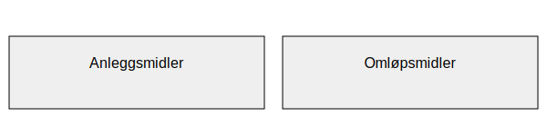

---
title: "Hva er eiendeler?"
seoTitle: "Hva er eiendeler?"
description: 'Eiendeler (aktiva) er ressurser virksomheten eier eller kontrollerer som gir fremtidige økonomiske fordeler, presentert i balansen.'
summary: 'Kort om eiendeler i regnskap: definisjon, klassifisering i anleggsmidler og omløpsmidler, verdsettelse og presentasjon i balansen.'
---

**Eiendeler** (også kalt **aktiva**) er alle ressurser som en virksomhet eier eller kontrollerer og som forventes å gi fremtidige økonomiske fordeler. I norsk regnskap presenteres eiendeler i [balansen](/blogs/regnskap/hva-er-balanse "Hva er Balanse i Regnskap? Oppbygging og Analyse") og deles i hovedkategoriene [anleggsmidler](/blogs/regnskap/hva-er-anleggsmidler "Hva er Anleggsmidler? Komplett Guide til Faste Eiendeler") og [omløpsmidler](/blogs/regnskap/hva-er-omlopsmiddel "Hva er Omløpsmidler? Komplett Guide til Kortsiktige Eiendeler i Regnskap").

## Klassifisering av eiendeler

| Kategori       | Norsk betegnelse    | Typiske eksempler                             |
|---------------:|---------------------|-----------------------------------------------|
| Non-current    | **Anleggsmidler**   | Maskiner, bygninger, immaterielle rettigheter |
| Current        | **Omløpsmidler**    | Varelager, kundefordringer, kontanter         |

## Verdsettelsesprinsipper

Eiendeler kan verdsettes etter ulike prinsipper:

* **Anskaffelseskost** - historisk kost basert på kjøpspris og tilknyttede kostnader ([Hva er Anskaffelseskost?](/blogs/regnskap/hva-er-anskaffelseskost "Hva er Anskaffelseskost? Beregning, Komponenter og Regnskapsføring")).
* **Virkelig verdi** - markedsverdi eller estimert salgsverdi etter kriterier i IFRS og norske regler.
* **Nedskrivning** - vurdering av om bokført verdi er høyere enn virkelig verdi, med nødvendig verdifall ([Hva er Nedskrivning?](/blogs/regnskap/hva-er-nedskrivning "Hva er Nedskrivning? Prosess og Regnskapsføring")).

## Presentasjon i balansen

I [balansen](/blogs/regnskap/hva-er-balanse "Hva er Balanse i Regnskap? Oppbygging og Analyse") presenteres eiendeler på venstre side:

* Først **anleggsmidler**, sortert etter omsættelsestid eller levetid.
* Deretter **omløpsmidler**, sortert etter likviditet.
* Totale eiendeler skal tilsvare summen av [gjeld](/blogs/regnskap/hva-er-gjeld "Hva er Gjeld? Typer og Regnskapsføring") + [egenkapital](/blogs/regnskap/hva-er-egenkapital "Hva er Egenkapital? Komplett Guide").

## Relevans og praktisk bruk

* **Likviditetsstyring:** Oversikt over omløpsmidler er kritisk for å sikre tilstrekkelig kontantbeholdning.
* **Investeringsbeslutninger:** Analyse av anleggsmidler påvirker beslutninger om kapitalbinding og avskrivningsstrategi.
* **Risikohåndtering:** Korrekt registrering og verdsettelse av eiendeler reduserer risiko for feilrapportering og skattemessige konsekvenser.

