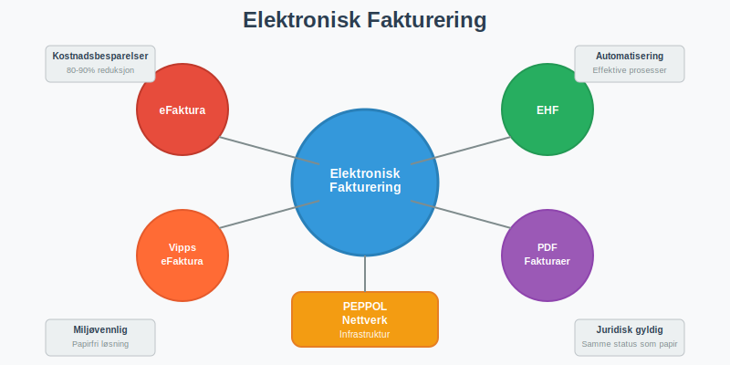
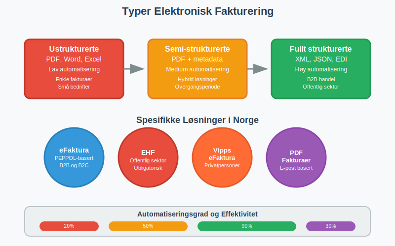
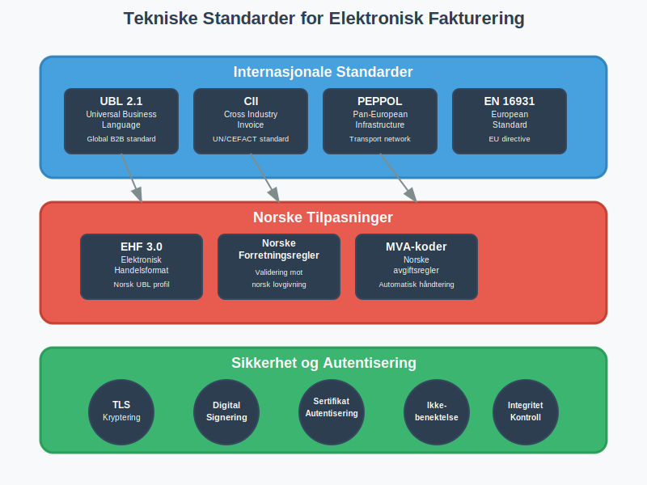
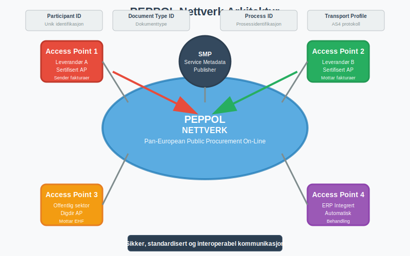
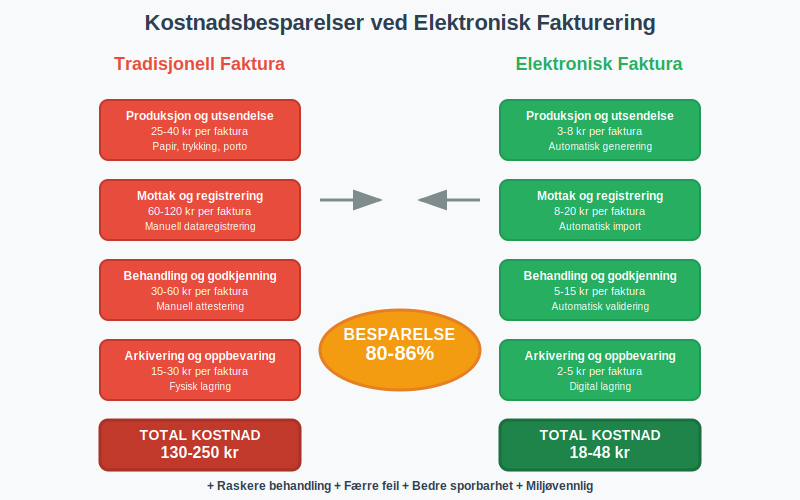
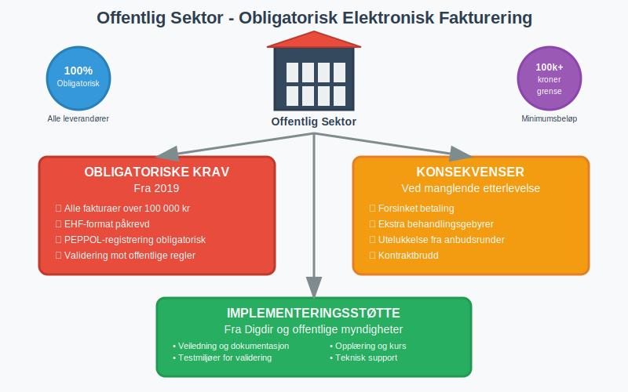
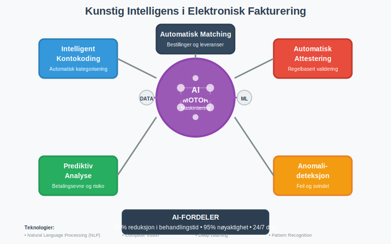
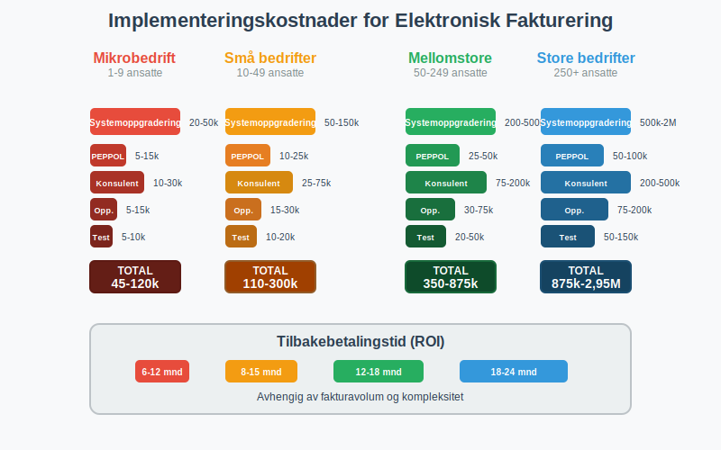

---
title: "Hva er Elektronisk Fakturering?"
meta_title: "Hva er Elektronisk Fakturering?"
meta_description: '**Elektronisk fakturering** er et samlebegrep for alle digitale metoder for å sende, motta og behandle [fakturaer](/blogs/regnskap/hva-er-en-faktura "Hva er en...'
slug: hva-er-elektronisk-fakturering
type: blog
layout: pages/single
---

**Elektronisk fakturering** er et samlebegrep for alle digitale metoder for å sende, motta og behandle [fakturaer](/blogs/regnskap/hva-er-en-faktura "Hva er en Faktura? En Guide til Norske Fakturakrav") elektronisk.

For å maksimere effekten av elektronisk fakturering, velg et **[fakturaprogram](/blogs/regnskap/fakturaprogram "Fakturaprogram: Komplette løsninger for digital fakturering")** med innebygde integrasjoner, maler og automatiserte arbeidsflyter.
Dette omfatter alt fra enkle PDF-fakturaer sendt via e-post til avanserte strukturerte fakturaformater som [eFaktura](/blogs/regnskap/hva-er-efaktura "Hva er eFaktura? Komplett Guide til Elektronisk Fakturering i Norge"), [EHF](/blogs/regnskap/hva-er-ehf "Hva er EHF? Komplett Guide til Elektronisk Handelsformat i Norge") og Vipps eFaktura.

En viktig del av både eFaktura og EHF er å bruke **[ELMA](/blogs/regnskap/elma "Hva er ELMA? En Guide til Elektronisk Mottaker- og Avsenderregister")** for å hente og validere mottakeres digitale adresser.

Som en sentral del av **[fintech](/blogs/regnskap/hva-er-fintech "Hva er Fintech? Komplett Guide til Finansteknologi og Påvirkning på Regnskap")** (finansteknologi), har elektronisk fakturering revolusjonert måten norske bedrifter og privatpersoner håndterer fakturabehandling på, og er i dag en integrert del av moderne [regnskapsføring](/blogs/regnskap/hva-er-regnskap "Hva er Regnskap? En Komplett Guide til Regnskapsføring og Rapportering").
[Fakturering](/blogs/regnskap/fakturering "Fakturering: Guide til Prosess og Krav i Norske Bedrifter") gir en introduksjon til hele prosessen med å utstede og følge opp fakturaer.

Utviklingen av elektronisk fakturering i Norge har vært drevet av både teknologiske fremskritt og myndighetenes digitalisering av offentlig sektor. I dag er elektronisk fakturering ikke bare en mulighet, men en nødvendighet for mange bedrifter, spesielt de som leverer til offentlig sektor hvor det er **obligatorisk** å bruke elektroniske fakturaformater.

## Seksjon 1: Typer Elektronisk Fakturering

Elektronisk fakturering omfatter flere ulike teknologier og formater, hver med sine spesifikke bruksområder og fordeler.

### 1.1 Strukturerte vs. Ustrukturerte Formater

Elektroniske fakturaer kan deles inn i to hovedkategorier basert på hvor strukturerte dataene er:

| Type | Format | Automatiseringsgrad | Bruksområde |
|------|--------|-------------------|-------------|
| **Ustrukturerte** | PDF, Word, Excel | Lav | Enkle fakturaer, små bedrifter |
| **Semi-strukturerte** | PDF med strukturerte data | Medium | Hybrid løsninger |
| **Fullt strukturerte** | XML, JSON, EDI | Høy | B2B-handel, offentlig sektor |

### 1.2 eFaktura - Den Norske Standarden

[**eFaktura**](/blogs/regnskap/hva-er-efaktura "Hva er eFaktura? Komplett Guide til Elektronisk Fakturering i Norge") er Norges primære system for elektronisk fakturering mellom bedrifter og til privatpersoner. Systemet bygger på **PEPPOL-nettverket** og sikrer interoperabilitet mellom ulike systemer og leverandører.

**Hovedtrekk ved eFaktura:**
* Basert på internasjonale standarder (UBL 2.1, CII)
* Juridisk likestilt med papirfakturaer
* Automatisk validering og behandling
* Integrert med norske [regnskapssystemer](/blogs/regnskap/hva-er-bokforing "Hva er Bokføring? Komplett Guide til Regnskapsføring og Bokføringsregler")

### 1.3 EHF - Elektronisk Handelsformat

**[EHF (Elektronisk Handelsformat)](/blogs/regnskap/hva-er-ehf "Hva er EHF? Komplett Guide til Elektronisk Handelsformat i Norge")** er den norske tilpasningen av UBL-standarden, spesielt utviklet for offentlig sektor og norske forretningsprosesser.

**EHF-spesifikasjoner:**
* Basert på UBL 2.1 med norske tilpasninger
* Obligatorisk for leverandører til offentlig sektor
* Støtter norske MVA-regler og regnskapskrav
* Valideres mot norske forretningsregler

### 1.4 Vipps eFaktura

**Vipps eFaktura** er en forbrukerrettet løsning som gjør det enkelt for privatpersoner å motta og betale fakturaer direkte i Vipps-appen.

**Funksjoner i Vipps eFaktura:**
* Direkte mottak av fakturaer i Vipps-appen
* Enkel betaling med ett trykk
* Automatisk arkivering av betalte fakturaer
* Integrasjon med [AvtaleGiro](/blogs/regnskap/hva-er-avtalegiro "Hva er AvtaleGiro? Komplett Guide til Automatisk Betaling")

Disse betalingsløsningene er deler av det bredere spekteret av moderne [betalingstjenester](/blogs/regnskap/betalingstjeneste "Hva er betalingstjeneste? Komplett Guide til Betalingstjenester i Norge") som muliggjør sømløs integrasjon mellom fakturaer og betalingsprosesser.

## Seksjon 2: Tekniske Standarder og Protokoller

Elektronisk fakturering bygger på en rekke internasjonale og nasjonale standarder som sikrer interoperabilitet og juridisk gyldighet.

### 2.1 Internasjonale Standarder

| Standard | Beskrivelse | Bruksområde |
|----------|-------------|-------------|
| **UBL 2.1** | Universal Business Language | Global standard for B2B-fakturaer |
| **CII** | Cross Industry Invoice | UN/CEFACT standard |
| **PEPPOL** | Pan-European Public Procurement On-Line | Europeisk infrastruktur |
| **EN 16931** | Europeisk faktureringsstandard | EU-direktiv for elektronisk fakturering |

### 2.2 Norske Tilpasninger

Norge har utviklet spesifikke tilpasninger av internasjonale standarder:

* **EHF 3.0** - Norsk profil av UBL 2.1
* **Norske forretningsregler** - Validering mot norsk lovgivning
* **MVA-koder** - Tilpasset norske avgiftsregler
* **Organisasjonsnummer** - Norsk identifikasjon av juridiske enheter

### 2.3 Sikkerhet og Autentisering

Elektronisk fakturering implementerer omfattende sikkerhetstiltak:

* **TLS-kryptering** for all kommunikasjon
* **Digital signering** av fakturaer
* **Sertifikatbasert autentisering**
* **Ikke-benektelse** gjennom kryptografiske bevis
* **Integritetskontroll** av fakturainnhold

## Seksjon 3: Implementering og Infrastruktur

Implementering av elektronisk fakturering krever forståelse av både tekniske og organisatoriske aspekter.

### 3.1 PEPPOL-Nettverket

**PEPPOL** (Pan-European Public Procurement On-Line) er ryggraden i europeisk elektronisk fakturering:

**PEPPOL-komponenter:**
* **Access Points** - Sertifiserte tjenesteleverandører
* **SMP (Service Metadata Publisher)** - Katalog over deltakere
* **Participant ID** - Unik identifikasjon av bedrifter
* **Document Type ID** - Identifikasjon av dokumenttyper

### 3.2 Access Point-Leverandører

For å delta i PEPPOL-nettverket må bedrifter bruke en sertifisert Access Point-leverandør:

| Leverandør | Tjenester | Målgruppe |
|------------|-----------|-----------|
| **Difi/Digdir** | Offentlig Access Point | Offentlig sektor |
| **Private leverandører** | Kommersielle tjenester | Private bedrifter |
| **ERP-integrerte** | Innebygd i regnskapssystemer | Alle størrelser |

### 3.3 Systemintegrasjon

Elektronisk fakturering integreres typisk med eksisterende forretningssystemer:

* **ERP-systemer** - Direkte integrasjon med [regnskapsføring](/blogs/regnskap/hva-er-bokforing "Hva er Bokføring? Komplett Guide til Regnskapsføring og Bokføringsregler")
* **Faktureringssystemer** - Spesialiserte fakturaløsninger med digitale [fakturamaler](/blogs/regnskap/hva-er-fakturamal "Hva er Fakturamal? Komplett Guide til Fakturamaler og Fakturadesign")
* **E-handelssystemer** - Automatisk fakturering ved salg
* **Økonomisystemer** - Integrasjon med [bilagsføring](/blogs/regnskap/hva-er-bilagsforing "Hva er Bilagsføring? Komplett Guide til Regnskapsbilag og Dokumentasjon")

Moderne implementeringer drar stor nytte av [API-integrasjon og automatisering](/blogs/regnskap/api-integrasjon-automatisering-regnskap "API Integrasjon og Automatisering av Regnskap - Komplett Guide til Digital Regnskapsføring") for å sikre sømløs dataflyt mellom elektronisk fakturering og regnskapssystemer, noe som eliminerer manuell dataregistrering og reduserer feilrisiko betydelig.

## Seksjon 4: Fordeler og Gevinster

Elektronisk fakturering gir omfattende fordeler for både avsendere og mottakere av fakturaer.

### 4.1 Økonomiske Besparelser

Studier viser betydelige kostnadsreduksjoner ved overgang til elektronisk fakturering:

| Prosess | Tradisjonell faktura | Elektronisk faktura | Besparelse |
|---------|---------------------|-------------------|------------|
| **Produksjon og utsendelse** | 25-40 kr | 3-8 kr | 75-85% |
| **Mottak og registrering** | 60-120 kr | 8-20 kr | 80-90% |
| **Behandling og godkjenning** | 30-60 kr | 5-15 kr | 75-85% |
| **Arkivering og oppbevaring** | 15-30 kr | 2-5 kr | 85-90% |
| **Total per faktura** | **130-250 kr** | **18-48 kr** | **80-86%** |

#### Eliminering av Fakturagebyr

En betydelig økonomisk fordel med elektronisk fakturering er eliminering av **[fakturagebyr](/blogs/regnskap/hva-er-fakturagebyr "Hva er Fakturagebyr? Komplett Guide til Faktureringsgebyrer i Norge")**. Mange leverandører krever tilleggsgebyrer for papirfakturaer, men må tilby elektroniske alternativer gratis:

* **Papirfakturagebyr:** 25-50 kr per faktura elimineres
* **Ekspedisjonsgebyrer:** Reduserte kostnader for spesiell håndtering
* **Administrative gebyrer:** Lavere behandlingskostnader

For bedrifter med høyt fakturavolum kan eliminering av fakturagebyr alene utgjøre betydelige årlige besparelser.

### 4.2 Prosesseffektivisering

Elektronisk fakturering automatiserer store deler av fakturabehandlingen:

* **Eliminering av manuell dataregistrering**
* **Automatisk validering** mot forretningsregler
* **Raskere behandlingstid** fra mottak til betaling
* **Reduserte feil** og reklamasjoner
* **Forbedret [attestering](/blogs/regnskap/hva-er-attestering "Hva er Attestering? En Komplett Guide til Bilagsbehandling og Godkjenning")** og godkjenningsflyt
* **Integrert [bilagsbehandling](/blogs/regnskap/bilag "Bilag - Komplett Guide til Digital Bilagsbehandling og Moderne Arkivering")** med full sporbarhet og automatisk arkivering

For bedrifter som mottar både elektroniske og papirbaserte fakturaer kan **[fakturatolk-teknologi](/blogs/regnskap/hva-er-fakturatolk "Hva er Fakturatolk? Automatisk Fakturabehandling og OCR-teknologi")** brukes for å automatisere behandlingen av alle fakturatyper. Denne teknologien kombinerer OCR og kunstig intelligens for å lese og tolke fakturaer automatisk, uavhengig av format.

### 4.3 Miljøgevinster

Digitalisering av fakturabehandling gir positive miljøeffekter:

* **Redusert papirforbruk** - Eliminering av papirfakturaer
* **Mindre transport** - Ingen fysisk distribusjon
* **Lavere energiforbruk** - Digitale prosesser vs. fysisk håndtering
* **Redusert lagring** - Digital arkivering erstatter fysiske arkiver

## Seksjon 5: Juridiske Aspekter og Compliance

Elektronisk fakturering må oppfylle de samme juridiske kravene som tradisjonelle fakturaer.

### 5.1 Bokføringsloven og Forskrifter

Elektroniske fakturaer må oppfylle [bokføringslovens](/blogs/regnskap/hva-er-bokforingsloven "Hva er Bokføringsloven? Komplett Guide til Norske Bokføringsregler") krav:

* **Sporbarhet** - Mulighet for å følge transaksjoner
* **Integritet** - Sikring mot endringer
* **Tilgjengelighet** - Lesbarhet gjennom oppbevaringsperioden
* **Autentisitet** - Bekreftelse av opprinnelse

### 5.2 MVA-Behandling

Elektroniske fakturaer må inneholde korrekt MVA-informasjon:

* **MVA-koder** i henhold til norske regler
* **Beregningsgrunnlag** for hver MVA-sats
* **Totale MVA-beløp** per sats og samlet
* **Fritak og unntak** korrekt markert
* **[Fjernleverbare tjenester](/blogs/regnskap/hva-er-fjernleverbare-tjenester "Hva er Fjernleverbare Tjenester i Regnskap? MVA-regler og Bokføring")** har spesielle stedsbestemmelsesregler for MVA

### 5.3 Oppbevaringsplikt

Elektroniske fakturaer må oppbevares i henhold til [bokføringsforskriften](/blogs/regnskap/hva-er-bokforingsforskriften "Hva er Bokføringsforskriften? Komplett Guide til Norske Bokføringsregler"):

* **Oppbevaringstid:** Minimum 5 år fra regnskapsårets slutt
* **Format:** Lesbart og søkbart format
* **Tilgjengelighet:** Umiddelbar tilgang for kontroll
* **Sikkerhet:** Beskyttelse mot tap og endring

## Seksjon 6: Offentlig Sektor og Pålagte Krav

Den norske stat har innført omfattende krav til elektronisk fakturering i offentlig sektor.

### 6.1 Obligatorisk Elektronisk Fakturering

Fra 2019 er det **obligatorisk** å sende elektroniske fakturaer til offentlig sektor:

**Krav til leverandører:**
* Alle fakturaer over 100 000 kr må sendes elektronisk
* EHF-format er påkrevd
* PEPPOL-registrering er obligatorisk
* Validering mot offentlige forretningsregler

### 6.2 Sanksjoner og Konsekvenser

Manglende etterlevelse kan få alvorlige konsekvenser:

* **Forsinket betaling** på grunn av manuell behandling
* **Ekstra behandlingsgebyrer** fra offentlige innkjøpere
* **Utelukkelse** fra fremtidige [anskaffelser](/blogs/regnskap/hva-er-anskaffelser "Hva er Anskaffelser? En Komplett Guide til Offentlige og Private Innkjøp")
* **Kontraktbrudd** i alvorlige tilfeller

### 6.3 Implementeringsstøtte

Offentlige myndigheter tilbyr støtte for implementering:

* **Veiledning** og dokumentasjon fra Digdir
* **Testmiljøer** for validering av fakturaer
* **Opplæring** og kurs for leverandører
* **Teknisk support** gjennom implementeringsfasen

## Seksjon 7: Privatmarkedet (B2C) og B2B-Handel ([Hva er B2C?](/blogs/regnskap/hva-er-b2c "Hva er B2C? Business-to-Consumer i Regnskap") og [Hva er B2B?](/blogs/regnskap/hva-er-b2b "Hva er B2B? Business-to-Business i Regnskap"))

Elektronisk fakturering vokser raskt også i privatmarkedet, drevet av effektivitetsgevinster og konkurransefordeler.

### 7.1 Adopsjon i Næringslivet

Norske bedrifter tar i økende grad i bruk elektronisk fakturering:

| Bedriftsstørrelse | Adopsjon 2020 | Adopsjon 2024 | Vekst |
|------------------|---------------|---------------|-------|
| **Store bedrifter (>250 ansatte)** | 65% | 85% | +31% |
| **Mellomstore (50-249 ansatte)** | 35% | 60% | +71% |
| **Små bedrifter (10-49 ansatte)** | 15% | 35% | +133% |
| **Mikrobedrifter (<10 ansatte)** | 5% | 18% | +260% |

### 7.2 Drivere for Adopsjon

Hovedårsakene til økt bruk av elektronisk fakturering:

* **Kostnadsbesparelser** - Direkte reduksjon i behandlingskostnader
* **Konkurransefordeler** - Raskere og mer effektive prosesser
* **Kundekrav** - Kunder forventer elektroniske løsninger
* **Leverandørkrav** - Store kunder krever elektronisk fakturering
* **Teknologiutvikling** - Enklere implementering og lavere kostnader

### 7.3 Bransjespesifikke Løsninger

Ulike bransjer har utviklet spesialiserte løsninger:

* **Detaljhandel** - Integrasjon med kassasystemer og [dagsoppgjør](/blogs/regnskap/hva-er-dagsoppgjor "Hva er Dagsoppgjør? Komplett Guide til Daglig Regnskapsavslutning")
* **Byggebransjen** - Håndtering av komplekse prosjektfakturaer
* **Helsesektoren** - Integrasjon med pasientadministrative systemer
* **Transport** - Automatisk fakturering basert på leveranser

## Seksjon 8: Teknologiske Trender og Fremtiden

Elektronisk fakturering utvikler seg kontinuerlig med nye teknologier og funksjoner.

### 8.1 Kunstig Intelligens og Maskinlæring

AI-teknologi revolusjonerer fakturabehandling:

**AI-applikasjoner:**
* **Intelligent kontokoding** basert på historiske data
* **Automatisk [attestering](/blogs/regnskap/hva-er-attestering "Hva er Attestering? En Komplett Guide til Bilagsbehandling og Godkjenning")** gjennom regelbasert validering
* **Prediktiv analyse** for [betalingsevne](/blogs/regnskap/hva-er-betalingsevne "Hva er Betalingsevne? Analyse av Likviditet og Finansiell Stabilitet") og risiko
* **Automatisk matching** mot bestillinger og leveranser
* **Anomalideteksjon** for å identifisere feil og svindel

### 8.2 Blockchain og Distribuerte Systemer

Blockchain-teknologi kan forbedre sikkerhet og sporbarhet:

* **Uforanderlig sporbarhet** av alle transaksjoner
* **Smart contracts** for automatisk betaling ved leveranse
* **Distribuert arkivering** for økt sikkerhet
* **Redusert behov** for mellommenn og validering

### 8.3 Internet of Things (IoT) og Automatisering

IoT-teknologi muliggjør automatisk fakturering:

* **Sensorbasert fakturering** - Automatisk registrering av forbruk
* **Leveranseverifisering** - IoT-sensorer bekrefter leveranser
* **Prediktivt vedlikehold** - Automatisk fakturering av servicetjenester
* **Supply chain-integrasjon** - Sømløs fakturaflyt gjennom verdikjeden

## Seksjon 9: Implementeringsguide

For bedrifter som ønsker å implementere elektronisk fakturering, er det viktig å følge en strukturert tilnærming.

### 9.1 Behovsanalyse og Planlegging

Før implementering bør bedriften gjennomføre en grundig analyse:

**Kartlegging av nåsituasjon:**
* Fakturavolum og -typer
* Eksisterende systemer og integrasjoner
* Leverandør- og kundebase
* Kostnader ved dagens løsning

**Målsetting og krav:**
* Ønskede gevinster og besparelser
* Tekniske krav og begrensninger
* Juridiske og compliance-krav
* Tidsramme for implementering

### 9.2 Leverandørvalg og Teknologi

Valg av riktig teknologi og leverandører er kritisk:

| Vurderingskriterier | Viktighet | Beskrivelse |
|---------------------|-----------|-------------|
| **Teknisk kompetanse** | Høy | Erfaring med PEPPOL og norske standarder |
| **Systemintegrasjon** | Høy | Kompatibilitet med eksisterende ERP |
| **Support og service** | Høy | Norskspråklig support og dokumentasjon |
| **Skalerbarhet** | Medium | Mulighet for vekst og utvidelse |
| **Kostnader** | Medium | Konkurransedyktige priser og transparente modeller |
| **Sertifiseringer** | Høy | Godkjent av relevante myndigheter |

### 9.3 Implementeringsprosess

En typisk implementering følger disse fasene:

1. **Forberedelse** (2-4 uker)
   - Systemkartlegging og kravspesifikasjon
   - Leverandørvalg og kontraktsinngåelse
   - Prosjektorganisering og ressursallokering

2. **Konfigurasjon** (4-8 uker)
   - Systemoppsett og integrasjon
   - PEPPOL-registrering og sertifisering
   - Testmiljø og validering

3. **Testing** (2-4 uker)
   - Teknisk testing av fakturaformater
   - Prosesstest med utvalgte partnere
   - Brukertest og opplæring

4. **Produksjonssetting** (1-2 uker)
   - Overgang til produksjonsmiljø
   - Overvåking og finjustering
   - Fullskala utrulling

### 9.4 Opplæring og Change Management

Vellykket implementering krever fokus på mennesker og prosesser:

* **Brukeropplæring** - Grundig opplæring av alle berørte medarbeidere
* **Prosessdokumentasjon** - Oppdaterte rutiner og arbeidsflyter
* **Change management** - Håndtering av motstand og endringsprosesser
* **Kontinuerlig forbedring** - Løpende optimalisering av prosesser

## Seksjon 10: Kostnader og Lønnsomhet

Implementering av elektronisk fakturering krever initial investering, men gir betydelige besparelser over tid.

### 10.1 Implementeringskostnader

Typiske kostnader varierer med bedriftsstørrelse og kompleksitet:

| Kostnadskategori | Mikrobedrift | Små bedrifter | Mellomstore | Store bedrifter |
|------------------|--------------|---------------|-------------|-----------------|
| **Systemoppgradering** | 20-50k | 50-150k | 200-500k | 500k-2M |
| **PEPPOL-registrering** | 5-15k | 10-25k | 25-50k | 50-100k |
| **Konsulentbistand** | 10-30k | 25-75k | 75-200k | 200-500k |
| **Opplæring** | 5-15k | 15-30k | 30-75k | 75-200k |
| **Testing** | 5-10k | 10-20k | 20-50k | 50-150k |
| **Total** | **45-120k** | **110-300k** | **350-875k** | **875k-2,95M** |

### 10.2 Driftskostnader

Løpende kostnader for elektronisk fakturering:

* **Access Point-avgifter:** 1-8 kr per sendt/mottatt faktura
* **Systemvedlikehold:** 10-20% av systemkostnad årlig
* **Support og drift:** Varierer med kompleksitet og volum
* **Oppdateringer:** Kostnader for nye versjoner og standarder

### 10.3 Lønnsomhetsberegning

For en mellomstore bedrift med 2000 fakturaer månedlig:

**Årlige besparelser:**
* Reduserte behandlingskostnader: 1,5-3,0 millioner kr
* Mindre feil og reklamasjoner: 200-500 tusen kr
* Raskere betalingsflyt: 300-800 tusen kr
* Reduserte arkiveringskostnader: 100-200 tusen kr
* **Total årlig besparelse:** 2,1-4,5 millioner kr

**Tilbakebetalingstid:** Typisk 3-12 måneder avhengig av fakturavolum og kompleksitet.

## Seksjon 11: Utfordringer og Risikofaktorer

Implementering av elektronisk fakturering kan møte ulike utfordringer som må håndteres proaktivt.

### 11.1 Tekniske Utfordringer

* **Systemintegrasjon** - Kompleks integrasjon med eksisterende systemer
* **Datamigrering** - Overføring av historiske data og konfigurasjoner
* **Standardkompleksitet** - Forståelse av tekniske standarder og krav
* **Sikkerhetsrisiko** - Beskyttelse mot cyberangrep og datainnbrudd

### 11.2 Organisatoriske Utfordringer

* **Motstand mot endring** - Medarbeidere som foretrekker kjente prosesser
* **Kompetansegap** - Mangel på teknisk kunnskap og erfaring
* **Prosessendringer** - Behov for å redesigne arbeidsflyter
* **Leverandørkoordinering** - Sikre at partnere også implementerer elektronisk fakturering

### 11.3 Juridiske og Compliance-Risiko

* **Regelverksendringer** - Kontinuerlige oppdateringer av standarder og krav
* **Revisjonsrisiko** - Sikre at elektroniske fakturaer oppfyller alle krav
* **Personvernrisiko** - GDPR-compliance ved behandling av persondata
* **Grenseoverskridende handel** - Ulike krav i forskjellige land

## Seksjon 12: Beste Praksis og Anbefalinger

Basert på erfaringer fra norske bedrifter som har implementert elektronisk fakturering.

### 12.1 Suksessfaktorer

**Kritiske faktorer for vellykket implementering:**

* **Toppledelsesforankring** - Klar støtte og prioritering fra ledelsen
* **Tverrfaglig prosjektteam** - Inkludering av IT, økonomi og forretningsområder
* **Grundig planlegging** - Detaljert prosjektplan med realistiske tidsrammer
* **Pilotprosjekt** - Start med begrenset omfang før full utrulling
* **Kontinuerlig kommunikasjon** - Regelmessig informasjon til alle berørte

### 12.2 Vanlige Fallgruver

**Utfordringer å unngå:**

* **Undervurdering av kompleksitet** - Teknisk implementering tar ofte lengre tid enn forventet
* **Mangelfull testing** - Utilstrekkelig testing kan føre til problemer i produksjon
* **Dårlig change management** - Neglisjering av menneskelige aspekter ved endring
* **Leverandørrisiko** - Avhengighet av én leverandør uten backup-planer
* **Compliance-gap** - Manglende forståelse av juridiske krav

### 12.3 Anbefalinger for Ulike Bedriftsstørrelser

**Mikrobedrifter (1-9 ansatte):**
* Start med enkle skybaserte løsninger
* Fokuser på integrasjon med eksisterende regnskapssystem
* Vurder outsourcing av teknisk drift

**Små bedrifter (10-49 ansatte):**
* Invester i opplæring av nøkkelpersonell
* Implementer trinnvis med pilotprosjekt
* Etabler rutiner for kontinuerlig forbedring

**Mellomstore bedrifter (50-249 ansatte):**
* Etabler dedikert prosjektteam
* Fokuser på prosessoptimalisering
* Implementer omfattende testing og validering

**Store bedrifter (250+ ansatte):**
* Utvikle detaljert implementeringsstrategi
* Invester i avanserte integrasjoner og automatisering
* Etabler senter for kompetanse og support

## Konklusjon

Elektronisk fakturering har utviklet seg fra en teknisk mulighet til en forretningskritisk nødvendighet for norske bedrifter. Som samlebegrep omfatter elektronisk fakturering alt fra enkle PDF-fakturaer til avanserte strukturerte formater som [eFaktura](/blogs/regnskap/hva-er-efaktura "Hva er eFaktura? Komplett Guide til Elektronisk Fakturering i Norge"), EHF og Vipps eFaktura.

**Hovedgevinster ved elektronisk fakturering:**
* **Betydelige kostnadsbesparelser** - 80-90% reduksjon i behandlingskostnader
* **Prosesseffektivisering** - Automatisering av hele fakturabehandlingen
* **Forbedret kontroll** - Bedre sporbarhet og redusert risiko for feil
* **Miljøgevinster** - Eliminering av papir og fysisk transport
* **Konkurransefordeler** - Raskere og mer effektive forretningsprosesser

For bedrifter som ennå ikke har implementert elektronisk fakturering, blir det stadig viktigere å vurdere overgangen. Dette gjelder spesielt med tanke på:

* **Obligatoriske krav** fra offentlig sektor
* **Økende forventninger** fra kunder og leverandører
* **Teknologisk utvikling** som gjør implementering enklere og billigere
* **Konkurransemessige fordeler** ved effektive digitale prosesser

Fremtiden for elektronisk fakturering vil preges av ytterligere automatisering gjennom kunstig intelligens, forbedret sikkerhet gjennom blockchain-teknologi, og økt integrasjon med IoT og andre digitale teknologier. Bedrifter som investerer i elektronisk fakturering i dag, posisjonerer seg for å dra nytte av disse fremtidige utviklingene.

Elektronisk fakturering er ikke lenger bare en teknisk løsning - det er en strategisk investering i fremtidens [regnskapsføring](/blogs/regnskap/hva-er-regnskap "Hva er Regnskap? En Komplett Guide til Regnskapsføring og Rapportering") og forretningsdrift. Med riktig planlegging, implementering og oppfølging kan elektronisk fakturering transformere fakturabehandlingen fra en administrativ byrde til en konkurransemessig fordel.

