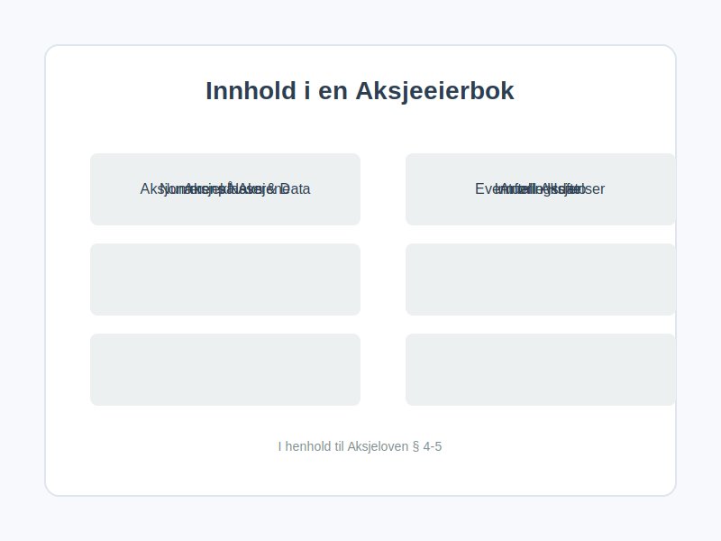

---
title: "Hva er en Aksjeeierbok? En Komplett Guide"
meta_title: "Hva er en Aksjeeierbok? En Komplett Guide"
meta_description: 'En **aksjeeierbok** er et register som alle norske [aksjeselskaper](/blogs/regnskap/hva-er-et-aksjeselskap "Hva er et aksjeselskap?") (AS) er lovpålagt å før...'
slug: hva-er-en-aksjeeierbok
type: blog
layout: pages/single
---

En **aksjeeierbok** er et register som alle norske [aksjeselskaper](/blogs/regnskap/hva-er-et-aksjeselskap "Hva er et aksjeselskap?") (AS) er lovpålagt å føre. Den fungerer som selskapets offisielle, løpende oversikt over hvem som eier aksjene i selskapet. Tenk på det som en loggbok for eierskapet, som til enhver tid viser den nøyaktige fordelingen av **aksjer** og eiere.

Aksjeeierboken er ikke bare en intern formalitet; den er et juridisk bindende dokument som reguleres av [aksjeloven](/blogs/regnskap/hva-er-aksjeloven "Hva er aksjeloven?"). Den er avgjørende for å fastslå eierrettigheter, fordele [utbytte](/blogs/regnskap/maskimalt-utbytte "Hva er maksimalt utbytte?"), og for å kalle inn til generalforsamling.

## Hvorfor er aksjeeierboken så viktig?

Aksjeeierboken er ryggraden i eierstyringen i et aksjeselskap. Uten en korrekt ført aksjeeierbok kan det oppstå tvil om hvem som har stemmerett, hvem som har krav på utbytte, og hvem som i det hele tatt er en rettmessig eier.

*   **Juridisk bevis:** Boken er det definitive beviset på eierskap i selskapet. Den som er innført i aksjeeierboken, regnes som aksjeeier i alle sammenhenger.
*   **Rettigheter:** Den danner grunnlaget for utøvelse av aksjonærrettigheter, som stemmerett på generalforsamling og retten til å motta utbytte.
*   **Offentlighet og transparens:** Aksjeeierboken skal være offentlig tilgjengelig for alle som ønsker innsyn. Dette sikrer transparens rundt eierforholdene i norske selskaper.
*   **Salg og overdragelse:** Ved salg av aksjer er det innføringen i aksjeeierboken som formelt overfører eierrettighetene til den nye eieren.

## Hva skal en aksjeeierbok inneholde?

I henhold til aksjeloven § 4-5 stilles det klare krav til innholdet i en aksjeeierbok. Den må inneholde detaljert informasjon om hver aksjonær og deres aksjeinnehav.

Her er en oversikt over den obligatoriske informasjonen:

| Informasjonselement          | Beskrivelse                                                                                                                                 | Hvorfor er det viktig?                                                                                             |
| ---------------------------- | ------------------------------------------------------------------------------------------------------------------------------------------- | ------------------------------------------------------------------------------------------------------------------ |
| **Aksjonærens navn og data** | Fullt navn, fødselsnummer (for privatpersoner) eller [organisasjonsnummer](/blogs/regnskap/hva-er-organisasjonsnummer "Hva er et organisasjonsnummer?") (for selskaper), og postadresse. | For entydig identifisering av eierne.                                                                              |
| **Antall aksjer**            | Hvor mange aksjer hver enkelt aksjonær eier.                                                                                                | Grunnlaget for å beregne eierandel, stemmerett og utbytte.                                                           |
| **Aksjeklasser**             | Hvis selskapet har forskjellige [aksjeklasser](/blogs/regnskap/hva-er-aksjeklasser "Hva er aksjeklasser?") (f.eks. A- og B-aksjer med ulik stemmerett), må dette spesifiseres. | For å skille mellom aksjer med ulike rettigheter.                                                                  |
| **Innføringsdato**           | Datoen da aksjonæren ble innført i boken.                                                                                                   | Viktig for å fastslå [ansiennitet](/blogs/regnskap/ansiennitet "Ansiennitet - Komplett Guide til Ansiennitet i Norsk Regnskap og Arbeidsrett") og rettigheter ved f.eks. utbytte.                                                  |
| **Nummer på aksjene**        | Hvilke nummer aksjene har, hvis de er nummererte.                                                                                           | Gir en unik identifikator for hver aksje.                                                                          |
| **Eventuelle heftelser**     | Hvis aksjene er pantsatt eller det er andre heftelser, skal dette noteres.                                                                  | Gir informasjon til potensielle kjøpere og kreditorer.                                                             |

### Eksempel på oppføring i aksjeeierbok:

La oss si at "Test AS" har to eiere: Kari Nordmann og "Holding AS".

*   **Aksjonær 1:**
    *   Navn: Kari Nordmann
    *   Fødselsnummer: 123456 78910
    *   Adresse: Eksempelveien 1, 0123 Oslo
    *   Antall aksjer: 500
    *   Aksjeklasse: A-aksje
    *   Innført dato: 01.01.2023

*   **Aksjonær 2:**
    *   Navn: Holding AS
    *   Organisasjonsnummer: 987 654 321
    *   Adresse: Investorveien 10, 5000 Bergen
    *   Antall aksjer: 500
    *   Aksjeklasse: A-aksje
    *   Innført dato: 01.01.2023

## Hvordan føre en aksjeeierbok?

Aksjeeierboken kan føres på to måter:

1.  **Manuelt:** For mindre selskaper kan boken føres i et tekstbehandlingsdokument, et regneark, eller til og med i en fysisk bok. Det viktigste er at den inneholder all lovpålagt informasjon og holdes løpende oppdatert.
2.  **Elektronisk:** Det finnes mange digitale verktøy og plattformer som spesialiserer seg på eieradministrasjon. Disse systemene automatiserer mye av prosessen og sikrer at alt blir korrekt. For selskaper registrert i Verdipapirsentralen (VPS), vil registeret der fungere som selskapets aksjeeierbok.

*Styret i selskapet har ansvaret for at aksjeeierboken blir opprettet, ført og oppbevart på en betryggende måte.*

## Offentlighet og innsyn

En viktig regel er at **aksjeeierboken er offentlig**. Enhver har rett til å be om innsyn i aksjeeierboken og få en utskrift av den. Dette er en sentral del av åpenheten i norsk næringsliv. Styret kan kun nekte innsyn dersom det er mistanke om at informasjonen vil bli brukt til skade for selskapet eller aksjonærene.

## Aksjeeierboken vs. Aksjonærregisteret

Det er lett å blande sammen aksjeeierboken og [Aksjonærregisteret](/blogs/regnskap/hva-er-aksjonaerregisteret "Hva er Aksjonærregisteret?"). De er relaterte, men ikke det samme.

*   **Aksjeeierboken:** Selskapets *interne*, løpende register. Den må være oppdatert til enhver tid. Den er grunnlaget for eierrettigheter.
*   **Aksjonærregisteret:** En årlig rapport som alle norske aksjeselskaper må sende inn til Skatteetaten. Den gir en oversikt over eierforholdene per 31. desember hvert år og brukes til skatteformål, blant annet for å beregne [formuesverdi](/blogs/regnskap/hva-er-formuesverdi "Hva er formuesverdi?") på aksjene.

Man kan si at aksjeeierboken er "live"-versjonen, mens [aksjonærregisteroppgaven (RF-1086)](/blogs/regnskap/aksjonaerregisteroppgave "Hva er Aksjonærregisteroppgave? Komplett Guide til Årlig Rapportering") til Aksjonærregisteret er et øyeblikksbilde som sendes til myndighetene én gang i året. Informasjonen i Aksjonærregisteret hentes fra aksjeeierboken.

## Oppdatering av aksjeeierboken ved eierskifte

Når en aksje skifter eier, enten ved salg, gave eller arv, må den nye eieren melde fra til selskapet for å bli innført i aksjeeierboken. Den nye eieren får ikke utøve sine rettigheter før innføringen har skjedd.

Prosessen er typisk som følger:

1.  **Melding til selskapet:** Kjøperen sender en melding til selskapets styre og dokumenterer eierskiftet, for eksempel med en kjøpsavtale eller et gavebrev.
2.  **Styrets behandling:** Styret skal uten ugrunnet opphold behandle meldingen og føre den nye eieren inn i aksjeeierboken.
3.  **Bekreftelse:** Selskapet skal gi melding til den nye eieren om at innføring er skjedd.

Det er viktig å merke seg at selskapets [vedtekter](/blogs/regnskap/hva-er-vedtekter-for-aksjeselskap "Hva er vedtekter for aksjeselskap?") kan inneholde bestemmelser om [forkjøpsrett](/blogs/regnskap/forkjopsrett "Hva er en Forkjøpsrett? Retten til å kjøpe aksjer før eksterne") eller krav om styrets samtykke ved salg, noe som kan påvirke prosessen.

## Konsekvenser av manglende eller feilaktig føring

Å ikke føre aksjeeierbok, eller å føre den feil, kan få alvorlige konsekvenser.

*   **Ugyldige beslutninger:** Beslutninger tatt på generalforsamling kan bli kjent ugyldige hvis det er feil i hvem som er innkalt eller har fått stemme.
*   **Styreansvar:** Styret kan bli holdt erstatningsansvarlig for tap som følge av feil i aksjeeierboken.
*   **Bøter:** I alvorlige tilfeller kan manglende føring føre til bøter.

En korrekt og ajourført aksjeeierbok er derfor helt essensielt for en sunn og lovlydig drift av et [aksjeselskap](/blogs/regnskap/hva-er-et-aksjeselskap "Hva er et aksjeselskap?").
