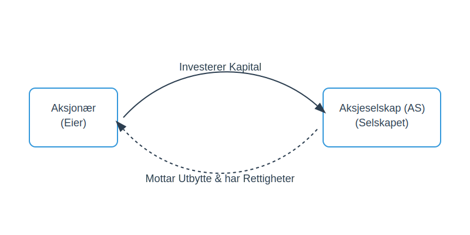

---
title: "Hva er en Aksjonær? En Komplett Guide"
meta_title: "Hva er en Aksjonær? En Komplett Guide"
meta_description: 'En **aksjonær**, også kjent som en *aksjeeier*, er en person eller en juridisk enhet som eier én eller flere [aksjer](/blogs/regnskap/hva-er-en-aksje "Hva er...'
slug: hva-er-en-aksjonaer
type: blog
layout: pages/single
---

En **aksjonær**, også kjent som en *aksjeeier*, er en person eller en juridisk enhet som eier én eller flere [aksjer](/blogs/regnskap/hva-er-en-aksje "Hva er en Aksje?") i et [aksjeselskap (AS)](/blogs/regnskap/hva-er-et-aksjeselskap "Hva er et Aksjeselskap (AS)?"). Ved å eie aksjer, eier aksjonæren en andel av selskapet og har visse rettigheter og plikter. Aksjonærenes rolle er fundamental for styringen og finansieringen av et aksjeselskap.

Forståelsen av hva en aksjonær er, er kritisk for alle som vurderer å [investere](/blogs/regnskap/hva-er-investere "Hva betyr det å investere?") i aksjer, starte et eget selskap, eller som jobber med [regnskap](/blogs/regnskap/hva-er-regnskap "Hva er Regnskap?") og selskapsadministrasjon.
*Se også: [Nicolai Tangen](/blogs/regnskap/nicolai-tangen "Nicolai Tangen – Norges Bank Investment Management").*

## Hvordan blir man aksjonær?

Man blir aksjonær ved å erverve aksjer i et selskap. Dette kan skje på flere måter:

*   **Stiftelse av selskap:** Når et nytt aksjeselskap opprettes, blir de som skyter inn [aksjekapital](/blogs/regnskap/hva-er-aksjekapital "Alt om Aksjekapital") de første aksjonærene.
*   **Kjøp av aksjer:** Man kan kjøpe eksisterende aksjer fra andre aksjonærer eller direkte fra selskapet gjennom en emisjon (utstedelse av nye aksjer).
*   **Arv eller gave:** Aksjer kan overføres som arv eller gave.
*   **Opsjoner:** Ansatte kan motta aksjeopsjoner som en del av sin kompensasjon, som gir dem retten til å kjøpe aksjer til en forhåndsbestemt pris.

Alle aksjonærer skal registreres i selskapets [aksjeeierbok](/blogs/regnskap/hva-er-en-aksjeeierbok "Hva er en Aksjeeierbok?"), som er en offisiell oversikt over hvem som eier aksjer i selskapet.

## Aksjonærens Rettigheter

Aksjonærenes rettigheter er i hovedsak regulert av [Aksjeloven](/blogs/regnskap/hva-er-aksjeloven "Aksjeloven: En Enkel Forklaring"). De viktigste rettighetene er knyttet til innflytelse og økonomisk avkastning.

### Økonomiske Rettigheter

De økonomiske rettighetene gir aksjonæren rett til en andel av selskapets verdier og overskudd.

*   **Rett til utbytte:** Aksjonærer har rett til å motta utbytte når selskapet beslutter å dele ut deler av [overskuddet](/blogs/regnskap/hva-er-overskudd "Hva er Overskudd?"). Størrelsen på utbyttet per aksje er lik for alle aksjer i samme [aksjeklasse](/blogs/regnskap/hva-er-aksjeklasser "Hva er Aksjeklasser?"). For en detaljert forklaring av hvordan utbytte beskattes og hvordan skjermingsfradrag påvirker aksjonærenes skattebyrde, se [aksjonærmodellen](/blogs/regnskap/aksjonaermodellen "Aksjonærmodellen: Skattemodell for Utbytte og Gevinst") eller vår [Aksjonærmodellen - Komplett Guide til Norsk Aksjebeskatning](/blogs/regnskap/aksjonaermodellen-guide "Aksjonærmodellen - Komplett Guide til Norsk Aksjebeskatning").
*   **Fortrinnsrett ved emisjon:** Ved utstedelse av nye aksjer har eksisterende aksjonærer som regel fortrinnsrett til å tegne seg for nye aksjer i samme forhold som de eier aksjer fra før.
*   **Andel ved oppløsning:** Hvis selskapet oppløses, har aksjonærene rett til å motta sin andel av selskapets gjenværende verdier etter at all [gjeld](/blogs/regnskap/hva-er-gjeld "Hva er Gjeld?") er dekket.

### Administrative Rettigheter

De administrative rettighetene gir aksjonæren mulighet til å påvirke selskapets drift og beslutninger.

*   **Stemmerett på generalforsamling:** Generalforsamlingen er selskapets øverste myndighet. Her har aksjonærene rett til å møte, tale og stemme. Hver aksje gir normalt én stemme, med mindre vedtektene bestemmer noe annet. [Aksjonæravtaler](/blogs/regnskap/aksjonaeravtale "Hva er en Aksjonæravtale? En Omfattende Guide til Aksjonæravtaler i Norge") kan regulere hvordan aksjonærer samordner sin stemmegivning.
*   **Rett til informasjon:** Aksjonærer har rett til innsyn i selskapets dokumenter, inkludert årsregnskap, årsberetning og revisjonsberetning.
*   **Rett til å kreve granskning:** En aksjonær eller en gruppe aksjonærer som representerer minst 10% av aksjekapitalen kan kreve at det iverksettes en granskning av selskapets forvaltning.
*   **Rett til å anlegge søksmål:** Aksjonærer kan på visse vilkår anlegge søksmål på vegne av selskapet mot for eksempel styremedlemmer eller daglig leder.

### Oversikt over Sentrale Rettigheter

| Rettighetstype | Eksempler på Rettigheter | Formål |
| :--- | :--- | :--- |
| **Økonomiske** | Rett til utbytte, fortrinnsrett ved emisjon, andel ved oppløsning. | Sikre økonomisk avkastning på investeringen. |
| **Administrative** | Stemmerett, talerett, informasjonsrett, rett til å kreve granskning. | Gi innflytelse over selskapets drift og strategi. |
| **Minoritet** | Rett til å kreve ekstraordinær generalforsamling, rett til å kreve granskning. | Beskytte interessene til mindre aksjonærer. |

## Aksjonærens Plikter

Selv om rettighetene er mest fremtredende, har en aksjonær også visse plikter.

*   **Innbetaling av aksjekapital:** Den mest grunnleggende plikten er å betale inn det avtalte beløpet for aksjene. Før dette er gjort, har ikke aksjonæren fulle rettigheter.
*   **Lojalitetsplikt:** Selv om den ikke er lovfestet på samme måte som for styremedlemmer, forventes det at aksjonærer opptrer lojalt overfor selskapet og ikke misbruker sin innflytelse til skade for selskapet eller andre aksjonærer.
*   **Meldeplikt:** Ved kjøp eller salg av aksjer som fører til at man passerer visse eiergrenser (f.eks. 5%, 10%, 1/3, 1/2, 2/3, 90%) i børsnoterte selskaper, har aksjonæren plikt til å melde fra til markedet (flaggplikt).

## Aksjonærenes Rolle og Innflytelse

Aksjonærenes makt utøves primært gjennom **generalforsamlingen**. Det er her de viktigste beslutningene fattes, som for eksempel:

*   Valg av [styre](/blogs/regnskap/hva-er-styre "Hva er et Styre?").
*   Godkjenning av årsregnskapet og årsberetningen.
*   Beslutninger om utbytte.
*   Vedtektsendringer.
*   Beslutninger om emisjon, fusjon, fisjon eller oppløsning.

Forholdet mellom aksjonærene, [styret](/blogs/regnskap/hva-er-styre "Hva er et Styre?") og [daglig leder](/blogs/regnskap/hva-er-daglig-leder "Hva er Daglig Leder? Rolle, Ansvar og Regnskapsmessige Forpliktelser") er en sentral del av selskapsstyringen. Aksjonærene (via generalforsamlingen) setter de overordnede rammene, styret er ansvarlig for forvaltningen av selskapet, og daglig leder står for den daglige driften.
### Aksjonæravtale
En **aksjonæravtale** er en skriftlig avtale mellom aksjonærer som regulerer forholdet dem imellom, herunder **stemmerett**, **salgsvilkår**, **exit-klausuler** og **konfliktløsningsmekanismer**. For en detaljert guide og maler, se [Aksjonæravtale](/blogs/regnskap/aksjonaeravtale "Hva er en Aksjonæravtale? En Omfattende Guide").

## Forskjellen på en Aksjonær og en Kreditor

Det er viktig å skille mellom en aksjonær og en [kreditor](/blogs/regnskap/hva-er-kreditor "Hva er en Kreditor?").

*   En **aksjonær** er en *eier* som har skutt inn [egenkapital](/blogs/regnskap/hva-er-egenkapital "Hva er Egenkapital?"). De tar en høyere risiko i håp om høyere avkastning, men har også begrenset ansvar (kun for det innskutte beløpet).
*   En **kreditor** er en *långiver* som har lånt ut [fremmedkapital](/blogs/regnskap/hva-er-fremmedkapital "Hva er Fremmedkapital?") til selskapet. De har krav på renter og tilbakebetaling av lånet, og deres krav prioriteres foran aksjonærenes ved en eventuell konkurs.

## Oppsummering

En aksjonær er en eier i et aksjeselskap med rettigheter som gir både økonomisk potensial og administrativ innflytelse. Rollen er definert av [Aksjeloven](/blogs/regnskap/hva-er-aksjeloven "Aksjeloven: En Enkel Forklaring") og utøves hovedsakelig gjennom generalforsamlingen. Å forstå aksjonærrollen er essensielt for å navigere i næringslivet, enten man er investor, gründer eller jobber med økonomi og ledelse.

For en komplett oversikt over alle skatteordninger som påvirker aksjonærer, anbefaler vi vår [Aksjonærmodellen - Komplett Guide til Norsk Aksjebeskatning](/blogs/regnskap/aksjonaermodellen-guide "Aksjonærmodellen - Komplett Guide til Norsk Aksjebeskatning").

*   Se også: [Reelle Rettighetshavere](/blogs/regnskap/reelle-rettighetshavere "Reelle Rettighetshavere: Ultimate Beneficial Ownership i Norge") for krav til rapportering av ultimate beneficial owners i Norge.
