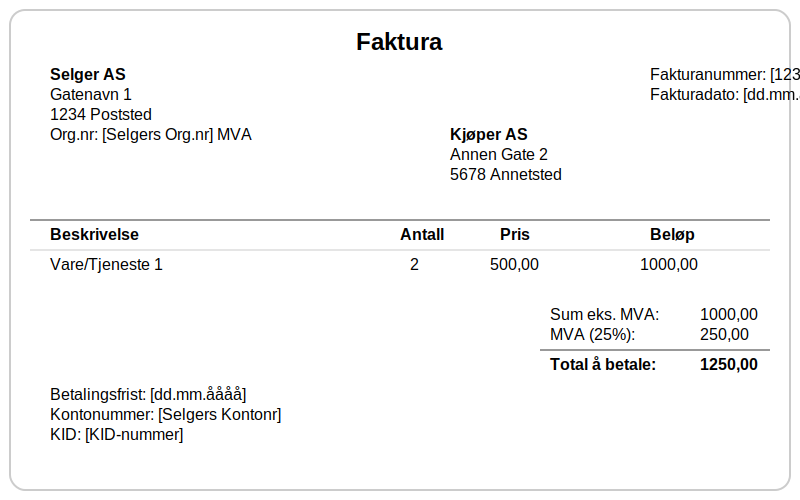
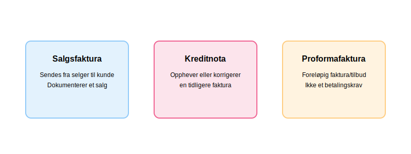

---
title: "Hva er en faktura?"
seoTitle: "Hva er en faktura?"
meta_description: 'En faktura er et formelt, juridisk bindende dokument som en selger utsteder til en kjøper for å kreve betaling for varer eller tjenester. Den fungerer som et ...'
slug: hva-er-en-faktura
type: blog
layout: pages/single
---

En faktura er et formelt, juridisk bindende dokument som en selger utsteder til en kjøper for å kreve betaling for varer eller tjenester. Den fungerer som et sentralt bilag i regnskapet og er grunnlaget for korrekt bokføring av salgsinntekter og [merverdiavgift](/blogs/regnskap/hva-er-avgiftsplikt-mva "Hva er Avgiftsplikt (MVA)? Komplett Guide til Merverdiavgift i Norge"). En **regning** er et mer generelt betalingskrav til kjøper, og omtales nærmere i artikkelen [Regning](/blogs/regnskap/regning "Regning i Norsk Regnskap - Guide til Regning, Regnskapskrav og Forskjell fra Faktura").

For en komplett oversikt over moms (merverdiavgift), se [Hva er Moms (MVA)?](/blogs/regnskap/hva-er-moms-mva "Hva er Moms? Komplett Guide til Merverdiavgift (MVA) i Norge").

Fakturaer dokumenterer salg som utgjør virksomhetens [omsetning](/blogs/regnskap/hva-er-omsetning "Hva er Omsetning? Komplett Guide til Omsetning i Regnskap og Skatt") og er det naturlige sluttresultatet av en [tilbudsprosess](/blogs/regnskap/hva-er-tilbud "Hva er Tilbud? Komplett Guide til Tilbudsprosess og Regnskapsmessig Behandling") når kontrakt er inngått og leveranse har funnet sted. Fakturaer spiller også en kritisk rolle i [anskaffelsesprosesser](/blogs/regnskap/hva-er-anskaffelser "Hva er Anskaffelser? En Komplett Guide til Offentlige og Private Innkjøp"), hvor korrekt fakturabehandling er essensielt for god leverandørstyring.
For en helhetlig introduksjon til prosessen med å utstede og følge opp fakturaer, se [Fakturering](/blogs/regnskap/fakturering "Fakturering: Prosess og Krav i Norske Bedrifter").

Mange bedrifter bruker moderne **[fakturaprogram](/blogs/regnskap/fakturaprogram "Fakturaprogram: Komplette løsninger for digital fakturering")** for å automatisere og effektivisere utsendelse, oppfølging og integrasjon med regnskapssystemet.

## Seksjon 1: Fakturaens Anatomi

I Norge er innholdet i en faktura regulert av bokføringsforskriften. For at en faktura skal være gyldig, må den inneholde en rekke obligatoriske opplysninger. Mange bedrifter bruker standardiserte **[fakturamaler](/blogs/regnskap/hva-er-fakturamal "Hva er Fakturamal? Komplett Guide til Fakturamaler og Fakturadesign")** for å sikre at alle lovkrav oppfylles konsekvent og for å fremme profesjonell merkevareidentitet.

### Lovpålagte Krav til Innhold:

1.  **[Fakturanummer](/blogs/regnskap/hva-er-fakturanummer "Hva er Fakturanummer? Komplett Guide til Nummerering og Lovkrav"):** Et unikt, maskinelt tildelt nummer som er en del av en sammenhengende serie.
2.  **Fakturadato:** Datoen fakturaen utstedes.
3.  **Selgers Navn og [Virksomhetsnummer](/blogs/regnskap/hva-er-virksomhetsnummer "Hva er Virksomhetsnummer? Komplett Guide til Norsk Virksomhetsidentifikasjon"):** Tydelig identifikasjon av selger. Hvis selger er MVA-registrert, skal "MVA" stå etter virksomhetsnummeret.
4.  **Kjøpers Navn og Adresse:** Tydelig identifikasjon av kjøper.
5.  **Beskrivelse av Varen/Tjenesten:** En klar og entydig beskrivelse av hva som er levert.
6.  **Tidspunkt og Sted for Levering:** Når og hvor varen/tjenesten ble levert.
7.  **Pris og MVA:** Beløpet spesifisert i norske kroner, med merverdiavgift angitt i kroner og med gjeldende sats i henhold til [mva-loven](/blogs/regnskap/mva-loven "Mva-loven: Komplett Guide til Merverdiavgiftsloven og Regnskapsføring").
8.  **Totalbeløp:** Summen som skal betales.
9.  **Betalingsfrist:** Forfallsdato for betalingen.

## Seksjon 2: Ulike Typer Fakturaer

Selv om den vanlige salgsfakturaen er mest utbredt, finnes det flere typer fakturaer som brukes i ulike situasjoner. I moderne detaljhandel genereres fakturaer og kvitteringer ofte automatisk gjennom [datakasse (kassasystem)](/blogs/regnskap/hva-er-datakasse "Hva er Datakasse? Komplett Guide til Kassasystem, Krav og Regnskapsføring"), som sikrer korrekt dokumentasjon og automatisk integrasjon med regnskapssystemet.

### 2.1 Salgsfaktura (Sales Invoice)

Dette er den vanligste typen og er et direkte krav om betaling for en levert vare eller tjeneste. Den utløser en inntekt i selgers regnskap og en kostnad i kjøpers regnskap. Når bedrifter selger på kreditt gjennom salgsfakturaer, oppstår det et **[fakturasalg](/blogs/regnskap/hva-er-fakturasalg "Hva er Fakturasalg? Komplett Guide til Kredittgivning og Debitorhåndtering")** som krever systematisk oppfølging og risikostyring for å sikre betaling.

I **[B2B-transaksjoner](/blogs/regnskap/hva-er-b2b "Hva er B2B? Komplett Guide til Business-to-Business i Norsk Regnskap")** (Business-to-Business) er salgsfakturaer ofte mer komplekse, med lengre betalingsbetingelser (vanligvis 30-90 dager), detaljerte referansenummer og spesifikke krav til dokumentasjon som kontraktsnummer og leveringsadresser.

For bedrifter som ønsker å eliminere kredittrisiko helt, kan **[kontantfaktura](/blogs/regnskap/hva-er-kontantfaktura "Hva er Kontantfaktura? Komplett Guide til Kontantfakturering i Norge")** være et alternativ hvor betaling kreves umiddelbart ved levering.

### 2.2 Kreditnota (Credit Note)

En **[kreditnota](/blogs/regnskap/hva-er-kreditnota "Hva er en Kreditnota? Komplett Guide til Kreditnotaer i Norge")** er en "negativ faktura". Den utstedes for å korrigere, redusere eller annullere en tidligere sendt faktura. Dette kan være aktuelt ved retur av varer, prisavslag, eller hvis det var en feil i den opprinnelige fakturaen. En kreditnota må alltid henvise til fakturanummeret den korrigerer.

For en detaljert gjennomgang av når og hvordan kreditnotaer brukes, lovkrav, bokføringsregler og beste praksis, se vår omfattende guide til [kreditnotaer](/blogs/regnskap/hva-er-kreditnota "Hva er en Kreditnota? Komplett Guide til Kreditnotaer i Norge").

### 2.3 Proformafaktura (Pro Forma Invoice)

Proformafakturaer er **foreløpige fakturaer** som ofte benyttes som tilbudsdokumenter og beregningsunderlag. De sendes til kunder for å gi et estimat på kostnader før endelig leveranse. En proformafaktura medfører **ikke et betalingskrav** og skal ikke bokføres som inntekt eller kostnad i regnskapet.

**Hovedtrekk ved proformafaktura:**

* **Formelt tilbudsdokument:** Gir oversikt over forventet pris og leveringsbetingelser
* **Ingen regnskapsføring:** Skal ikke registreres i hovedbok eller MVA-melding
* **Tydelig merking:** Skal merkes tydelig med «Proformafaktura» for å unngå forveksling med ordinære fakturaer
* **Kan brukes ved eksport:** Ofte benyttet for toll- og eksportdokumentasjon

### 2.4 eFaktura (Elektronisk Faktura)

**eFaktura** er den elektroniske standarden for fakturautveksling i Norge, som sendes digitalt og behandles automatisk gjennom _PEPPOL-nettverket_ og integrerte regnskapssystemer. Les mer i vår guide til [eFaktura](/blogs/regnskap/hva-er-efaktura "Hva er eFaktura? Komplett Guide til Elektronisk Fakturering i Norge").

## Seksjon 3: Fakturabehandling og Attestering

Etter at en faktura er mottatt gjennom [bilagsmottaket](/blogs/regnskap/hva-er-bilagsmottak "Bilagsmottak - Komplett Guide til Dokumentmottak og Fakturabehandling"), må den gjennom en **kontroll- og godkjenningsprosess** før den kan bokføres og betales. Denne prosessen kalles [attestering](/blogs/regnskap/hva-er-attestering "Hva er Attestering? En Komplett Guide til Bilagsbehandling og Godkjenning") og er en kritisk del av bedriftens internkontroll.

For en detaljert gjennomgang av hele prosessen for **[inngående fakturaer](/blogs/regnskap/innganende-faktura "Inngående Faktura - Komplett Guide til Mottak og Behandling av Leverandørfakturaer")** fra mottak til betaling, inkludert kontrollrutiner, automatisering og beste praksis, se vår omfattende guide.

### Kontrollpunkter for Fakturaer

Før en faktura godkjennes, må følgende kontroller utføres:

* **Saklig kontroll:** Er varen eller tjenesten faktisk levert som beskrevet?
* **Regnskapsmessig kontroll:** Er fakturaen korrekt kontert og MVA-behandlet?
* **Økonomisk kontroll:** Er kjøpet innenfor budsjett og fullmakter?

Korrekt [attestering av fakturaer](/blogs/regnskap/hva-er-attestering "Hva er Attestering? En Komplett Guide til Bilagsbehandling og Godkjenning") sikrer at bedriften kun betaler for varer og tjenester som faktisk er mottatt, og at alle transaksjoner er korrekt dokumentert i regnskapet. For omfattende veiledning om moderne [bilagsbehandling](/blogs/regnskap/bilag "Bilag - Komplett Guide til Regnskapsbilag, Digital Behandling og Oppbevaring"), inkludert digitale løsninger og beste praksis, se vår detaljerte guide. Dette er spesielt viktig for å opprettholde god internkontroll og for å tilfredsstille revisors krav til dokumentasjon.

### Automatisering av Fakturabehandling

I moderne bedrifter kan mye av fakturabehandlingen automatiseres gjennom **[fakturatolk-teknologi](/blogs/regnskap/hva-er-fakturatolk "Hva er Fakturatolk? Automatisk Fakturabehandling og OCR-teknologi")**. Denne teknologien bruker OCR (Optical Character Recognition) og kunstig intelligens for å automatisk lese, tolke og behandle fakturaer, noe som kan redusere behandlingstiden med 80-90% og samtidig minimere menneskelige feil.

## Seksjon 4: Betalingsmetoder for Fakturaer

Etter at en faktura er attestert og godkjent, må den betales innen forfallsdato. Det finnes flere [betalingsmetoder](/blogs/regnskap/hva-er-betalingsmidler "Hva er Betalingsmidler? Tvungne, Elektroniske og Tradisjonelle Metoder") tilgjengelig for både privatpersoner og bedrifter:

### Automatiske Betalingsløsninger

For regelmessige fakturaer kan **automatiske betalingsløsninger** spare tid og redusere risikoen for forglemmelse:

* **[AvtaleGiro](/blogs/regnskap/hva-er-avtalegiro "Hva er AvtaleGiro? Komplett Guide til Automatisk Betaling"):** Den mest brukte løsningen for automatisk betaling av fakturaer i Norge. Beløpet trekkes automatisk fra bankkonto på forfallsdato.
* **[eFaktura](/blogs/regnskap/hva-er-efaktura "Hva er eFaktura? Komplett Guide til Elektronisk Fakturering i Norge"):** Elektronisk faktura som mottas direkte i nettbanken, hvor kunde må godkjenne hver betaling manuelt.

I dag beveger fakturabehandlingen seg stadig mer mot digitale løsninger. Les mer om [elektronisk fakturering](/blogs/regnskap/hva-er-elektronisk-fakturering "Hva er Elektronisk Fakturering? Komplett Guide til Digitale Fakturaløsninger") for å forstå alle de ulike digitale alternativene som finnes for både bedrifter og privatpersoner.

Disse digitale betalingsløsningene er alle deler av det moderne spekteret av [betalingstjenester](/blogs/regnskap/betalingstjeneste "Hva er betalingstjeneste? Komplett Guide til Betalingstjenester i Norge"), som omfatter alt fra tradisjonelle bankoverføringer til avanserte API-baserte løsninger. Alle elektroniske betalingstjenester er regulert av [betalingstjenestedirektivet (PSD2)](/blogs/regnskap/hva-er-betalingstjenestedirektivet "Hva er Betalingstjenestedirektivet (PSD2)? Påvirkning på Regnskap og Betalingstjenester"), som sikrer trygg og innovativ utvikling av digitale betalingsløsninger.

### Manuelle Betalingsmetoder

* **[BankGiro](/blogs/regnskap/hva-er-bankgiro "Hva er BankGiro? Komplett Guide til Norsk Betalingssystem"):** Tradisjonell betaling via nettbank eller bankkontor med OCR-nummer for automatisk avstemming
* **[KID-nummer](/blogs/regnskap/hva-er-kid-nummer "Hva er KID-nummer? Komplett Guide til Kunde-IDentifikasjon i Norge"):** Betalingsreferanse som automatisk identifiserer og kobler betalinger til riktig kunde eller faktura
* **Vipps Regning:** Moderne mobilbasert betalingsløsning

Valg av betalingsmetode avhenger av fakturatype, beløpsstørrelse og ønsket kontrollnivå. For faste, regelmessige fakturaer som husleie og forsikringer er [AvtaleGiro](/blogs/regnskap/hva-er-avtalegiro "Hva er AvtaleGiro? Komplett Guide til Automatisk Betaling") ofte den mest praktiske løsningen.

## Seksjon 5: Fakturagebyr og Tilleggskostnader

I tillegg til hovedbeløpet på fakturaen kan leverandører kreve **[fakturagebyr](/blogs/regnskap/hva-er-fakturagebyr "Hva er Fakturagebyr? Komplett Guide til Faktureringsgebyrer i Norge")** for å dekke administrative kostnader ved faktureringsprocessen. Dette er særlig vanlig når kunder velger papirfaktura fremfor elektroniske alternativer.

### Vanlige Typer Tilleggsgebyrer

* **Papirfakturagebyr:** Dekker kostnader for porto, papir og manuell håndtering
* **Ekspedisjonsgebyr:** For spesielle leveringskrav eller ekstra dokumentasjon
* **Purregebyrer:** Ved forsinket betaling (regulert av inkassoloven)

**Viktig:** Alle fakturagebyr må være **forholdsmessige**, **avtalt på forhånd** og ikke overstige faktiske kostnader. Leverandører må tilby elektroniske alternativer gratis der det er relevant.

For en detaljert gjennomgang av lovlige rammer, beregning og regnskapsføring av fakturagebyr, se vår omfattende guide til [fakturagebyr](/blogs/regnskap/hva-er-fakturagebyr "Hva er Fakturagebyr? Komplett Guide til Faktureringsgebyrer i Norge").

## Seksjon 6: Oppfølging av Ubetalte Fakturaer

Når fakturaer ikke betales innen forfallsdato, må bedriften iverksette systematisk oppfølging for å sikre betaling. Dette er en kritisk del av [kundeoppfølging](/blogs/regnskap/hva-er-ansattreskontro "Hva er Ansattreskontro? Komplett Guide til Kundeoppfølging og Fordringsstyring") og påvirker direkte bedriftens [betalingsevne](/blogs/regnskap/hva-er-betalingsevne "Hva er Betalingsevne? Analyse av Likviditet og Finansiell Stabilitet"). Et velorganisert [kundekartotek](/blogs/regnskap/hva-er-kundekartotek "Hva er Kundekartotek? Komplett Guide til Kundedatabase og Kunderegistrering") er fundamentet for effektiv oppfølging av kundeforhold og betalingshistorikk.

### Betalingspåminnelser

Den første og viktigste oppfølgingsmetoden er å sende **[betalingsoppfordringer](/blogs/regnskap/hva-er-betalingsoppfordring "Betalingsoppfordring - Komplett Guide til Purring og Inkasso i Norge")**. Dette er formelle oppfordringer til betaling som må følge spesifikke juridiske krav:

* **Første påminnelse:** Sendes vanligvis 30 dager etter forfallsdato med høflig tone
* **Andre påminnelse:** Strengere formulering med høyere [purregebyr](/blogs/regnskap/hva-er-purring-og-purregebyr "Hva er Purring og Purregebyr? Guide til Norske Regler og Regnskapsføring")
* **Tredje påminnelse:** Inkluderer trussel om inkasso eller rettslige skritt

### Konsekvenser ved Manglende Betaling

Når fakturaer forblir ubetalte, kan dette føre til:

* **[Forsinkelsesrenter](/blogs/regnskap/hva-er-forsinkelsesrente "Hva er Forsinkelsesrente? Komplett Guide til Morarenter og Beregning"):** Lovregulerte renter som påløper fra forfallsdato
* **[Purregebyrer](/blogs/regnskap/hva-er-purring-og-purregebyr "Hva er Purring og Purregebyr? Guide til Norske Regler og Regnskapsføring"):** Kompensasjon for administrative kostnader ved oppfølging
* **Inkassoprosess:** Overføring til profesjonelle inkassoselskaper
* **[Betalingsanmerkning](/blogs/regnskap/betalingsanmerkning "Betalingsanmerkning - Hva betyr det for kredittverdighet og regnskap?"):** Offentlig registrering som påvirker kredittverdighet i flere år
* **Tap på fordringer:** Nedskrivning eller avskrivning av uinnkrevelige beløp

Effektiv oppfølging av forfalte fakturaer er essensielt for å opprettholde god kontantstrøm og minimere tap på fordringer. Les mer om den komplette prosessen i vår guide til [betalingsoppfordring](/blogs/regnskap/hva-er-betalingsoppfordring "Betalingsoppfordring - Komplett Guide til Purring og Inkasso i Norge").

## Seksjon 7: Oppsummering

Fakturaer er selve ryggraden i norsk regnskapsføring og dokumenterer både **omsetning**, **MVA** og betaling. For å sikre korrekte og lovlige fakturaer må man:

* Bruke **komplett fakturainnhold** i henhold til bokføringsforskriften
* Velge riktig **fakturatype** (salgsfaktura, kreditnota, proformafaktura, eFaktura)
* Implementere god **fakturabehandling og attestering** for internkontroll
* Tilby effektive **betalingsløsninger** og følge opp forfalte krav
* Unngå forsinkelsesgebyrer og tap på fordringer ved systematisk oppfølging

God praksis rundt fakturering bidrar til bedre likviditet, overholdelse av lovkrav og et profesjonelt kundeforhold.

