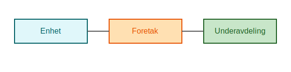

---
title: "Hva er Enhetsregisteret?"
meta_title: "Hva er Enhetsregisteret?"
meta_description: 'Enhetsregisteret er et offentlig register som administreres av [Brønnøysundregistrene](/blogs/regnskap/bronnoysundregistrene "Brønnøysundregistrene - Oversi...'
slug: hva-er-enhetsregisteret
type: blog
layout: pages/single
---

Enhetsregisteret er et offentlig register som administreres av [Brønnøysundregistrene](/blogs/regnskap/bronnoysundregistrene "Brønnøysundregistrene - Oversikt over Norske Registere") og inneholder _grunnleggende_ informasjon om alle juridiske enheter i Norge. **Enhetsregisteret** gir bedrifter, myndigheter og publikum tilgang til sentral informasjon som organisasjonsnummer, navn og adresse, og danner grunnlaget for videre registreringer i [Foretaksregisteret](/blogs/regnskap/ansvarlig-selskap "Hva er Ansvarlig Selskap?") og [MVA-registeret](/blogs/regnskap/hva-er-mva-registeret "Hva er MVA-registeret?"). For dokumentasjon av registrerte opplysninger kan du bestille en [firmaattest](/blogs/regnskap/firmaattest "Firmaattest").

## Hva er formålet med Enhetsregisteret?

Enhetsregisterets hovedformål er å:

* Skrive ut unike **organisasjonsnummer** til alle juridiske enheter.
* Samle _grunnleggende_ informasjon som navn, adresse, registreringsdato og [organisasjonsform](/blogs/regnskap/organisasjonsform "Organisasjonsform: Komplett Guide til Selskapsformer i Norge").
* Legge til rette for effektiv forvaltning og styring av andre næringsregistre.

## Hvilke opplysninger inneholder registeret?

Informasjon lagret i Enhetsregisteret presenteres i følgende tabell:

| **Felt**               | **Beskrivelse**                                                    |
|------------------------|--------------------------------------------------------------------|
| Organisasjonsnummer    | Unikt identifikasjonsnummer for hver juridiske enhet.             |
| Navn                   | Registrert navn på enheten (virksomhetsnavn eller foretaksnavn). |
| Hovedkontoradresse     | Offisiell adresse for enhetens hovedkontor.                        |
| Registreringsdato      | Datoen enheten ble registrert i registeret.                        |
| Organisasjonsform      | Type enhet (f.eks. ENK, AS, ANS).                                   |
| Bransjekode (NACE)     | Standardkode for primærnæring/aktivitet.                           |

## Hvordan registrere en enhet?

For å registrere en ny juridisk enhet i Enhetsregisteret må du:

1. Velge korrekt [organisasjonsform](/blogs/regnskap/organisasjonsform "Organisasjonsform: Komplett Guide til Selskapsformer i Norge") og fylle ut skjema via [Altinn](/blogs/regnskap/hva-er-altinn "Hva er Altinn? En Guide til Offentlige Tjenester").
2. Oppgi nødvendige opplysninger om navn, adresse og virksomhet.
3. Send registreringsskjema til Brønnøysundregistrene.
4. Motta tildelt organisasjonsnummer og bekreftelse.

## Bruksområder for regnskap og administrasjon

**Enhetsregisteret** er en viktig kilde for:

* Verifisering av **organisasjonsnummer** og status i regnskapssystemer.
* Automatisk ajourføring av kunde- og leverandørregistre.
* Rapportering til offentlige myndigheter, som Skatteetaten og Statistisk sentralbyrå (SSB).
* Sammenstilling av regnskapsdata på tvers av selskaper og konsern.

## Oppsummering

Enhetsregisteret er et fundamentalt register for alle juridiske enheter i Norge. Det sikrer korrekt tildeling av organisasjonsnummer og gir en sentral kilde til grunninformasjon som brukes i alle former for regnskapsføring, selskapsregistrering og offentlig rapportering.

## Se også

* [Hva er Regnskapsregisteret?](/blogs/regnskap/hva-er-regnskapsregisteret "Hva er Regnskapsregisteret? Komplett Guide til Regnskapsregisteret i Norge")

