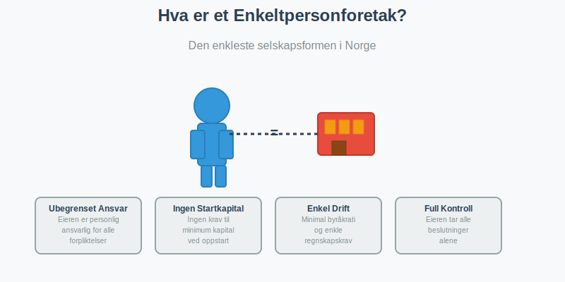
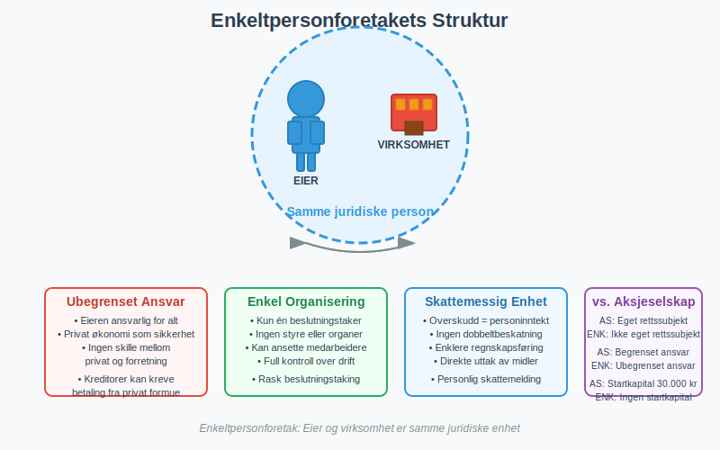
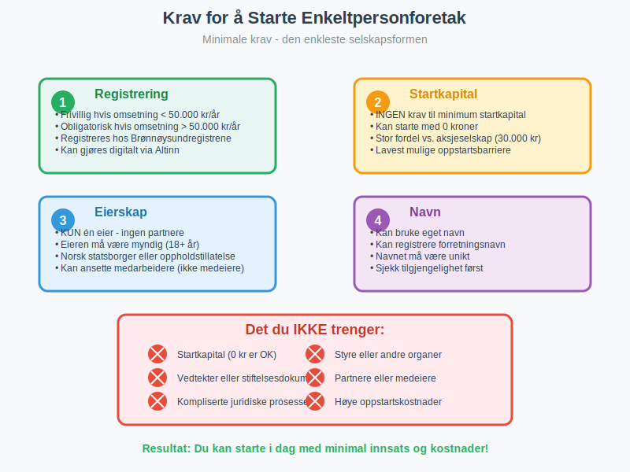
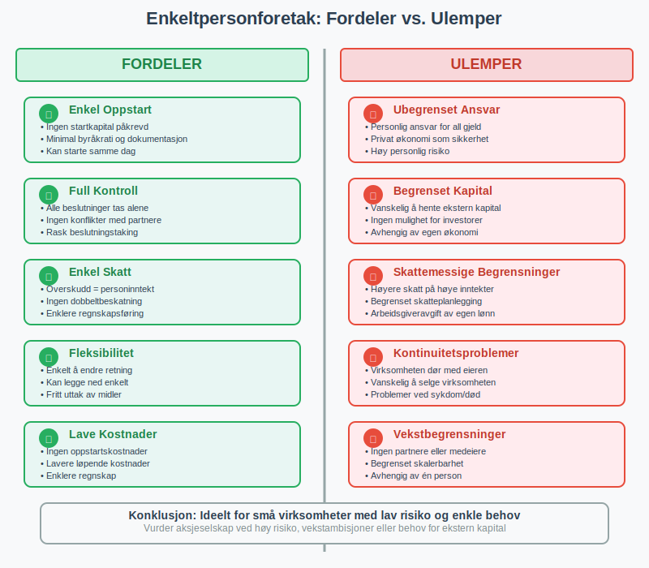
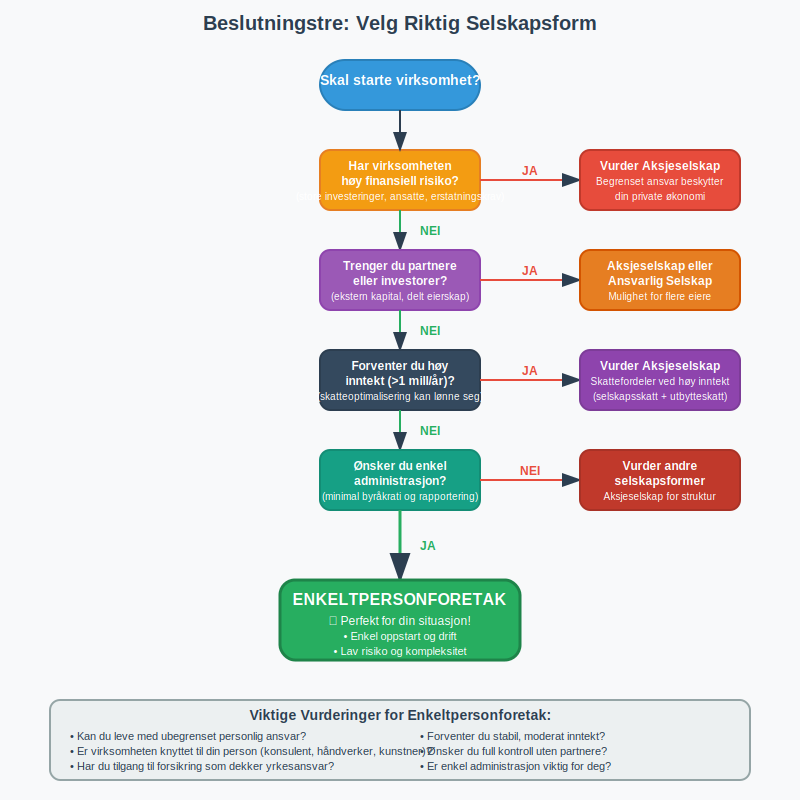

---
title: "Hva er et Enkeltpersonforetak?"
meta_title: "Hva er et Enkeltpersonforetak?"
meta_description: 'For en oversikt over ulike selskapsformer i Norge, se [Selskapsform](/blogs/regnskap/selskapsform "Selskapsform: Oversikt over selskapsformer i Norge").'
slug: hva-er-enkeltpersonforetak
type: blog
layout: pages/single
---

For en oversikt over ulike selskapsformer i Norge, se [Selskapsform](/blogs/regnskap/selskapsform "Selskapsform: Oversikt over selskapsformer i Norge").
For en oversikt over ulike selskapsformer i Norge, se [Selskapsform](/blogs/regnskap/selskapsform "Selskapsform: Oversikt over selskapsformer i Norge").

For en praktisk guide til oppstart, se [Starte Enkeltpersonforetak](/blogs/regnskap/starte-enkeltpersonforetak "Starte Enkeltpersonforetak: Steg-for-steg guide til oppstart av enkeltpersonforetak").
Et **enkeltpersonforetak (ENK)** er den enkleste og mest vanlige [foretaksformen](/blogs/regnskap/hva-er-foretak "Hva er et Foretak? Komplett Guide til Foretaksformer i Norge") for små bedrifter i Norge. Dette er en virksomhet som drives av én person i eget navn, hvor eieren har ubegrenset personlig ansvar for alle forpliktelser.

### Hva Kjennetegner et Enkeltpersonforetak?

Et enkeltpersonforetak skiller seg fra andre selskapsformer på flere viktige måter:

#### Ubegrenset Personlig Ansvar
Den viktigste egenskapen ved et enkeltpersonforetak er at **eieren har ubegrenset personlig ansvar**. Dette betyr at du som eier er personlig ansvarlig for alle selskapets forpliktelser. Hvis virksomheten får økonomiske problemer, kan kreditorer kreve betaling fra din private økonomi.

#### Ikke Eget Rettssubjekt
I motsetning til et [aksjeselskap](/blogs/regnskap/hva-er-et-aksjeselskap "Hva er et Aksjeselskap (AS)? Komplett Guide til Selskapsformen"), er enkeltpersonforetaket **ikke et eget rettssubjekt** og ikke en [juridisk person](/blogs/regnskap/hva-er-juridisk-person "Hva er en Juridisk Person? Komplett Guide til Juridiske Personer i Regnskap"). Virksomheten og eieren er juridisk sett samme person, noe som betyr:

* Alle kontrakter inngås i eierens navn
* Eieren eier alle eiendeler direkte
* Eieren er personlig ansvarlig for alle forpliktelser
* Virksomheten kan ikke saksøke eller bli saksøkt separat fra eieren

#### Ingen Krav til Startkapital
For å starte et enkeltpersonforetak trenger du **ingen minimum startkapital**. Dette gjør det til den mest tilgjengelige selskapsformen for nye gründere.

### Krav for å Starte et Enkeltpersonforetak

Kravene for å etablere et enkeltpersonforetak er minimale:

#### Registrering
* **Frivillig registrering** i [Enhetsregisteret](/blogs/regnskap/hva-er-enhetsregisteret "Hva er Enhetsregisteret?") hvis årlig omsetning er under 50 000 kr
* **Obligatorisk registrering** hvis årlig omsetning overstiger 50 000 kr
* Registrering gjøres hos Brønnøysundregistrene
* Enkel prosess som kan gjøres digitalt

#### Eierskap
* **Kun én eier** - kan ikke ha partnere eller medeiere
* Eieren må være myndig (over 18 år)
* Norske statsborgere eller personer med oppholdstillatelse kan starte enkeltpersonforetak

#### Navn
* Virksomheten kan drives under eierens **eget navn**
* Kan også registrere et **forretningsnavn** (f.eks. "Ola Nordmanns Rørleggerservice")
* Forretningsnavnet må være unikt og ikke forveksles med andre registrerte navn

### Organisering av et Enkeltpersonforetak

Enkeltpersonforetaket har en svært enkel organisasjonsstruktur:

#### Eieren som Eneste Beslutningstaker
* **Eieren** tar alle beslutninger alene
* Ingen krav til styre eller andre organer
* Full kontroll over virksomheten
* Kan ansette medarbeidere, men de blir ikke medeiere

#### Ansatte
* Kan ansette medarbeidere som **arbeidstakere**
* Ansatte har ingen eierskap eller beslutningsmyndighet
* Eieren er ansvarlig som arbeidsgiver med alle tilhørende plikter

### Fordeler med Enkeltpersonforetak

#### Enkel Oppstart og Drift
* **Minimal byråkrati** ved oppstart
* Ingen krav til startkapital
* Enkel registreringsprosess
* Lav kostnad ved etablering

#### Full Kontroll
* **Eieren bestemmer alt** uten å måtte konsultere andre
* Rask beslutningstaking
* Ingen konflikter med partnere eller aksjonærer
* Fleksibel drift tilpasset eierens ønsker

#### Enkel Skattebehandling
* **[Personinntekt](/blogs/regnskap/personinntekt "Personinntekt “ Komplett guide til personinntekt i norsk regnskap")** - virksomhetens overskudd beskattes som eierens personinntekt
* Ingen dobbeltbeskatning som i aksjeselskaper
* Enklere [regnskap](/blogs/regnskap/hva-er-regnskap "Hva er Regnskap? En komplett guide") og rapportering
* Mulighet for enkelt [regnskap](/blogs/regnskap/hva-er-regnskap "Hva er Regnskap? En komplett guide") hvis omsetningen er under visse grenser
* For landbruksvirksomheter kan [jordbruksfradrag](/blogs/regnskap/hva-er-jordbruksfradrag "Hva er Jordbruksfradrag? Komplett Guide til Landbruksfradrag og Skattefordeler") gi betydelige skattefordeler

#### Fleksibilitet
* **Enkelt å endre** virksomhetens fokus eller retning
* Kan enkelt legge ned virksomheten
* Ingen krav til generalforsamlinger eller styremøter
* Eieren kan ta ut penger fra virksomheten når som helst

### Ulemper med Enkeltpersonforetak

#### Ubegrenset Personlig Ansvar
Den største ulempen er at **eierens private økonomi står som sikkerhet** for alle virksomhetens forpliktelser:

* Kreditorer kan kreve betaling fra privat formue
* Bolig og andre private eiendeler kan bli tatt som sikkerhet
* Høy personlig risiko ved økonomiske problemer
* Kan påvirke eierens [kredittverdighet](/blogs/regnskap/hva-er-bonitet "Hva er bonitet?")

#### Begrenset Tilgang til Kapital
* **Vanskelig å hente ekstern kapital** siden investorer ikke kan bli medeiere
* Banker kan være mer restriktive med lån
* Ingen mulighet for å utstede aksjer
* Avhengig av eierens private økonomi og kredittevne

#### Skattemessige Begrensninger
* **Høyere skattesats** på høye inntekter sammenlignet med aksjeselskap
* Ingen mulighet for utbytteskatt
* Begrenset mulighet for skatteplanlegging
* Eieren må betale arbeidsgiveravgift av egen lønn

#### Kontinuitetsproblemer
* **Virksomheten dør med eieren** - ingen automatisk videreføring
* Vanskelig å selge virksomheten som helhet
* Problemer ved eierens sykdom eller død
* Ingen mulighet for gradvis overdragelse til andre

### Regnskapsplikt og Rapportering

Enkeltpersonforetak har ulike regnskapskrav avhengig av størrelse:

#### Omsetning under 5 millioner kr
* **Forenklet regnskapsplikt** etter [bokføringsloven](/blogs/regnskap/hva-er-bokforingsloven "Hva er Bokføringsloven? Komplett Guide til Norsk Bokføringslovgivning")
* Kan føre enkelt [regnskap](/blogs/regnskap/hva-er-regnskap "Hva er Regnskap? En komplett guide")
* Mindre krav til dokumentasjon og rapportering

#### Omsetning over 5 millioner kr
* **Full regnskapsplikt** med krav til [dobbel bokføring](/blogs/regnskap/hva-er-dobbel-bokforing "Hva er Dobbel Bokføring? Komplett Guide til Dobbelt Bokføring")
* Må følge [bokføringsforskriften](/blogs/regnskap/hva-er-bokforingsforskriften "Hva er Bokføringsforskriften? Detaljerte Regler for Bokføring i Norge")
* Krav til årsregnskap og eventuelt revisjon

#### MVA-plikt
* **[MVA-registrering](/blogs/regnskap/hva-er-avgiftsplikt-mva "Hva er Avgiftsplikt (MVA)? Komplett Guide til Merverdiavgift i Norge")** påkrevd hvis omsetningen overstiger 50 000 kr - virksomheten må registreres i [MVA-registeret](/blogs/regnskap/hva-er-mva-registeret "Hva er MVA-registeret? Komplett Guide til Merverdiavgiftsregisteret i Norge")
* MÃ¥ levere MVA-meldinger regelmessig
* Krav til [bilagsføring](/blogs/regnskap/hva-er-bilagsforing "Hva er Bilagsføring? Komplett Guide til Korrekt Bilagsbehandling") og dokumentasjon
* Les mer om **[MVA-plikt](/blogs/regnskap/mva-plikt "MVA-plikt: Komplett Guide til Merverdiavgiftsplikt i Norge")** for enkeltpersonforetak

### Sammenligning med Andre Selskapsformer

For en grundig oversikt over alle [organisasjonsformer](/blogs/regnskap/organisasjonsform "Organisasjonsform: Komplett Guide til Selskapsformer i Norge") og hvordan de sammenlignes, se vår detaljerte guide.

| Aspekt | Enkeltpersonforetak | [Aksjeselskap (AS)](/blogs/regnskap/hva-er-et-aksjeselskap "Hva er et Aksjeselskap (AS)? Komplett Guide til Selskapsformen") | [Ansvarlig Selskap (ANS)](/blogs/regnskap/ansvarlig-selskap "Ansvarlig Selskap (ANS): Komplett Guide til Norsk Regnskap og Ansvarsstruktur") |
|--------|---------------------|------------------|----------------------|
| **Ansvar** | Ubegrenset personlig | Begrenset til aksjekapital | Ubegrenset solidarisk |
| **Startkapital** | Ingen krav | Minimum 30 000 kr | Ingen krav |
| **Antall eiere** | Kun én | En eller flere | To eller flere |
| **Skattebehandling** | Personinntekt | Selskapsskatt + utbytteskatt | Personinntekt for deltakerne |
| **Kompleksitet** | Svært enkel | Kompleks | Middels kompleks |
| **Eget rettssubjekt** | Nei | Ja | Nei |

### Når Bør Du Velge Enkeltpersonforetak?

Enkeltpersonforetak er ideelt hvis:

#### Lav Risiko
* **Virksomheten har lav finansiell risiko**
* FÃ¥ eller ingen ansatte
* Begrenset med utstyr eller inventar
* Servicenæring uten store investeringer

#### Enkel Drift
* **Ønsker enkel administrasjon** og minimal byråkrati
* Ikke behov for eksterne investorer
* Vil ha full kontroll over beslutninger
* Lav omsetning og kompleksitet

#### Personlig Service
* **Virksomheten er knyttet til din person** (konsulent, håndverker, kunstner)
* Kunder forventer personlig service fra deg
* Vanskelig å skille mellom deg og virksomheten

### Når Bør Du Vurdere Andre Selskapsformer?

Vurder andre alternativer hvis:

#### Høy Risiko
* **Virksomheten innebærer høy finansiell risiko**
* Store investeringer i utstyr eller lokaler
* Mange ansatte eller kompleks drift
* Potensielt høye erstatningskrav

#### Vekstambisjoner
* **Planer om rask vekst** og behov for ekstern kapital
* Ønsker å ta inn partnere eller investorer
* Behov for å beholde overskudd i virksomheten for reinvestering

#### Skatteoptimalisering
* **Høy inntekt** hvor selskapsskatt kan være mer fordelaktig
* Behov for fleksibel uttak av overskudd
* Komplekse eierstrukturer

### Praktiske RÃ¥d for Oppstart

Hvis du vurderer å starte et enkeltpersonforetak:

#### Før Oppstart
1. **Vurder risikoen:** Kan du leve med ubegrenset personlig ansvar?
2. **Planlegg økonomien:** Sett opp budsjett og likviditetsplan
3. **Sjekk forsikringsbehov:** Vurder yrkesansvarsforsikring og andre forsikringer
4. **Velg regnskapssystem:** Finn et enkelt system for [bokføring](/blogs/regnskap/hva-er-bokforing "Hva er Bokføring? Komplett Guide til Bokføring og Regnskapsføring")

#### Ved Registrering
1. **Velg navn:** Sjekk at ønsket forretningsnavn er tilgjengelig
2. **Registrer virksomheten:** Bruk Altinn eller Brønnøysundregistrenes nettsider
3. **Åpne forretningskonto:** Skill privat og forretningsøkonomi
4. **Sett opp [regnskap](/blogs/regnskap/hva-er-regnskap "Hva er Regnskap? En komplett guide"):** Etabler rutiner for [bilagsføring](/blogs/regnskap/hva-er-bilagsforing "Hva er Bilagsføring? Komplett Guide til Korrekt Bilagsbehandling") og dokumentasjon

#### Etter Oppstart
1. **Følg opp [regnskap](/blogs/regnskap/hva-er-regnskap "Hva er Regnskap? En komplett guide"):** Sørg for løpende [bokføring](/blogs/regnskap/hva-er-bokforing "Hva er Bokføring? Komplett Guide til Bokføring og Regnskapsføring")
2. **Lever rapporter:** MVA-meldinger og [næringsoppgave](/blogs/regnskap/hva-er-naeringsoppgave "Hva er Næringsoppgave? Komplett Guide til Næringsoppgaven i Norge") til skattemyndighetene
3. **Vurder vekst:** Følg med på om virksomheten vokser ut av enkeltpersonforetak-formen
4. **Oppdater forsikringer:** Juster forsikringsdekning etter behov

### Overgang til Andre Selskapsformer

Mange enkeltpersonforetak vokser seg større og må vurdere overgang til andre selskapsformer:

#### NÃ¥r Vurdere Overgang
* **Omsetning over 5-10 millioner kr** - skattefordeler ved aksjeselskap
* **Behov for partnere** - vurder [ansvarlig selskap](/blogs/regnskap/ansvarlig-selskap "Ansvarlig Selskap (ANS): Komplett Guide til Norsk Regnskap og Ansvarsstruktur") eller [aksjeselskap](/blogs/regnskap/hva-er-et-aksjeselskap "Hva er et Aksjeselskap (AS)? Komplett Guide til Selskapsformen")
* **Høy risiko** - begrenset ansvar blir viktig
* **Investeringsbehov** - tilgang til ekstern kapital

#### Overgangsprosess
* **Verdivurdering** av virksomheten
* **Skattemessige konsekvenser** av overgang
* **Juridisk bistand** for korrekt gjennomføring
* **Ny organisering** og tilpasning til ny selskapsform

### Relaterte Begreper og Konsepter

For å forstå enkeltpersonforetak fullt ut, bør du også sette deg inn i:

* **[Regnskap](/blogs/regnskap/hva-er-regnskap "Hva er Regnskap? En komplett guide")** - Grunnleggende regnskapsføring for enkeltpersonforetak
* **[Bokføring](/blogs/regnskap/hva-er-bokforing "Hva er Bokføring? Komplett Guide til Bokføring og Regnskapsføring")** - Praktisk bokføring og dokumentasjon
* **[Bokføringsloven](/blogs/regnskap/hva-er-bokforingsloven "Hva er Bokføringsloven? Komplett Guide til Norsk Bokføringslovgivning")** - Juridiske krav til regnskapsføring
* **[Bilagsføring](/blogs/regnskap/hva-er-bilagsforing "Hva er Bilagsføring? Komplett Guide til Korrekt Bilagsbehandling")** - Korrekt håndtering av regnskapsbilag
* **[MVA-plikt](/blogs/regnskap/hva-er-avgiftsplikt-mva "Hva er Avgiftsplikt (MVA)? Komplett Guide til Merverdiavgift i Norge")** - Merverdiavgift for enkeltpersonforetak
* **[Aksjeselskap](/blogs/regnskap/hva-er-et-aksjeselskap "Hva er et Aksjeselskap (AS)? Komplett Guide til Selskapsformen")** - Alternativ selskapsform med begrenset ansvar
* **[Ansvarlig Selskap](/blogs/regnskap/ansvarlig-selskap "Ansvarlig Selskap (ANS): Komplett Guide til Norsk Regnskap og Ansvarsstruktur")** - Selskapsform for flere deltakere

### Konklusjon

Et enkeltpersonforetak er den perfekte selskapsformen for mange små bedrifter og gründere som ønsker **enkel oppstart, full kontroll og minimal administrasjon**. Selv om ubegrenset personlig ansvar kan virke skremmende, er dette ofte en overkommelig risiko for virksomheter med lav kompleksitet og begrenset finansiell eksponering.

Nøkkelen til suksess med enkeltpersonforetak ligger i å:
* **Forstå risikoen** og håndtere den gjennom forsikring og forsiktig drift
* **Holde orden på økonomien** med god [bokføring](/blogs/regnskap/hva-er-bokforing "Hva er Bokføring? Komplett Guide til Bokføring og Regnskapsføring") og [regnskap](/blogs/regnskap/hva-er-regnskap "Hva er Regnskap? En komplett guide")
* **Følge opp lovkrav** som MVA-rapportering og [næringsoppgave](/blogs/regnskap/hva-er-naeringsoppgave "Hva er Næringsoppgave? Komplett Guide til Næringsoppgaven i Norge")
* **Vurdere overgang** til andre selskapsformer når virksomheten vokser

For mange er enkeltpersonforetaket det naturlige første steget på veien mot å bygge en suksessfull virksomhet.

