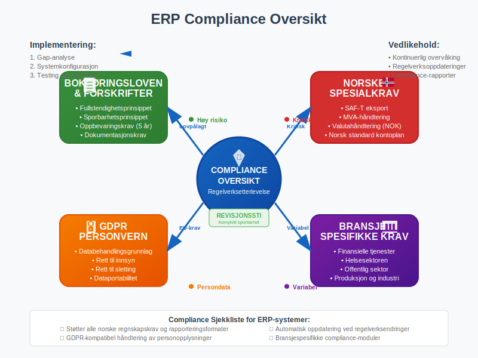

Et **ERP-system** (Enterprise Resource Planning) er en integrert programvareløsning som samler og koordinerer alle kjerneforretningsprosessene i en organisasjon. For norske bedrifter representerer ERP-systemer ryggraden i moderne forretningsdrift, hvor [regnskap](/blogs/regnskap/hva-er-regnskap "Hva er regnskap? En Dybdeanalyse for Norge"), økonomi, produksjon, salg og personaladministrasjon integreres i én sammenhengende plattform.

*Se også: [Økonomisystem](/blogs/regnskap/okonomisystem "Økonomisystem “ En Guide til Moderne Økonomistyring")*

## Seksjon 1: Grunnleggende Konsepter og Definisjon

ERP-systemer bygger på prinsippet om **sentral dataintegrasjon**, hvor alle forretningsdata lagres i en felles database og er tilgjengelig for alle autoriserte brukere i sanntid. Dette eliminerer datasiloer og sikrer at alle avdelinger arbeider med samme, oppdaterte informasjon.

### 1.1 Historisk Utvikling

ERP-systemer har utviklet seg fra enkle **MRP-systemer** (Material Requirements Planning) på 1960-tallet til dagens omfattende forretningsplattformer:

* **1960-1970:** MRP - Fokus på produksjonsplanlegging
* **1980-1990:** MRP II - Utvidet til finansiell planlegging
* **1990-2000:** ERP - Integrerte alle forretningsprosesser
* **2000-2010:** ERP II - Web-baserte løsninger og e-handel
* **2010-i dag:** Cloud ERP - Skybaserte, mobile og AI-drevne systemer

### 1.2 Kjerneprinsippene

ERP-systemer bygger på fire grunnleggende prinsipper som sikrer effektiv forretningsdrift:

* **Integrering:** Alle moduler deler samme database og datamodell
* **Sanntidsdata:** Informasjon oppdateres umiddelbart på tvers av systemet
* **Standardisering:** Felles forretningsprosesser og arbeidsflyter
* **Sentralisering:** Én kilde til sannhet for alle forretningsdata

## Seksjon 2: Kjernemodulene i ERP-systemer

Moderne ERP-systemer består av flere integrerte moduler som dekker ulike forretningsområder. For norske bedrifter er spesielt økonomi- og regnskapsmodulene kritiske for å oppfylle lovkrav. Disse systemene drar stor nytte av [API-integrasjon og automatisering](/blogs/regnskap/api-integrasjon-automatisering-regnskap "API Integrasjon og Automatisering av Regnskap - Komplett Guide til Digital Regnskapsføring") for å sikre sømløs dataflyt mellom ulike forretningsprosesser.

### 2.1 Økonomi og Regnskap

Økonomimodulen er hjertet i ethvert ERP-system og håndterer all finansiell informasjon. Den integrerer sømløst med [bokføring](/blogs/regnskap/hva-er-bokforing "Hva er Bokføring? En Komplett Guide til Norsk Bokføringspraksis") og sikrer automatisk registrering av alle transaksjoner. ERP-systemer er også fundamentale for [internregnskap](/blogs/regnskap/hva-er-internregnskap "Hva er Internregnskap? Komplett Guide til Intern Finansiell Styring og Rapportering"), hvor de gir sanntidsdata for budsjetter, kalkyler og prestasjonsmåling.

**Hovedfunksjoner:**

* **Hovedbok:** Automatisk [dobbel bokføring](/blogs/regnskap/hva-er-dobbel-bokforing "Hva er Dobbel Bokføring? Komplett Guide til Dobbelt Bokføringssystem") av alle transaksjoner
* **Kundefordringer:** Håndtering av [debitor](/blogs/regnskap/hva-er-debitor "Hva er Debitor? Komplett Guide til Kundefordringer og Kredittstyring")kontoer og kredittstyring
* **Leverandørgjeld:** Administrasjon av leverandørfakturaer og betalinger
* **Anleggsmidler:** Sporing og [avskrivning](/blogs/regnskap/hva-er-avskrivning "Hva er Avskrivning? Metoder, Regler og Praktisk Anvendelse") av [anleggsmidler](/blogs/regnskap/hva-er-anleggsmidler "Hva er Anleggsmidler? Komplett Guide til Varige Driftsmidler")
* **Kontantstrøm:** Sanntidsovervåking av likviditet og [arbeidskapital](/blogs/regnskap/hva-er-arbeidskapital "Hva er Arbeidskapital? En Komplett Guide til Working Capital")

### 2.2 Salg og Markedsføring (CRM)

CRM-modulen (Customer Relationship Management) håndterer hele kundelivssyklusen fra prospekt til vedvarende kunde.

**Hovedfunksjoner:**

* **Leadhåndtering:** Sporing av potensielle kunder og salgsmuligheter
* **Ordrebehandling:** Fra [tilbud](/blogs/regnskap/hva-er-tilbud "Hva er Tilbud? Komplett Guide til Tilbudsprosess og Regnskapsmessig Behandling") til [faktura](/blogs/regnskap/hva-er-en-faktura "Hva er en Faktura? En Guide til Norske Fakturakrav") og levering
* **Leveringsdokumentasjon:** Automatisk generering av [pakkesedler](/blogs/regnskap/hva-er-pakkeseddel "Hva er Pakkeseddel? Komplett Guide til Leveringsdokumentasjon og Regnskap")
* **Kundeservice:** Saksbehandling og supporthistorikk
* **Salgsanalyse:** Rapporter på salgsytelse og kundelønnsomhet

### 2.3 Innkjøp og Leverandørstyring

Innkjøpsmodulen optimaliserer [anskaffelsesprosesser](/blogs/regnskap/hva-er-anskaffelser "Hva er Anskaffelser? En Komplett Guide til Offentlige og Private Innkjøp") og leverandørrelasjoner.

**Hovedfunksjoner:**

* **Innkjøpsordrer:** Automatisert bestillingsprosess
* **Leverandørevaluering:** Vurdering av leverandørytelse
* **Kontraktstyring:** Administrasjon av leverandøravtaler
* **Mottakskontroll:** Verifisering av leveranser mot bestillinger og [pakkesedler](/blogs/regnskap/hva-er-pakkeseddel "Hva er Pakkeseddel? Komplett Guide til Leveringsdokumentasjon og Regnskap")

### 2.4 Produksjon og Operasjoner

For produksjonsbedrifter er dette modulet kritisk for effektiv drift og kostnadskontroll.

**Hovedfunksjoner:**

* **Produksjonsplanlegging:** Kapasitetsplanlegging og ressursallokering
* **Lagerstyring:** Sanntidsoversikt over beholdninger og [lagerlokasjonsstyring](/blogs/regnskap/hva-er-lagerlokasjon "Hva er Lagerlokasjon? Komplett Guide til Lagerplassering og Lagerstyring"), ofte integrert med [strekkoder](/blogs/regnskap/hva-er-strekkode "Hva er Strekkode i Regnskap? Komplett Guide til Automatisert Registrering") for automatisk varesporing
* **Kvalitetskontroll:** Sporbarhet og kvalitetssikring
* **Kostnadsregnskap:** Detaljert sporing av produksjonskostnader

### 2.5 Personal og Lønn (HRM)

HR-modulen håndterer alle personalrelaterte prosesser og integrerer med norske rapporteringskrav.

**Hovedfunksjoner:**

* **Personaladministrasjon:** Ansattinformasjon, [arbeidsforholdstyper](/blogs/regnskap/hva-er-arbeidsforholdstype "Hva er Arbeidsforholdstype? Komplett Guide til Norske Arbeidsforhold"), [timeføring](/blogs/regnskap/hva-er-timeforing "Hva er Timeføring? Komplett Guide til Tidsregistrering") og [utleggshåndtering](/blogs/regnskap/hva-er-utlegg "Hva er Utlegg? Komplett Guide til Utleggsregnskap og Refusjon")
* **Lønnskjøring:** Automatisk beregning av [bruttolønn](/blogs/regnskap/hva-er-brutto "Hva er Brutto i Regnskap? Definisjon, Beregning og Praktisk Anvendelse") og [arbeidsgiveravgift](/blogs/regnskap/hva-er-arbeidsgiveravgift "Hva er Arbeidsgiveravgift? En Komplett Guide til Norges Lønnsavgift")
* **Fravær og permisjon:** Registrering og godkjenning av fravær
* **Kompetansestyring:** Opplæring og utviklingsplaner

## Seksjon 3: ERP-systemtyper og Implementeringsmodeller

Moderne ERP-systemer tilbys i flere ulike modeller, hver med sine fordeler og utfordringer for norske bedrifter.

### 3.1 Sammenligning av ERP-modeller

| **Modell** | **Fordeler** | **Ulemper** | **Egnet for** |
|------------|--------------|-------------|---------------|
| **On-Premise** | Full kontroll, tilpasning, datasikkerhet | Høye startkostnader, IT-vedlikehold | Store bedrifter med IT-ressurser |
| **Cloud ERP** | Lave startkostnader, automatiske oppdateringer | Avhengighet av internett, mindre tilpasning | SMB og voksende bedrifter |
| **Hybrid** | Fleksibilitet, gradvis migrering | Kompleks arkitektur, integrasjonsutfordringer | Bedrifter i overgang |
| **SaaS** | Rask implementering, forutsigbare kostnader | Begrenset tilpasning, leverandøravhengighet | Små til mellomstore bedrifter |

### 3.2 Populære ERP-systemer i Norge

Norske bedrifter har tilgang til både internasjonale og lokale ERP-løsninger:

**Internasjonale løsninger:**

* **SAP:** Markedsleder for store bedrifter
* **Microsoft Dynamics 365:** Populær for mellomstore bedrifter
* **Oracle NetSuite:** Cloud-basert løsning for SMB
* **Infor:** Bransjespesifikke løsninger

**Norske/Nordiske løsninger:**

* **Visma:** Sterk posisjon i det norske markedet
* **Unit4:** Fokus på service-orienterte bedrifter
* **IFS:** Sterk innen produksjon og vedlikehold

## Seksjon 4: Integrasjon med Norsk Regnskapsføring

For norske bedrifter er det kritisk at ERP-systemet støtter lokale regnskapskrav og integrasjon med offentlige systemer.

### 4.1 Lovpålagt Rapportering

ERP-systemer må håndtere alle norske rapporteringskrav automatisk:

**Kritiske integrasjoner:**

* **[Altinn](/blogs/regnskap/hva-er-altinn "Hva er Altinn? Norges Digitale Portal for Næringsliv og Privatpersoner"):** Automatisk innsending av MVA-melding og skattemelding
* **[A-melding](/blogs/regnskap/hva-er-a-melding "Hva er A-melding? Komplett Guide til Norsk Lønnsrapportering"):** Månedlig rapportering av lønnsdata
* **SAF-T:** Standardisert regnskapseksport for Skatteetaten
* **[Bokføringsloven](/blogs/regnskap/hva-er-bokforingsloven "Hva er Bokføringsloven? Krav, Regler og Praktisk Veiledning"):** Overholdelse av oppbevaringskrav

### 4.2 Automatisert Bilagsbehandling

Moderne ERP-systemer automatiserer hele [bilagsbehandlingen](/blogs/regnskap/hva-er-bilag "Hva er Bilag i Regnskap? Komplett Guide til Regnskapsbilag og Dokumentasjon") fra mottak til arkivering:

**Prosessflyt:**

1. **Mottakskontroll:** Automatisk lesing av fakturaer (OCR/AI)
2. **[Attestering](/blogs/regnskap/hva-er-attestering "Hva er Attestering? En Komplett Guide til Bilagsbehandling og Godkjenning"):** Digital godkjenningsflyt
3. **Kontering:** Automatisk forslag basert på historikk
4. **[Bokføring](/blogs/regnskap/hva-er-bokforing "Hva er Bokføring? En Komplett Guide til Norsk Bokføringspraksis"):** Umiddelbar registrering i hovedbok
5. **Arkivering:** Digital oppbevaring i henhold til lovkrav

### 4.3 Bankavstemming og Betalinger

ERP-systemer integrerer direkte med norske banker for effektiv kontantstrømstyring:

**Hovedfunksjoner:**

* **Automatisk [bankavstemming](/blogs/regnskap/hva-er-bankavstemming "Hva er Bankavstemming i Regnskap? Komplett Guide"):** Matching av [banktransaksjoner](/blogs/regnskap/hva-er-banktransaksjoner "Hva er Banktransaksjoner i Regnskap? Typer, Regnskapsføring og Kontroll")
* **[AvtaleGiro](/blogs/regnskap/hva-er-avtalegiro "Hva er AvtaleGiro? Komplett Guide til Automatisk Betaling"):** Automatisk innkreving
* **[BankGiro](/blogs/regnskap/hva-er-bankgiro "Hva er BankGiro? Komplett Guide til Norsk Betalingsløsning"):** Effektiv fakturainnkreving
* **Likviditetsprognoser:** Sanntidsovervåking av kontantstrøm

## Seksjon 5: Implementeringsprosessen

Vellykket ERP-implementering krever grundig planlegging og systematisk tilnærming. For norske bedrifter er det spesielt viktig å sikre overholdelse av lokale krav.

### 5.1 Implementeringsfaser

**Fase 1: Planlegging og Analyse (2-4 måneder)**

* **Behovsanalyse:** Kartlegging av eksisterende prosesser
* **Leverandørvalg:** Evaluering av ERP-systemer
* **Prosjektorganisering:** Etablering av prosjektteam
* **Budsjett og tidslinje:** Detaljert prosjektplan

**Fase 2: Design og Konfigurasjon (3-6 måneder)**

* **Prosessdesign:** Optimalisering av forretningsprosesser
* **Systemkonfigurasjon:** Tilpasning til bedriftens behov
* **Integrasjonsdesign:** Planlegging av systemintegrasjoner
* **Testplanlegging:** Utvikling av testscenarier

**Fase 3: Testing og Opplæring (2-3 måneder)**

* **Systemtesting:** Verifisering av funksjonalitet
* **Integrasjonstesting:** Testing av dataflyt mellom systemer
* **Brukeropplæring:** Kompetansebygging for sluttbrukere
* **Dokumentasjon:** Utvikling av brukermanualer

**Fase 4: Produksjonssetting (1-2 måneder)**

* **Datamigrering:** Overføring av historiske data
* **Go-live:** Oppstart av produksjonssystem
* **Støtte og overvåking:** Intensiv brukersstøtte
* **Stabilisering:** Finjustering og optimalisering

### 5.2 Kritiske Suksessfaktorer

**Ledelsesforankring:**
* Tydelig støtte fra toppledelsen
* Tilstrekkelige ressurser og budsjett
* Realistiske forventninger og tidsrammer

**Brukerengasjement:**
* Tidlig involvering av sluttbrukere
* Omfattende opplæringsprogram
* Effektiv endringsledelse

**Teknisk kvalitet:**
* Grundig testing av alle funksjoner
* Robust datamigreringsstrategi
* Sikker integrasjon med eksisterende systemer

### 5.3 Vanlige Utfordringer og Løsninger

| **Utfordring** | **Årsak** | **Løsning** |
|----------------|-----------|-------------|
| **Budsjettoverskridelser** | Underestimering av kompleksitet | Detaljert planlegging, buffer i budsjett |
| **Forsinkelser** | Scope creep, tekniske problemer | Streng prosjektstyring, fasevis implementering |
| **Brukerresistanse** | Mangel på involvering, frykt for endring | Tidlig kommunikasjon, omfattende opplæring |
| **Dataproblemer** | Dårlig datakvalitet, kompleks migrering | Datarensing, grundig testing |
| **Integrasjonsfeil** | Undervurdert kompleksitet | Tidlig integrasjonstesting, ekspertbistand |

## Seksjon 6: Fordeler og Gevinster

ERP-systemer leverer betydelige fordeler for norske bedrifter når de implementeres og brukes korrekt.

### 6.1 Operasjonelle Fordeler

**Prosesseffektivisering:**
* **Automatisering:** Reduksjon av manuelle oppgaver med 40-60%
* **Standardisering:** Ensartede prosesser på tvers av organisasjonen
* **Eliminering av dobbeltarbeid:** Én registrering, flere anvendelser
* **Raskere saksbehandling:** Automatiserte arbeidsflyter

**Forbedret Datakvalitet:**
* **Sanntidsdata:** Oppdatert informasjon tilgjengelig umiddelbart
* **Konsistens:** Samme data brukt av alle avdelinger
* **Sporbarhet:** Komplett revisjonssti for alle transaksjoner
* **Reduserte feil:** Automatisk validering og kontroller

### 6.2 Strategiske Fordeler

**Bedre Beslutningstaking:**
* **Sanntidsrapportering:** Umiddelbar tilgang til nøkkeltall
* **Integrerte dashboards:** Helhetlig oversikt over virksomheten
* **Prediktiv analyse:** AI-drevne prognoser og anbefalinger
* **Benchmarking:** Sammenligning med bransjestandarder

**Økt Skalerbarhet:**
* **Fleksibel arkitektur:** Enkel tilpasning til vekst
* **Modulær oppbygging:** Gradvis utvidelse av funksjonalitet
* **Cloud-skalerbarhet:** Automatisk ressursallokering
* **Global støtte:** Håndtering av internasjonale operasjoner

### 6.3 Finansielle Gevinster

Norske bedrifter rapporterer typisk følgende finansielle gevinster etter ERP-implementering:

| **Gevinst** | **Typisk Forbedring** | **Tidshorisont** |
|-------------|----------------------|------------------|
| **Reduserte administrative kostnader** | 15-25% | 6-12 måneder |
| **Forbedret [arbeidskapital](/blogs/regnskap/hva-er-arbeidskapital "Hva er Arbeidskapital? En Komplett Guide til Working Capital")** | 10-20% | 12-18 måneder |
| **Raskere månedsavslutning** | 30-50% | 3-6 måneder |
| **Økt kundetilfredshet** | 15-30% | 6-12 måneder |
| **Bedre leverandørforhandlinger** | 5-15% | 12-24 måneder |

## Seksjon 7: Fremtidige Trender og Teknologier

ERP-systemer utvikler seg raskt med nye teknologier som kunstig intelligens, maskinlæring og Internet of Things (IoT).

### 7.1 Kunstig Intelligens og Maskinlæring

**Aktuelle AI-anvendelser:**

* **Intelligent automatisering:** Automatisk kontering av [bilag](/blogs/regnskap/hva-er-bilag "Hva er Bilag i Regnskap? Komplett Guide til Regnskapsbilag og Dokumentasjon")
* **Prediktiv analyse:** Prognoser for salg, beholdning og kontantstrøm
* **Anomalideteksjon:** Automatisk identifisering av avvik og feil
* **Chatbots:** AI-drevne assistenter for brukersstøtte
* **Intelligent rapportering:** Automatisk generering av innsikter

**Fremtidige muligheter:**

* **Selvlærende systemer:** ERP som tilpasser seg automatisk
* **Naturlig språkbehandling:** Stemme- og tekstbasert interaksjon
* **Avansert prognosemodeller:** Mer nøyaktige forretningsprognoser
* **Automatisk compliance:** AI som sikrer regelverksetterlevelse

### 7.2 Cloud-First og Mobile ERP

**Cloud-fordeler:**
* **Skalerbarhet:** Automatisk ressursallokering
* **Kostnadseffektivitet:** Reduserte IT-kostnader
* **Tilgjengelighet:** 24/7 tilgang fra hvor som helst
* **Automatiske oppdateringer:** Alltid siste versjon

**Mobile ERP-funksjoner:**
* **Godkjenningsflyter:** Mobil [attestering](/blogs/regnskap/hva-er-attestering "Hva er Attestering? En Komplett Guide til Bilagsbehandling og Godkjenning") av bilag
* **Sanntidsrapporter:** Tilgang til nøkkeltall på mobil
* **Feltregistrering:** Direkte registrering fra kunde/leverandør
* **Push-varsler:** Umiddelbare meldinger om kritiske hendelser

### 7.3 Internet of Things (IoT) Integrasjon

IoT-sensorer og smarte enheter integreres stadig mer med ERP-systemer:

**Anvendelsesområder:**
* **Smart lagerstyring:** Automatisk beholdningsregistrering
* **Prediktivt vedlikehold:** Sensorer som varsler om vedlikeholdsbehov
* **Kvalitetskontroll:** Kontinuerlig overvåking av produksjonsprosesser
* **Energioptimalisering:** Smart styring av energiforbruk

Et fremragende eksempel på IoT-integrasjon med ERP-systemer finner vi i landbrukssektoren, hvor [landbrukets dataflyt](/blogs/regnskap/landbrukets-dataflyt "Landbrukets Dataflyt: Komplett Guide til Databehandling i Moderne Landbruk") viser hvordan sensorer, maskiner og automatiserte systemer kan integreres sømløst med regnskapssystemer for helhetlig forretningsstyring.

## Seksjon 8: Valg av ERP-system for Norske Bedrifter

Å velge riktig ERP-system er en kritisk beslutning som påvirker bedriftens drift i mange år fremover.

### 8.1 Evalueringskriterier

**Funksjonelle krav:**
* **Bransjespesifikk funksjonalitet:** Støtte for bedriftens unike behov
* **Norsk lokalisering:** Støtte for norske regnskapskrav og rapportering
* **Integrasjonsmuligheter:** Kobling til eksisterende systemer
* **Skalerbarhet:** Mulighet for fremtidig vekst

**Tekniske krav:**
* **Arkitektur:** Cloud, on-premise eller hybrid
* **Sikkerhet:** Databeskyttelse og tilgangskontroll, inkludert [tofaktorautentisering](/blogs/regnskap/hva-er-tofaktorautentisering "Hva er Tofaktorautentisering? Komplett Guide til 2FA for Regnskapsføring og Cybersikkerhet")
* **Ytelse:** Responstid og systemkapasitet
* **Mobilstøtte:** Tilgang fra mobile enheter

**Leverandørkrav:**
* **Erfaring:** Dokumentert suksess i Norge
* **Support:** Lokal støtte på norsk
* **Økonomisk stabilitet:** Leverandørens langsiktige levedyktighet
* **Partnernettverk:** Tilgang til implementeringspartnere

### 8.2 Total Cost of Ownership (TCO)

Ved evaluering av ERP-systemer må norske bedrifter vurdere alle kostnader over systemets levetid:

| **Kostnadskategori** | **On-Premise** | **Cloud ERP** | **Kommentarer** |
|---------------------|----------------|---------------|-----------------|
| **Lisenskostnader** | Høy engangskostnad | Månedlig/årlig abonnement | Cloud gir forutsigbare kostnader |
| **Implementering** | 1-3x lisenskost | 0.5-1.5x årlig abonnement | Cloud raskere å implementere |
| **Hardware/infrastruktur** | Høy | Minimal | Cloud eliminerer serverkostnader |
| **IT-drift og vedlikehold** | 15-25% årlig | Inkludert i abonnement | Cloud reduserer IT-belastning |
| **Oppgraderinger** | Høy prosjektkostnad | Inkludert | Cloud gir kontinuerlige forbedringer |
| **Opplæring** | Høy ved oppgraderinger | Kontinuerlig | Cloud krever løpende kompetansebygging |

### 8.3 Implementeringspartnere

Valg av riktig implementeringspartner er like viktig som valg av ERP-system:

**Evalueringskriterier for partnere:**
* **Sertifiseringer:** Offisiell partnerstatus hos leverandør
* **Bransjeerfaring:** Dokumentert erfaring fra lignende bedrifter
* **Metodikk:** Strukturert implementeringsmetodikk
* **Referanser:** Verifiserbare kundesuksesser
* **Støtte:** Langsiktig support og vedlikehold

## Seksjon 9: ERP og Compliance i Norge

For norske bedrifter er det kritisk at ERP-systemet støtter alle lovpålagte krav til regnskapsføring og rapportering.

### 9.1 Regnskapsmessige Krav

ERP-systemer må støtte alle aspekter av norsk regnskapslovgivning:

**[Bokføringsloven](/blogs/regnskap/hva-er-bokforingsloven "Hva er Bokføringsloven? Krav, Regler og Praktisk Veiledning") og forskrifter:**
* **Fullstendighetsprinsippet:** Alle transaksjoner må registreres
* **Sporbarhetsprinsippet:** Klar sammenheng mellom bilag og bokføring
* **Oppbevaringskrav:** Digital arkivering i minimum 5 år
* **Dokumentasjonskrav:** Tilstrekkelig dokumentasjon av alle poster

**Spesielle norske krav:**
* **SAF-T eksport:** Standardisert regnskapseksport
* **[MVA-håndtering](/blogs/regnskap/hva-er-avgiftsplikt-mva "Hva er Avgiftsplikt (MVA)? Komplett Guide til Merverdiavgift i Norge"):** Automatisk MVA-beregning og rapportering
* **Valutahåndtering:** Støtte for NOK og utenlandsk valuta
* **Kontoplan:** Norsk standard kontoplan

### 9.2 Personvernforordningen (GDPR)

ERP-systemer håndterer store mengder personopplysninger og må overholde GDPR:

**Viktige GDPR-krav:**
* **Databehandlingsgrunnlag:** Lovlig grunnlag for all databehandling
* **Rett til innsyn:** Mulighet for personer å se sine data
* **Rett til sletting:** Systematisk sletting av utdaterte data
* **Dataportabilitet:** Eksport av data i strukturert format
* **Personvernbrudd:** Rutiner for håndtering av databrudd

### 9.3 Bransjespesifikke Krav

Ulike bransjer har spesifikke krav som ERP-systemet må støtte:

**Finansielle tjenester:**
* **Kapitalkrav:** Beregning og rapportering av kapitaldekning
* **Risikostyring:** Overvåking av kreditt- og markedsrisiko
* **Compliance rapportering:** Automatisk rapportering til Finanstilsynet

**Helsesektoren:**
* **Pasientjournaler:** Sikker håndtering av helseopplysninger
* **Medisinsk utstyr:** Sporing og vedlikehold av medisinsk utstyr
* **Kvalitetssikring:** Dokumentasjon av behandlingskvalitet

**Offentlig sektor:**
* **Offentlighetsloven:** Håndtering av offentlige dokumenter
* **[Anskaffelsesregler](/blogs/regnskap/hva-er-anskaffelser "Hva er Anskaffelser? En Komplett Guide til Offentlige og Private Innkjøp"):** Overholdelse av offentlige anskaffelsesregler
* **Budsjettstyring:** Detaljert budsjettkontroll og rapportering

## Seksjon 10: Måling av ERP-suksess

Etter implementering er det viktig å måle om ERP-systemet leverer forventede gevinster.

### 10.1 Nøkkelindikatorer (KPIer)

**Finansielle KPIer:**
* **[Arbeidskapital](/blogs/regnskap/hva-er-arbeidskapital "Hva er Arbeidskapital? En Komplett Guide til Working Capital"):** Forbedring av kontantstrøm
* **[Sysselsatt kapital](/blogs/regnskap/hva-er-sysselsatt-kapital "Hva er Sysselsatt Kapital? Komplett Guide til ROCE og Kapitaleffektivitet"):** Optimalisering av total kapitaleffektivitet og ROCE-måling
* **Månedlig avslutning:** Tid fra månedslutt til ferdig regnskap
* **Fakturabehandling:** Gjennomsnittlig behandlingstid per faktura
* **Kostnader per transaksjon:** Reduksjon i administrative kostnader

**Operasjonelle KPIer:**
* **Systemtilgjengelighet:** Oppetid og ytelse
* **Brukeradopsjon:** Andel aktive brukere
* **Datakvalitet:** Feilrate i registreringer
* **Prosesseffektivitet:** Reduksjon i behandlingstid

**Strategiske KPIer:**
* **Beslutningshastighet:** Tid fra data til beslutning
* **Kundetilfredshet:** Forbedring i kundeopplevelse
* **Medarbeidertilfredshet:** Brukertilfredshet med systemet
* **Innovasjonsevne:** Evne til å implementere nye prosesser

### 10.2 Kontinuerlig Forbedring

ERP-systemer krever kontinuerlig optimalisering for å levere maksimal verdi:

**Optimaliseringsområder:**
* **Prosessforbedring:** Regelmessig gjennomgang av arbeidsflyter
* **Brukeropplæring:** Kontinuerlig kompetanseheving
* **Systemoppdateringer:** Utnyttelse av nye funksjoner
* **Integrasjoner:** Utvidelse med nye systemer og tjenester

**Best practices:**
* **Månedlige brukergrupper:** Forum for tilbakemeldinger og forbedringer
* **Kvartalsvis systemgjennomgang:** Evaluering av ytelse og gevinster
* **Årlig strategisk vurdering:** Vurdering av fremtidige behov
* **Leverandørsamarbeid:** Tett dialog med ERP-leverandør

## Konklusjon

ERP-systemer representerer ryggraden i moderne forretningsdrift for norske bedrifter. Når de implementeres og brukes korrekt, leverer de betydelige gevinster i form av økt effektivitet, bedre datakvalitet og forbedret beslutningstaking.

**Nøkkelen til suksess ligger i:**

* **Grundig planlegging:** Detaljert analyse av behov og krav
* **Riktig systemvalg:** ERP som matcher bedriftens størrelse og bransje
* **Profesjonell implementering:** Erfarne partnere og strukturert tilnærming
* **Brukerengasjement:** Omfattende opplæring og endringsledelse
* **Kontinuerlig forbedring:** Løpende optimalisering og utvikling

For norske bedrifter som vurderer ERP-implementering, er det viktig å huske at dette er en langsiktig investering som krever betydelige ressurser, men som kan transformere virksomheten fundamentalt. Med riktig tilnærming og forventninger kan ERP-systemer bli en kritisk konkurransefordel i dagens digitale økonomi.

Integrasjonen med norske regnskapskrav, fra [bokføring](/blogs/regnskap/hva-er-bokforing "Hva er Bokføring? En Komplett Guide til Norsk Bokføringspraksis") til [MVA-rapportering](/blogs/regnskap/hva-er-avgiftsplikt-mva "Hva er Avgiftsplikt (MVA)? Komplett Guide til Merverdiavgift i Norge"), gjør ERP-systemer til en naturlig utvidelse av bedriftens regnskapsfunksjon og en investering i fremtidens digitale forretningsdrift.

