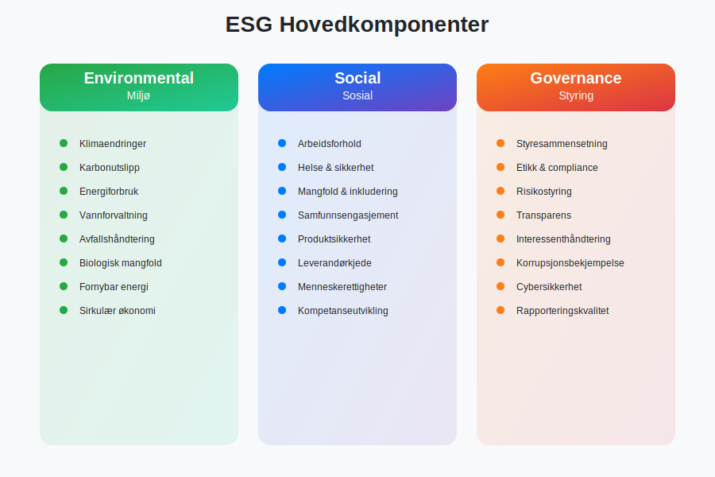
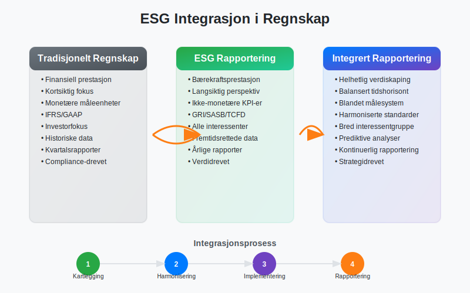
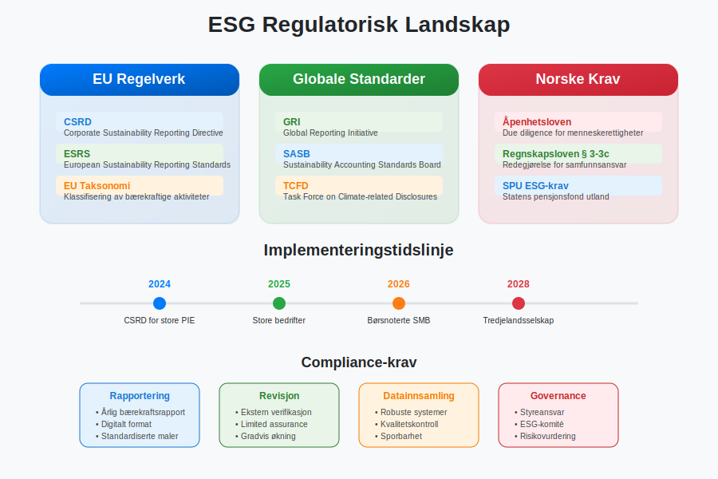
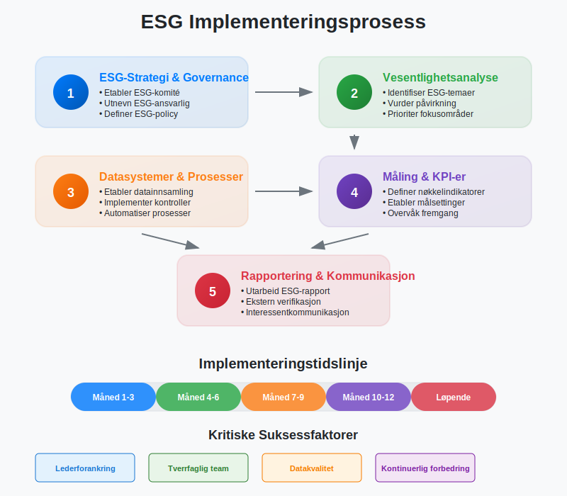
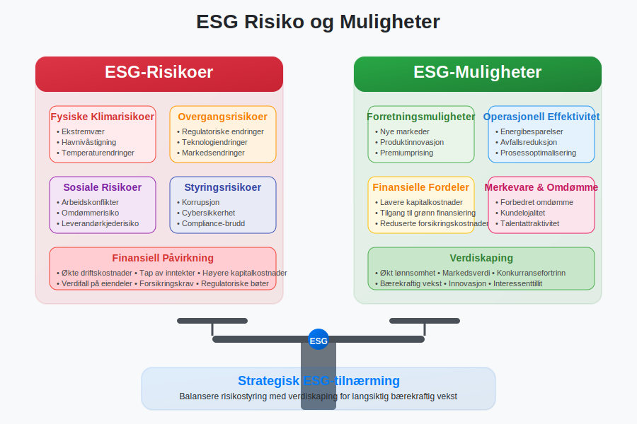
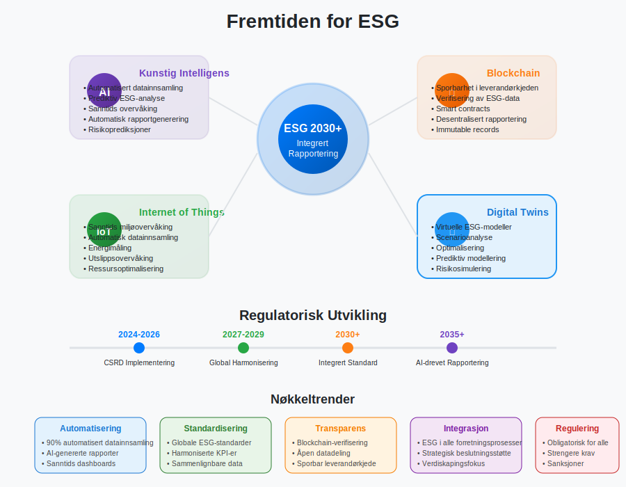

---
title: "Hva er ESG?"
seoTitle: "Hva er ESG?"
description: '**ESG** (Environmental, Social, Governance) representerer et rammeverk for å evaluere og rapportere om en virksomhets bærekraftsprestasjon og samfunnsansvar. ...'
---

**ESG** (Environmental, Social, Governance) representerer et rammeverk for å evaluere og rapportere om en virksomhets bærekraftsprestasjon og samfunnsansvar. Dette konseptet har revolusjonert moderne regnskap og finansiell rapportering, og er blitt en kritisk komponent for bedrifter som ønsker å demonstrere sitt engasjement for bærekraftig utvikling og ansvarlig forretningsdrift.

[ESG-rapportering](/blogs/regnskap/baerekraftsrapportering "Bærekraftsrapportering: En komplett guide til bærekraftsrapportering") er ikke lenger bare en frivillig praksis, men blir i økende grad en lovpålagt forpliktelse. Med innføringen av [CSRD-direktivet](/blogs/regnskap/hva-er-csrd "Hva er CSRD? Corporate Sustainability Reporting Directive - Komplett Guide") i EU, må norske bedrifter som oppfyller visse kriterier nå rapportere omfattende bærekraftsinformasjon som en integrert del av sitt [årsregnskap](/blogs/regnskap/hva-er-regnskap "Hva er Regnskap? En Dybdeanalyse for Norge").

## Seksjon 1: ESG-Komponentene Forklart

ESG-rammeverket består av tre hovedpilarer som sammen gir et helhetlig bilde av en virksomhets bærekraftsprestasjon og samfunnsansvar.

### 1.1 Environmental (Miljø)

Den miljømessige komponenten fokuserer på hvordan en virksomhet påvirker det naturlige miljøet og hvordan miljørisiko kan påvirke virksomheten.

**Nøkkelområder inkluderer:**

* **Klimaendringer og karbonutslipp:** [Scope 1, 2 og 3 utslipp](/blogs/regnskap/hva-er-ghg-protokollen "Hva er GHG-protokollen? Komplett Guide til Klimarapportering og Regnskap") etter GHG-protokollen, karbonnøytralitetsmål
* **Energiforbruk og fornybar energi:** Energieffektivitet, overgang til grønne energikilder
* **Vannforvaltning:** Vannforbruk, vannkvalitet, avløpshåndtering
* **Avfallshåndtering:** Sirkulær økonomi, resirkulering, avfallsreduksjon
* **Biologisk mangfold:** Påvirkning på økosystemer og naturvern

### 1.2 Social (Sosial)

Den sosiale komponenten omhandler hvordan virksomheten behandler mennesker - både internt og eksternt.

**Viktige aspekter:**

* **Arbeidsforhold:** Arbeidsmiljø, helse og sikkerhet, [arbeidskapital](/blogs/regnskap/hva-er-arbeidskapital "Hva er Arbeidskapital? En Komplett Guide til Working Capital") optimalisering
* **Mangfold og inkludering:** Likestilling, ikke-diskriminering, representasjon
* **Samfunnsengasjement:** Lokale samfunn, filantropi, samfunnsutvikling
* **Produktsikkerhet:** Kvalitet, sikkerhet, forbrukerbeskyttelse
* **Leverandørkjede:** Etiske standarder, menneskerettigheter

### 1.3 Governance (Styring)

Styringskomponenten fokuserer på hvordan virksomheten ledes og kontrolleres.

**Sentrale elementer:**

* **Styresammensetning:** Uavhengighet, kompetanse, mangfold
* **Etikk og compliance:** Etiske retningslinjer, korrupsjonsbekjempelse
* **Risikostyring:** Identifisering og håndtering av ESG-risiko
* **Transparens:** Åpenhet i rapportering og kommunikasjon
* **Interessenthåndtering:** Balansering av ulike interessentgrupper

## Seksjon 2: ESG i Regnskapssammenheng

ESG-rapportering krever en fundamental endring i hvordan bedrifter tenker om [finansregnskap](/blogs/regnskap/hva-er-finansregnskap "Hva er Finansregnskap? En Komplett Guide til Ekstern Finansiell Rapportering") og rapportering.

### 2.1 Bærekraftsregnskap vs. Tradisjonelt Regnskap

| Aspekt | Tradisjonelt Regnskap | Bærekraftsregnskap |
|--------|----------------------|-------------------|
| **Fokus** | Finansiell prestasjon | Trippel bunnlinje (People, Planet, Profit) |
| **Tidshorisont** | Kortsiktig (kvartalsvis/årlig) | Lang- og kortsiktig |
| **Målgruppe** | Investorer, kreditorer | Alle interessenter |
| **Måleenheter** | Primært monetære | Monetære og ikke-monetære |
| **Rapporteringsstandard** | [IFRS](/blogs/regnskap/hva-er-regnskap "Hva er Regnskap? En Dybdeanalyse for Norge"), [god regnskapsskikk](/blogs/regnskap/god-regnskapsskikk "God Regnskapsskikk - Prinsipper, Standarder og Beste Praksis i Norge") | GRI, SASB, TCFD, ESRS |

### 2.2 ESG-Måling og KPI-er

Effektiv ESG-rapportering krever robuste målesystemer og nøkkelindikatorer (KPI-er).

**Miljømessige KPI-er:**
* CO2-utslipp per omsetningskrone
* Energiintensitet (kWh per produsert enhet)
* Vannforbruk per ansatt
* Avfallsreduksjon i prosent

**Sosiale KPI-er:**
* Ansatturnover og tilfredshet
* Kjønnsbalanse i ledelsen
* Arbeidsskader per 100 000 arbeidstimer
* Investeringer i kompetanseutvikling

**Styrings-KPI-er:**
* Andel uavhengige styremedlemmer
* Etikkbrudd rapportert og håndtert
* Compliance-score
* Interessentengasjement-indeks

## Seksjon 3: Regulatoriske Krav og Standarder

ESG-rapportering er underlagt et komplekst nettverk av nasjonale og internasjonale reguleringer og standarder.

### 3.1 CSRD og ESRS

**Corporate Sustainability Reporting Directive (CSRD)** er EUs nye direktiv som krever omfattende bærekraftsrapportering. For norske bedrifter som faller inn under direktivets virkeområde, innebærer dette:

* **Obligatorisk rapportering:** Ikke lenger frivillig for store bedrifter
* **Standardiserte krav:** European Sustainability Reporting Standards (ESRS)
* **Ekstern revisjon:** Bærekraftsrapporter må revideres
* **Digital format:** Rapporter må være maskinlesbare

**Virkeområde for norske bedrifter:**
* Store offentlige interesseforetak (PIE) med >500 ansatte
* Store bedrifter med >250 ansatte eller omsetning >40 mill. EUR
* Børsnoterte SMB-er (fra 2026)

### 3.2 Internasjonale ESG-Standarder

| Standard | Fokusområde | Anvendelse |
|----------|-------------|------------|
| **GRI (Global Reporting Initiative)** | Omfattende bærekraftsrapportering | Globalt anerkjent, modulær tilnærming |
| **SASB (Sustainability Accounting Standards Board)** | Bransjespesifikke standarder | Finansielt vesentlige ESG-faktorer |
| **TCFD (Task Force on Climate-related Financial Disclosures)** | Klimarelaterte finansielle risikoer | Klimarapportering og scenarioanalyse |
| **ISSB (International Sustainability Standards Board)** | Globale bærekraftsstandarder | Harmonisering av internasjonale krav |

### 3.3 Norske Krav og Initiativer

Norge har implementert flere nasjonale krav og initiativer for ESG-rapportering:

* **Åpenhetsloven:** Krav om due diligence for menneskerettigheter og anstendige arbeidsforhold
* **Regnskapsloven § 3-3c:** Krav om redegjørelse for samfunnsansvar
* **Statens pensjonsfond:** ESG-krav for investeringer
* [EU-taksonomien](/blogs/regnskap/hva-er-eu-taksonomien "EU-taksonomien: Klassifiseringssystem for Bærekraftige Aktiviteter") “ Klassifisering av bærekraftige økonomiske aktiviteter

## Seksjon 4: Praktisk Implementering av ESG

Implementering av ESG-rapportering krever en systematisk tilnærming og integrering med eksisterende regnskapssystemer.

### 4.1 ESG-Strategi og Governance

**Steg 1: Etablere ESG-Governance**
* Opprett ESG-komité på styrenivå
* Utnevn ESG-ansvarlig på ledernivå
* Integrer ESG i [forretningsplan](/blogs/regnskap/hva-er-forretningsplan "Hva er en Forretningsplan? Komplett Guide til Utarbeidelse og Implementering")
* Definer ESG-policy og mål

**Steg 2: Vesentlighetsanalyse**
* Identifiser relevante ESG-temaer for bransjen
* Vurder påvirkning og viktighet for interessenter
* Prioriter fokusområder basert på vesentlighet
* Dokumenter beslutningsprosess

### 4.2 Datainnsamling og Måling

Effektiv ESG-rapportering krever robuste systemer for datainnsamling og kvalitetssikring.

**Datakilder og systemer:**

* **Interne systemer:** [ERP-systemer](/blogs/regnskap/hva-er-erp-system "Hva er ERP-system? En Komplett Guide til Enterprise Resource Planning"), HR-systemer, energimålere
* **Eksterne kilder:** Leverandørdata, tredjepartsverifikasjoner, offentlige databaser
* **Automatisering:** IoT-sensorer, AI-drevne analyser, integrerte rapporteringsplattformer

**Kvalitetssikring:**
* Etabler kontrollrutiner tilsvarende [finansregnskap](/blogs/regnskap/hva-er-finansregnskap "Hva er Finansregnskap? En Komplett Guide til Ekstern Finansiell Rapportering")
* Implementer [avstemming](/blogs/regnskap/hva-er-avstemming "Hva er Avstemming i Regnskap? Komplett Guide til Regnskapsavstemming") av ESG-data
* Utfør regelmessige datakvalitetsrevisjoner
* Dokumenter datakilder og beregningsmetoder

### 4.3 Rapportering og Kommunikasjon

**Rapporteringsformater:**
* **Integrert rapport:** Kombinerer finansiell og bærekraftsinformasjon
* **Separat bærekraftsrapport:** Dedikert ESG-rapport
* **Digitale plattformer:** Interaktive dashboards og online-rapporter

**Kommunikasjonsstrategi:**
* Tilpass budskap til ulike interessentgrupper
* Bruk visualiseringer og infografikk
* Vær transparent om utfordringer og forbedringspunkter
* Oppdater regelmessig på fremgang mot mål

## Seksjon 5: ESG-Risiko og Muligheter

ESG-faktorer representerer både betydelige risikoer og muligheter for moderne virksomheter.

### 5.1 ESG-Risikoer

**Fysiske klimarisikoer:**
* Ekstremvær og naturkatastrofer
* Havnivåstigning og oversvømmelser
* Temperaturendringer og tørke
* Påvirkning på [anleggsmidler](/blogs/regnskap/hva-er-anleggsmidler "Hva er Anleggsmidler? Komplett Guide til Varige Driftsmidler") og drift

**Overgangsrisikoer:**
* Regulatoriske endringer og karbonskatt
* Teknologiske endringer og stranded assets
* Markedsendringer og forbrukerpreferanser
* Omdømmerisiko og merkevaresvekking

**Sosiale og styringsrisikoer:**
* Arbeidskonflikter og streiker
* Korrupsjon og etikkbrudd
* Cybersikkerhet og databeskyttelse
* Leverandørkjederisiko

### 5.2 ESG-Muligheter

**Forretningsmuligheter:**
* Nye markeder for bærekraftige produkter
* Kostnadsbesparelser gjennom energieffektivitet
* Tilgang til grønn finansiering
* Forbedret merkevare og kundelojalitet

**Finansielle fordeler:**
* Lavere kapitalkostnader
* Redusert forsikringspremier
* Økt [egenkapitalrentabilitet](/blogs/regnskap/hva-er-egenkapitalrentabilitet "Hva er Egenkapitalrentabilitet? Beregning, Analyse og Benchmarking")
* Bedre tilgang til investorer

## Seksjon 6: ESG og Finansiell Prestasjon

Forskning viser en stadig sterkere sammenheng mellom ESG-prestasjon og finansiell ytelse.

### 6.1 ESG-Påvirkning på Finansielle Nøkkeltall

| Finansiell Indikator | ESG-Påvirkning | Mekanisme |
|---------------------|----------------|-----------|
| **[Bruttofortjeneste](/blogs/regnskap/hva-er-bruttofortjeneste "Hva er Bruttofortjeneste? Beregning, Analyse og Optimalisering")** | Positiv | Premiumprising for bærekraftige produkter |
| **[Driftskostnader](/blogs/regnskap/hva-er-driftskostnader "Hva er Driftskostnader? Typer, Beregning og Regnskapsføring - Komplett Guide")** | Negativ | Energieffektivitet og avfallsreduksjon |
| **Kapitalkostnader** | Negativ | Lavere risikopremie fra investorer |
| **[Arbeidskapital](/blogs/regnskap/hva-er-arbeidskapital "Hva er Arbeidskapital? En Komplett Guide til Working Capital")** | Variabel | Forbedret leverandørforhold og kundelojalitet |

### 6.2 ESG-Investeringer og ROI

**Kategorier av ESG-investeringer:**

* **Operasjonelle forbedringer:** Energieffektivisering, avfallsreduksjon
* **Teknologioppgraderinger:** Fornybar energi, digitalisering
* **Menneskelige ressurser:** Kompetanseutvikling, mangfold og inkludering
* **Governance-systemer:** Compliance-systemer, risikostyring

**Måling av ESG-ROI:**
* Direkte kostnadsbesparelser
* Inntektsøkning fra nye produkter/markeder
* Risikoreduktion og forsikringsbesparelser
* Merkeverdiforbedring og kundelojalitet

## Seksjon 7: Fremtiden for ESG-Rapportering

ESG-rapportering vil fortsette å utvikle seg med nye teknologier, standarder og regulatoriske krav.

### 7.1 Teknologiske Trender

**Kunstig intelligens og maskinlæring:**
* Automatisert datainnsamling og analyse
* Prediktiv modellering av ESG-risikoer
* Sanntids ESG-overvåking
* Forbedret datakvalitet og konsistens

**Blockchain og transparens:**
* Sporbarhet i leverandørkjeden
* Verifisering av ESG-data
* Smart contracts for ESG-mål
* Desentralisert rapportering

**IoT og sensorer:**
* Sanntids miljøovervåking
* Automatisk datainnsamling
* Forbedret nøyaktighet i måling
* Reduserte rapporteringskostnader

### 7.2 Regulatoriske Utviklinger

**Forventede endringer:**
* Utvidelse av CSRD til flere bedrifter
* Harmonisering av globale standarder
* Strengere verifikasjonskrav
* Integrering med skattelovgivning

**Implikasjoner for norske bedrifter:**
* Økte compliance-kostnader
* Behov for spesialisert kompetanse
* Investeringer i nye systemer
* Konkurransefordeler for early adopters

## Konklusjon

ESG-rapportering har utviklet seg fra en frivillig praksis til en kritisk forretningsfunksjon som påvirker alt fra [finansiering](/blogs/regnskap/hva-er-finansiering "Hva er Finansiering? Komplett Guide til Finansieringsformer og Kapitalstruktur") til operasjonell effektivitet. For norske bedrifter representerer dette både en utfordring og en mulighet til å demonstrere lederskap innen bærekraftig forretningsdrift.

Suksessful ESG-implementering krever:
* **Strategisk tilnærming:** Integrering med forretningsstrategi og [finansregnskap](/blogs/regnskap/hva-er-finansregnskap "Hva er Finansregnskap? En Komplett Guide til Ekstern Finansiell Rapportering")
* **Robuste systemer:** Pålitelige data- og rapporteringssystemer
* **Kompetanseutvikling:** Opplæring av personale i ESG-prinsipper og -praksis
* **Kontinuerlig forbedring:** Regelmessig evaluering og oppdatering av ESG-tiltak

Bedrifter som omfavner ESG-rapportering tidlig vil være bedre posisjonert for fremtidens regulatoriske krav og markedsforventninger, samtidig som de kan realisere betydelige forretningsmessige fordeler gjennom forbedret risikostyring, kostnadseffektivitet og interessenttillit.

ESG er ikke bare en rapporteringsøvelse, men en fundamental endring i hvordan vi tenker om verdiskaping og forretningssuksess i det 21. århundre. For regnskapsførere og finansielle ledere representerer dette en spennende mulighet til å utvide sin rolle og bidra til mer bærekraftig og ansvarlig forretningsdrift.

