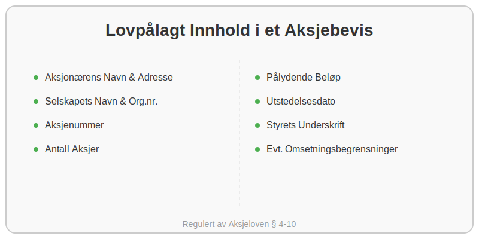

---
title: "Hva er et Aksjebevis? En Komplett Guide"
meta_title: "Hva er et Aksjebevis? En Komplett Guide"
meta_description: 'Et **aksjebevis** er et fundamentalt og juridisk bindende dokument som beviser at en person eller et selskap (en aksjonær) eier en eller flere aksjer i et [aks...'
slug: hva-er-et-aksjebevis
type: blog
layout: pages/single
---

Et **aksjebevis** er et fundamentalt og juridisk bindende dokument som beviser at en person eller et selskap (en aksjonær) eier en eller flere aksjer i et [aksjeselskap (AS)](/blogs/regnskap/hva-er-et-aksjeselskap "Hva er et aksjeselskap?"). Selv om mange prosesser har blitt digitale, er den juridiske rollen til aksjebeviset fortsatt sentral i norsk selskapsrett, regulert av [Aksjeloven](/blogs/regnskap/hva-er-aksjeloven "Utforsk Aksjeloven i detalj").

I praksis fungerer aksjebeviset som en kvittering og et offisielt eierskapsbevis. Det gir aksjonæren rettigheter i selskapet, som stemmerett på generalforsamling, rett til utbytte og informasjonsrettigheter.

## Hvorfor er Aksjebevis Viktig?

Aksjebeviset har flere kritiske funksjoner, både for aksjonæren og for selskapet:

*   **Juridisk Bevis:** Det er det endelige beviset på eierskap. Ved tvister eller uenighet er det aksjebeviset som gjelder.
*   **Oversikt og Kontroll:** For selskapet er utstedelse av aksjebevis en del av plikten til å føre en oversikt over alle aksjonærer i [aksjeeierboken](/blogs/regnskap/hva-er-en-aksjeeierbok "Alt om Aksjeeierboken").
*   **Omsettelighet:** Dokumentet er nødvendig ved salg eller overføring av aksjer. Kjøperen vil kreve å se aksjebeviset som bevis på selgerens reelle eierskap.
*   **Sikkerhet:** Aksjebevis kan brukes som sikkerhet ved lån (pantsettelse), selv om dette er mindre vanlig for fysiske bevis i dag.

## Hva Skal et Aksjebevis Inneholde?

I henhold til **Aksjeloven § 4-10** er det klare krav til hva et aksjebevis *skal* inneholde. Manglende eller feilaktig informasjon kan i verste fall gjøre beviset ugyldig.

Her er en oversikt over de lovpålagte punktene:

| Informasjonselement          | Beskrivelse                                                                                                                                 | Hvorfor er det viktig?                                                                         |
| --------------------------- | ------------------------------------------------------------------------------------------------------------------------------------------- | ---------------------------------------------------------------------------------------------- |
| **Aksjonærens Navn og Adresse** | Fullt navn og bosteds- eller forretningsadresse til eieren.                                                                                  | Identifiserer eieren av aksjene entydig.                                                       |
| **Selskapets Navn og Org.nr.**  | Fullt juridisk navn på selskapet og dets [organisasjonsnummer](/blogs/regnskap/hva-er-organisasjonsnummer "Hva er et organisasjonsnummer?"). | Knytter aksjene til riktig selskap.                                                            |
| **Aksjenummer**               | Et løpenummer eller en serie med numre for de aksjene beviset gjelder.                                                                       | Unik identifikasjon av hver enkelt [aksje](/blogs/regnskap/hva-er-en-aksje "Les mer om aksjer"). |
| **Antall Aksjer**             | Det totale antallet aksjer som aksjebeviset omfatter.                                                                                       | Definerer omfanget av eierskapet.                                                              |
| **Pålydende Beløp**           | Aksjens nominelle verdi. Summen av pålydende for alle aksjer utgjør selskapets [aksjekapital](/blogs/regnskap/hva-er-aksjekapital "Guide til aksjekapital"). | Viser den opprinnelige verdien per aksje ved stiftelse.                                        |
| **Utstedelsesdato**           | Datoen da aksjebeviset ble formelt utstedt av selskapets styre.                                                                             | Dokumenterer tidspunktet for eierskapets formalisering.                                        |
| **Styrets Underskrift**       | Underskrift fra minst ett styremedlem.                                                                                                      | Bekrefter at styret har godkjent og utstedt beviset.                                           |
| **Eventuelle Omsetningsbegrensninger** | Hvis selskapets [vedtekter](/blogs/regnskap/hva-er-vedtekter-for-aksjeselskap "Slik skriver du vedtekter for AS") har regler om [forkjøpsrett](/blogs/regnskap/forkjopsrett "Hva er en Forkjøpsrett? Retten til å kjøpe aksjer før eksterne") eller krav om styrets samtykke ved salg. | Informerer eieren og potensielle kjøpere om begrensninger i aksjens frie omsettelighet. |

## Fra Fysisk til Digitalt: Fremtidens Aksjebevis

Selv om loven fortsatt beskriver et fysisk eller elektronisk dokument, har utviklingen gått mot digitale løsninger. Mange selskaper, spesielt de som er registrert i Verdipapirsentralen (VPS), har ikke lenger fysiske aksjebevis. I stedet er eierskapet registrert elektronisk.

*   **Fordeler med digitale aksjebevis:**
    *   **Enkelhet:** Raskere og enklere å overføre eierskap.
    *   **Sikkerhet:** Redusert risiko for tap, tyveri eller forfalskning.
    *   **Effektivitet:** Lettere for selskapet å administrere aksjeeierboken.

For de fleste små og mellomstore aksjeselskaper som ikke er på børs eller i VPS, er det likevel vanlig praksis å utstede et fysisk eller et signert PDF-dokument som aksjebevis. Dette gir en trygghet og en formalitet som mange verdsetter.

## Hva Gjør du Hvis du Mister et Aksjebevis?

Å miste et aksjebevis kan skape problemer, spesielt hvis du skal selge aksjene dine. Hvis uhellet er ute, må aksjebeviset mortifiseres (kjennes ugyldig). Dette er en formell prosess som innebærer:

1.  **Melding til Selskapet:** Informer styret i selskapet umiddelbart.
2.  **Kunngjøring:** Selskapet må ofte kunngjøre at aksjebeviset er tapt, for eksempel i Brønnøysundregistrenes elektroniske kunngjøringsavis.
3.  **Venteperiode:** Det er en lovpålagt venteperiode for å se om noen med rette interesser melder seg.
4.  **Nytt Aksjebevis:** Etter venteperioden kan styret utstede et nytt aksjebevis som erstatter det tapte.

Denne prosessen understreker viktigheten av å oppbevare aksjebevis på et trygt sted.

## Oppsummering

Et aksjebevis er mer enn bare et papir; det er selve kjernen i eierskapsdokumentasjonen i et aksjeselskap. Det sikrer rettighetene til aksjonæren og gir selskapet en formell oversikt over sine eiere. Enten det er et fysisk dokument eller en digital registrering, er formålet det samme: å skape **trygghet, klarhet og forutsigbarhet** rundt eierskapet i norske selskaper. For enhver som eier, kjøper eller selger aksjer, er en grunnleggende forståelse av aksjebeviset helt essensielt.

