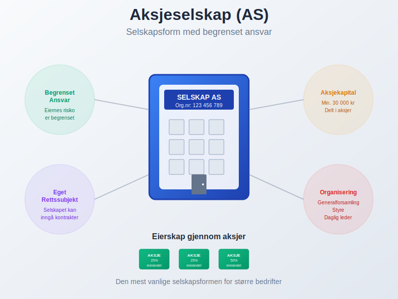
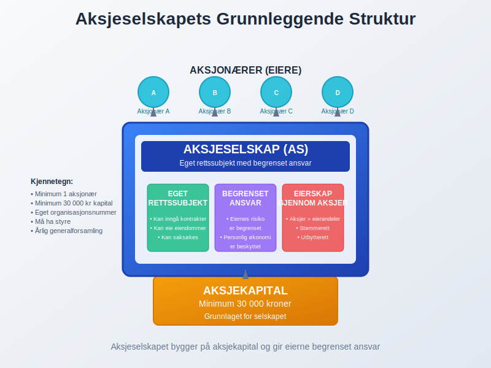

For en oversikt over ulike selskapsformer i Norge, se [Selskapsform](/blogs/regnskap/selskapsform "Selskapsform: Oversikt over selskapsformer i Norge").

Et **aksjeselskap (AS)** er en [foretaksform](/blogs/regnskap/hva-er-foretak "Hva er et Foretak? Komplett Guide til Foretaksformer i Norge") hvor eierskapet er delt inn i [aksjer](/blogs/regnskap/hva-er-en-aksje "Hva er en Aksje? En Enkel Forklaring"), og hvor hver eier mottar et [**aksjebevis**](/blogs/regnskap/hva-er-et-aksjebevis "Hva er et Aksjebevis? En Komplett Guide") som bevis på sitt eierskap. Dette er den mest vanlige selskapsformen for større bedrifter i Norge, og den gir eierne begrenset ansvar for selskapets forpliktelser.

En spesiell type aksjeselskap er **allmennaksjeselskap (ASA)**, som er tilpasset større virksomheter og børsnotering. Les mer i vår guide om [Hva er ASA? En Guide til Allmennaksjeselskap (ASA)](/blogs/regnskap/hva-er-asa "Hva er ASA? En Guide til Allmennaksjeselskap (ASA)").

For en enkel steg-for-steg veiledning om hvordan du **starter et AS**, se [Starte AS](/blogs/regnskap/starte-as "Starte AS: Steg-for-steg guide til å stifte aksjeselskap").

For informasjon om gebyr ved registrering, se [Stiftelsesgebyr](/blogs/regnskap/stiftelsesgebyr "Stiftelsesgebyr ved registrering av AS").

### Hva Kjennetegner et Aksjeselskap?

Et aksjeselskap skiller seg fra andre selskapsformer på flere viktige måter:

#### Begrenset Ansvar
Den viktigste egenskapen ved et aksjeselskap er at **aksjonærene har begrenset ansvar**. Dette betyr at du som eier normalt ikke kan tape mer enn det du har investert i selskapet. Hvis selskapet går konkurs, er din personlige økonomi beskyttet.

#### Eget Rettssubjekt
Aksjeselskapet er et **eget rettssubjekt** og en [juridisk person](/blogs/regnskap/hva-er-juridisk-person "Hva er en Juridisk Person? Komplett Guide til Juridiske Personer i Regnskap"), helt adskilt fra eierne. Selskapet kan:
- Inngå kontrakter i eget navn
- Eie eiendommer og andre verdier
- Saksøke og bli saksøkt
- Ha egne rettigheter og forpliktelser

#### Aksjekapital
For å starte et aksjeselskap må du ha en minimum [aksjekapital](/blogs/regnskap/hva-er-aksjekapital "Hva er Aksjekapital? Krav og Forklaring") på **30 000 kroner**. Denne kapitalen deles inn i aksjer som representerer eierandelene i selskapet.

Et alternativ til å stifte et nytt selskap er å kjøpe et **hylleselskap**, det vil si et ferdigregistrert aksjeselskap uten drift. Dette gir **raskere oppstart**, siden selskapet allerede er registrert. Les mer om hva et hylleselskap er i vår guide [Hylleselskap](/blogs/regnskap/hylleselskap "Hva er et Hylleselskap? Guide til Ferdigregistrerte Selskaper i Norge").

### Krav for å Starte et Aksjeselskap

[Aksjeloven](/blogs/regnskap/hva-er-aksjeloven "Hva er Aksjeloven? Regler for Aksjeselskaper i Norge") stiller flere krav til opprettelse av et aksjeselskap:

#### Minimum Aksjekapital
- **30 000 kroner** i aksjekapital
- Kapitalen må være fullt innbetalt før registrering
- Kan bestå av penger eller andre verdier (tingsinnskudd)

#### Stiftere
- Minimum **én stifter** (kan være person eller selskap)
- Stifterne må tegne alle aksjene ved opprettelse
- Norske statsborgere eller EU/EØS-borgere kan være stiftere

#### Vedtekter
- Selskapet må ha **vedtekter** som fungerer som selskapets "grunnlov"
- Vedtektene må inneholde obligatoriske opplysninger som selskapsnavn, formål og aksjekapital

#### Styre
- Selskapet må ha minimum **ett styremedlem**
- Styret er ansvarlig for forvaltningen av selskapet
- Styremedlemmer velges av generalforsamlingen
- Styremedlemmer kan motta [honorar](/blogs/regnskap/hva-er-honorar "Hva er Honorar i Regnskap? Komplett Guide til Honorarutbetalinger og Skattebehandling") for sitt arbeid
- Ansatte kan tilbys [opsjonsavtaler](/blogs/regnskap/hva-er-opsjonsavtale "Hva er en Opsjonsavtale? Komplett Guide til Opsjoner i Regnskap") som incentivordning

### Organisering av et Aksjeselskap

Et aksjeselskap har en klar organisasjonsstruktur regulert av aksjeloven:

#### Generalforsamling
- **Øverste organ** i selskapet
- Alle aksjonærer har rett til å delta
- Treffer de viktigste beslutningene som valg av styre og godkjenning av årsregnskap

#### Styre
- **Ledelsesorgan** som forvalter selskapet
- Ansvarlig for den overordnede strategien og kontrollen
- Kan ansette [daglig leder](/blogs/regnskap/hva-er-daglig-leder "Hva er Daglig Leder? Rolle, Ansvar og Regnskapsmessige Forpliktelser")

#### Daglig Leder
- **Operativ leder** (ikke obligatorisk)
- Ansvarlig for den daglige driften
- Rapporterer til styret
- Fungerer ofte som [forretningsfører](/blogs/regnskap/hva-er-forretningsforer "Hva er en Forretningsfører? Komplett Guide til Roller, Ansvar og Krav") med det daglige ansvaret for virksomheten

### Fordeler med Aksjeselskap

#### Begrenset Ansvar
Som nevnt er den største fordelen at eiernes ansvar er begrenset til aksjekapitalen.

#### Tilgang til Kapital
- Enkelt å hente inn ny kapital ved å utstede nye aksjer
- Kan ha mange eiere uten kompliserte avtaler
- Mulighet for [ulike aksjeklasser](/blogs/regnskap/hva-er-aksjeklasser "Hva er Aksjeklasser? A-aksjer og B-aksjer Forklart") med forskjellige rettigheter
- Attraktivt for investorer som søker [avkastning](/blogs/regnskap/hva-er-avkastning "Hva er Avkastning? Komplett Guide til Investeringsavkastning og Beregning") gjennom utbytte og kursstigning
- Investorer kan vurdere selskapets lønnsomhet gjennom [egenkapitalrentabilitet](/blogs/regnskap/hva-er-egenkapitalrentabilitet "Hva er Egenkapitalrentabilitet? Komplett Guide til ROE Beregning") (ROE)

#### Kontinuitet
- Selskapet eksisterer uavhengig av eierne
- Enkelt å overføre eierskap ved salg av aksjer
- Selskapet fortsetter selv om eiere dør eller trekker seg ut
- [Aksjonæravtaler](/blogs/regnskap/aksjonaeravtale "Hva er en Aksjonæravtale? En Omfattende Guide til Aksjonæravtaler i Norge") kan regulere overføring av eierskap

#### Skattefordeler
- [Aksjonærmodellen](/blogs/regnskap/aksjonaermodellen "Aksjonærmodellen: Skattemodell for Utbytte og Gevinst") gir skatteoptimale utbytter gjennom skjermingsfradrag
- [Fritaksmetoden](/blogs/regnskap/hva-er-fritaksmetoden "Hva er Fritaksmetoden? Komplett Guide til Skattefritak for Utbytte") gir skattefritak for utbytte mellom selskaper
- Mulighet for strategisk utbytteutdeling innenfor [maskimalt utbytte](/blogs/regnskap/maskimalt-utbytte "Maskimalt Utbytte - Komplett Guide til Utbytteregler og Beregning") med optimalisering basert på [aksjonærmodellens](/blogs/regnskap/aksjonaermodellen "Aksjonærmodellen: Skattemodell for Utbytte og Gevinst") skjermingsfradrag
- Bedre muligheter for skatteplanlegging basert på [marginalskatt](/blogs/regnskap/hva-er-marginalskatt "Hva er Marginalskatt? Komplett Guide til Marginalskatt i Norge")
- Mulighet for [aksjonærlån](/blogs/regnskap/hva-er-aksjonaerlan-fra-as "Hva er Aksjonærlån fra AS? Regler, Skatt og Praktiske Råd") med markedsmessige vilkår
- For selskaper innen naturressurser kan [grunnrenteskatt](/blogs/regnskap/hva-er-grunnrenteskatt "Hva er Grunnrenteskatt? Komplett Guide til Norsk Grunnrenteskatt") være relevant
- Landbruksselskaper kan dra nytte av [jordbruksfradrag](/blogs/regnskap/hva-er-jordbruksfradrag "Hva er Jordbruksfradrag? Komplett Guide til Landbruksfradrag og Skattefordeler") som tilkommer selskapet

For en komplett oversikt over alle skatteordninger som gjelder for aksjeselskap og aksjonærer, se vår [Aksjonærmodellen - Komplett Guide til Norsk Aksjebeskatning](/blogs/regnskap/aksjonaermodellen-guide "Aksjonærmodellen - Komplett Guide til Norsk Aksjebeskatning").

#### Finansieringsmuligheter
- **[Egenfinansiering](/blogs/regnskap/hva-er-egenfinansiering "Hva er Egenfinansiering? Komplett Guide til Egenkapitalfinansiering")** - Finansiering gjennom [egenkapital](/blogs/regnskap/hva-er-egenkapital "Hva er Egenkapital? Komplett Guide til Egenkapital i Regnskap") fra eierne uten å skape gjeld
- Aksjonærer kan [låne penger til selskapet](/blogs/regnskap/hva-er-aksjonaerlan-til-as "Hva er Aksjonærlån til AS? Finansiering, Skatt og Praktiske Råd") for rask kapitalinnsprøytning
- Fleksibel finansiering uten å utvanne eierandelene
- Alternativ til tradisjonell bankfinansiering
- Moderne finansieringsmetoder som [crowdfunding](/blogs/regnskap/hva-er-crowdfunding "Hva er Crowdfunding i Regnskap? Regnskapsføring, Skatt og Juridiske Krav") og [crowdlending](/blogs/regnskap/hva-er-crowdlending "Hva er Crowdlending i Regnskap? P2P Utlån, Regnskapsføring og Skattemessige Konsekvenser") gir tilgang til kapital fra mange små investorer
- [Inkubatorer](/blogs/regnskap/hva-er-inkubator "Hva er en Inkubator? Komplett Guide til Bedriftsinkubatorer i Norge") tilbyr finansiering kombinert med mentorskap, nettverk og forretningsutvikling for oppstartsselskaper

### Ulemper med Aksjeselskap

#### Kompleksitet
- Mer komplekse regler og krav enn enkle selskapsformer
- Krav til [regnskap](/blogs/regnskap/hva-er-regnskap "Hva er Regnskap? En komplett guide") og rapportering
- Må følge aksjelovens bestemmelser
- Ansvar for [MVA-rapportering](/blogs/regnskap/hva-er-avgiftsplikt-mva "Hva er Avgiftsplikt (MVA)? Komplett Guide til Merverdiavgift i Norge") - alle aksjeselskaper må registrere seg i [MVA-registeret](/blogs/regnskap/hva-er-mva-registeret "Hva er MVA-registeret? Komplett Guide til Merverdiavgiftsregisteret i Norge") uavhengig av omsetning
- Les mer om **[MVA-plikt](/blogs/regnskap/mva-plikt "MVA-plikt: Komplett Guide til Merverdiavgiftsplikt i Norge")** for aksjeselskaper
- Behov for strukturerte [anskaffelsesprosesser](/blogs/regnskap/hva-er-anskaffelser "Hva er Anskaffelser? En Komplett Guide til Offentlige og Private Innkjøp") for å håndtere innkjøp og leverandørforhold
- Spesielt komplekst for [engroshandel](/blogs/regnskap/hva-er-engroshandel "Hva er Engroshandel? Regnskap og Økonomistyring for Grossister") med omfattende lagerstyring og leverandørforhold
- Mange aksjeselskaper velger derfor å bruke **[ARS (Autorisert Regnskapsførerselskap)](/blogs/regnskap/hva-er-ars "Hva er ARS? Autorisert Regnskapsførerselskap - Krav, Fordeler og Prosess")** for å sikre korrekt håndtering av alle regnskapsmessige og juridiske krav

#### Kostnader
- Høyere oppstartskostnader (minimum 30 000 kr i aksjekapital)
- Løpende kostnader til regnskap og revisjon
- Registreringsgebyrer

#### Offentlighet
- Informasjon om selskapet er offentlig tilgjengelig
- Alle aksjonærer registreres i det offentlige [aksjonærregisteret](/blogs/regnskap/hva-er-aksjonaerregisteret "Hva er Aksjonærregisteret? Komplett Guide til Norges Aksjonærregister") gjennom [aksjonærregisteroppgaven](/blogs/regnskap/aksjonaerregisteroppgave "Hva er Aksjonærregisteroppgave? Komplett Guide til Årlig Rapportering"), og selskapet må selv føre en detaljert [aksjeeierbok](/blogs/regnskap/hva-er-en-aksjeeierbok "Hva er en Aksjeeierbok? En Komplett Guide").
- Årsregnskap må leveres til myndighetene
- Mindre fleksibilitet enn personlige selskapsformer

### Aksjeselskap vs. Andre Selskapsformer

For en detaljert sammenligning av alle [organisasjonsformer](/blogs/regnskap/organisasjonsform "Organisasjonsform: Komplett Guide til Selskapsformer i Norge") og veiledning i valg av riktig selskapsform, se vår omfattende guide.

#### [Enkeltpersonforetak](/blogs/regnskap/hva-er-enkeltpersonforetak "Hva er et Enkeltpersonforetak? Komplett Guide til Selskapsformen")
- **Aksjeselskap:** Begrenset ansvar, egen juridisk person
- **[Enkeltpersonforetak](/blogs/regnskap/hva-er-enkeltpersonforetak "Hva er et Enkeltpersonforetak? Komplett Guide til Selskapsformen"):** Ubegrenset personlig ansvar, enklere struktur

#### [Ansvarlig Selskap (ANS)](/blogs/regnskap/ansvarlig-selskap-delt-ansvar "Ansvarlig Selskap og Delt Ansvar: Komplett Guide til ANS")
- **Aksjeselskap:** Eierne har begrenset ansvar
- **ANS:** Deltakerne har ubegrenset solidarisk ansvar

#### Allmennaksjeselskap (ASA)
- **AS:** Minimum 30 000 kr i aksjekapital, ikke børsnotert
- **ASA:** Minimum 1 million kr i aksjekapital, kan være børsnotert og må da publisere [kvartalsrapporter](/blogs/regnskap/hva-er-kvartalsrapport "Hva er Kvartalsrapport? Komplett Guide til Kvartalsrapportering i Norge")

### Praktiske Råd for Oppstart

Hvis du vurderer å starte et aksjeselskap:

1. **Utarbeid en forretningsplan:** En grundig [forretningsplan](/blogs/regnskap/hva-er-forretningsplan "Hva er Forretningsplan? Komplett Guide til Forretningsplanlegging og Regnskapsoppfølging") er essensielt for å definere virksomhetens mål, finansieringsbehov og strategier
2. **Vurder behovet:** Er begrenset ansvar og tilgang til kapital viktig for din virksomhet?
3. **Planlegg kapitalen:** Sørg for at du har mer enn minimum 30 000 kr tilgjengelig
4. **Få juridisk hjelp:** Konsulter advokat eller regnskapsfører for vedtekter og opprettelse
5. **Velg riktig navn:** Sjekk at ønsket selskapsnavn er tilgjengelig
6. **Planlegg organisering:** Bestem hvem som skal være i styret og eventuelle [daglig leder](/blogs/regnskap/hva-er-daglig-leder "Hva er Daglig Leder? Rolle, Ansvar og Regnskapsmessige Forpliktelser")

### Relaterte Begreper

For å forstå aksjeselskaper fullt ut, bør du også sette deg inn i:

- **[Aksjer](/blogs/regnskap/hva-er-en-aksje "Hva er en Aksje? En Enkel Forklaring")** - Eierandelene i selskapet
- **[Aksjekapital](/blogs/regnskap/hva-er-aksjekapital "Hva er Aksjekapital? Krav og Forklaring")** - Selskapets grunnleggende kapital
- **[Aksjeklasser](/blogs/regnskap/hva-er-aksjeklasser "Hva er Aksjeklasser? A-aksjer og B-aksjer Forklart")** - Ulike typer aksjer med forskjellige rettigheter
- **[Aksjespleis](/blogs/regnskap/hva-er-aksjespleis "Hva er Aksjespleis? En Detaljert Guide")** - Sammenslåing av aksjer for å øke kursen
- **[Aksjesplitt](/blogs/regnskap/hva-er-aksjesplitt "Hva er en Aksjesplitt? En Komplett Guide")** - Oppdeling av aksjer for å senke kursen
- **[Aksjeloven](/blogs/regnskap/hva-er-aksjeloven "Hva er Aksjeloven? Regler for Aksjeselskaper i Norge")** - Loven som regulerer aksjeselskaper
- **[Aksjonærregisteret](/blogs/regnskap/hva-er-aksjonaerregisteret "Hva er Aksjonærregisteret? Komplett Guide til Norges Aksjonærregister")** - Offentlig register over alle aksjonærer
- **[Aksjonærregisteroppgave](/blogs/regnskap/aksjonaerregisteroppgave "Hva er Aksjonærregisteroppgave? Komplett Guide til Årlig Rapportering")** - Obligatorisk årlig rapportering av aksjonærinformasjon
- **[Aksjonærlån](/blogs/regnskap/hva-er-aksjonaerlan-fra-as "Hva er Aksjonærlån fra AS? Regler, Skatt og Praktiske Råd")** - Lån fra selskapet til aksjonærene
- **[Ansvarlig Selskap](/blogs/regnskap/ansvarlig-selskap "Ansvarlig Selskap (ANS): Komplett Guide til Norsk Regnskap og Ansvarsstruktur")** - Selskapsform med ubegrenset solidarisk ansvar
- **[Egenfinansiering](/blogs/regnskap/hva-er-egenfinansiering "Hva er Egenfinansiering? Komplett Guide til Egenkapitalfinansiering")** - Finansiering gjennom [egenkapital](/blogs/regnskap/hva-er-egenkapital "Hva er Egenkapital? Komplett Guide til Egenkapital i Regnskap") fra eierne
- **[Egenkapital](/blogs/regnskap/hva-er-egenkapital "Hva er Egenkapital? Komplett Guide til Egenkapital i Regnskap")** - Eiernes netto formue i selskapet
- **[Egenkapitalrentabilitet](/blogs/regnskap/hva-er-egenkapitalrentabilitet "Hva er Egenkapitalrentabilitet? Komplett Guide til ROE Beregning")** - Måling av avkastning på egenkapital for investorer
- **[Holdingselskap](/blogs/regnskap/hva-er-holdingselskap "Hva er et Holdingselskap? Komplett Guide til Holdingselskaper i Norge")** - Spesialisert aksjeselskap som eier andre selskaper
- **[Juridisk Person](/blogs/regnskap/hva-er-juridisk-person "Hva er en Juridisk Person? Komplett Guide til Juridiske Personer i Regnskap")** - Grunnleggende konsept som forklarer hvorfor aksjeselskap har egen rettsevne
- **[Regnskap](/blogs/regnskap/hva-er-regnskap "Hva er Regnskap? En komplett guide")** - Regnskapsføring for aksjeselskaper
- **[Aksjonæravtale](/blogs/regnskap/aksjonaeravtale "Hva er en Aksjonæravtale? En Omfattende Guide til Aksjonæravtaler")** - Skriftlig avtale mellom aksjonærer om eierstyring og rettigheter

Et aksjeselskap er en kraftig selskapsform som gir fleksibilitet og beskyttelse, men krever også grundig planlegging og forståelse av regelverket.

